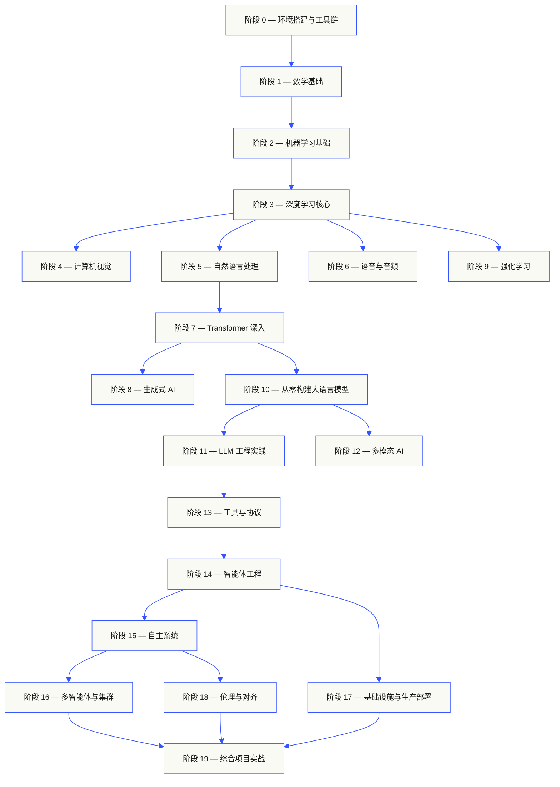
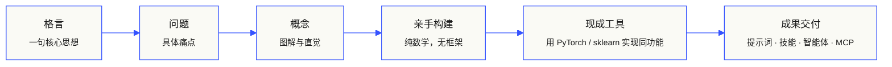

<p align="center">
  
</p>

<p align="center">
  <a href="LICENSE"></a>
  <a href="ROADMAP.md"></a>
  <a href="#contents"></a>
  <a href="https://github.com/rohitg00/ai-engineering-from-scratch/stargazers"></a>
  <a href="https://aiengineeringfromscratch.com"></a>
</p>

## 来自 [Agent Memory - #1 持久化记忆 ⭐](https://github.com/rohitg00/agentmemory) 作者的又一力作 <a href="https://github.com/rohitg00/agentmemory/stargazers"></a>，可无缝适配任何智能体或聊天助手。

```
░░░▒▒▒░░░▒▒▒░░░▒▒▒░░░▒▒▒░░░▒▒▒░░░▒▒▒░░░▒▒▒░░░▒▒▒░░░▒▒▒░░░▒▒▒░░░▒▒▒░░░▒▒▒░░░▒▒▒░░░▒▒▒░░░▒▒▒
```

> **84% 的学生已经在使用 AI 工具，但只有 18% 认为自己做好了专业应用的准备。**
> 这套课程体系就是为了弥补这一差距。
>
> 503 节课，20 个阶段，约 320 小时。Python、TypeScript、Rust、Julia。每节课都会产出一个
> 可复用的成果：一个提示词、一个技能、一个智能体、一个 MCP 服务器。免费、开源、MIT 协议。
>
> 你不仅仅是学习 AI。你是在亲手从头到尾构建它。

<!-- STATS:START (generated from site/stats.json by build.js — do not edit by hand) -->
<p align="center"><sub><b>150,639</b> 位读者 &nbsp;·&nbsp; <b>241,669</b> 次页面浏览（近 30 天）&nbsp;·&nbsp; 截至 2026-06-07</sub></p>
<!-- STATS:END -->

## 运作方式

大多数 AI 教学内容都是碎片化的——这里一篇论文，那里一篇微调教程，别处再一个花哨的智能体
演示。这些碎片很少能拼凑在一起。你能上线一个聊天机器人，却说不出它的损失曲线为何如此；
你能把一个函数接入智能体，却不清楚调用它的那个模型内部的注意力机制是怎么回事。

这套课程体系就是那条主线。20 个阶段，503 节课，四种语言：Python、TypeScript、Rust、Julia。
一端是线性代数，另一端是自主集群。每个算法都先从原始数学开始构建——反向传播、分词器、
注意力机制、智能体循环。等到 PyTorch 出场时，你早已清楚它底层在做什么。

每节课都遵循同样的循环：阅读问题 → 推导数学 → 编写代码 → 运行测试 → 保留成果。没有
五分钟短视频，没有复制粘贴式部署，也不手把手托着走。免费、开源，在你的笔记本上就能跑。

```
░░░▒▒▒░░░▒▒▒░░░▒▒▒░░░▒▒▒░░░▒▒▒░░░▒▒▒░░░▒▒▒░░░▒▒▒░░░▒▒▒░░░▒▒▒░░░▒▒▒░░░▒▒▒░░░▒▒▒░░░▒▒▒░░░▒▒▒
```

## 课程体系概貌

二十个阶段层层递进。数学是地基，智能体和生产部署是屋顶。如果你已经掌握了底层知识，
可以跳过去——但如果跳过后顶层出问题时，别来问为什么。



```
░░░▒▒▒░░░▒▒▒░░░▒▒▒░░░▒▒▒░░░▒▒▒░░░▒▒▒░░░▒▒▒░░░▒▒▒░░░▒▒▒░░░▒▒▒░░░▒▒▒░░░▒▒▒░░░▒▒▒░░░▒▒▒░░░▒▒▒
```

## 课程结构

每节课都拥有独立的文件夹，整个课程体系中保持统一的结构：

```
phases/<NN>-<阶段名称>/<NN>-<课程名称>/
├── code/      可运行的实现代码（Python、TypeScript、Rust、Julia）
├── docs/
│   └── en.md  课程讲义
└── outputs/   本节产出的提示词、技能、智能体或 MCP 服务器
```

每节课遵循六个环节。*亲手构建 / 现成工具*的二分法是核心——你首先从零实现算法，
然后用生产级库完成同样的操作。因为你已经亲手写过简化版，所以能够真正理解
框架底层在做什么。



## 快速开始

三种入口，任选其一。

**选项 A — 在线阅读。** 在 [aiengineeringfromscratch.com](https://aiengineeringfromscratch.com)
上打开任意已完成的课程，或在[目录](#contents)中展开任意阶段。无需设置，无需克隆。

**选项 B — 克隆并运行。**

```bash
git clone https://github.com/rohitg00/ai-engineering-from-scratch.git
cd ai-engineering-from-scratch
python phases/01-math-foundations/01-linear-algebra-intuition/code/vectors.py
```

**选项 C — 定位你的水平 *(推荐)*。** 智能跳过已掌握的内容。在 Claude、Cursor、Codex、OpenClaw、Hermes 或任何安装了课程技能的智能体中：

```bash
/find-your-level
```

十个问题。将你的知识匹配到合适的起始阶段，生成带有预估时间的个性化学习路径。每个阶段结束后：

```bash
/check-understanding 3        # 对阶段 3 进行自我测验
ls phases/03-deep-learning-core/05-loss-functions/outputs/
# ├── prompt-loss-function-selector.md
# └── prompt-loss-debugger.md
```

### 前置要求

- 你会写代码（任意语言；Python 更佳）。
- 你想了解 AI **究竟是怎样运作的**，而不只是调用 API。

### 内置智能体技能（Claude、Cursor、Codex、OpenClaw、Hermes）

| 技能 | 功能 |
|---|---|
| [`/find-your-level`](.claude/skills/find-your-level/SKILL.md) | 十道题的定位测试。将你的知识匹配到起始阶段，生成带有时间预估的个性化学习路径。 |
| [`/check-understanding <phase>`](.claude/skills/check-understanding/SKILL.md) | 逐阶段测验，八道题，附带反馈和需要复习的特定课程。 |

```
░░░▒▒▒░░░▒▒▒░░░▒▒▒░░░▒▒▒░░░▒▒▒░░░▒▒▒░░░▒▒▒░░░▒▒▒░░░▒▒▒░░░▒▒▒░░░▒▒▒░░░▒▒▒░░░▒▒▒░░░▒▒▒░░░▒▒▒
```

## 每节课都会产出成果

其他课程在结束时说*"恭喜你，你学会了 X"*。这里的每节课结束时都会交付一个
**可复用的工具**，你可以安装或粘贴到日常工作流中去用。

<table>
<tr>
<th align="left" width="25%"><br/><sub>FIG_001 · A</sub><br/><b>提示词</b></th>
<th align="left" width="25%"><br/><sub>FIG_001 · B</sub><br/><b>技能</b></th>
<th align="left" width="25%"><br/><sub>FIG_001 · C</sub><br/><b>智能体</b></th>
<th align="left" width="25%"><br/><sub>FIG_001 · D</sub><br/><b>MCP 服务器</b></th>
</tr>
<tr>
<td valign="top">粘贴到任意 AI 助手中，即可针对特定任务获得专家级帮助。</td>
<td valign="top">放入 Claude、Cursor、Codex、OpenClaw、Hermes 或任何能读取 <code>SKILL.md</code> 的智能体中即可使用。</td>
<td valign="top">作为自主工作器部署——你已在阶段 14 亲手编写过其执行循环。</td>
<td valign="top">接入任何 MCP 兼容客户端。在阶段 13 中已从头到尾构建完成。</td>
</tr>
</table>

> 使用 `python3 scripts/install_skills.py` 一次性安装全部。货真价实的工具，而非练习题。
> 完成整个课程后，你将拥有 503 件成果的作品集，并且因为你亲手构建了它们，你对它们了如指掌。

### FIG_002 · 实例展示

阶段 14，第 1 课：智能体循环。约 120 行纯 Python 代码，无外部依赖。

<table>
<tr>
<td valign="top" width="50%">

**`code/agent_loop.py`** &nbsp; <sub><i>亲手构建</i></sub>

```python
def run(query, tools):
    history = [user(query)]
    for step in range(MAX_STEPS):
        msg = llm(history)
        if msg.tool_calls:
            for call in msg.tool_calls:
                result = tools[call.name](**call.args)
                history.append(tool_result(call.id, result))
            continue
        return msg.content
    raise StepLimitExceeded
```

</td>
<td valign="top" width="50%">

**`outputs/skill-agent-loop.md`** &nbsp; <sub><i>成果交付</i></sub>

```markdown
---
name: agent-loop
description: 适用于任意工具列表的 ReAct 风格循环
phase: 14
lesson: 01
---

实现一个最小化智能体循环，它……
```

**`outputs/prompt-debug-agent.md`**

```markdown
你是一位智能体调试员。给定某次智能体
运行的追踪信息，找出智能体出错的步骤，
并解释原因……
```

</td>
</tr>
</table>

```
░░░▒▒▒░░░▒▒▒░░░▒▒▒░░░▒▒▒░░░▒▒▒░░░▒▒▒░░░▒▒▒░░░▒▒▒░░░▒▒▒░░░▒▒▒░░░▒▒▒░░░▒▒▒░░░▒▒▒░░░▒▒▒░░░▒▒▒
```

<a id="contents"></a>

## 目录

二十个阶段。点击任意阶段展开其课程列表。

<a id="phase-0"></a>
### 阶段 0：环境搭建与工具链 `12 节课`
> 为后续一切做好准备。

| # | 课程 | 类型 | 语言 |
|:---:|--------|:----:|------|
| 01 | [开发环境](phases/00-setup-and-tooling/01-dev-environment/) | 构建 | Python |
| 02 | [Git 与协作](phases/00-setup-and-tooling/02-git-and-collaboration/) | 学习 | — |
| 03 | [GPU 环境搭建与云端](phases/00-setup-and-tooling/03-gpu-setup-and-cloud/) | 构建 | Python |
| 04 | [API 与密钥管理](phases/00-setup-and-tooling/04-apis-and-keys/) | 构建 | Python |
| 05 | [Jupyter Notebooks](phases/00-setup-and-tooling/05-jupyter-notebooks/) | 构建 | Python |
| 06 | [Python 环境管理](phases/00-setup-and-tooling/06-python-environments/) | 构建 | Shell |
| 07 | [面向 AI 的 Docker](phases/00-setup-and-tooling/07-docker-for-ai/) | 构建 | Docker |
| 08 | [编辑器配置](phases/00-setup-and-tooling/08-editor-setup/) | 构建 | — |
| 09 | [数据管理](phases/00-setup-and-tooling/09-data-management/) | 构建 | Python |
| 10 | [终端与 Shell](phases/00-setup-and-tooling/10-terminal-and-shell/) | 学习 | — |
| 11 | [面向 AI 的 Linux](phases/00-setup-and-tooling/11-linux-for-ai/) | 学习 | — |
| 12 | [调试与性能分析](phases/00-setup-and-tooling/12-debugging-and-profiling/) | 构建 | Python |

<details id="phase-1">
<summary><b>阶段 1 — 数学基础</b> &nbsp;<code>22 节课</code>&nbsp; <em>每个 AI 算法背后的直觉，通过代码来理解。</em></summary>
<br/>

| # | 课程 | 类型 | 语言 |
|:---:|--------|:----:|------|
| 01 | [线性代数直觉](phases/01-math-foundations/01-linear-algebra-intuition/) | 学习 | Python, Julia |
| 02 | [向量、矩阵与运算](phases/01-math-foundations/02-vectors-matrices-operations/) | 构建 | Python, Julia |
| 03 | [矩阵变换与特征值](phases/01-math-foundations/03-matrix-transformations/) | 构建 | Python, Julia |
| 04 | [面向机器学习的微积分：导数与梯度](phases/01-math-foundations/04-calculus-for-ml/) | 学习 | Python |
| 05 | [链式法则与自动微分](phases/01-math-foundations/05-chain-rule-and-autodiff/) | 构建 | Python |
| 06 | [概率与分布](phases/01-math-foundations/06-probability-and-distributions/) | 学习 | Python |
| 07 | [贝叶斯定理与统计思维](phases/01-math-foundations/07-bayes-theorem/) | 构建 | Python |
| 08 | [优化：梯度下降家族](phases/01-math-foundations/08-optimization/) | 构建 | Python |
| 09 | [信息论：熵、KL 散度](phases/01-math-foundations/09-information-theory/) | 学习 | Python |
| 10 | [降维：PCA、t-SNE、UMAP](phases/01-math-foundations/10-dimensionality-reduction/) | 构建 | Python |
| 11 | [奇异值分解](phases/01-math-foundations/11-singular-value-decomposition/) | 构建 | Python, Julia |
| 12 | [张量运算](phases/01-math-foundations/12-tensor-operations/) | 构建 | Python |
| 13 | [数值稳定性](phases/01-math-foundations/13-numerical-stability/) | 构建 | Python |
| 14 | [范数与距离](phases/01-math-foundations/14-norms-and-distances/) | 构建 | Python |
| 15 | [面向机器学习的统计学](phases/01-math-foundations/15-statistics-for-ml/) | 构建 | Python |
| 16 | [采样方法](phases/01-math-foundations/16-sampling-methods/) | 构建 | Python |
| 17 | [线性方程组](phases/01-math-foundations/17-linear-systems/) | 构建 | Python |
| 18 | [凸优化](phases/01-math-foundations/18-convex-optimization/) | 构建 | Python |
| 19 | [面向 AI 的复数](phases/01-math-foundations/19-complex-numbers/) | 学习 | Python |
| 20 | [傅里叶变换](phases/01-math-foundations/20-fourier-transform/) | 构建 | Python |
| 21 | [面向机器学习的图论](phases/01-math-foundations/21-graph-theory/) | 构建 | Python |
| 22 | [随机过程](phases/01-math-foundations/22-stochastic-processes/) | 学习 | Python |

</details>

<details id="phase-2">
<summary><b>阶段 2 — 机器学习基础</b> &nbsp;<code>18 节课</code>&nbsp; <em>经典机器学习——至今仍是大多数生产级 AI 的基石。</em></summary>
<br/>

| # | 课程 | 类型 | 语言 |
|:---:|--------|:----:|------|
| 01 | [什么是机器学习](phases/02-ml-fundamentals/01-what-is-machine-learning/) | 学习 | Python |
| 02 | [从零实现线性回归](phases/02-ml-fundamentals/02-linear-regression/) | 构建 | Python |
| 03 | [逻辑回归与分类](phases/02-ml-fundamentals/03-logistic-regression/) | 构建 | Python |
| 04 | [决策树与随机森林](phases/02-ml-fundamentals/04-decision-trees/) | 构建 | Python |
| 05 | [支持向量机](phases/02-ml-fundamentals/05-support-vector-machines/) | 构建 | Python |
| 06 | [KNN 与距离度量](phases/02-ml-fundamentals/06-knn-and-distances/) | 构建 | Python |
| 07 | [无监督学习：K-Means、DBSCAN](phases/02-ml-fundamentals/07-unsupervised-learning/) | 构建 | Python |
| 08 | [特征工程与特征选择](phases/02-ml-fundamentals/08-feature-engineering/) | 构建 | Python |
| 09 | [模型评估：指标、交叉验证](phases/02-ml-fundamentals/09-model-evaluation/) | 构建 | Python |
| 10 | [偏差、方差与学习曲线](phases/02-ml-fundamentals/10-bias-variance/) | 学习 | Python |
| 11 | [集成方法：Boosting、Bagging、Stacking](phases/02-ml-fundamentals/11-ensemble-methods/) | 构建 | Python |
| 12 | [超参数调优](phases/02-ml-fundamentals/12-hyperparameter-tuning/) | 构建 | Python |
| 13 | [机器学习流水线与实验跟踪](phases/02-ml-fundamentals/13-ml-pipelines/) | 构建 | Python |
| 14 | [朴素贝叶斯](phases/02-ml-fundamentals/14-naive-bayes/) | 构建 | Python |
| 15 | [时间序列基础](phases/02-ml-fundamentals/15-time-series/) | 构建 | Python |
| 16 | [异常检测](phases/02-ml-fundamentals/16-anomaly-detection/) | 构建 | Python |
| 17 | [处理不平衡数据](phases/02-ml-fundamentals/17-imbalanced-data/) | 构建 | Python |
| 18 | [特征筛选](phases/02-ml-fundamentals/18-feature-selection/) | 构建 | Python |

</details>

<details id="phase-3">
<summary><b>阶段 3 — 深度学习核心</b> &nbsp;<code>13 节课</code>&nbsp; <em>从第一性原理理解神经网络。在你亲手构建一个之前，不使用任何框架。</em></summary>
<br/>

| # | 课程 | 类型 | 语言 |
|:---:|--------|:----:|------|
| 01 | [感知机：一切从这里开始](phases/03-deep-learning-core/01-the-perceptron/) | 构建 | Python |
| 02 | [多层网络与前向传播](phases/03-deep-learning-core/02-multi-layer-networks/) | 构建 | Python |
| 03 | [从零实现反向传播](phases/03-deep-learning-core/03-backpropagation/) | 构建 | Python |
| 04 | [激活函数：ReLU、Sigmoid、GELU 及其原理](phases/03-deep-learning-core/04-activation-functions/) | 构建 | Python |
| 05 | [损失函数：MSE、交叉熵、对比损失](phases/03-deep-learning-core/05-loss-functions/) | 构建 | Python |
| 06 | [优化器：SGD、Momentum、Adam、AdamW](phases/03-deep-learning-core/06-optimizers/) | 构建 | Python |
| 07 | [正则化：Dropout、权重衰减、BatchNorm](phases/03-deep-learning-core/07-regularization/) | 构建 | Python |
| 08 | [权重初始化与训练稳定性](phases/03-deep-learning-core/08-weight-initialization/) | 构建 | Python |
| 09 | [学习率调度与预热](phases/03-deep-learning-core/09-learning-rate-schedules/) | 构建 | Python |
| 10 | [构建你自己的迷你框架](phases/03-deep-learning-core/10-mini-framework/) | 构建 | Python |
| 11 | [PyTorch 入门](phases/03-deep-learning-core/11-intro-to-pytorch/) | 构建 | Python |
| 12 | [JAX 入门](phases/03-deep-learning-core/12-intro-to-jax/) | 构建 | Python |
| 13 | [调试神经网络](phases/03-deep-learning-core/13-debugging-neural-networks/) | 构建 | Python |

</details>

<details id="phase-4">
<summary><b>阶段 4 — 计算机视觉</b> &nbsp;<code>28 节课</code>&nbsp; <em>从像素到理解——图像、视频、3D、VLM 与世界模型。</em></summary>
<br/>

| # | 课程 | 类型 | 语言 |
|:---:|--------|:----:|------|
| 01 | [图像基础：像素、通道、色彩空间](phases/04-computer-vision/01-image-fundamentals/) | 学习 | Python |
| 02 | [从零实现卷积](phases/04-computer-vision/02-convolutions-from-scratch/) | 构建 | Python |
| 03 | [CNN：从 LeNet 到 ResNet](phases/04-computer-vision/03-cnns-lenet-to-resnet/) | 构建 | Python |
| 04 | [图像分类](phases/04-computer-vision/04-image-classification/) | 构建 | Python |
| 05 | [迁移学习与微调](phases/04-computer-vision/05-transfer-learning/) | 构建 | Python |
| 06 | [目标检测——从零实现 YOLO](phases/04-computer-vision/06-object-detection-yolo/) | 构建 | Python |
| 07 | [语义分割——U-Net](phases/04-computer-vision/07-semantic-segmentation-unet/) | 构建 | Python |
| 08 | [实例分割——Mask R-CNN](phases/04-computer-vision/08-instance-segmentation-mask-rcnn/) | 构建 | Python |
| 09 | [图像生成——GAN](phases/04-computer-vision/09-image-generation-gans/) | 构建 | Python |
| 10 | [图像生成——扩散模型](phases/04-computer-vision/10-image-generation-diffusion/) | 构建 | Python |
| 11 | [Stable Diffusion——架构与微调](phases/04-computer-vision/11-stable-diffusion/) | 构建 | Python |
| 12 | [视频理解——时序建模](phases/04-computer-vision/12-video-understanding/) | 构建 | Python |
| 13 | [3D 视觉：点云、NeRF](phases/04-computer-vision/13-3d-vision-nerf/) | 构建 | Python |
| 14 | [Vision Transformers（ViT）](phases/04-computer-vision/14-vision-transformers/) | 构建 | Python |
| 15 | [实时视觉：边缘端部署](phases/04-computer-vision/15-real-time-edge/) | 构建 | Python |
| 16 | [构建完整视觉流水线](phases/04-computer-vision/16-vision-pipeline-capstone/) | 构建 | Python |
| 17 | [自监督视觉——SimCLR、DINO、MAE](phases/04-computer-vision/17-self-supervised-vision/) | 构建 | Python |
| 18 | [开放词汇视觉——CLIP](phases/04-computer-vision/18-open-vocab-clip/) | 构建 | Python |
| 19 | [OCR 与文档理解](phases/04-computer-vision/19-ocr-document-understanding/) | 构建 | Python |
| 20 | [图像检索与度量学习](phases/04-computer-vision/20-image-retrieval-metric/) | 构建 | Python |
| 21 | [关键点检测与姿态估计](phases/04-computer-vision/21-keypoint-pose/) | 构建 | Python |
| 22 | [从零实现 3D Gaussian Splatting](phases/04-computer-vision/22-3d-gaussian-splatting/) | 构建 | Python |
| 23 | [Diffusion Transformers 与整流流](phases/04-computer-vision/23-diffusion-transformers-rectified-flow/) | 构建 | Python |
| 24 | [SAM 3 与开放词汇分割](phases/04-computer-vision/24-sam3-open-vocab-segmentation/) | 构建 | Python |
| 25 | [视觉语言模型（ViT-MLP-LLM）](phases/04-computer-vision/25-vision-language-models/) | 构建 | Python |
| 26 | [单目深度与几何估计](phases/04-computer-vision/26-monocular-depth/) | 构建 | Python |
| 27 | [多目标跟踪与视频记忆](phases/04-computer-vision/27-multi-object-tracking/) | 构建 | Python |
| 28 | [世界模型与视频扩散](phases/04-computer-vision/28-world-models-video-diffusion/) | 构建 | Python |

</details>

<details id="phase-5">
<summary><b>阶段 5 — 自然语言处理：从基础到进阶</b> &nbsp;<code>29 节课</code>&nbsp; <em>语言是通向智能的接口。</em></summary>
<br/>

| # | 课程 | 类型 | 语言 |
|:---:|--------|:----:|------|
| 01 | [文本处理：分词、词干提取、词形还原](phases/05-nlp-foundations-to-advanced/01-text-processing/) | 构建 | Python |
| 02 | [词袋模型、TF-IDF 与文本表示](phases/05-nlp-foundations-to-advanced/02-bag-of-words-tfidf/) | 构建 | Python |
| 03 | [词嵌入：从零实现 Word2Vec](phases/05-nlp-foundations-to-advanced/03-word-embeddings-word2vec/) | 构建 | Python |
| 04 | [GloVe、FastText 与子词嵌入](phases/05-nlp-foundations-to-advanced/04-glove-fasttext-subword/) | 构建 | Python |
| 05 | [情感分析](phases/05-nlp-foundations-to-advanced/05-sentiment-analysis/) | 构建 | Python |
| 06 | [命名实体识别（NER）](phases/05-nlp-foundations-to-advanced/06-named-entity-recognition/) | 构建 | Python |
| 07 | [词性标注与句法解析](phases/05-nlp-foundations-to-advanced/07-pos-tagging-parsing/) | 构建 | Python |
| 08 | [文本分类——用于文本的 CNN 与 RNN](phases/05-nlp-foundations-to-advanced/08-cnns-rnns-for-text/) | 构建 | Python |
| 09 | [序列到序列模型](phases/05-nlp-foundations-to-advanced/09-sequence-to-sequence/) | 构建 | Python |
| 10 | [注意力机制——突破性进展](phases/05-nlp-foundations-to-advanced/10-attention-mechanism/) | 构建 | Python |
| 11 | [机器翻译](phases/05-nlp-foundations-to-advanced/11-machine-translation/) | 构建 | Python |
| 12 | [文本摘要](phases/05-nlp-foundations-to-advanced/12-text-summarization/) | 构建 | Python |
| 13 | [问答系统](phases/05-nlp-foundations-to-advanced/13-question-answering/) | 构建 | Python |
| 14 | [信息检索与搜索](phases/05-nlp-foundations-to-advanced/14-information-retrieval-search/) | 构建 | Python |
| 15 | [主题建模：LDA、BERTopic](phases/05-nlp-foundations-to-advanced/15-topic-modeling/) | 构建 | Python |
| 16 | [文本生成](phases/05-nlp-foundations-to-advanced/16-text-generation-pre-transformer/) | 构建 | Python |
| 17 | [聊天机器人：从规则到神经](phases/05-nlp-foundations-to-advanced/17-chatbots-rule-to-neural/) | 构建 | Python |
| 18 | [多语言 NLP](phases/05-nlp-foundations-to-advanced/18-multilingual-nlp/) | 构建 | Python |
| 19 | [子词分词：BPE、WordPiece、Unigram、SentencePiece](phases/05-nlp-foundations-to-advanced/19-subword-tokenization/) | 学习 | Python |
| 20 | [结构化输出与约束解码](phases/05-nlp-foundations-to-advanced/20-structured-outputs-constrained-decoding/) | 构建 | Python |
| 21 | [自然语言推理与文本蕴涵](phases/05-nlp-foundations-to-advanced/21-nli-textual-entailment/) | 学习 | Python |
| 22 | [嵌入模型深入](phases/05-nlp-foundations-to-advanced/22-embedding-models-deep-dive/) | 学习 | Python |
| 23 | [面向 RAG 的分块策略](phases/05-nlp-foundations-to-advanced/23-chunking-strategies-rag/) | 构建 | Python |
| 24 | [指代消解](phases/05-nlp-foundations-to-advanced/24-coreference-resolution/) | 学习 | Python |
| 25 | [实体链接与消歧](phases/05-nlp-foundations-to-advanced/25-entity-linking/) | 构建 | Python |
| 26 | [关系抽取与知识图谱构建](phases/05-nlp-foundations-to-advanced/26-relation-extraction-kg/) | 构建 | Python |
| 27 | [LLM 评估：RAGAS、DeepEval、G-Eval](phases/05-nlp-foundations-to-advanced/27-llm-evaluation-frameworks/) | 构建 | Python |
| 28 | [长上下文评估：NIAH、RULER、LongBench、MRCR](phases/05-nlp-foundations-to-advanced/28-long-context-evaluation/) | 学习 | Python |
| 29 | [对话状态跟踪](phases/05-nlp-foundations-to-advanced/29-dialogue-state-tracking/) | 构建 | Python |

</details>

<details id="phase-6">
<summary><b>阶段 6 — 语音与音频</b> &nbsp;<code>17 节课</code>&nbsp; <em>听、理解、说话。</em></summary>
<br/>

| # | 课程 | 类型 | 语言 |
|:---:|--------|:----:|------|
| 01 | [音频基础：波形、采样、FFT](phases/06-speech-and-audio/01-audio-fundamentals) | 学习 | Python |
| 02 | [频谱图、Mel 尺度与音频特征](phases/06-speech-and-audio/02-spectrograms-mel-features) | 构建 | Python |
| 03 | [音频分类](phases/06-speech-and-audio/03-audio-classification) | 构建 | Python |
| 04 | [语音识别（ASR）](phases/06-speech-and-audio/04-speech-recognition-asr) | 构建 | Python |
| 05 | [Whisper：架构与微调](phases/06-speech-and-audio/05-whisper-architecture-finetuning) | 构建 | Python |
| 06 | [说话人识别与验证](phases/06-speech-and-audio/06-speaker-recognition-verification) | 构建 | Python |
| 07 | [文本转语音（TTS）](phases/06-speech-and-audio/07-text-to-speech) | 构建 | Python |
| 08 | [语音克隆与语音转换](phases/06-speech-and-audio/08-voice-cloning-conversion) | 构建 | Python |
| 09 | [音乐生成](phases/06-speech-and-audio/09-music-generation) | 构建 | Python |
| 10 | [音频语言模型](phases/06-speech-and-audio/10-audio-language-models) | 构建 | Python |
| 11 | [实时音频处理](phases/06-speech-and-audio/11-real-time-audio-processing) | 构建 | Python |
| 12 | [构建语音助手流水线](phases/06-speech-and-audio/12-voice-assistant-pipeline) | 构建 | Python |
| 13 | [神经音频编解码器——EnCodec、SNAC、Mimi、DAC](phases/06-speech-and-audio/13-neural-audio-codecs) | 学习 | Python |
| 14 | [语音活动检测与轮次切换](phases/06-speech-and-audio/14-voice-activity-detection-turn-taking) | 构建 | Python |
| 15 | [流式语音到语音——Moshi、Hibiki](phases/06-speech-and-audio/15-streaming-speech-to-speech-moshi-hibiki) | 学习 | Python |
| 16 | [语音反欺诈与音频水印](phases/06-speech-and-audio/16-anti-spoofing-audio-watermarking) | 构建 | Python |
| 17 | [音频评估——WER、MOS、MMAU、排行榜](phases/06-speech-and-audio/17-audio-evaluation-metrics) | 学习 | Python |

</details>

<details id="phase-7">
<summary><b>阶段 7 — Transformer 深入</b> &nbsp;<code>16 节课</code>&nbsp; <em>改变了一切的架构。</em></summary>
<br/>

| # | 课程 | 类型 | 语言 |
|:---:|--------|:----:|------|
| 01 | [为什么是 Transformer：RNN 的问题](phases/07-transformers-deep-dive/01-why-transformers/) | 学习 | Python |
| 02 | [从零实现自注意力机制](phases/07-transformers-deep-dive/02-self-attention-from-scratch/) | 构建 | Python |
| 03 | [多头注意力](phases/07-transformers-deep-dive/03-multi-head-attention/) | 构建 | Python |
| 04 | [位置编码：正弦、RoPE、ALiBi](phases/07-transformers-deep-dive/04-positional-encoding/) | 构建 | Python |
| 05 | [完整 Transformer：编码器 + 解码器](phases/07-transformers-deep-dive/05-full-transformer/) | 构建 | Python |
| 06 | [BERT——掩码语言建模](phases/07-transformers-deep-dive/06-bert-masked-language-modeling/) | 构建 | Python |
| 07 | [GPT——因果语言建模](phases/07-transformers-deep-dive/07-gpt-causal-language-modeling/) | 构建 | Python |
| 08 | [T5、BART——编码器-解码器模型](phases/07-transformers-deep-dive/08-t5-bart-encoder-decoder/) | 学习 | Python |
| 09 | [Vision Transformers（ViT）](phases/07-transformers-deep-dive/09-vision-transformers/) | 构建 | Python |
| 10 | [音频 Transformer——Whisper 架构](phases/07-transformers-deep-dive/10-audio-transformers-whisper/) | 学习 | Python |
| 11 | [混合专家（MoE）](phases/07-transformers-deep-dive/11-mixture-of-experts/) | 构建 | Python |
| 12 | [KV Cache、Flash Attention 与推理优化](phases/07-transformers-deep-dive/12-kv-cache-flash-attention/) | 构建 | Python |
| 13 | [缩放定律](phases/07-transformers-deep-dive/13-scaling-laws/) | 学习 | Python |
| 14 | [从零构建一个 Transformer](phases/07-transformers-deep-dive/14-build-a-transformer-capstone/) | 构建 | Python |
| 15 | [注意力变体——滑动窗口、稀疏、差分注意力](phases/07-transformers-deep-dive/15-attention-variants/) | 构建 | Python |
| 16 | [推测解码——草稿、验证、循环](phases/07-transformers-deep-dive/16-speculative-decoding/) | 构建 | Python |

</details>

<details id="phase-8">
<summary><b>阶段 8 — 生成式 AI</b> &nbsp;<code>15 节课</code>&nbsp; <em>创建图像、视频、音频、3D 等内容。</em></summary>
<br/>

| # | 课程 | 类型 | 语言 |
|:---:|--------|:----:|------|
| 01 | [生成模型：分类与历史](phases/08-generative-ai/01-generative-models-taxonomy-history/) | 学习 | Python |
| 02 | [自编码器与 VAE](phases/08-generative-ai/02-autoencoders-vae/) | 构建 | Python |
| 03 | [GAN：生成器 vs 判别器](phases/08-generative-ai/03-gans-generator-discriminator/) | 构建 | Python |
| 04 | [条件 GAN 与 Pix2Pix](phases/08-generative-ai/04-conditional-gans-pix2pix/) | 构建 | Python |
| 05 | [StyleGAN](phases/08-generative-ai/05-stylegan/) | 构建 | Python |
| 06 | [扩散模型——从零实现 DDPM](phases/08-generative-ai/06-diffusion-ddpm-from-scratch/) | 构建 | Python |
| 07 | [潜在扩散与 Stable Diffusion](phases/08-generative-ai/07-latent-diffusion-stable-diffusion/) | 构建 | Python |
| 08 | [ControlNet、LoRA 与条件控制](phases/08-generative-ai/08-controlnet-lora-conditioning/) | 构建 | Python |
| 09 | [图像修复、扩展与编辑](phases/08-generative-ai/09-inpainting-outpainting-editing/) | 构建 | Python |
| 10 | [视频生成](phases/08-generative-ai/10-video-generation/) | 构建 | Python |
| 11 | [音频生成](phases/08-generative-ai/11-audio-generation/) | 构建 | Python |
| 12 | [3D 生成](phases/08-generative-ai/12-3d-generation/) | 构建 | Python |
| 13 | [流匹配与整流流](phases/08-generative-ai/13-flow-matching-rectified-flows/) | 构建 | Python |
| 14 | [评估：FID、CLIP Score](phases/08-generative-ai/14-evaluation-fid-clip-score/) | 构建 | Python |
| 19 | [视觉自回归建模（VAR）：下一尺度预测](phases/08-generative-ai/19-visual-autoregressive-var/) | 构建 | Python |

</details>

<details id="phase-9">
<summary><b>阶段 9 — 强化学习</b> &nbsp;<code>12 节课</code>&nbsp; <em>RLHF 与游戏 AI 的基础。</em></summary>
<br/>

| # | 课程 | 类型 | 语言 |
|:---:|--------|:----:|------|
| 01 | [MDP、状态、动作与奖励](phases/09-reinforcement-learning/01-mdps-states-actions-rewards/) | 学习 | Python |
| 02 | [动态规划](phases/09-reinforcement-learning/02-dynamic-programming/) | 构建 | Python |
| 03 | [蒙特卡洛方法](phases/09-reinforcement-learning/03-monte-carlo-methods/) | 构建 | Python |
| 04 | [Q-Learning、SARSA](phases/09-reinforcement-learning/04-q-learning-sarsa/) | 构建 | Python |
| 05 | [深度 Q 网络（DQN）](phases/09-reinforcement-learning/05-dqn/) | 构建 | Python |
| 06 | [策略梯度——REINFORCE](phases/09-reinforcement-learning/06-policy-gradients-reinforce/) | 构建 | Python |
| 07 | [Actor-Critic——A2C、A3C](phases/09-reinforcement-learning/07-actor-critic-a2c-a3c/) | 构建 | Python |
| 08 | [PPO](phases/09-reinforcement-learning/08-ppo/) | 构建 | Python |
| 09 | [奖励建模与 RLHF](phases/09-reinforcement-learning/09-reward-modeling-rlhf/) | 构建 | Python |
| 10 | [多智能体 RL](phases/09-reinforcement-learning/10-multi-agent-rl/) | 构建 | Python |
| 11 | [仿真到现实迁移](phases/09-reinforcement-learning/11-sim-to-real-transfer/) | 构建 | Python |
| 12 | [面向游戏的 RL](phases/09-reinforcement-learning/12-rl-for-games/) | 构建 | Python |

</details>

<details id="phase-10">
<summary><b>阶段 10 — 从零构建大语言模型</b> &nbsp;<code>26 节课</code>&nbsp; <em>构建、训练并理解大语言模型。</em></summary>
<br/>

| # | 课程 | 类型 | 语言 |
|:---:|--------|:----:|------|
| 01 | [分词器：BPE、WordPiece、SentencePiece](phases/10-llms-from-scratch/01-tokenizers/) | 构建 | Python, Rust |
| 02 | [从零构建分词器](phases/10-llms-from-scratch/02-building-a-tokenizer/) | 构建 | Python |
| 03 | [预训练数据流水线](phases/10-llms-from-scratch/03-data-pipelines/) | 构建 | Python |
| 04 | [预训练迷你 GPT（124M）](phases/10-llms-from-scratch/04-pre-training-mini-gpt/) | 构建 | Python |
| 05 | [分布式训练、FSDP、DeepSpeed](phases/10-llms-from-scratch/05-scaling-distributed/) | 构建 | Python |
| 06 | [指令微调——SFT](phases/10-llms-from-scratch/06-instruction-tuning-sft/) | 构建 | Python |
| 07 | [RLHF——奖励模型 + PPO](phases/10-llms-from-scratch/07-rlhf/) | 构建 | Python |
| 08 | [DPO——直接偏好优化](phases/10-llms-from-scratch/08-dpo/) | 构建 | Python |
| 09 | [宪章式 AI 与自我改进](phases/10-llms-from-scratch/09-constitutional-ai-self-improvement/) | 构建 | Python |
| 10 | [评估——基准测试](phases/10-llms-from-scratch/10-evaluation/) | 构建 | Python |
| 11 | [量化：INT8、GPTQ、AWQ、GGUF](phases/10-llms-from-scratch/11-quantization/) | 构建 | Python |
| 12 | [推理优化](phases/10-llms-from-scratch/12-inference-optimization/) | 构建 | Python |
| 13 | [构建完整 LLM 流水线](phases/10-llms-from-scratch/13-building-complete-llm-pipeline/) | 构建 | Python |
| 14 | [开源模型：架构走读](phases/10-llms-from-scratch/14-open-models-architecture-walkthroughs/) | 学习 | Python |
| 15 | [推测解码与 EAGLE-3](phases/10-llms-from-scratch/15-speculative-decoding-eagle3/) | 构建 | Python |
| 16 | [差分注意力（V2）](phases/10-llms-from-scratch/16-differential-attention-v2/) | 构建 | Python |
| 17 | [原生稀疏注意力（DeepSeek NSA）](phases/10-llms-from-scratch/17-native-sparse-attention/) | 构建 | Python |
| 18 | [多 Token 预测（MTP）](phases/10-llms-from-scratch/18-multi-token-prediction/) | 构建 | Python |
| 19 | [DualPipe 并行](phases/10-llms-from-scratch/19-dualpipe-parallelism/) | 学习 | Python |
| 20 | [DeepSeek-V3 架构走读](phases/10-llms-from-scratch/20-deepseek-v3-walkthrough/) | 学习 | Python |
| 21 | [Jamba——混合 SSM-Transformer](phases/10-llms-from-scratch/21-jamba-hybrid-ssm-transformer/) | 学习 | Python |
| 22 | [异步与 Hogwild! 推理](phases/10-llms-from-scratch/22-async-hogwild-inference/) | 构建 | Python |
| 25 | [推测解码与 EAGLE](phases/10-llms-from-scratch/25-speculative-decoding/) | 构建 | Python |
| 34 | [梯度检查点与激活重计算](phases/10-llms-from-scratch/34-gradient-checkpointing/) | 构建 | Python |

</details>

<details id="phase-11">
<summary><b>阶段 11 — LLM 工程实践</b> &nbsp;<code>17 节课</code>&nbsp; <em>将大语言模型投入生产环境。</em></summary>
<br/>

| # | 课程 | 类型 | 语言 |
|:---:|--------|:----:|------|
| 01 | [提示工程：技巧与模式](phases/11-llm-engineering/01-prompt-engineering/) | 构建 | Python |
| 02 | [Few-Shot、CoT、思维树](phases/11-llm-engineering/02-few-shot-cot/) | 构建 | Python |
| 03 | [结构化输出](phases/11-llm-engineering/03-structured-outputs/) | 构建 | Python |
| 04 | [嵌入与向量表示](phases/11-llm-engineering/04-embeddings/) | 构建 | Python |
| 05 | [上下文工程](phases/11-llm-engineering/05-context-engineering/) | 构建 | Python |
| 06 | [RAG：检索增强生成](phases/11-llm-engineering/06-rag/) | 构建 | Python |
| 07 | [高级 RAG：分块、重排序](phases/11-llm-engineering/07-advanced-rag/) | 构建 | Python |
| 08 | [使用 LoRA 与 QLoRA 微调](phases/11-llm-engineering/08-fine-tuning-lora/) | 构建 | Python |
| 09 | [函数调用与工具使用](phases/11-llm-engineering/09-function-calling/) | 构建 | Python |
| 10 | [评估与测试](phases/11-llm-engineering/10-evaluation/) | 构建 | Python |
| 11 | [缓存、限流与成本](phases/11-llm-engineering/11-caching-cost/) | 构建 | Python |
| 12 | [安全护栏](phases/11-llm-engineering/12-guardrails/) | 构建 | Python |
| 13 | [构建生产级 LLM 应用](phases/11-llm-engineering/13-production-app/) | 构建 | Python |
| 14 | [模型上下文协议（MCP）](phases/11-llm-engineering/14-model-context-protocol/) | 构建 | Python |
| 15 | [提示缓存与上下文缓存](phases/11-llm-engineering/15-prompt-caching/) | 构建 | Python |
| 16 | [LangGraph：智能体状态机](phases/11-llm-engineering/16-langgraph-state-machines/) | 构建 | Python |
| 17 | [智能体框架权衡](phases/11-llm-engineering/17-agent-framework-tradeoffs/) | 学习 | Python |

</details>

<details id="phase-12">
<summary><b>阶段 12 — 多模态 AI</b> &nbsp;<code>25 节课</code>&nbsp; <em>跨模态的看、听、读与推理——从 ViT 图像块到计算机操作智能体。</em></summary>
<br/>

| # | 课程 | 类型 | 语言 |
|:---:|--------|:----:|------|
| 01 | [Vision Transformer 与 Patch-Token 原语](phases/12-multimodal-ai/01-vision-transformer-patch-tokens/) | 学习 | Python |
| 02 | [CLIP 与对比式视觉-语言预训练](phases/12-multimodal-ai/02-clip-contrastive-pretraining/) | 构建 | Python |
| 03 | [BLIP-2：Q-Former 作为模态桥梁](phases/12-multimodal-ai/03-blip2-qformer-bridge/) | 构建 | Python |
| 04 | [Flamingo 与门控交叉注意力](phases/12-multimodal-ai/04-flamingo-gated-cross-attention/) | 学习 | Python |
| 05 | [LLaVA 与视觉指令微调](phases/12-multimodal-ai/05-llava-visual-instruction-tuning/) | 构建 | Python |
| 06 | [任意分辨率视觉——Patch-n'-Pack 与 NaFlex](phases/12-multimodal-ai/06-any-resolution-patch-n-pack/) | 构建 | Python |
| 07 | [开放权重 VLM 配方：真正重要的是什么](phases/12-multimodal-ai/07-open-weight-vlm-recipes/) | 学习 | Python |
| 08 | [LLaVA-OneVision：单图、多图、视频](phases/12-multimodal-ai/08-llava-onevision-single-multi-video/) | 构建 | Python |
| 09 | [Qwen-VL 家族与动态 FPS 视频](phases/12-multimodal-ai/09-qwen-vl-family-dynamic-fps/) | 学习 | Python |
| 10 | [InternVL3 原生多模态预训练](phases/12-multimodal-ai/10-internvl3-native-multimodal/) | 学习 | Python |
| 11 | [Chameleon 早期融合仅 Token](phases/12-multimodal-ai/11-chameleon-early-fusion-tokens/) | 构建 | Python |
| 12 | [Emu3 下一 Token 预测用于生成](phases/12-multimodal-ai/12-emu3-next-token-for-generation/) | 学习 | Python |
| 13 | [Transfusion 自回归 + 扩散](phases/12-multimodal-ai/13-transfusion-autoregressive-diffusion/) | 构建 | Python |
| 14 | [Show-o 离散扩散统一](phases/12-multimodal-ai/14-show-o-discrete-diffusion-unified/) | 学习 | Python |
| 15 | [Janus-Pro 解耦编码器](phases/12-multimodal-ai/15-janus-pro-decoupled-encoders/) | 构建 | Python |
| 16 | [MIO 任意到任意流式](phases/12-multimodal-ai/16-mio-any-to-any-streaming/) | 学习 | Python |
| 17 | [视频-语言时序定位](phases/12-multimodal-ai/17-video-language-temporal-grounding/) | 构建 | Python |
| 18 | [百万 Token 级别长视频理解](phases/12-multimodal-ai/18-long-video-million-token/) | 构建 | Python |
| 19 | [音频语言模型：从 Whisper 到 AF3](phases/12-multimodal-ai/19-audio-language-whisper-to-af3/) | 构建 | Python |
| 20 | [全模态模型：Thinker-Talker 流式](phases/12-multimodal-ai/20-omni-models-thinker-talker/) | 构建 | Python |
| 21 | [具身 VLA：RT-2、OpenVLA、π0、GR00T](phases/12-multimodal-ai/21-embodied-vlas-openvla-pi0-groot/) | 学习 | Python |
| 22 | [文档与图表理解](phases/12-multimodal-ai/22-document-diagram-understanding/) | 构建 | Python |
| 23 | [ColPali 视觉原生文档 RAG](phases/12-multimodal-ai/23-colpali-vision-native-rag/) | 构建 | Python |
| 24 | [多模态 RAG 与跨模态检索](phases/12-multimodal-ai/24-multimodal-rag-cross-modal/) | 构建 | Python |
| 25 | [多模态智能体与计算机操作（综合项目）](phases/12-multimodal-ai/25-multimodal-agents-computer-use/) | 构建 | Python |

</details>

<details id="phase-13">
<summary><b>阶段 13 — 工具与协议</b> &nbsp;<code>23 节课</code>&nbsp; <em>AI 与现实世界之间的接口。</em></summary>
<br/>

| # | 课程 | 类型 | 语言 |
|:---:|--------|:----:|------|
| 01 | [工具接口](phases/13-tools-and-protocols/01-the-tool-interface/) | 学习 | Python |
| 02 | [函数调用深入](phases/13-tools-and-protocols/02-function-calling-deep-dive/) | 构建 | Python |
| 03 | [并行与流式工具调用](phases/13-tools-and-protocols/03-parallel-and-streaming-tool-calls/) | 构建 | Python |
| 04 | [结构化输出](phases/13-tools-and-protocols/04-structured-output/) | 构建 | Python |
| 05 | [工具 Schema 设计](phases/13-tools-and-protocols/05-tool-schema-design/) | 学习 | Python |
| 06 | [MCP 基础](phases/13-tools-and-protocols/06-mcp-fundamentals/) | 学习 | Python |
| 07 | [构建 MCP 服务器](phases/13-tools-and-protocols/07-building-an-mcp-server/) | 构建 | Python |
| 08 | [构建 MCP 客户端](phases/13-tools-and-protocols/08-building-an-mcp-client/) | 构建 | Python |
| 09 | [MCP 传输层](phases/13-tools-and-protocols/09-mcp-transports/) | 学习 | Python |
| 10 | [MCP 资源与提示词](phases/13-tools-and-protocols/10-mcp-resources-and-prompts/) | 构建 | Python |
| 11 | [MCP 采样](phases/13-tools-and-protocols/11-mcp-sampling/) | 构建 | Python |
| 12 | [MCP 根与引导](phases/13-tools-and-protocols/12-mcp-roots-and-elicitation/) | 构建 | Python |
| 13 | [MCP 异步任务](phases/13-tools-and-protocols/13-mcp-async-tasks/) | 构建 | Python |
| 14 | [MCP 应用](phases/13-tools-and-protocols/14-mcp-apps/) | 构建 | Python |
| 15 | [MCP 安全 I——工具投毒](phases/13-tools-and-protocols/15-mcp-security-tool-poisoning/) | 学习 | Python |
| 16 | [MCP 安全 II——OAuth 2.1](phases/13-tools-and-protocols/16-mcp-security-oauth-2-1/) | 构建 | Python |
| 17 | [MCP 网关与注册中心](phases/13-tools-and-protocols/17-mcp-gateways-and-registries/) | 学习 | Python |
| 18 | [生产环境 MCP 认证——注册、JWKS 刷新、Audience 固定](phases/13-tools-and-protocols/18-mcp-auth-production/) | 构建 | Python |
| 19 | [A2A 协议](phases/13-tools-and-protocols/19-a2a-protocol/) | 构建 | Python |
| 20 | [OpenTelemetry GenAI](phases/13-tools-and-protocols/20-opentelemetry-genai/) | 构建 | Python |
| 21 | [LLM 路由层](phases/13-tools-and-protocols/21-llm-routing-layer/) | 学习 | Python |
| 22 | [技能与智能体 SDK](phases/13-tools-and-protocols/22-skills-and-agent-sdks/) | 学习 | Python |
| 23 | [综合项目——工具生态](phases/13-tools-and-protocols/23-capstone-tool-ecosystem/) | 构建 | Python |

</details>

<details id="phase-14">
<summary><b>阶段 14 — 智能体工程</b> &nbsp;<code>42 节课</code>&nbsp; <em>从第一性原理构建智能体——循环、记忆、规划、框架、基准、生产部署、工作台。</em></summary>
<br/>

| # | 课程 | 类型 | 语言 |
|:---:|--------|:----:|------|
| 01 | [智能体循环](phases/14-agent-engineering/01-the-agent-loop/) | 构建 | Python |
| 02 | [ReWOO 与规划-执行](phases/14-agent-engineering/02-rewoo-plan-and-execute/) | 构建 | Python |
| 03 | [Reflexion 与语言化强化学习](phases/14-agent-engineering/03-reflexion-verbal-rl/) | 构建 | Python |
| 04 | [思维树与 LATS](phases/14-agent-engineering/04-tree-of-thoughts-lats/) | 构建 | Python |
| 05 | [Self-Refine 与 CRITIC](phases/14-agent-engineering/05-self-refine-and-critic/) | 构建 | Python |
| 06 | [工具使用与函数调用](phases/14-agent-engineering/06-tool-use-and-function-calling/) | 构建 | Python |
| 07 | [记忆——虚拟上下文与 MemGPT](phases/14-agent-engineering/07-memory-virtual-context-memgpt/) | 构建 | Python |
| 08 | [记忆块与休眠期计算](phases/14-agent-engineering/08-memory-blocks-sleep-time-compute/) | 构建 | Python |
| 09 | [混合记忆——Mem0 向量 + 图 + KV](phases/14-agent-engineering/09-hybrid-memory-mem0/) | 构建 | Python |
| 10 | [技能库与终身学习——Voyager](phases/14-agent-engineering/10-skill-libraries-voyager/) | 构建 | Python |
| 11 | [基于 HTN 与进化搜索的规划](phases/14-agent-engineering/11-planning-htn-and-evolutionary/) | 构建 | Python |
| 12 | [Anthropic 工作流模式](phases/14-agent-engineering/12-anthropic-workflow-patterns/) | 构建 | Python |
| 13 | [LangGraph——有状态图与持久执行](phases/14-agent-engineering/13-langgraph-stateful-graphs/) | 构建 | Python |
| 14 | [AutoGen v0.4——Actor 模型](phases/14-agent-engineering/14-autogen-actor-model/) | 构建 | Python |
| 15 | [CrewAI——基于角色的团队与流程](phases/14-agent-engineering/15-crewai-role-based-crews/) | 构建 | Python |
| 16 | [OpenAI Agents SDK——交接、护栏、追踪](phases/14-agent-engineering/16-openai-agents-sdk/) | 构建 | Python |
| 17 | [Claude Agent SDK——子智能体与会话存储](phases/14-agent-engineering/17-claude-agent-sdk/) | 构建 | Python |
| 18 | [Agno 与 Mastra——生产运行时](phases/14-agent-engineering/18-agno-and-mastra-runtimes/) | 学习 | Python |
| 19 | [基准——SWE-bench、GAIA、AgentBench](phases/14-agent-engineering/19-benchmarks-swebench-gaia/) | 学习 | Python |
| 20 | [基准——WebArena 与 OSWorld](phases/14-agent-engineering/20-benchmarks-webarena-osworld/) | 学习 | Python |
| 21 | [计算机操作——Claude、OpenAI CUA、Gemini](phases/14-agent-engineering/21-computer-use-agents/) | 构建 | Python |
| 22 | [语音智能体——Pipecat 与 LiveKit](phases/14-agent-engineering/22-voice-agents-pipecat-livekit/) | 构建 | Python |
| 23 | [OpenTelemetry GenAI 语义约定](phases/14-agent-engineering/23-otel-genai-conventions/) | 构建 | Python |
| 24 | [智能体可观测性——Langfuse、Phoenix、Opik](phases/14-agent-engineering/24-agent-observability-platforms/) | 学习 | Python |
| 25 | [多智能体辩论与协作](phases/14-agent-engineering/25-multi-agent-debate/) | 构建 | Python |
| 26 | [故障模式——智能体为何崩溃](phases/14-agent-engineering/26-failure-modes-agentic/) | 构建 | Python |
| 27 | [提示注入与 PVE 防御](phases/14-agent-engineering/27-prompt-injection-defense/) | 构建 | Python |
| 28 | [编排模式——监督者、集群、分层](phases/14-agent-engineering/28-orchestration-patterns/) | 构建 | Python |
| 29 | [生产运行时——队列、事件、定时任务](phases/14-agent-engineering/29-production-runtimes/) | 学习 | Python |
| 30 | [评估驱动的智能体开发](phases/14-agent-engineering/30-eval-driven-agent-development/) | 构建 | Python |
| 31 | [智能体工作台：为什么强大模型仍会失败](phases/14-agent-engineering/31-agent-workbench-why-models-fail/) | 学习 | Python |
| 32 | [最小化智能体工作台](phases/14-agent-engineering/32-minimal-agent-workbench/) | 构建 | Python |
| 33 | [将智能体指令作为可执行约束](phases/14-agent-engineering/33-instructions-as-executable-constraints/) | 构建 | Python |
| 34 | [仓库记忆与持久状态](phases/14-agent-engineering/34-repo-memory-and-state/) | 构建 | Python |
| 35 | [智能体初始化脚本](phases/14-agent-engineering/35-initialization-scripts/) | 构建 | Python |
| 36 | [范围契约与任务边界](phases/14-agent-engineering/36-scope-contracts/) | 构建 | Python |
| 37 | [运行时反馈回路](phases/14-agent-engineering/37-runtime-feedback-loops/) | 构建 | Python |
| 38 | [验证关卡](phases/14-agent-engineering/38-verification-gates/) | 构建 | Python |
| 39 | [审阅者智能体：将构建者与批阅者分离](phases/14-agent-engineering/39-reviewer-agent/) | 构建 | Python |
| 40 | [多会话交接](phases/14-agent-engineering/40-multi-session-handoff/) | 构建 | Python |
| 41 | [在真实仓库上部署工作台](phases/14-agent-engineering/41-workbench-for-real-repos/) | 构建 | Python |
| 42 | [综合项目：交付可复用的智能体工作台包](phases/14-agent-engineering/42-agent-workbench-capstone/) | 构建 | Python |

阶段 14 的每节工作台课程（31-42）都会交付一份 `mission.md`，在智能体打开完整课程文档之前为其提供任务简报。

</details>

<details id="phase-15">
<summary><b>阶段 15 — 自主系统</b> &nbsp;<code>22 节课</code>&nbsp; <em>长时间跨度智能体、自我改进与 2026 年安全栈。</em></summary>
<br/>

| # | 课程 | 类型 | 语言 |
|:---:|--------|:----:|------|
| 01 | [从聊天机器人到长时域智能体（METR）](phases/15-autonomous-systems/01-long-horizon-agents/) | 学习 | Python |
| 02 | [STaR、V-STaR、Quiet-STaR：自学推理](phases/15-autonomous-systems/02-star-family-reasoning/) | 学习 | Python |
| 03 | [AlphaEvolve：进化式编程智能体](phases/15-autonomous-systems/03-alphaevolve-evolutionary-coding/) | 学习 | Python |
| 04 | [Darwin Gödel 机：自我修改智能体](phases/15-autonomous-systems/04-darwin-godel-machine/) | 学习 | Python |
| 05 | [AI Scientist v2：研讨会级别的研究](phases/15-autonomous-systems/05-ai-scientist-v2/) | 学习 | Python |
| 06 | [自动化对齐研究（Anthropic AAR）](phases/15-autonomous-systems/06-automated-alignment-research/) | 学习 | Python |
| 07 | [递归自我改进：能力 vs 对齐](phases/15-autonomous-systems/07-recursive-self-improvement/) | 学习 | Python |
| 08 | [有界自我改进设计](phases/15-autonomous-systems/08-bounded-self-improvement/) | 学习 | Python |
| 09 | [自主编程智能体全景（SWE-bench、CodeAct）](phases/15-autonomous-systems/09-coding-agent-landscape/) | 学习 | Python |
| 10 | [Claude Code 权限模式与自动模式](phases/15-autonomous-systems/10-claude-code-permission-modes/) | 学习 | Python |
| 11 | [浏览器智能体与间接提示注入](phases/15-autonomous-systems/11-browser-agents/) | 学习 | Python |
| 12 | [长运行智能体的持久执行](phases/15-autonomous-systems/12-durable-execution/) | 学习 | Python |
| 13 | [动作预算、迭代上限、成本控制器](phases/15-autonomous-systems/13-cost-governors/) | 学习 | Python |
| 14 | [熔断开关、断路器、金丝雀令牌](phases/15-autonomous-systems/14-kill-switches-canaries/) | 学习 | Python |
| 15 | [人机协同：先提案再提交](phases/15-autonomous-systems/15-propose-then-commit/) | 学习 | Python |
| 16 | [检查点与回滚](phases/15-autonomous-systems/16-checkpoints-rollback/) | 学习 | Python |
| 17 | [宪章式 AI 与规则覆盖](phases/15-autonomous-systems/17-constitutional-ai/) | 学习 | Python |
| 18 | [Llama Guard 与输入/输出分类](phases/15-autonomous-systems/18-llama-guard/) | 学习 | Python |
| 19 | [Anthropic 负责任扩展政策 v3.0](phases/15-autonomous-systems/19-anthropic-rsp/) | 学习 | Python |
| 20 | [OpenAI 预备框架与 DeepMind FSF](phases/15-autonomous-systems/20-openai-preparedness-deepmind-fsf/) | 学习 | Python |
| 21 | [METR 时间跨度与外部评估](phases/15-autonomous-systems/21-metr-external-evaluation/) | 学习 | Python |
| 22 | [CAIS、CAISI 与社会级风险](phases/15-autonomous-systems/22-cais-caisi-societal-risk/) | 学习 | Python |

</details>

<details id="phase-16">
<summary><b>阶段 16 — 多智能体与集群</b> &nbsp;<code>25 节课</code>&nbsp; <em>协调、涌现与集体智能。</em></summary>
<br/>

| # | 课程 | 类型 | 语言 |
|:---:|--------|:----:|------|
| 01 | [为什么需要多智能体](phases/16-multi-agent-and-swarms/01-why-multi-agent/) | 学习 | TypeScript |
| 02 | [FIPA-ACL 遗产与言语行为](phases/16-multi-agent-and-swarms/02-fipa-acl-heritage/) | 学习 | Python |
| 03 | [通信协议](phases/16-multi-agent-and-swarms/03-communication-protocols/) | 构建 | TypeScript |
| 04 | [多智能体原语模型](phases/16-multi-agent-and-swarms/04-primitive-model/) | 学习 | Python |
| 05 | [监督者/编排器-工作者模式](phases/16-multi-agent-and-swarms/05-supervisor-orchestrator-pattern/) | 构建 | Python |
| 06 | [分层架构与分解漂移](phases/16-multi-agent-and-swarms/06-hierarchical-architecture/) | 学习 | Python |
| 07 | [心灵社会与多智能体辩论](phases/16-multi-agent-and-swarms/07-society-of-mind-debate/) | 构建 | Python |
| 08 | [角色专业化——规划者/批评者/执行者/验证者](phases/16-multi-agent-and-swarms/08-role-specialization/) | 构建 | Python |
| 09 | [并行集群与网络化架构](phases/16-multi-agent-and-swarms/09-parallel-swarm-networks/) | 构建 | Python |
| 10 | [群聊与发言人选择](phases/16-multi-agent-and-swarms/10-group-chat-speaker-selection/) | 构建 | Python |
| 11 | [交接与例行任务（无状态编排）](phases/16-multi-agent-and-swarms/11-handoffs-and-routines/) | 构建 | Python |
| 12 | [A2A——智能体到智能体协议](phases/16-multi-agent-and-swarms/12-a2a-protocol/) | 构建 | Python |
| 13 | [共享记忆与黑板模式](phases/16-multi-agent-and-swarms/13-shared-memory-blackboard/) | 构建 | Python |
| 14 | [共识与拜占庭容错](phases/16-multi-agent-and-swarms/14-consensus-and-bft/) | 构建 | Python |
| 15 | [投票、自洽与辩论拓扑](phases/16-multi-agent-and-swarms/15-voting-debate-topology/) | 构建 | Python |
| 16 | [协商与讨价还价](phases/16-multi-agent-and-swarms/16-negotiation-bargaining/) | 构建 | Python |
| 17 | [生成式智能体与涌现模拟](phases/16-multi-agent-and-swarms/17-generative-agents-simulation/) | 构建 | Python |
| 18 | [心理理论与涌现协调](phases/16-multi-agent-and-swarms/18-theory-of-mind-coordination/) | 构建 | Python |
| 19 | [集群优化（PSO、ACO）](phases/16-multi-agent-and-swarms/19-swarm-optimization-pso-aco/) | 构建 | Python |
| 20 | [多智能体强化学习——MADDPG、QMIX、MAPPO](phases/16-multi-agent-and-swarms/20-marl-maddpg-qmix-mappo/) | 学习 | Python |
| 21 | [智能体经济、Token 激励、声誉](phases/16-multi-agent-and-swarms/21-agent-economies/) | 学习 | Python |
| 22 | [生产扩展——队列、检查点、持久性](phases/16-multi-agent-and-swarms/22-production-scaling-queues-checkpoints/) | 构建 | Python |
| 23 | [故障模式——MAST、群体迷思、单一文化](phases/16-multi-agent-and-swarms/23-failure-modes-mast-groupthink/) | 学习 | Python |
| 24 | [评估与协调基准](phases/16-multi-agent-and-swarms/24-evaluation-coordination-benchmarks/) | 学习 | Python |
| 25 | [案例研究与 2026 年最新进展](phases/16-multi-agent-and-swarms/25-case-studies-2026-sota/) | 学习 | Python |

</details>

<details id="phase-17">
<summary><b>阶段 17 — 基础设施与生产部署</b> &nbsp;<code>28 节课</code>&nbsp; <em>将 AI 交付到现实世界。</em></summary>
<br/>

| # | 课程 | 类型 | 语言 |
|:---:|--------|:----:|------|
| 01 | [托管 LLM 平台——Bedrock、Azure OpenAI、Vertex AI](phases/17-infrastructure-and-production/01-managed-llm-platforms/) | 学习 | Python |
| 02 | [推理平台经济学——Fireworks、Together、Baseten、Modal](phases/17-infrastructure-and-production/02-inference-platform-economics/) | 学习 | Python |
| 03 | [Kubernetes 上的 GPU 自动扩缩——Karpenter、KAI Scheduler](phases/17-infrastructure-and-production/03-gpu-autoscaling-kubernetes/) | 学习 | Python |
| 04 | [vLLM 服务内部——PagedAttention、连续批处理、分块预填充](phases/17-infrastructure-and-production/04-vllm-serving-internals/) | 学习 | Python |
| 05 | [生产环境中 EAGLE-3 推测解码](phases/17-infrastructure-and-production/05-eagle3-speculative-decoding/) | 学习 | Python |
| 06 | [SGLang 与 RadixAttention 应对前缀密集型工作负载](phases/17-infrastructure-and-production/06-sglang-radixattention/) | 学习 | Python |
| 07 | [Blackwell 上的 TensorRT-LLM 使用 FP8 与 NVFP4](phases/17-infrastructure-and-production/07-tensorrt-llm-blackwell/) | 学习 | Python |
| 08 | [推理指标——TTFT、TPOT、ITL、Goodput、P99](phases/17-infrastructure-and-production/08-inference-metrics-goodput/) | 学习 | Python |
| 09 | [生产级量化——AWQ、GPTQ、GGUF、FP8、NVFP4](phases/17-infrastructure-and-production/09-production-quantization/) | 学习 | Python |
| 10 | [无服务器 LLM 冷启动缓解](phases/17-infrastructure-and-production/10-cold-start-mitigation/) | 学习 | Python |
| 11 | [多区域 LLM 服务与 KV 缓存局部性](phases/17-infrastructure-and-production/11-multi-region-kv-locality/) | 学习 | Python |
| 12 | [边缘推理——ANE、Hexagon、WebGPU、Jetson](phases/17-infrastructure-and-production/12-edge-inference/) | 学习 | Python |
| 13 | [LLM 可观测性栈选择](phases/17-infrastructure-and-production/13-llm-observability/) | 学习 | Python |
| 14 | [提示缓存与语义缓存经济学](phases/17-infrastructure-and-production/14-prompt-semantic-caching/) | 学习 | Python |
| 15 | [批量 API——行业标准的五折优惠](phases/17-infrastructure-and-production/15-batch-apis/) | 学习 | Python |
| 16 | [模型路由作为降本原语](phases/17-infrastructure-and-production/16-model-routing/) | 学习 | Python |
| 17 | [解耦预填充/解码——NVIDIA Dynamo 与 llm-d](phases/17-infrastructure-and-production/17-disaggregated-prefill-decode/) | 学习 | Python |
| 18 | [vLLM 生产栈与 LMCache KV 卸载](phases/17-infrastructure-and-production/18-vllm-production-stack-lmcache/) | 学习 | Python |
| 19 | [AI 网关——LiteLLM、Portkey、Kong、Bifrost](phases/17-infrastructure-and-production/19-ai-gateways/) | 学习 | Python |
| 20 | [影子、金丝雀与渐进式部署](phases/17-infrastructure-and-production/20-shadow-canary-progressive/) | 学习 | Python |
| 21 | [LLM 功能 A/B 测试——GrowthBook 与 Statsig](phases/17-infrastructure-and-production/21-ab-testing-llm-features/) | 学习 | Python |
| 22 | [LLM API 负载测试——k6、LLMPerf、GenAI-Perf](phases/17-infrastructure-and-production/22-load-testing-llm-apis/) | 构建 | Python |
| 23 | [面向 AI 的 SRE——多智能体事故响应](phases/17-infrastructure-and-production/23-sre-for-ai/) | 学习 | Python |
| 24 | [LLM 生产混沌工程](phases/17-infrastructure-and-production/24-chaos-engineering-llm/) | 学习 | Python |
| 25 | [安全——密钥、PII 脱敏、审计日志](phases/17-infrastructure-and-production/25-security-secrets-audit/) | 学习 | Python |
| 26 | [合规——SOC 2、HIPAA、GDPR、欧盟 AI 法案、ISO 42001](phases/17-infrastructure-and-production/26-compliance-frameworks/) | 学习 | Python |
| 27 | [LLM 的 FinOps——单位经济学与多租户归因](phases/17-infrastructure-and-production/27-finops-llms/) | 学习 | Python |
| 28 | [自托管服务选择——llama.cpp、Ollama、TGI、vLLM、SGLang](phases/17-infrastructure-and-production/28-self-hosted-serving-selection/) | 学习 | Python |

</details>

<details id="phase-18">
<summary><b>阶段 18 — 伦理、安全与对齐</b> &nbsp;<code>30 节课</code>&nbsp; <em>构建有益于人类的 AI。这不是可选项。</em></summary>
<br/>

| # | 课程 | 类型 | 语言 |
|:---:|--------|:----:|------|
| 01 | [指令遵循作为对齐信号](phases/18-ethics-safety-alignment/01-instruction-following-alignment-signal/) | 学习 | Python |
| 02 | [奖励黑客与古德哈特定律](phases/18-ethics-safety-alignment/02-reward-hacking-goodhart/) | 学习 | Python |
| 03 | [直接偏好优化家族](phases/18-ethics-safety-alignment/03-direct-preference-optimization-family/) | 学习 | Python |
| 04 | [谄媚倾向作为 RLHF 放大效应](phases/18-ethics-safety-alignment/04-sycophancy-rlhf-amplification/) | 学习 | Python |
| 05 | [宪章式 AI 与 RLAIF](phases/18-ethics-safety-alignment/05-constitutional-ai-rlaif/) | 学习 | Python |
| 06 | [台面优化与欺骗性对齐](phases/18-ethics-safety-alignment/06-mesa-optimization-deceptive-alignment/) | 学习 | Python |
| 07 | [潜伏智能体——持久欺骗](phases/18-ethics-safety-alignment/07-sleeper-agents-persistent-deception/) | 学习 | Python |
| 08 | [前沿模型中的上下文内预谋](phases/18-ethics-safety-alignment/08-in-context-scheming-frontier-models/) | 学习 | Python |
| 09 | [伪造对齐](phases/18-ethics-safety-alignment/09-alignment-faking/) | 学习 | Python |
| 10 | [AI 控制——在被颠覆的情况下确保安全](phases/18-ethics-safety-alignment/10-ai-control-subversion/) | 学习 | Python |
| 11 | [可扩展监督与弱到强泛化](phases/18-ethics-safety-alignment/11-scalable-oversight-weak-to-strong/) | 学习 | Python |
| 12 | [红队测试：PAIR 与自动化攻击](phases/18-ethics-safety-alignment/12-red-teaming-pair-automated-attacks/) | 构建 | Python |
| 13 | [多示例越狱](phases/18-ethics-safety-alignment/13-many-shot-jailbreaking/) | 学习 | Python |
| 14 | [ASCII 艺术与视觉越狱](phases/18-ethics-safety-alignment/14-ascii-art-visual-jailbreaks/) | 构建 | Python |
| 15 | [间接提示注入](phases/18-ethics-safety-alignment/15-indirect-prompt-injection/) | 构建 | Python |
| 16 | [红队工具：Garak、Llama Guard、PyRIT](phases/18-ethics-safety-alignment/16-red-team-tooling-garak-llamaguard-pyrit/) | 构建 | Python |
| 17 | [WMDP 与双重用途能力评估](phases/18-ethics-safety-alignment/17-wmdp-dual-use-evaluation/) | 学习 | Python |
| 18 | [前沿安全框架——RSP、PF、FSF](phases/18-ethics-safety-alignment/18-frontier-safety-frameworks-rsp-pf-fsf/) | 学习 | Python |
| 19 | [模型福祉研究](phases/18-ethics-safety-alignment/19-model-welfare-research/) | 学习 | Python |
| 20 | [偏见与表征伤害](phases/18-ethics-safety-alignment/20-bias-representational-harm/) | 构建 | Python |
| 21 | [公平性准则：群体、个体、反事实](phases/18-ethics-safety-alignment/21-fairness-criteria-group-individual-counterfactual/) | 学习 | Python |
| 22 | [面向 LLM 的差分隐私](phases/18-ethics-safety-alignment/22-differential-privacy-for-llms/) | 构建 | Python |
| 23 | [水印：SynthID、Stable Signature、C2PA](phases/18-ethics-safety-alignment/23-watermarking-synthid-stable-signature-c2pa/) | 构建 | Python |
| 24 | [监管框架：欧盟、美国、英国、韩国](phases/18-ethics-safety-alignment/24-regulatory-frameworks-eu-us-uk-korea/) | 学习 | Python |
| 25 | [EchoLeak 与 AI 相关 CVE](phases/18-ethics-safety-alignment/25-echoleak-cves-for-ai/) | 学习 | Python |
| 26 | [模型卡、系统卡与数据集卡](phases/18-ethics-safety-alignment/26-model-system-dataset-cards/) | 构建 | Python |
| 27 | [数据来源与训练数据治理](phases/18-ethics-safety-alignment/27-data-provenance-training-governance/) | 学习 | Python |
| 28 | [对齐研究生态：MATS、Redwood、Apollo、METR](phases/18-ethics-safety-alignment/28-alignment-research-ecosystem/) | 学习 | Python |
| 29 | [内容审核系统：OpenAI、Perspective、Llama Guard](phases/18-ethics-safety-alignment/29-moderation-systems-openai-perspective-llamaguard/) | 构建 | Python |
| 30 | [双重用途风险：网络、生物、化学、核](phases/18-ethics-safety-alignment/30-dual-use-risk-cyber-bio-chem-nuclear/) | 学习 | Python |

</details>

<details id="phase-19">
<summary><b>阶段 19 — 综合项目实战</b> &nbsp;<code>87 节课</code>&nbsp; <em>17 个端到端产品 + 9 个深度构建赛道。每个项目 20-40 小时；每个赛道 4-12 节课。</em></summary>
<br/>

| # | 项目 | 涉及阶段 | 语言 |
|:---:|---------|----------|------|
| 01 | [终端原生编程智能体](phases/19-capstone-projects/01-terminal-native-coding-agent/) | P0 P5 P7 P10 P11 P13 P14 P15 P17 P18 | Python |
| 02 | [基于代码库的 RAG（跨仓库语义搜索）](phases/19-capstone-projects/02-rag-over-codebase/) | P5 P7 P11 P13 P17 | Python |
| 03 | [实时语音助手（ASR → LLM → TTS）](phases/19-capstone-projects/03-realtime-voice-assistant/) | P6 P7 P11 P13 P14 P17 | Python |
| 04 | [多模态文档问答（视觉优先）](phases/19-capstone-projects/04-multimodal-document-qa/) | P4 P5 P7 P11 P12 P17 | Python |
| 05 | [自主研究智能体（AI Scientist 级别）](phases/19-capstone-projects/05-autonomous-research-agent/) | P0 P2 P3 P7 P10 P14 P15 P16 P18 | Python |
| 06 | [面向 Kubernetes 的 DevOps 故障排查智能体](phases/19-capstone-projects/06-devops-troubleshooting-agent/) | P11 P13 P14 P15 P17 P18 | Python |
| 07 | [端到端微调流水线](phases/19-capstone-projects/07-end-to-end-fine-tuning-pipeline/) | P2 P3 P7 P10 P11 P17 P18 | Python |
| 08 | [生产级 RAG 聊天机器人（受监管行业）](phases/19-capstone-projects/08-production-rag-chatbot/) | P5 P7 P11 P12 P17 P18 | Python |
| 09 | [代码迁移智能体（仓库级升级）](phases/19-capstone-projects/09-code-migration-agent/) | P5 P7 P11 P13 P14 P15 P17 | Python |
| 10 | [多智能体软件工程团队](phases/19-capstone-projects/10-multi-agent-software-team/) | P11 P13 P14 P15 P16 P17 | Python |
| 11 | [LLM 可观测性与评估仪表板](phases/19-capstone-projects/11-llm-observability-dashboard/) | P11 P13 P17 P18 | Python |
| 12 | [视频理解流水线（场景 → 问答）](phases/19-capstone-projects/12-video-understanding-pipeline/) | P4 P6 P7 P11 P12 P17 | Python |
| 13 | [带注册中心与治理的 MCP 服务器](phases/19-capstone-projects/13-mcp-server-with-registry/) | P11 P13 P14 P17 P18 | Python |
| 14 | [推测解码推理服务器](phases/19-capstone-projects/14-speculative-decoding-server/) | P3 P7 P10 P17 | Python |
| 15 | [宪章式安全控制器 + 红队靶场](phases/19-capstone-projects/15-constitutional-safety-harness/) | P10 P11 P13 P14 P18 | Python |
| 16 | [GitHub Issue 到 PR 的自主智能体](phases/19-capstone-projects/16-github-issue-to-pr-agent/) | P11 P13 P14 P15 P17 | Python |
| 17 | [个人 AI 导师（自适应、多模态）](phases/19-capstone-projects/17-personal-ai-tutor/) | P5 P6 P11 P12 P14 P17 P18 | Python |

**深度构建赛道**——多节课程系列，从零构建一个完整子系统。

| # | 项目 | 赛道 | 语言 |
|:---:|---------|----------|------|
| 20 | [智能体框架循环契约](phases/19-capstone-projects/20-agent-harness-loop-contract/) | A. 智能体框架 | Python |
| 21 | [带 Schema 验证的工具注册中心](phases/19-capstone-projects/21-tool-registry-schema-validation/) | A. 智能体框架 | Python |
| 22 | [基于换行分隔 Stdio 的 JSON-RPC 2.0](phases/19-capstone-projects/22-jsonrpc-stdio-transport/) | A. 智能体框架 | Python |
| 23 | [函数调用分发器](phases/19-capstone-projects/23-function-call-dispatcher/) | A. 智能体框架 | Python |
| 24 | [规划-执行控制流](phases/19-capstone-projects/24-plan-execute-control-flow/) | A. 智能体框架 | Python |
| 25 | [验证关卡与观测预算](phases/19-capstone-projects/25-verification-gates-observation-budget/) | A. 智能体框架 | Python |
| 26 | [带拒绝列表与路径监禁的沙箱运行器](phases/19-capstone-projects/26-sandbox-runner-denylist/) | A. 智能体框架 | Python |
| 27 | [带预设任务的评估框架](phases/19-capstone-projects/27-eval-harness-fixture-tasks/) | A. 智能体框架 | Python |
| 28 | [基于 OTel GenAI Span 与 Prometheus 指标的可观测性](phases/19-capstone-projects/28-observability-otel-traces/) | A. 智能体框架 | Python |
| 29 | [在框架上部署端到端编程智能体](phases/19-capstone-projects/29-end-to-end-coding-task-demo/) | A. 智能体框架 | Python |
| 30 | [从零实现 BPE 分词器](phases/19-capstone-projects/30-bpe-tokenizer-from-scratch/) | B. NLP LLM | Python |
| 31 | [带滑动窗口的分词数据集](phases/19-capstone-projects/31-tokenized-dataset-sliding-window/) | B. NLP LLM | Python |
| 32 | [Token 嵌入与位置嵌入](phases/19-capstone-projects/32-token-positional-embeddings/) | B. NLP LLM | Python |
| 33 | [多头自注意力](phases/19-capstone-projects/33-multihead-self-attention/) | B. NLP LLM | Python |
| 34 | [从零实现 Transformer Block](phases/19-capstone-projects/34-transformer-block/) | B. NLP LLM | Python |
| 35 | [GPT 模型组装](phases/19-capstone-projects/35-gpt-model-assembly/) | B. NLP LLM | Python |
| 36 | [训练循环与评估](phases/19-capstone-projects/36-training-loop-eval/) | B. NLP LLM | Python |
| 37 | [加载预训练权重](phases/19-capstone-projects/37-loading-pretrained-weights/) | B. NLP LLM | Python |
| 38 | [通过换头实现分类微调](phases/19-capstone-projects/38-classifier-finetuning/) | B. NLP LLM | Python |
| 39 | [通过监督微调实现指令微调](phases/19-capstone-projects/39-instruction-tuning-sft/) | B. NLP LLM | Python |
| 40 | [从零实现直接偏好优化](phases/19-capstone-projects/40-dpo-from-scratch/) | B. NLP LLM | Python |
| 41 | [完整评估流水线](phases/19-capstone-projects/41-eval-pipeline/) | B. NLP LLM | Python |
| 42 | [大规模语料下载器](phases/19-capstone-projects/42-large-corpus-downloader/) | C. 端到端训练 | Python |
| 43 | [HDF5 分词语料](phases/19-capstone-projects/43-hdf5-tokenized-corpus/) | C. 端到端训练 | Python |
| 44 | [带线性预热的余弦学习率](phases/19-capstone-projects/44-cosine-lr-warmup/) | C. 端到端训练 | Python |
| 45 | [梯度裁剪与混合精度](phases/19-capstone-projects/45-gradient-clipping-amp/) | C. 端到端训练 | Python |
| 46 | [梯度累积](phases/19-capstone-projects/46-gradient-accumulation/) | C. 端到端训练 | Python |
| 47 | [检查点保存与恢复](phases/19-capstone-projects/47-checkpoint-save-resume/) | C. 端到端训练 | Python |
| 48 | [从零实现分布式数据并行与 FSDP](phases/19-capstone-projects/48-distributed-fsdp-ddp/) | C. 端到端训练 | Python |
| 49 | [语言模型评估框架](phases/19-capstone-projects/49-lm-eval-harness/) | C. 端到端训练 | Python |
| 50 | [假设生成器](phases/19-capstone-projects/50-hypothesis-generator/) | D. 自主研究 | Python |
| 51 | [文献检索](phases/19-capstone-projects/51-literature-retrieval/) | D. 自主研究 | Python |
| 52 | [实验运行器](phases/19-capstone-projects/52-experiment-runner/) | D. 自主研究 | Python |
| 53 | [结果评估器](phases/19-capstone-projects/53-result-evaluator/) | D. 自主研究 | Python |
| 54 | [论文撰写器](phases/19-capstone-projects/54-paper-writer/) | D. 自主研究 | Python |
| 55 | [批评循环](phases/19-capstone-projects/55-critic-loop/) | D. 自主研究 | Python |
| 56 | [迭代调度器](phases/19-capstone-projects/56-iteration-scheduler/) | D. 自主研究 | Python |
| 57 | [端到端研究演示](phases/19-capstone-projects/57-end-to-end-research-demo/) | D. 自主研究 | Python |
| 58 | [视觉编码器图像块](phases/19-capstone-projects/58-vision-encoder-patches/) | E. 多模态 VLM | Python |
| 59 | [Vision Transformer 编码器](phases/19-capstone-projects/59-vit-transformer/) | E. 多模态 VLM | Python |
| 60 | [模态对齐投影层](phases/19-capstone-projects/60-projection-layer-modality-align/) | E. 多模态 VLM | Python |
| 61 | [交叉注意力融合](phases/19-capstone-projects/61-cross-attention-fusion/) | E. 多模态 VLM | Python |
| 62 | [视觉-语言预训练](phases/19-capstone-projects/62-vision-language-pretraining/) | E. 多模态 VLM | Python |
| 63 | [多模态评估](phases/19-capstone-projects/63-multimodal-eval/) | E. 多模态 VLM | Python |
| 64 | [分块策略对比](phases/19-capstone-projects/64-chunking-strategies-advanced/) | F. 高级 RAG | Python |
| 65 | [BM25 与稠密嵌入混合检索](phases/19-capstone-projects/65-hybrid-retrieval-bm25-dense/) | F. 高级 RAG | Python |
| 66 | [交叉编码器重排序](phases/19-capstone-projects/66-reranker-cross-encoder/) | F. 高级 RAG | Python |
| 67 | [查询改写：HyDE、多查询与分解](phases/19-capstone-projects/67-query-rewriting-hyde/) | F. 高级 RAG | Python |
| 68 | [RAG 评估：精确率、召回率、MRR、nDCG、忠实度、答案相关性](phases/19-capstone-projects/68-rag-eval-precision-recall/) | F. 高级 RAG | Python |
| 69 | [端到端 RAG 系统](phases/19-capstone-projects/69-end-to-end-rag-system/) | F. 高级 RAG | Python |
| 70 | [任务规范格式](phases/19-capstone-projects/70-task-spec-format/) | G. 评估框架 | Python |
| 71 | [经典评估指标](phases/19-capstone-projects/71-classical-metrics/) | G. 评估框架 | Python |
| 72 | [代码执行指标](phases/19-capstone-projects/72-code-exec-metric/) | G. 评估框架 | Python |
| 73 | [困惑度与校准](phases/19-capstone-projects/73-perplexity-calibration/) | G. 评估框架 | Python |
| 74 | [排行榜聚合](phases/19-capstone-projects/74-leaderboard-aggregation/) | G. 评估框架 | Python |
| 75 | [端到端评估运行器](phases/19-capstone-projects/75-end-to-end-eval-runner/) | G. 评估框架 | Python |
| 76 | [从零实现集合通信操作](phases/19-capstone-projects/76-collective-ops-from-scratch/) | H. 分布式训练 | Python |
| 77 | [从零实现数据并行 DDP](phases/19-capstone-projects/77-data-parallel-ddp/) | H. 分布式训练 | Python |
| 78 | [ZeRO 优化器状态分片](phases/19-capstone-projects/78-zero-parameter-sharding/) | H. 分布式训练 | Python |
| 79 | [流水线并行与气泡分析](phases/19-capstone-projects/79-pipeline-parallel/) | H. 分布式训练 | Python |
| 80 | [分片检查点与原子恢复](phases/19-capstone-projects/80-checkpoint-sharded-resume/) | H. 分布式训练 | Python |
| 81 | [端到端分布式训练](phases/19-capstone-projects/81-end-to-end-distributed-train/) | H. 分布式训练 | Python |
| 82 | [越狱分类法](phases/19-capstone-projects/82-jailbreak-taxonomy/) | I. 安全控制器 | Python |
| 83 | [提示注入检测器](phases/19-capstone-projects/83-prompt-injection-detector/) | I. 安全控制器 | Python |
| 84 | [拒绝评估](phases/19-capstone-projects/84-refusal-evaluation/) | I. 安全控制器 | Python |
| 85 | [内容分类器集成](phases/19-capstone-projects/85-content-classifier-integration/) | I. 安全控制器 | Python |
| 86 | [宪章式规则引擎](phases/19-capstone-projects/86-constitutional-rules-engine/) | I. 安全控制器 | Python, YAML |
| 87 | [端到端安全关卡](phases/19-capstone-projects/87-end-to-end-safety-gate/) | I. 安全控制器 | Python |

</details>

```
░░░▒▒▒░░░▒▒▒░░░▒▒▒░░░▒▒▒░░░▒▒▒░░░▒▒▒░░░▒▒▒░░░▒▒▒░░░▒▒▒░░░▒▒▒░░░▒▒▒░░░▒▒▒░░░▒▒▒░░░▒▒▒░░░▒▒▒
```

## 工具箱

每节课都会产出一个可复用的成果。完成全部课程后，你将拥有：

```
outputs/
├── prompts/      面向每项 AI 任务的提示词模板
└── skills/       面向 AI 编程智能体的 SKILL.md 文件
```

使用 `npx skills add` 安装。将它们接入 Claude、Cursor、Codex、OpenClaw、Hermes，
或任何能读取 SKILL.md / AGENTS.md 目录的智能体。货真价实的工具，不只是练习题。

### 将全部课程技能安装到你的智能体中

本仓库在 `phases/**/outputs/` 下交付了 388 个技能和 99 个提示词。

**推荐方式：通过 [skills.sh](https://skills.sh) 安装。** 无需克隆，无需 Python，
自动检测你的智能体技能目录：

```bash
npx skills add rohitg00/ai-engineering-from-scratch                       # 全部技能
npx skills add rohitg00/ai-engineering-from-scratch --skill agent-loop    # 单个技能
npx skills add rohitg00/ai-engineering-from-scratch --phase 14            # 单个阶段
```

`skills` 会将文件写入你的智能体能识别的目录：`.claude/skills/`、`.cursor/skills/`、
`.codex/skills/`、OpenClaw 的技能文件夹、Hermes 的打包路径，或任何能识别 SKILL.md 的工具目录。
一条命令，适配所有智能体。

**高级方式：通过 `scripts/install_skills.py` 离线/自定义布局。** 需要先克隆仓库。
适用于需要标签过滤、试运行或非默认布局的场景：

```bash
python3 scripts/install_skills.py <target>                                 # 全部技能，默认 --layout skills（嵌套）
python3 scripts/install_skills.py <target> --layout skills                 # 同上，显式指定
python3 scripts/install_skills.py <target> --type all                      # 技能 + 提示词 + 智能体
python3 scripts/install_skills.py <target> --phase 14                      # 仅单个阶段
python3 scripts/install_skills.py <target> --tag rag                       # 按标签过滤
python3 scripts/install_skills.py <target> --layout flat                   # 扁平文件
python3 scripts/install_skills.py <target> --dry-run                       # 预览，不写入
python3 scripts/install_skills.py <target> --force                         # 覆盖已有文件
```

`<target>` 是你的智能体技能目录（示例：`~/.claude/skills/`、`~/.cursor/skills/`、
`~/.config/openclaw/skills/`、`.skills/`，或你的智能体读取的任意路径）。

默认情况下，脚本会拒绝覆盖已存在的目标目录，退出码为 1，并列出每个冲突路径。
使用 `--dry-run` 预览冲突，或使用 `--force` 强制覆盖。每次非试运行的执行都会在
目标目录中写入一个 `manifest.json`，包含按类型和阶段分组的完整清单。
选择你的智能体能读取的布局：

| `--layout`  | 写入路径 |
|---|---|
| `skills`    | `<target>/<name>/SKILL.md`（嵌套约定，Claude / Cursor / Codex / OpenClaw / Hermes 支持） |
| `by-phase`  | `<target>/phase-NN/<name>.md` |
| `flat`      | `<target>/<name>.md` |

### 将智能体工作台放入你自己的仓库

阶段 14 的综合项目交付了一个可复用的智能体工作台包（AGENTS.md、模式定义、
初始化 / 验证 / 交接脚本）。使用以下命令将其搭建到任意仓库中：

```bash
python3 scripts/scaffold_workbench.py path/to/your-repo            # 完整包 + 种子文件
python3 scripts/scaffold_workbench.py path/to/your-repo --minimal  # 跳过 docs/
python3 scripts/scaffold_workbench.py path/to/your-repo --dry-run  # 仅预览
python3 scripts/scaffold_workbench.py path/to/your-repo --force    # 覆盖
```

你将获得七个已配置工作台界面、一份入门 `task_board.json` 和一个全新的
`agent_state.json`（`schema_version: 1`）。接下来：编辑任务、编辑 `AGENTS.md`、
运行 `scripts/init_agent.py`，将合约交给你的智能体。工作台包源文件位于
`phases/14-agent-engineering/42-agent-workbench-capstone/outputs/agent-workbench-pack/`。

### 以 JSON 格式浏览整个课程

`scripts/build_catalog.py` 遍历每个阶段、每节课、每件成果，并在仓库根目录写入
`catalog.json`。一个文件，包含课程的全部事实。

```bash
python3 scripts/build_catalog.py               # 写入 <repo>/catalog.json
python3 scripts/build_catalog.py --stdout      # 输出到 stdout，不修改仓库
python3 scripts/build_catalog.py --out path/to/file.json
```

目录是基于文件系统生成而非 README 派生的，因此计数始终与磁盘上的实际内容一致。
可用于网站构建、下游工具链，或验证 README 计数是否滞后。Schema 在脚本顶部有文档说明。

GitHub Action（`.github/workflows/curriculum.yml`）在每个 PR 上重建 `catalog.json`，
如果提交的文件过期则构建失败。编辑任意课程后，请运行 `python3 scripts/build_catalog.py`
并提交结果，否则 CI 会拒绝 PR。同一工作流还以仅警告模式运行 `audit_lessons.py`
（已有的漂移不会阻塞贡献者）。

### 对所有课程的 Python 代码进行冒烟检查

`scripts/lesson_run.py` 对每节课 `code/` 目录下的每个 `.py` 文件进行字节编译。
默认模式仅做语法检查——无需执行、无需 API 密钥、无需重量的 ML 依赖。
能捕获贡献者最容易引入的回归问题（错误的缩进、损坏的 f-string、误改等）。

```bash
python3 scripts/lesson_run.py                  # 对整个课程体系做语法检查
python3 scripts/lesson_run.py --phase 14       # 仅单个阶段
python3 scripts/lesson_run.py --json           # stdout 输出 JSON 报告
python3 scripts/lesson_run.py --strict         # 任一课程失败则 exit 1
python3 scripts/lesson_run.py --execute        # 实际运行，每节课 10 秒超时
```

`--execute` 运行每节课的 `code/main.py`（或第一个 `.py` 文件），10 秒超时。
入口文件头部包含 `# requires: pkg1, pkg2` 注释列出非标准库依赖的课程会被跳过，
原因为 `needs <deps>`。该脚本是可选功能，不接入 CI。

仅使用标准库，Python 3.10+。设置 `LINK_CHECK_SKIP=domain1,domain2` 可覆盖默认
跳过列表（`twitter.com`、`x.com`、`linkedin.com`、`instagram.com`、`medium.com`
——这些域名会主动拦截自动化 HEAD/GET 请求）。

## 从哪里开始

| 背景 | 起始阶段 | 预计时间 |
|---|---|---|
| 编程与 AI 新手 | 阶段 0 — 环境搭建 | 约 306 小时 |
| 懂 Python，机器学习新入门 | 阶段 1 — 数学基础 | 约 270 小时 |
| 懂机器学习，深度学习新入门 | 阶段 3 — 深度学习核心 | 约 200 小时 |
| 懂深度学习，想学 LLM 与智能体 | 阶段 10 — 从零构建大语言模型 | 约 100 小时 |
| 高级工程师，只关心智能体工程 | 阶段 14 — 智能体工程 | 约 60 小时 |

```
░░░▒▒▒░░░▒▒▒░░░▒▒▒░░░▒▒▒░░░▒▒▒░░░▒▒▒░░░▒▒▒░░░▒▒▒░░░▒▒▒░░░▒▒▒░░░▒▒▒░░░▒▒▒░░░▒▒▒░░░▒▒▒░░░▒▒▒
```

## 为什么此时至关重要

<table>
<tr>
<th align="left" width="50%"><sub>FIG_003 · A</sub><br/><b>行业信号</b></th>
<th align="left" width="50%"><sub>FIG_003 · B</sub><br/><b>涵盖的基础论文</b></th>
</tr>
<tr>
<td valign="top">

> *"当下最热门的编程语言是英语。"*<br/>
> — **Andrej Karpathy**（[推文](https://x.com/karpathy/status/1617979122625712128)）

> *"软件工程正在我们眼前被重塑。"*<br/>
> — **Boris Cherny**，Claude Code 创建者

> *"模型会持续变得更好。能够持续增值的技能是**知道该构建什么**。"*<br/>
> — 2026 年行业共识

</td>
<td valign="top">

- *Attention Is All You Need* — Vaswani 等，2017 → [阶段 7](#phase-7)
- *Language Models are Few-Shot Learners*（GPT-3） → [阶段 10](#phase-10)
- *Denoising Diffusion Probabilistic Models* → [阶段 8](#phase-8)
- *InstructGPT / RLHF* → [阶段 10](#phase-10)
- *Direct Preference Optimization* → [阶段 10](#phase-10)
- *Chain-of-Thought Prompting* → [阶段 11](#phase-11)
- *ReAct: Reasoning + Acting in LLMs* → [阶段 14](#phase-14)
- *Model Context Protocol* — Anthropic → [阶段 13](#phase-13)

</td>
</tr>
</table>

```
░░░▒▒▒░░░▒▒▒░░░▒▒▒░░░▒▒▒░░░▒▒▒░░░▒▒▒░░░▒▒▒░░░▒▒▒░░░▒▒▒░░░▒▒▒░░░▒▒▒░░░▒▒▒░░░▒▒▒░░░▒▒▒░░░▒▒▒
```

## 参与贡献

| 目标 | 阅读 |
|---|---|
| 贡献课程或修复 | [CONTRIBUTING.md](CONTRIBUTING.md) |
| 为团队或学校 Fork | [FORKING.md](FORKING.md) |
| 课程模板 | [LESSON_TEMPLATE.md](LESSON_TEMPLATE.md) |
| 跟踪进度 | [ROADMAP.md](ROADMAP.md) |
| 术语表 | [glossary/terms.md](glossary/terms.md) |
| 行为准则 | [CODE_OF_CONDUCT.md](CODE_OF_CONDUCT.md) |

提交课程前，运行不变性检查：

```bash
python3 scripts/audit_lessons.py           # 整个课程体系
python3 scripts/audit_lessons.py --phase 14  # 单个阶段
python3 scripts/audit_lessons.py --json    # CI 友好输出
```

任意规则不满足时退出码非零。规则（L001–L010）验证目录结构、`docs/en.md` 存在性与 H1 标题、
`code/` 非空、`quiz.json` schema（拒绝导致 #102 问题的旧版 `q/choices/answer` 键格式），
以及课程文档中的相对链接。

```
░░░▒▒▒░░░▒▒▒░░░▒▒▒░░░▒▒▒░░░▒▒▒░░░▒▒▒░░░▒▒▒░░░▒▒▒░░░▒▒▒░░░▒▒▒░░░▒▒▒░░░▒▒▒░░░▒▒▒░░░▒▒▒░░░▒▒▒
```

## 赞助本项目

免费、MIT 协议、503 节课。该课程体系仅靠赞助维持。仅接受资金赞助。

**影响力（2026-05-14 已验证）：** 55,593 月访问者 · 90,709 页面浏览量 · 7.5K star ·
Twitter/X 是第一获取渠道。

**当前赞助商：** [CodeRabbit](https://coderabbit.link/rohit-ghumare) · [iii](https://iii.dev?utm_source=ai-engineering-from-scratch&utm_medium=readme&utm_campaign=sponsor)

| 等级 | $/月 | 回报 |
|------|------|---|
| 支持者 | $25 | 列入 BACKERS.md |
| 铜牌 | $250 | README 赞助区块纯文本展示行 + 发布日推文 |
| 银牌 | $500 | README 小 Logo + 在 API 相关课程中列为受支持的提供商 |
| 金牌 | $2,000 | README 中型 Logo + 赞助页面 + 季度 X / LinkedIn 联合推广 |
| 铂金 | $5,000 | 首屏醒目标识 + 一节专属集成课程，限 1 个合作伙伴 |

完整赞助卡、硬性规则、定价锚和影响力数据参见：[SPONSORS.md](SPONSORS.md)。
通过 [GitHub Sponsors](https://github.com/sponsors/rohitg00) 注册。

```
░░░▒▒▒░░░▒▒▒░░░▒▒▒░░░▒▒▒░░░▒▒▒░░░▒▒▒░░░▒▒▒░░░▒▒▒░░░▒▒▒░░░▒▒▒░░░▒▒▒░░░▒▒▒░░░▒▒▒░░░▒▒▒░░░▒▒▒
```

## Star 历史

<a href="https://star-history.com/#rohitg00/ai-engineering-from-scratch&Date">
  <picture>
    <source media="(prefers-color-scheme: dark)" srcset="https://api.star-history.com/svg?repos=rohitg00/ai-engineering-from-scratch&type=Date&theme=dark">
    
  </picture>
</a>

如果这份手册帮到了你，请为仓库点亮 Star。这让项目得以持续。

## 许可证

MIT。随你使用——Fork、教学、商用、上线均可。署名致谢即可，不作强制要求。

由 [Rohit Ghumare](https://github.com/rohitg00) 与社区共同维护。

<sub>
  <a href="https://x.com/ghumare64">@ghumare64</a> &nbsp;·&nbsp;
  <a href="https://aiengineeringfromscratch.com">aiengineeringfromscratch.com</a> &nbsp;·&nbsp;
  <a href="https://github.com/rohitg00/ai-engineering-from-scratch/issues/new/choose">报告问题 / 提出建议</a>
</sub>
