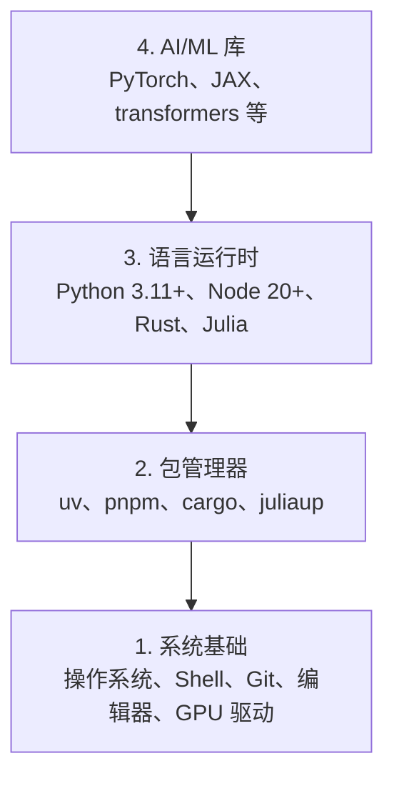

# 开发环境

> 工具塑造思维。一次配好，一劳永逸。

**Type:** Build
**Languages:** Python, Node.js, Rust
**Prerequisites:** None
**Time:** ~45 分钟

## 学习目标

- 从零搭建 Python 3.11+、Node.js 20+ 和 Rust 工具链
- 配置虚拟环境与包管理器，实现可复现构建
- 验证 GPU 访问权限（CUDA/MPS），并运行一次张量测试运算
- 理解四层技术栈：系统层、包管理层、运行时层、AI 库层

## 问题

你即将学习 200 多节 AI 工程课程，涉及 Python、TypeScript、Rust 和 Julia。如果环境出了问题，每一节课都会变成与工具链的搏斗，而不是学习。

大多数人会跳过环境搭建这一步。然后他们花好几个小时调试导入错误、版本冲突和缺失的 CUDA 驱动。我们要一次性把这件事做对。

## 概念

AI 工程环境由四层组成：



我们从底层向上安装。每一层都依赖它下面的一层。

## 亲手构建

### 第 1 步：系统基础

检查你的系统并安装基础工具。

```bash
# macOS
xcode-select --install
brew install git curl wget

# Ubuntu/Debian
sudo apt update && sudo apt install -y build-essential git curl wget

# Windows（使用 WSL2）
wsl --install -d Ubuntu-24.04
```

### 第 2 步：Python 与 uv

我们使用 `uv` ——它比 pip 快 10-100 倍，并且自动处理虚拟环境。

```bash
curl -LsSf https://astral.sh/uv/install.sh | sh

uv python install 3.12

uv venv
source .venv/bin/activate  # Windows 上使用 .venv\Scripts\activate

uv pip install numpy matplotlib jupyter
```

验证：

```python
import sys
print(f"Python {sys.version}")

import numpy as np
print(f"NumPy {np.__version__}")
a = np.array([1, 2, 3])
print(f"向量: {a}，与自身的点积: {np.dot(a, a)}")
```

### 第 3 步：Node.js 与 pnpm

用于 TypeScript 课程（智能体、MCP 服务器、Web 应用）。

```bash
curl -fsSL https://fnm.vercel.app/install | bash
fnm install 22
fnm use 22

npm install -g pnpm

node -e "console.log('Node', process.version)"
```

### 第 4 步：Rust

用于性能关键课程（推理、系统级编程）。

```bash
curl --proto '=https' --tlsv1.2 -sSf https://sh.rustup.rs | sh

rustc --version
cargo --version
```

### 第 5 步：Julia（可选）

用于 Julia 擅长的数学密集型课程。

```bash
curl -fsSL https://install.julialang.org | sh

julia -e 'println("Julia ", VERSION)'
```

### 第 6 步：GPU 设置（如果你有 GPU）

```bash
# NVIDIA
nvidia-smi

# 安装带 CUDA 的 PyTorch
uv pip install torch torchvision torchaudio --index-url https://download.pytorch.org/whl/cu124
```

```python
import torch
print(f"CUDA 可用: {torch.cuda.is_available()}")
if torch.cuda.is_available():
    print(f"GPU: {torch.cuda.get_device_name(0)}")
```

没有 GPU？没关系。大多数课程可以在 CPU 上运行。对于训练密集的课程，可以使用 Google Colab 或云端 GPU。

### 第 7 步：验证一切就绪

运行验证脚本：

```bash
python phases/00-setup-and-tooling/01-dev-environment/code/verify.py
```

## 现成工具

你的环境现在已经为课程中的每一节课做好了准备。以下是各语言的使用场景：

| 语言 | 使用阶段 | 包管理器 |
|------|----------|----------|
| Python | 阶段 1-12（机器学习、深度学习、NLP、视觉、音频、大语言模型） | uv |
| TypeScript | 阶段 13-17（工具、智能体、集群、基础设施） | pnpm |
| Rust | 阶段 12、15-17（性能关键系统） | cargo |
| Julia | 阶段 1（数学基础） | Pkg |

## 成果交付

本节课程产出一个验证脚本，任何人都可以运行它来检查自己的环境配置。

参见 `outputs/prompt-env-check.md`，其中包含一个帮助 AI 助手诊断环境问题的提示词。

## 练习

1. 运行验证脚本并修复任何失败项
2. 为本课程创建一个 Python 虚拟环境并安装 PyTorch
3. 用全部四种语言各写一个 "hello world" 并分别运行
