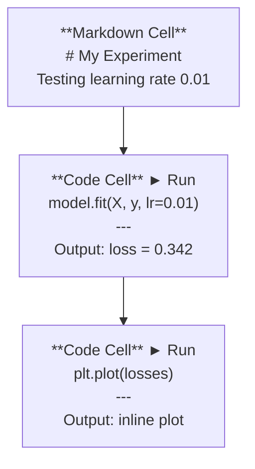
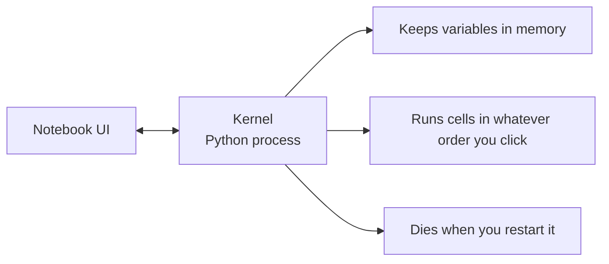

# Jupyter Notebooks

> Notebook 是 AI 工程的实验台。你在这里做原型，把跑通的东西搬到生产环境。

**Type:** Build
**Languages:** Python
**Prerequisites:** Phase 0, Lesson 01
**Time:** ~30 minutes

## Learning Objectives

- 安装并启动 JupyterLab、Jupyter Notebook 或带 Jupyter 扩展的 VS Code
- 使用魔法命令（`%timeit`、`%%time`、`%matplotlib inline`）进行性能基准测试和内联可视化
- 区分何时使用 notebook、何时使用脚本，并应用"在 notebook 中探索，在脚本中交付"的工作流
- 识别并避免常见的 notebook 陷阱：乱序执行、隐藏状态和内存泄漏

## The Problem

每篇 AI 论文、教程和 Kaggle 比赛都用 Jupyter notebook。它们让你分块运行代码、内联查看输出、把代码和解释混在一起，并快速迭代。如果不用 notebook 学 AI，就像不用草稿纸做数学作业。

但 notebook 也有真实的陷阱。人们什么都用它，包括它并不擅长的事。知道何时用 notebook、何时用脚本，能让你以后少踩调试的坑。

## The Concept

Notebook 就是一个由单元格（cell）组成的列表。每个单元格要么是代码，要么是文本。



内核（kernel）是一个在后台运行的 Python 进程。当你运行一个单元格时，它把代码发给内核，内核执行后把结果返回。所有单元格共享同一个内核，因此变量在单元格之间会保留。



那个"随便什么顺序点击运行"的部分，既是超能力，也是自残利器。

## Build It

### Step 1: Pick your interface

三种选项，同一种格式：

| Interface | Install | Best for |
|-----------|---------|----------|
| JupyterLab | `pip install jupyterlab` 然后 `jupyter lab` | 完整的 IDE 体验，多标签页、文件浏览器、终端 |
| Jupyter Notebook | `pip install notebook` 然后 `jupyter notebook` | 简单、轻量，一次开一个 notebook |
| VS Code | 安装 "Jupyter" 扩展 | 已经在你的编辑器里，集成 git、调试 |

三者都读写同样的 `.ipynb` 文件。喜欢哪个用哪个。JupyterLab 在 AI 工作中最常见。

```bash
pip install jupyterlab
jupyter lab
```

### Step 2: Keyboard shortcuts that matter

你在两种模式下操作。按 `Escape` 进入命令模式（左侧蓝色条），按 `Enter` 进入编辑模式（左侧绿色条）。

**Command mode（最常用）：**

| Key | Action |
|-----|--------|
| `Shift+Enter` | 运行单元格，跳到下一个 |
| `A` | 在上方插入单元格 |
| `B` | 在下方插入单元格 |
| `DD` | 删除单元格 |
| `M` | 转换为 markdown |
| `Y` | 转换为 code |
| `Z` | 撤销单元格操作 |
| `Ctrl+Shift+H` | 显示所有快捷键 |

**Edit mode：**

| Key | Action |
|-----|--------|
| `Tab` | 自动补全 |
| `Shift+Tab` | 显示函数签名 |
| `Ctrl+/` | 切换注释 |

`Shift+Enter` 是你一天要用上千次的快捷键，先学它。

### Step 3: Cell types

**Code cells** 运行 Python 并显示输出：

```python
import numpy as np
data = np.random.randn(1000)
data.mean(), data.std()
```

Output: `(0.0032, 0.9987)`

**Markdown cells** 渲染格式化文本。用它们记录你在做什么以及为什么。支持标题、加粗、斜体、LaTeX 数学公式（`$E = mc^2$`）、表格和图片。

### Step 4: Magic commands

这些不是 Python。它们是 Jupyter 特有的命令，以 `%`（行魔法）或 `%%`（单元格魔法）开头。

**给代码计时：**

```python
%timeit np.random.randn(10000)
```

Output: `45.2 us +/- 1.3 us per loop`

```python
%%time
model.fit(X_train, y_train, epochs=10)
```

Output: `Wall time: 2.34 s`

`%timeit` 多次运行代码并取平均值。`%%time` 只运行一次。`%timeit` 用于微基准测试，`%%time` 用于训练运行。

**启用内联绘图：**

```python
%matplotlib inline
```

每个 `plt.plot()` 或 `plt.show()` 现在都会直接渲染在 notebook 中。

**不用离开 notebook 就能安装包：**

```python
!pip install scikit-learn
```

`!` 前缀可以运行任何 shell 命令。

**查看环境变量：**

```python
%env CUDA_VISIBLE_DEVICES
```

### Step 5: Display rich output inline

Notebook 会自动显示单元格中最后一个表达式的值。但你可以控制它：

```python
import pandas as pd

df = pd.DataFrame({
    "model": ["Linear", "Random Forest", "Neural Net"],
    "accuracy": [0.72, 0.89, 0.94],
    "training_time": [0.1, 2.3, 45.6]
})
df
```

这会渲染成一个格式化的 HTML 表格，而不是纯文本输出。绘图也一样：

```python
import matplotlib.pyplot as plt

plt.figure(figsize=(8, 4))
plt.plot([1, 2, 3, 4], [1, 4, 2, 3])
plt.title("Inline Plot")
plt.show()
```

图会直接出现在单元格下方。这就是为什么 notebook 在 AI 工作中占主导地位——你可以同时看到数据、图和代码。

显示图片：

```python
from IPython.display import Image, display
display(Image(filename="architecture.png"))
```

### Step 6: Google Colab

Colab 是云端的免费 Jupyter notebook。它提供 GPU、预装库和 Google Drive 集成，无需任何配置。

1. 访问 [colab.research.google.com](https://colab.research.google.com)
2. 上传本课程中的任意 `.ipynb` 文件
3. Runtime > Change runtime type > T4 GPU（免费）

Colab 与本地 Jupyter 的区别：
- 文件不会在会话之间保留（保存到 Drive 或下载）
- 预装：numpy、pandas、matplotlib、torch、tensorflow、sklearn
- `from google.colab import files` 用于上传/下载文件
- `from google.colab import drive; drive.mount('/content/drive')` 用于持久化存储
- 免费层在 90 分钟不活动后会话超时

## Use It

### Notebooks vs Scripts: When to use which

| Use notebooks for | Use scripts for |
|-------------------|-----------------|
| 探索数据集 | 训练流水线 |
| 原型化模型 | 可复用的工具函数 |
| 可视化结果 | 任何带 `if __name__` 的代码 |
| 解释你的工作 | 定时运行的代码 |
| 快速实验 | 生产代码 |
| 课程练习 | 包和库 |

原则：**在 notebook 中探索，在脚本中交付**。

AI 中一个常见的工作流：
1. 在 notebook 中探索数据
2. 在 notebook 中做模型原型
3. 跑通之后，把代码搬到 `.py` 文件
4. 再把这些 `.py` 文件导入回 notebook 做进一步实验

### Common traps

**乱序执行。** 你先运行 cell 5，再运行 cell 2，再运行 cell 7。notebook 在你机器上能跑，但别人从上到下跑就挂了。修复：分享前先 Kernel > Restart & Run All。

**隐藏状态。** 你删掉了一个单元格，但它创建的变量还在内存里。notebook 看起来干净，却依赖一个"幽灵单元格"。修复：定期重启内核。

**内存泄漏。** 加载一个 4GB 的数据集、训练一个模型、再加载另一个数据集，什么也没释放。修复：`del variable_name` 加 `gc.collect()`，或者直接重启内核。

## Ship It

本课产出：
- `outputs/prompt-notebook-helper.md` 用于调试 notebook 问题

## Exercises

1. 打开 JupyterLab，创建一个 notebook，用 `%timeit` 比较列表推导式和 numpy 生成 10 万个随机数数组的速度
2. 创建一个包含 markdown 和 code 单元格的 notebook，加载一个 CSV，展示 dataframe 并画图。然后运行 Kernel > Restart & Run All 验证从上到下能跑通
3. 把 `code/notebook_tips.py` 里的代码粘贴到 Colab notebook 中，用免费 GPU 跑一遍

## Key Terms

| Term | What people say | What it actually means |
|------|----------------|----------------------|
| Kernel | "跑我代码的那个东西" | 一个独立的 Python 进程，负责执行单元格并在内存中保留变量 |
| Cell | "一个代码块" | notebook 中可独立运行的单元，可以是代码或 markdown |
| Magic command | "Jupyter 的小技巧" | 以 `%` 或 `%%` 开头的特殊命令，用于控制 notebook 环境 |
| `.ipynb` | "Notebook 文件" | 一个包含单元格、输出和元数据的 JSON 文件，全称 IPython Notebook |

## Further Reading

- [JupyterLab Docs](https://jupyterlab.readthedocs.io/) 了解完整功能
- [Google Colab FAQ](https://research.google.com/colaboratory/faq.html) 了解 Colab 特有的限制和功能
- [28 Jupyter Notebook Tips](https://www.dataquest.io/blog/jupyter-notebook-tips-tricks-shortcuts/) 高手快捷键技巧
