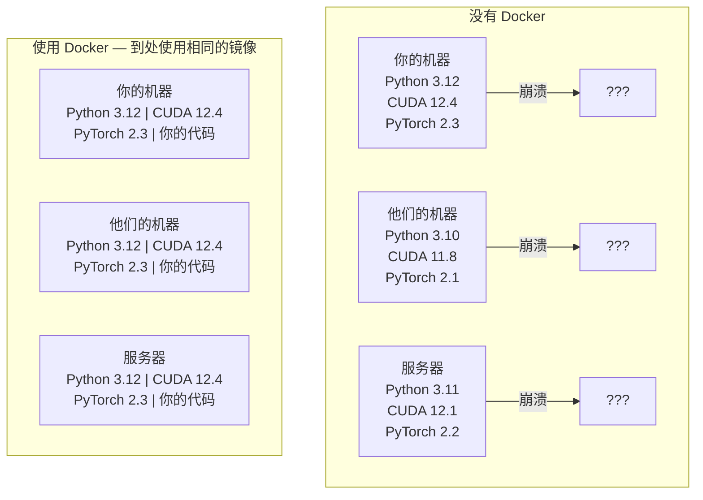

# Docker for AI

> 容器让"在我机器上能跑"成为历史。

**Type:** Build
**Languages:** Docker
**Prerequisites:** Phase 0, Lessons 01 and 03
**Time:** ~60 minutes

## 学习目标

- 从 Dockerfile 构建支持 GPU 的 Docker 镜像,包含 CUDA、PyTorch 和 AI 库
- 将主机目录挂载为卷,在容器重建时持久化模型、数据集和代码
- 配置 NVIDIA Container Toolkit 以在容器内暴露 GPU
- 使用 Docker Compose 编排多服务 AI 应用(推理服务器 + 向量数据库)

## 问题所在

你在笔记本上用 PyTorch 2.3、CUDA 12.4 和 Python 3.12 训练了一个模型。你的同事用的是 PyTorch 2.1、CUDA 11.8 和 Python 3.10。你的模型在他们的机器上崩溃了。而你的 Dockerfile 在两台机器上都能正常工作。

AI 项目是依赖的噩梦。典型的栈包括 Python、PyTorch、CUDA 驱动、cuDNN、系统级 C 库,以及像 flash-attn 这样需要精确编译器版本的专业包。Docker 将所有这些打包到一个镜像中,在任何地方都能完全一致地运行。

## 核心概念

Docker 将你的代码、运行时、库和系统工具封装成一个隔离的单元,称为容器。可以把它想象成轻量级虚拟机,区别是它共享主机操作系统内核而不是运行自己的内核,所以启动时间是秒级而不是分钟级。



### 为什么 AI 项目比大多数项目更需要 Docker

1. **GPU 驱动很脆弱。** CUDA 12.4 的代码无法在 CUDA 11.8 上运行。Docker 将 CUDA 工具包隔离在容器内,同时通过 NVIDIA Container Toolkit 共享主机 GPU 驱动。

2. **模型权重很大。** 一个 7B 参数的模型在 fp16 精度下是 14 GB。你不想每次重建时都重新下载。Docker 卷允许你从主机挂载 models 目录。

3. **多服务架构很常见。** 真正的 AI 应用不只是一个 Python 脚本。它是一个推理服务器、一个用于 RAG 的向量数据库,可能还有一个 Web 前端。Docker Compose 用一条命令编排所有这些服务。

### 关键术语

| 术语 | 含义 |
|------|------|
| Image(镜像) | 只读模板。你的配方。从 Dockerfile 构建。 |
| Container(容器) | 镜像的运行实例。你的厨房。 |
| Dockerfile | 构建镜像的指令。逐层构建。 |
| Volume(卷) | 在容器重启后仍然存在的持久化存储。 |
| docker-compose | 用 YAML 定义多容器应用的工具。 |

### AI 中常见的容器模式

```
开发容器
  完整工具包。编辑器支持。Jupyter。调试工具。
  在开发和实验期间使用。

训练容器
  最小化。只有训练脚本和依赖。
  在 GPU 集群上运行。没有编辑器,没有 Jupyter。

推理容器
  为服务优化。小镜像。快速冷启动。
  在生产环境中运行在负载均衡器后面。
```

## 动手实践

### 步骤 1:安装 Docker

```bash
# macOS
brew install --cask docker
open /Applications/Docker.app

# Ubuntu
curl -fsSL https://get.docker.com | sh
sudo usermod -aG docker $USER
# 注销并重新登录以使组更改生效
```

验证:

```bash
docker --version
docker run hello-world
```

### 步骤 2:安装 NVIDIA Container Toolkit(带 NVIDIA GPU 的 Linux)

这允许 Docker 容器访问你的 GPU。macOS 和 Windows(WSL2)用户可以跳过这一步;Docker Desktop 在这些平台上以不同方式处理 GPU 直通。

```bash
distribution=$(. /etc/os-release;echo $ID$VERSION_ID)
curl -fsSL https://nvidia.github.io/libnvidia-container/gpgkey | sudo gpg --dearmor -o /usr/share/keyrings/nvidia-container-toolkit-keyring.gpg
curl -s -L https://nvidia.github.io/libnvidia-container/$distribution/libnvidia-container.list | \
    sed 's#deb https://#deb [signed-by=/usr/share/keyrings/nvidia-container-toolkit-keyring.gpg] https://#g' | \
    sudo tee /etc/apt/sources.list.d/nvidia-container-toolkit.list

sudo apt-get update
sudo apt-get install -y nvidia-container-toolkit
sudo nvidia-ctk runtime configure --runtime=docker
sudo systemctl restart docker
```

在容器内测试 GPU 访问:

```bash
docker run --rm --gpus all nvidia/cuda:12.4.1-base-ubuntu22.04 nvidia-smi
```

如果你看到 GPU 信息,说明工具包工作正常。

### 步骤 3:理解基础镜像

选择正确的基础镜像可以节省数小时的调试时间。

```
nvidia/cuda:12.4.1-devel-ubuntu22.04
  完整的 CUDA 工具包。包含编译器。
  用于:构建需要 nvcc 的包(flash-attn、bitsandbytes)
  大小:~4 GB

nvidia/cuda:12.4.1-runtime-ubuntu22.04
  仅 CUDA 运行时。没有编译器。
  用于:运行预构建的代码
  大小:~1.5 GB

pytorch/pytorch:2.3.1-cuda12.4-cudnn9-runtime
  PyTorch 预装在 CUDA 之上。
  用于:跳过 PyTorch 安装步骤
  大小:~6 GB

python:3.12-slim
  没有 CUDA。仅 CPU。
  用于:CPU 推理、轻量级工具
  大小:~150 MB
```

### 步骤 4:编写用于 AI 开发的 Dockerfile

这是 `code/Dockerfile` 中的 Dockerfile。逐行讲解:

```dockerfile
FROM nvidia/cuda:12.4.1-devel-ubuntu22.04

ENV DEBIAN_FRONTEND=noninteractive
ENV PYTHONUNBUFFERED=1

RUN apt-get update && apt-get install -y --no-install-recommends \
    python3.12 \
    python3.12-venv \
    python3.12-dev \
    python3-pip \
    git \
    curl \
    build-essential \
    && rm -rf /var/lib/apt/lists/*

RUN update-alternatives --install /usr/bin/python python /usr/bin/python3.12 1

RUN python -m pip install --no-cache-dir --upgrade pip setuptools wheel

RUN python -m pip install --no-cache-dir \
    torch==2.3.1 \
    torchvision==0.18.1 \
    torchaudio==2.3.1 \
    --index-url https://download.pytorch.org/whl/cu124

RUN python -m pip install --no-cache-dir \
    numpy \
    pandas \
    scikit-learn \
    matplotlib \
    jupyter \
    transformers \
    datasets \
    accelerate \
    safetensors

WORKDIR /workspace

VOLUME ["/workspace", "/models"]

EXPOSE 8888

CMD ["python"]
```

构建它:

```bash
docker build -t ai-dev -f phases/00-setup-and-tooling/07-docker-for-ai/code/Dockerfile .
```

第一次构建需要一些时间(下载 CUDA 基础镜像 + PyTorch)。后续构建使用缓存的层。

运行它:

```bash
docker run --rm -it --gpus all \
    -v $(pwd):/workspace \
    -v ~/models:/models \
    ai-dev python -c "import torch; print(f'PyTorch {torch.__version__}, CUDA: {torch.cuda.is_available()}')"
```

在容器内运行 Jupyter:

```bash
docker run --rm -it --gpus all \
    -v $(pwd):/workspace \
    -v ~/models:/models \
    -p 8888:8888 \
    ai-dev jupyter notebook --ip=0.0.0.0 --port=8888 --no-browser --allow-root
```

### 步骤 5:数据和模型的卷挂载

卷挂载对 AI 工作至关重要。没有它们,你下载的 14 GB 模型在容器停止时就会消失。

```bash
# 挂载你的代码
-v $(pwd):/workspace

# 挂载共享的模型目录
-v ~/models:/models

# 挂载数据集
-v ~/datasets:/data
```

在你的训练脚本中,从挂载的路径加载:

```python
from transformers import AutoModel

model = AutoModel.from_pretrained("/models/llama-7b")
```

模型存在于你的主机文件系统中。随意重建容器而不需要重新下载。

### 步骤 6:用于多服务 AI 应用的 Docker Compose

真正的 RAG 应用需要推理服务器和向量数据库。Docker Compose 用一条命令运行两者。

参见 `code/docker-compose.yml`:

```yaml
services:
  ai-dev:
    build:
      context: .
      dockerfile: Dockerfile
    deploy:
      resources:
        reservations:
          devices:
            - driver: nvidia
              count: all
              capabilities: [gpu]
    volumes:
      - ../../../:/workspace
      - ~/models:/models
      - ~/datasets:/data
    ports:
      - "8888:8888"
    stdin_open: true
    tty: true
    command: jupyter notebook --ip=0.0.0.0 --port=8888 --no-browser --allow-root

  qdrant:
    image: qdrant/qdrant:v1.12.5
    ports:
      - "6333:6333"
      - "6334:6334"
    volumes:
      - qdrant_data:/qdrant/storage

volumes:
  qdrant_data:
```

启动所有服务:

```bash
cd phases/00-setup-and-tooling/07-docker-for-ai/code
docker compose up -d
```

现在你的 AI 开发容器可以通过服务名访问向量数据库 `http://qdrant:6333`。Docker Compose 自动创建共享网络。

从 AI 容器内测试连接:

```python
from qdrant_client import QdrantClient

client = QdrantClient(host="qdrant", port=6333)
print(client.get_collections())
```

停止所有服务:

```bash
docker compose down
```

添加 `-v` 以同时删除 qdrant 卷:

```bash
docker compose down -v
```

### 步骤 7:AI 工作中有用的 Docker 命令

```bash
# 列出运行中的容器
docker ps

# 列出所有镜像及其大小
docker images

# 删除未使用的镜像(回收磁盘空间)
docker system prune -a

# 在运行中的容器内检查 GPU 使用情况
docker exec -it <container_id> nvidia-smi

# 将文件从容器复制到主机
docker cp <container_id>:/workspace/results.csv ./results.csv

# 查看容器日志
docker logs -f <container_id>
```

## 实际应用

你现在拥有了一个可复现的 AI 开发环境。在本课程的其余部分:

- 使用 `docker compose up` 同时启动开发环境和向量数据库
- 将代码、模型和数据挂载为卷,这样在重建之间不会丢失任何内容
- 当课程需要新的 Python 包时,将其添加到 Dockerfile 并重建
- 与队友分享你的 Dockerfile。他们获得完全相同的环境。

### 没有 GPU?

移除 `--gpus all` 标志和 NVIDIA deploy 块。容器仍然可以用于基于 CPU 的课程。PyTorch 检测到 CUDA 缺失并自动回退到 CPU。

## 练习

1. 构建 Dockerfile 并在容器内运行 `python -c "import torch; print(torch.__version__)"`
2. 启动 docker-compose 栈并验证 Qdrant 可以从 AI 容器访问 `http://qdrant:6333/collections`
3. 将 `flask` 添加到 Dockerfile,重建,并在端口 5000 上运行简单的 API 服务器。使用 `-p 5000:5000` 映射端口
4. 使用 `docker images` 测量镜像大小。尝试将基础镜像从 `devel` 切换到 `runtime` 并比较大小

## 关键术语

| 术语 | 人们怎么说 | 实际含义 |
|------|-----------|---------|
| Container(容器) | "轻量级虚拟机" | 使用主机内核的隔离进程,拥有自己的文件系统和网络 |
| Image layer(镜像层) | "缓存的步骤" | 每个 Dockerfile 指令创建一个层。未更改的层被缓存,所以重建很快。 |
| NVIDIA Container Toolkit | "Docker 中的 GPU" | 运行时钩子,通过 `--gpus` 标志将主机 GPU 暴露给容器 |
| Volume mount(卷挂载) | "共享文件夹" | 主机上映射到容器中的目录。容器停止后更改仍然存在。 |
| Base image(基础镜像) | "起点" | 你的 Dockerfile 在其之上构建的 `FROM` 镜像。决定预装了什么。 |
