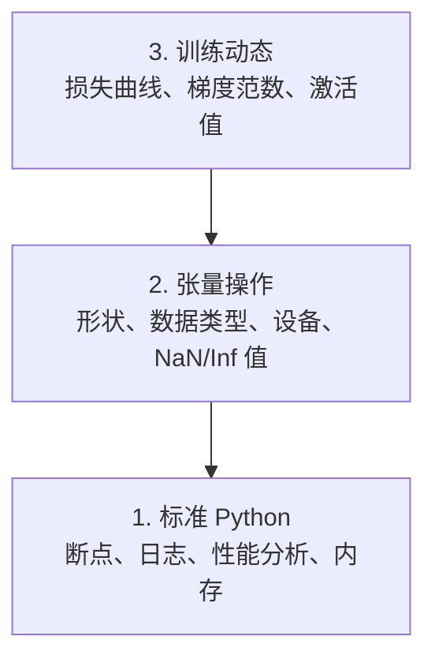

# 调试与性能分析

> 最糟糕的 AI bug 不会让程序崩溃。它们会默默地用垃圾数据训练，然后报告一条漂亮的损失曲线。

**类型：** 构建
**语言：** Python
**前置知识：** 第 1 课（开发环境），基本的 PyTorch 熟悉度
**时间：** 约 60 分钟

## 学习目标

- 使用条件 `breakpoint()` 和 `debug_print` 在训练中途检查张量的形状、数据类型和 NaN 值
- 使用 `cProfile`、`line_profiler` 和 `tracemalloc` 对训练循环进行性能分析以找出瓶颈
- 检测常见的 AI bug：形状不匹配、NaN 损失、数据泄露和设备错误的张量
- 设置 TensorBoard 来可视化损失曲线、权重直方图和梯度分布

## 问题所在

AI 代码的失败方式与普通代码不同。Web 应用会带着堆栈跟踪崩溃。而一个配置错误的训练循环会运行 8 小时，烧掉 200 美元的 GPU 费用，然后产出一个对每个输入都预测均值 的模型。代码从未报错。bug 可能是张量在错误的设备上、忘记了 `.detach()`，或者标签泄露到了特征中。

你需要调试工具来在这些静默失败浪费你的时间和算力之前抓住它们。

## 核心概念

AI 调试在三个层面上运作：



大多数人直接跳到第 3 层（盯着 TensorBoard）。但 80% 的 AI bug 存在于第 1 层和第 2 层。

## 动手构建

### 第 1 部分：打印调试（是的，它有效）

打印调试常被轻视。它不应该被轻视。对于张量代码，一条有针对性的 print 语句比单步调试器更好，因为你需要同时看到形状、数据类型和值范围。

```python
def debug_print(name, tensor):
    print(f"{name}: shape={tensor.shape}, dtype={tensor.dtype}, "
          f"device={tensor.device}, "
          f"min={tensor.min().item():.4f}, max={tensor.max().item():.4f}, "
          f"mean={tensor.mean().item():.4f}, "
          f"has_nan={tensor.isnan().any().item()}")
```

在每个可疑操作后调用这个函数。当找到 bug 后，移除这些 print。就这么简单。

### 第 2 部分：Python 调试器（pdb 和 breakpoint）

内置调试器在 AI 工作中被低估了。在训练循环中放入 `breakpoint()`，交互地检查张量。

```python
def training_step(model, batch, criterion, optimizer):
    inputs, labels = batch
    outputs = model(inputs)
    loss = criterion(outputs, labels)

    if loss.item() > 100 or torch.isnan(loss):
        breakpoint()

    loss.backward()
    optimizer.step()
```

当调试器让你进入时，有用的命令：

- `p outputs.shape` 检查形状
- `p loss.item()` 查看损失值
- `p torch.isnan(outputs).sum()` 统计 NaN 数量
- `p model.fc1.weight.grad` 检查梯度
- `c` 继续，`q` 退出

这是条件调试。你只在出现问题时才停下来。对于 10,000 步的训练运行，这很重要。

### 第 3 部分：Python 日志

当你的调试超出快速检查范围时，用日志替换 print 语句。

```python
import logging

logging.basicConfig(
    level=logging.INFO,
    format="%(asctime)s [%(levelname)s] %(message)s",
    handlers=[
        logging.FileHandler("training.log"),
        logging.StreamHandler()
    ]
)
logger = logging.getLogger(__name__)

logger.info("Starting training: lr=%.4f, batch_size=%d", lr, batch_size)
logger.warning("Loss spike detected: %.4f at step %d", loss.item(), step)
logger.error("NaN loss at step %d, stopping", step)
```

日志给你时间戳、严重级别和文件输出。当训练运行在凌晨 3 点失败时，你想要一个日志文件，而不是滚出屏幕的终端输出。

### 第 4 部分：计时代码段

知道时间花在哪里是优化的第一步。

```python
import time

class Timer:
    def __init__(self, name=""):
        self.name = name

    def __enter__(self):
        self.start = time.perf_counter()
        return self

    def __exit__(self, *args):
        elapsed = time.perf_counter() - self.start
        print(f"[{self.name}] {elapsed:.4f}s")

with Timer("data loading"):
    batch = next(dataloader_iter)

with Timer("forward pass"):
    outputs = model(batch)

with Timer("backward pass"):
    loss.backward()
```

常见发现：数据加载占用 60% 的训练时间。修复方法是在 DataLoader 中设置 `num_workers > 0`，而不是更快的 GPU。

### 第 5 部分：cProfile 和 line_profiler

当你需要比手动计时器更多功能时：

```bash
python -m cProfile -s cumtime train.py
```

这显示按累计时间排序的每个函数调用。对于逐行性能分析：

```bash
pip install line_profiler
```

```python
@profile
def train_step(model, data, target):
    output = model(data)
    loss = F.cross_entropy(output, target)
    loss.backward()
    return loss

# 运行方式：kernprof -l -v train.py
```

### 第 6 部分：内存性能分析

#### 使用 tracemalloc 分析 CPU 内存

```python
import tracemalloc

tracemalloc.start()

# 你的代码在这里
model = build_model()
data = load_dataset()

snapshot = tracemalloc.take_snapshot()
top_stats = snapshot.statistics("lineno")
for stat in top_stats[:10]:
    print(stat)
```

#### 使用 memory_profiler 分析 CPU 内存

```bash
pip install memory_profiler
```

```python
from memory_profiler import profile

@profile
def load_data():
    raw = read_csv("data.csv")       # 观察内存在这里跳跃
    processed = preprocess(raw)       # 还有这里
    return processed
```

用 `python -m memory_profiler your_script.py` 运行以查看逐行内存使用情况。

#### 使用 PyTorch 分析 GPU 内存

```python
import torch

if torch.cuda.is_available():
    print(torch.cuda.memory_summary())

    print(f"Allocated: {torch.cuda.memory_allocated() / 1e9:.2f} GB")
    print(f"Cached: {torch.cuda.memory_reserved() / 1e9:.2f} GB")
```

当你遇到 OOM（内存不足）时：

1. 减小批次大小（首先要尝试的，总是这样）
2. 使用 `torch.cuda.empty_cache()` 释放缓存的内存
3. 对大型中间张量使用 `del tensor` 后跟 `torch.cuda.empty_cache()`
4. 使用混合精度（`torch.cuda.amp`）将内存使用减半
5. 对非常深的模型使用梯度检查点

### 第 7 部分：常见 AI bug 及如何捕捉它们

#### 形状不匹配

最常见的 bug。张量的形状是 `[batch, features]`，而模型期望的是 `[batch, channels, height, width]`。

```python
def check_shapes(model, sample_input):
    print(f"Input: {sample_input.shape}")
    hooks = []

    def make_hook(name):
        def hook(module, inp, out):
            in_shape = inp[0].shape if isinstance(inp, tuple) else inp.shape
            out_shape = out.shape if hasattr(out, "shape") else type(out)
            print(f"  {name}: {in_shape} -> {out_shape}")
        return hook

    for name, module in model.named_modules():
        hooks.append(module.register_forward_hook(make_hook(name)))

    with torch.no_grad():
        model(sample_input)

    for h in hooks:
        h.remove()
```

用样本批次运行一次。它映射模型中每个形状变换。

#### NaN 损失

NaN 损失意味着某些东西爆炸了。常见原因：

- 学习率太高
- 自定义损失中的除以零
- 零或负数的对数
- RNN 中的梯度爆炸

```python
def detect_nan(model, loss, step):
    if torch.isnan(loss):
        print(f"NaN loss at step {step}")
        for name, param in model.named_parameters():
            if param.grad is not None:
                if torch.isnan(param.grad).any():
                    print(f"  NaN gradient in {name}")
                if torch.isinf(param.grad).any():
                    print(f"  Inf gradient in {name}")
        return True
    return False
```

#### 数据泄露

你的模型在测试集上获得 99% 的准确率。听起来很棒。这是个 bug。

```python
def check_data_leakage(train_set, test_set, id_column="id"):
    train_ids = set(train_set[id_column].tolist())
    test_ids = set(test_set[id_column].tolist())
    overlap = train_ids & test_ids
    if overlap:
        print(f"DATA LEAKAGE: {len(overlap)} samples in both train and test")
        return True
    return False
```

还要检查时间泄露：使用未来数据预测过去。在分割前按时间戳排序。

#### 错误的设备

不同设备（CPU vs GPU）上的张量会导致运行时错误。但有时一个张量悄悄地留在 CPU 上，而其他所有东西都在 GPU 上，训练只是运行得很慢。

```python
def check_devices(model, *tensors):
    model_device = next(model.parameters()).device
    print(f"Model device: {model_device}")
    for i, t in enumerate(tensors):
        if t.device != model_device:
            print(f"  WARNING: tensor {i} on {t.device}, model on {model_device}")
```

### 第 8 部分：TensorBoard 基础

TensorBoard 向你展示训练过程中内部发生的事情。

```bash
pip install tensorboard
```

```python
from torch.utils.tensorboard import SummaryWriter

writer = SummaryWriter("runs/experiment_1")

for step in range(num_steps):
    loss = train_step(model, batch)

    writer.add_scalar("loss/train", loss.item(), step)
    writer.add_scalar("lr", optimizer.param_groups[0]["lr"], step)

    if step % 100 == 0:
        for name, param in model.named_parameters():
            writer.add_histogram(f"weights/{name}", param, step)
            if param.grad is not None:
                writer.add_histogram(f"grads/{name}", param.grad, step)

writer.close()
```

启动它：

```bash
tensorboard --logdir=runs
```

要寻找什么：

- **损失不下降**：学习率太低，或模型架构问题
- **损失剧烈波动**：学习率太高
- **损失变为 NaN**：数值不稳定（参见上面的 NaN 部分）
- **训练损失下降，验证损失上升**：过拟合
- **权重直方图坍缩到零**：梯度消失
- **梯度直方图爆炸**：需要梯度裁剪

### 第 9 部分：VS Code 调试器

对于交互式调试，用 `launch.json` 配置 VS Code：

```json
{
    "version": "0.2.0",
    "configurations": [
        {
            "name": "Debug Training",
            "type": "debugpy",
            "request": "launch",
            "program": "${file}",
            "console": "integratedTerminal",
            "justMyCode": false
        }
    ]
}
```

通过点击边距设置断点。使用变量窗格检查张量属性。调试控制台让你在执行中途运行任意 Python 表达式。

对于单步执行数据预处理管道很有用，在那里你想看到每个变换。

## 实际应用

这是捕捉大多数 AI bug 的调试工作流：

1. **训练前**：用样本批次运行 `check_shapes`。验证输入和输出维度符合预期。
2. **前 10 步**：对损失、输出和梯度使用 `debug_print`。确认没有 NaN，值在合理范围内。
3. **训练期间**：记录损失、学习率和梯度范数。使用 TensorBoard 进行可视化。
4. **当出现问题时**：在失败点放入 `breakpoint()`。交互地检查张量。
5. **对于性能**：计时数据加载 vs 前向 vs 反向传播。如果接近 OOM，分析内存。

## 发布它

运行调试工具包脚本：

```bash
python phases/00-setup-and-tooling/12-debugging-and-profiling/code/debug_tools.py
```

参见 `outputs/prompt-debug-ai-code.md` 获取帮助诊断 AI 特定 bug 的提示。

## 练习

1. 运行 `debug_tools.py` 并阅读每部分的输出。修改虚拟模型引入 NaN（提示：在前向传播中除以零），观察检测器抓住它。
2. 用 `cProfile` 对训练循环进行性能分析，找出最慢的函数。
3. 使用 `tracemalloc` 找出数据加载管道中哪一行分配了最多内存。
4. 为简单的训练运行设置 TensorBoard，并识别模型是否过拟合。
5. 在训练循环内使用 `breakpoint()`。练习从调试器提示符检查张量形状、设备和梯度值。
