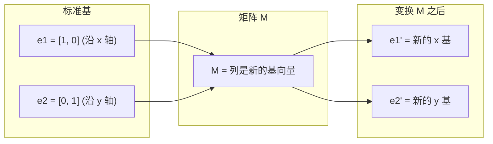
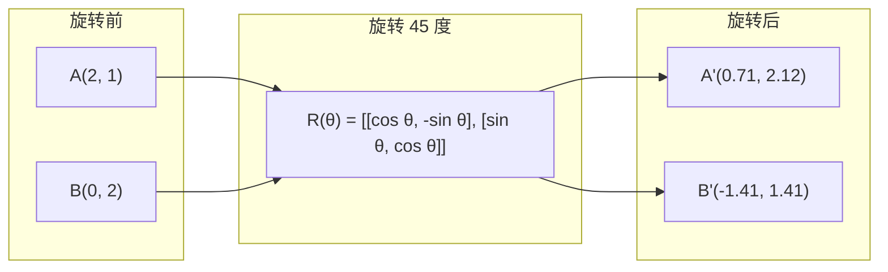
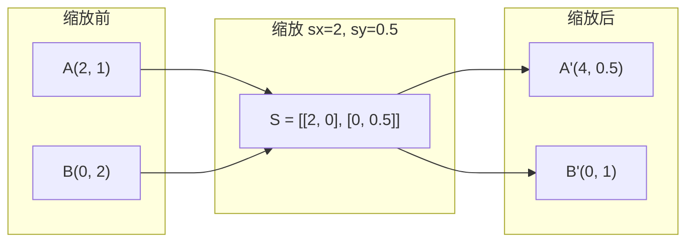
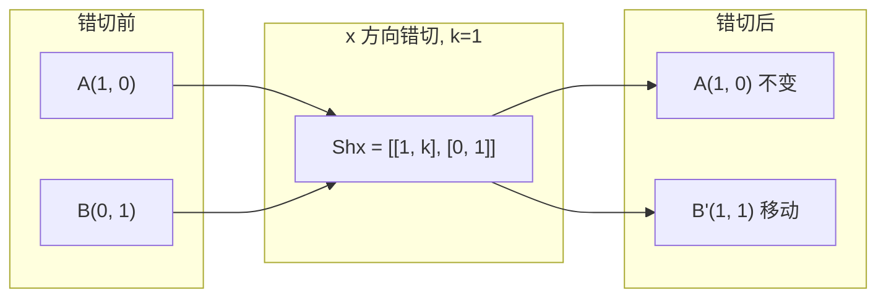
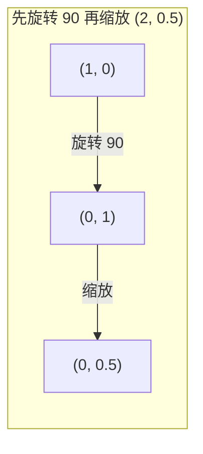
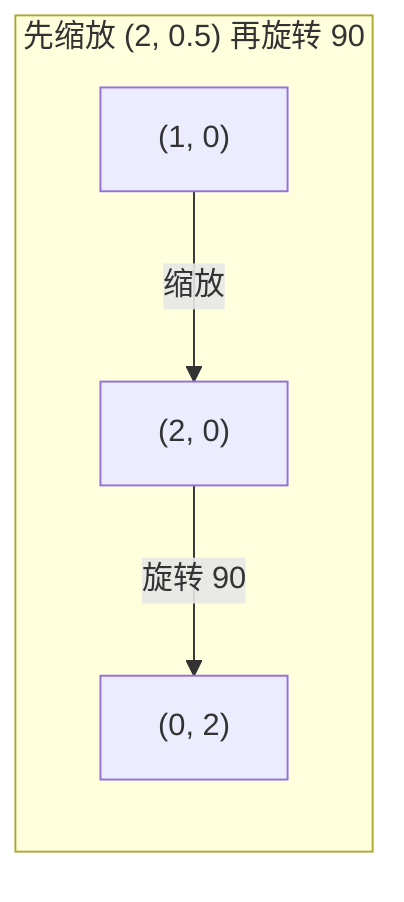

# 矩阵变换

> 矩阵是一台重塑空间的机器。了解它对每个点做了什么，你就理解了整个变换。

**Type:** Build
**Languages:** Python, Julia
**Prerequisites:** Phase 1, Lessons 01-02 (Linear Algebra Intuition, Vectors & Matrices Operations)
**Time:** ~75 minutes

## Learning Objectives

- 构造旋转、缩放、错切和反射矩阵，并将它们应用于 2D 和 3D 点
- 通过矩阵乘法组合多个变换，并验证顺序的重要性
- 从特征方程计算 2x2 矩阵的特征值和特征向量
- 解释为什么特征值决定了 PCA 方向、RNN 稳定性和谱聚类行为

## The Problem

你阅读关于 PCA 的内容，看到"求协方差矩阵的特征向量"。你阅读关于模型稳定性的内容，看到"检查所有特征值的幅度是否小于 1"。你阅读关于数据增强的内容，看到"应用随机旋转"。在你理解矩阵对空间做了什么几何操作之前，这些都没有意义。

矩阵不仅仅是数字网格。它们是空间机器。旋转矩阵旋转点。缩放矩阵拉伸它们。错切矩阵倾斜它们。神经网络对数据应用的每种变换都是这些操作之一或它们的组合。本课使这些操作变得具体。

## The Concept

### 变换作为矩阵

2D 中的每个线性变换都可以写成一个 2x2 矩阵。矩阵告诉你基向量 [1, 0] 和 [0, 1] 最终去了哪里。其他一切都随之确定。



### 旋转

角度为 theta 的 2D 旋转保持距离和角度不变。它使每个点沿圆弧移动。



在 3D 中，你绕轴旋转。每个轴都有自己的旋转矩阵：

```
Rz(theta) = | cos  -sin  0 |     绕 z 轴旋转
            | sin   cos  0 |     (x-y 平面旋转，z 保持不变)
            |  0     0   1 |

Rx(theta) = | 1   0     0    |   绕 x 轴旋转
            | 0  cos  -sin   |   (y-z 平面旋转，x 保持不变)
            | 0  sin   cos   |

Ry(theta) = |  cos  0  sin |     绕 y 轴旋转
            |   0   1   0  |     (x-z 平面旋转，y 保持不变)
            | -sin  0  cos |
```

### 缩放

缩放沿每个轴独立拉伸或压缩。



### 错切

错切倾斜一个轴而保持另一个轴固定。它将矩形变成平行四边形。



错切矩阵：
- `Shx = [[1, k], [0, 1]]` 将 x 移动 k * y
- `Shy = [[1, 0], [k, 1]]` 将 y 移动 k * x

### 反射

反射关于轴或线镜像点。

```mermaid
graph LR
    subgraph Before["反射前"]
        A["A(2, 1)"]
    end
    subgraph Reflect["关于 y 轴反射"]
        R="[[-1, 0], [0, 1]]"]
    end
    subgraph After["反射后"]
        Ap["A'(-2, 1)"]
    end
    A --> R --> Ap
```

反射矩阵：
- 关于 y 轴反射：`[[-1, 0], [0, 1]]`
- 关于 x 轴反射：`[[1, 0], [0, -1]]`

### 组合：链接变换

先应用变换 A 再应用变换 B 与乘以它们的矩阵相同：`result = B @ A @ point`。顺序很重要。先旋转再缩放与先缩放再旋转给出不同的结果。



组合：`S @ R = [[0, -2], [0.5, 0]]`



组合：`R @ S = [[0, -0.5], [2, 0]]`

不同的结果。矩阵乘法不可交换。

### 特征值和特征向量

大多数向量在矩阵作用下会改变方向。特征向量是特殊的：矩阵只缩放它们，从不旋转它们。缩放因子就是特征值。

```
A @ v = lambda * v

v 是特征向量（存活的方向）
lambda 是特征值（拉伸多少）

示例：A = | 2  1 |
             | 1  2 |

特征向量 [1, 1]，特征值 3：
  A @ [1,1] = [3, 3] = 3 * [1, 1]     （相同方向，缩放 3 倍）

特征向量 [1, -1]，特征值 1：
  A @ [1,-1] = [1, -1] = 1 * [1, -1]  （相同方向，不变）
```

矩阵沿 [1, 1] 方向将空间拉伸 3 倍，并保持 [1, -1] 不变。其他每个方向都是这两个方向的混合。

### 特征分解

如果矩阵有 n 个线性无关的特征向量，它可以被分解：

```
A = V @ D @ V^(-1)

V = 列是特征向量的矩阵
D = 特征值的对角矩阵
V^(-1) = V 的逆

这意味着：旋转到特征向量坐标，沿每个轴缩放，再旋转回来。
```

### 为什么特征值重要

**PCA。** 协方差矩阵的特征向量是主成分。特征值告诉你每个成分捕获了多少方差。按特征值排序，保留前 k 个，你就有了降维。

**稳定性。** 在循环网络和动力系统中，幅度 > 1 的特征值导致输出爆炸。幅度 < 1 导致它们消失。这就是用一句话表述的梯度消失/爆炸问题。

**谱方法。** 图神经网络使用邻接矩阵的特征值。谱聚类使用拉普拉斯矩阵的特征值。特征向量揭示图的结构。

### 行列式作为体积缩放因子

变换矩阵的行列式告诉你它如何缩放面积（2D）或体积（3D）。

```
det = 1:   面积保持不变（旋转）
det = 2:   面积翻倍
det = 0:   空间被压缩到更低维度（奇异）
det = -1:  面积保持不变但方向翻转（反射）

| det(Rotation) | = 1        （总是）
| det(Scale sx, sy) | = sx * sy
| det(Shear) | = 1           （面积保持不变）
| det(Reflection) | = -1     （方向翻转）
```

```figure
matrix-transform
```

## Build It

### Step 1: 从头开始构建变换矩阵（Python）

```python
import math

def rotation_2d(theta):
    c, s = math.cos(theta), math.sin(theta)
    return [[c, -s], [s, c]]

def scaling_2d(sx, sy):
    return [[sx, 0], [0, sy]]

def shearing_2d(kx, ky):
    return [[1, kx], [ky, 1]]

def reflection_x():
    return [[1, 0], [0, -1]]

def reflection_y():
    return [[-1, 0], [0, 1]]

def mat_vec_mul(matrix, vector):
    return [
        sum(matrix[i][j] * vector[j] for j in range(len(vector)))
        for i in range(len(matrix))
    ]

def mat_mul(a, b):
    rows_a, cols_b = len(a), len(b[0])
    cols_a = len(a[0])
    return [
        [sum(a[i][k] * b[k][j] for k in range(cols_a)) for j in range(cols_b)]
        for i in range(rows_a)
    ]

point = [1.0, 0.0]
angle = math.pi / 4

rotated = mat_vec_mul(rotation_2d(angle), point)
print(f"将 (1,0) 旋转 45 度：({rotated[0]:.4f}, {rotated[1]:.4f})")

scaled = mat_vec_mul(scaling_2d(2, 3), [1.0, 1.0])
print(f"将 (1,1) 缩放 (2,3)：({scaled[0]:.1f}, {scaled[1]:.1f})")

sheared = mat_vec_mul(shearing_2d(1, 0), [1.0, 1.0])
print(f"将 (1,1) 错切 kx=1：({sheared[0]:.1f}, {sheared[1]:.1f})")

reflected = mat_vec_mul(reflection_y(), [2.0, 1.0])
print(f"将 (2,1) 关于 y 轴反射：({reflected[0]:.1f}, {reflected[1]:.1f})")
```

### Step 2: 变换的组合

```python
R = rotation_2d(math.pi / 2)
S = scaling_2d(2, 0.5)

rotate_then_scale = mat_mul(S, R)
scale_then_rotate = mat_mul(R, S)

point = [1.0, 0.0]
result1 = mat_vec_mul(rotate_then_scale, point)
result2 = mat_vec_mul(scale_then_rotate, point)

print(f"先旋转 90 再缩放：({result1[0]:.2f}, {result1[1]:.2f})")
print(f"先缩放再旋转 90：({result2[0]:.2f}, {result2[1]:.2f})")
print(f"相同？{result1 == result2}")
```

### Step 3: 从头开始计算特征值（2x2）

对于 2x2 矩阵 `[[a, b], [c, d]]`，特征值求解特征方程：`lambda^2 - (a+d)*lambda + (ad - bc) = 0`。

```python
def eigenvalues_2x2(matrix):
    a, b = matrix[0]
    c, d = matrix[1]
    trace = a + d
    det = a * d - b * c
    discriminant = trace ** 2 - 4 * det
    if discriminant < 0:
        real = trace / 2
        imag = (-discriminant) ** 0.5 / 2
        return (complex(real, imag), complex(real, -imag))
    sqrt_disc = discriminant ** 0.5
    return ((trace + sqrt_disc) / 2, (trace - sqrt_disc) / 2)

def eigenvector_2x2(matrix, eigenvalue):
    a, b = matrix[0]
    c, d = matrix[1]
    if abs(b) > 1e-10:
        v = [b, eigenvalue - a]
    elif abs(c) > 1e-10:
        v = [eigenvalue - d, c]
    else:
        if abs(a - eigenvalue) < 1e-10:
            v = [1, 0]
        else:
            v = [0, 1]
    mag = (v[0] ** 2 + v[1] ** 2) ** 0.5
    return [v[0] / mag, v[1] / mag]

A = [[2, 1], [1, 2]]
vals = eigenvalues_2x2(A)
print(f"矩阵：{A}")
print(f"特征值：{vals[0]:.4f}, {vals[1]:.4f}")

for val in vals:
    vec = eigenvector_2x2(A, val)
    result = mat_vec_mul(A, vec)
    scaled = [val * vec[0], val * vec[1]]
    print(f"  lambda={val:.1f}, v={[round(x,4) for x in vec]}")
    print(f"    A@v = {[round(x,4) for x in result]}")
    print(f"    l*v = {[round(x,4) for x in scaled]}")
```

### Step 4: 行列式作为体积缩放因子

```python
def det_2x2(matrix):
    return matrix[0][0] * matrix[1][1] - matrix[0][1] * matrix[1][0]

print(f"det(旋转 45) = {det_2x2(rotation_2d(math.pi/4)):.4f}")
print(f"det(缩放 2,3)   = {det_2x2(scaling_2d(2, 3)):.1f}")
print(f"det(错切 kx=1)  = {det_2x2(shearing_2d(1, 0)):.1f}")
print(f"det(反射 y)   = {det_2x2(reflection_y()):.1f}")

singular = [[1, 2], [2, 4]]
print(f"det(奇异)     = {det_2x2(singular):.1f}")
print("奇异：列成比例，空间坍缩成一条线。")
```

## Use It

NumPy 用优化的例程处理所有这些。

```python
import numpy as np

theta = np.pi / 4
R = np.array([[np.cos(theta), -np.sin(theta)],
              [np.sin(theta),  np.cos(theta)]])

point = np.array([1.0, 0.0])
print(f"将 (1,0) 旋转 45 度：{R @ point}")

S = np.diag([2.0, 3.0])
composed = S @ R
print(f"先旋转(45)再缩放(2,3)：{composed @ point}")

A = np.array([[2, 1], [1, 2]], dtype=float)
eigenvalues, eigenvectors = np.linalg.eig(A)
print(f"\n特征值：{eigenvalues}")
print(f"特征向量（列）：\n{eigenvectors}")

for i in range(len(eigenvalues)):
    v = eigenvectors[:, i]
    lam = eigenvalues[i]
    print(f"  A @ v{i} = {A @ v}, lambda * v{i} = {lam * v}")

print(f"\ndet(R) = {np.linalg.det(R):.4f}")
print(f"det(S) = {np.linalg.det(S):.1f}")

B = np.array([[3, 1], [0, 2]], dtype=float)
vals, vecs = np.linalg.eig(B)
D = np.diag(vals)
V = vecs
reconstructed = V @ D @ np.linalg.inv(V)
print(f"\n特征分解 A = V @ D @ V^-1:")
print(f"原始矩阵：\n{B}")
print(f"重构矩阵：\n{reconstructed}")
```

### 使用 NumPy 进行 3D 旋转

```python
def rotation_3d_z(theta):
    c, s = np.cos(theta), np.sin(theta)
    return np.array([[c, -s, 0], [s, c, 0], [0, 0, 1]])

def rotation_3d_x(theta):
    c, s = np.cos(theta), np.sin(theta)
    return np.array([[1, 0, 0], [0, c, -s], [0, s, c]])

point_3d = np.array([1.0, 0.0, 0.0])
rotated_z = rotation_3d_z(np.pi / 2) @ point_3d
rotated_x = rotation_3d_x(np.pi / 2) @ point_3d

print(f"\n3D 点：{point_3d}")
print(f"绕 z 轴旋转 90：{np.round(rotated_z, 4)}")
print(f"绕 x 轴旋转 90：{np.round(rotated_x, 4)}")
```

## Ship It

本课为 PCA（Phase 2）和神经网络权重分析构建几何基础。这里构建的特征值/特征向量代码是驱动生产 ML 系统中降维、谱聚类和稳定性分析的相同算法。

## Exercises

1. 将旋转、缩放和错切应用于单位正方形（角点在 [0,0]、[1,0]、[1,1]、[0,1]）。打印每个变换后的角点。验证旋转保持角点之间的距离不变。

2. 使用特征方程手工求矩阵 [[4, 2], [1, 3]] 的特征值。然后用你的从头开始函数和 NumPy 验证。

3. 创建三个变换的组合（旋转 30 度，缩放 [1.5, 0.8]，错切 kx=0.3）并将其应用于排列成圆形的 8 个点。打印变换前后的坐标。计算组合矩阵的行列式并验证它等于各个行列式的乘积。

## Key Terms

| 术语 | 人们怎么说 | 它实际意味着什么 |
|------|----------------|----------------------|
| 旋转矩阵 | "旋转东西" | 一个正交矩阵，使点沿圆弧移动同时保持距离和角度不变。行列式总是 1。 |
| 缩放矩阵 | "放大东西" | 一个对角矩阵，沿每个轴独立拉伸或压缩。行列式是缩放因子的乘积。 |
| 错切矩阵 | "倾斜东西" | 一个矩阵，将一个坐标按另一个坐标的比例移动，将矩形变成平行四边形。行列式是 1。 |
| 反射 | "镜像东西" | 一个矩阵，关于轴或平面翻转空间。行列式是 -1。 |
| 组合 | "做两件事" | 乘以变换矩阵以链接操作。顺序很重要：B @ A 意味着先应用 A，再应用 B。 |
| 特征向量 | "特殊方向" | 矩阵只缩放从不旋转的方向。变换的指纹。 |
| 特征值 | "拉伸多少" | 矩阵缩放其特征向量的标量因子。可以是负数（翻转）或复数（旋转）。 |
| 特征分解 | "分解矩阵" | 将矩阵写为 V @ D @ V^(-1)，将其分离为基本的缩放方向和幅度。 |
| 行列式 | "矩阵的单个数字" | 变换缩放面积（2D）或体积（3D）的因子。零意味着变换不可逆。 |
| 特征方程 | "特征值的来源" | det(A - lambda * I) = 0。其根是特征值的多项式。 |

## Further Reading

- [3Blue1Brown: 线性变换](https://www.3blue1brown.com/lessons/linear-transformations) -- 矩阵如何重塑空间的视觉直觉
- [3Blue1Brown: 特征向量和特征值](https://www.3blue1brown.com/lessons/eigenvalues) -- 特征向量几何意义的最佳视觉解释
- [MIT 18.06 第 21 讲：特征值和特征向量](https://ocw.mit.edu/courses/18-06-linear-algebra-spring-2010/) -- Gilbert Strang 的经典讲解
