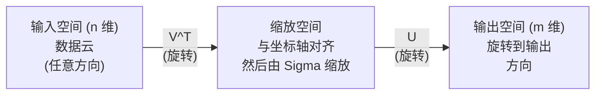
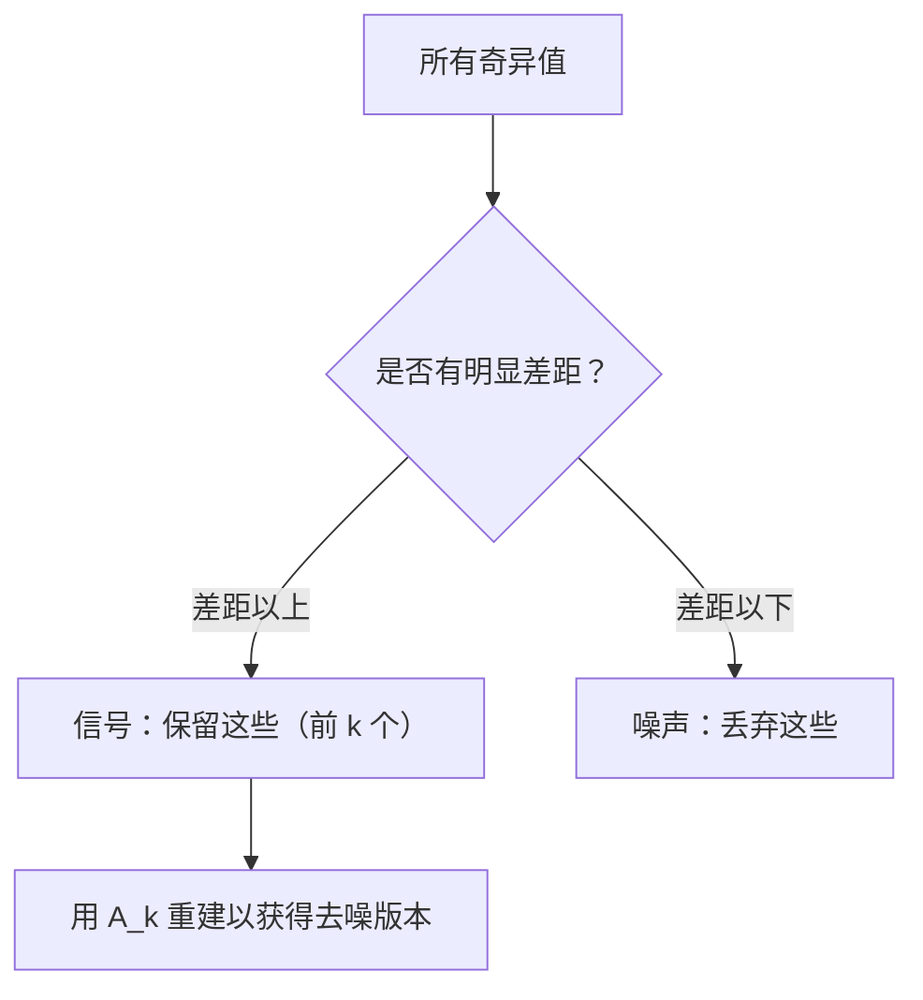

# 奇异值分解

> SVD 是线性代数的瑞士军刀。每个矩阵都有一个。每个数据科学家都需要一个。

**类型：** 构建
**语言：** Python, Julia
**先决条件：** 阶段 1，第 01 课（线性代数直觉），第 02 课（向量与矩阵运算），第 03 课（矩阵变换）
**时间：** ~120 分钟

## 学习目标

- 通过幂迭代实现 SVD，并解释 U、Sigma 和 V^T 的几何含义
- 应用截断 SVD 进行图像压缩，并测量压缩比与重建误差
- 通过 SVD 计算 Moore-Penrose 伪逆来求解超定最小二乘系统
- 将 SVD 与 PCA、推荐系统（潜在因子）和 NLP 中的潜在语义分析（LSA）连接起来

## 问题

你有一个 1000x2000 的矩阵。也许是用户-电影评分。也许是文档-词项频率表。也许是一张图像的像素值。你需要压缩它、去噪它、发现其中的隐藏结构，或者用其求解最小二乘系统。特征分解只能处理方阵。即使如此，它也要求矩阵有一组完整的线性无关特征向量。

SVD 适用于任何矩阵。任何形状。任何秩。没有任何条件限制。它将矩阵分解为三个因子，揭示了该矩阵对空间所做的几何变换。它是线性代数中最通用也最有用的分解。

## 概念

### SVD 在几何上做了什么

每个矩阵，无论形状如何，都会顺序执行三种操作：旋转、缩放、旋转。SVD 使这种分解变得显式。

```
A = U * Sigma * V^T

      m x n     m x m    m x n    n x n
     (任意)    (旋转)  (缩放)  (旋转)
```

给定任意矩阵 A，SVD 将其分解为：
- V^T 在输入空间（n 维）中旋转向量
- Sigma 沿每个轴缩放（拉伸或压缩）
- U 将结果旋转到输出空间（m 维）



可以这样理解：你将一个矩阵交给 SVD，它告诉你："这个矩阵将一球输入先通过 V^T 旋转，然后通过 Sigma 将其拉伸成一个椭球，最后通过 U 旋转该椭球。"奇异值就是椭球各轴的长度。

### 完整的分解

对于形状为 m x n 的矩阵 A：

```
A = U * Sigma * V^T

其中：
  U     是 m x m，正交矩阵（U^T U = I）
  Sigma 是 m x n，对角矩阵（奇异值在对角线上）
  V     是 n x n，正交矩阵（V^T V = I）

奇异值 sigma_1 >= sigma_2 >= ... >= sigma_r > 0
其中 r = rank(A)
```

U 的列称为左奇异向量。V 的列称为右奇异向量。Sigma 的对角线元素称为奇异值。它们始终是非负的，并按照惯例以降序排列。

### 左奇异向量、奇异值、右奇异向量

SVD 的每个分量都有独特的几何含义。

**右奇异向量（V 的列）：** 这些构成了输入空间（R^n）的一组标准正交基。它们是输入空间中矩阵映射到输出空间中正交方向的方向。可以将其视为定义域的自然坐标系。

**奇异值（Sigma 的对角线）：** 这些是缩放因子。第 i 个奇异值告诉你矩阵沿第 i 个右奇异向量拉伸向量的程度。奇异值为零意味着矩阵完全压扁了该方向。

**左奇异向量（U 的列）：** 这些构成了输出空间（R^m）的一组标准正交基。第 i 个左奇异向量是第 i 个右奇异向量（缩放后）到达的输出空间方向。

它们之间的关系：

```
A * v_i = sigma_i * u_i

矩阵 A 将第 i 个右奇异向量 v_i，
缩放 sigma_i 倍，映射到第 i 个左奇异向量 u_i。
```

这给出了任何矩阵所做的逐坐标变换图景。

### 外积形式

SVD 可以写成一堆秩 1 矩阵的和：

```
A = sigma_1 * u_1 * v_1^T + sigma_2 * u_2 * v_2^T + ... + sigma_r * u_r * v_r^T

每一项 sigma_i * u_i * v_i^T 是一个秩 1 矩阵（外积）。
整个矩阵是 r 个这样的矩阵的和，其中 r 是秩。
```

这种形式是低秩近似的基础。每一项添加一层结构。第一项捕捉最重要的单一模式。第二项捕捉次重要的。依此类推。截断该和可以在任何给定秩下得到可能的最佳近似。

```
秩 1 近似：   A_1 = sigma_1 * u_1 * v_1^T
                 （捕捉主导模式）

秩 2 近似：   A_2 = sigma_1 * u_1 * v_1^T + sigma_2 * u_2 * v_2^T
                 （捕捉两个最重要的模式）

秩 k 近似：   A_k = 前 k 项之和
                 （根据 Eckart-Young 定理是最优的）
```

### 与特征分解的关系

SVD 和特征分解密切相关。A 的奇异值和奇异向量直接来自 A^T A 和 A A^T 的特征值和特征向量。

```
A^T A = V * Sigma^T * U^T * U * Sigma * V^T
      = V * Sigma^T * Sigma * V^T
      = V * D * V^T

其中 D = Sigma^T * Sigma 是一个对角矩阵，对角线上是 sigma_i^2。

因此：
- 右奇异向量（V）是 A^T A 的特征向量
- 奇异值的平方（sigma_i^2）是 A^T A 的特征值

类似地：
A A^T = U * Sigma * V^T * V * Sigma^T * U^T
      = U * Sigma * Sigma^T * U^T

因此：
- 左奇异向量（U）是 A A^T 的特征向量
- A A^T 的特征值也是 sigma_i^2
```

这种联系告诉你三件事：
1. 奇异值始终是实数且非负的（它们是正半定矩阵特征值的平方根）。
2. 你可以通过对 A^T A 进行特征分解来计算 SVD，但这会平方条件数并损失数值精度。专门的 SVD 算法避免了这种情况。
3. 当 A 是方形且对称正半定时，SVD 和特征分解是同一回事。

### 截断 SVD：低秩近似

Eckart-Young-Mirsky 定理指出，对 A 的最佳秩 k 近似（在 Frobenius 和谱范数下）是通过仅保留前 k 个奇异值及其对应向量获得的：

```
A_k = U_k * Sigma_k * V_k^T

其中：
  U_k     是 m x k（U 的前 k 列）
  Sigma_k 是 k x k（Sigma 的左上 k x k 块）
  V_k     是 n x k（V 的前 k 列）

近似误差 = sigma_{k+1}（谱范数）
         = sqrt(sigma_{k+1}^2 + ... + sigma_r^2)（Frobenius 范数）
```

这不仅是一个"好的"近似。它是可证明的秩 k 下的最佳近似。没有其他秩 k 矩阵比 A 更接近。

| 分量 | 相对大小 | 在秩 3 近似中保留？ |
|-----------|-------------------|------------------------|
| sigma_1 | 最大 | 是 |
| sigma_2 | 大 | 是 |
| sigma_3 | 中大 | 是 |
| sigma_4 | 中 | 否（误差） |
| sigma_5 | 中小 | 否（误差） |
| sigma_6 | 小 | 否（误差） |
| sigma_7 | 很小 | 否（误差） |
| sigma_8 | 极小 | 否（误差） |

保留前 3 个：A_3 捕捉了三个最大的奇异值。误差 = 剩余值（sigma_4 到 sigma_8）。

如果奇异值衰减很快，一个小的 k 就能捕捉矩阵的大部分。如果它们衰减缓慢，则该矩阵没有低秩结构。

### 使用 SVD 进行图像压缩

灰度图像是像素强度的矩阵。一张 800x600 的图像有 480,000 个值。SVD 允许你用少得多的值来近似它。

```
原始图像：800 x 600 = 480,000 个值

秩 k 的 SVD：
  U_k:      800 x k 个值
  Sigma_k:  k 个值
  V_k:      600 x k 个值
  总计:     k * (800 + 600 + 1) = k * 1401 个值

  k=10:   14,010 个值   (原始的 2.9%)
  k=50:   70,050 个值  (原始的 14.6%)
  k=100: 140,100 个值  (原始的 29.2%)

  压缩比随着 k 减小而提高，
  但视觉质量会下降。
```

关键洞察：自然图像的奇异值衰减很快。前几个奇异值捕捉大范围结构（形状、梯度）。后面的捕捉细节和噪声。在秩 50 处截断通常能产生与原始图像几乎相同的图像，同时使用少 85% 的存储空间。

### SVD 用于推荐系统

Netflix Prize 使这一方法出名。你有一个用户-电影评分矩阵，其中大部分条目缺失。

```
             电影1  电影2  电影3  电影4  电影5
  用户1      [  5      ?       3       ?       1  ]
  用户2      [  ?      4       ?       2       ?  ]
  用户3      [  3      ?       5       ?       ?  ]
  用户4      [  ?      ?       ?       4       3  ]

  ? = 未知评分
```

思路：这个评分矩阵具有低秩性。用户不会拥有完全独立的品味。有少数潜在因子（动作 vs 剧情，老片 vs 新片，烧脑 vs 感官）可以解释大多数偏好。

对（填充后的）评分矩阵进行 SVD 将其分解为：
- U：潜在因子空间中的用户画像
- Sigma：每个潜在因子的重要性
- V^T：潜在因子空间中的电影画像

用户对电影的预测评分是其用户画像与电影画像的点积（由奇异值加权）。低秩近似填充缺失的条目。

在实践中，你使用的是 Simon Funk 的增量 SVD 或 ALS（交替最小二乘法）等直接处理缺失数据的变体。但核心思想是相同的：通过 SVD 进行潜在因子分解。

### SVD 在 NLP 中的应用：潜在语义分析

潜在语义分析（LSA），也称为潜在语义索引（LSI），将 SVD 应用于词项-文档矩阵。

```
             文档1   文档2   文档3   文档4
  "猫"      [  3      0      1      0  ]
  "狗"      [  2      0      0      1  ]
  "鱼"      [  0      4      1      0  ]
  "宠物"    [  1      1      1      1  ]
  "海洋"    [  0      3      0      0  ]

在秩 k=2 的 SVD 之后：

  每个文档成为 2D "概念空间"中的一个点。
  每个词项成为同一个 2D 空间中的一个点。
  主题相似的文档聚类在一起。
  含义相似的词项聚类在一起。

  "猫"和"狗"最终彼此靠近（陆地宠物）。
  "鱼"和"海洋"最终彼此靠近（水域概念）。
  如果文档 1 和文档 3 共享相似主题，它们会聚类在一起。
```

LSA 是最早成功捕获原始文本语义相似性方法之一。它的工作原理是：同义词往往出现在类似的文档中，因此 SVD 将它们分组到相同的潜在维度。现代词嵌入（Word2Vec、GloVe）可以看作是该思想的衍生。

### SVD 用于降噪

噪声数据的信号集中在前几个奇异值中，而噪声分布在所有奇异值上。截断可以去除噪底。

**干净信号的奇异值：**

| 分量 | 大小 | 类型 |
|-----------|-----------|------|
| sigma_1 | 非常大 | 信号 |
| sigma_2 | 大 | 信号 |
| sigma_3 | 中 | 信号 |
| sigma_4 | 接近零 | 可忽略 |
| sigma_5 | 接近零 | 可忽略 |

**含噪信号的奇异值（噪声添加到所有上）：**

| 分量 | 大小 | 类型 |
|-----------|-----------|------|
| sigma_1 | 非常大 | 信号 |
| sigma_2 | 大 | 信号 |
| sigma_3 | 中 | 信号 |
| sigma_4 | 小 | 噪声 |
| sigma_5 | 小 | 噪声 |
| sigma_6 | 小 | 噪声 |
| sigma_7 | 小 | 噪声 |



这被用于信号处理、科学测量和数据清洗。任何时候你有一个被加性噪声污染的矩阵，截断 SVD 是一种有原则的分离信号和噪声的方法。

### 通过 SVD 计算伪逆

Moore-Penrose 伪逆 A+ 将矩阵求逆推广到非方形和奇异矩阵。SVD 使计算它变得简单。

```
如果 A = U * Sigma * V^T，则：

A+ = V * Sigma+ * U^T

其中 Sigma+ 通过以下方式形成：
  1. 转置 Sigma（交换行和列）
  2. 将每个非零对角元素 sigma_i 替换为 1/sigma_i
  3. 将零保留为零

对于 A (m x n)：     A+ 是 (n x m)
对于 Sigma (m x n)： Sigma+ 是 (n x m)
```

伪逆求解最小二乘问题。如果 Ax = b 没有精确解（超定系统），则 x = A+ b 是最小二乘解（最小化 ||Ax - b||）。

```
超定系统（方程数量多于未知数）：

  [1  1]         [3]
  [2  1] x   =   [5]       不存在精确解。
  [3  1]         [6]

  x_ls = A+ b = V * Sigma+ * U^T * b

  这给出了最小化残差平方和的 x。
  结果与正规方程 (A^T A)^(-1) A^T b 相同，
  但数值上更稳定。
```

### 数值稳定性优势

计算 A^T A 的特征分解会平方奇异值（A^T A 的特征值是 sigma_i^2）。这会平方条件数，放大数值误差。

```
例如：
  A 的奇异值为 [1000, 1, 0.001]
  A 的条件数：1000 / 0.001 = 10^6

  A^T A 的特征值为 [10^6, 1, 10^{-6}]
  A^T A 的条件数：10^6 / 10^{-6} = 10^{12}

  直接计算 SVD：在条件数 10^6 下工作
  通过 A^T A 计算：在条件数 10^{12} 下工作
                         （损失 6 位额外精度）
```

现代 SVD 算法（Golub-Kahan 双对角化）直接在 A 上工作，从不形成 A^T A。这就是为什么你应该始终优先使用 `np.linalg.svd(A)` 而不是 `np.linalg.eig(A.T @ A)`。

### 与 PCA 的关系

PCA 就是对中心化数据做 SVD。这不是类比。它是字面上相同的计算。

```
给定数据矩阵 X（n_samples x n_features），已中心化（减去均值）：

协方差矩阵：C = (1/(n-1)) * X^T X

PCA 找 C 的特征向量。但是：

  X = U * Sigma * V^T    （X 的 SVD）

  X^T X = V * Sigma^2 * V^T

  C = (1/(n-1)) * V * Sigma^2 * V^T

因此主成分恰好是右奇异向量 V。
每个分量的解释方差为 sigma_i^2 / (n-1)。

在 sklearn 中，PCA 是使用 SVD 实现的，而不是特征分解。
它更快，数值上更稳定。
```

这意味着你在第 10 课中学到的所有关于降维的内容在底层都是 SVD。PCA 是 SVD 在机器学习中最常见的应用。

```figure
svd-rank-reconstruction
```

## 构建它

### 步骤 1：通过幂迭代从零实现 SVD

核心思想：要找到最大的奇异值及其向量，对 A^T A（或 A A^T）使用幂迭代。然后紧缩矩阵，对下一个奇异值重复。

```python
import numpy as np

def power_iteration(M, num_iters=100):
    n = M.shape[1]
    v = np.random.randn(n)
    v = v / np.linalg.norm(v)

    for _ in range(num_iters):
        Mv = M @ v
        v = Mv / np.linalg.norm(Mv)

    eigenvalue = v @ M @ v
    return eigenvalue, v

def svd_from_scratch(A, k=None):
    m, n = A.shape
    if k is None:
        k = min(m, n)

    sigmas = []
    us = []
    vs = []

    A_residual = A.copy().astype(float)

    for _ in range(k):
        AtA = A_residual.T @ A_residual
        eigenvalue, v = power_iteration(AtA, num_iters=200)

        if eigenvalue < 1e-10:
            break

        sigma = np.sqrt(eigenvalue)
        u = A_residual @ v / sigma

        sigmas.append(sigma)
        us.append(u)
        vs.append(v)

        A_residual = A_residual - sigma * np.outer(u, v)

    U = np.column_stack(us) if us else np.empty((m, 0))
    S = np.array(sigmas)
    V = np.column_stack(vs) if vs else np.empty((n, 0))

    return U, S, V
```

### 步骤 2：测试并与 NumPy 比较

```python
np.random.seed(42)
A = np.random.randn(5, 4)

U_ours, S_ours, V_ours = svd_from_scratch(A)
U_np, S_np, Vt_np = np.linalg.svd(A, full_matrices=False)

print("我们的奇异值:", np.round(S_ours, 4))
print("NumPy 奇异值:", np.round(S_np, 4))

A_reconstructed = U_ours @ np.diag(S_ours) @ V_ours.T
print(f"重建误差: {np.linalg.norm(A - A_reconstructed):.8f}")
```

### 步骤 3：图像压缩演示

```python
def compress_image_svd(image_matrix, k):
    U, S, Vt = np.linalg.svd(image_matrix, full_matrices=False)
    compressed = U[:, :k] @ np.diag(S[:k]) @ Vt[:k, :]
    return compressed

image = np.random.seed(42)
rows, cols = 200, 300
image = np.random.randn(rows, cols)

for k in [1, 5, 10, 20, 50]:
    compressed = compress_image_svd(image, k)
    error = np.linalg.norm(image - compressed) / np.linalg.norm(image)
    original_size = rows * cols
    compressed_size = k * (rows + cols + 1)
    ratio = compressed_size / original_size
    print(f"k={k:>3d}  误差={error:.4f}  存储={ratio:.1%}")
```

### 步骤 4：降噪

```python
np.random.seed(42)
clean = np.outer(np.sin(np.linspace(0, 4*np.pi, 100)),
                 np.cos(np.linspace(0, 2*np.pi, 80)))
noise = 0.3 * np.random.randn(100, 80)
noisy = clean + noise

U, S, Vt = np.linalg.svd(noisy, full_matrices=False)
denoised = U[:, :5] @ np.diag(S[:5]) @ Vt[:5, :]

print(f"含噪误差:    {np.linalg.norm(noisy - clean):.4f}")
print(f"去噪误差: {np.linalg.norm(denoised - clean):.4f}")
print(f"改进幅度:    {(1 - np.linalg.norm(denoised - clean) / np.linalg.norm(noisy - clean)):.1%}")
```

### 步骤 5：伪逆

```python
A = np.array([[1, 1], [2, 1], [3, 1]], dtype=float)
b = np.array([3, 5, 6], dtype=float)

U, S, Vt = np.linalg.svd(A, full_matrices=False)
S_inv = np.diag(1.0 / S)
A_pinv = Vt.T @ S_inv @ U.T

x_svd = A_pinv @ b
x_lstsq = np.linalg.lstsq(A, b, rcond=None)[0]
x_pinv = np.linalg.pinv(A) @ b

print(f"SVD 伪逆解:  {x_svd}")
print(f"np.linalg.lstsq 解:   {x_lstsq}")
print(f"np.linalg.pinv 解:    {x_pinv}")
```

## 使用它

完整的工作演示在 `code/svd.py` 中。运行它可以看到 SVD 应用于图像压缩、推荐系统、潜在语义分析和降噪。

```bash
python svd.py
```

`code/svd.jl` 中的 Julia 版本使用 Julia 的原生 `svd()` 函数和 `LinearAlgebra` 包演示了相同的概念。

```bash
julia svd.jl
```

## 输出成果

本课产出：
- `outputs/skill-svd.md`——一个用于在真实项目中了解何时以及如何应用 SVD 的技能

## 练习

1. 从头实现完整 SVD，不使用幂迭代。改为计算 A^T A 的特征分解以获得 V 和奇异值，然后计算 U = A V Sigma^{-1}。将数值精度与你的幂迭代版本和 NumPy 进行比较。

2. 加载一张真实的灰度图像（或将一张图像转换为灰度）。在秩 1、5、10、25、50、100 下进行压缩。对每个秩，计算压缩比和相对误差。找出图像在视觉上可接受的秩。

3. 构建一个小型推荐系统。创建一个 10x8 的用户-电影评分矩阵，包含一些已知条目。用行均值填充缺失条目。计算 SVD 并重建秩 3 近似。使用重建矩阵预测缺失评分。验证预测是否合理。

4. 创建一个 100x50 的文档-词项矩阵，包含 3 个合成主题。每个主题有 5 个关联词项。添加噪声。应用 SVD 并验证前 3 个奇异值远大于其余的。将文档投影到 3D 潜在空间，检查同一主题的文档是否聚类在一起。

5. 生成一个干净的低秩矩阵（秩 3，大小 50x40），添加不同级别（sigma = 0.1, 0.5, 1.0, 2.0）的高斯噪声。对每个噪声级别，通过从 1 到 40 扫描 k 并测量与干净矩阵的重建误差来找到最优截断秩。绘制最优 k 如何随噪声级别变化。

## 关键术语

| 术语 | 人们说的 | 实际含义 |
|------|----------------|----------------------|
| SVD | "分解任何矩阵" | 将 A 分解为 U Sigma V^T，其中 U 和 V 是正交的，Sigma 是对角的且具有非负条目。适用于任何形状的任意矩阵。 |
| 奇异值 | "该分量有多重要" | Sigma 的第 i 个对角元素。衡量矩阵沿第 i 个主方向拉伸的程度。始终非负，按降序排列。 |
| 左奇异向量 | "输出方向" | U 的一列。第 i 个右奇异向量（缩放 sigma_i 倍后）映射到的输出空间方向。 |
| 右奇异向量 | "输入方向" | V 的一列。矩阵映射到第 i 个左奇异向量（缩放 sigma_i 倍后）的输入空间方向。 |
| 截断 SVD | "低秩近似" | 仅保留前 k 个奇异值及其向量。产生可证明的最佳秩 k 近似（Eckart-Young 定理）。 |
| 秩 | "真实的维度" | 非零奇异值的数量。告诉你矩阵实际使用了多少个独立方向。 |
| 伪逆 | "广义逆" | V Sigma+ U^T。翻转非零奇异值，将零保留为零。为非方形或奇异矩阵求解最小二乘问题。 |
| 条件数 | "对误差有多敏感" | sigma_max / sigma_min。大的条件数意味着小的输入变化导致大的输出变化。SVD 直接揭示这一点。 |
| 潜在因子 | "隐藏变量" | SVD 发现的低秩空间中的一个维度。在推荐系统中，潜在因子可能对应类型偏好。在 NLP 中，可能对应一个主题。 |
| Frobenius 范数 | "矩阵的总大小" | 所有条目平方和的平方根。等于奇异值平方和的平方根。用于测量近似误差。 |
| Eckart-Young 定理 | "SVD 给出最佳压缩" | 对任何目标秩 k，截断 SVD 在所有可能的秩 k 矩阵上最小化近似误差。 |
| 幂迭代 | "找到最大的特征向量" | 反复将矩阵乘以一个随机向量并归一化。收敛到最大特征值对应的特征向量。许多 SVD 算法的构建块。 |

## 进一步阅读

- [Gilbert Strang: Linear Algebra and Its Applications, 第 7 章](https://math.mit.edu/~gs/linearalgebra/)——对 SVD 及其应用的详尽处理
- [3Blue1Brown: But what is the SVD?](https://www.youtube.com/watch?v=vSczTbgc8Rc)——SVD 的几何直觉
- [We Recommend a Singular Value Decomposition](https://www.ams.org/publicoutreach/feature-column/fcarc-svd)——美国数学学会的通俗概述
- [Netflix Prize and Matrix Factorization](https://sifter.org/~simon/journal/20061211.html)——Simon Funk 关于 SVD 用于推荐的原始博客文章
- [Latent Semantic Analysis](https://en.wikipedia.org/wiki/Latent_semantic_analysis)——NLP 中 SVD 的原始应用
- [Numerical Linear Algebra by Trefethen and Bau](https://people.maths.ox.ac.uk/trefethen/text.html)——理解 SVD 算法及其数值性质的黄金标准
