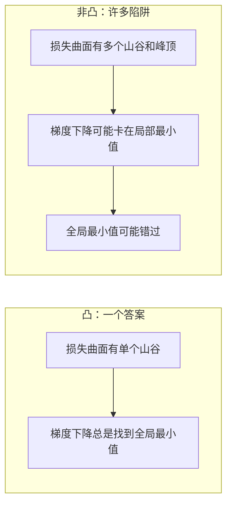
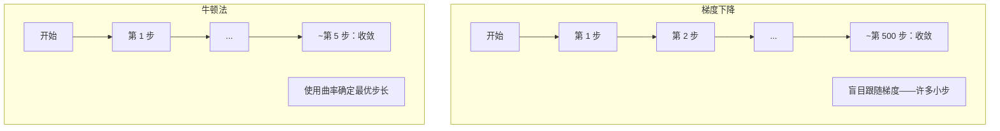
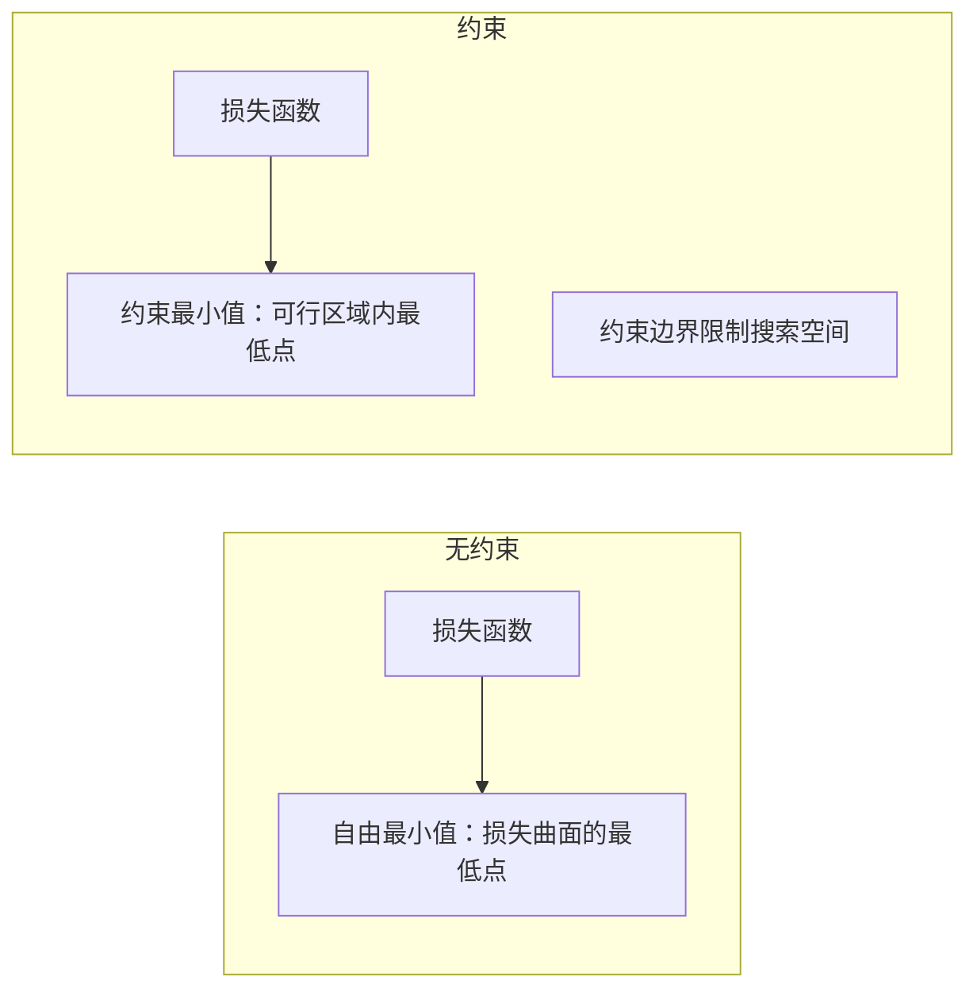
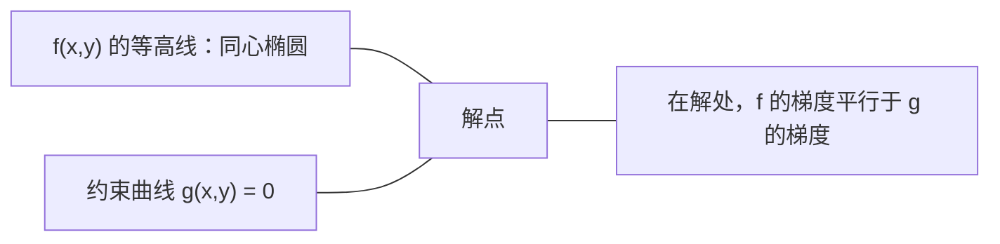

# 凸优化

> 凸问题有一个谷底。神经网络有数百万个。知道区别很重要。

**类型：** 构建
**语言：** Python
**先决条件：** 阶段 1，第 04 课（机器学习中的微积分），第 08 课（优化）
**时间：** ~90 分钟

## 学习目标

- 使用定义、二阶导数和 Hessian 标准测试函数是否为凸函数
- 实现牛顿法，并将其二次收敛速度与梯度下降进行比较
- 使用拉格朗日乘子法求解约束优化问题，并解释 KKT 条件
- 解释为什么神经网络损失曲面是非凸的，但 SGD 仍然能找到好的解

## 问题

第 08 课教了你梯度下降、动量和 Adam。那些优化器在任意曲面上走下坡。但它们没有保证。非凸曲面上的梯度下降可能陷入坏的局部最小值，卡在马鞍点上，或永远振荡。你仍然使用它，因为神经网络是非凸的，而且没有替代方案。

但机器学习中的许多问题是凸的。线性回归、逻辑回归、SVM、LASSO、岭回归。对于这些问题，存在更强的工具：有数学保证的优化。一个凸问题恰好有一个谷底。任何下坡走的算法都会到达全局最小值。不需要重启。不需要学习率调度。不需要祈祷。

理解凸性做三件事。第一，它告诉你问题何时是简单的（凸的）vs 困难的（非凸的）。第二，它给你更快的工具，如凸问题的牛顿法。第三，它解释了贯穿 ML 的概念：正则化作为一种约束，SVM 中的对偶性，以及为什么深度学习在违反凸性赋予的每个好的性质的情况下仍然有效。

## 概念

### 凸集

一个集合 S 是凸的，如果对 S 中的任意两点，它们之间的线段也完全位于 S 中。

| 凸集 | 非凸集 |
|---|---|
| **矩形**：内部任意两点可以通过一条保持在内部的线段连接 | **星形/月牙形**：两个内部点之间的线可能穿过集合的外部 |
| **三角形**：相同性质对所有内部点成立 | **甜甜圈/环面**：洞意味着某些线段离开集合 |
| 任意两点之间的线段保持在集合内 | 某些点对之间的线段离开集合 |

形式化检验：对 S 中的任意点 x, y 和 [0, 1] 中的任意 t，点 tx + (1-t)y 也在 S 中。

凸集的例子：
- 一条线，一个平面，整个 R^n
- 一个球（圆、球面、超球面）
- 一个半空间：{x : a^T x <= b}
- 任意数量凸集的交集

非凸集的例子：
- 一个甜甜圈（环面）
- 两个不相交的圆的并集
- 任何有"凹痕"或"洞"的集合

### 凸函数

函数 f 是凸的，如果其定义域是凸集，且对定义域中的任意两点 x, y 和 [0, 1] 中的任意 t：

```
f(tx + (1-t)y) <= t*f(x) + (1-t)*f(y)
```

几何上：图像上任意两点之间的线段位于图像上方或在图像上。

| 性质 | 凸函数 | 非凸函数 |
|---|---|---|
| **线段检验** | 图像上任意两点之间的线位于曲线**上方或上** | 图像上某些点之间的线下沉到曲线**下方** |
| **形状** | 单个朝上弯曲的碗/谷 | 多个峰值和谷值，混合曲率 |
| **局部最小值** | 每个局部最小值都是全局最小值 | 多个局部最小值可能存在于不同高度 |

常见的凸函数：
- f(x) = x^2（抛物线）
- f(x) = |x|（绝对值）
- f(x) = e^x（指数函数）
- f(x) = max(0, x)（ReLU，尽管是分段线性的）
- f(x) = -log(x) 对于 x > 0（负对数）
- 任意线性函数 f(x) = a^T x + b（既凸又凹）

### 检验凸性

三个实用检验，从最简单到最严格。

**检验 1：二阶导数检验（1D）。** 如果 f''(x) >= 0 对所有 x 成立，则 f 是凸的。

- f(x) = x^2: f''(x) = 2 >= 0。凸。
- f(x) = x^3: f''(x) = 6x。对于 x < 0 为负。不凸。
- f(x) = e^x: f''(x) = e^x > 0。凸。

**检验 2：Hessian 检验（多变量）。** 如果 Hessian 矩阵 H(x) 对所有 x 是正半定的，则 f 是凸的。Hessian 是二阶偏导数的矩阵。

**检验 3：定义检验。** 直接检查不等式 f(tx + (1-t)y) <= t*f(x) + (1-t)*f(y)。对导数难以计算的函数有用。

### 为什么凸性很重要

凸优化的中心定理：

**对于凸函数，每个局部最小值都是全局最小值。**

这意味着梯度下降不会被困住。任何下坡的路径都通向相同的答案。算法保证收敛到最优解。



后果：
- 不需要随机重启
- 不需要复杂的学习率调度
- 收敛证明是可能的（速度取决于函数性质）
- 解（在平坦区域内部）是唯一的

### ML 中的凸 vs 非凸

| 问题 | 凸？ | 原因 |
|---------|---------|-----|
| 线性回归（MSE） | 是 | 损失在权重上是二次的 |
| 逻辑回归 | 是 | 对数损失在权重上是凸的 |
| SVM（铰链损失） | 是 | 线性函数的最大值 |
| LASSO（L1 回归） | 是 | 凸函数的和是凸的 |
| 岭回归（L2） | 是 | 二次 + 二次 = 凸 |
| 神经网络（任意损失） | 否 | 非线性激活创建非凸曲面 |
| k-means 聚类 | 否 | 离散分配步骤 |
| 矩阵分解 | 否 | 未知数的乘积 |

具有凸损失的线性模型是凸的。添加带有非线性激活的隐藏层的瞬间，凸性破裂。

### Hessian 矩阵

函数 f: R^n -> R 的 Hessian H 是 n x n 的二阶偏导数矩阵。

```
H[i][j] = d^2 f / (dx_i dx_j)
```

对于 f(x, y) = x^2 + 3xy + y^2：

```
df/dx = 2x + 3y       d^2f/dx^2 = 2      d^2f/dxdy = 3
df/dy = 3x + 2y       d^2f/dydx = 3      d^2f/dy^2 = 2

H = [ 2  3 ]
    [ 3  2 ]
```

Hessian 告诉你关于曲率的信息：
- 所有特征值正：函数在每个方向上向上弯曲（在该点凸）
- 所有特征值负：在每个方向上向下弯曲（凹，局部最大值）
- 混合符号：马鞍点（在某些方向向上弯，在另一些向下弯）
- 零特征值：在该方向平坦（退化的）

对于凸性，Hessian 必须在处处是正半定的（所有特征值 >= 0），而不仅仅在某一点。

### 牛顿法

梯度下降使用一阶信息（梯度）。牛顿法使用二阶信息（Hessian）。它在当前点拟合二次近似，并直接跳到该二次的最小值。

```
更新规则：
  x_new = x - H^(-1) * 梯度

与梯度下降比较：
  x_new = x - lr * 梯度
```

牛顿法用逆 Hessian 替换标量学习率。这根据局部曲率自动调整步长和方向。



优点：
- 在最小值附近二次收敛（误差每步平方）
- 没有需要调整的学习率
- 尺度不变（无论你如何参数化问题都有效）

缺点：
- 计算 Hessian 花费 O(n^2) 内存和 O(n^3) 求逆
- 对于有 100 万权重的神经网络，那是 10^12 个条目和 10^18 次操作
- 对深度学习不实用

### 约束优化

无约束优化：在所有 x 上最小化 f(x)。
约束优化：在约束下最小化 f(x)。

真实问题有约束。你想最小化成本但预算有限。你想最小化误差但模型复杂度有界。



### 拉格朗日乘子法

拉格朗日乘子法将约束问题转换为无约束问题。

问题：在 g(x) = 0 约束下最小化 f(x)。

解法：引入一个新变量（拉格朗日乘子 lambda）并求解无约束问题：

```
L(x, lambda) = f(x) + lambda * g(x)
```

在解处，L 的梯度为零：

```
dL/dx = df/dx + lambda * dg/dx = 0
dL/dlambda = g(x) = 0
```

几何直觉：在约束最小值处，f 的梯度必须平行于约束 g 的梯度。如果它们不平行，你可以沿约束曲面移动并进一步减小 f。



例子：在 x + y = 1 约束下最小化 f(x,y) = x^2 + y^2。

```
L = x^2 + y^2 + lambda(x + y - 1)

dL/dx = 2x + lambda = 0  =>  x = -lambda/2
dL/dy = 2y + lambda = 0  =>  y = -lambda/2
dL/dlambda = x + y - 1 = 0

从前两个：x = y
代入：2x = 1，因此 x = y = 0.5，lambda = -1
```

直线 x + y = 1 上离原点最近的点是 (0.5, 0.5)。

### KKT 条件

Karush-Kuhn-Tucker 条件将拉格朗日乘子法扩展到不等式约束。

问题：在 g_i(x) <= 0（i = 1, ..., m）约束下最小化 f(x)。

KKT 条件（最优性的必要条件）：

```
1. 平稳性：     df/dx + sum(lambda_i * dg_i/dx) = 0
2. 原始可行性：   g_i(x) <= 0  对所有 i
3. 对偶可行性：   lambda_i >= 0  对所有 i
4. 互补松弛：     lambda_i * g_i(x) = 0  对所有 i
```

互补松弛是关键洞察：要么约束是活跃的（g_i = 0，解位于边界上），要么乘子为零（约束无关）。不影响解的约束具有 lambda = 0。

KKT 条件是 SVM 的核心。支持向量是约束活跃（lambda > 0）的数据点。所有其他数据点具有 lambda = 0，不影响决策边界。

### 正则化作为约束优化

L1 和 L2 正则化不是任意的技巧。它们是伪装成约束优化问题。

**L2 正则化（Ridge）：**

```
minimize  Loss(w)  subject to  ||w||^2 <= t

等价的非约束形式：
minimize  Loss(w) + lambda * ||w||^2
```

约束 ||w||^2 <= t 定义一个球（2D 中的圆，3D 中的球面）。解是损失等高线首次接触此球的地方。

**L1 正则化（LASSO）：**

```
minimize  Loss(w)  subject to  ||w||_1 <= t

等价的非约束形式：
minimize  Loss(w) + lambda * ||w||_1
```

约束 ||w||_1 <= t 定义一个菱形（2D 中旋转 45 度的正方形）。

| 性质 | L2 约束（圆） | L1 约束（菱形） |
|---|---|---|
| **约束形状** | 圆（高维中的球面） | 菱形（2D 中旋转的正方形） |
| **损失等高线接触处** | 平滑边界——圆上的任意点 | 角——与轴对齐 |
| **解的行为** | 权重小但非零 | 某些权重恰好为零（稀疏） |
| **结果** | 权重收缩 | 特征选择 |

这解释了为什么 L1 产生稀疏模型（特征选择）而 L2 仅收缩权重。菱形有与轴对齐的角。损失等高线更可能接触角，将一个或多个权重恰好设置为零。

### 对偶性

每个约束优化问题（原始问题）都有一个伴随问题（对偶问题）。对于凸问题，原始和对偶具有相同的最优值。这是强对偶性。

拉格朗日对偶函数：

```
原始：  minimize f(x) subject to g(x) <= 0
拉格朗日：L(x, lambda) = f(x) + lambda * g(x)
对偶函数：d(lambda) = min_x L(x, lambda)
对偶问题：maximize d(lambda) subject to lambda >= 0
```

为什么对偶性很重要：
- 对偶问题有时比原始问题更容易求解
- SVM 在其对偶形式中求解，其中问题仅取决于数据点之间的点积（启用核技巧）
- 对偶提供了原始最优值的下界，对检查解的质量有用

具体对于 SVM：

```
原始：  找到 w, b 最大化间隔 2/||w|| 在以下约束下：
        y_i(w^T x_i + b) >= 1 对所有 i

对偶：  maximize sum(alpha_i) - 0.5 * sum_ij(alpha_i * alpha_j * y_i * y_j * x_i^T x_j)
        subject to alpha_i >= 0 and sum(alpha_i * y_i) = 0

对偶仅涉及点积 x_i^T x_j。
将 x_i^T x_j 替换为 K(x_i, x_j) 得到核技巧。
```

### 为什么深度学习在非凸性下仍然有效

神经网络损失函数是极度非凸的。按照每种经典标准，优化它们应该失败。然而随机梯度下降可靠地找到好解。几个因素解释了这一点。

**大多数局部最小值足够好。** 在高维空间中，随机的临界点（梯度为零的点）绝大多数是马鞍点，而不是局部最小值。存在的少数局部最小值往往具有接近全局最小值的损失值。当参数空间有数百万个维度时，陷入一个糟糕的局部最小值是极其不可能的。

**马鞍点而非局部最小值才是真正的障碍。** 在具有 n 个参数的函数中，马鞍点具有正负曲率方向的混合。对于高维中的随机临界点，所有 n 个特征值都为正（局部最小值）的概率大约是 2^(-n)。几乎所有临界点都是马鞍点。SGD 的噪声帮助逃离它们。

**过参数化平滑了曲面。** 参数多于训练样本的网络具有更平滑、更连接的损失曲面。更宽的网络有更少的坏局部最小值。这与直觉相反但在经验上是一致的。

**损失曲面结构：**

| 性质 | 低维空间 | 高维空间 |
|---|---|---|
| **曲面** | 许多孤立的峰和谷 | 平滑连接的山谷 |
| **最小值** | 许多孤立的局部最小值 | 很少的坏局部最小值；大多数接近最优 |
| **导航** | 难以找到全局最小值 | 许多路径通向好解 |
| **临界点** | 局部最小值和马鞍点的混合 | 绝大多数是马鞍点，不是局部最小值 |

**随机噪声充当隐式正则化。** 小批量 SGD 添加了防止陷入尖锐最小值的噪声。尖锐最小值过拟合；平坦最小值泛化。噪声将优化偏向损失曲面的平坦区域。

### 实践中的二阶方法

纯牛顿法对大型模型不实用。几种近似使二阶信息可用。

**L-BFGS（有限内存 BFGS）：** 使用最后 m 个梯度差近似逆 Hessian。需要 O(mn) 内存而不是 O(n^2)。适用于最多约 10,000 个参数的问题。用于经典 ML（逻辑回归、CRF）但不用于深度学习。

**自然梯度：** 使用 Fisher 信息矩阵（对数似然的期望 Hessian）而不是标准 Hessian。这考虑了概率分布的几何。K-FAC（Kronecker 因子近似曲率）将 Fisher 矩阵近似为 Kronecker 积，使其对神经网络实用。

**无 Hessian 优化：** 使用共轭梯度求解 Hx = g 而从不形成 H。只需要 Hessian-向量积，可以通过自动微分在 O(n) 时间内计算。

**对角近似：** Adam 的二阶矩是 Hessian 对角线的对角近似。AdaHessian 通过使用 Hutchinson 估计器的实际 Hessian 对角元素扩展了这一点。

| 方法 | 内存 | 每步成本 | 何时使用 |
|--------|--------|--------------|-------------|
| 梯度下降 | O(n) | O(n) | 基线，大型模型 |
| 牛顿法 | O(n^2) | O(n^3) | 小型凸问题 |
| L-BFGS | O(mn) | O(mn) | 中型凸问题 |
| Adam | O(n) | O(n) | 深度学习默认 |
| K-FAC | O(n) | O(n) per layer | 研究，大批量训练 |

```figure
convex-vs-nonconvex
```

## 构建它

### 步骤 1：凸性检查器

构建一个通过采样点并检查定义来经验性地检验凸性的函数。

```python
import random
import math

def check_convexity(f, dim, bounds=(-5, 5), samples=1000):
    violations = 0
    for _ in range(samples):
        x = [random.uniform(*bounds) for _ in range(dim)]
        y = [random.uniform(*bounds) for _ in range(dim)]
        t = random.uniform(0, 1)
        mid = [t * xi + (1 - t) * yi for xi, yi in zip(x, y)]
        lhs = f(mid)
        rhs = t * f(x) + (1 - t) * f(y)
        if lhs > rhs + 1e-10:
            violations += 1
    return violations == 0, violations
```

### 步骤 2：2D 牛顿法

使用显式 Hessian 实现牛顿法。比较与梯度下降的收敛速度。

```python
def newtons_method(f, grad_f, hessian_f, x0, steps=50, tol=1e-12):
    x = list(x0)
    history = [x[:]]
    for _ in range(steps):
        g = grad_f(x)
        H = hessian_f(x)
        det = H[0][0] * H[1][1] - H[0][1] * H[1][0]
        if abs(det) < 1e-15:
            break
        H_inv = [
            [H[1][1] / det, -H[0][1] / det],
            [-H[1][0] / det, H[0][0] / det],
        ]
        dx = [
            H_inv[0][0] * g[0] + H_inv[0][1] * g[1],
            H_inv[1][0] * g[0] + H_inv[1][1] * g[1],
        ]
        x = [x[0] - dx[0], x[1] - dx[1]]
        history.append(x[:])
        if sum(gi ** 2 for gi in g) < tol:
            break
    return history
```

### 步骤 3：拉格朗日乘子求解器

使用拉格朗日函数上的梯度下降求解约束优化。

```python
def lagrange_solve(f_grad, g_val, g_grad, x0, lr=0.01,
                   lr_lambda=0.01, steps=5000):
    x = list(x0)
    lam = 0.0
    history = []
    for _ in range(steps):
        fg = f_grad(x)
        gv = g_val(x)
        gg = g_grad(x)
        x = [
            xi - lr * (fgi + lam * ggi)
            for xi, fgi, ggi in zip(x, fg, gg)
        ]
        lam = lam + lr_lambda * gv
        history.append((x[:], lam, gv))
    return history
```

### 步骤 4：比较一阶 vs 二阶

在相同二次函数上运行梯度下降和牛顿法。计算到收敛的步数。

```python
def quadratic(x):
    return 5 * x[0] ** 2 + x[1] ** 2

def quadratic_grad(x):
    return [10 * x[0], 2 * x[1]]

def quadratic_hessian(x):
    return [[10, 0], [0, 2]]
```

牛顿法将在 1 步内收敛（对二次函数是精确的）。梯度下降将花费数百步，因为 Hessian 的特征值相差 5 倍，创建了一个细长的山谷。

## 使用它

在选择 ML 模型和求解器时，凸性分析直接适用。

对于凸问题（逻辑回归、SVM、LASSO）：
- 使用专用求解器（liblinear、CVXPY、scipy.optimize.minimize 使用 method='L-BFGS-B'）
- 期望唯一的全局解
- 二阶方法实用且快速

对于非凸问题（神经网络）：
- 使用一阶方法（SGD、Adam）
- 接受解依赖于初始化和随机性
- 使用过参数化、噪声和学习率调度作为隐式正则化
- 不要浪费时间搜索全局最小值。一个好的局部最小值就足够了。

```python
from scipy.optimize import minimize

result = minimize(
    fun=lambda w: sum((y - X @ w) ** 2) + 0.1 * sum(w ** 2),
    x0=np.zeros(d),
    method='L-BFGS-B',
    jac=lambda w: -2 * X.T @ (y - X @ w) + 0.2 * w,
)
```

对于 SVM，对偶公式让你使用核技巧：

```python
from sklearn.svm import SVC

svm = SVC(kernel='rbf', C=1.0)
svm.fit(X_train, y_train)
print(f"支持向量: {svm.n_support_}")
```

## 练习

1. **凸性图库。** 使用检查器测试这些函数的凸性：f(x) = x^4, f(x) = sin(x), f(x,y) = x^2 + y^2, f(x,y) = x*y, f(x) = max(x, 0)。解释为什么每个结果合理。

2. **牛顿法 vs 梯度下降比赛。** 从起始点 (10, 10) 在 f(x,y) = 50*x^2 + y^2 上运行两种方法。每种需要多少步才能达到损失 < 1e-10？当条件数（最大与最小 Hessian 特征值的比率）增加时，梯度下降会发生什么？

3. **拉格朗日乘子几何。** 在 x + 2y = 4 约束下最小化 f(x,y) = (x-3)^2 + (y-3)^2。通过在解处检查 f 的梯度平行于 g 的梯度来验证解。

4. **正则化约束。** 实现 L1 约束优化：在 |x| + |y| <= 1 约束下最小化 (x-3)^2 + (y-2)^2。展示解有一个坐标为零（菱形约束导致的稀疏性）。

5. **Hessian 特征值分析。** 在 (1,1) 和 (-1,1) 处计算 Rosenbrock 函数的 Hessian。在两点计算特征值。特征值告诉你关于最小值处 vs 远离最小值处的曲率的什么信息？

## 关键术语

| 术语 | 含义 |
|------|---------------|
| 凸集 | 其中任意两点之间的线段保持在集合内的集合 |
| 凸函数 | 图像上任意两点之间的线位于图像上方或之上的函数。等价地，Hessian 处处正半定 |
| 局部最小值 | 比所有邻近点都低的点。对于凸函数，每个局部最小值都是全局最小值 |
| 全局最小值 | 函数在整个定义域上的最低点 |
| Hessian 矩阵 | 所有二阶偏导数的矩阵。编码曲率信息 |
| 正半定 | 特征值均非负的矩阵。"二阶导数 >= 0"的多维版本 |
| 条件数 | Hessian 的最大与最小特征值之比。高条件数意味着细长的山谷和缓慢的梯度下降 |
| 牛顿法 | 二阶优化器，使用逆 Hessian 确定步长方向和大小。在最小值附近二次收敛 |
| 拉格朗日乘子 | 引入以将约束优化问题转换为无约束问题的变量 |
| KKT 条件 | 带有不等式约束的最优性必要条件。推广拉格朗日乘子 |
| 互补松弛 | 在解处，要么约束是活跃的，要么其乘子为零。两者从不同时非零 |
| 对偶性 | 每个约束问题有一个伴随对偶问题。对于凸问题，两者具有相同的最优值 |
| 强对偶性 | 原始和对偶最优值相等。对满足 Slater 条件的凸问题成立 |
| L-BFGS | 存储最后 m 个梯度差而非完整 Hessian 的近似二阶方法 |
| 马鞍点 | 梯度为零但在某些方向是最小值、某些方向是最大值的点 |
| 过参数化 | 使用比训练样本更多的参数。平滑损失曲面并减少坏的局部最小值 |

## 进一步阅读

- [Boyd & Vandenberghe: Convex Optimization](https://web.stanford.edu/~boyd/cvxbook/)——标准教科书，免费在线阅读
- [Bottou, Curtis, Nocedal: Optimization Methods for Large-Scale Machine Learning (2018)](https://arxiv.org/abs/1606.04838)——架起凸优化理论和深度学习实践
- [Choromanska et al.: The Loss Surfaces of Multilayer Networks (2015)](https://arxiv.org/abs/1412.0233)——为什么非凸神经网络曲面不像看起来那么糟糕
- [Nocedal & Wright: Numerical Optimization](https://link.springer.com/book/10.1007/978-0-387-40065-5)——牛顿法、L-BFGS 和约束优化的综合参考
