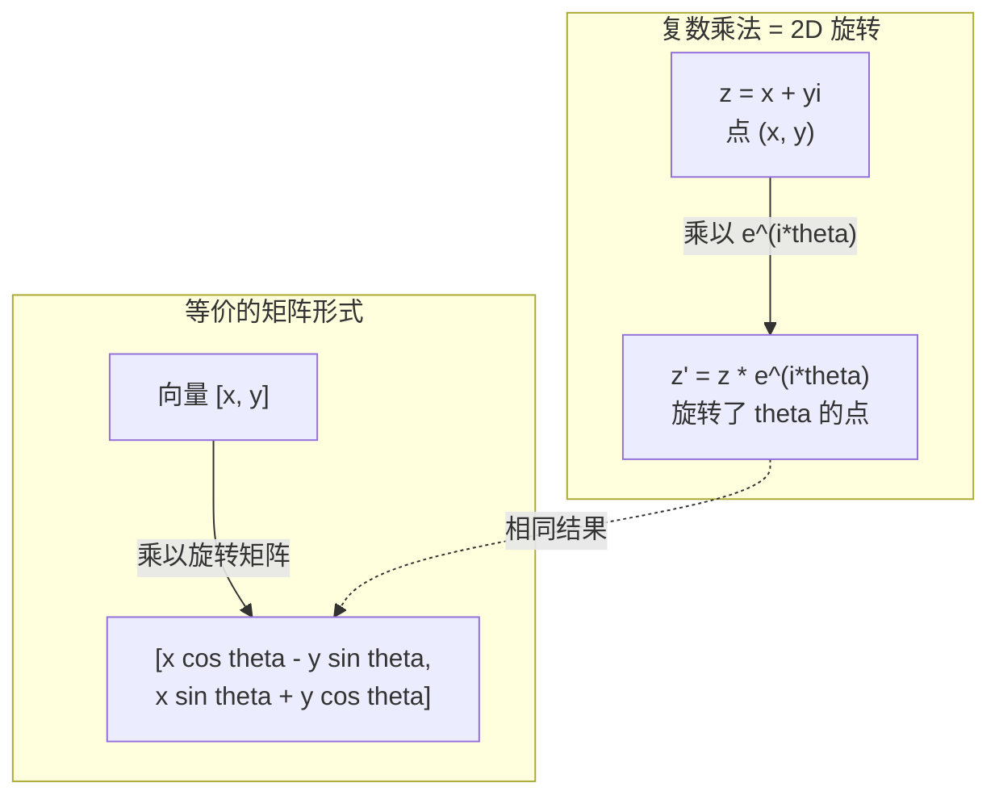
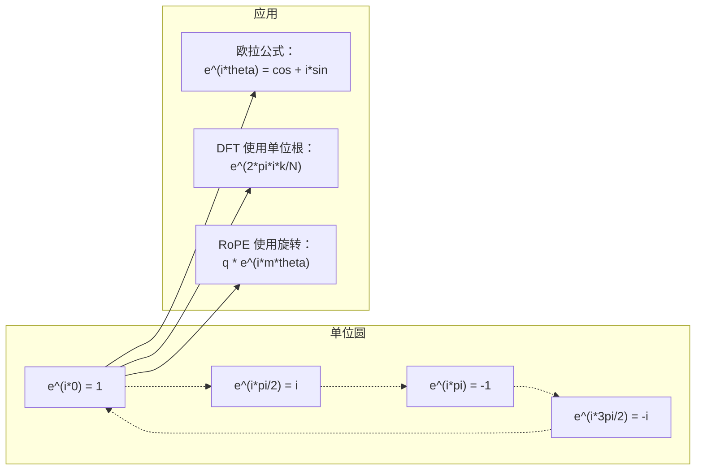

# AI 中的复数

> -1 的平方根不是虚的。它是旋转、频率和一半信号处理的关键。

**类型：** 学习
**语言：** Python
**先决条件：** 阶段 1，第 01-04 课（线性代数、微积分）
**时间：** ~60 分钟

## 学习目标

- 在直角坐标和极坐标形式中执行复数算术（加、乘、除、共轭）
- 应用欧拉公式在复指数和三角函数之间转换
- 使用复单位根实现离散傅里叶变换
- 解释复数旋转如何构成 transformer 中 RoPE 和正弦位置编码的基础

## 问题

你打开一篇傅里叶变换的论文，到处是 `i`。你看 transformer 的位置编码，看到不同频率的 `sin` 和 `cos`——复指数的实部和虚部。你阅读量子计算，发现一切都在复向量空间中表达。

复数似乎很抽象。建立在 -1 平方根上的数系感觉像是一种数学把戏。但它不是把戏。它是旋转和振荡的自然语言。每当有东西旋转、振动或振荡时，复数就是正确的工具。

不理解复数，你就无法理解离散傅里叶变换。你无法理解 FFT。你无法理解现代语言模型中 RoPE（旋转位置嵌入）如何工作。你无法理解为什么原始 Transformer 论文中的正弦位置编码使用它们所使用的频率。

本课从头构建复数算术，将其与几何连接起来，并精确展示复数在机器学习中的出现位置。

## 概念

### 什么是复数？

复数有两部分：实部和虚部。

```
z = a + bi

其中：
  a 是实部
  b 是虚部
  i 是虚数单位，定义 i^2 = -1
```

就是这样。你将数线扩展到平面上。实数位于一个轴上。虚数位于另一个轴上。每个复数都是这个平面上的一个点。

### 复数算术

**加法。** 实部加实部，虚部加虚部。

```
(a + bi) + (c + di) = (a + c) + (b + d)i

例子：(3 + 2i) + (1 + 4i) = 4 + 6i
```

**乘法。** 使用分配律并记住 i^2 = -1。

```
(a + bi)(c + di) = ac + adi + bci + bdi^2
                 = ac + adi + bci - bd
                 = (ac - bd) + (ad + bc)i

例子：(3 + 2i)(1 + 4i) = 3 + 12i + 2i + 8i^2
                            = 3 + 14i - 8
                            = -5 + 14i
```

**共轭。** 翻转虚部的符号。

```
(a + bi) 的共轭 = a - bi
```

一个复数与其共轭的积始终是实数：

```
(a + bi)(a - bi) = a^2 + b^2
```

**除法。** 分子和分母同乘分母的共轭。

```
(a + bi) / (c + di) = (a + bi)(c - di) / (c^2 + d^2)
```

这消除了分母中的虚部，给你一个干净的复数。

### 复平面

复平面将每个复数映射到一个 2D 点。水平轴是实轴，垂直轴是虚轴。

```
z = 3 + 2i  对应点 (3, 2)
z = -1 + 0i 对应实轴上的点 (-1, 0)
z = 0 + 4i  对应虚轴上的点 (0, 4)
```

一个复数同时是一个点和一个从原点出发的向量。这种双重解释使复数对几何有用。

### 极坐标形式

平面中的任何点都可以用其到原点的距离和其与正实轴的夹角来描述。

```
z = r * (cos(theta) + i*sin(theta))

其中：
  r = |z| = sqrt(a^2 + b^2)     （大小，或模）
  theta = atan2(b, a)             （相位，或辐角）
```

直角坐标形式（a + bi）适合加法。极坐标形式（r, theta）适合乘法。

**极坐标形式的乘法。** 大小相乘，角度相加。

```
z1 = r1 * e^(i*theta1)
z2 = r2 * e^(i*theta2)

z1 * z2 = (r1 * r2) * e^(i*(theta1 + theta2))
```

这就是为什么复数对旋转来说完美。乘以大小为 1 的复数就是纯旋转。

### 欧拉公式

复指数和三角函数之间的桥梁：

```
e^(i*theta) = cos(theta) + i*sin(theta)
```

这是本课最重要的公式。当 theta = pi：

```
e^(i*pi) = cos(pi) + i*sin(pi) = -1 + 0i = -1

因此：e^(i*pi) + 1 = 0
```

五个基本常数（e、i、pi、1、0）在一个方程中连接起来。

### 为什么欧拉公式对 ML 很重要

欧拉公式说 `e^(i*theta)` 随 theta 变化沿单位圆转动。在 theta = 0，你在 (1, 0)。在 theta = pi/2，你在 (0, 1)。在 theta = pi，你在 (-1, 0)。在 theta = 3*pi/2，你在 (0, -1)。一整圈是 theta = 2*pi。

这意味着复指数就是旋转。而旋转在信号处理和 ML 中无处不在。

### 与 2D 旋转的联系

将复数 (x + yi) 乘以 e^(i*theta) 将点 (x, y) 绕原点旋转角度 theta。

```
通过复数乘法的旋转：
  (x + yi) * (cos(theta) + i*sin(theta))
  = (x*cos(theta) - y*sin(theta)) + (x*sin(theta) + y*cos(theta))i

通过矩阵乘法的旋转：
  [cos(theta)  -sin(theta)] [x]   [x*cos(theta) - y*sin(theta)]
  [sin(theta)   cos(theta)] [y] = [x*sin(theta) + y*cos(theta)]
```

它们产生相同的结果。复数乘法就是 2D 旋转。旋转矩阵只是以矩阵记法书写的复数乘法。



### 相量和旋转信号

复指数 e^(i*omega*t) 是一个以角频率 omega 绕单位圆旋转的点。随着 t 增加，点沿圆移动。

这个旋转点的实部是 cos(omega*t)。虚部是 sin(omega*t)。正弦信号是旋转复数的影子。

```
e^(i*omega*t) = cos(omega*t) + i*sin(omega*t)

实部：      cos(omega*t)    -- 一个余弦波
虚部：      sin(omega*t)    -- 一个正弦波
```

这就是相量表示法。你不是跟踪一个扭动的正弦波，而是跟踪一个平滑旋转的箭头。相移变成角度偏移。振幅变化变成大小变化。信号相加变成向量加法。

### 单位根

第 N 个单位根是单位圆上 N 个等距的点：

```
w_k = e^(2*pi*i*k/N)    对于 k = 0, 1, 2, ..., N-1
```

对于 N = 4，根为：1, i, -1, -i（四个罗盘点）。
对于 N = 8，你得到四个罗盘点加上四条对角线。

单位根是离散傅里叶变换的基础。DFT 将信号分解为这 N 个等距频率上的分量。

### 与 DFT 的联系

信号 x[0], x[1], ..., x[N-1] 的离散傅里叶变换为：

```
X[k] = sum_{n=0}^{N-1} x[n] * e^(-2*pi*i*k*n/N)
```

每个 X[k] 衡量信号与第 k 个单位根——频率 k 处的复正弦曲线——之间的相关性。DFT 将信号分解为 N 个旋转的相量，并告诉你每个的振幅和相位。

### 为什么 i 不是虚的

"imaginary"（虚的）这个词是历史偶然。笛卡尔贬损地使用了它。但 i 并不比负数在人们最初拒绝它们时更虚。负数回答"你从 3 减 5 得到什么？"虚数单位回答"你平方什么能得到 -1？"

更有用地：i 是一个 90 度旋转操作子。将实数乘以 i 一次，你旋转 90 度到虚轴。再乘以 i（i^2），你再旋转 90 度——现在你指向负实方向。这就是为什么 i^2 = -1。这并不神秘。这是由两个四分之一转组成的半圈。

这就是为什么复数在工程中无处不在。任何旋转的东西——电磁波、量子态、信号振荡、位置编码——都被复数自然地描述。

### 复指数 vs 三角函数

在欧拉公式之前，工程师将信号写为 A*cos(omega*t + phi)——振幅 A，频率 omega，相位 phi。这有效但使算术变得痛苦。添加两个具有不同相位的余弦需要三角恒等式。

使用复指数，相同的信号是 A*e^(i*(omega*t + phi))。添加两个信号就是添加两个复数。乘法（调制）就是大小相乘和角度相加。相移变成角度加法。频移变成乘以相量。

整个信号处理领域切换到复指数记法，因为数学更简洁。"真实信号"始终只是复数表示的实部。虚部作为簿记被携带，使所有代数自然工作。

### 与 Transformer 的联系

**正弦位置编码**（原始 Transformer 论文）：

```
PE(pos, 2i) = sin(pos / 10000^(2i/d))
PE(pos, 2i+1) = cos(pos / 10000^(2i/d))
```

sin 和 cos 对是不同频率下复指数的实部和虚部。每个频率为编码位置提供不同的"分辨率"。低频变化缓慢（粗略位置）。高频变化快速（精细位置）。它们一起给每个位置一个独特的频率指纹。

**RoPE（旋转位置嵌入）** 更进一步。它显式地将查询和键向量乘以旋转复数矩阵。两个 token 之间的相对位置变成一个旋转角度。使用这些旋转向量计算注意力，使模型通过复数乘法对相对位置敏感。

| 操作 | 代数形式 | 几何含义 |
|-----------|---------------|-------------------|
| 加法 | (a+c) + (b+d)i | 平面中的向量加法 |
| 乘法 | (ac-bd) + (ad+bc)i | 旋转和缩放 |
| 共轭 | a - bi | 关于实轴反射 |
| 大小 | sqrt(a^2 + b^2) | 到原点的距离 |
| 相位 | atan2(b, a) | 与正实轴的夹角 |
| 除法 | 乘以共轭 | 反向旋转和重缩 |
| 幂 | r^n * e^(i*n*theta) | 旋转 n 次，缩放 r^n |



```figure
roots-of-unity
```

## 构建它

### 步骤 1：复数类

构建一个支持算术、大小、相位以及直角和极坐标形式之间转换的 Complex 数类。

```python
import math

class Complex:
    def __init__(self, real, imag=0.0):
        self.real = real
        self.imag = imag

    def __add__(self, other):
        return Complex(self.real + other.real, self.imag + other.imag)

    def __mul__(self, other):
        r = self.real * other.real - self.imag * other.imag
        i = self.real * other.imag + self.imag * other.real
        return Complex(r, i)

    def __truediv__(self, other):
        denom = other.real ** 2 + other.imag ** 2
        r = (self.real * other.real + self.imag * other.imag) / denom
        i = (self.imag * other.real - self.real * other.imag) / denom
        return Complex(r, i)

    def magnitude(self):
        return math.sqrt(self.real ** 2 + self.imag ** 2)

    def phase(self):
        return math.atan2(self.imag, self.real)

    def conjugate(self):
        return Complex(self.real, -self.imag)
```

### 步骤 2：极坐标转换和欧拉公式

```python
def to_polar(z):
    return z.magnitude(), z.phase()

def from_polar(r, theta):
    return Complex(r * math.cos(theta), r * math.sin(theta))

def euler(theta):
    return Complex(math.cos(theta), math.sin(theta))
```

验证：`euler(theta).magnitude()` 应始终为 1.0。`euler(0)` 应给出 (1, 0)。`euler(pi)` 应给出 (-1, 0)。

### 步骤 3：旋转

将点 (x, y) 旋转角度 theta 是一次复数乘法：

```python
point = Complex(3, 4)
rotated = point * euler(math.pi / 4)
```

大小保持不变。只有角度改变。

### 步骤 4：基于复数算术的 DFT

```python
def dft(signal):
    N = len(signal)
    result = []
    for k in range(N):
        total = Complex(0, 0)
        for n in range(N):
            angle = -2 * math.pi * k * n / N
            total = total + Complex(signal[n], 0) * euler(angle)
        result.append(total)
    return result
```

这是 O(N^2) 的 DFT。每个输出 X[k] 是信号样本乘以单位根的和。

### 步骤 5：逆 DFT

逆 DFT 从频谱重建原始信号。与正向 DFT 唯一的改变：翻转指数中的符号并除以 N。

```python
def idft(spectrum):
    N = len(spectrum)
    result = []
    for n in range(N):
        total = Complex(0, 0)
        for k in range(N):
            angle = 2 * math.pi * k * n / N
            total = total + spectrum[k] * euler(angle)
        result.append(Complex(total.real / N, total.imag / N))
    return result
```

这给你完美重建。应用 DFT，然后 IDFT，你以机器精度取回原始信号。没有信息丢失。

### 步骤 6：单位根

```python
def roots_of_unity(N):
    return [euler(2 * math.pi * k / N) for k in range(N)]
```

验证两个性质：
- 每个根的大小恰好为 1。
- 所有 N 个根的和为零（它们通过对称性抵消）。

这些性质使 DFT 可逆。单位根构成频域的正交基。

## 使用它

Python 有内置的复数支持。字面量 `j` 表示虚数单位。

```python
z = 3 + 2j
w = 1 + 4j

print(z + w)
print(z * w)
print(abs(z))

import cmath
print(cmath.phase(z))
print(cmath.exp(1j * cmath.pi))
```

对于数组，numpy 原生处理复数：

```python
import numpy as np

z = np.array([1+2j, 3+4j, 5+6j])
print(np.abs(z))
print(np.angle(z))
print(np.conj(z))
print(np.real(z))
print(np.imag(z))

signal = np.sin(2 * np.pi * 5 * np.linspace(0, 1, 128))
spectrum = np.fft.fft(signal)
freqs = np.fft.fftfreq(128, d=1/128)
```

## 输出成果

运行 `code/complex_numbers.py` 生成 `outputs/skill-complex-arithmetic.md`。

## 练习

1. **手算复数算术。** 计算 (2 + 3i) * (4 - i) 并用代码验证。然后计算 (5 + 2i) / (1 - 3i)。在复平面上画出两个结果，检查乘法是否旋转和缩放了第一个数。

2. **旋转序列。** 从点 (1, 0) 开始。将 e^(i*pi/6) 乘以它十二次。验证 12 次乘法后你回到 (1, 0)。在每一步打印坐标并确认它们沿正十二边形移动。

3. **已知信号的 DFT。** 创建一个信号，是 sin(2*pi*3*t) 和 0.5*sin(2*pi*7*t) 的和，在 32 个点采样。运行你的 DFT。验证振幅谱在频率 3 和 7 处有峰，且频率 7 处的峰高是频率 3 处的一半。

4. **单位根可视化。** 计算第 8 个单位根。验证它们和为零。验证将任意根乘以原始根 e^(2*pi*i/8) 都给出下一个根。

5. **旋转矩阵等价。** 对于 10 个随机角度和 10 个随机点，验证复数乘法给出与 2x2 旋转矩阵向量乘法相同的结果。打印最大数值差异。

## 关键术语

| 术语 | 含义 |
|------|---------------|
| 复数 | 一个数 a + bi，其中 a 是实部，b 是虚部，i^2 = -1 |
| 虚数单位 | 数 i，定义为 i^2 = -1。从哲学意义上不虚——它是一个旋转操作子 |
| 复平面 | x 轴是实数、y 轴是虚数的 2D 平面。也称 Argand 平面 |
| 大小（模） | 到原点的距离：sqrt(a^2 + b^2)。写为 \|z\| |
| 相位（辐角） | 与正实轴的夹角：atan2(b, a)。写为 arg(z) |
| 共轭 | 关于实轴的镜像：a + bi 的共轭是 a - bi |
| 极坐标形式 | 将 z 表达为 r * e^(i*theta) 而非 a + bi。使乘法容易 |
| 欧拉公式 | e^(i*theta) = cos(theta) + i*sin(theta)。将指数与三角学连接起来 |
| 相量 | 表示正弦信号的旋转复指数 e^(i*omega*t) |
| 单位根 | N 个复数 e^(2*pi*i*k/N)，k = 0 到 N-1。单位圆上 N 个等距点 |
| DFT | 离散傅里叶变换。使用单位根将信号分解为复数正弦分量 |
| RoPE | 旋转位置嵌入。使用复数乘法在 transformer 注意力中编码相对位置 |

## 进一步阅读

- [欧拉公式的视觉介绍](https://betterexplained.com/articles/intuitive-understanding-of-eulers-formula/)——不使用重记法构建几何直觉
- [Su et al.: RoFormer (2021)](https://arxiv.org/abs/2104.09864)——引入使用复数旋转的旋转位置嵌入的论文
- [Vaswani et al.: Attention Is All You Need (2017)](https://arxiv.org/abs/1706.03762)——带有正弦位置编码的原始 Transformer 论文
- [3Blue1Brown: Euler's formula with introductory group theory](https://www.youtube.com/watch?v=mvmuCPvRoWQ)——为什么 e^(i*pi) = -1 的视觉解释
- [Needham: Visual Complex Analysis](https://global.oup.com/academic/product/visual-complex-analysis-9780198534464)——复数的最佳视觉处理，充满几何洞察
- [Strang: Introduction to Linear Algebra, Ch. 10](https://math.mit.edu/~gs/linearalgebra/)——线性代数和特征值背景下的复数
