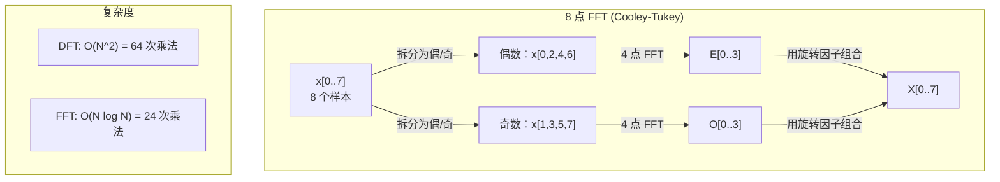
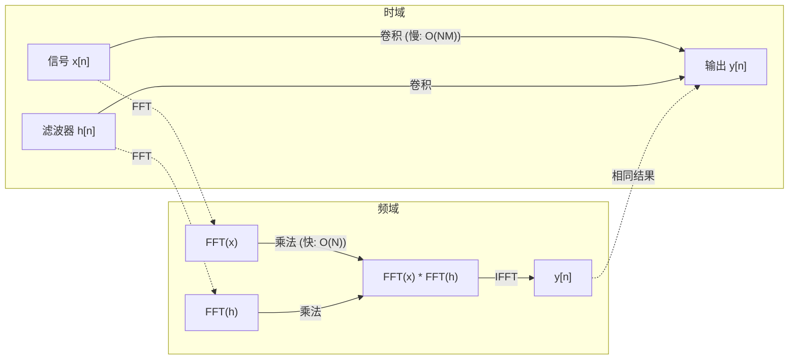

# 傅里叶变换

> 每个信号都是正弦波的和。傅里叶变换告诉你是哪些。

**类型：** 构建
**语言：** Python
**先决条件：** 阶段 1，第 01-04 课，第 19 课（复数）
**时间：** ~90 分钟

## 学习目标

- 从头实现 DFT 并与 O(N log N) 的 Cooley-Tukey FFT 进行验证
- 解释频率系数：从信号中提取振幅、相位和功率谱
- 应用卷积定理通过 FFT 乘法进行卷积
- 将傅里叶频率分解与 transformer 位置编码和 CNN 卷积层连接起来

## 问题

一个音频录音是一系列随时间变化的压力测量。股票价格是一系列跨日的值。一张图像是一个空间上像素强度的网格。所有这些都是时域（或空域）中的数据。你看到值随某个索引变化。

但许多模式在时域中是不可见的。这个音频信号是纯音还是和弦？这个股票价格是否有周周期？这张图像是否有重复纹理？这些问题涉及频率内容，时域隐藏了它。

傅里叶变换将数据从时域转换到频域。它将一个信号分解为不同频率的正弦波。每个正弦波有一个振幅（多强）和一个相位（从哪里开始）。傅里叶变换告诉你两者。

这对 ML 很重要，因为频域思维无处不在。卷积神经网络执行卷积，而卷积在频域中是乘法。Transformer 位置编码使用频率分解来表示位置。音频模型（语音识别、音乐生成）在频谱图上操作——声音的频率表示。时间序列模型寻找周期模式。理解傅里叶变换给你处理所有这些的词汇。

## 概念

### DFT 定义

给定 N 个样本 x[0], x[1], ..., x[N-1]，离散傅里叶变换产生 N 个频率系数 X[0], X[1], ..., X[N-1]：

```
X[k] = sum_{n=0}^{N-1} x[n] * e^(-2*pi*i*k*n/N)

对于 k = 0, 1, ..., N-1
```

每个 X[k] 是一个复数。其大小 |X[k]| 告诉你频率 k 的振幅。其相位 angle(X[k]) 告诉你该频率的相位偏移。

关键洞察：`e^(-2*pi*i*k*n/N)` 是一个以频率 k 旋转的相量。DFT 计算信号与 N 个等距频率中每一个之间的相关性。如果信号在频率 k 处含有能量，相关性大。如果没有，则接近零。

### 每个系数意味着什么

**X[0]：直流分量。** 这是所有样本的和——与均值成比例。它表示信号的常数（零频率）偏移。

```
X[0] = sum_{n=0}^{N-1} x[n] * e^0 = 所有样本的和
```

**X[k] 对 1 <= k <= N/2：正频率。** X[k] 表示 N 个样本中 k 个周期的频率。更高的 k 意味着更高的频率（更快的振荡）。

**X[N/2]：奈奎斯特频率。** 你能用 N 个样本表示的最高频率。在此之上，你会得到混叠——高频伪装成低频。

**X[k] 对 N/2 < k < N：负频率。** 对于实值信号，X[N-k] = conj(X[k])。负频率是正频率的镜像。这就是为什么有用信息在前 N/2 + 1 个系数中。

### 逆 DFT

逆 DFT 从频率系数重建原始信号：

```
x[n] = (1/N) * sum_{k=0}^{N-1} X[k] * e^(2*pi*i*k*n/N)

对于 n = 0, 1, ..., N-1
```

与正向 DFT 唯一的区别：指数中的符号是正的（非负的），且有一个 1/N 归一化因子。

逆 DFT 是完美重建。没有信息丢失。你可以从时域到频域再返回，没有任何误差。DFT 是基变换——它用不同的坐标系重新表达相同的信息。

### FFT：让它变快

上面定义的 DFT 是 O(N^2)：对于 N 个输出系数中的每一个，你在 N 个输入样本上求和。对于 N = 1 百万，那是 10^12 次操作。

快速傅里叶变换（FFT）在 O(N log N) 中计算相同的结果。对于 N = 1 百万，那大约是 2 千万次操作而不是 1 万亿次。这就是使频率分析变得实用的原因。

Cooley-Tukey 算法（最常见的 FFT）通过分而治之工作：

1. 将信号拆分为偶数索引和奇数索引样本。
2. 递归计算每半个的 DFT。
3. 使用"旋转因子" e^(-2*pi*i*k/N) 组合两个半尺寸的 DFT。

```
X[k] = E[k] + e^(-2*pi*i*k/N) * O[k]          对于 k = 0, ..., N/2 - 1
X[k + N/2] = E[k] - e^(-2*pi*i*k/N) * O[k]    对于 k = 0, ..., N/2 - 1

其中 E = 偶数索引样本的 DFT
      O = 奇数索引样本的 DFT
```

对称性意味着每层递归完成 O(N) 工作，有 log2(N) 层。总计：O(N log N)。



FFT 要求信号长度是 2 的幂。在实践中，信号被零填充到下一个 2 的幂。

### 频谱分析

**功率谱**是 |X[k]|^2——每个频率系数大小的平方。它显示每个频率有多少能量。

**相位谱**是 angle(X[k])——每个频率的相位偏移。对于大多数分析任务，你关心功率谱而忽略相位。

```
频率 k 处的功率：  P[k] = |X[k]|^2 = X[k].real^2 + X[k].imag^2
频率 k 处的相位：  phi[k] = atan2(X[k].imag, X[k].real)
```

### 频率分辨率

DFT 的频率分辨率取决于样本数 N 和采样率 fs。

```
箱 k 的频率：        f_k = k * fs / N
频率分辨率：        delta_f = fs / N
最大频率：          f_max = fs / 2  （奈奎斯特）
```

要分辨两个接近的频率，你需要更多样本。要捕获高频，你需要更高的采样率。

### 卷积定理

这是信号处理中最重要的结果之一，与 CNN 直接相关。

**时域中的卷积等于频域中的逐点乘法。**

```
x * h = IFFT(FFT(x) . FFT(h))

其中 * 是卷积，. 是逐元素乘法
```

为什么这很重要：

- 两个长度为 N 和 M 的信号的直接卷积需要 O(N*M) 操作。
- 基于 FFT 的卷积需要 O(N log N)：变换两者，相乘，逆变换回来。
- 对于大内核，FFT 卷积快得多。
- 这正是具有大感受野的卷积层中发生的事。

注意：DFT 计算循环卷积（信号首尾相接）。对于线性卷积（无环绕），在计算前将两个信号零填充到长度 N + M - 1。



### 窗口化

DFT 假设信号是周期的——它将 N 个样本视为无限重复信号的一个周期。如果信号在起点和终点没有相同的值，这会在边界处创建不连续性，表现为伪高频成分。这称为频谱泄漏。

窗口化通过在计算 DFT 前将信号在两端渐变到零来减少泄漏。

常用窗口：

| 窗口 | 形状 | 主瓣宽度 | 旁瓣水平 | 用例 |
|--------|-------|----------------|-----------------|----------|
| 矩形 | 平坦（无窗口） | 最窄 | 最高 (-13 dB) | 当信号在 N 个样本中精确周期性时 |
| Hann | 升余弦 | 适中 | 低 (-31 dB) | 通用频谱分析 |
| Hamming | 修正余弦 | 适中 | 更低 (-42 dB) | 音频处理、语音分析 |
| Blackman | 三余弦 | 宽 | 非常低 (-58 dB) | 当旁瓣抑制至关重要时 |

```
Hann 窗口：    w[n] = 0.5 * (1 - cos(2*pi*n / (N-1)))
Hamming 窗口： w[n] = 0.54 - 0.46 * cos(2*pi*n / (N-1))
```

在 DFT 前将窗口与信号逐元素相乘：`X = DFT(x * w)`。

### DFT 性质

| 性质 | 时域 | 频域 |
|----------|-------------|-----------------|
| 线性性 | a*x + b*y | a*X + b*Y |
| 时间平移 | x[n - k] | X[f] * e^(-2*pi*i*f*k/N) |
| 频率平移 | x[n] * e^(2*pi*i*f0*n/N) | X[f - f0] |
| 卷积 | x * h | X * H（逐点） |
| 乘法 | x * h（逐点） | X * H（循环卷积，按 1/N 缩放） |
| Parseval 定理 | sum \|x[n]\|^2 | (1/N) * sum \|X[k]\|^2 |
| 共轭对称（实输入） | x[n] 是实数 | X[k] = conj(X[N-k]) |

Parseval 定理说总能量在两个域中相同。能量在变换中被守恒。

### 与位置编码的联系

原始 Transformer 使用正弦位置编码：

```
PE(pos, 2i)   = sin(pos / 10000^(2i/d_model))
PE(pos, 2i+1) = cos(pos / 10000^(2i/d_model))
```

每个维度对 (2i, 2i+1) 以不同频率振荡。频率从高（维度 0,1）到低（最后维度）几何地分布。这给每个位置一个跨越所有频带的独特模式——类似于傅里叶系数如何唯一标识一个信号。

这提供的关键性质：

- **唯一性：** 没有两个位置有相同的编码。
- **有界值：** sin 和 cos 始终在 [-1, 1] 中。
- **相对位置：** 位置 p+k 的编码可以表示为位置 p 编码的线性函数。模型可以学会关注相对位置。

### 与 CNN 的联系

卷积层通过在信号或图像上滑动学习的滤波器（内核）应用于输入。数学上，这是卷积操作。

根据卷积定理，这等价于：
1. FFT 输入
2. FFT 内核
3. 在频域中相乘
4. IFFT 结果

标准 CNN 实现使用直接卷积（对小 3x3 内核更快）。但对于大内核或全局卷积，基于 FFT 的方法快得多。某些架构（如 FNet）完全用 FFT 替换注意力，以 O(N log N) 复杂度实现有竞争力的准确率，而不是 O(N^2)。

### 频谱图和短时傅里叶变换

单个 FFT 给你整个信号的频率内容，但不告诉你这些频率何时出现。一个 chirp（频率随时间增加的信号）和一个和弦（所有频率同时存在）可以有相同的大小谱。

短时傅里叶变换（STFT）通过在信号的重叠窗口上计算 FFT 来解决这个问题。结果是一个频谱图：一个 2D 表示，时间在一个轴上，频率在另一个轴上。每点的强度显示该时刻该频率的能量。

```
STFT 过程：
1. 选择窗口大小（例如，1024 样本）
2. 选择跳跃大小（例如，256 样本——75% 重叠）
3. 对每个窗口位置：
   a. 提取窗口段
   b. 应用 Hann/Hamming 窗口
   c. 计算 FFT
   d. 将大小谱存储为频谱图的一列
```

频谱图是音频 ML 模型的标准输入表示。语音识别模型（Whisper、DeepSpeech）在 mel 频谱图上操作——频率被映射到 mel 尺度的频谱图，更好地匹配人类音高感知。

### 混叠

如果信号含有高于 fs/2（奈奎斯特频率）的频率，以速率 fs 采样会产生混叠副本。一个 90 Hz 的信号以 100 Hz 采样后看起来与 10 Hz 信号完全相同。从单独样本中无法区分它们。

```
例子：
  真实信号：90 Hz 正弦波
  采样率：100 Hz
  表观频率：100 - 90 = 10 Hz

  以 100 Hz 采样的 90 Hz 信号的样本
  与 10 Hz 信号的样本完全相同。
  没有任何数学方法可以恢复原始的 90 Hz。
```

这就是为什么模数转换器包含抗混叠滤波器，在采样前移除高于奈奎斯特的频率。在 ML 中，当没有适当低通滤波就降采样特征图时会出现混叠——某些架构通过抗混叠池化层来解决这个问题。

### 零填充不增加分辨率

一个常见误解：FFT 前零填充信号会提高频率分辨率。不会。零填充在现有频率箱之间插值，给你一个看起来更平滑的频谱。但它不能揭示原始样本中不存在的频率细节。

真实频率分辨率仅取决于观测时间 T = N / fs。要分辨间隔 delta_f 的两个频率，你需要至少 T = 1 / delta_f 秒的数据。任何量的零填充都不能改变这个基本限制。

```figure
fourier-synthesis
```

## 构建它

### 步骤 1：从零实现 DFT

O(N^2) 的 DFT 直接从定义得出。

```python
import math

class Complex:
    ...

def dft(x):
    N = len(x)
    result = []
    for k in range(N):
        total = Complex(0, 0)
        for n in range(N):
            angle = -2 * math.pi * k * n / N
            w = Complex(math.cos(angle), math.sin(angle))
            xn = x[n] if isinstance(x[n], Complex) else Complex(x[n])
            total = total + xn * w
        result.append(total)
    return result
```

### 步骤 2：逆 DFT

相同结构，正指数，除以 N。

```python
def idft(X):
    N = len(X)
    result = []
    for n in range(N):
        total = Complex(0, 0)
        for k in range(N):
            angle = 2 * math.pi * k * n / N
            w = Complex(math.cos(angle), math.sin(angle))
            total = total + X[k] * w
        result.append(Complex(total.real / N, total.imag / N))
    return result
```

### 步骤 3：FFT (Cooley-Tukey)

递归 FFT 要求 2 的幂长度。拆分为偶数和奇数，递推，用旋转因子组合。

```python
def fft(x):
    N = len(x)
    if N <= 1:
        return [x[0] if isinstance(x[0], Complex) else Complex(x[0])]
    if N % 2 != 0:
        return dft(x)

    even = fft([x[i] for i in range(0, N, 2)])
    odd = fft([x[i] for i in range(1, N, 2)])

    result = [Complex(0)] * N
    for k in range(N // 2):
        angle = -2 * math.pi * k / N
        twiddle = Complex(math.cos(angle), math.sin(angle))
        t = twiddle * odd[k]
        result[k] = even[k] + t
        result[k + N // 2] = even[k] - t
    return result
```

### 步骤 4：频谱分析辅助函数

```python
def power_spectrum(X):
    return [xk.real ** 2 + xk.imag ** 2 for xk in X]

def convolve_fft(x, h):
    N = len(x) + len(h) - 1
    padded_N = 1
    while padded_N < N:
        padded_N *= 2

    x_padded = x + [0.0] * (padded_N - len(x))
    h_padded = h + [0.0] * (padded_N - len(h))

    X = fft(x_padded)
    H = fft(h_padded)

    Y = [xk * hk for xk, hk in zip(X, H)]

    y = idft(Y)
    return [y[n].real for n in range(N)]
```

## 使用它

对于实际工作，使用 numpy 的 FFT，它由高度优化的 C 库支持。

```python
import numpy as np

signal = np.sin(2 * np.pi * 5 * np.arange(256) / 256)
spectrum = np.fft.fft(signal)
freqs = np.fft.fftfreq(256, d=1/256)

power = np.abs(spectrum) ** 2

positive_freqs = freqs[:len(freqs)//2]
positive_power = power[:len(power)//2]
```

对于窗口化和更高级的频谱分析：

```python
from scipy.signal import windows, stft

window = windows.hann(256)
windowed = signal * window
spectrum = np.fft.fft(windowed)
```

对于卷积：

```python
from scipy.signal import fftconvolve

result = fftconvolve(signal, kernel, mode='full')
```

对于频谱图：

```python
from scipy.signal import stft

frequencies, times, Zxx = stft(signal, fs=sample_rate, nperseg=256)
spectrogram = np.abs(Zxx) ** 2
```

频谱图矩阵的形状为 (n_frequencies, n_time_frames)。每列是一个时间窗口的功率谱。这是音频 ML 模型作为输入消费的内容。

## 输出成果

运行 `code/fourier.py` 生成 `outputs/prompt-spectral-analyzer.md`。

## 练习

1. **纯音识别。** 创建一个在未知频率（1 到 50 Hz 之间）的单一正弦波信号，以 128 Hz 采样 1 秒。使用你的 DFT 来识别频率。验证答案匹配。现在添加标准差 0.5 的高斯噪声并重复。噪声如何影响频谱？

2. **FFT vs DFT 验证。** 生成长度 64 的随机信号。计算 DFT（O(N^2)）和 FFT 两者。验证所有系数在 1e-10 内匹配。对长度为 256、512、1024 和 2048 的信号计时两个函数。绘制 DFT 时间与 FFT 时间的比率。

3. **卷积定理举例证明。** 创建信号 x = [1, 2, 3, 4, 0, 0, 0, 0] 和滤波器 h = [1, 1, 1, 0, 0, 0, 0, 0]。直接（嵌套循环）计算它们的循环卷积。然后通过 FFT 计算（变换、乘法、逆变换）。验证结果匹配。现在通过适当零填充进行线性卷积。

4. **窗口化效果。** 创建一个信号，是两个分别在 10 Hz 和 12 Hz（非常接近）的正弦波的和。以 128 Hz 采样 1 秒。计算无窗口、Hann 窗口和 Hamming 窗口的功率谱。哪个窗口使得区分两个峰最容易？为什么？

5. **位置编码分析。** 生成 d_model = 128 和 max_pos = 512 的正弦位置编码。对每对位置 (p1, p2)，计算它们编码的点积。展示点积仅取决于 |p1 - p2|，而不取决于绝对位置。随着距离增加，点积会发生什么？

## 关键术语

| 术语 | 含义 |
|------|---------------|
| DFT（离散傅里叶变换） | 将 N 个时域样本转换为 N 个频域系数。每个系数是与该频率处复正弦曲线的相关性 |
| FFT（快速傅里叶变换） | 一个计算 DFT 的 O(N log N) 算法。Cooley-Tukey 算法递归拆分偶/奇索引 |
| 逆 DFT | 从频率系数重建时域信号。与 DFT 公式相同但指数符号翻转且 1/N 缩放 |
| 频率箱 | DFT 输出中的每个索引 k 表示频率 k*fs/N Hz。"箱"是离散频率槽 |
| 直流分量 | X[0]，零频率系数。与信号均值成比例 |
| 奈奎斯特频率 | fs/2，在采样率 fs 下可表示的最大频率。高于此的频率会混叠 |
| 功率谱 | \|X[k]\|^2，每个频率系数大小的平方。显示跨频率的能量分布 |
| 相位谱 | angle(X[k])，每个频率分量的相位偏移。分析中通常被忽略 |
| 频谱泄漏 | 因将非周期信号视为周期信号而导致的伪频率内容。通过窗口化减少 |
| 窗口函数 | 在 DFT 前应用的渐变函数（Hann、Hamming、Blackman）以减少频谱泄漏 |
| 旋转因子 | 复指数 e^(-2*pi*i*k/N)，用于在 FFT 蝶形计算中组合子 DFT |
| 卷积定理 | 时域中的卷积等于频域中的逐点乘法。信号处理和 CNN 的基础 |
| 循环卷积 | 信号环绕的卷积。这是 DFT 自然计算的 |
| 线性卷积 | 无环绕的标准卷积。通过在 DFT 前零填充实现 |
| Parseval 定理 | 总能量通过傅里叶变换被守恒。sum \|x[n]\|^2 = (1/N) sum \|X[k]\|^2 |
| 混叠 | 当高于奈奎斯特的频率因采样率不足而表现为较低频率时 |

## 进一步阅读

- [Cooley & Tukey: An Algorithm for the Machine Calculation of Complex Fourier Series (1965)](https://www.ams.org/journals/mcom/1965-19-090/S0025-5718-1965-0178586-1/)——改变计算的原始 FFT 论文
- [3Blue1Brown: But what is the Fourier Transform?](https://www.youtube.com/watch?v=spUNpyF58BY)——傅里叶变换的最佳视觉介绍
- [Lee-Thorp et al.: FNet: Mixing Tokens with Fourier Transforms (2021)](https://arxiv.org/abs/2105.03824)——在 transformer 中用 FFT 替换自注意力
- [Smith: The Scientist and Engineer's Guide to Digital Signal Processing](http://www.dspguide.com/)——深入讲解 FFT、窗口化和频谱分析的免费在线教科书
- [Vaswani et al.: Attention Is All You Need (2017)](https://arxiv.org/abs/1706.03762)——由傅里叶频率分解导出的正弦位置编码
- [Radford et al.: Whisper (2022)](https://arxiv.org/abs/2212.04356)——使用 mel 频谱图作为输入表示的语音识别
