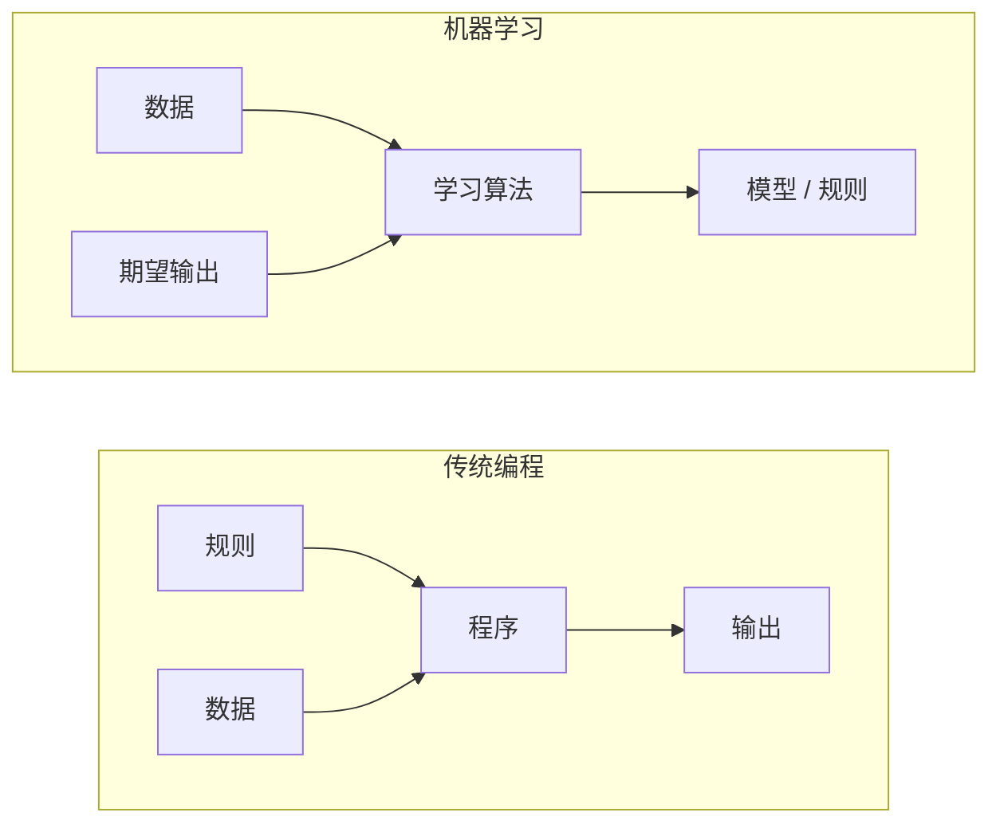
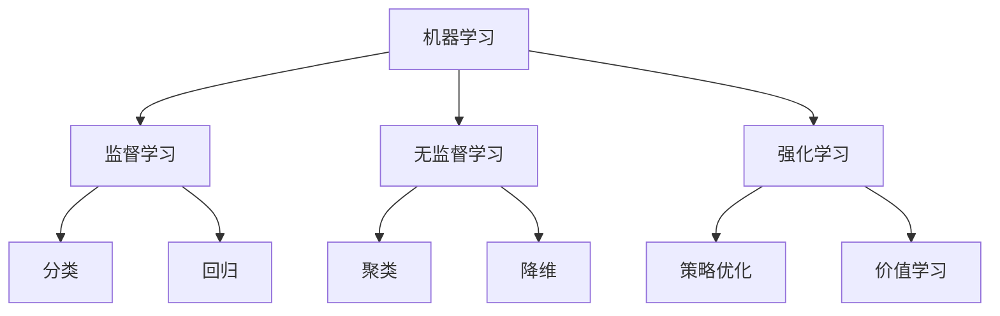
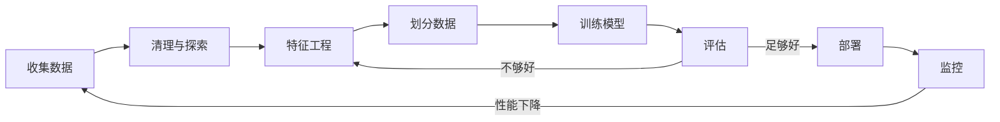
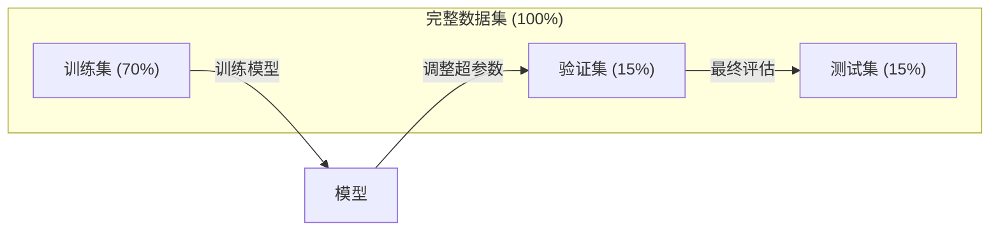
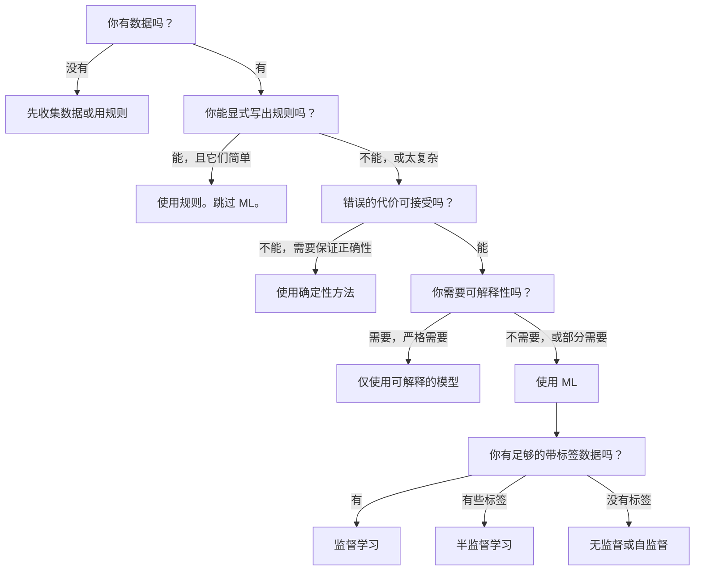

# 什么是机器学习

> 机器学习是教计算机从数据中寻找模式，而不是手工编写规则。

**类型：** 学习
**语言：** Python
**先决条件：** 阶段 1（数学基础）
**时间：** ~45 分钟

## 学习目标

- 解释监督学习、无监督学习和强化学习之间的区别，并识别哪种类型适用于给定问题
- 从头实现最近质心分类器，并对照随机基线进行评估
- 区分类和回归任务，并为每种任务选择合适的损失函数
- 评估给定的业务问题是否适合机器学习，还是用确定性规则解决更好

## 问题

你想构建一个垃圾邮件过滤器。传统方法是：坐下来写数百条规则。"如果邮件包含'免费金钱'，标记为垃圾邮件。如果有超过 3 个感叹号，标记为垃圾邮件。"你花了几周时间写规则。然后垃圾邮件发送者改变了他们的措辞。你的规则失效。你写更多规则。这个循环永远不会结束。

机器学习翻转了这一点。你不是写规则，而是给计算机数千封带标签的邮件（"垃圾邮件"或"非垃圾邮件"），让它自己找出规则。计算机会找到你从未想到的模式。当垃圾邮件发送者改变策略时，你在新数据上重新训练，而不是重写代码。

这种从"编写规则"到"从数据中学习"的转变是机器学习的核心。每个推荐引擎、语音助手、自动驾驶汽车和语言模型都以这种方式工作。

## 概念

### 从数据中学习，而不是从规则中学习

传统编程和机器学习以相反的方向解决问题。



传统编程：你编写规则。程序将规则应用于数据以产生输出。

机器学习：你提供数据和期望输出。算法发现规则。

训练出来的"模型"就是规则，编码为数字（权重、参数）。它从见过的例子中泛化，对从未见过的数据进行预测。

### 三种类型的机器学习



**监督学习**：你有输入-输出对。模型学习将输入映射到输出。
- "这里有 10,000 张标记为猫或狗的照片。学会区分它们。"
- "这里有房屋特征和价格。学会预测价格。"

**无监督学习**：你只有输入。没有标签。模型自己寻找结构。
- "这里有 10,000 个客户购买历史。寻找自然分组。"
- "这里有 1,000 维的数据点。在保持结构的同时降到 2 维。"

**强化学习**：智能体在环境中采取行动，接收奖励或惩罚。它学习一种策略（policy）来最大化总奖励。
- "玩这个游戏。赢 +1，输 -1。找出一种策略。"
- "控制这个机器人手臂。拿起物体 +1，每秒浪费 -0.01。"

你在实践中构建的大部分内容使用监督学习。无监督学习常用于预处理和探索。强化学习为游戏 AI、机器人学和语言模型的 RLHF 提供动力。

### 超越三大类型

以上三个类别很清楚，但真实世界的 ML 经常模糊界限。

**半监督学习** 使用一小组带标签数据和一大组无标签数据。你可能只有 100 张带标签的医学图像和 100,000 张无标签的。技术包括：

- **标签传播：** 构建一个连接相似数据点的图。标签通过图从带标签节点传播到无标签邻居。
- **伪标签：** 在带标签数据上训练模型，用它为无标签数据预测标签，然后全部重新训练。模型自我引导其训练集。
- **一致性正则化：** 模型应该对输入及其略微扰动版本给出相同的预测。即使没有标签这也能工作。

**自监督学习** 从数据本身创建监督信号。完全不需要人工标签。模型从数据的结构中创建自己的预测任务。

- **掩码语言建模（BERT）：** 隐藏句子中 15% 的单词，训练模型预测缺失的单词。"标签"来自原始文本。
- **对比学习（SimCLR）：** 对一张图像创建两个增强版本。训练模型识别它们来自同一图像，同时将它们与其他图像的增强版本区分开来。
- **下一 token 预测（GPT）：** 给定所有先前的单词预测下一个单词。每个文本文档都变成一个训练样本。

这些不是与三大类型分离的类别。它们是结合监督和无监督思想的策略。自监督学习在技术上是监督学习（模型预测某个东西），但标签是自动生成的，不是人工的。

### 分类 vs 回归

这是两个主要的监督学习任务。

| 方面 | 分类 | 回归 |
|--------|---------------|------------|
| 输出 | 离散类别 | 连续数字 |
| 例子 | "这是垃圾邮件吗？" | "房价将是多少？" |
| 输出空间 | {猫, 狗, 鸟} | 任何实数 |
| 损失函数 | 交叉熵、准确率 | 均方误差、MAE |
| 决策 | 类别之间的边界 | 拟合数据的曲线 |

分类回答"哪个类别？"回归回答"多少？"

某些问题可以用两种方式框定。预测股票涨跌是分类。预测确切价格是回归。

### ML 工作流

无论算法如何，每个机器学习项目都遵循相同的流水线。



**收集数据**：收集原始数据。更多数据几乎总是更好，但质量比数量更重要。

**清理与探索**：处理缺失值，删除重复项，可视化分布，发现异常。这一步通常占项目总时间的 60-80%。

**特征工程**：将原始数据转换为模型可以使用的特征。将日期转换为星期几。归一化数值列。编码分类变量。好的特征比花哨的算法更重要。

**划分数据**：分为训练集、验证集和测试集。模型在训练数据上训练，在验证数据上调整超参数，在测试数据上报告最终性能。

**训练模型**：将训练数据输入算法。算法调整内部参数以最小化损失函数。

**评估**：在验证/测试数据上测量性能。如果性能不可接受，回到之前尝试不同的特征、算法或超参数。

**部署**：将模型投入生产环境，对新的数据进行预测。

**监控**：跟踪随时间变化的性能。数据分布会变化（数据漂移），模型会退化。当性能下降时，重新训练。

### 训练集、验证集和测试集的划分

这是初学者最常搞错的最重要概念。你必须用模型在训练期间从未见过的数据来评估。否则你测量的是记忆，而不是学习。



| 划分 | 目的 | 何时使用 | 典型大小 |
|-------|---------|-----------|-------------|
| 训练集 | 模型从此数据学习 | 训练期间 | 60-80% |
| 验证集 | 调整超参数，比较模型 | 每次训练运行后 | 10-20% |
| 测试集 | 最终无偏性能估计 | 一次，在最后 | 10-20% |

测试集是神圣的。你只看它一次。如果你继续根据测试性能调整模型，你实际上是在测试集上训练，你报告的数字是毫无意义的。

对于小数据集，使用 k 折交叉验证：将数据分成 k 份，在 k-1 份上训练，在剩余那份上验证，轮换，并平均结果。

### 过拟合 vs 欠拟合


**欠拟合**：模型太简单，无法捕捉数据中的模式。一条直线试图拟合曲线关系。训练误差高。测试误差高。

**过拟合**：模型太复杂，记忆了训练数据，包括其噪声。一条蜿蜒的曲线穿过每个训练点，但在新数据上失败。训练误差低。测试误差高。

**良好拟合**：模型捕捉真实模式而不记忆噪声。训练误差和测试误差都合理低。

过拟合的迹象：
- 训练准确率远高于验证准确率
- 模型在训练数据上表现良好但在新数据上表现差
- 添加更多训练数据会改善性能（模型在记忆，而不是学习）

过拟合的修复方法：
- 获取更多训练数据
- 降低模型复杂度（更少参数，更简单的架构）
- 正则化（对大权重添加惩罚）
- Dropout（训练期间随机将神经元置零）
- 早停（当验证误差开始增加时停止训练）

欠拟合的修复方法：
- 使用更复杂的模型
- 添加更多特征
- 减少正则化
- 训练更长时间

### 偏差-方差权衡

这是过拟合和欠拟合背后的数学框架。

**偏差**：来自模型中错误假设的误差。当真实关系是非线性时，线性模型具有高偏差。高偏差导致欠拟合。

**方差**：来自对训练数据中微小波动敏感度的误差。具有高方差的模型在不同数据子集上训练时会给出非常不同的预测。高方差导致过拟合。

| 模型复杂度 | 偏差 | 方差 | 结果 |
|-----------------|------|----------|--------|
| 太低（曲线数据的线性模型） | 高 | 低 | 欠拟合 |
| 刚好 | 中 | 中 | 良好泛化 |
| 太高（10 个点的 20 次多项式） | 低 | 高 | 过拟合 |

总误差 = 偏差^2 + 方差 + 不可约噪声

你无法减少不可约噪声（它是数据本身的随机性）。你想找到偏差^2 + 方差最小化的最佳点。

### 没有免费午餐定理

没有单一的算法对每个问题都最好。在一类问题上表现良好的算法在另一类问题上会表现差。这就是为什么数据科学家尝试多种算法并比较结果。

在实践中，选择取决于：
- 你有多少数据
- 有多少特征
- 关系是线性的还是非线性的
- 你是否需要可解释性
- 你能负担多少计算力

### 什么时候不要用机器学习

ML 强大但不总是合适的工具。在伸手拿模型之前，问问你是否真的需要。

**在以下情况下不要使用 ML：**

- **规则简单且定义明确。** 税收计算、排序算法、单位转换。如果你能用几个 if 语句写出逻辑，模型只会增加复杂性而没有好处。
- **你没有数据或数据很少。** ML 需要例子来学习。有 10 个数据点，你无法训练出有意义的东西。先收集数据。
- **犯错的代价是灾难性的，你需要保证的正确性。** 医疗剂量计算、核反应堆控制、密码学验证。ML 模型是概率性的。它们有时会出错。如果"有时出错"不可接受，请使用确定性的方法。
- **查找表或启发式方法解决了问题。** 如果一个简单的阈值或表格覆盖了 99% 的情况，添加 ML 会增加维护成本却没有有意义的改进。
- **你无法解释决策，而可解释性是必须的。** 受监管的行业（贷款、保险、刑事司法）有时要求每个决策都完全可解释。某些 ML 模型是可解释的（线性回归、小决策树）。大多数不是。
- **问题的变化速度比你重新训练的速度快。** 如果规则每天变化且重新训练需要一周，模型始终是过时的。

使用这个决策流程图：



## 构建它

`code/ml_intro.py` 中的代码从头实现了最近质心分类器，这是可能的最简单 ML 算法。它展示了核心思想：从数据中学习，然后对新数据做预测。

### 步骤 1：从头实现最近质心分类器

最近质心分类器在训练数据中计算每个类的中心（均值）。要预测时，它将每个新点分配给中心最近的类。

```python
class NearestCentroid:
    def fit(self, X, y):
        self.classes = np.unique(y)
        self.centroids = np.array([
            X[y == c].mean(axis=0) for c in self.classes
        ])

    def predict(self, X):
        distances = np.array([
            np.sqrt(((X - c) ** 2).sum(axis=1))
            for c in self.centroids
        ])
        return self.classes[distances.argmin(axis=0)]
```

这就是整个算法。Fit 计算两个均值。Predict 计算距离。没有梯度下降，没有迭代，没有超参数。

### 步骤 2：在合成数据上训练

我们生成一个 2D 分类数据集，有两个略微重叠的类别。质心分类器在类中心之间画一条线性决策边界。

```python
rng = np.random.RandomState(42)
X_class0 = rng.randn(100, 2) + np.array([1.0, 1.0])
X_class1 = rng.randn(100, 2) + np.array([-1.0, -1.0])
X = np.vstack([X_class0, X_class1])
y = np.array([0] * 100 + [1] * 100)
```

### 步骤 3：与基线比较

每个 ML 模型都应该与一个简单基线进行比较。这里，基线预测一个随机类别。如果你的 ML 模型不能打败随机猜测，就有问题了。

```python
baseline_preds = rng.choice([0, 1], size=len(y_test))
baseline_acc = np.mean(baseline_preds == y_test)
```

在这个干净的数据集上，质心分类器应该达到约 90%+ 的准确率。随机基线约 50%。

### 为什么这很重要

最近质心分类器极其简单。它没有超参数，没有迭代，没有梯度下降。但它捕捉了基本的 ML 模式：

1. **从训练数据中学习**一个表示（质心）
2. 使用该表示**预测**新数据（最近距离）
3. 对照基线**评估**（随机猜测）

每个 ML 算法，从逻辑回归到 transformer，都遵循这个相同的三步模式。表示变得更加复杂，但工作流保持不变。

### 步骤 4：质心分类器不能做什么

最近质心分类器假设每个类形成一个单一的团。它画出线性决策边界。当：

- 类有多个聚类时（例如，数字"1"可以用几种不同方式书写）
- 决策边界是非线性的时（例如，一个类环绕另一个）
- 特征有非常不同的尺度时（距离由最大尺度的特征主导）

这些局限性激发了你要学习的每个其他算法。K-最近邻处理多个聚类。决策树处理非线性边界。特征缩放修复尺度问题。每节课都建立在前一节的局限性之上。

## 使用它

sklearn 提供了 `NearestCentroid` 和合成数据生成器：

```python
from sklearn.neighbors import NearestCentroid
from sklearn.datasets import make_classification
from sklearn.model_selection import train_test_split

X, y = make_classification(
    n_samples=500, n_features=2, n_redundant=0,
    n_clusters_per_class=1, random_state=42
)
X_train, X_test, y_train, y_test = train_test_split(X, y, test_size=0.3)

clf = NearestCentroid()
clf.fit(X_train, y_train)
print(f"准确率: {clf.score(X_test, y_test):.3f}")
```

## 输出成果

本课产生 `outputs/prompt-ml-problem-framer.md`——一个将模糊的业务问题转化为具体 ML 任务的提示词。给它一个问题描述（"我们想减少流失"或"预测下季度需求"），它会识别学习类型，定义预测目标，列出候选特征，选择成功度量，建立基线，并标记数据泄漏或类别不平衡等陷阱。在任何 ML 项目开始时使用它，避免构建错误的东西。

## 关键术语

| 术语 | 人们说的 | 实际含义 |
|------|----------------|----------------------|
| 模型 | "AI" | 一个具有可学习参数的数学函数，将输入映射到输出 |
| 训练 | "教 AI" | 运行优化算法来调整模型参数，使预测匹配已知输出 |
| 特征 | "输入列" | 数据的一个可测量属性，模型用它来做预测 |
| 标签 | "答案" | 训练样本的已知输出，用于计算误差信号 |
| 超参数 | "你调整的设置" | 训练前设置的参数，控制学习过程（学习率、层数） |
| 损失函数 | "模型有多错" | 衡量预测与实际输出之间差距的函数，训练试图将其最小化 |
| 过拟合 | "它记住了考试" | 模型学习了训练特有的噪声而非一般模式，因此在新数据上失败 |
| 欠拟合 | "它什么都没学到" | 模型太简单，无法捕捉数据中的真实模式 |
| 泛化 | "它在新数据上有效" | 模型对未训练过的数据做出准确预测的能力 |
| 交叉验证 | "在不同块上测试" | 反复将数据划分为训练/测试折并平均结果，给出更鲁棒的性能估计 |
| 正则化 | "保持权重小" | 向损失函数添加惩罚项，抑制过度复杂的模型 |
| 数据漂移 | "世界变了" | 输入数据的统计分布随时间变化，降低模型性能 |

## 练习

1. 取任意数据集（例如 Iris、Titanic）。将其 70/15/15 划分为训练/验证/测试。解释为什么你不应该在测试集上调整超参数。
2. 列出三个真实世界的问题。对每个问题，识别它是分类、回归还是聚类，以及是监督的还是无监督的。
3. 一个模型在训练数据上获得 99% 准确率但在测试数据上只有 60%。诊断问题并列出你会尝试修复它的三件事。

## 进一步阅读

- [An Introduction to Statistical Learning](https://www.statlearning.com/)——涵盖所有经典 ML 方法的免费教科书，带实用例子
- [谷歌机器学习速成课程](https://developers.google.com/machine-learning/crash-course)——ML 概念的简洁视觉介绍
- [Scikit-learn 用户指南](https://scikit-learn.org/stable/user_guide.html)——在 Python 中实现 ML 的实用参考
