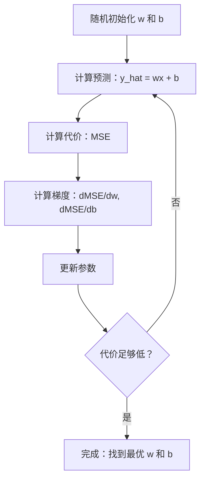

# 线性回归

> 线性回归在你的数据中画一条最佳直线。它是机器学习的"hello world"。

**类型：** 构建
**语言：** Python
**先决条件：** 阶段 1（线性代数、微积分、优化），阶段 2 第 01 课
**时间：** ~90 分钟

## 学习目标

- 推导均方误差的梯度下降更新规则，并从头实现线性回归
- 从计算复杂度和何时使用每个的角度比较梯度下降和正规方程
- 构建带特征标准化的多元线性回归模型，并解释学到的权重
- 解释岭回归（L2 正则化）如何通过惩罚大权重来防止过拟合

## 问题

你有数据：房屋面积和售价。你想根据面积预测新房子的价格。你可以在散点图上目测，但你需要一个公式。你需要一条最佳拟合数据的线，这样你可以代入任意面积得到价格预测。

线性回归给你那条线。更重要的是，它引入了整个 ML 训练循环：定义一个模型，定义一个代价函数，优化参数。每个 ML 算法都遵循这个相同的模式。在最简单的案例中掌握它，你会到处认出它。

这不仅适用于简单问题。线性回归在生产系统中用于需求预测、A/B 测试分析、金融建模，并作为每个回归任务的基线。

## 概念

### 模型

线性回归假设输入（x）和输出（y）之间存在线性关系：

```
y = wx + b
```

- `w`（权重/斜率）：x 增加 1 时 y 变化多少
- `b`（偏置/截距）：当 x = 0 时 y 的值

对于多个输入（特征），这扩展为：

```
y = w1*x1 + w2*x2 + ... + wn*xn + b
```

或者向量形式：`y = w^T * x + b`

目标：找到 w 和 b 的值，使得预测的 y 在所有训练样本上尽可能接近实际的 y。

### 代价函数（均方误差）

你如何衡量"尽可能接近"？你需要一个单一数字来捕获你的预测有多错。最常见的选择是均方误差（MSE）：

```
MSE = (1/n) * sum((y_预测 - y_实际)^2)
```

为什么平方？两个原因。第一，它对大误差的惩罚比小误差更重（10 的误差比 1 的误差糟糕 100 倍，而不是 10 倍）。第二，平方函数处处平滑可微，使优化变得直接。

代价函数创建一个曲面。对于单个权重 w 和偏置 b，MSE 曲面看起来像一个碗（凸抛物面）。碗的底部是 MSE 最小化的地方。训练意味着找到那个底部。

### 梯度下降

梯度下降通过下坡步伐找到碗的底部。



梯度告诉你两件事：每个参数移动的方向，以及移动多少。

对于 y_hat = wx + b 的 MSE：

```
dMSE/dw = (2/n) * sum((y_hat - y) * x)
dMSE/db = (2/n) * sum(y_hat - y)
```

更新规则：

```
w = w - 学习率 * dMSE/dw
b = b - 学习率 * dMSE/db
```

学习率控制步长。太大：你会超出最小值并发散。太小：训练永远不尽。典型起始值：0.01、0.001 或 0.0001。

### 正规方程（封闭形式解）

特别对于线性回归，有一个直接公式可以在没有任何迭代的情况下给出最优权重：

```
w = (X^T * X)^(-1) * X^T * y
```

这通过求逆一个矩阵来一步求解 w。对小数据集完美。对于大数据集（数百万行或数千特征），梯度下降更受青睐，因为矩阵求逆在特征数量上是 O(n^3)。

### 多元线性回归

有多个特征时，模型变为：

```
y = w1*x1 + w2*x2 + ... + wn*xn + b
```

一切工作相同：MSE 是代价函数，梯度下降同时更新所有权重。唯一的区别是你拟合的是一个超平面而不是一条线。

这里特征缩放很重要。如果一个特征范围从 0 到 1，另一个范围从 0 到 1,000,000，梯度下降会挣扎，因为代价曲面变得细长。在训练前标准化特征（减去均值，除以标准差）。

### 多项式回归

如果关系不是线性的怎么办？你仍然可以通过创建多项式特征来使用线性回归：

```
y = w1*x + w2*x^2 + w3*x^3 + b
```

这仍然是"线性"回归，因为模型在权重（w1、w2、w3）上是线性的。你只是使用了 x 的非线性特征。

更高次多项式可以拟合更复杂的曲线，但有过拟合的风险。一个 10 次多项式将通过 10 点数据集中的每个点，但在新数据上预测很差。

### R 平方得分

MSE 告诉你你有多错，但这个数字取决于 y 的尺度。R 平方（R^2）给出尺度的独立度量：

```
R^2 = 1 - (残差平方和) / (与均值的偏差平方和)
    = 1 - SS_res / SS_tot
```

- R^2 = 1.0：完美预测
- R^2 = 0.0：模型不比每次都预测均值更好
- R^2 < 0.0：模型比预测均值更差

### 正则化预览（岭回归）

当你有许多特征时，模型可能通过分配大权重而过拟合。岭回归（L2 正则化）添加了一个惩罚：

```
代价 = MSE + lambda * sum(w_i^2)
```

惩罚项抑制大权重。超参数 lambda 控制权衡：更高的 lambda 意味着更小的权重和更多正则化。这在后面的课程中深入讨论。目前，知道它的存在和为什么有帮助。

```figure
linear-regression-fit
```

## 构建它

### 步骤 1：生成样本数据

```python
import random
import math

random.seed(42)

TRUE_W = 3.0
TRUE_B = 7.0
N_SAMPLES = 100

X = [random.uniform(0, 10) for _ in range(N_SAMPLES)]
y = [TRUE_W * x + TRUE_B + random.gauss(0, 2.0) for x in X]

print(f"生成 {N_SAMPLES} 个样本")
print(f"真实关系：y = {TRUE_W}x + {TRUE_B} (+ 噪声)")
print(f"前 5 个点：{[(round(X[i], 2), round(y[i], 2)) for i in range(5)]}")
```

### 步骤 2：从头实现带梯度下降的线性回归

```python
class LinearRegression:
    def __init__(self, learning_rate=0.01):
        self.w = 0.0
        self.b = 0.0
        self.lr = learning_rate
        self.cost_history = []

    def predict(self, X):
        return [self.w * x + self.b for x in X]

    def compute_cost(self, X, y):
        predictions = self.predict(X)
        n = len(y)
        cost = sum((pred - actual) ** 2 for pred, actual in zip(predictions, y)) / n
        return cost

    def compute_gradients(self, X, y):
        predictions = self.predict(X)
        n = len(y)
        dw = (2 / n) * sum((pred - actual) * x for pred, actual, x in zip(predictions, y, X))
        db = (2 / n) * sum(pred - actual for pred, actual in zip(predictions, y))
        return dw, db

    def fit(self, X, y, epochs=1000, print_every=200):
        for epoch in range(epochs):
            dw, db = self.compute_gradients(X, y)
            self.w -= self.lr * dw
            self.b -= self.lr * db
            cost = self.compute_cost(X, y)
            self.cost_history.append(cost)
            if epoch % print_every == 0:
                print(f"  第 {epoch:4d} 轮 | 代价: {cost:.4f} | w: {self.w:.4f} | b: {self.b:.4f}")
        return self

    def r_squared(self, X, y):
        predictions = self.predict(X)
        y_mean = sum(y) / len(y)
        ss_res = sum((actual - pred) ** 2 for actual, pred in zip(y, predictions))
        ss_tot = sum((actual - y_mean) ** 2 for actual in y)
        return 1 - (ss_res / ss_tot)


print("=== 训练线性回归（梯度下降）===")
model = LinearRegression(learning_rate=0.005)
model.fit(X, y, epochs=1000, print_every=200)
print(f"\n学到的：y = {model.w:.4f}x + {model.b:.4f}")
print(f"真实的：y = {TRUE_W}x + {TRUE_B}")
print(f"R-squared: {model.r_squared(X, y):.4f}")
```

### 步骤 3：正规方程（封闭形式解）

```python
class LinearRegressionNormal:
    def __init__(self):
        self.w = 0.0
        self.b = 0.0

    def fit(self, X, y):
        n = len(X)
        x_mean = sum(X) / n
        y_mean = sum(y) / n
        numerator = sum((X[i] - x_mean) * (y[i] - y_mean) for i in range(n))
        denominator = sum((X[i] - x_mean) ** 2 for i in range(n))
        self.w = numerator / denominator
        self.b = y_mean - self.w * x_mean
        return self

    def predict(self, X):
        return [self.w * x + self.b for x in X]

    def r_squared(self, X, y):
        predictions = self.predict(X)
        y_mean = sum(y) / len(y)
        ss_res = sum((actual - pred) ** 2 for actual, pred in zip(y, predictions))
        ss_tot = sum((actual - y_mean) ** 2 for actual in y)
        return 1 - (ss_res / ss_tot)


print("\n=== 正规方程（封闭形式）===")
model_normal = LinearRegressionNormal()
model_normal.fit(X, y)
print(f"学到的：y = {model_normal.w:.4f}x + {model_normal.b:.4f}")
print(f"R-squared: {model_normal.r_squared(X, y):.4f}")
```

### 步骤 4：多元线性回归

```python
class MultipleLinearRegression:
    def __init__(self, n_features, learning_rate=0.01):
        self.weights = [0.0] * n_features
        self.bias = 0.0
        self.lr = learning_rate
        self.cost_history = []

    def predict_single(self, x):
        return sum(w * xi for w, xi in zip(self.weights, x)) + self.bias

    def predict(self, X):
        return [self.predict_single(x) for x in X]

    def compute_cost(self, X, y):
        predictions = self.predict(X)
        n = len(y)
        return sum((pred - actual) ** 2 for pred, actual in zip(predictions, y)) / n

    def fit(self, X, y, epochs=1000, print_every=200):
        n = len(y)
        n_features = len(X[0])
        for epoch in range(epochs):
            predictions = self.predict(X)
            errors = [pred - actual for pred, actual in zip(predictions, y)]
            for j in range(n_features):
                grad = (2 / n) * sum(errors[i] * X[i][j] for i in range(n))
                self.weights[j] -= self.lr * grad
            grad_b = (2 / n) * sum(errors)
            self.bias -= self.lr * grad_b
            cost = self.compute_cost(X, y)
            self.cost_history.append(cost)
            if epoch % print_every == 0:
                print(f"  第 {epoch:4d} 轮 | 代价: {cost:.4f}")
        return self

    def r_squared(self, X, y):
        predictions = self.predict(X)
        y_mean = sum(y) / len(y)
        ss_res = sum((actual - pred) ** 2 for actual, pred in zip(y, predictions))
        ss_tot = sum((actual - y_mean) ** 2 for actual in y)
        return 1 - (ss_res / ss_tot)


random.seed(42)
N = 100
X_multi = []
y_multi = []
for _ in range(N):
    size = random.uniform(500, 3000)
    bedrooms = random.randint(1, 5)
    age = random.uniform(0, 50)
    price = 50 * size + 10000 * bedrooms - 1000 * age + 50000 + random.gauss(0, 20000)
    X_multi.append([size, bedrooms, age])
    y_multi.append(price)


def standardize(X):
    n_features = len(X[0])
    means = [sum(X[i][j] for i in range(len(X))) / len(X) for j in range(n_features)]
    stds = []
    for j in range(n_features):
        variance = sum((X[i][j] - means[j]) ** 2 for i in range(len(X))) / len(X)
        stds.append(variance ** 0.5)
    X_scaled = []
    for i in range(len(X)):
        row = [(X[i][j] - means[j]) / stds[j] if stds[j] > 0 else 0 for j in range(n_features)]
        X_scaled.append(row)
    return X_scaled, means, stds
```

### 步骤 5：多项式回归

```python
class PolynomialRegression:
    def __init__(self, degree, learning_rate=0.01):
        self.degree = degree
        self.weights = [0.0] * degree
        self.bias = 0.0
        self.lr = learning_rate

    def make_features(self, X):
        return [[x ** (d + 1) for d in range(self.degree)] for x in X]

    def predict(self, X):
        features = self.make_features(X)
        return [sum(w * f for w, f in zip(self.weights, row)) + self.bias for row in features]

    def fit(self, X, y, epochs=1000, print_every=200):
        features = self.make_features(X)
        n = len(y)
        for epoch in range(epochs):
            predictions = [sum(w * f for w, f in zip(self.weights, row)) + self.bias for row in features]
            errors = [pred - actual for pred, actual in zip(predictions, y)]
            for j in range(self.degree):
                grad = (2 / n) * sum(errors[i] * features[i][j] for i in range(n))
                self.weights[j] -= self.lr * grad
            grad_b = (2 / n) * sum(errors)
            self.bias -= self.lr * grad_b
            if epoch % print_every == 0:
                cost = sum(e ** 2 for e in errors) / n
                print(f"  第 {epoch:4d} 轮 | 代价: {cost:.6f}")
        return self

    def r_squared(self, X, y):
        predictions = self.predict(X)
        y_mean = sum(y) / len(y)
        ss_res = sum((actual - pred) ** 2 for actual, pred in zip(y, predictions))
        ss_tot = sum((actual - y_mean) ** 2 for actual in y)
        return 1 - (ss_res / ss_tot)
```

### 步骤 6：岭回归（L2 正则化）

```python
class RidgeRegression:
    def __init__(self, n_features, learning_rate=0.01, alpha=1.0):
        self.weights = [0.0] * n_features
        self.bias = 0.0
        self.lr = learning_rate
        self.alpha = alpha

    def predict_single(self, x):
        return sum(w * xi for w, xi in zip(self.weights, x)) + self.bias

    def predict(self, X):
        return [self.predict_single(x) for x in X]

    def fit(self, X, y, epochs=1000, print_every=200):
        n = len(y)
        n_features = len(X[0])
        for epoch in range(epochs):
            predictions = self.predict(X)
            errors = [pred - actual for pred, actual in zip(predictions, y)]
            mse = sum(e ** 2 for e in errors) / n
            reg_term = self.alpha * sum(w ** 2 for w in self.weights)
            cost = mse + reg_term
            for j in range(n_features):
                grad = (2 / n) * sum(errors[i] * X[i][j] for i in range(n))
                grad += 2 * self.alpha * self.weights[j]
                self.weights[j] -= self.lr * grad
            grad_b = (2 / n) * sum(errors)
            self.bias -= self.lr * grad_b
            if epoch % print_every == 0:
                print(f"  第 {epoch:4d} 轮 | 代价: {cost:.4f} | L2 惩罚: {reg_term:.4f}")
        return self
```

## 使用它

现在使用 scikit-learn 做同样的事，这是你在生产中实际会用的。

```python
from sklearn.linear_model import LinearRegression as SklearnLR
from sklearn.linear_model import Ridge
from sklearn.preprocessing import PolynomialFeatures, StandardScaler
from sklearn.model_selection import train_test_split
from sklearn.metrics import mean_squared_error, r2_score
import numpy as np

np.random.seed(42)
X_sk = np.random.uniform(0, 10, (100, 1))
y_sk = 3.0 * X_sk.squeeze() + 7.0 + np.random.normal(0, 2.0, 100)

X_train, X_test, y_train, y_test = train_test_split(X_sk, y_sk, test_size=0.2, random_state=42)

lr = SklearnLR()
lr.fit(X_train, y_train)
y_pred = lr.predict(X_test)

print("=== Scikit-learn Linear Regression ===")
print(f"系数 (w): {lr.coef_[0]:.4f}")
print(f"截距 (b): {lr.intercept_:.4f}")
print(f"R-squared (test): {r2_score(y_test, y_pred):.4f}")

poly = PolynomialFeatures(degree=2, include_bias=False)
X_poly_sk = poly.fit_transform(X_train)
X_poly_test = poly.transform(X_test)

lr_poly = SklearnLR()
lr_poly.fit(X_poly_sk, y_train)
print(f"\n多项式 2 次 R-squared: {r2_score(y_test, lr_poly.predict(X_poly_test)):.4f}")

scaler = StandardScaler()
X_train_scaled = scaler.fit_transform(X_train)
X_test_scaled = scaler.transform(X_test)

ridge = Ridge(alpha=1.0)
ridge.fit(X_train_scaled, y_train)
print(f"Ridge R-squared: {r2_score(y_test, ridge.predict(X_test_scaled)):.4f}")
```

## 输出成果

本课产生：
- `outputs/skill-regression.md`——一个基于问题选择正确回归方法的技能

## 练习

1. 实现批量梯度下降、随机梯度下降（SGD）和小批量梯度下降。在同一数据集上比较收敛速度。哪个收敛最快？哪个有最平滑的代价曲线？
2. 从三次函数（y = ax^3 + bx^2 + cx + d + 噪声）生成数据。拟合 1 次、3 次和 10 次多项式。比较训练 R^2 和测试 R^2。在什么次数时过拟合变得明显？
3. 实现 Lasso 回归（L1 正则化：惩罚 = alpha * sum(|w_i|)）。在多元特征房屋数据上训练。比较哪些权重变为零 vs Ridge。为什么 L1 产生稀疏解而 L2 不产生？

## 关键术语

| 术语 | 人们说的 | 实际含义 |
|------|----------------|----------------------|
| 线性回归 | "通过数据画一条线" | 找到使预测 wx+b 与实际 y 值之间平方差和最小化的权重 w 和偏置 b |
| 代价函数 | "模型有多差" | 将模型参数映射到衡量预测误差的单一数字的函数，优化将其最小化 |
| 均方误差 | "平方误差的平均" | (1/n) * (预测 - 实际)^2 的和，不成比例地惩罚大误差 |
| 梯度下降 | "下坡走" | 使用偏导数在降低代价函数的方向上迭代调整参数 |
| 学习率 | "步长" | 控制每步梯度下降参数变化多少的标量 |
| 正规方程 | "直接求解" | 封闭形式解 w = (X^T X)^-1 X^T y，无需迭代给出最优权重 |
| R 平方 | "拟合有多好" | 由模型解释的 y 方差的比例，范围从负无穷到 1.0 |
| 特征缩放 | "使特征可比" | 将特征变换到相似范围（例如零均值、单位方差），使梯度下降更快收敛 |
| 正则化 | "惩罚复杂度" | 向代价函数添加一项以收缩权重，防止过拟合 |
| 岭回归 | "L2 正则化" | 线性回归加上向 MSE 添加 lambda * sum(w_i^2) 的惩罚 |
| 多项式回归 | "用线性数学拟合曲线" | 在多项式特征（x, x^2, x^3, ...）上的线性回归，在权重上仍然是线性的 |
| 过拟合 | "记忆训练数据" | 使用如此复杂的模型以至于拟合了训练数据中的噪声，在新数据上失败 |

## 进一步阅读

- [An Introduction to Statistical Learning (ISLR)](https://www.statlearning.com/)——免费 PDF，第 3 章和第 6 章涵盖线性回归和正则化，带实用 R 例子
- [The Elements of Statistical Learning (ESL)](https://hastie.su.domains/ElemStatLearn/)——免费 PDF，ISLR 的数学化伴侣，对 ridge 和 lasso 有更深入处理
- [Stanford CS229 线性回归讲义](https://cs229.stanford.edu/main_notes.pdf)——Andrew Ng 从第一性原理推导正规方程和梯度下降的笔记
- [scikit-learn LinearRegression 文档](https://scikit-learn.org/stable/modules/linear_model.html)——LinearRegression、Ridge、Lasso 和 ElasticNet 的实用参考及代码示例
