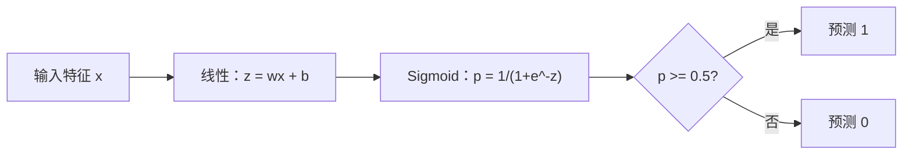
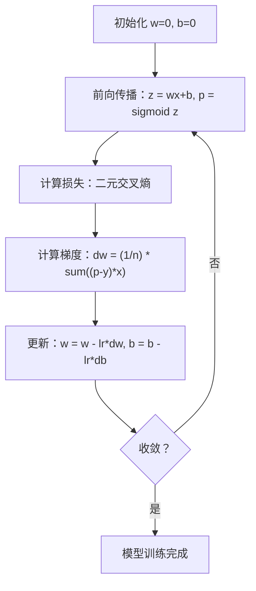

# 逻辑回归

> 逻辑回归将一条直线弯曲成 S 形曲线，以概率回答是或否的问题。

**类型：** 构建
**语言：** Python
**先决条件：** 阶段 2 第 01-02 课（什么是 ML、线性回归）
**时间：** ~90 分钟

## 学习目标

- 使用 sigmoid 函数和二元交叉熵损失从头实现逻辑回归
- 计算并解释二分类的精确率、召回率、F1 分数和混淆矩阵
- 解释为什么 MSE 对分类失败以及为什么二元交叉熵产生凸代价曲面
- 为多类分类构建 softmax 回归模型并评估阈值调优的权衡

## 问题

你想根据肿瘤的大小预测它是恶性还是良性。你尝试线性回归。它输出像 0.3、1.7 或 -0.5 这样的数字。这些意味着什么？1.7 是"非常恶性"吗？-0.5 是"非常良性"吗？线性回归输出无界数字。分类需要介于 0 和 1 之间的有界概率，以及一个明确的决策：是或否。

逻辑回归解决了这个问题。它采用相同的线性组合（wx + b）并将其通过 sigmoid 函数，该函数将任何数字压缩到 (0, 1) 范围内。输出是一个概率。你设置一个阈值（通常是 0.5）并做出决策。

这是实践中使用最广泛的算法之一。尽管名称如此，逻辑回归是一个分类算法，而不是回归算法。名称来源于它使用的逻辑（sigmoid）函数。

## 概念

### 为什么线性回归对分类失败

想象根据学习时长预测通过/失败（1/0）。线性回归通过数据拟合一条线：

```
小时：  1   2   3   4   5   6   7   8   9   10
实际：  0   0   0   0   1   1   1   1   1   1
```

线性拟合可能在小时 1 产生像 -0.2 的预测，在小时 10 产生 1.3 的预测。这些值不是概率。它们低于 0 和高于 1。更糟的是，一个异常值（一个学习了 50 小时的人）会拖拽整条线，改变每个人的预测。

分类需要一个函数来：
- 输出介于 0 和 1 之间的值（概率）
- 创建一个锐利的过渡（决策边界）
- 不被远离边界的异常值扭曲

### Sigmoid 函数

Sigmoid 函数正是做这件事的：

```
sigmoid(z) = 1 / (1 + e^(-z))
```

性质：
- 当 z 大且正时，sigmoid(z) 趋近 1
- 当 z 大且负时，sigmoid(z) 趋近 0
- 当 z = 0 时，sigmoid(z) = 0.5
- 输出始终在 0 和 1 之间
- 函数处处平滑且可微

导数有一个方便的形式：sigmoid'(z) = sigmoid(z) * (1 - sigmoid(z))。这使梯度计算变得高效。

### 逻辑回归 = 线性模型 + Sigmoid

模型计算 z = wx + b（与线性回归相同），然后应用 sigmoid：



输出 p 解释为 P(y=1 | x)，输入属于类 1 的概率。决策边界在 wx + b = 0 处，使 sigmoid 输出恰好为 0.5。

### 二元交叉熵损失

你不能对逻辑回归使用 MSE。带 sigmoid 的 MSE 创建一个具有许多局部最小值的非凸代价曲面。相反，使用二元交叉熵（对数损失）：

```
损失 = -(1/n) * sum(y * log(p) + (1-y) * log(1-p))
```

为什么有效：
- 当 y=1 且 p 接近 1 时：log(1) = 0，因此损失接近 0（正确，低代价）
- 当 y=1 且 p 接近 0 时：log(0) 趋向负无穷，因此损失巨大（错误，高代价）
- 当 y=0 且 p 接近 0 时：log(1) = 0，因此损失接近 0（正确，低代价）
- 当 y=0 且 p 接近 1 时：log(0) 趋向负无穷，因此损失巨大（错误，高代价）

这个损失函数对逻辑回归是凸的，保证单一的全局最小值。

### 逻辑回归的梯度下降

带 sigmoid 的二元交叉熵的梯度有一个简洁的形式：

```
dL/dw = (1/n) * sum((p - y) * x)
dL/db = (1/n) * sum(p - y)
```

这些看起来与线性回归的梯度完全相同。区别在于 p = sigmoid(wx + b) 而不是 p = wx + b。Sigmoid 引入了非线性，但梯度更新规则保持不变。



### 决策边界

对于 2D 输入（两个特征），决策边界是满足以下条件的线：

```
w1*x1 + w2*x2 + b = 0
```

一侧的点被分类为 1，另一侧的点被分类为 0。逻辑回归总是产生线性决策边界。如果你需要曲线边界，你要么添加多项式特征，要么使用非线性模型。

### 使用 Softmax 的多类分类

二元逻辑回归处理两个类。对于 k 个类，使用 softmax 函数：

```
softmax(z_i) = e^(z_i) / sum(e^(z_j) 对所有 j)
```

每个类有自己的权重向量。模型对每个类计算一个分数 z_i，然后 softmax 将分数转换为和为 1 的概率。预测的类是概率最高的那个。

损失函数变为类别交叉熵：

```
损失 = -(1/n) * sum(sum(y_k * log(p_k)))
```

其中 y_k 对真实类为 1，对所有其他类为 0（独热编码）。

### 评估指标

仅凭准确率是不够的。对于 95% 负类和 5% 正类的数据集，一个总是预测负类的模型获得 95% 准确率但是无用的。

**混淆矩阵**：

| | 预测为正向 | 预测为负向 |
|---|---|---|
| 实际为正向 | 真阳性 (TP) | 假阴性 (FN) |
| 实际为负向 | 假阳性 (FP) | 真阴性 (TN) |

**精确率**：在所有预测为正向的样本中，有多少是实际正向的？
```
精确率 = TP / (TP + FP)
```

**召回率**（灵敏度）：在所有实际正向的样本中，我们捕获了多少？
```
召回率 = TP / (TP + FN)
```

**F1 分数**：精确率和召回率的调和平均。平衡两个指标。
```
F1 = 2 * (精确率 * 召回率) / (精确率 + 召回率)
```

何时优先：
- **精确率**：当假阳性代价高时（垃圾邮件过滤器，你不想拦截合法邮件）
- **召回率**：当假阴性代价高时（癌症筛查，你不想遗漏肿瘤）
- **F1**：当你需要一个单一的平衡指标时

```figure
logistic-sigmoid
```

## 构建它

### 步骤 1：Sigmoid 函数和数据生成

```python
import random
import math

def sigmoid(z):
    z = max(-500, min(500, z))
    return 1.0 / (1.0 + math.exp(-z))


random.seed(42)
N = 200
X = []
y = []

for _ in range(N // 2):
    X.append([random.gauss(2, 1), random.gauss(2, 1)])
    y.append(0)

for _ in range(N // 2):
    X.append([random.gauss(5, 1), random.gauss(5, 1)])
    y.append(1)

combined = list(zip(X, y))
random.shuffle(combined)
X, y = zip(*combined)
X = list(X)
y = list(y)
```

### 步骤 2：从头实现逻辑回归

```python
class LogisticRegression:
    def __init__(self, n_features, learning_rate=0.01):
        self.weights = [0.0] * n_features
        self.bias = 0.0
        self.lr = learning_rate
        self.loss_history = []

    def predict_proba(self, x):
        z = sum(w * xi for w, xi in zip(self.weights, x)) + self.bias
        return sigmoid(z)

    def predict(self, x, threshold=0.5):
        return 1 if self.predict_proba(x) >= threshold else 0

    def compute_loss(self, X, y):
        n = len(y)
        total = 0.0
        for i in range(n):
            p = self.predict_proba(X[i])
            p = max(1e-15, min(1 - 1e-15, p))
            total += y[i] * math.log(p) + (1 - y[i]) * math.log(1 - p)
        return -total / n

    def fit(self, X, y, epochs=1000, print_every=200):
        n = len(y)
        n_features = len(X[0])
        for epoch in range(epochs):
            dw = [0.0] * n_features
            db = 0.0
            for i in range(n):
                p = self.predict_proba(X[i])
                error = p - y[i]
                for j in range(n_features):
                    dw[j] += error * X[i][j]
                db += error
            for j in range(n_features):
                self.weights[j] -= self.lr * (dw[j] / n)
            self.bias -= self.lr * (db / n)
            loss = self.compute_loss(X, y)
            self.loss_history.append(loss)
            if epoch % print_every == 0:
                print(f"  第 {epoch:4d} 轮 | 损失: {loss:.4f}")
        return self

    def accuracy(self, X, y):
        correct = sum(1 for i in range(len(y)) if self.predict(X[i]) == y[i])
        return correct / len(y)
```

### 步骤 3：混淆矩阵和从头实现的指标

```python
class ClassificationMetrics:
    def __init__(self, y_true, y_pred):
        self.tp = sum(1 for t, p in zip(y_true, y_pred) if t == 1 and p == 1)
        self.tn = sum(1 for t, p in zip(y_true, y_pred) if t == 0 and p == 0)
        self.fp = sum(1 for t, p in zip(y_true, y_pred) if t == 0 and p == 1)
        self.fn = sum(1 for t, p in zip(y_true, y_pred) if t == 1 and p == 0)

    def accuracy(self):
        total = self.tp + self.tn + self.fp + self.fn
        return (self.tp + self.tn) / total if total > 0 else 0

    def precision(self):
        denom = self.tp + self.fp
        return self.tp / denom if denom > 0 else 0

    def recall(self):
        denom = self.tp + self.fn
        return self.tp / denom if denom > 0 else 0

    def f1(self):
        p = self.precision()
        r = self.recall()
        return 2 * p * r / (p + r) if (p + r) > 0 else 0

    def print_report(self):
        self.print_confusion_matrix()
        print(f"\n  准确率:  {self.accuracy():.4f}")
        print(f"  精确率: {self.precision():.4f}")
        print(f"  召回率:    {self.recall():.4f}")
        print(f"  F1 分数:  {self.f1():.4f}")
```

### 步骤 5：使用 Softmax 的多类分类

```python
class SoftmaxRegression:
    def __init__(self, n_features, n_classes, learning_rate=0.01):
        self.n_features = n_features
        self.n_classes = n_classes
        self.lr = learning_rate
        self.weights = [[0.0] * n_features for _ in range(n_classes)]
        self.biases = [0.0] * n_classes

    def softmax(self, scores):
        max_score = max(scores)
        exp_scores = [math.exp(s - max_score) for s in scores]
        total = sum(exp_scores)
        return [e / total for e in exp_scores]

    def predict_proba(self, x):
        scores = [
            sum(self.weights[k][j] * x[j] for j in range(self.n_features)) + self.biases[k]
            for k in range(self.n_classes)
        ]
        return self.softmax(scores)

    def predict(self, x):
        probs = self.predict_proba(x)
        return probs.index(max(probs))

    def fit(self, X, y, epochs=1000, print_every=200):
        n = len(y)
        for epoch in range(epochs):
            grad_w = [[0.0] * self.n_features for _ in range(self.n_classes)]
            grad_b = [0.0] * self.n_classes
            total_loss = 0.0
            for i in range(n):
                probs = self.predict_proba(X[i])
                for k in range(self.n_classes):
                    target = 1.0 if y[i] == k else 0.0
                    error = probs[k] - target
                    for j in range(self.n_features):
                        grad_w[k][j] += error * X[i][j]
                    grad_b[k] += error
                true_prob = max(probs[y[i]], 1e-15)
                total_loss -= math.log(true_prob)
            for k in range(self.n_classes):
                for j in range(self.n_features):
                    self.weights[k][j] -= self.lr * (grad_w[k][j] / n)
                self.biases[k] -= self.lr * (grad_b[k] / n)
            if epoch % print_every == 0:
                print(f"  第 {epoch:4d} 轮 | 损失: {total_loss / n:.4f}")
        return self

    def accuracy(self, X, y):
        correct = sum(1 for i in range(len(y)) if self.predict(X[i]) == y[i])
        return correct / len(y)
```

## 使用它

使用 scikit-learn 做同样的事：

```python
from sklearn.linear_model import LogisticRegression as SklearnLR
from sklearn.metrics import accuracy_score, precision_score, recall_score, f1_score
from sklearn.metrics import confusion_matrix, classification_report
from sklearn.model_selection import train_test_split
from sklearn.preprocessing import StandardScaler
import numpy as np
```

你的从零实现产生相同的决策边界和指标。Scikit-learn 添加了求解器选项（liblinear、lbfgs、saga）、自动正则化、多类策略（一对多、多项式）和数值稳定性优化。

## 输出成果

本课产生：
- `code/logistic_regression.py`——带指标的逻辑回归从头实现

## 练习

1. 生成一个不是线性可分的数据集（例如，两个同心圆）。训练逻辑回归并观察其失败。然后添加多项式特征（x1^2, x2^2, x1*x2）并再次训练。展示准确率提高。
2. 为 3 类 softmax 模型实现一个多类混淆矩阵。计算每类的精确率和召回率。哪个类最难分类？
3. 从头构建 ROC 曲线。对从 0 到 1 的 100 个阈值，计算真阳性率和假阳性率。使用梯形法则计算 AUC（曲线下面积）。

## 关键术语

| 术语 | 人们说的 | 实际含义 |
|------|----------------|----------------------|
| 逻辑回归 | "用于分类的回归" | 后接 sigmoid 函数的线性模型，输出类别概率 |
| Sigmoid 函数 | "S 曲线" | 函数 1/(1+e^(-z))，将任意实数映射到 (0, 1) 范围 |
| 二元交叉熵 | "对数损失" | 损失函数 -[y*log(p) + (1-y)*log(1-p)]，严重惩罚自信的错误预测 |
| 决策边界 | "分割线" | 模型输出概率等于 0.5 的曲面，分隔预测的类别 |
| Softmax | "多类 sigmoid" | 将分数向量转换为和为 1 的概率的函数 |
| 精确率 | "选中的有多少相关" | TP / (TP + FP)，实际为正向的正向预测比例 |
| 召回率 | "相关的有多少被选中" | TP / (TP + FN)，模型正确识别的实际正向比例 |
| F1 分数 | "平衡准确率" | 精确率和召回率的调和平均：2*P*R / (P+R) |
| 混淆矩阵 | "错误分解" | 显示每个类对的 TP、TN、FP、FN 计数的表格 |
| 阈值 | "截断点" | 模型预测类 1 的概率值（默认 0.5，可调） |
| 独热编码 | "类别的二进制列" | 将类 k 表示为全零向量，在位置 k 处为 1 |
| 分类交叉熵 | "多类对数损失" | 使用独热编码标签将二元交叉熵扩展到 k 个类 |
