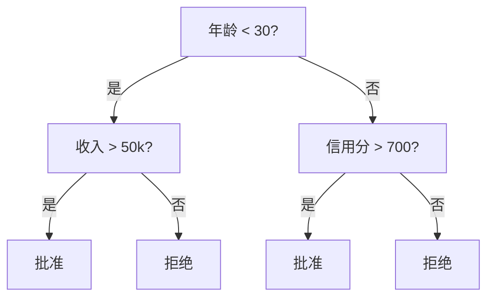
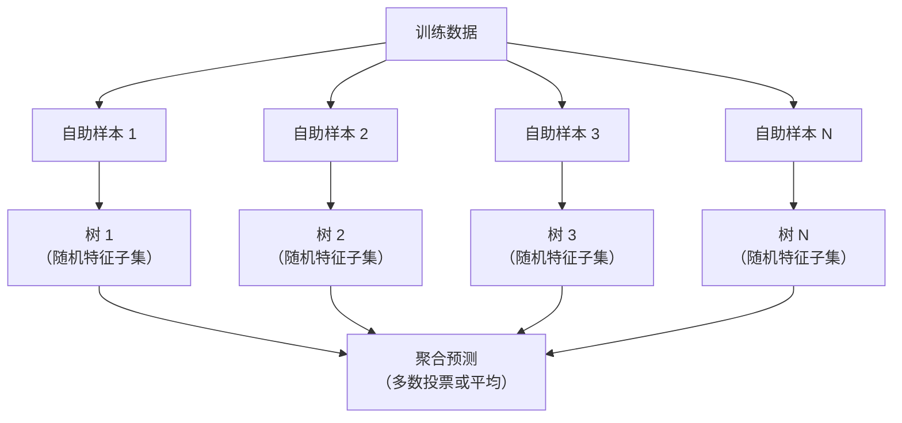

# 决策树与随机森林

> 决策树就是一个流程图。但一片森林是 ML 中最强大的工具之一。

**类型：** 构建
**语言：** Python
**先决条件：** 阶段 1（第 09 课信息论、第 06 课概率论）
**时间：** ~90 分钟

## 学习目标

- 实现 Gini 不纯度、熵和信息增益计算以找到最优决策树分割
- 使用预剪枝控制（最大深度、最小样本数）从头构建决策树分类器
- 使用自助采样和特征随机化构建随机森林，并解释为什么它减少方差
- 比较 MDI 特征重要性与置换重要性，并识别 MDI 何时有偏差

## 问题

你有表格数据。行是样本，列是特征，还有一个你想预测的目标列。你可以扔一个神经网络上去。但对于表格数据，基于树的模型（决策树、随机森林、梯度提升树）始终优于深度学习。结构化数据上的 Kaggle 竞赛由 XGBoost 和 LightGBM 主导，不是 transformer。

为什么？树原生处理混合特征类型（数值和分类）而无需预处理。它们处理非线性关系而无需特征工程。它们是可解释的：你可以查看树并准确看到为什么会做出某个预测。而平均许多棵树的随机森林对中等大小的数据集高度抵抗过拟合。

本课使用递归分割从头构建决策树，然后在其上构建随机森林。你将实现分割标准背后的数学（Gini 不纯度、熵、信息增益），并理解为什么弱学习器的集成会变为强学习器。

## 概念

### 决策树做什么

决策树通过询问一系列是/否问题将特征空间划分为矩形区域。



每个内部节点对特征与阈值进行测试。每个叶节点做出预测。要对一个新的数据点进行分类，你从根开始，沿着分支直到到达叶子。

树是自顶向下构建的：在每个节点，选择最能分离数据的特征和阈值。"最佳"由分割标准定义。

### 分割标准：测量不纯度

在每个节点，我们有一组样本。我们想分割它们使得结果子节点尽可能"纯"，即每个子节点主要包含一个类。

**Gini 不纯度**衡量一个随机选择的样本如果按照节点处的类分布来标记，会被错误分类的概率。

```
Gini(S) = 1 - sum(p_k^2)

其中 p_k 是类 k 在集合 S 中的比例。
```

对于纯节点（全部一个类），Gini = 0。对于 50/50 的二元分割，Gini = 0.5。越低越好。

```
例子：6 只猫，4 只狗

Gini = 1 - (0.6^2 + 0.4^2) = 1 - (0.36 + 0.16) = 0.48
```

**熵**衡量节点中的信息内容（混乱程度）。在阶段 1 第 09 课已涵盖。

```
熵(S) = -sum(p_k * log2(p_k))
```

对于纯节点，熵 = 0。对于 50/50 的二元分割，熵 = 1.0。越低越好。

```
例子：6 只猫，4 只狗

熵 = -(0.6 * log2(0.6) + 0.4 * log2(0.4))
        = -(0.6 * -0.737 + 0.4 * -1.322)
        = 0.442 + 0.529
        = 0.971 比特
```

**信息增益**是分割后不纯度（熵或 Gini）的减少。

```
IG(S, 特征, 阈值) = 不纯度(S) - 加权平均(不纯度(S_left), 不纯度(S_right))

其中权重是各子节点中样本的比例。
```

每个节点的贪婪算法：尝试每个特征和每个可能的阈值。选择最大化信息增益的（特征, 阈值）对。

### 分割如何工作

对于当前节点有 n 个特征和 m 个样本的数据集：

1. 对每个特征 j（j = 1 到 n）：
   - 按特征 j 对样本排序
   - 尝试连续不同值之间的每个中点作为阈值
   - 计算每个阈值的信息增益
2. 选择信息增益最高的特征和阈值
3. 将数据分割为左（特征 <= 阈值）和右（特征 > 阈值）
4. 在每个子节点上递归

这种贪婪方法不保证全局最优树。找到最优树是 NP-困难的。但贪婪分割在实践中效果良好。

### 停止条件

没有停止条件，树会一直增长直到每个叶子都是纯的（每个叶子一个样本）。这完美记忆了训练数据，但泛化极差。

**预剪枝**在树完全生长前停止：
- 最大深度：当树达到设定深度时停止分割
- 每叶最小样本数：如果节点少于 k 个样本则停止
- 最小信息增益：如果最佳分割改善不纯度少于阈值则停止
- 最大叶节点数：限制叶子的总数

**后剪枝**生长完整树，然后修剪它：
- 代价复杂度剪枝（scikit-learn 使用）：添加与叶数成比例的惩罚。增加惩罚使树更小
- 减少误差剪枝：如果验证误差不增加则删除子树

预剪枝更简单更快。后剪枝通常产生更好的树，因为它不会过早停止可能导致有用进一步分割的分割。

### 用于回归的决策树

对于回归，叶预测是该叶中目标值的均值。分割标准也改变：

**方差减少**替代信息增益：

```
VR(S, 特征, 阈值) = Var(S) - 加权平均(Var(S_left), Var(S_right))
```

选择最大减少方差的分割。树将输入空间划分为区域，并在每个区域预测一个常数（均值）。

### 随机森林：集成的力量

单棵决策树方差高。数据中的小变化可能产生完全不同的树。随机森林通过平均许多树来修复这个问题。



两个随机性来源使树多样化：

**Bagging（自助聚合）：** 每棵树在自助样本上训练，即从训练数据中有放回地随机采样。大约 63% 的原始样本出现在每个自助样本中（其余是可用于验证的袋外样本）。

**特征随机化：** 在每个分割处，仅考虑特征的随机子集。对于分类，默认为 sqrt(n_features)。对于回归，n_features/3。这防止所有树分割在同一主导特征上。

关键洞察：平均许多去相关的树在不增加偏差的情况下减少方差。每棵单独的树可能平庸。集成是强大的。

### 特征重要性

随机森林自然提供特征重要性分数。最常见的方法：

**平均不纯度减少（MDI）：** 对每个特征，在使用了该特征的所有树的所有节点上汇总不纯度减少总量。在更早分割处产生更大不纯度减少的特征更重要。

```
重要性(特征_j) = 对所有使用了特征_j 的节点求和：
    (节点处样本数 / 总样本数) * 不纯度减少
```

这很快（在训练期间计算），但偏向高基数特征和具有许多可能分割点的特征。

**置换重要性**是替代方案：打乱一个特征的值并衡量模型准确率下降多少。更可靠但更慢。

### 树何时胜于神经网络

树和森林在表格数据上优于神经网络。几个原因：

| 因素 | 树 | 神经网络 |
|--------|-------|----------------|
| 混合类型（数值 + 分类） | 原生支持 | 需要编码 |
| 小数据集（< 10k 行） | 工作良好 | 过拟合 |
| 特征交互 | 通过分割找到 | 需要架构设计 |
| 可解释性 | 完全透明 | 黑盒 |
| 训练时间 | 分钟 | 小时 |
| 超参数敏感度 | 低 | 高 |

当数据具有空间或序列结构（图像、文本、音频）时神经网络胜出。对于扁平的特征表，树是默认选择。

```figure
decision-tree-depth
```

## 构建它

### 步骤 1：Gini 不纯度和熵

```python
import math

def gini_impurity(labels):
    n = len(labels)
    if n == 0:
        return 0.0
    counts = {}
    for label in labels:
        counts[label] = counts.get(label, 0) + 1
    return 1.0 - sum((c / n) ** 2 for c in counts.values())

def entropy(labels):
    n = len(labels)
    if n == 0:
        return 0.0
    counts = {}
    for label in labels:
        counts[label] = counts.get(label, 0) + 1
    return -sum(
        (c / n) * math.log2(c / n) for c in counts.values() if c > 0
    )
```

### 步骤 2：找到最佳分割

```python
def information_gain(parent_labels, left_labels, right_labels, criterion="gini"):
    measure = gini_impurity if criterion == "gini" else entropy
    n = len(parent_labels)
    n_left = len(left_labels)
    n_right = len(right_labels)
    if n_left == 0 or n_right == 0:
        return 0.0
    parent_impurity = measure(parent_labels)
    child_impurity = (
        (n_left / n) * measure(left_labels) +
        (n_right / n) * measure(right_labels)
    )
    return parent_impurity - child_impurity
```

### 步骤 3：构建 DecisionTree 类

```python
class DecisionTree:
    def __init__(self, max_depth=None, min_samples_split=2,
                 min_samples_leaf=1, criterion="gini",
                 max_features=None):
        self.max_depth = max_depth
        self.min_samples_split = min_samples_split
        self.min_samples_leaf = min_samples_leaf
        self.criterion = criterion
        self.max_features = max_features
        self.tree = None
        self.feature_importances_ = None

    def fit(self, X, y):
        self.n_features = len(X[0])
        self.feature_importances_ = [0.0] * self.n_features
        self.n_samples = len(X)
        self.tree = self._build(X, y, depth=0)
        total = sum(self.feature_importances_)
        if total > 0:
            self.feature_importances_ = [
                fi / total for fi in self.feature_importances_
            ]

    def predict(self, X):
        return [self._predict_one(x, self.tree) for x in X]
```

### 步骤 4：构建 RandomForest 类

```python
class RandomForest:
    def __init__(self, n_trees=100, max_depth=None,
                 min_samples_split=2, max_features="sqrt",
                 criterion="gini"):
        self.n_trees = n_trees
        self.max_depth = max_depth
        self.min_samples_split = min_samples_split
        self.max_features = max_features
        self.criterion = criterion
        self.trees = []

    def fit(self, X, y):
        n = len(X)
        for _ in range(self.n_trees):
            indices = [random.randint(0, n - 1) for _ in range(n)]
            X_boot = [X[i] for i in indices]
            y_boot = [y[i] for i in indices]
            tree = DecisionTree(
                max_depth=self.max_depth,
                min_samples_split=self.min_samples_split,
                max_features=self.max_features,
                criterion=self.criterion,
            )
            tree.fit(X_boot, y_boot)
            self.trees.append(tree)

    def predict(self, X):
        all_preds = [tree.predict(X) for tree in self.trees]
        predictions = []
        for i in range(len(X)):
            votes = {}
            for preds in all_preds:
                v = preds[i]
                votes[v] = votes.get(v, 0) + 1
            predictions.append(max(votes, key=votes.get))
        return predictions
```

## 使用它

使用 scikit-learn，训练随机森林只需三行：

```python
from sklearn.ensemble import RandomForestClassifier
from sklearn.datasets import load_iris
from sklearn.model_selection import train_test_split

X, y = load_iris(return_X_y=True)
X_train, X_test, y_train, y_test = train_test_split(X, y, random_state=42)

rf = RandomForestClassifier(n_estimators=100, random_state=42)
rf.fit(X_train, y_train)
print(f"准确率: {rf.score(X_test, y_test):.4f}")
print(f"特征重要性: {rf.feature_importances_}")
```

在实践中，梯度提升树（XGBoost、LightGBM、CatBoost）通常比随机森林更强，因为它们顺序构建树，每棵树纠正前一棵的错误。但随机森林更难错误配置，且几乎不需要超参数调优。

## 输出成果

本课产生 `outputs/prompt-tree-interpreter.md`——为业务利益相关者解释决策树分割的提示词。

## 练习

1. 在一个 3 类的 2D 数据集上训练单棵决策树。手动追踪分割并画出矩形决策边界。比较 max_depth=2 vs max_depth=10 的边界。
2. 为回归树实现方差减少分割。生成 y = sin(x) + 噪声进行 200 点，并拟合你的回归树。绘制树的分段常数预测与真实曲线对比。
3. 使用 1、5、10、50 和 200 棵树构建随机森林。绘制训练准确率和测试准确率 vs 树的数量。观察测试准确率趋于稳定但不减少（森林抵抗过拟合）。
4. 在 5 个不同数据集上比较 Gini 不纯度 vs 熵作为分割标准。测量准确率和树的深度。在大多数情况下，它们产生几乎相同的结果。解释为什么。
5. 实现置换重要性。在具有一个随机噪声但高基数特征的数据集上与 MDI 重要性进行比较。MDI 会将噪声特征排名较高。置换重要性不会。

## 关键术语

| 术语 | 人们说的 | 实际含义 |
|------|----------------|----------------------|
| 决策树 | "用于预测的流程图" | 通过学习一系列 if/else 分割将特征空间划分为矩形区域的模型 |
| Gini 不纯度 | "节点有多混杂" | 节点处随机样本被错误分类的概率。0 = 纯，0.5 = 二元最大不纯度 |
| 熵 | "节点中的混乱程度" | 节点处的信息内容。0 = 纯，1.0 = 二元最大不确定性。来自信息论 |
| 信息增益 | "分割有多好" | 分割后不纯度的减少。选择分割的贪婪标准 |
| 预剪枝 | "提前停止树" | 通过设置最大深度、最小样本或最小增益阈值提前停止树生长 |
| 后剪枝 | "之后修剪树" | 生长完整树，然后删除不改善验证性能的子树 |
| Bagging | "在随机子集上训练" | 自助聚合。在带放回的不同随机样本上训练每个模型 |
| 随机森林 | "一堆树" | 决策树集成，每棵树在自助样本上训练，每个分割使用随机特征子集 |
| 特征重要性（MDI） | "哪些特征重要" | 每个特征贡献的总不纯度减少，汇总在所有树和节点上 |
| 置换重要性 | "打乱并检查" | 随机打乱某特征值后的准确率下降。对噪声特征比 MDI 更可靠 |
| 方差减少 | "信息增益的回归版" | 回归树的信息增益类比。选择最大减少目标方差的分割 |
| 自助样本 | "有重复的随机样本" | 从原始数据集中有放回地抽取的随机样本。大小相同，但有重复 |
