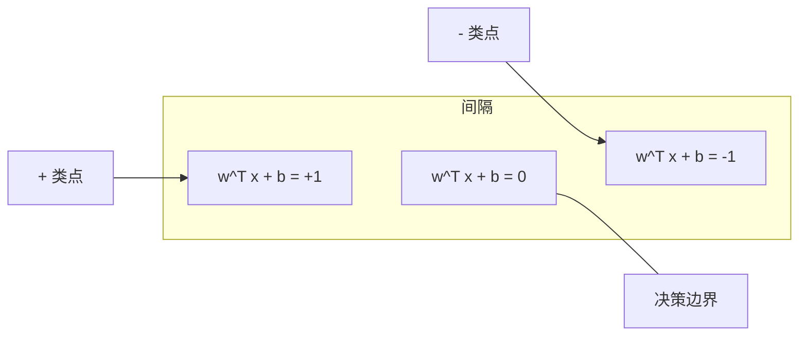
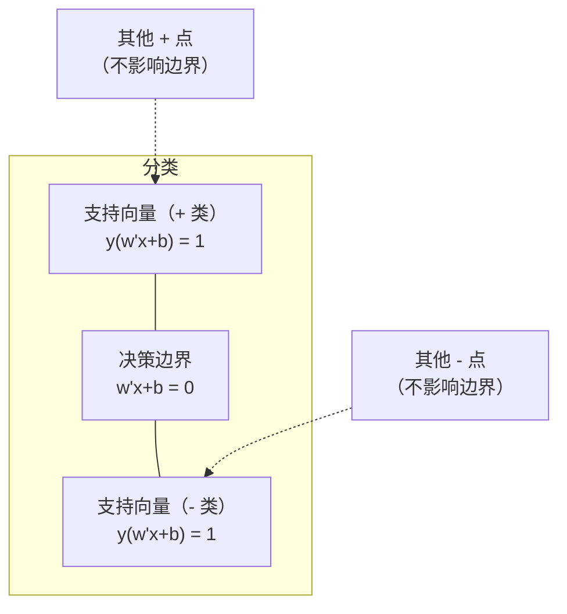
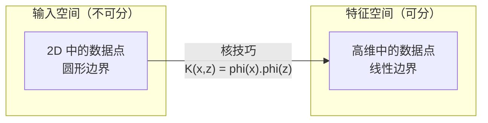

# 支持向量机

> 在两个类之间找到最宽的街道。这就是整个想法。

**类型：** 构建
**语言：** Python
**先决条件：** 阶段 1（第 08 课优化、第 14 课范数与距离、第 18 课凸优化）
**时间：** ~90 分钟

## 学习目标

- 使用铰链损失和对原始公式的梯度下降从头实现线性 SVM
- 解释最大间隔原则并识别训练模型中支持向量
- 比较线性、多项式和 RBF 核，并解释核技巧如何避免显式高维映射
- 评估由 C 参数控制的间隔宽度与分类错误之间的权衡

## 问题

你有两类数据点，需要画一条线（或超平面）将它们分开。有无限多条线可以用。你应该选哪一条？

具有最大间隔的那条。间隔是决策边界与每侧最近数据点之间的距离。更宽的间隔意味着分类器更自信，对未见数据的泛化更好。

这种直觉引出了支持向量机，ML 中最数学优雅的算法之一。在深度学习之前，SVM 是主要的分类方法，且对于小数据集、高维数据以及你需要一个有原则的、理解良好的、具有理论保证的模型的问题，仍然是最佳选择。

SVM 直接与阶段 1 相关：优化是凸的（第 18 课），间隔用范数测量（第 14 课），核技巧利用点积来处理非线性边界，而无需在高维空间中计算。

## 概念

### 最大间隔分类器

给定具有标签 y_i in {-1, +1} 和特征向量 x_i 的线性可分数据，我们想要一个超平面 w^T x + b = 0 将各类分开。

点 x_i 到超平面的距离是：

```
距离 = |w^T x_i + b| / ||w||
```

对于正确分类的点：y_i * (w^T x_i + b) > 0。间隔是超平面到任一侧最近点距离的两倍。



优化问题：

```
最大化    2 / ||w||     （间隔宽度）
约束于    y_i * (w^T x_i + b) >= 1  对所有 i
```

等价地（最小化 ||w||^2 更容易优化）：

```
最小化    (1/2) ||w||^2
约束于    y_i * (w^T x_i + b) >= 1  对所有 i
```

这是一个凸二次规划。它有一个唯一的全局解。恰好位于间隔边界上的数据点（y_i * (w^T x_i + b) = 1）是支持向量。它们是唯一决定决策边界的点。移动或移除任何非支持向量点，边界都不会改变。

### 支持向量：关键的少数



大多数训练点是不相关的。只有支持向量重要。这就是为什么 SVM 在预测时内存效率高：你只需要存储支持向量，而不是整个训练集。

支持向量的数量也给出了泛化误差的上界。相对于数据集大小越少的支持向量意味着越好的泛化。

### 软间隔：用 C 参数处理噪声

真实数据很少是完美可分的。某些点可能在边界的错误一侧，或在间隔内部。软间隔公式通过引入松弛变量允许违反。

```
最小化    (1/2) ||w||^2 + C * sum(xi_i)
约束于    y_i * (w^T x_i + b) >= 1 - xi_i
            xi_i >= 0  对所有 i
```

松弛变量 xi_i 衡量点 i 违反间隔的程度。C 控制权衡：

| C 值 | 行为 |
|---------|----------|
| 大 C | 严重惩罚违反。窄间隔，较少误分类。过拟合 |
| 小 C | 允许更多违反。宽间隔，更多误分类。欠拟合 |

C 是反转的正则化强度。大 C = 较少正则化。小 C = 更多正则化。

### 铰链损失：SVM 损失函数

软间隔 SVM 可以重写为无约束优化：

```
最小化    (1/2) ||w||^2 + C * sum(max(0, 1 - y_i * (w^T x_i + b)))
```

项 max(0, 1 - y_i * f(x_i)) 是铰链损失。当点正确分类且在间隔之外时为零。当点在间隔内部或被误分类时是线性的。

```
单个点的铰链损失：

损失
  |
  | \
  |  \
  |   \
  |    \
  |     \_______________
  |
  +-----|-----|-------->  y * f(x)
       0     1

当 y*f(x) >= 1 时损失为零（正确分类，在间隔外）。
当 y*f(x) < 1 时线性惩罚。
```

与逻辑损失（逻辑回归）比较：

```
铰链：     max(0, 1 - y*f(x))          在间隔处硬截断
逻辑：     log(1 + exp(-y*f(x)))        平滑，从不恰好为零
```

铰链损失产生稀疏解（只有支持向量有非零贡献）。逻辑损失使用所有数据点。这使 SVM 在预测时更内存高效。

### 使用梯度下降训练线性 SVM

你可以使用对铰链损失加 L2 正则化的梯度下降来训练线性 SVM，无需解约束 QP：

```
L(w, b) = (lambda/2) * ||w||^2 + (1/n) * sum(max(0, 1 - y_i * (w^T x_i + b)))

对 w 的梯度：
  如果 y_i * (w^T x_i + b) >= 1:  dL/dw = lambda * w
  如果 y_i * (w^T x_i + b) < 1:   dL/dw = lambda * w - y_i * x_i

对 b 的梯度：
  如果 y_i * (w^T x_i + b) >= 1:  dL/db = 0
  如果 y_i * (w^T x_i + b) < 1:   dL/db = -y_i
```

这称为原始公式。它每轮以 O(n * d) 运行，其中 n 是样本数，d 是特征数。对于大型、稀疏、高维数据（文本分类），这是快速的。

### 对偶公式和核技巧

SVM 问题的拉格朗日对偶（来自阶段 1 第 18 课，KKT 条件）是：

```
最大化    sum(alpha_i) - (1/2) * sum_ij(alpha_i * alpha_j * y_i * y_j * (x_i . x_j))
约束于    0 <= alpha_i <= C
            sum(alpha_i * y_i) = 0
```

对偶仅涉及数据点之间的点积 x_i . x_j。这是关键洞察。将每个点积替换为核函数 K(x_i, x_j)，SVM 就可以学习非线性边界，而无需显式计算变换。

```
线性核：      K(x, z) = x . z
多项式核：    K(x, z) = (x . z + c)^d
RBF（高斯）：  K(x, z) = exp(-gamma * ||x - z||^2)
```

RBF 核将数据映射到无限维空间。在输入空间中接近的点具有接近 1 的核值。远离的点具有接近 0 的核值。它可以学习任何平滑的决策边界。



核技巧计算高维空间中的点积而无需实际去到那里。对于 D 维中次数为 d 的多项式核，显式特征空间有 O(D^d) 维。但 K(x, z) 在 O(D) 时间内计算。

### SVM 用于回归（SVR）

支持向量回归拟合一个以 epsilon 为宽度的管包围数据。管内的点有零损失。管外的点被线性惩罚。

```
最小化    (1/2) ||w||^2 + C * sum(xi_i + xi_i*)
约束于    y_i - (w^T x_i + b) <= epsilon + xi_i
            (w^T x_i + b) - y_i <= epsilon + xi_i*
            xi_i, xi_i* >= 0
```

epsilon 参数控制管宽。更宽的管 = 更少支持向量 = 更平滑拟合。更窄的管 = 更多支持向量 = 更紧拟合。

### 为什么 SVM 输给了深度学习（以及它们何时仍然胜出）

SVM 从 20 世纪 90 年代末到 2010 年代初主导了 ML。深度学习超越它们有几个原因：

| 因素 | SVM | 深度学习 |
|--------|------|---------------|
| 特征工程 | 需要它 | 学习特征 |
| 可扩展性 | 对核方法 O(n^2) 到 O(n^3) | 使用 SGD 每轮 O(n) |
| 图像/文本/音频 | 需要手工特征 | 从原始数据学习 |
| 大数据集 (<100k) | 慢 | 扩展良好 |
| GPU 加速 | 有限的好处 | 巨大加速 |

SVM 在这些情况下仍然胜出：
- 小数据集（数百到低数千样本）
- 高维稀疏数据（使用 TF-IDF 特征的文本）
- 当你需要数学保证时（间隔上界）
- 当训练时间必须最小时（线性 SVM 非常快）
- 具有明显间隔结构的二分类
- 异常检测（单类 SVM）

```figure
svm-margin
```

## 构建它

### 步骤 1：铰链损失和梯度

基础。计算一批次的铰链损失及其梯度。

```python
def hinge_loss(X, y, w, b):
    n = len(X)
    total_loss = 0.0
    for i in range(n):
        margin = y[i] * (dot(w, X[i]) + b)
        total_loss += max(0.0, 1.0 - margin)
    return total_loss / n
```

### 步骤 2：通过梯度下降的线性 SVM

通过最小化正则化铰链损失来训练。不需要 QP 求解器。

```python
class LinearSVM:
    def __init__(self, lr=0.001, lambda_param=0.01, n_epochs=1000):
        self.lr = lr
        self.lambda_param = lambda_param
        self.n_epochs = n_epochs
        self.w = None
        self.b = 0.0

    def fit(self, X, y):
        n_features = len(X[0])
        self.w = [0.0] * n_features
        self.b = 0.0

        for epoch in range(self.n_epochs):
            for i in range(len(X)):
                margin = y[i] * (dot(self.w, X[i]) + self.b)
                if margin >= 1:
                    self.w = [wj - self.lr * self.lambda_param * wj
                              for wj in self.w]
                else:
                    self.w = [wj - self.lr * (self.lambda_param * wj - y[i] * X[i][j])
                              for j, wj in enumerate(self.w)]
                    self.b -= self.lr * (-y[i])

    def predict(self, X):
        return [1 if dot(self.w, x) + self.b >= 0 else -1 for x in X]
```

### 步骤 3：核函数

实现线性、多项式和 RBF 核。

```python
def linear_kernel(x, z):
    return dot(x, z)

def polynomial_kernel(x, z, degree=3, c=1.0):
    return (dot(x, z) + c) ** degree

def rbf_kernel(x, z, gamma=0.5):
    diff = [xi - zi for xi, zi in zip(x, z)]
    return math.exp(-gamma * dot(diff, diff))
```

### 步骤 4：间隔和支持向量识别

训练后，识别哪些点是支持向量并计算间隔宽度。

```python
def find_support_vectors(X, y, w, b, tol=1e-3):
    support_vectors = []
    for i in range(len(X)):
        margin = y[i] * (dot(w, X[i]) + b)
        if abs(margin - 1.0) < tol:
            support_vectors.append(i)
    return support_vectors
```

完整实现及所有演示见 `code/svm.py`。

## 使用它

使用 scikit-learn：

```python
from sklearn.svm import SVC, LinearSVC, SVR
from sklearn.preprocessing import StandardScaler
from sklearn.pipeline import Pipeline

clf = Pipeline([
    ("scaler", StandardScaler()),
    ("svm", SVC(kernel="rbf", C=1.0, gamma="scale")),
])
clf.fit(X_train, y_train)
print(f"准确率: {clf.score(X_test, y_test):.4f}")
print(f"支持向量: {clf['svm'].n_support_}")
```

重要：在训练 SVM 之前始终缩放你的特征。SVM 对特征量级敏感，因为间隔取决于 ||w||，而未缩放的特征会扭曲几何。

对于大数据集，使用 `LinearSVC`（原始公式，每轮 O(n)）而不是 `SVC`（对偶公式，O(n^2) 到 O(n^3)）：

```python
from sklearn.svm import LinearSVC

clf = Pipeline([
    ("scaler", StandardScaler()),
    ("svm", LinearSVC(C=1.0, max_iter=10000)),
])
```

## 练习

1. 生成一个 2D 线性可分数据集。训练你的 LinearSVM 并识别支持向量。验证支持向量是离决策边界最近的点。

2. 在含噪数据集上将 C 从 0.001 变化到 1000。绘制每个 C 值的决策边界。观察从宽间隔（欠拟合）到窄间隔（过拟合）的转变。

3. 创建一个类别边界是圆形的数据集（非线性的）。展示线性 SVM 失败。计算 RBF 核矩阵并展示类别在核诱导的特征空间中变得可分离。

4. 在同一数据集上比较铰链损失 vs 逻辑损失。训练一个线性 SVM 和逻辑回归。计数每个模型的决策边界有多少训练点有贡献（支持向量 vs 所有点）。

5. 实现 SVR（epsilon 不敏感损失）。将其拟合到 y = sin(x) + 噪声。绘制预测周围的 epsilon 管并高亮支持向量（管外的点）。

## 关键术语

| 术语 | 实际含义 |
|------|----------------------|
| 支持向量 | 离决策边界最近的训练点。唯一决定超平面的点 |
| 间隔 | 决策边界与最近支持向量之间的距离。SVM 最大化这个 |
| 铰链损失 | max(0, 1 - y*f(x))。当正确分类且在间隔外时为零。否则线性惩罚 |
| C 参数 | 间隔宽度与分类错误之间的权衡。大 C = 窄间隔，小 C = 宽间隔 |
| 软间隔 | 通过松弛变量允许间隔违反的 SVM 公式。处理不可分数据 |
| 核技巧 | 在高维特征空间中计算点积而无需显式映射到该空间 |
| 线性核 | K(x, z) = x . z。等价于标准点积。用于线性可分数据 |
| RBF 核 | K(x, z) = exp(-gamma * \|\|x-z\|\|^2)。映射到无限维。学习任何平滑边界 |
| 多项式核 | K(x, z) = (x . z + c)^d。映射到多项式组合的特征空间 |
| 对偶公式 | 仅依赖数据点之间点积的 SVM 问题的重表述。启用核方法 |
| SVR | 支持向量回归。围绕数据拟合一个 epsilon 管。管内的点有零损失 |
| 松弛变量 | xi_i：衡量一点违反间隔的程度。对间隔外正确分类的点为零 |
| 最大间隔 | 选择最大化到每类最近点距离的超平面的原则 |

## 进一步阅读

- [Vapnik: The Nature of Statistical Learning Theory (1995)](https://link.springer.com/book/10.1007/978-1-4757-3264-1)——SVM 和统计学习的基础文本
- [Cortes & Vapnik: Support-vector networks (1995)](https://link.springer.com/article/10.1007/BF00994018)——原始 SVM 论文
- [Platt: Sequential Minimal Optimization (1998)](https://www.microsoft.com/en-us/research/publication/sequential-minimal-optimization-a-fast-algorithm-for-training-support-vector-machines/)——使 SVM 训练变得实用的 SMO 算法
- [scikit-learn SVM 文档](https://scikit-learn.org/stable/modules/svm.html)——带实现细节的实用指南
- [LIBSVM: A Library for Support Vector Machines](https://www.csie.ntu.edu.tw/~cjlin/libsvm/)——大多数 SVM 实现背后的 C++ 库
