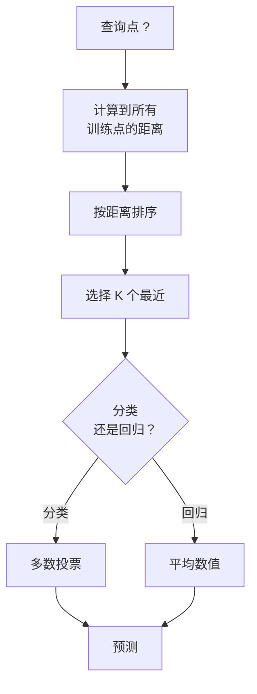
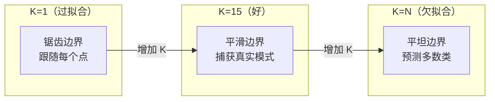
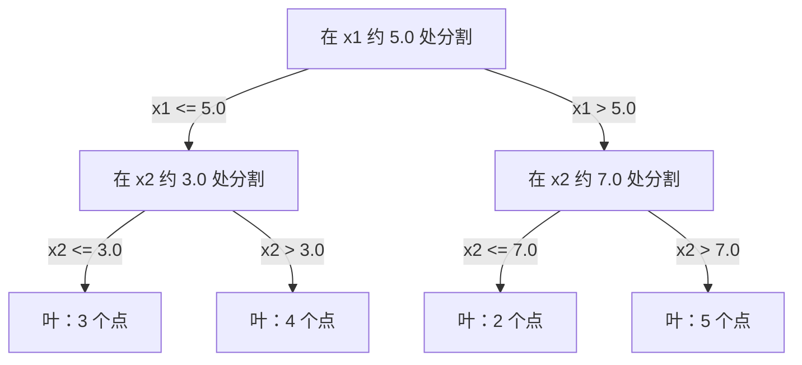

# K-最近邻与距离

> 存储所有数据。通过看邻居来预测。行之有效的最简单算法。

**类型：** 构建
**语言：** Python
**先决条件：** 阶段 1（第 14 课范数与距离）
**时间：** ~90 分钟

## 学习目标

- 从头实现可配置 K 和距离加权投票的 KNN 分类与回归
- 比较 L1、L2、余弦和 Minkowski 距离度量并为给定数据类型选择适当的一种
- 解释维度诅咒并演示为什么 KNN 在高维空间中退化
- 构建 KD 树进行高效的最近邻搜索并分析何时优于暴力搜索

## 问题

你有一个数据集。一个新的数据点到达。你需要分类它或预测它的值。你不是从数据中学习参数（像线性回归或 SVM 那样），你只需找到离新点最近的 K 个训练点并让它们投票。

这就是 K-最近邻。没有训练阶段。没有需要学习的参数。没有需要最小化的损失函数。你存储整个训练集并在预测时计算距离。

它听起来太简单了以至于不像能工作。但 KNN 对许多问题出奇地有竞争力，特别是小型到中型数据集，深入理解它揭示了基础概念：距离度量的选择（连接到阶段 1 第 14 课），维度诅咒，以及惰性学习和急切学习之间的区别。

KNN 在现代 AI 中也到处出现，只是不同名称。向量数据库对嵌入做 KNN 搜索。检索增强生成（RAG）找到 K 个最近的文档块。推荐系统找到相似的用户或物品。算法是相同的。规模和数据结构是不同的。

## 概念

### KNN 如何工作

给定带标签点的数据集和一个新的查询点：

1. 计算从查询点到数据集中每个点的距离
2. 按距离排序
3. 取 K 个最近的点
4. 对于分类：K 个邻居中的多数投票
5. 对于回归：K 个邻居值的平均（或加权平均）



这就是整个算法。没有拟合。没有梯度下降。没有轮次。

### 选择 K

K 是唯一的超参数。它控制偏差-方差权衡：

| K | 行为 |
|---|----------|
| K = 1 | 决策边界跟随每个点。零训练误差。高方差。过拟合 |
| 小 K（3-5）| 对局部结构敏感。可捕获复杂边界 |
| 大 K | 更平滑的边界。对噪声更鲁棒。可能欠拟合 |
| K = N | 对每个点预测多数类。最大偏差 |

一个常见的起点是对于 N 个点的数据集 K = sqrt(N)。对二元分类使用奇数 K 以避免平局。



### 距离度量

距离函数定义了"近"的含义。不同的度量产生不同的邻居，不同的预测。

**L2（欧几里得）** 是默认值。直线距离。

```
d(a, b) = sqrt(sum((a_i - b_i)^2))
```

对特征尺度敏感。在使用 L2 与 KNN 之前始终标准化特征。

**L1（曼哈顿）** 求和绝对差。比 L2 对异常值更鲁棒，因为它不平方差。

```
d(a, b) = sum(|a_i - b_i|)
```

**余弦距离** 测量向量之间的角度，忽略大小。对文本和嵌入数据至关重要。

```
d(a, b) = 1 - (a . b) / (||a|| * ||b||)
```

**Minkowski** 使用参数 p 泛化 L1 和 L2。

```
d(a, b) = (sum(|a_i - b_i|^p))^(1/p)

p=1: 曼哈顿
p=2: 欧几里得
p->inf: 切比雪夫（最大绝对差）
```

使用哪种度量取决于数据：

| 数据类型 | 最佳度量 | 原因 |
|-----------|------------|-----|
| 数值特征，相似尺度 | L2（欧几里得） | 默认，适用于空间数据 |
| 数值特征，异常值 | L1（曼哈顿） | 鲁棒，不放大大的差异 |
| 文本嵌入 | 余弦 | 大小是噪声，方向是含义 |
| 高维稀疏 | 余弦或 L1 | L2 遭受维度诅咒 |
| 混合类型 | 自定义距离 | 按特征类型组合度量 |

### 加权 KNN

标准 KNN 对所有 K 个邻居赋予相等权重。但距离 0.1 处的邻居应该比 5.0 处的更重要。

**距离加权 KNN** 按距离倒数加权每个邻居：

```
权重_i = 1 / (距离_i + epsilon)

对于分类：加权投票
对于回归：    加权平均 = sum(w_i * y_i) / sum(w_i)
```

epsilon 防止当查询点恰好匹配训练点时除零。

加权 KNN 对 K 的选择不那么敏感，因为远处邻居的贡献无论如何都非常小。

### 维度诅咒

KNN 性能在高维中退化。这不是模糊的担忧，而是数学事实。

**问题 1：距离收敛。** 随着维度增加，最大距离与最小距离的比率趋近于 1。所有点都变得离查询"同样远"。

```
在 d 维中，对于随机均匀点：

d=2:    最大距离 / 最小距离 = 变化很大
d=100:  最大距离 / 最小距离 ~ 1.01
d=1000: 最大距离 / 最小距离 ~ 1.001

当所有距离几乎相等时，"最近"没有意义。
```

**问题 2：体积爆炸。** 为了在固定比例的数据中捕获 K 个邻居，你需要扩展搜索半径以覆盖特征空间的更大比例。高维中的"邻域"涵盖了空间的大部分。

**问题 3：角落主导。** 在 d 维单位超立方体中，大部分体积集中在角落附近，而不是中心。随着 d 增长，内接于立方体的球包含的体积比例趋于零。

实际后果：KNN 在约 20-50 个特征以下工作良好。超出此范围，你需要在应用 KNN 之前进行降维（PCA、UMAP、t-SNE），或使用利用数据固有较低维度的基于树的搜索结构。

### KD 树：快速最近邻搜索

暴力 KNN 计算从查询点到每个训练点的距离。每次查询是 O(n * d)。对于大数据集，这太慢了。

KD 树沿特征轴递归划分空间。在每一层，它沿一个维度在中值处分割。



要找到最近邻，遍历树到包含查询的叶节点，然后回溯并仅当邻近分区可能包含更近点时检查它们。

平均查询时间：低维的 O(log n)。但 KD 树在高维（d > 20）退化为 O(n)，因为回溯消除的分支越来越少。

### 球树：对中等维度更好

球树将数据划分为嵌套超球而不是轴对齐的盒子。每个节点定义一个包含其子树中所有点的球（中心 + 半径）。

相比 KD 树的优势：
- 在中等维度（高达 ~50）工作更好
- 处理非轴对齐结构
- 更紧的包围体积意味着搜索期间更多分支被剪枝

KD 树和球树都是精确算法。对于真正的大规模搜索（数百万点，数百维），使用近似最近邻方法（HNSW、IVF、产品量化）。这些在阶段 1 第 14 课中讨论。

### 惰性学习 vs 急切学习

KNN 是惰性学习器：它在训练时不做任何工作，在预测时做所有工作。大多数其他算法（线性回归、SVM、神经网络）是急切学习器：它们在训练时进行大量计算以构建紧凑模型，然后预测很快。

| 方面 | 惰性（KNN） | 急切（SVM、神经网络） |
|--------|------------|------------------------|
| 训练时间 | O(1) 仅存储数据 | O(n * epochs) |
| 预测时间 | 每次查询 O(n * d) | O(d) 或 O(参数) |
| 预测时内存 | 存储整个训练集 | 仅存储模型参数 |
| 适应新数据 | 即时添加点 | 重新训练模型 |
| 决策边界 | 隐式，即时计算 | 显式，训练后固定 |

惰性学习理想适用于：
- 数据集频繁变化（添加/删除点无需重新训练）
- 你需要对极少数查询进行预测
- 你想要零训练时间
- 数据集足够小，暴力搜索很快

### KNN 用于回归

回归的 KNN 使用 K 个邻居目标值的平均而不是多数投票。

```
预测 = (1/K) * sum(y_i 对 K 个最近邻居)

或带距离加权：
预测 = sum(w_i * y_i) / sum(w_i)
其中 w_i = 1 / 距离_i
```

KNN 回归产生分段常数（或带加权的分段平滑）预测。它不能外推到训练数据的范围之外。如果训练目标全部在 0 到 100 之间，KNN 永远不会预测 200。

```figure
knn-smoothness
```

## 构建它

### 步骤 1：距离函数

```python
import math

def l2_distance(a, b):
    return math.sqrt(sum((ai - bi) ** 2 for ai, bi in zip(a, b)))

def l1_distance(a, b):
    return sum(abs(ai - bi) for ai, bi in zip(a, b))

def cosine_distance(a, b):
    dot_val = sum(ai * bi for ai, bi in zip(a, b))
    norm_a = math.sqrt(sum(ai ** 2 for ai in a))
    norm_b = math.sqrt(sum(bi ** 2 for bi in b))
    if norm_a == 0 or norm_b == 0:
        return 1.0
    return 1.0 - dot_val / (norm_a * norm_b)

def minkowski_distance(a, b, p=2):
    if p == float('inf'):
        return max(abs(ai - bi) for ai, bi in zip(a, b))
    return sum(abs(ai - bi) ** p for ai, bi in zip(a, b)) ** (1 / p)
```

### 步骤 2：KNN 分类器和回归器

```python
class KNN:
    def __init__(self, k=5, distance_fn=l2_distance, weighted=False,
                 task="classification"):
        self.k = k
        self.distance_fn = distance_fn
        self.weighted = weighted
        self.task = task
        self.X_train = None
        self.y_train = None

    def fit(self, X, y):
        self.X_train = X
        self.y_train = y

    def predict(self, X):
        return [self._predict_one(x) for x in X]
```

### 步骤 3：特征缩放

KNN 需要特征缩放，因为距离对特征大小敏感。范围从 0 到 1000 的特征会主导范围从 0 到 1 的特征。

```python
def standardize(X):
    n = len(X)
    d = len(X[0])
    means = [sum(X[i][j] for i in range(n)) / n for j in range(d)]
    stds = [
        max(1e-10, (sum((X[i][j] - means[j]) ** 2 for i in range(n)) / n) ** 0.5)
        for j in range(d)
    ]
    return [[((X[i][j] - means[j]) / stds[j]) for j in range(d)] for i in range(n)], means, stds
```

完整实现及所有辅助方法和演示请参见 `code/knn.py`。

## 使用它

使用 scikit-learn：

```python
from sklearn.neighbors import KNeighborsClassifier
from sklearn.preprocessing import StandardScaler
from sklearn.pipeline import Pipeline

clf = Pipeline([
    ("scaler", StandardScaler()),
    ("knn", KNeighborsClassifier(n_neighbors=5, metric="euclidean")),
])
clf.fit(X_train, y_train)
print(f"准确率: {clf.score(X_test, y_test):.4f}")
```

对于大规模最近邻搜索（数百万向量），使用 FAISS、Annoy 或向量数据库：

```python
import faiss

index = faiss.IndexFlatL2(dimension)
index.add(embeddings)
distances, indices = index.search(query_vectors, k=5)
```

## 练习

1. 在一个 3 类的 2D 数据集上实现 KNN 分类。绘制 K=1、K=5、K=15 和 K=N 的决策边界。观察从过拟合到欠拟合的过渡。
2. 在 2、5、10、50、100 和 500 维中生成 1000 个随机点。对每个维度，计算最大成对距离与最小成对距离的比率。绘制比率 vs 维度以可视化维度诅咒。
3. 在文本分类问题上比较 L1、L2 和余弦距离用于 KNN（使用 TF-IDF 向量）。哪种度量给出最佳准确率？为什么余弦在文本上倾向于获胜？
4. 实现 KD 树并测量在 2D、10D 和 50D 中 1k、10k 和 100k 点数据集的查询时间 vs 暴力搜索。在什么维度 KD 树停止比暴力搜索快？
5. 为 y = sin(x) + 噪声构建加权 KNN 回归器。与未加权的 KNN 比较 K=3、10、30。展示加权产生更平滑的预测，特别是对大 K。

## 关键术语

| 术语 | 实际含义 |
|------|----------------------|
| K-最近邻 | 通过找到离查询最近的 K 个训练点来预测的非参数算法 |
| 惰性学习 | 训练时无计算。所有工作在预测时发生。KNN 是典范例子 |
| 急切学习 | 训练时进行大量计算以构建紧凑模型。大多数 ML 算法是急切的 |
| 维度诅咒 | 在高维中，距离收敛且邻域扩展以覆盖空间的大部分，使 KNN 无效 |
| KD 树 | 沿特征轴递归划分空间的二叉树。低维中 O(log n) 查询 |
| 球树 | 嵌套超球的树。在中等维度（高达 ~50）比 KD 树工作更好 |
| 加权 KNN | 邻居按距离倒数加权。更近的邻居对预测有更大影响 |
| 特征缩放 | 将特征归一化到可比范围。KNN 等基于距离的方法需要 |
| 多数投票 | 通过计算 K 个邻居中哪个类最常见进行分类 |
| 暴力搜索 | 计算到每个训练点的距离。每次查询 O(n*d)。精确但对大 n 慢 |
| 近似最近邻 | 比精确搜索快得多地找到近似最近点的算法（HNSW、LSH、IVF） |
| Voronoi 图 | 每个区域包含更靠近一个训练点而非其他训练点的所有点的空间划分。K=1 KNN 产生 Voronoi 边界 |
