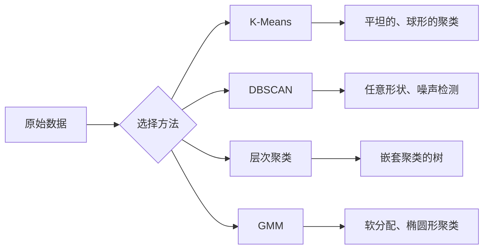

# 无监督学习

> 没有标签，没有老师。算法自己找到结构。

**类型：** 构建
**语言：** Python
**先决条件：** 阶段 1（范数与距离、概率与分布），阶段 2 第 01-06 课
**时间：** ~90 分钟

## 学习目标

- 从头实现 K-Means、DBSCAN 和高斯混合模型，并比较它们的聚类行为
- 使用轮廓分数和肘部方法评估聚类质量，以选择最优 K
- 解释 DBSCAN 何时优于 K-Means，并识别哪种算法能处理非球形聚类和异常值
- 构建使用聚类方法标记偏离正常模式的点的异常检测管道

## 问题

到目前为止的每个 ML 课程都假设了带标签数据："这里是一个输入，这里是正确的输出。"在真实世界中，标签是昂贵的。医院有数百万条患者记录，但没有人手动为每条标记疾病类别。电商网站有数百万个用户会话，但没有人手工标记客户细分。安全团队有网络日志，但没有人标记每个异常。

无监督学习在没有人告诉它要寻找什么的情况下找到模式。它将相似的数据点分组，发现隐藏的结构，并揭示异常。如果监督学习是带着答案键的教科书学习，那么无监督学习就是盯着原始数据直到模式自己显露。

陷阱：没有标签，你不能直接衡量"对"或"错"。你需要不同的工具来评估你的算法找到的结构是否有意义。

## 概念

### 聚类：将相似的东西分组

聚类将每个数据点分配到一个组（聚类），使得同组内的点比与其他组中的点更相似。问题始终是："相似"意味着什么？



### K-Means：主力算法

K-Means 将数据划分为恰好 K 个聚类。每个聚类有一个质心（其质量中心），每个点属于最近的质心。

Lloyd 算法：

1. 选择 K 个随机点作为初始质心
2. 将每个数据点分配给最近的质心
3. 将每个质心重新计算为其分配点的均值
4. 重复步骤 2-3 直到分配不再变化

目标函数（惯性）衡量每个点到其分配质心的总平方距离。K-Means 最小化这个值，但只找到局部最小值。不同的初始化可能给出不同的结果。

### 选择 K

两种标准方法：

**肘部方法：** 对 K = 1, 2, 3, ..., n 运行 K-Means。绘制惯性 vs K。寻找"肘部"，即添加更多聚类停止显著减少惯性的地方。

**轮廓分数：** 对每个点，衡量它与自己聚类（a）相比与最近的其他聚类（b）有多相似。轮廓系数是 (b - a) / max(a, b)，范围从 -1（错误的聚类）到 +1（良好聚类）。对所有点取平均得到全局分数。

### DBSCAN：基于密度的聚类

K-Means 假设聚类是球形的，并要求你预先选择 K。DBSCAN 两者都不需要。它找到由稀疏区域分隔的密集区域作为聚类。

两个参数：
- **eps**：邻域的半径
- **min_samples**：形成密集区域所需的最小点数

三种类型的点：
- **核心点**：在 eps 距离内至少有 min_samples 个点
- **边界点**：在核心点的 eps 内但本身不是核心点
- **噪声点**：既不是核心点也不是边界点。这些是异常值。

DBSCAN 将彼此在 eps 范围内的核心点连接到同一聚类。边界点加入附近核心点的聚类。噪声点不属于任何聚类。

优势：发现任何形状的聚类，自动确定聚类数，识别异常值。弱点：难以处理密度变化的聚类。

### 层次聚类

构建嵌套聚类的树（树状图）。

凝聚式（自底向上）：
1. 从每个点作为自己的聚类开始
2. 合并两个最近的聚类
3. 重复直到只剩一个聚类
4. 在期望水平切割树状图得到 K 个聚类

聚类之间的"接近度"可以测量为：
- **单链**：两个聚类中任意两点之间的最小距离
- **全链**：任意两点之间的最大距离
- **平均链**：所有对之间的平均距离
- **Ward 方法**：导致总类内方差增加最小的合并

### 高斯混合模型（GMM）

K-Means 提供硬分配：每个点恰好属于一个聚类。GMM 提供软分配：每个点对每个聚类都有属于它的概率。

GMM 假设数据由 K 个高斯分布的混合生成，每个有自己的均值和协方差。期望最大化（EM）算法在以下之间交替：

- **E 步**：计算每个点属于每个高斯的概率
- **M 步**：更新每个高斯的均值、协方差和混合权重以最大化数据似然

GMM 可以建模椭圆形聚类（不仅仅是像 K-Means 的球形），并自然处理重叠聚类。

### 何时使用哪种

| 方法 | 最佳用于 | 避免当 |
|--------|----------|------------|
| K-Means | 大数据集、球形聚类、已知 K | 不规则形状、存在异常值 |
| DBSCAN | 未知 K、任意形状、异常检测 | 密度变化、极高维度 |
| 层次聚类 | 小数据集、需要树状图、未知 K | 大数据集（O(n^2) 内存） |
| GMM | 重叠聚类、需要软分配 | 极大数据集、太多维度 |

### 使用聚类进行异常检测

聚类自然支持异常检测：
- **K-Means**：远离任何质心的点是异常值
- **DBSCAN**：噪声点按定义是异常值
- **GMM**：在所有高斯下概率低的点是异常值

```figure
kmeans-step
```

## 构建它

### 步骤 1：从头实现 K-Means

```python
import math
import random


def euclidean_distance(a, b):
    return math.sqrt(sum((ai - bi) ** 2 for ai, bi in zip(a, b)))


def kmeans(data, k, max_iterations=100, seed=42):
    random.seed(seed)
    n_features = len(data[0])

    centroids = random.sample(data, k)

    for iteration in range(max_iterations):
        clusters = [[] for _ in range(k)]
        assignments = []

        for point in data:
            distances = [euclidean_distance(point, c) for c in centroids]
            nearest = distances.index(min(distances))
            clusters[nearest].append(point)
            assignments.append(nearest)

        new_centroids = []
        for cluster in clusters:
            if len(cluster) == 0:
                new_centroids.append(random.choice(data))
                continue
            centroid = [
                sum(point[j] for point in cluster) / len(cluster)
                for j in range(n_features)
            ]
            new_centroids.append(centroid)

        if all(
            euclidean_distance(old, new) < 1e-6
            for old, new in zip(centroids, new_centroids)
        ):
            print(f"  在第 {iteration + 1} 次迭代收敛")
            break

        centroids = new_centroids

    return assignments, centroids
```

### 步骤 2：肘部方法和轮廓分数

```python
def compute_inertia(data, assignments, centroids):
    total = 0.0
    for point, cluster_id in zip(data, assignments):
        total += euclidean_distance(point, centroids[cluster_id]) ** 2
    return total


def silhouette_score(data, assignments):
    n = len(data)
    if n < 2:
        return 0.0

    clusters = {}
    for i, c in enumerate(assignments):
        clusters.setdefault(c, []).append(i)

    if len(clusters) < 2:
        return 0.0
    ...
```

### 步骤 3：从头实现 DBSCAN

```python
def dbscan(data, eps, min_samples):
    n = len(data)
    labels = [-1] * n  # -1 = unvisited
    cluster_id = 0

    def region_query(point_idx):
        neighbors = []
        for i in range(n):
            if euclidean_distance(data[point_idx], data[i]) <= eps:
                neighbors.append(i)
        return neighbors
    ...
```

### 步骤 4：高斯混合模型（EM 算法）

```python
def gmm(data, k, max_iterations=100, seed=42):
    random.seed(seed)
    n = len(data)
    d = len(data[0])
    ...  # E-step and M-step
```

完整实现及所有演示请参见 `code/unsupervised.py`。

## 使用它

使用 scikit-learn：

```python
from sklearn.cluster import KMeans, DBSCAN
from sklearn.mixture import GaussianMixture
```

## 练习

1. 生成带有 3 个不同标准差的簇的 blob 数据集。在 K=2 到 K=10 上绘制肘部曲线。肘部是否与真实聚类数匹配？
2. 创建两个同心圆（`make_circles`）。比较 K-Means 和 DBSCAN 在这个数据集上的结果。解释为什么 K-Means 失败而 DBSCAN 成功。
3. 在相同数据集上为 K-Means、层次聚类和 GMM 计算轮廓分数。哪种方法给出最高分数？轮廓分数对聚类质量的排名是否与视觉检查匹配？
4. 实现一个异常检测管道：在干净数据上拟合一个聚类模型，然后对包含合成异常值的测试集评分。对 K-Means（使用到最近质心的距离）和 DBSCAN（使用噪声标签）测量检测精度。
5. 通过运行 10 次不同初始化的 K-Means 来展示 K-Means 的局部最优问题。绘制惯性分布。k-means++ 初始化如何减少方差？

## 关键术语

| 术语 | 实际含义 |
|------|----------------------|
| 聚类 | 将数据点分组，使得组内相似度高于组间 |
| 质心 | 一个聚类中所有点的算术平均（中心） |
| 惯性 | 每个点到其分配质心的总平方距离。K-Means 的目标函数 |
| 轮廓分数 | 衡量点与其自身聚类相比与邻近聚类的相似程度。范围 [-1, 1] |
| DBSCAN | 基于密度的空间聚类。找到由稀疏区域分隔的密集点区域 |
| 核心点 | 在 eps 范围内至少有 min_samples 个邻居的点 |
| 层次聚类 | 构建聚类树（树状图）。可以自底向上（凝聚）或自顶向下（分裂） |
| GMM | 高斯混合模型。假设数据由 K 个高斯分布集合生成 |
| EM 算法 | 期望最大化。在 E 步（计算软分配）和 M 步（更新参数）之间交替 |
| 软分配 | 每个点有一个属于每个聚类的概率，而不是恰好属于一个 |
| 异常检测 | 识别与大多数数据显著不同的数据点 |
