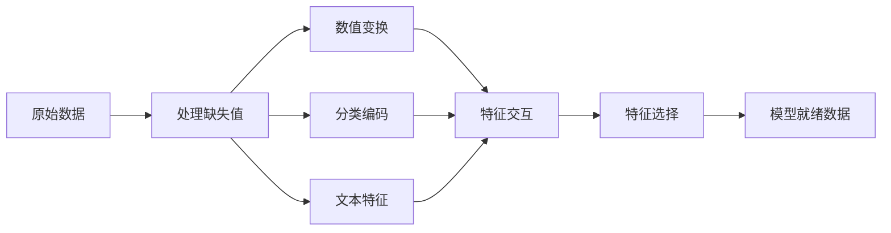

# 特征工程与特征选择

> 一个好的特征值一千个数据点。

**类型：** 构建
**语言：** Python
**先决条件：** 阶段 1（机器学习中的统计学、线性代数），阶段 2 第 01-07 课
**时间：** ~90 分钟

## 学习目标

- 实现数值变换（标准化、极差缩放、对数变换、分箱）并解释每种何时适用
- 为分类特征构建独热编码、标签编码和目标编码，并识别目标编码中的数据泄漏风险
- 从头构建 TF-IDF 向量化器，并解释为什么它在文本分类中优于原始词计数
- 应用基于过滤器的特征选择（方差阈值、相关性、互信息）来降维

## 问题

你有一个数据集。你选择了一个算法。你训练它。结果平平。你尝试一个更花哨的算法。仍然平平。你花了一周时间调优超参数。边际改善。

然后有人将原始数据转换为更好的特征，一个简单的逻辑回归击败了你调优过的梯度提升集成模型。

这种情况不断发生。在经典 ML 中，数据的表示比算法的选择更重要。一个带有"面积"和"卧室数量"的房价模型会击败带有"地址作为原始字符串"的模型，无论学习器多么复杂。算法只能处理你给它的东西。

特征工程是将原始数据转换为使模型更容易找到模式的表示的过程。特征选择是丢弃添加噪声而不添加信号的特征的过程。它们一起是经典 ML 中最高杠杆的活动。

## 概念

### 特征管道



### 数值特征

原始数字很少是模型就绪的。常见变换：

**缩放：** 将特征放在相同范围内，使得基于距离的算法（K-Means、KNN、SVM）平等对待所有特征。极差缩放映射到 [0, 1]。标准化（z-score）映射到均值=0，标准差=1。

**对数变换：** 压缩右偏分布（收入、人口、词数）。将乘法关系转为加法关系。

**分箱：** 将连续值转换为类别。当特征与目标之间的关系是非线性但是阶梯式时有用（例如，年龄组）。

**多项式特征：** 创建 x^2、x^3、x1*x2 项。让线性模型以更多特征为代价捕获非线性关系。

### 分类特征

模型需要数字。类别需要编码。

**独热编码：** 为每个类别创建一个二进制列。"颜色 = 红/蓝/绿"变成三列：是红、是蓝、是绿。对低基数特征运行良好，但类别多时会爆炸。

**标签编码：** 将每个类别映射到一个整数：红=0，蓝=1，绿=2。引入虚假顺序（模型可能认为绿 > 蓝 > 红）。仅适用于对单个值进行分割的基于树的模型。

**目标编码：** 将每个类别替换为该类别目标变量的均值。强大但危险：数据泄漏风险高。必须仅在训练数据上计算并应用于测试数据。

### 文本特征

**计数向量化器：** 计数每个单词在文档中出现的次数。"the cat sat on the mat" 变成 {the: 2, cat: 1, sat: 1, on: 1, mat: 1}。

**TF-IDF：** 词频-逆文档频率。按单词在文档间的独特性加权。像"the"这样的常见词获得低权重。稀有的、有区分度的词获得高权重。

```
TF(word, doc) = count(word in doc) / 文档中总单词数
IDF(word) = log(总文档数 / 包含该词的文档数)
TF-IDF = TF * IDF
```

### 缺失值

真实数据有洞。策略：

- **删除行：** 仅当缺失数据稀少且随机时
- **均值/中位数插补：** 简单，保持分布形状（中位数对异常值更鲁棒）
- **众数插补：** 用于分类特征
- **指示列：** 在插补前添加一个二进制列"这是否缺失"。数据缺失这一事实本身可能具有信息量
- **向前/向后填充：** 用于时间序列数据

### 特征交互

有时关系在于组合中。单独的"身高"和"体重"不如"BMI = 体重 / 身高^2"有预测力。特征交互会增加特征空间，因此使用领域知识选择正确的那些。

### 特征选择

更多特征并不总是更好。不相关的特征会增加噪声、增加训练时间，并可能导致过拟合。

**过滤器方法（预模型）：**
- 相关性：删除彼此高度相关的特征（冗余的）
- 互信息：衡量知道一个特征能多大地减少关于目标的不确定性
- 方差阈值：删除几乎不变动的特征

**包装器方法（基于模型）：**
- L1 正则化（Lasso）：将不相关特征的权重推到恰好为零
- 递归特征消除：训练，删除最不重要的特征，重复

**为什么特征选择很重要：** 一个有 10 个良好特征的模型通常优于一个有 10 个良好特征和 90 个噪声特征的模型。噪声特征给了模型在训练数据模式上过拟合的机会，这些模式不会泛化。

```figure
feature-scaling
```

## 构建它

### 步骤 1：从头实现数值变换

```python
import math


def min_max_scale(values):
    min_val = min(values)
    max_val = max(values)
    if max_val == min_val:
        return [0.0] * len(values)
    return [(v - min_val) / (max_val - min_val) for v in values]


def standardize(values):
    n = len(values)
    mean = sum(values) / n
    variance = sum((v - mean) ** 2 for v in values) / n
    std = math.sqrt(variance) if variance > 0 else 1.0
    return [(v - mean) / std for v in values]


def log_transform(values):
    return [math.log(v + 1) for v in values]


def bin_values(values, n_bins=5):
    min_val = min(values)
    max_val = max(values)
    bin_width = (max_val - min_val) / n_bins
    if bin_width == 0:
        return [0] * len(values)
    result = []
    for v in values:
        bin_idx = int((v - min_val) / bin_width)
        bin_idx = min(bin_idx, n_bins - 1)
        result.append(bin_idx)
    return result


def polynomial_features(row, degree=2):
    n = len(row)
    result = list(row)
    if degree >= 2:
        for i in range(n):
            result.append(row[i] ** 2)
        for i in range(n):
            for j in range(i + 1, n):
                result.append(row[i] * row[j])
    return result
```

### 步骤 2：从头实现分类编码

```python
def one_hot_encode(values):
    categories = sorted(set(values))
    cat_to_idx = {cat: i for i, cat in enumerate(categories)}
    n_cats = len(categories)

    encoded = []
    for v in values:
        row = [0] * n_cats
        row[cat_to_idx[v]] = 1
        encoded.append(row)

    return encoded, categories


def label_encode(values):
    categories = sorted(set(values))
    cat_to_int = {cat: i for i, cat in enumerate(categories)}
    return [cat_to_int[v] for v in values], cat_to_int


def target_encode(feature_values, target_values, smoothing=10):
    global_mean = sum(target_values) / len(target_values)

    category_stats = {}
    for feat, target in zip(feature_values, target_values):
        if feat not in category_stats:
            category_stats[feat] = {"sum": 0.0, "count": 0}
        category_stats[feat]["sum"] += target
        category_stats[feat]["count"] += 1

    encoding = {}
    for cat, stats in category_stats.items():
        cat_mean = stats["sum"] / stats["count"]
        ...
    ...
```

### 步骤 3：从头实现文本特征

```python
def count_vectorize(documents):
    """构建文档-词项矩阵。"""
    ...
    return matrix, vocabulary


def tfidf(documents):
    """转化计数为 TF-IDF 权重。"""
    ...
    return tfidf_matrix, vocabulary
```

完整实现及所有演示请参见 `code/feature_engineering.py`。

## 使用它

使用 scikit-learn：

```python
from sklearn.preprocessing import StandardScaler, OneHotEncoder
from sklearn.feature_extraction.text import TfidfVectorizer
from sklearn.impute import SimpleImputer
from sklearn.feature_selection import VarianceThreshold, SelectKBest
from sklearn.compose import ColumnTransformer
from sklearn.pipeline import Pipeline
```

## 练习

1. 取一个有偏斜数值特征的数据集。在变换前后绘制直方图。展示对数变换如何使严重偏斜的特征看起来更正态并提高线性回归的 R^2。
2. 在同一特征上比较独热编码 vs 标签编码 vs 目标编码。在树模型和线性模型上训练。哪种编码对每种模型类型给出最佳准确率？
3. 从一个标签文档的小语料库构建 TF-IDF 矩阵。展示 TF-IDF 如何根据区分能力对不同单词进行加权。为什么在分类中 TF-IDF 优于原始计数？
4. 创建一个 10 列的数据集：5 个信息性的，5 个随机噪声。应用方差阈值、相关过滤和互信息选择。每种方法选择哪些列？
5. 实现一个完整的特征工程管道，接受原始 DataFrame 并输出模型就绪的 numpy 数组。它必须处理数值特征、分类特征、缺失值和特征选择。

## 关键术语

| 术语 | 实际含义 |
|------|----------------------|
| 标准化 | 将特征变换为零均值、单位方差。距离算法的必要条件 |
| 极差缩放 | 将特征线性映射到 [0, 1] 或 [-1, 1] |
| 对数变换 | 应用 log(x+1) 压缩右偏分布并减少异常值影响 |
| 独热编码 | 为每个类别创建二进制列。防止虚假排序 |
| 标签编码 | 将类别映射到整数。适用于基于树的模型 |
| 目标编码 | 将类别替换为目标变量的均值。强大但有数据泄漏风险 |
| TF-IDF | 词频-逆文档频率。按单词的稀有度加权词计数 |
| 插补 | 用估计值替换缺失数据（均值、中位数、众数） |
| 特征选择 | 识别和保留信息量最大的特征，丢弃噪声 |
| 互信息 | 衡量一个变量减少关于另一个变量的不确定性的程度 |
| 方差阈值 | 删除跨样本几乎不变的特征 |
