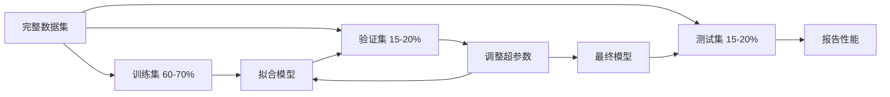

# 模型评估

> 模型的好坏取决于你测量它的方式。

**类型：** 构建
**语言：** Python
**先决条件：** 阶段 1（概率与分布、机器学习中的统计学），阶段 2 第 01-08 课
**时间：** ~90 分钟

## 学习目标

- 从头实现 K 折和分层 K 折交叉验证，并解释为什么分层对不平衡数据很重要
- 从头计算精确率、召回率、F1、AUC-ROC 以及回归指标（MSE、RMSE、MAE、R-squared）
- 解释学习曲线以诊断模型是否患有高偏差或高方差
- 识别常见的评估错误，包括数据泄漏、错误度量选择和测试集污染

## 问题

你训练了一个模型。它在你的数据上获得了 95% 的准确率。它好吗？

也许。也许不。如果 95% 的数据属于一个类，一个总是预测该类的模型获得 95% 的准确率，但完全无用。如果你在用训练数据评估，那 95% 的数字毫无意义，因为模型只是记住了答案。如果你的数据集有时间成分且你在分割前随机打乱了，你的模型可能正在用未来数据预测过去。

模型评估是大多数 ML 项目出错的地方。错误的度量让坏模型看起来好。错误的分割让模型作弊。错误的比较让你选择更差的模型。正确进行评估不是可选的。它是区分在真实数据面前能工作和会失败的模型的根本差别。

## 概念

### 训练集、验证集、测试集



三种划分，三种目的：

- **训练集**：模型从这个数据中学习。它在训练期间看到这些样本。
- **验证集**：用于调整超参数和在模型之间选择。模型从未在此数据上训练，但你的决定受其影响。
- **测试集**：恰好接触一次，在最后，报告最终性能。如果你查看测试性能然后回去修改模型，它就不再是测试集了。它已经变成了第二个验证集。

测试集是你的保留保证，证明报告的性能反映了模型在完全未见数据上的表现。

### K 折交叉验证

对于小数据集，单一训练/验证划分浪费数据并给出嘈杂估计。K 折交叉验证使用所有数据进行训练和验证两者：

```mermaid
flowchart TB
    subgraph Fold1["第 1 折"]
        direction LR
        V1["验证"] --- T1a["训练"] --- T1b["训练"] --- T1c["训练"] --- T1d["训练"]
    end
    subgraph Fold2["第 2 折"]
        direction LR
        T2a["训练"] --- V2["验证"] --- T2b["训练"] --- T2c["训练"] --- T2d["训练"]
    end
    subgraph Fold3["第 3 折"]
        direction LR
        T3a["训练"] --- T3b["训练"] --- V3["验证"] --- T3c["训练"] --- T3d["训练"]
    end
    subgraph Fold4["第 4 折"]
        direction LR
        T4a["训练"] --- T4b["训练"] --- T4c["训练"] --- V4["验证"] --- T4d["训练"]
    end
    subgraph Fold5["第 5 折"]
        direction LR
        T5a["训练"] --- T5b["训练"] --- T5c["训练"] --- T5d["训练"] --- V5["验证"]
    end
    Fold1 --> R["平均分数"]
    Fold2 --> R
    Fold3 --> R
    Fold4 --> R
    Fold5 --> R
```



1. 将数据分成 K 个相等大小的折
2. 对每折，在 K-1 折上训练并在剩余那折上验证
3. 平均 K 个验证分数

K=5 或 K=10 是标准选择。每个数据点恰好被用作验证一次。平均分数比任何单一划分的更稳定。

**分层 K 折**：在每折中保持类分布。如果你的数据集是 70% 类 A 和 30% 类 B，每折将有大致相同的比例。这对不平衡数据集很重要，其中随机划分可能将所有少数类样本放在一折中。

### 分类指标

**混淆矩阵**：基础。对于二分类：

|  | 预测为正向 | 预测为负向 |
|--|---|---|
| 实际为正向 | 真阳性 (TP) | 假阴性 (FN) |
| 实际为负向 | 假阳性 (FP) | 真阴性 (TN) |

由此矩阵，所有其他指标推导出来：

- **准确率** = (TP + TN) / (TP + TN + FP + FN)。正确预测的比例。当类别不平衡时具有误导性。
- **精确率** = TP / (TP + FP)。预测为正向的东西中，有多少实际是正向的？当假阳性代价高时使用（例如，垃圾邮件过滤器将真实邮件标记为垃圾邮件）。
- **召回率**（灵敏度）= TP / (TP + FN)。所有实际正向样本中，我们捕获了多少？当假阴性代价高时使用（例如，癌症筛查遗漏肿瘤）。
- **F1 分数** = 2 * 精确率 * 召回率 / (精确率 + 召回率)。精确率和召回率的调和平均。在两者都没有明显优势时平衡两者。
- **AUC-ROC**：接收者操作特征曲线下面积。绘制不同分类阈值下的真阳性率 vs 假阳性率。AUC = 0.5 意味着随机猜测，AUC = 1.0 意味着完美分离。与阈值无关：它衡量模型在正向样本上排序高于负向样本的能力，无论你选择什么截断点。

### 回归指标

- **MSE**（均方误差）= mean((y_true - y_pred)^2)。二次惩罚大误差。对异常值敏感。
- **RMSE**（均方根误差）= sqrt(MSE)。与目标变量相同单位。比 MSE 更易解释。
- **MAE**（平均绝对误差）= mean(|y_true - y_pred|)。线性处理所有误差。比 MSE 对异常值更鲁棒。
- **R-squared** = 1 - SS_res / SS_tot，其中 SS_res = sum((y_true - y_pred)^2) 且 SS_tot = sum((y_true - y_mean)^2)。模型解释的方差比例。R^2 = 1.0 是完美的。R^2 = 0.0 意味着模型不比总是预测均值更好。如果模型比均值更差，R^2 可以为负。

### 学习曲线

将训练和验证分数作为训练集大小的函数绘制：

- **高偏差（欠拟合）**：两条曲线收敛到一个低分数。添加更多数据不会帮助。你需要一个更复杂的模型。
- **高方差（过拟合）**：训练分数高但验证分数低得多。它们之间的差距很大。添加更多数据应该会帮助。

### 验证曲线

将训练和验证分数作为超参数的函数绘制：

- 在低复杂度：两个分数都低（欠拟合）
- 在正确复杂度：两个分数都高且接近
- 在高复杂度：训练分数保持高但验证分数下降（过拟合）

最优超参数值是验证分数达到峰值的地方。

### 常见评估错误

**数据泄漏**：来自测试集的信息泄漏进入训练。例子：在分割前在整个数据集上拟合缩放器，在时间序列预测中包含未来数据，使用从目标导出的特征。始终先分割，再预处理。

**类别不平衡**：99% 的交易是合法的，1% 是欺诈。一个总是预测"合法"的模型获得 99% 准确率。改用精确率、召回率、F1 或 AUC-ROC。

**错误度量**：在应该优化召回率时优化准确率（医疗诊断），或在数据有严重异常值时优化 RMSE（改用 MAE）。

**不使用分层分割**：对于不平衡数据，随机分割可能在验证折中放入很少的少数类样本，给出不稳定估计。

**测试太频繁**：每次你查看测试性能并调整，你都过拟合了测试集。测试集是一次性的。

```figure
precision-recall-threshold
```

## 构建它

### 步骤 1：训练/验证/测试划分

```python
import random
import math


def train_val_test_split(X, y, train_ratio=0.6, val_ratio=0.2, seed=42):
    random.seed(seed)
    n = len(X)
    indices = list(range(n))
    random.shuffle(indices)

    train_end = int(n * train_ratio)
    val_end = int(n * (train_ratio + val_ratio))

    train_idx = indices[:train_end]
    val_idx = indices[train_end:val_end]
    test_idx = indices[val_end:]

    X_train = [X[i] for i in train_idx]
    y_train = [y[i] for i in train_idx]
    X_val = [X[i] for i in val_idx]
    y_val = [y[i] for i in val_idx]
    X_test = [X[i] for i in test_idx]
    y_test = [y[i] for i in test_idx]

    return X_train, y_train, X_val, y_val, X_test, y_test
```

### 步骤 2：K 折和分层 K 折交叉验证

```python
def kfold_split(n, k=5, seed=42):
    random.seed(seed)
    indices = list(range(n))
    random.shuffle(indices)

    fold_size = n // k
    folds = []

    for i in range(k):
        start = i * fold_size
        end = start + fold_size if i < k - 1 else n
        val_idx = indices[start:end]
        train_idx = indices[:start] + indices[end:]
        folds.append((train_idx, val_idx))

    return folds
```

### 步骤 3：混淆矩阵和分类指标

```python
def confusion_matrix(y_true, y_pred):
    tp = sum(1 for t, p in zip(y_true, y_pred) if t == 1 and p == 1)
    tn = sum(1 for t, p in zip(y_true, y_pred) if t == 0 and p == 0)
    fp = sum(1 for t, p in zip(y_true, y_pred) if t == 0 and p == 1)
    fn = sum(1 for t, p in zip(y_true, y_pred) if t == 1 and p == 0)
    return {"TP": tp, "TN": tn, "FP": fp, "FN": fn}

def accuracy(y_true, y_pred):
    return sum(1 for t, p in zip(y_true, y_pred) if t == p) / len(y_true)

def precision(y_true, y_pred):
    tp = sum(1 for t, p in zip(y_true, y_pred) if t == 1 and p == 1)
    fp = sum(1 for t, p in zip(y_true, y_pred) if t == 0 and p == 1)
    return tp / (tp + fp) if (tp + fp) > 0 else 0

def recall(y_true, y_pred):
    tp = sum(1 for t, p in zip(y_true, y_pred) if t == 1 and p == 1)
    fn = sum(1 for t, p in zip(y_true, y_pred) if t == 1 and p == 0)
    return tp / (tp + fn) if (tp + fn) > 0 else 0

def f1_score(y_true, y_pred):
    p = precision(y_true, y_pred)
    r = recall(y_true, y_pred)
    return 2 * p * r / (p + r) if (p + r) > 0 else 0
```

### 步骤 4：回归指标

```python
def mse(y_true, y_pred):
    return sum((t - p) ** 2 for t, p in zip(y_true, y_pred)) / len(y_true)

def rmse(y_true, y_pred):
    return math.sqrt(mse(y_true, y_pred))

def mae(y_true, y_pred):
    return sum(abs(t - p) for t, p in zip(y_true, y_pred)) / len(y_true)

def r_squared(y_true, y_pred):
    y_mean = sum(y_true) / len(y_true)
    ss_res = sum((t - p) ** 2 for t, p in zip(y_true, y_pred))
    ss_tot = sum((t - y_mean) ** 2 for t in y_true)
    return 1 - (ss_res / ss_tot) if ss_tot > 0 else 0
```

## 使用它

使用 scikit-learn：

```python
from sklearn.model_selection import train_test_split, cross_val_score, StratifiedKFold
from sklearn.metrics import accuracy_score, precision_score, recall_score, f1_score
from sklearn.metrics import roc_auc_score, confusion_matrix, classification_report
```

## 练习

1. 为二分类问题从头编写一个函数 `roc_curve` 和 `auc_roc`。对 100 个阈值，计算真阳性率和假阳性率。使用梯形法则计算 AUC。
2. 创建一个 90% 负类 10% 正类的不平衡数据集。训练一个简单的分类器。比较准确率 vs 精确率、召回率和 F1。解释为什么准确率具有误导性。
3. 生成一个带噪声的正弦数据集。拟合 1、3、10 次多项式。绘制学习曲线。对于每个模型，诊断是否存在高偏差或高方差。
4. 手动实现 5 折交叉验证。与 sklearn 的 `cross_val_score` 比较结果。确保你得到相同的分数。

## 关键术语

| 术语 | 实际含义 |
|------|----------------------|
| 交叉验证 | 重复划分数据为训练/验证折并对分数取平均的过程 |
| 分层 | 在每个折中保持类分布。对不平衡数据集至关重要 |
| 混淆矩阵 | TP、TN、FP、FN 计数的表格。所有分类指标由此推导 |
| AUC-ROC | 接收者操作特征曲线下面积。阈值无关的排名度量 |
| 学习曲线 | 训练和验证误差 vs 训练集大小的图 |
| 验证曲线 | 训练和验证误差 vs 超参数值的图 |
| 数据泄漏 | 测试集信息被模型训练过程使用的污染 |
