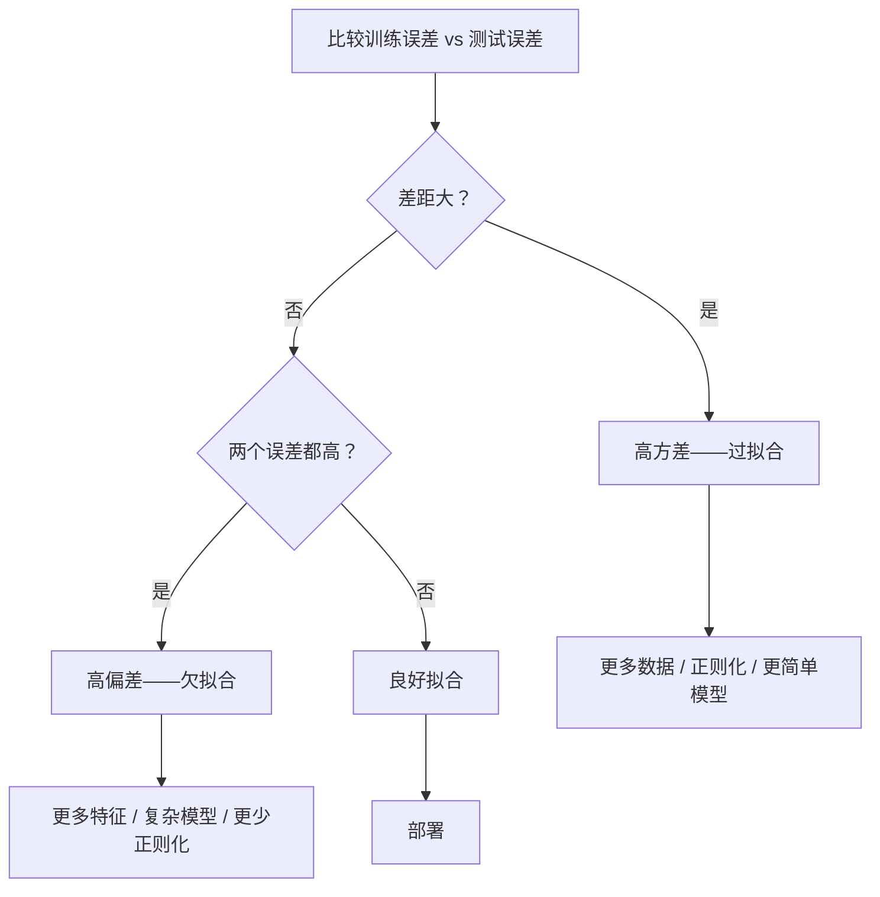

# 偏差-方差权衡

> 每个模型误差来自三个来源之一：偏差、方差或噪声。你只能控制前两个。

**类型：** 学习
**语言：** Python
**先决条件：** 阶段 2，第 01-09 课（ML 基础、回归、分类、评估）
**时间：** ~75 分钟

## 学习目标

- 推导期望预测误差的偏差-方差分解，并解释不可约噪声的作用
- 使用训练和测试误差模式诊断模型是高偏差还是高方差
- 解释正则化技术（L1、L2、dropout、早停）如何用偏差换取方差
- 实现可视化随着模型复杂度增加偏差-方差权衡的实验

## 问题

你训练了一个模型。它在测试数据上有一些误差。那个误差来自哪里？

如果你的模型太简单（在曲线数据集上的线性回归），它会持续错过真实模式。那是偏差。如果你的模型太复杂（在 15 个数据点上的 20 次多项式），它会完美拟合训练数据但在新数据上给出截然不同的预测。那是方差。

对于固定的模型容量，你不能同时最小化两者。压低偏差，方差就升高。压低方差，偏差就升高。理解这个权衡是机器学习中最有用的诊断技能。它告诉你该让模型更复杂还是更简单，该获取更多数据还是设计更好的特征，该多正则化还是少正则化。

## 概念

### 偏差：系统性误差

偏差衡量你的模型平均预测与真实值的差距。如果你在从相同分布抽取的许多不同训练集上训练同一模型并对预测取平均，偏差是那个平均值与真实值之间的差距。

高偏差意味着模型太僵硬，无法捕获真实模式。拟合到抛物线的直线将始终错过曲线，无论你给它多少数据。这是欠拟合。

```
高偏差（欠拟合）：
  模型总是预测大致相同的错误东西。
  训练误差：高
  测试误差：高
  它们之间的差距：小
```

### 方差：对训练数据的敏感度

方差衡量当你在数据的不同子集上训练时预测变化多少。如果训练集中的微小变化导致模型大变，方差就高。

高方差意味着模型拟合了训练数据中的噪声，而不是潜在信号。一个 20 次多项式将穿过每个训练点但在它们之间疯狂振荡。这是过拟合。

```
高方差（过拟合）：
  模型完美拟合训练数据但在新数据上失败。
  训练误差：低
  测试误差：高
  它们之间的差距：大
```

### 分解

对于任何点 x，平方损失下的期望预测误差精确分解为：

```
期望误差 = 偏差^2 + 方差 + 不可约噪声

其中：
  偏差^2   = (E[f_hat(x)] - f(x))^2
  方差 = E[(f_hat(x) - E[f_hat(x)])^2]
  噪声    = E[(y - f(x))^2]             (sigma^2)
```

- `f(x)` 是真实函数
- `f_hat(x)` 是模型的预测
- `E[...]` 是对不同训练集的期望
- `y` 是观察到的标签（真实函数加噪声）

噪声项是不可约的。没有模型可以在含噪数据上做得比 sigma^2 更好。你的工作是找到偏差^2 和方差之间的正确平衡。

### 模型复杂度 vs 误差


经典的 U 形曲线：

| 复杂度 | 偏差 | 方差 | 总误差 |
|-----------|------|----------|-------------|
| 太低 | 高 | 低 | 高（欠拟合） |
| 刚好 | 中等 | 中等 | 最低 |
| 太高 | 低 | 高 | 高（过拟合） |

### 正则化作为偏差-方差控制

正则化故意增加偏差以减少方差。它约束模型使其无法追逐噪声。

- **L2（Ridge）：** 将所有权重向零收缩。保留所有特征但减少其影响。
- **L1（Lasso）：** 将某些权重推到恰好为零。执行特征选择。
- **Dropout：** 训练期间随机禁用神经元。强制冗余表示。
- **早停：** 在模型完全拟合训练数据之前停止训练。

正则化强度（lambda、dropout 率、epoch 数）直接控制你在偏差-方差曲线上的位置。更多正则化意味着更多偏差，更少方差。

### 双重下降：现代视角

经典理论说：在最佳点之后，更多复杂度总是有害的。但 2019 年以来的研究显示了意想不到的事情。如果你持续增加模型容量远超插值阈值（模型有足够参数完美拟合训练数据的地方），测试误差可能再次下降。


这种"双重下降"现象解释了为什么大规模过参数化的神经网络（参数远多于训练样本）仍然泛化良好。经典的偏差-方差权衡不是错的，但对现代体制来说是不完整的。

关于双重下降的关键观察：
- 它在线性模型、决策树和神经网络中都会发生
- 更多数据在插值区域实际上可能有害（样本级别的双重下降）
- 更多训练 epoch 也会导致它（epoch 级别的双重下降）
- 正则化平滑了峰值但不会消除它

为什么发生？在插值阈值处，模型刚好有足够容量拟合所有训练点。它被迫进入一个非常特定的解，穿过每个点，数据中的小扰动导致拟合中的大变化。这就是方差达到峰值的地方。超过阈值，模型有许多可能的解完美拟合数据。学习算法（例如，具有隐式正则化的梯度下降）倾向于选择其中最简单的。这种偏向简单解的隐式偏向是过参数化模型泛化的原因。

| 体制 | 参数 vs 样本 | 行为 |
|--------|----------------------|----------|
| 欠参数化 | p << n | 经典权衡适用 |
| 插值阈值 | p ~ n | 方差峰值，测试误差飙升 |
| 过参数化 | p >> n | 隐式正则化启动，测试误差下降 |

对于实际目的：如果你使用神经网络或大型树集成，不要在插值阈值处停止。要么停留在远低于它的地方（带显式正则化），要么远超过它。最糟糕的地方正好在阈值处。

### 诊断你的模型



| 症状 | 诊断 | 修复 |
|---------|-----------|-----|
| 高训练误差，高测试误差 | 偏差 | 更多特征，复杂模型，更少正则化 |
| 低训练误差，高测试误差 | 方差 | 更多数据，正则化，更简单模型，dropout |
| 低训练误差，低测试误差 | 良好拟合 | 发布它 |
| 训练误差下降，测试误差上升 | 过拟合进行中 | 早停 |

### 实用策略

**当偏差是问题时：**
- 添加多项式或交互特征
- 使用更灵活的模型（树集成而不是线性）
- 减少正则化强度
- 训练更久（如果尚未收敛）

**当方差是问题时：**
- 获取更多训练数据
- 使用 bagging（随机森林）
- 增加正则化（更高 lambda，更多 dropout）
- 特征选择（移除噪声特征）
- 使用交叉验证尽早检测

### 集成方法与方差减少

集成方法是应对方差最实用的工具。

**Bagging（自助聚合）** 在训练数据的不同自助样本上训练多个模型，然后平均它们的预测。每个单独的模型具有高方差，但平均值具有低得多的方差。随机森林是对决策树应用 bagging。

为什么数学上有效：如果你对 N 个独立预测取平均，每个方差为 sigma^2，平均值的方差是 sigma^2 / N。模型并非真正独立的（它们都看到相似数据），所以减少小于 1/N，但仍然显著。

**Boosting** 通过顺序构建模型来减少偏差，每个新模型关注集成到目前为止的错误。梯度提升和 AdaBoost 是主要例子。Boosting 如果添加太多模型会过拟合，因此你需要早停或正则化。

| 方法 | 主要效果 | 偏差变化 | 方差变化 |
|--------|---------------|-------------|-----------------|
| Bagging | 减少方差 | 无变化 | 减少 |
| Boosting | 减少偏差 | 减少 | 可能增加 |
| Stacking | 减少两者 | 取决于元学习器 | 取决于基模型 |
| Dropout | 隐式 bagging | 轻微增加 | 减少 |

**实用规则：** 如果你的基模型具有高方差（深树、高度多项式），使用 bagging。如果你的基模型具有高偏差（浅桩、简单线性模型），使用 boosting。

### 学习曲线

学习曲线将训练和验证误差作为训练集大小的函数绘制。它们是你拥有的最实用的诊断工具。与单次训练/测试比较不同，学习曲线向你展示模型的轨迹并告诉你更多数据是否会帮助。

```figure
bias-variance-learning-curves
```

## 构建它

### 步骤 1：从已知函数生成合成数据

```python
def true_function(x):
    return np.sin(2 * np.pi * x)


def generate_data(n_samples=30, noise_std=0.3, seed=42):
    rng = np.random.RandomState(seed)
    X = rng.uniform(0, 1, n_samples)
    y = true_function(X) + rng.randn(n_samples) * noise_std
    return X, y, true_function
```

### 步骤 2：自助采样和多项式拟合

```python
def fit_polynomial(X, y, degree):
    coeffs = np.polyfit(X, y, degree)
    return lambda x: np.polyval(coeffs, x)
```

### 步骤 3：计算偏差^2、方差分解

多次对数据进行自助采样，拟合多项式，并计算偏差^2、方差和总误差。

### 步骤 4：学习曲线

```python
def demo_learning_curves():
    for degree in [1, 5, 15]:
        train_sizes = list(range(5, n_samples, 2))
        for size in train_sizes:
            # train on subset, evaluate on validation
            ...
```

## 使用它

使用 sklearn 验证曲线和学习曲线：

```python
from sklearn.model_selection import validation_curve, learning_curve
```

## 练习

1. 实现任意回归模型的偏差-方差分解。在不同训练集上训练 100 次并计算偏差^2、方差。绘制它们如何随模型复杂度变化。
2. 使用多项式回归在相同数据上生成学习曲线（度=1、度=5、度=20）。使用诊断流程图诊断每个模型。
3. 使用不同强度参数的 Ridge 回归实验。绘制偏差^2、方差和总误差如何随 lambda 变化。识别最优 lambda 并解释为什么它在总误差方面是最优的。
4. 在小型合成数据集上重现双重下降。使用线性回归和多项式特征。绘制测试误差 vs 多项式的度数。观察插值阈值处的误差峰值和随后的下降。

## 关键术语

| 术语 | 实际含义 |
|------|----------------------|
| 偏差 | 模型平均预测与真实值之间的系统性误差。高偏差 = 欠拟合 |
| 方差 | 模型对训练集中小变化的敏感度。高方差 = 过拟合 |
| 不可约噪声 | 数据中固有的随机性，任何模型都无法消除 |
| 偏差-方差权衡 | 随着模型复杂度增加，偏差减少但方差增加 |
| 双重下降 | 超过插值阈值后测试误差再次下降的现代现象 |
| 学习曲线 | 误差 vs 训练集大小的图。诊断你是否需要更多数据 |
| Bagging | 在自助样本上训练多个模型并对预测取平均 |
| Boosting | 顺序构建模型，每个模型纠正前一个模型的错误 |
| 正则化 | 对模型复杂度施加约束以减少方差 |
