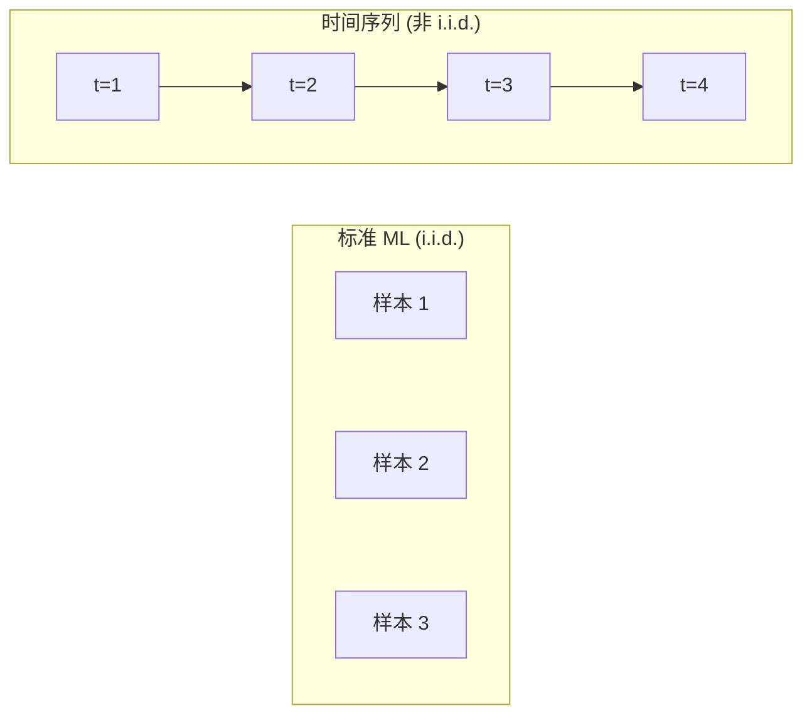

# 时间序列基础

> 过去的表现确实能预测未来的结果——如果你先检查平稳性的话。

**类型：** 构建
**语言：** Python
**先决条件：** 阶段 2，第 01-09 课
**时间：** ~90 分钟

## 学习目标

- 将时间序列分解为趋势、季节性和残差分量，并检验平稳性
- 实现滞后特征和滚动统计，将时间序列转换为监督学习问题
- 构建防止未来数据泄漏到训练的逐前验证框架
- 解释为什么随机训练/测试分割对时间序列无效，并展示与适当时间分割相比的性能差距

## 问题

你有按时间排序的数据。每日销售额，每小时温度，每分钟 CPU 使用率，每周股价。你想预测下一个值，下周，下个季度。

你伸手拿标准 ML 工具包：随机训练/测试分割，交叉验证，特征矩阵输入，预测输出。每一步都是错的。

时间序列打破了标准 ML 所依赖的假设。样本不是独立的——今天的温度取决于昨天的。随机分割会将未来信息泄漏到过去。在回测中看起来很棒的特征在生产中会失败，因为它们依赖随时间变化的模式。

使用随机交叉验证获得 95% 准确率的模型可能在适当的基于时间的评估中获得 55%。差异不是技术细节。它是在纸上工作和在生产中工作的模型之间的区别。

## 概念

### 什么使时间序列不同

标准 ML 假设独立同分布（i.i.d.）。时间序列违反两者：
- **不独立。** 今天的股价取决于昨天的。
- **不同分布。** 分布随时间变化。



在标准 ML 中，样本是可互换的。打乱它们不会改变任何东西。在时间序列中，顺序就是一切。打乱会破坏信号。

### 时间序列的分量

每个时间序列是以下各项的组合：
- **趋势**：长期方向。收入每年增长 10%。
- **季节性**：固定间隔的重复模式。节假日零售销售激增。
- **残差**：去除趋势和季节性后剩下的。如果残差看起来像白噪声，分解就捕获了信号。

### 平稳性

如果时间序列的统计性质（均值、方差、自相关）不随时间变化，它就是平稳的。大多数预测方法假设平稳性。

**如何固定：** 差分。不是建模原始值，而是建模连续值之间的变化：

```
diff[t] = value[t] - value[t-1]
```

例子：
原始序列：[100, 102, 106, 112, 120]
一阶差分：[2, 4, 6, 8]
二阶差分：[2, 2, 2]（常数——平稳）

### 自相关

自相关衡量时间 t 的值与时间 t-k（k 步之前）的值之间的相关程度。自相关函数（ACF）绘制每个滞后 k 的这种相关。

ACF 告诉你：
- 序列记得多远的过去
- 季节性是否存在（ACF 在 k=12 处的峰值意味着年度季节性）
- 创建多少滞后特征

### 滞后特征：将时间序列变为监督学习

取序列 [10, 12, 14, 13, 15] 并创建 lag-1 和 lag-2 特征：

| lag_2 | lag_1 | target |
|-------|-------|--------|
| 10    | 12    | 14     |
| 12    | 14    | 13     |
| 14    | 13    | 15     |

现在你有了一个标准回归问题。

附加特征：
- **滚动统计**：过去 k 个值的均值、标准差、最小值、最大值
- **日历特征**：星期几、月份、是否假日
- **差分值**：与前一步的变化
- **比率特征**：当前值 / 滚动均值

### 逐前验证

这是本课最重要的概念。标准 k 折交叉验证随机将样本分配到训练和测试。对于时间序列，这会泄漏未来信息。

逐前验证按时间顺序前进，始终使用过去预测未来：
1. 在时间 t 之前的数据上训练
2. 在时间 t+1 上测试
3. 将时间 t+1 添加到训练集
4. 对时间 t+2 重复

这模拟了模型在真实世界中的使用方式。没有未来数据泄漏进入训练。

## 构建它

实现时间序列分解、平稳性检验、滞后特征创建和逐前验证。代码见 `code/time_series.py`。

## 使用它

```python
from statsmodels.tsa.seasonal import seasonal_decompose
result = seasonal_decompose(series, model='additive', period=12)
```

## 练习

1. 将 5 年每月销售时间序列分解为趋势、季节性和残差。验证残差是平稳的。
2. 创建滞后特征并用随机森林预测下一个值。将随机分割的性能与逐前验证进行比较。
3. 实现多步预测：使用历史预测未来 12 步。

## 关键术语

| 术语 | 实际含义 |
|------|----------------------|
| 平稳性 | 统计性质（均值、方差）不随时间变化 |
| 趋势 | 序列中的长期方向 |
| 季节性 | 固定间隔的重复模式 |
| 差分 | 对连续值之间变化建模以实现平稳性 |
| 自相关 | 序列与其过去值的相关 |
| 滞后特征 | 用作模型输入的过去值 |
| 逐前验证 | 始终使用过去数据预测未来的基于时间的交叉验证 |
