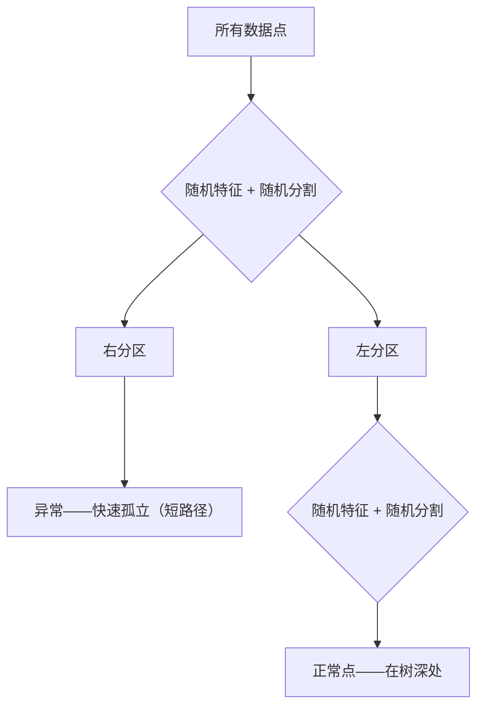

# 异常检测

> 正常容易定义。异常就是任何不符合的。

**类型：** 构建
**语言：** Python
**先决条件：** 阶段 2，第 01-09 课
**时间：** ~75 分钟

## 学习目标

- 从头实现 Z-score、IQR 和隔离森林异常检测方法
- 区分点异常、上下文异常和集体异常，并为每种选择适当的检测方法
- 解释为什么异常检测被框定为建模正常数据而不是分类异常
- 比较无监督异常检测与监督分类，并评估新颖异常覆盖与精确率之间的权衡

## 问题

一张信用卡在纽约下午 2 点使用，然后在东京下午 2:05 使用。一个工厂传感器读数 150 度，而正常范围是 80-120。一台服务器每秒发送 50,000 个请求，而日均值是 200。

这些是异常。找到它们很重要。欺诈造成数十亿美元损失。设备故障造成停机。网络入侵造成数据损失。

挑战：你很少有标签的异常样本。欺诈占交易的 0.1%。设备故障每年发生几次。你不能训练标准分类器，因为"异常"类中几乎没有东西可学。即使你有某些标签，你见过的异常不是你将要遇到的仅有类型。明天的欺诈方案与今天的不同。

异常检测翻转了问题。不是学习什么是异常的，而是学习什么是正常的。任何偏离正常的东西都是可疑的。

## 概念

### 异常类型

- **点异常。** 无论上下文都异常的单个数据点。温度读数 500 度。
- **上下文异常。** 给定上下文时异常的数据点。90 度在夏天正常，在冬天异常。
- **集体异常。** 作为一个组异常的数据点序列。五次登录失败是正常的。连续五十次是暴力攻击。

### 无监督框架

1. **完全无监督。** 根本没有标签。
2. **半监督。** 你有一个仅含正常数据的干净数据集。
3. **弱监督。** 你有少量带标签的异常。用于评估，不用于训练。

关键洞察：异常检测与分类有根本不同。你建模的是正常数据的分布，而不是两个类之间的决策边界。

### Z-Score 方法

```
z_score = (x - mean) / std
如果 |z_score| > 阈值，则为异常
```

默认阈值为 3.0。简单、快速、可解释。假设数据是正态分布的。

### IQR 方法

```
Q1 = 第 25 百分位
Q3 = 第 75 百分位
IQR = Q3 - Q1
下界 = Q1 - 因子 * IQR
上界 = Q3 + 因子 * IQR
```

默认因子为 1.5。对异常值鲁棒，在偏斜分布上有效，无正态性假设。

### 隔离森林

关键洞察：异常少且不同。在数据的随机划分中，异常更容易被隔离——它们需要更少的随机分割就能与其余部分分离。



1. 构建许多随机树（隔离森林）
2. 在每个节点，选择一个随机特征和特征最小值和最大值之间的随机分割值
3. 持续分割直到每个点被孤立（在自己的叶中）
4. 异常在所有树中具有更短的平均路径长度

正常点生活在密集区域。许多随机分割才能使一个从邻居中孤立出来。异常生活在稀疏区域。一两个随机分割就足以孤立它们。

## 构建它

实现 Z-score、IQR 和隔离森林。代码见 `code/anomaly_detection.py`。

## 使用它

```python
from sklearn.ensemble import IsolationForest
from sklearn.covariance import EllipticEnvelope
```

## 练习

1. 生成正态数据并添加 5% 的异常值。使用 Z-score、IQR 和隔离森林检测它们。比较精确率和召回率。
2. 隔离森林如何随污染参数（预期异常比例）的变化而表现？
3. 在一个特征对中生成一个点正常的二维异常数据集（例如，x1 和 x2 各自正常但一起异常）。展示单变量方法失败而隔离森林成功。

## 关键术语

| 术语 | 实际含义 |
|------|----------------------|
| 点异常 | 异常单个数据点 |
| 上下文异常 | 异常仅在特定上下文中 |
| 集体异常 | 异常序列而不是单个点 |
| Z-score | 距离均值的标准差数 |
| IQR | 基于四分位的离群检测 |
| 隔离森林 | 基于树的算法，通过路径长度发现异常 |
