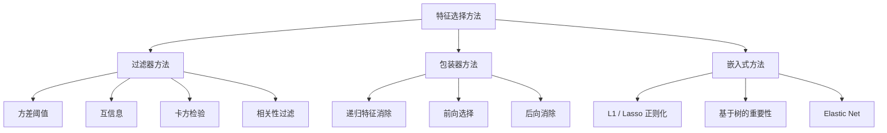

# 特征选择

> 更多特征并不更好。正确的特征才更好。

**类型：** 构建
**语言：** Python
**先决条件：** 阶段 2，第 01-09、第 08 课（特征工程）
**时间：** ~75 分钟

## 学习目标

- 从头实现过滤器方法（方差阈值、互信息、卡方）和包装器方法（RFE、前向选择）
- 解释为什么互信息捕获了相关性错过的非线性特征-目标关系
- 比较 L1 正则化（嵌入式选择）与 RFE（包装器选择）并评估其计算权衡
- 构建结合多种方法的特征选择管道，并在保留数据上展示改进的泛化

## 问题

你有 500 个特征。你的模型训练缓慢，持续过拟合，没有人能解释它学到了什么。你添加更多特征希望提高性能，但情况变得更糟。

这是维度诅咒的实际作用。随着特征数量的增长，特征空间的体积爆炸。数据点变得稀疏。点之间的距离收敛。模型需要指数级更多的数据才能找到真实模式。噪声特征淹没了信号特征。过拟合成为默认。

特征选择是解药。剥离噪声。移除冗余。保留携带目标实际信息的特征。结果：更快的训练，更好的泛化，以及你实际可以解释的模型。

## 概念

### 特征选择的三个类别



**过滤器方法**使用统计度量独立评分每个特征。快速，但会错过特征交互。

**包装器方法**训练模型来评估特征子集。更好的结果但昂贵。

**嵌入式方法**作为模型训练的一部分选择特征。选择在拟合期间发生，而不是作为单独步骤。

### 方差阈值

最简单的过滤器。如果特征跨样本几乎没有变化，它几乎不携带信息。移除它。

在 1000 个样本中有 999 个为 0.0 的特征，其方差接近零。没有模型可以使用它来区分类。删除方差低于阈值（例如 0.01）的每个特征。

### 互信息

互信息衡量知道特征 X 的值能多大地减少关于目标 Y 的不确定性。

```
I(X; Y) = sum_x sum_y p(x, y) * log(p(x, y) / (p(x) * p(y)))
```

相比相关性的关键优势：互信息捕获非线性关系。特征可能对目标具有零相关性但高互信息，因为关系是二次的或周期的。

对于连续特征，首先离散到箱中（基于直方图的估计）。箱数影响估计——太少箱丢失信息，太多箱添加噪声。


### 递归特征消除（RFE）

RFE 是包装器方法。它使用模型自己的特征重要性迭代剪枝：
1. 使用所有特征训练模型
2. 按重要性排序特征
3. 移除最不重要的特征
4. 重复直到剩余期望数量的特征

RFE 考虑特征交互，因为模型同时看到所有剩余特征。移除一个特征会改变其他特征的重要性。

成本：你训练模型 N - target 次。对于昂贵的模型，这很慢。

### L1（Lasso）正则化

```
损失 = 预测误差 + alpha * sum(|w_i|)
```

alpha 参数控制特征被剪枝的激进程度。更高的 alpha 意味着更多权重变为恰好为零。

为什么恰好为零？L1 惩罚在权重空间中创建菱形约束区域。最优解倾向于落在该菱形的角落，那里一个或多个权重为零。

优点：单次训练运行，处理相关特征，内建于大多数线性模型实现中。

局限：仅适用于线性模型。不能捕获非线性特征重要性。

### 基于树的重要性

决策树及其集成自然地排序特征。每个分割减少不纯度。产生更大不纯度减少的特征更重要。

对于有 T 棵树的随机森林：
```
重要性(特征_j) = (1/T) * 对所有树求和
    对所有在特征_j 上分割的节点求和 (n_samples * 不纯度减少)
```

## 构建它

实现方差阈值、互信息、RFE 和 L1 正则化。代码见 `code/feature_selection.py`。

## 使用它

```python
from sklearn.feature_selection import VarianceThreshold, mutual_info_classif
from sklearn.feature_selection import RFE, SelectFromModel
from sklearn.linear_model import Lasso
```

## 练习

1. 在创建了 500 个特征（50 个信息性的，450 个随机噪声）的数据集上比较方差阈值、互信息和 RFE。每种方法保留多少噪声特征？
2. 使用 RFE 和 L1 正则化。当有高度相关的特征时，方法是否一致？
3. 绘制模型准确率 vs 特征数量的图。添加超过某一点何时会降低性能？

## 关键术语

| 术语 | 实际含义 |
|------|----------------------|
| 过滤器方法 | 独立评分特征而不使用模型 |
| 包装器方法 | 使用模型性能评估特征子集 |
| 嵌入式方法 | 在模型训练期间选择特征 |
| 互信息 | 捕获非线性关系的特征-目标依赖度量 |
| RFE | 通过模型重要性迭代移除最不重要的特征 |
| L1 正则化 | 将权重推向零的损失惩罚，执行嵌入式选择 |
| 维度诅咒 | 随着维度增长数据点变得稀疏的现象 |
