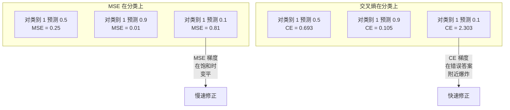
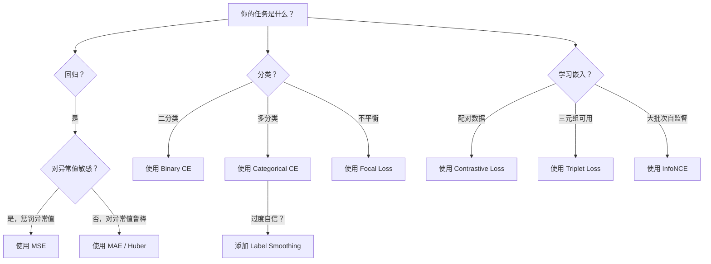
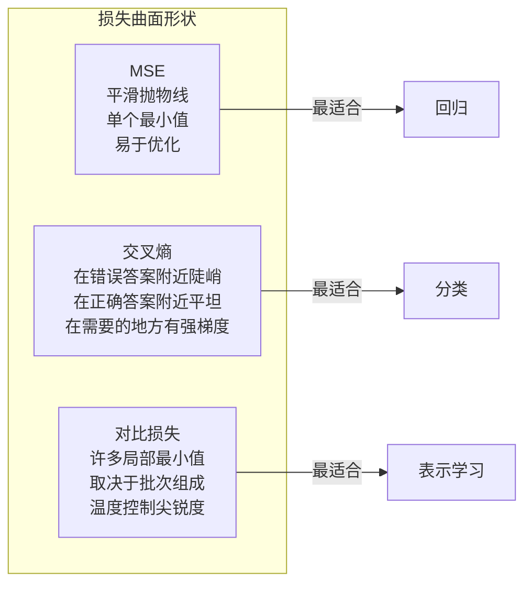

# 损失函数

> 你的网络做出了一个预测。真实标签说不是这样。它错得有多离谱？这个数值就是损失。选错损失函数，你的模型就会全然为错误的东西优化。

**类型：** 构建
**语言：** Python
**前置条件：** 第 03.04 课（激活函数）
**时间：** 约 75 分钟

## 学习目标

- 从零开始实现 MSE、二元交叉熵、分类交叉熵和对比损失（InfoNCE）及其梯度
- 通过演示"对所有输入都预测 0.5"的失败模式，解释为什么 MSE 在分类中失败
- 将标签平滑应用于交叉熵，并描述它如何防止过度自信的预测
- 为回归、二分类、多分类和嵌入学习任务选择正确的损失函数

## 问题

一个在分类问题上最小化 MSE 的模型将自信地对所有输入预测 0.5。它在最小化损失。但它也是无用的。

损失函数是你的模型实际优化的唯一事物。不是准确率。不是 F1 分数。不是你在报告中给经理看的任何指标。优化器取损失函数的梯度并调整权重以使该数字变小。如果损失函数不能捕获你关心的事物，模型会找到满足它的数学上最廉价的方法，而那种方法几乎从来不是你想要的。

这里有一个具体的例子。你有一个二分类任务。两个类别，50/50 分割。你使用 MSE 作为损失。模型对每一个输入都预测 0.5。平均 MSE 是 0.25，这是在不实际学习任何东西的情况下可能的最小值。模型有零判别能力，但它已经在技术上最小化了你的损失函数。切换到交叉熵，同样的模型被迫将预测推向 0 或 1，因为 -log(0.5) = 0.693 是一个糟糕的损失，而 -log(0.99) = 0.01 奖励自信的正确预测。损失函数的选择是一个学习的模型和一个博弈指标的模型之间的区别。

更糟的是。在自监督学习中，你甚至没有标签。对比损失完全定义了学习信号：什么算作相似，什么算作不同，以及模型应该将它们推多远。对比损失搞错，你的嵌入坍缩到一个点——每个输入映射到相同的向量。技术上损失为零。完全无用。

## 概念

### 均方误差（MSE）

回归的默认选择。计算预测和目标之间的平方差，在所有样本上取平均。

```
MSE = (1/n) * sum((y_pred - y_true)^2)
```

为什么平方很重要：它以二次方的方式惩罚大误差。误差 2 的代价是误差 1 的 4 倍。误差 10 的代价是 100 倍。这使得 MSE 对异常值敏感——一个极其错误的预测会主导损失。

实际例子：如果你的模型预测房价，在大多数房子上差 $10,000，但在一个豪宅上差 $200,000，MSE 会激进地尝试修复那个豪宅，可能损害其他 99 个房子的性能。

MSE 对预测的梯度是：

```
dMSE/dy_pred = (2/n) * (y_pred - y_true)
```

随误差线性变化。更大的误差得到更大的梯度。这对回归是特性（大误差需要大修正），对分类是缺陷（你想要指数级地惩罚自信的错误答案，而不是线性地）。

### 交叉熵损失

分类的损失函数。植根于信息论——它衡量预测的概率分布与真实分布之间的差异。

**二元交叉熵（BCE）：**

```
BCE = -(y * log(p) + (1 - y) * log(1 - p))
```

其中 y 是真实标签（0 或 1），p 是预测概率。

为什么 -log(p) 有效：当真实标签为 1 且你预测 p = 0.99，损失为 -log(0.99) = 0.01。当你预测 p = 0.01，损失为 -log(0.01) = 4.6。这 460 倍的差异就是交叉熵有效的原因。它残酷地惩罚自信的错误预测，同时几乎不惩罚自信的正确预测。

梯度讲述相同的故事：

```
dBCE/dp = -(y/p) + (1-y)/(1-p)
```

当 y = 1 且 p 接近零时，梯度为 -1/p，趋近负无穷。模型得到一个巨大的信号来修复它的错误。当 p 接近 1 时，梯度很小。已经是正确的，没什么要修复的。

**分类交叉熵：**

用于具有 one-hot 编码目标的多类别分类。

```
CCE = -sum(y_i * log(p_i))
```

只有真实类别对损失有贡献（因为所有其他 y_i 为零）。如果有 10 个类别且正确类别得到概率 0.1（随机猜测），损失为 -log(0.1) = 2.3。如果正确类别得到概率 0.9，损失为 -log(0.9) = 0.105。模型学会将概率质量集中在正确答案上。

### 为什么 MSE 在分类中失败



MSE 梯度在预测接近 0 或 1 时变平（由于 sigmoid 饱和）。交叉熵梯度补偿了这一点——-log 抵消了 sigmoid 的平坦区域，在最需要的地方给出强梯度。

### 标签平滑

标准的 one-hot 标签说"这 100% 是类别 3 且 0% 是其他类别"。这是一个很强的声明。标签平滑使其软化：

```
smooth_label = (1 - alpha) * one_hot + alpha / num_classes
```

使用 alpha = 0.1 和 10 个类别：目标变为 [0.01, 0.01, 0.91, 0.01, ...] 而不是 [0, 0, 1, 0, ...]。模型目标为 0.91 而不是 1.0。

为什么这有效：一个试图通过 softmax 输出恰好 1.0 的模型需要将 logits 推向无穷大。这导致过度自信，损害泛化能力，并使模型对分布偏移脆弱。标签平滑将目标限制在 0.9（alpha=0.1 时），将 logits 保持在合理范围内。GPT 和大多数现代模型使用标签平滑或其等效方法。

### 对比损失

没有标签。没有类别。只有输入对和问题：这些是相似还是不同？

**SimCLR 风格对比损失（NT-Xent / InfoNCE）：**

取一张图像。创建它的两个增强视图（裁剪、旋转、颜色抖动）。这些是"正对"——它们应该有相似的嵌入。批次中的每张其他图像形成"负对"——它们应该有不同的嵌入。

```
L = -log(exp(sim(z_i, z_j) / tau) / sum(exp(sim(z_i, z_k) / tau)))
```

其中 sim() 是余弦相似度，z_i 和 z_j 是正对，求和是对所有负样本，tau（温度）控制分布的尖锐程度。更低的温度 = 更难的负样本 = 更激进的分离。

实际数字：批次大小 256 意味着每个正对有 255 个负样本。温度 tau = 0.07（SimCLR 默认值）。损失看起来像对相似度的 softmax——它希望正对的相似度在所有 256 个选项中是最高的。

**三元组损失：**

取三个输入：锚点、正样本（同一类）、负样本（不同类）。

```
L = max(0, d(anchor, positive) - d(anchor, negative) + margin)
```

边界（通常 0.2-1.0）强制正样本和负样本距离之间的最小差距。如果负样本已经足够远，损失为零——没有梯度，没有更新。这使训练高效，但需要仔细的三元组挖掘（选择接近锚点的困难负样本）。

### Focal Loss

用于不平衡数据集。标准交叉熵平等对待所有正确分类的样本。Focal loss 降低简单样本的权重：

```
FL = -alpha * (1 - p_t)^gamma * log(p_t)
```

其中 p_t 是真实类别的预测概率，gamma 控制聚焦程度。当 gamma = 0 时，这是标准交叉熵。当 gamma = 2（默认值）时：

- 简单样本（p_t = 0.9）：权重 = (0.1)^2 = 0.01。被有效忽略。
- 困难样本（p_t = 0.1）：权重 = (0.9)^2 = 0.81。完整的梯度信号。

Focal loss 由 Lin 等为物体检测引入，其中 99% 的候选区域是背景（简单负样本）。没有 focal loss，模型淹没在简单背景样本中，永远学不会检测物体。有了它，模型将其容量集中在重要的困难、模糊的情况上。

### 损失函数决策树



### 损失曲面



```figure
cross-entropy-loss
```

## 构建它

### 步骤 1：MSE 及其梯度

```python
def mse(predictions, targets):
    n = len(predictions)
    total = 0.0
    for p, t in zip(predictions, targets):
        total += (p - t) ** 2
    return total / n

def mse_gradient(predictions, targets):
    n = len(predictions)
    grads = []
    for p, t in zip(predictions, targets):
        grads.append(2.0 * (p - t) / n)
    return grads
```

### 步骤 2：二元交叉熵

log(0) 问题是真实的。如果模型对正例预测恰好为 0，log(0) = 负无穷。裁剪防止了这一点。

```python
import math

def binary_cross_entropy(predictions, targets, eps=1e-15):
    n = len(predictions)
    total = 0.0
    for p, t in zip(predictions, targets):
        p_clipped = max(eps, min(1 - eps, p))
        total += -(t * math.log(p_clipped) + (1 - t) * math.log(1 - p_clipped))
    return total / n

def bce_gradient(predictions, targets, eps=1e-15):
    grads = []
    for p, t in zip(predictions, targets):
        p_clipped = max(eps, min(1 - eps, p))
        grads.append(-(t / p_clipped) + (1 - t) / (1 - p_clipped))
    return grads
```

### 步骤 3：带 Softmax 的分类交叉熵

Softmax 将原始 logits 转换为概率。然后我们计算与 one-hot 目标的交叉熵。

```python
def softmax(logits):
    max_val = max(logits)
    exps = [math.exp(x - max_val) for x in logits]
    total = sum(exps)
    return [e / total for e in exps]

def categorical_cross_entropy(logits, target_index, eps=1e-15):
    probs = softmax(logits)
    p = max(eps, probs[target_index])
    return -math.log(p)

def cce_gradient(logits, target_index):
    probs = softmax(logits)
    grads = list(probs)
    grads[target_index] -= 1.0
    return grads
```

softmax + 交叉熵的梯度优美地简化：对于真实类别，它只是（预测概率 - 1），对于所有其他类别，是（预测概率）。这种优雅的简化不是巧合——它就是 softmax 和交叉熵配对的原因。

### 步骤 4：标签平滑

```python
def label_smoothed_cce(logits, target_index, num_classes, alpha=0.1, eps=1e-15):
    probs = softmax(logits)
    loss = 0.0
    for i in range(num_classes):
        if i == target_index:
            smooth_target = 1.0 - alpha + alpha / num_classes
        else:
            smooth_target = alpha / num_classes
        p = max(eps, probs[i])
        loss += -smooth_target * math.log(p)
    return loss
```

### 步骤 5：对比损失（简化版 InfoNCE）

```python
def cosine_similarity(a, b):
    dot = sum(x * y for x, y in zip(a, b))
    norm_a = math.sqrt(sum(x * x for x in a))
    norm_b = math.sqrt(sum(x * x for x in b))
    if norm_a < 1e-10 or norm_b < 1e-10:
        return 0.0
    return dot / (norm_a * norm_b)

def contrastive_loss(anchor, positive, negatives, temperature=0.07):
    sim_pos = cosine_similarity(anchor, positive) / temperature
    sim_negs = [cosine_similarity(anchor, neg) / temperature for neg in negatives]

    max_sim = max(sim_pos, max(sim_negs)) if sim_negs else sim_pos
    exp_pos = math.exp(sim_pos - max_sim)
    exp_negs = [math.exp(s - max_sim) for s in sim_negs]
    total_exp = exp_pos + sum(exp_negs)

    return -math.log(max(1e-15, exp_pos / total_exp))
```

### 步骤 6：MSE vs 交叉熵在分类上的比较

使用两种损失函数在第 04 课的同一网络（圆形数据集）上训练。观察交叉熵收敛更快。

```python
import random

def sigmoid(x):
    x = max(-500, min(500, x))
    return 1.0 / (1.0 + math.exp(-x))

def make_circle_data(n=200, seed=42):
    random.seed(seed)
    data = []
    for _ in range(n):
        x = random.uniform(-2, 2)
        y = random.uniform(-2, 2)
        label = 1.0 if x * x + y * y < 1.5 else 0.0
        data.append(([x, y], label))
    return data


class LossComparisonNetwork:
    def __init__(self, loss_type="bce", hidden_size=8, lr=0.1):
        random.seed(0)
        self.loss_type = loss_type
        self.lr = lr
        self.hidden_size = hidden_size

        self.w1 = [[random.gauss(0, 0.5) for _ in range(2)] for _ in range(hidden_size)]
        self.b1 = [0.0] * hidden_size
        self.w2 = [random.gauss(0, 0.5) for _ in range(hidden_size)]
        self.b2 = 0.0

    def forward(self, x):
        self.x = x
        self.z1 = []
        self.h = []
        for i in range(self.hidden_size):
            z = self.w1[i][0] * x[0] + self.w1[i][1] * x[1] + self.b1[i]
            self.z1.append(z)
            self.h.append(max(0.0, z))

        self.z2 = sum(self.w2[i] * self.h[i] for i in range(self.hidden_size)) + self.b2
        self.out = sigmoid(self.z2)
        return self.out

    def backward(self, target):
        if self.loss_type == "mse":
            d_loss = 2.0 * (self.out - target)
        else:
            eps = 1e-15
            p = max(eps, min(1 - eps, self.out))
            d_loss = -(target / p) + (1 - target) / (1 - p)

        d_sigmoid = self.out * (1 - self.out)
        d_out = d_loss * d_sigmoid

        for i in range(self.hidden_size):
            d_relu = 1.0 if self.z1[i] > 0 else 0.0
            d_h = d_out * self.w2[i] * d_relu
            self.w2[i] -= self.lr * d_out * self.h[i]
            for j in range(2):
                self.w1[i][j] -= self.lr * d_h * self.x[j]
            self.b1[i] -= self.lr * d_h
        self.b2 -= self.lr * d_out

    def compute_loss(self, pred, target):
        if self.loss_type == "mse":
            return (pred - target) ** 2
        else:
            eps = 1e-15
            p = max(eps, min(1 - eps, pred))
            return -(target * math.log(p) + (1 - target) * math.log(1 - p))

    def train(self, data, epochs=200):
        losses = []
        for epoch in range(epochs):
            total_loss = 0.0
            correct = 0
            for x, y in data:
                pred = self.forward(x)
                self.backward(y)
                total_loss += self.compute_loss(pred, y)
                if (pred >= 0.5) == (y >= 0.5):
                    correct += 1
            avg_loss = total_loss / len(data)
            accuracy = correct / len(data) * 100
            losses.append((avg_loss, accuracy))
            if epoch % 50 == 0 or epoch == epochs - 1:
                print(f"    第 {epoch:3d} 轮: loss={avg_loss:.4f}, 准确率={accuracy:.1f}%")
        return losses
```

## 使用它

PyTorch 提供所有具有内置数值稳定性的标准损失函数：

```python
import torch
import torch.nn as nn
import torch.nn.functional as F

predictions = torch.tensor([0.9, 0.1, 0.7], requires_grad=True)
targets = torch.tensor([1.0, 0.0, 1.0])

mse_loss = F.mse_loss(predictions, targets)
bce_loss = F.binary_cross_entropy(predictions, targets)

logits = torch.randn(4, 10)
labels = torch.tensor([3, 7, 1, 9])
ce_loss = F.cross_entropy(logits, labels)
ce_smooth = F.cross_entropy(logits, labels, label_smoothing=0.1)
```

使用 `F.cross_entropy`（而不是 `F.nll_loss` 加上手动 softmax）。它将 log-softmax 和负对数似然结合在一个数值稳定的操作中。单独应用 softmax 然后取 log 更不稳定——你在大指数相减中会损失精度。

对于对比学习，大多数团队使用自定义实现或库如 `lightly` 或 `pytorch-metric-learning`。核心循环总是一样的：计算成对相似度，创建正负样本上的 softmax，反向传播。

## 交付物

本课产出：
- `outputs/prompt-loss-function-selector.md`——一个用于选择正确损失函数的可复用提示词
- `outputs/prompt-loss-debugger.md`——一个当你的损失曲线看起来不对时的诊断提示词

## 练习

1. 实现 Huber loss（平滑 L1 损失），对小误差使用 MSE，对大误差使用 MAE。在预测 y = sin(x) 的训练目标中有 5% 添加了随机噪声（异常值）的情况下，使用 MSE vs Huber 训练回归网络。比较最终测试误差。

2. 在二分类训练循环中添加 focal loss。创建一个不平衡数据集（90% 类别 0，10% 类别 1）。比较标准 BCE vs focal loss（gamma=2）在 200 轮后对少数类的召回率。

3. 实现带有半困难负样本挖掘的三元组损失。为 5 个类别生成 2D 嵌入数据。对于每个锚点，找到仍然比正样本远的困难负样本（半困难）。与随机三元组选择比较收敛性。

4. 运行 MSE vs 交叉熵比较，但在训练期间跟踪每层的梯度幅度。绘制每个 epoch 的平均梯度范数。验证当模型最不确定时，交叉熵在早期 epoch 产生更大的梯度。

5. 实现 KL 散度损失，并验证当真实分布是 one-hot 时最小化 KL(true || predicted) 给出与交叉熵相同的梯度。然后尝试软目标（如知识蒸馏），其中"真实"分布来自教师模型的 softmax 输出。

## 关键术语

| 术语 | 人们的说法 | 实际含义 |
|------|-----------|----------|
| 损失函数 | "模型错得有多离谱" | 一个将预测和目标映射到标量的可微函数，优化器最小化它 |
| MSE | "平均平方误差" | 预测和目标之间平方差的均值；二次方惩罚大误差 |
| 交叉熵 | "分类损失" | 使用 -log(p) 衡量预测概率分布与真实分布之间的差异 |
| 二元交叉熵 | "BCE" | 两个类别的交叉熵：-(y*log(p) + (1-y)*log(1-p)) |
| 标签平滑 | "软化目标" | 将硬的 0/1 目标替换为软值（例如 0.1/0.9），防止过度自信并提高泛化能力 |
| 对比损失 | "拉近，推开" | 一种通过学习使相似对在嵌入空间中接近、不相似对远离的表示学习的损失 |
| InfoNCE | "CLIP/SimCLR 损失" | 对相似度分数进行的归一化温度缩放交叉熵；将对比学习视为分类任务 |
| Focal Loss | "不平衡数据修复" | 以 (1-p_t)^gamma 加权的交叉熵，降低简单样本的权重，聚焦于困难样本 |
| 三元组损失 | "锚点-正样本-负样本" | 推动锚点比负样本更靠近正样本至少一个边距的损失 |
| 温度 | "尖锐度旋钮" | logits/相似度上的标量除数，控制结果分布的集中程度；更低的温度 = 更尖锐 |

## 延伸阅读

- Lin et al., "Focal Loss for Dense Object Detection" (2017) -- 引入 focal loss 处理目标检测中极端类别不平衡的论文（RetinaNet）
- Chen et al., "A Simple Framework for Contrastive Learning of Visual Representations" (SimCLR, 2020) -- 定义了现代对比学习管道与 NT-Xent 损失的论文
- Szegedy et al., "Rethinking the Inception Architecture" (2016) -- 引入标签平滑作为正则化技术的论文，现已成为大多数大型模型的标准
- Hinton et al., "Distilling the Knowledge in a Neural Network" (2015) -- 使用软目标和 KL 散度进行知识蒸馏，是模型压缩的基础性工作
