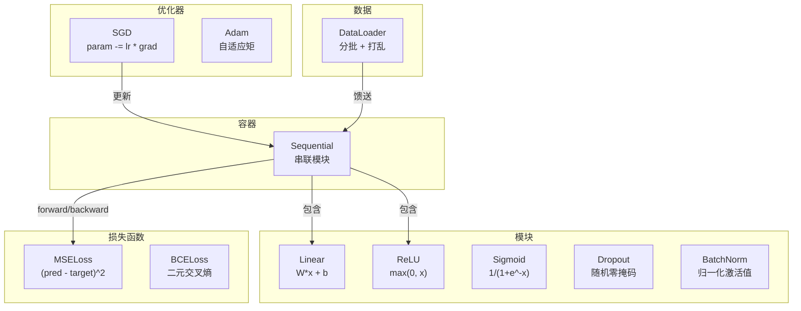
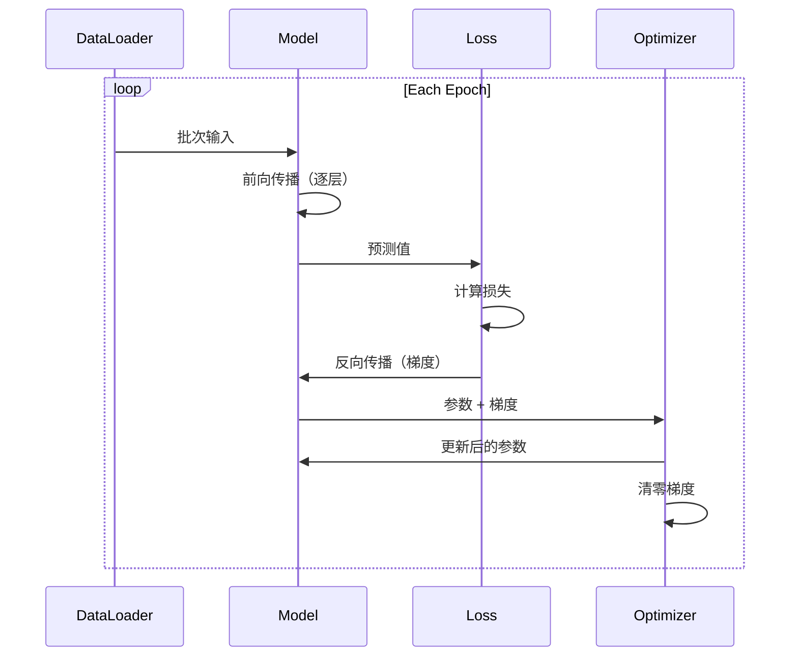
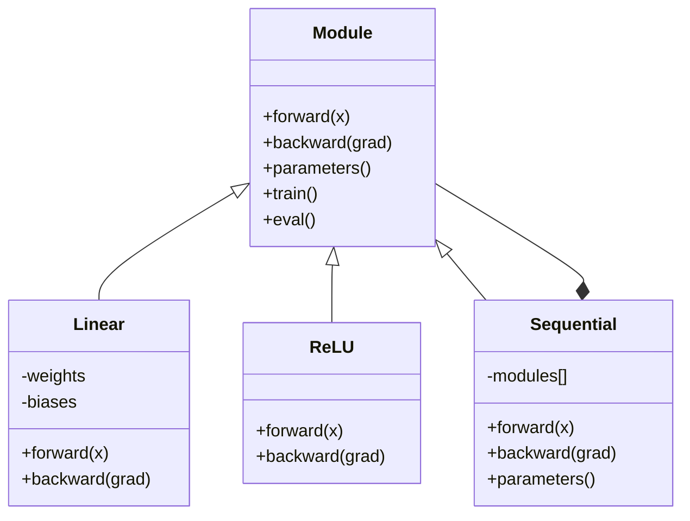

# 构建你自己的 Mini 框架

> 你已经构建了神经元、层、网络、反向传播、激活函数、损失函数、优化器、正则化、初始化和 LR 调度。全部是独立的片段。现在将它们串联成一个框架。不是 PyTorch。不是 TensorFlow。是你自己的。

**类型：** 构建
**语言：** Python
**前置条件：** 第 03 阶段全部（第 01-09 课）
**时间：** 约 120 分钟

## 学习目标

- 构建一个完整的深度学习框架（约 500 行），包含 Module、Linear、ReLU、Sigmoid、Dropout、BatchNorm、Sequential、损失函数、优化器和 DataLoader
- 解释 Module 抽象（forward、backward、parameters）以及为什么 train/eval 模式切换是必要的
- 将所有组件串联成一个在圆形分类上训练 4 层网络的工作训练循环
- 将你的框架的每个组件映射到其 PyTorch 等价物（nn.Module、nn.Sequential、optim.Adam、DataLoader）

## 问题

你有十课散布在独立文件中的构建块。这里一个 `Value` 类，那里一个训练循环，权重初始化在另一个文件中，学习率调度又在另一个文件中。要训练一个网络，你从五个不同的课中复制粘贴，然后手动串联它们。

这就是框架所解决的问题。PyTorch 给你 `nn.Module`、`nn.Sequential`、`optim.Adam`、`DataLoader`，以及一个将它们联系在一起的训练循环模式。TensorFlow 给你 `keras.Layer`、`keras.Sequential`、`keras.optimizers.Adam`。这些不是魔法。它们是组织模式，使得定义、训练和评估网络成为可能，而无需每次都重新发明管道。

你将用大约 500 行 Python 构建同样的东西。不用 numpy。没有外部依赖。一个可以定义任何前馈网络、用 SGD 或 Adam 训练、分批数据、应用 dropout 和批量归一化、使用任何激活函数、并调度学习率的框架。

当你完成后，你将准确理解在 PyTorch 中写下 `model = nn.Sequential(...)` 时发生了什么。你将理解为什么 `model.train()` 和 `model.eval()` 存在。你将理解为什么 `optimizer.zero_grad()` 是一个独立的调用。你将理解所有这一切，因为你构建了所有这一切。

## 概念

### Module 抽象

PyTorch 中的每个层都继承自 `nn.Module`。一个 Module 有三个职责：

1. **forward()** -- 给定输入计算输出
2. **parameters()** -- 返回所有可训练的权重
3. **backward()** -- 计算梯度（PyTorch 中由 autograd 处理，我们的框架中是显式的）

一个 Linear 层是一个 Module。一个 ReLU 激活是一个 Module。一个 dropout 层是一个 Module。一个批量归一化层是一个 Module。它们全部拥有相同的接口。

### Sequential 容器

`nn.Sequential` 串联 Module。前向传播：数据经过 Module 1，然后 Module 2，然后 Module 3。反向传播：反向这个链。容器本身是一个 Module——它有 forward()、parameters() 和 backward()。这是组合模式：一个 Module 序列本身就是一个 Module。

### 训练模式 vs 评估模式

Dropout 在训练期间随机归零神经元，但在评估期间让所有内容通过。批量归一化在训练期间使用批次统计，但在评估期间使用运行平均值。`train()` 和 `eval()` 方法切换这种行为。每个 Module 都有一个 `training` 标志。

### 优化器

优化器使用梯度更新参数。SGD: `param -= lr * grad`。Adam: 维护动量和方差估计，然后更新。优化器不知道网络架构——它只看到一个扁平化的参数列表及其梯度。

### DataLoader

分批有两个原因。第一，对于大型问题，你无法将整个数据集放入内存。第二，mini-batch 梯度下降提供有助于逃离局部最小值的噪声。DataLoader 将数据分成批次，并可选择在 epoch 之间打乱。

### 框架架构



### 训练循环



### Module 层次结构



```figure
gradient-clipping
```

## 构建它

### 步骤 1：Module 基类

每个层都要实现的抽象接口。

```python
class Module:
    def __init__(self):
        self.training = True

    def forward(self, x):
        raise NotImplementedError

    def backward(self, grad):
        raise NotImplementedError

    def parameters(self):
        return []

    def train(self):
        self.training = True

    def eval(self):
        self.training = False
```

### 步骤 2：Linear 层

基本构建块。存储权重和偏置，前向计算 Wx + b，反向计算权重/输入梯度。

```python
import math
import random


class Linear(Module):
    def __init__(self, fan_in, fan_out):
        super().__init__()
        std = math.sqrt(2.0 / fan_in)
        self.weights = [[random.gauss(0, std) for _ in range(fan_in)] for _ in range(fan_out)]
        self.biases = [0.0] * fan_out
        self.weight_grads = [[0.0] * fan_in for _ in range(fan_out)]
        self.bias_grads = [0.0] * fan_out
        self.fan_in = fan_in
        self.fan_out = fan_out
        self.input = None
```

*(后续构建步骤中的代码实现 ReLU、Sigmoid、Tanh、Dropout、BatchNorm、Sequential 容器、MSELoss、BCELoss、SGD 和 Adam 优化器以及 DataLoader——完整的约 500 行实现，详见 `code/main.py`)*

## 使用它

以下是你刚刚构建的内容的 PyTorch 等价物：

```python
import torch
import torch.nn as nn
from torch.utils.data import DataLoader, TensorDataset

model = nn.Sequential(
    nn.Linear(2, 16),
    nn.ReLU(),
    nn.Linear(16, 16),
    nn.ReLU(),
    nn.Linear(16, 8),
    nn.ReLU(),
    nn.Linear(8, 1),
    nn.Sigmoid(),
)

criterion = nn.BCELoss()
optimizer = torch.optim.Adam(model.parameters(), lr=0.01)

for epoch in range(100):
    model.train()
    for inputs, targets in dataloader:
        optimizer.zero_grad()
        predictions = model(inputs)
        loss = criterion(predictions, targets)
        loss.backward()
        optimizer.step()

    model.eval()
    with torch.no_grad():
        test_predictions = model(test_inputs)
```

结构是相同的。`Sequential`、`Linear`、`ReLU`、`Sigmoid`、`BCELoss`、`Adam`、`zero_grad`、`backward`、`step`、`train`、`eval`。每个概念一一映射。区别在于 PyTorch 自动处理 autograd（无需在每个模块中实现 backward()），在 GPU 上运行，并且经过了多年的优化。但骨架是相同的。

现在当你看到 PyTorch 代码时，你确切地知道每一行在发生什么。这种理解就是全部意义。

## 交付物

本课产出：
- `outputs/prompt-framework-architect.md`——一个用于使用框架抽象设计神经网络架构的提示词

## 练习

1. 添加一个 `SoftmaxCrossEntropyLoss` 类用于多类别分类。对预测值应用 softmax，计算交叉熵损失，并处理组合的反向传播。在 3 类螺旋数据集上测试。

2. 在优化器中实现学习率调度：添加一个 `set_lr()` 方法并接入第 09 课的余弦调度。使用预热 + 余弦训练圆形分类器，并与恒定 LR 比较。

3. 在 Sequential 中添加 `save()` 和 `load()` 方法，将所有权重序列化到 JSON 文件并加载回来。验证加载的模型产生与原始模型相同的预测。

4. 在 Adam 优化器中实现权重衰减（L2 正则化）。添加一个 `weight_decay` 参数，每一步将权重向零收缩。比较 decay=0 vs decay=0.01 的训练。

5. 将逐样本训练循环替换为适当的 mini-batch 梯度累积：跨批次中所有样本累积梯度，然后除以批次大小并执行一次优化器步。测量这是否改变收敛速度。

## 关键术语

| 术语 | 人们的说法 | 实际含义 |
|------|-----------|----------|
| Module | "一个层" | 框架中的基础抽象——任何具有 forward()、backward() 和 parameters() 的东西 |
| Sequential | "按顺序堆叠层" | 一个串联模块的容器，按顺序应用它们进行前向传播，反向进行反向传播 |
| 前向传播 | "运行网络" | 通过按顺序将输入传入每个模块来计算输出 |
| 反向传播 | "计算梯度" | 反向通过每个模块传播损失梯度以计算参数梯度 |
| 参数 | "可训练的权重" | 网络中优化器可以更新的所有值——权重和偏置 |
| 优化器 | "更新权重的东西" | 一个使用梯度更新参数的算法，实现 SGD、Adam 或其他规则 |
| DataLoader | "馈送数据的东西" | 一个将数据集分割为批次的迭代器，可选择在 epoch 之间打乱 |
| 训练模式 | "model.train()" | 一个启用随机行为（如 dropout 和使用批次统计的批量归一化）的标志 |
| 评估模式 | "model.eval()" | 一个禁用 dropout 并对批量归一化使用运行统计的标志 |
| Zero grad | "清除梯度" | 在计算下一个批次的梯度之前，将所有参数梯度重置为零 |

## 延伸阅读

- Paszke et al., "PyTorch: An Imperative Style, High-Performance Deep Learning Library" (2019) -- 描述 PyTorch 设计决策的论文
- Chollet, "Deep Learning with Python, Second Edition" (2021) -- 第 3 章用相同的模块/层抽象涵盖 Keras 内部
- Johnson, "Tiny-DNN" (https://github.com/tiny-dnn/tiny-dnn) -- 一个只有头文件的 C++ 深度学习框架，用于理解框架内部
