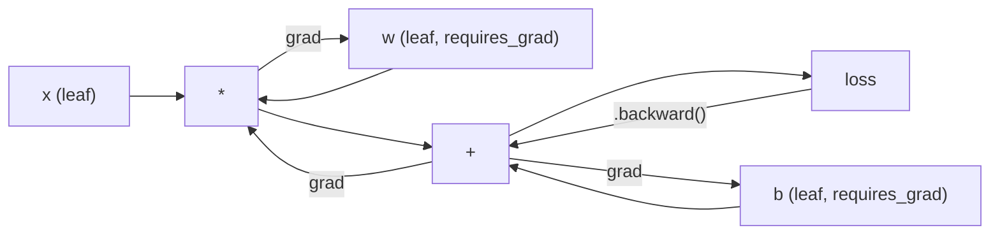
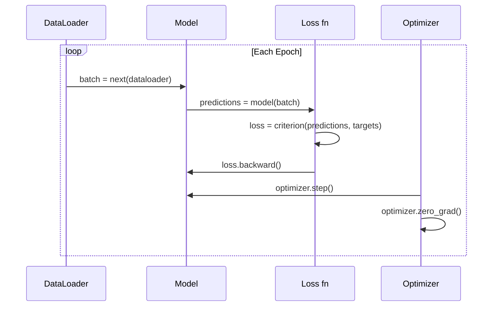

# PyTorch 入门

> 你用活塞和曲轴构建了引擎。现在学习大家真正开的那个。

**类型：** 构建
**语言：** Python
**前置条件：** 第 03.10 课（构建你自己的 Mini 框架）
**时间：** 约 75 分钟

## 学习目标

- 使用 PyTorch 的 nn.Module、nn.Sequential 和 autograd 构建和训练神经网络
- 使用 PyTorch 张量、GPU 加速和标准训练循环（zero_grad、forward、loss、backward、step）
- 将你从零构建的 mini 框架组件转换为其 PyTorch 等价物
- 在相同任务上分析和比较纯 Python 框架与 PyTorch 的训练速度

## 问题

你有一个可工作的 mini 框架。Linear 层、ReLU、dropout、batch norm、Adam、一个 DataLoader、一个训练循环。它在纯 Python 中在圆形分类问题上训练一个 4 层网络。

在相同问题上它也比 PyTorch 慢 500 倍。

你的 mini 框架使用嵌套的 Python 循环一次处理一个样本。PyTorch 将相同的操作分派到运行在 GPU 上的优化 C++/CUDA 内核。在单个 NVIDIA A100 上，PyTorch 在大约 6 小时内训练 ImageNet（128 万张图像）上的 ResNet-50（2560 万参数）。你的框架在相同任务上大约需要 3,000 小时——如果它没有先耗尽内存的话。

速度不是唯一的差距。你的框架没有 GPU 支持。没有自动微分——你为每个模块手写了 backward()。没有序列化。没有分布式训练。没有混合精度。没有不用 print 语句调试梯度流的方法。

PyTorch 填补了所有这些差距。而且它通过保持你已经构建的完全相同的心智模型来做到这一点：Module、forward()、parameters()、backward()、optimizer.step()。概念一一对应。语法几乎相同。区别在于 PyTorch 在你从零开始设计的相同接口背后包装了十年的系统工程。

## 概念

### 为什么 PyTorch 胜出

2015 年，TensorFlow 要求你在运行任何东西之前先定义一个静态计算图。你构建图，编译它，然后把数据喂给它。调试意味着盯着图的可视化。改变架构意味着从头重建图。

PyTorch 在 2017 年以不同的理念推出：即时执行。你写 Python。它立即运行。`y = model(x)` 实际上现在计算 y，而不是"向一个稍后计算 y 的图添加一个节点"。这意味着标准 Python 调试工具可以工作。print() 可以工作。pdb 可以工作。前向传播中的 if/else 可以工作。

到 2020 年，市场已经给出了答案。PyTorch 在 ML 研究论文中的份额从 7%（2017）增长到超过 75%（2022）。Meta、Google DeepMind、OpenAI、Anthropic 和 Hugging Face 全部使用 PyTorch 作为主要框架。TensorFlow 2.x 作为回应采用了即时执行——默认承认 PyTorch 的设计是正确的。

教训：开发者体验会复利。一个慢 10% 但调试快 50% 的框架每次都赢。

### 张量

一个张量是一个具有三个关键属性的多维数组：形状、数据类型和设备。

```python
import torch

x = torch.zeros(3, 4)           # shape: (3, 4), dtype: float32, device: cpu
x = torch.randn(2, 3, 224, 224) # 一批 2 张 RGB 图像, 224x224
x = torch.tensor([1, 2, 3])     # 从 Python 列表创建
```

**形状**是维度。标量是 shape ()，向量是 (n,)，矩阵是 (m, n)，一批图像是 (batch, channels, height, width)。

**Dtype** 控制精度和内存。

| dtype | 位 | 范围 | 用例 |
|-------|------|-------|----------|
| float32 | 32 | ~7 位小数 | 默认训练 |
| float16 | 16 | ~3.3 位小数 | 混合精度 |
| bfloat16 | 16 | 同 float32 的范围，更少精度 | LLM 训练 |
| int8 | 8 | -128 to 127 | 量化推理 |

**Device** 决定计算在哪里进行。

```python
device = torch.device("cuda" if torch.cuda.is_available() else "cpu")
x = torch.randn(3, 4, device=device)
x = x.to("cuda")
x = x.cpu()
```

每个操作要求所有张量在同一个设备上。这是初学者遇到的 #1 PyTorch 错误：`RuntimeError: Expected all tensors to be on the same device`。通过计算前将所有内容移到同一设备来修复它。

**重塑**是常数时间的——它改变元数据，而不是数据。

```python
x = torch.randn(2, 3, 4)
x.view(2, 12)      # reshape to (2, 12) -- must be contiguous
x.reshape(6, 4)    # reshape to (6, 4) -- works always
x.permute(2, 0, 1) # reorder dimensions
x.unsqueeze(0)     # add dimension: (1, 2, 3, 4)
x.squeeze()        # remove size-1 dimensions
```

### Autograd

你的 mini 框架要求你为每个模块实现 backward()。PyTorch 不需要。它将对张量的每个操作记录到一个有向无环图（计算图）中，然后反向遍历该图以自动计算梯度。



与你的框架的关键区别：PyTorch 使用基于磁带的自动微分。每个操作在前向传播期间追加到一个"磁带"上。调用 `.backward()` 反向重放磁带。

```python
x = torch.randn(3, requires_grad=True)
y = x ** 2 + 3 * x
z = y.sum()
z.backward()
print(x.grad)  # dz/dx = 2x + 3
```

Autograd 的三个规则：

1. 只有 `requires_grad=True` 的叶张量累积梯度
2. 梯度默认累积——在每次反向传播前调用 `optimizer.zero_grad()`
3. `torch.no_grad()` 禁用梯度追踪（评估期间使用）

### nn.Module

`nn.Module` 是 PyTorch 中每个神经网络组件的基类。你已经在第 10 课中构建了这个抽象。PyTorch 的版本增加了自动参数注册、递归模块发现、设备管理和状态字典序列化。

```python
import torch.nn as nn

class MLP(nn.Module):
    def __init__(self, input_dim, hidden_dim, output_dim):
        super().__init__()
        self.layer1 = nn.Linear(input_dim, hidden_dim)
        self.relu = nn.ReLU()
        self.layer2 = nn.Linear(hidden_dim, output_dim)

    def forward(self, x):
        x = self.layer1(x)
        x = self.relu(x)
        x = self.layer2(x)
        return x
```

当你在 `__init__` 中将 `nn.Module` 或 `nn.Parameter` 赋值为属性时，PyTorch 自动注册它。`model.parameters()` 递归地收集每个注册的参数。这就是为什么你永远不必像在 mini 框架中那样手动收集权重。

关键构建块：

| Module | 功能 | 参数 |
|--------|------|------|
| nn.Linear(in, out) | Wx + b | in*out + out |
| nn.Conv2d(in_ch, out_ch, k) | 2D 卷积 | in_ch*out_ch*k*k + out_ch |
| nn.BatchNorm1d(features) | 归一化激活值 | 2 * features |
| nn.Dropout(p) | 随机归零 | 0 |
| nn.ReLU() | max(0, x) | 0 |
| nn.GELU() | 高斯误差线性 | 0 |
| nn.Embedding(vocab, dim) | 查找表 | vocab * dim |
| nn.LayerNorm(dim) | 逐样本归一化 | 2 * dim |

### 损失函数和优化器

PyTorch 以生产就绪的形式提供你构建过的一切。

**损失函数** (来自 `torch.nn`)：

| 损失 | 任务 | 输入 |
|------|------|-------|
| nn.MSELoss() | 回归 | 任意形状 |
| nn.CrossEntropyLoss() | 多类分类 | Logits（不是 softmax）|
| nn.BCEWithLogitsLoss() | 二分类 | Logits（不是 sigmoid）|
| nn.L1Loss() | 回归（鲁棒）| 任意形状 |
| nn.CTCLoss() | 序列对齐 | 对数概率 |

注意：`CrossEntropyLoss` 内部结合了 `LogSoftmax` + `NLLLoss`。传入原始 logits，不是 softmax 输出。这是一个常见错误，会无声地产生错误的梯度。

**优化器** (来自 `torch.optim`)：

| 优化器 | 何时使用 | 典型 LR |
|-----------|-------------|-----------|
| SGD(params, lr, momentum) | CNNs，良好调优的管道 | 0.01--0.1 |
| Adam(params, lr) | 默认起点 | 1e-3 |
| AdamW(params, lr, weight_decay) | Transformers，微调 | 1e-4--1e-3 |
| LBFGS(params) | 小规模，二阶 | 1.0 |

### 训练循环

每个 PyTorch 训练循环遵循相同的 5 步模式。你已经从第 10 课中知道了。



规范模式：

```python
for epoch in range(num_epochs):
    model.train()
    for inputs, targets in train_loader:
        inputs, targets = inputs.to(device), targets.to(device)
        optimizer.zero_grad()
        outputs = model(inputs)
        loss = criterion(outputs, targets)
        loss.backward()
        optimizer.step()
```

批次循环中的五行代码。就是这五行代码训练了 GPT-4、Stable Diffusion 和 LLaMA。架构改变。数据改变。这五行代码不变。

### Dataset 和 DataLoader

PyTorch 的 `Dataset` 是一个具有两个方法的抽象类：`__len__` 和 `__getitem__`。`DataLoader` 用分批、打乱和多进程数据加载包装它。

```python
from torch.utils.data import Dataset, DataLoader

class MNISTDataset(Dataset):
    def __init__(self, images, labels):
        self.images = images
        self.labels = labels

    def __len__(self):
        return len(self.labels)

    def __getitem__(self, idx):
        return self.images[idx], self.labels[idx]

loader = DataLoader(dataset, batch_size=64, shuffle=True, num_workers=4)
```

`num_workers=4` 生成 4 个进程在 GPU 对当前批次训练时并行加载数据。在磁盘密集型工作负载（大图像、音频）上，仅此一项就可以将训练速度翻倍。

### GPU 训练

将模型移到 GPU：

```python
device = torch.device("cuda" if torch.cuda.is_available() else "cpu")
model = model.to(device)
```

这递归地将每个参数和缓冲区移到 GPU。然后在训练期间移动每个批次：

```python
inputs, targets = inputs.to(device), targets.to(device)
```

**混合精度**在现代 GPU（A100、H100、RTX 4090）上将内存使用减半并将吞吐量翻倍，方法是在 float16 中运行 forward/backward，同时将主权重保持在 float32：

```python
from torch.amp import autocast, GradScaler

scaler = GradScaler()
for inputs, targets in loader:
    with autocast(device_type="cuda"):
        outputs = model(inputs)
        loss = criterion(outputs, targets)
    scaler.scale(loss).backward()
    scaler.step(optimizer)
    scaler.update()
    optimizer.zero_grad()
```

### 比较：Mini Framework vs PyTorch vs JAX

| 特性 | Mini Framework (L10) | PyTorch | JAX |
|---------|---------------------|---------|-----|
| 自动微分 | 手动 backward() | 基于磁带的 autograd | 函数式变换 |
| 执行方式 | 即时（Python 循环）| 即时（C++ 内核）| 追踪 + JIT 编译 |
| GPU 支持 | 无 | 有 (CUDA, ROCm, MPS) | 有 (CUDA, TPU) |
| 速度 (MNIST MLP) | ~300s/epoch | ~0.5s/epoch | ~0.3s/epoch |
| 模块系统 | 自定义 Module 类 | nn.Module | 无状态函数 (Flax/Equinox) |
| 调试 | print() | print(), pdb, breakpoint() | 更难 (JIT 追踪会破坏 print) |
| 生态系统 | 无 | Hugging Face, Lightning, timm | Flax, Optax, Orbax |
| 学习曲线 | 你构建了它 | 中等 | 陡峭（函数式范式）|
| 生产使用 | 玩具问题 | Meta, OpenAI, Anthropic, HF | Google DeepMind, Midjourney |

```figure
dropout-mask
```

## 构建它

一个在 MNIST 上训练的 3 层 MLP，仅使用 PyTorch 原语。没有高级包装器。没有 `torchvision.datasets`。我们自己下载和解析原始数据。

（完整的 MNIST 训练实现，包含数据加载、模型定义、训练循环和评估——详见 `code/main.py`）

## 使用它

### 快速比较：Mini Framework vs PyTorch

| Mini Framework (第 10 课) | PyTorch |
|---------------------------|---------|
| `model = Sequential(Linear(784, 256), ReLU(), ...)` | `model = nn.Sequential(nn.Linear(784, 256), nn.ReLU(), ...)` |
| `pred = model.forward(x)` | `pred = model(x)` |
| `optimizer.zero_grad()` | `optimizer.zero_grad()` |
| `grad = criterion.backward()` then `model.backward(grad)` | `loss.backward()` |
| `optimizer.step()` | `optimizer.step()` |
| 无 GPU | `model.to("cuda")` |
| 每个模块手动 backward | Autograd 处理一切 |

接口几乎相同。区别在于底层的所有东西。

### 保存和加载模型

```python
torch.save(model.state_dict(), "model.pt")

model = MNISTModel()
model.load_state_dict(torch.load("model.pt", weights_only=True))
model.eval()
```

始终保存 `state_dict()`（参数字典），而不是模型对象。保存模型对象使用 pickle，当你重构代码时会损坏。状态字典是可移植的。

### 学习率调度

```python
scheduler = torch.optim.lr_scheduler.CosineAnnealingLR(
    optimizer, T_max=10
)
for epoch in range(10):
    train_one_epoch(model, train_loader, criterion, optimizer, device)
    scheduler.step()
```

PyTorch 内置 15+ 调度器：StepLR、ExponentialLR、CosineAnnealingLR、OneCycleLR、ReduceLROnPlateau。全部插入相同的优化器接口。

## 交付物

本课产出两个构件：
- `outputs/prompt-pytorch-debugger.md`——一个用于诊断常见 PyTorch 训练失败的提示词
- `outputs/skill-pytorch-patterns.md`——一个 PyTorch 训练模式的技能参考

## 练习

1. **添加批量归一化。** 在每个线性层之后（激活之前）插入 `nn.BatchNorm1d`。比较测试准确率和训练速度 vs 仅 dropout 的版本。Batch norm 应该在更少的 epoch 内达到 98%+。

2. **实现一个学习率查找器。** 使用指数增加的学习率（从 1e-7 到 1.0）训练一个 epoch。绘制损失 vs LR。最优 LR 恰好是在损失开始攀升之前。用它来为 MNIST 模型选择更好的 LR。

3. **移植到 GPU 并添加混合精度。** 在训练循环中添加 `torch.amp.autocast` 和 `GradScaler`。在 GPU 上测量有和没有混合精度的吞吐量（样本/秒）。在 A100 上，预期约 2 倍加速。

4. **构建自定义 Dataset。** 下载 Fashion-MNIST（与 MNIST 格式相同但是服装项目）。实现一个 `FashionMNISTDataset(Dataset)` 类，包含 `__getitem__` 和 `__len__`。训练相同的 MLP 并比较准确率。Fashion-MNIST 更难——预期约 88% vs ~98%。

5. **将 Adam 替换为 SGD + 动量。** 使用 `SGD(params, lr=0.01, momentum=0.9)` 训练。比较收敛曲线。然后添加 `CosineAnnealingLR` 调度器，看看 SGD 在 epoch 10 是否能赶上 Adam。

## 关键术语

| 术语 | 人们的说法 | 实际含义 |
|------|-----------|----------|
| Tensor | "一个多维数组" | 一个有类型、设备感知的数组，每个操作都内置自动微分支持 |
| Autograd | "自动反向传播" | 一个基于磁带的系统，在前向传播期间记录操作，然后反向重放以计算精确梯度 |
| nn.Module | "一个层" | 任何可微计算块的基类——注册参数、支持嵌套、处理 train/eval 模式 |
| state_dict | "模型权重" | 一个将参数名称映射到张量的 OrderedDict——训练好的模型的可移植、可序列化表示 |
| .backward() | "计算梯度" | 反向遍历计算图，为每个 requires_grad=True 的叶张量计算和累积梯度 |
| .to(device) | "移到 GPU" | 递归地将所有参数和缓冲区转移到指定设备（CPU、CUDA、MPS）|
| DataLoader | "数据管道" | 一个从 Dataset 分批、打乱并可选择并行加载数据的迭代器 |
| 混合精度 | "使用 float16" | 使用 float16 forward/backward 训练以提高速度，同时保持 float32 主权重以保证数值稳定性 |
| 即时执行 | "立即运行" | 操作在调用时立即执行，不推迟到稍后的编译步骤——使 PyTorch 区别于 TF 1.x 的核心设计选择 |
| zero_grad | "重置梯度" | 在下一次反向传播前将所有参数梯度设为零，因为 PyTorch 默认累积梯度 |

## 延伸阅读

- Paszke et al., "PyTorch: An Imperative Style, High-Performance Deep Learning Library" (2019) -- 解释 PyTorch 设计权衡的原始论文
- PyTorch Tutorials: "Learning PyTorch with Examples" (https://pytorch.org/tutorials/beginner/pytorch_with_examples.html) -- 从张量到 nn.Module 的官方路径
- PyTorch Performance Tuning Guide (https://pytorch.org/tutorials/recipes/recipes/tuning_guide.html) -- 混合精度、DataLoader workers、固定内存和其他生产优化
- Horace He, "Making Deep Learning Go Brrrr" (https://horace.io/brrr_intro.html) -- 为什么 GPU 训练很快，包含 PyTorch 特定的优化策略
