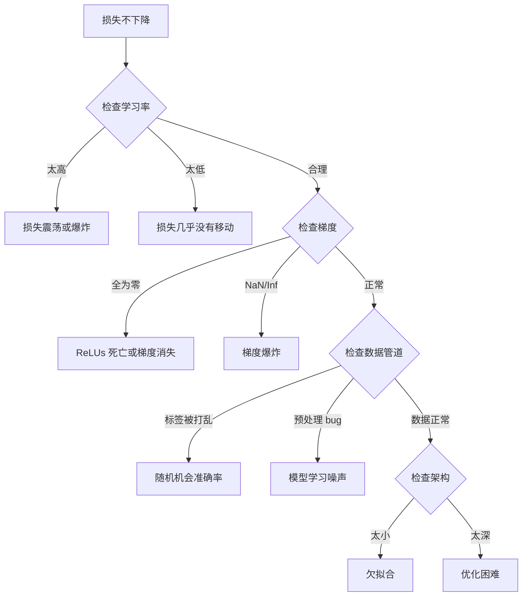
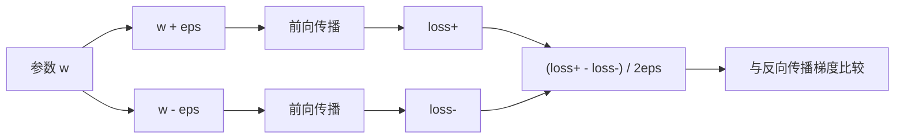
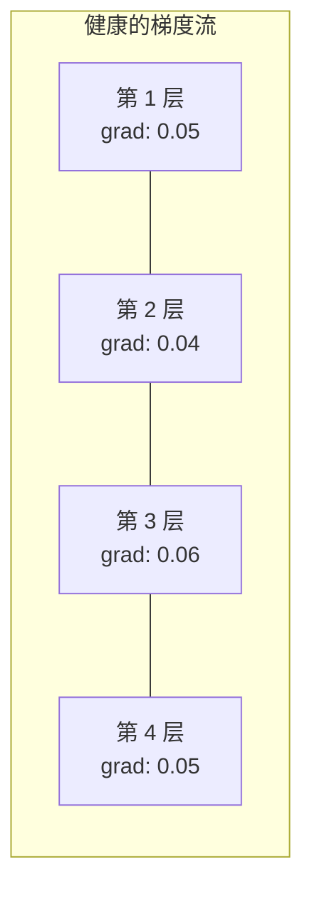
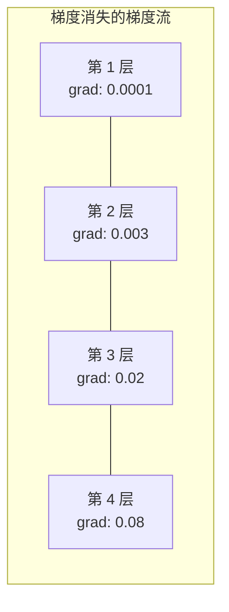
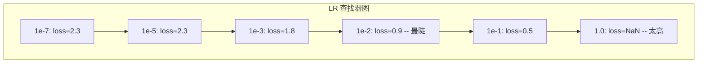

# 调试神经网络

> 你的网络编译通过了。它运行了。它产生了一个数字。这个数字是错的，并且没有任何东西崩溃。欢迎来到最困难的一种调试——没有错误消息的那种。

**类型：** 构建
**语言：** Python, PyTorch
**前置条件：** 第 03 阶段第 01-10 课（特别是反向传播、损失函数、优化器）
**时间：** 约 90 分钟

## 学习目标

- 使用系统化的调试策略诊断常见的神经网络故障（NaN 损失、平坦损失曲线、过拟合、震荡）
- 应用"单批次过拟合"技术来验证你的模型架构和训练循环是否正确
- 检查梯度幅度、激活分布和权重范数以识别梯度消失/爆炸问题
- 构建涵盖数据管道、模型架构、损失函数、优化器和学习率问题的调试检查清单

## 问题

传统软件在损坏时崩溃。空指针抛出异常。类型不匹配在编译时失败。差一错误产生明显错误的输出。

神经网络不给你这种奢侈。

一个损坏的神经网络运行到完成，打印一个损失值，并输出预测。损失可能下降。预测可能看起来合理。但模型是无声地错误的——学习捷径、记忆噪声或收敛到无用的局部最小值。Google 研究人员估计，60-70% 的 ML 调试时间花在"无声"bug 上——不产生错误但降低模型质量的 bug。

一个工作模型和一个损坏模型之间的区别通常只是一个错位的一行代码：一个缺失的 `zero_grad()`，一个转置的维度，差了 10 倍的学习率。经典的"训练神经网络的配方"(2019) 以此开头："最常见的神经网络错误是不崩溃的 bug。"

本课教你找到那些 bug。

## 概念

### 调试心态

忘掉 print-and-pray 调试。神经网络调试需要一个系统化的方法，因为反馈循环很慢（每次训练运行几分钟到几小时）并且症状是模糊的（糟糕的损失可能意味着 20 种不同的事情）。

黄金法则：**从简单开始，一次添加一个复杂性的部分，并独立验证每个部分。**



### 症状 1：损失不下降

这是最常见的抱怨。训练循环运行，epoch 滴答而过，损失保持平坦或剧烈震荡。

**错误的学习率。** 太高：损失震荡或跳到 NaN。太低：损失下降如此缓慢以至于看起来平坦。对于 Adam，从 1e-3 开始。对于 SGD，从 1e-1 或 1e-2 开始。在断定其他事情出错之前，始终尝试 3 个跨度各 10 倍的学习率（例如 1e-2、1e-3、1e-4）。

**死亡 ReLU。** 如果一个 ReLU 神经元接收到一个大的负输入，它输出 0 并且其梯度为 0。它永远不会再次激活。如果有足够多的神经元死亡，网络无法学习。检查：在每个 ReLU 层之后打印恰好为 0 的激活比例。如果超过 50% 死亡，切换到 LeakyReLU 或降低学习率。

**梯度消失。** 在具有 sigmoid 或 tanh 激活的深层网络中，梯度在向后传播时指数级缩小。当它们到达第一层时，约为 0。第一层停止学习。修复：使用 ReLU/GELU，添加残差连接，或使用批量归一化。

**梯度爆炸。** 相反的问题——梯度指数级增长。在 RNN 和非常深的网络中常见。损失跳到 NaN。修复：梯度裁剪（`torch.nn.utils.clip_grad_norm_`）、降低学习率，或添加归一化。

### 症状 2：损失下降但模型很差

损失在下降。训练准确率达到 99%。但测试准确率是 55%。或者模型在真实数据上产生无意义的输出。

**过拟合。** 模型记忆了训练数据而不是学习模式。训练和验证损失之间的差距随时间增长。修复：更多数据、dropout、权重衰减、早停法、数据增强。

**数据泄漏。** 测试数据泄漏到训练中。准确率高得可疑。常见原因：在分割前打乱、使用整个数据集的统计信息进行预处理、分割之间重复的样本。修复：先分割，后预处理，检查重复。

**标签错误。** 大多数真实数据集中 5-10% 的标签是错误的（Northcutt 等人，2021——"测试集中普遍存在的标签错误"）。模型学习了噪声。修复：使用置信学习找到并修复错误标记的样本，或使用损失截断忽略高损失样本。

### 症状 3：损失中出现 NaN 或 Inf

损失值变为 `nan` 或 `inf`。训练已死。

**学习率太高。** 梯度更新越界以至于权重爆炸。修复：降低 10 倍。

**log(0) 或 log(negative)。** 交叉熵损失计算 `log(p)`。如果你的模型输出恰好为 0 或负数概率，log 会爆炸。修复：将预测钳制到 `[eps, 1-eps]`，其中 `eps=1e-7`。

**除以零。** 批量归一化除以标准差。一个具有常量值的批次 std=0。修复：在分母中添加 epsilon（PyTorch 默认这样做，但自定义实现可能不会）。

**数值溢出。** 传入 `exp()` 的大激活值产生 Inf。Softmax 特别容易受影响。修复：在取指数之前减去最大值（log-sum-exp 技巧）。

### 技术 1：梯度检查

将你的解析梯度（来自反向传播）与数值梯度（来自有限差分）进行比较。如果它们不一致，你的反向传播中有 bug。

参数 `w` 的数值梯度：

```
grad_numerical = (loss(w + eps) - loss(w - eps)) / (2 * eps)
```

一致性指标（相对差异）：

```
rel_diff = |grad_analytical - grad_numerical| / max(|grad_analytical|, |grad_numerical|, 1e-8)
```

如果 `rel_diff < 1e-5`：正确。如果 `rel_diff > 1e-3`：几乎肯定是 bug。



### 技术 2：激活统计

在训练期间监控每层之后的激活均值和标准差。健康的网络保持激活均值接近 0，标准差接近 1（归一化后）或至少是有界的。

| 健康指标 | 均值 | 标准差 | 诊断 |
|-----------------|------|-----|-----------|
| 健康 | ~0 | ~1 | 网络正常学习 |
| 饱和 | >>0 或 <<0 | ~0 | 激活卡在极值 |
| 死亡 | 0 | 0 | 神经元已死（全为零）|
| 爆炸 | >>10 | >>10 | 激活无界增长 |

### 技术 3：梯度流可视化

为每一层绘制平均梯度幅度。在一个健康的网络中，梯度幅度应该在层间大致相似。如果早期层的梯度比后面层小 1000 倍，你有梯度消失。





### 技术 4：单批次过拟合测试

深度学习中唯一最重要的调试技术。

取一个小批次（8-32 个样本）。在其上训练 100+ 次迭代。损失应该近乎为零，训练准确率应该达到 100%。如果没有，你的模型或训练循环有一个根本性的 bug——不要继续完整训练。

这个测试捕获：
- 损坏的损失函数
- 损坏的反向传播
- 太小以至于无法表示数据的架构
- 优化器未连接到模型参数
- 数据和标签未对齐

这需要 30 秒运行，节省了调试完整训练运行的几个小时。

### 技术 5：学习率查找器

Leslie Smith (2017) 提出在一个 epoch 内将学习率从很小（1e-7）扫到很大（10），同时记录损失。绘制损失 vs 学习率。最优学习率大约比损失开始下降最快时的学习率小 10 倍。



本例中的最佳 LR：~1e-3（比最陡点小一个数量级）。

### 常见 PyTorch Bug

这些是 PyTorch 社区浪费最多集体时间的 bug：

| Bug | 症状 | 修复 |
|-----|---------|-----|
| 忘记 `optimizer.zero_grad()` | 梯度跨批次累积，损失震荡 | 在 `loss.backward()` 之前添加 `optimizer.zero_grad()` |
| 测试时忘记 `model.eval()` | Dropout 和 batch norm 行为不同，测试准确率在运行之间变化 | 添加 `model.eval()` 和 `torch.no_grad()` |
| 错误的张量形状 | 无声广播产生错误结果，没有错误 | 调试期间每个操作后打印形状 |
| CPU/GPU 不匹配 | `RuntimeError: expected CUDA tensor` | 对模型和**数据**都使用 `.to(device)` |
| 未分离张量 | 计算图永远增长，OOM | 使用 `.detach()` 或 `with torch.no_grad()` |
| 就地操作破坏 autograd | `RuntimeError: modified by in-place operation` | 将 `x += 1` 替换为 `x = x + 1` |
| 数据未归一化 | 损失卡在随机机会水平 | 将输入归一化为 mean=0, std=1 |
| 标签的 dtype 错误 | 交叉熵期望 `Long`，得到 `Float` | 强制转换标签: `labels.long()` |

### 主调试表

| 症状 | 可能原因 | 首先尝试的事情 |
|---------|-------------|-------------------|
| 损失卡在 -log(1/num_classes) | 模型预测均匀分布 | 检查数据管道，验证标签与输入匹配 |
| 几步后损失变为 NaN | 学习率太高 | 将 LR 降低 10 倍 |
| 损失立即变为 NaN | log(0) 或除以零 | 在 log/除法操作中添加 epsilon |
| 损失剧烈震荡 | LR 太高或批次大小太小 | 降低 LR，增加批次大小 |
| 损失下降然后停滞 | LR 对微调阶段太高 | 添加 LR 调度（余弦或阶梯衰减）|
| 训练准确率高，测试准确率低 | 过拟合 | 添加 dropout、权重衰减、更多数据 |
| 训练准确率 = 测试准确率 = 机会水平 | 模型完全没在学习任何东西 | 运行单批次过拟合测试 |
| 训练准确率 = 测试准确率但两者都低 | 欠拟合 | 更大的模型，更多层，更多特征 |
| 所有权重梯度为零 | ReLUs 死亡或计算图已分离 | 切换到 LeakyReLU，检查 `.requires_grad` |
| 训练期间内存不足 | 批次太大或图未释放 | 减少批次大小，对评估使用 `torch.no_grad()` |

```figure
learning-curves
```

## 构建它

一个监控激活、梯度和损失曲线的诊断工具包。你将故意破坏一个网络并使用该工具包诊断每个问题。

（完整的 NetworkDebugger 类实现，包含激活/梯度 hooks、单批次过拟合测试、学习率查找器和梯度检查器——详见 `code/main.py`）

## 使用它

### PyTorch 内置工具

```python
# 使用 autograd 检测异常
torch.autograd.set_detect_anomaly(True)

# 分析
with torch.profiler.profile(activities=[torch.profiler.ProfilerActivity.CPU, torch.profiler.ProfilerActivity.CUDA]) as prof:
    train_one_epoch(model, loader, criterion, optimizer)

# 内存分析
torch.cuda.memory_summary()
```

### Weights & Biases 集成

```python
import wandb
wandb.init(project="debugging-tutorial")
wandb.watch(model, log="all", log_freq=100)
wandb.log({"loss": loss, "grad_norm": grad_norm, "weight_norm": weight_norm})
```

### TensorBoard

```python
from torch.utils.tensorboard import SummaryWriter
writer = SummaryWriter()
writer.add_histogram("gradients/layer1", layer1_gradients, epoch)
```

### 调试检查清单（完整训练之前）

1. ✅ 单批次过拟合测试通过（损失 ~0，准确率 100%）
2. ✅ 检查每个线性层之后的激活统计（均值 ~0，std ~1）
3. ✅ 检查梯度范数（10^-3 到 10^1 范围内，无 NaN）
4. ✅ 运行 LR 查找器（选择一个比最陡点低一档的 LR）
5. ✅ 验证所有参数 .grad 不是 None 且 require_grad=True
6. ✅ 所有张量在同一个设备上
7. ✅ 输入正确归一化（mean=0, std=1）
8. ✅ 标签是 long/int 类型用于分类

## 交付物

本课产出：
- `outputs/prompt-debugging-checklist.md`——一个在训练运行前运行的结构化调试提示词
- `outputs/prompt-gradient-debugger.md`——一个诊断梯度问题的提示词
- `outputs/skill-debugger-mindset.md`——一个涵盖系统化神经网络调试方法的技能

## 练习

1. **诊断一个 NaN 损失。** 将学习率设为 10.0 并训练几轮。观察 NetworkDebugger 报告了什么。然后将 LR 改为 0.001 并重新运行。比较激活统计的差异。

2. **故意移除 zero_grad()。** 在一个训练循环中注释掉 `optimizer.zero_grad()`。观察每个 epoch 损失如何表现，哪些激活和梯度统计会提示你这个 bug。

3. **创建梯度爆炸条件。** 使用标准正态分布 `N(0, 1)` 初始化所有权重，而不是 Kaiming。训练你的 MNIST 模型。追踪梯度范数。它们是否爆炸？哪一层最先失败？

4. **实现激活直方图。** 修改 activation_hook 以将每个样本的激活分布分箱为 20 个箱（-10 到 10 范围）。每个 epoch 打印一个文本直方图。在正常训练和饱和网络之间进行视觉比较。

5. **构建你的调试检查清单。** 创建一个简洁的、打印在终端上的检查清单，在你的模型的第一个完整训练运行之前运行。它应该包括：数据形状、参数计数、设备布局、梯度流测试和单批次过拟合测试。

## 关键术语

| 术语 | 人们的说法 | 实际含义 |
|------|-----------|----------|
| 单批次过拟合 | "证明管道有效" | 在一个小批次上训练到 100% 准确率以验证没有架构/损失/梯度 bug |
| 梯度消失 | "早期层不学习" | 梯度在反向传播中指数级缩小，使早期层几乎不接收学习信号 |
| 梯度爆炸 | "损失跳到 NaN" | 梯度指数级增长，使权重更新如此之大以至于参数变为 NaN |
| 死亡 ReLU | "神经元停止激活" | 一个 ReLU 神经元接收始终为负的输入；输出为 0，梯度为 0，永不恢复 |
| 数值梯度检查 | "数学 vs 代码" | 通过有限差分比较解析梯度与数值梯度；相对误差 > 1e-3 表示 bug |
| 激活统计 | "看层在做什么" | 监控每层输出的均值和标准差以检测饱和、死亡或爆炸 |
| LR 查找器 | "找到最佳学习率" | 学习率从低到高的系统扫描，将损失绘制为 LR 的函数以选择最佳值 |
| 梯度裁剪 | "限制梯度范数" | 当梯度范数超过阈值时将梯度缩小，防止爆炸更新 |
| 损失震荡 | "损失来回跳动" | 损失不单调下降，而是波动——表示 LR 太高或批次太小 |
| 无声 bug | "模型运行但不好" | 产生有效输出但模型质量差的 bug——没有异常，没有崩溃，没有错误 |

## 延伸阅读

- "A Recipe for Training Neural Networks" (Andrej Karpathy, 2019)——每个 ML 工程师都应熟知的经典调试清单
- "Troubleshooting Deep Neural Networks" (Josh Tobin et al., 2018)——深度学习调试策略的结构化框架
- "How to Unit Test Machine Learning Code" (Chase Roberts, 2017)——ML 管道中具体单元测试模式的实用指南
- Smith, "Cyclical Learning Rates for Training Neural Networks" (2017)——描述了 LR 查找器技术
- PyTorch 调试教程 (https://pytorch.org/tutorials/recipes/recipes/tuning_guide.html)——官方 PyTorch 性能分析和调试指南
