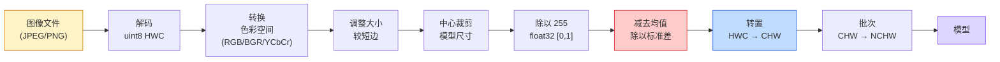

# 图像基础——像素、通道、色彩空间

> 图像是一个光样本的张量。你将使用的每个视觉模型都始于这个事实。

**类型：** 构建
**语言：** Python
**前置条件：** 第一阶段第 12 课（张量操作），第三阶段第 11 课（PyTorch 入门）
**时间：** 约 45 分钟

## 学习目标

- 解释连续场景如何被离散化为像素，以及为什么采样/量化决策为每个下游模型设定了上限
- 将图像作为 NumPy 数组读取、切片和检查，并在 HWC 和 CHW 布局之间流畅切换
- 在 RGB、灰度、HSV 和 YCbCr 之间转换，并证明每个色彩空间存在的原因
- 精确按照 torchvision 期望的方式应用像素级预处理（归一化、标准化、调整大小、通道优先）

## 问题

你将要阅读的每一篇论文，你将要下载的每一个预训练权重，你将要调用的每一个视觉 API 都假设了输入的特定编码。将 `uint8` 图像传入模型期望 `float32` 的地方，它仍然会运行——并无声地产生垃圾。将 BGR 传入在 RGB 上训练的网络，准确率会下降十个百分点。将通道在最后的输入交给期望通道在前的模型，第一个卷积层会把高度当作特征通道。这些都不会抛出错误。它们只是毁掉你的指标，你花一周时间寻找一个存在于你如何加载文件中的 bug。

一旦你知道卷积在滑动什么，卷积并不复杂。困难的部分在于"图像"对相机、JPEG 解码器、PIL、OpenCV、torchvision 和 CUDA 内核意味着不同的事情。每个技术栈都有自己的轴顺序、字节范围和通道约定。一个无法保持这些清晰的视觉工程师会送出有问题的管道。

本课修复基础，以便本阶段其余部分可以在此基础上构建。到最后你会知道像素是什么，为什么每个像素有三个数字而不是一个，"使用 ImageNet 统计进行标准化"实际上做了什么，以及如何在本阶段其他每一课将假定的两三种布局之间切换。

## 概念

### 预处理管道概览

每个生产视觉系统都是相同序列的可逆变换。弄错一步，模型看到的就是不同于训练时的输入。



红色和蓝色框是 80% 无声故障存在的地方：缺少标准化和错误的布局。

### 像素是一个样本，不是一个方格

相机传感器计数落在微小探测器网格上的光子。每个探测器在几分之一秒内积分光线，并发出与其击中的光子数量成比例的电压。然后传感器将该电压离散化为一个整数。一个探测器成为一个像素。

在这一步发生两个选择，它们为下游的一切设定了上限：

- **空间采样**决定场景每度有多少探测器。太少，边缘变得锯齿状（混叠）。太多，存储和计算激增。
- **强度量化**决定电压被划分为多细的桶。8 位提供 256 个级别，是显示的标准。10、12、16 位提供更平滑的渐变，对医学成像、HDR 和原始传感器管道很重要。

像素不是带有面积的彩色方块。它是一个单一的测量。当你调整大小或旋转时，你在对该测量网格进行重新采样。

### 为什么有三个通道

一个探测器跨整个可见光谱计数光子——那是灰度。为了获得颜色，传感器用红、绿、蓝滤光片的马赛克覆盖网格。去马赛克后，每个空间位置有三个整数：红色滤光探测器、绿色滤光探测器和附近的蓝色滤光探测器的响应。这三个整数就是像素的 RGB 三元组。

### 两种布局约定：HWC 和 CHW

HWC (Height, Width, Channel)：与磁盘上的字节顺序匹配的排列。几乎所有图像库（PIL、OpenCV、matplotlib）都使用 HWC。内存布局是 rows of pixels，每个像素有 C 个值。

CHW (Channel, Height, Width)：PyTorch、cuDNN 和每个现代加速器期望的排列。内存布局是 C 个大小为 H x W 的连续平面。

当你在两者之间意外切换时，不会抛出错误。模型只是将三个空间通道解释为三个颜色平面。分辨这个问题需要在你看到的每个张量上保持 shape 在头脑中。

（完整的构建部分包含加载、通道分割、色彩空间转换、归一化/标准化和调整大小——详见 `code/main.py`）

## 使用它

`torchvision.transforms` 将上述所有内容捆绑到一个可组合的管道中。以下代码精确复现了 `preprocess_imagenet` 的功能，再加上调整大小和裁剪。

```python
import torch
from torchvision import transforms
from PIL import Image

img = Image.fromarray(synthetic_rgb(256, 256))

pipeline = transforms.Compose([
    transforms.Resize(256),
    transforms.CenterCrop(224),
    transforms.ToTensor(),
    transforms.Normalize(mean=[0.485, 0.456, 0.406], std=[0.229, 0.224, 0.225]),
])

x = pipeline(img)
print(f"tensor type:  {type(x).__name__}")
print(f"tensor dtype: {x.dtype}")
print(f"tensor shape: {tuple(x.shape)}      # (C, H, W)")
print(f"per-channel mean: {x.mean(dim=(1, 2)).tolist()}")
print(f"per-channel std:  {x.std(dim=(1, 2)).tolist()}")

batch = x.unsqueeze(0)
print(f"\nbatched shape: {tuple(batch.shape)}   # (N, C, H, W) — 准备好给模型了")
```

四个步骤，严格按此顺序：`Resize(256)` 将较短边缩放到 256；`CenterCrop(224)` 从中间取 224x224 的补丁；`ToTensor()` 除以 255 并将 HWC 交换为 CHW；`Normalize` 减去 ImageNet 均值并除以标准差。反转那个顺序会无声地改变进入模型的内容。

## 交付物

本课产出：

- `outputs/prompt-vision-preprocessing-audit.md`——一个提示词，它将任何模型卡或数据集卡转化为团队必须遵守的精确预处理不变量的检查清单。
- `outputs/skill-image-tensor-inspector.md`——一个技能，给定任何图像形状的张量或数组，报告 dtype、布局、范围以及它看起来是原始的、归一化的还是标准化的。

## 练习

1. **（简单）** 用 OpenCV (`cv2.imread`) 和 Pillow 加载一张 JPEG。打印两个形状和 `(0, 0)` 处的像素。解释通道顺序的差异，然后写一行转换使 OpenCV 数组与 Pillow 数组完全相同。
2. **（中等）** 编写 `standardize(img, mean, std)` 及其逆函数，它们在任何 uint8 图像上通过 `roundtrip_max_diff <= 1` 测试。你的函数必须在 HWC 中的单个图像和 NCHW 中的批次上使用相同的调用。
3. **（困难）** 取一个 3 通道 ImageNet 标准化的张量，让它通过一个学习 RGB 加权混合到单个灰度通道的 1x1 卷积。将权重初始化为 `[0.299, 0.587, 0.114]`，冻结它们，并验证输出与手工 `rgb_to_grayscale` 在浮点误差范围内匹配。还有哪些其他经典的色彩空间变换可以写为 1x1 卷积？

## 关键术语

| 术语 | 人们的说法 | 实际含义 |
|------|-----------|----------|
| 像素 | "一个彩色方块" | 一个网格位置上的一个光强度样本——三个数字代表颜色，一个代表灰度 |
| 通道 | "颜色" | 堆叠到图像张量中的并行空间网格之一；HWC 中的最后一个轴，CHW 中的第一个 |
| HWC / CHW | "形状" | 图像张量的轴排序；磁盘和 PIL 使用 HWC，PyTorch 和 cuDNN 使用 CHW |
| 归一化 | "缩放图像" | 除以 255 使像素存在于 [0, 1]——必要但不充分 |
| 标准化 | "零中心化" | 减去均值并除以每通道标准差，使输入分布与模型训练时的一致 |
| 灰度转换 | "平均通道" | 系数为 0.299/0.587/0.114 的加权和，匹配人类亮度感知 |
| 插值 | "调整大小如何选择像素" | 当新网格不与旧网格对齐时决定输出值的规则——标签用最近邻，训练用双线性，显示用双三次 |
| 宽高比 | "宽度除以高度" | 区分"调整大小并填充"和"调整大小并拉伸"的比率 |

## 延伸阅读

- [Charles Poynton — A Guided Tour of Color Space](https://poynton.ca/PDFs/Guided_tour.pdf) — 关于为什么有这么多色彩空间以及每种何时重要的最清晰的技术处理
- [PyTorch Vision Transforms Docs](https://pytorch.org/vision/stable/transforms.html) — 你将在生产中实际组合的变换的完整管道
- [How JPEG Works (Colt McAnlis)](https://www.youtube.com/watch?v=F1kYBnY6mwg) — 关于色度子采样、DCT 以及为什么 JPEG 编码 YCbCr 而不是 RGB 的清晰视觉导览
- [ImageNet Preprocessing Conventions (torchvision models)](https://pytorch.org/vision/stable/models.html) — `mean=[0.485, 0.456, 0.406]` 的真实来源，以及为什么 zoo 中的每个模型都期望它
