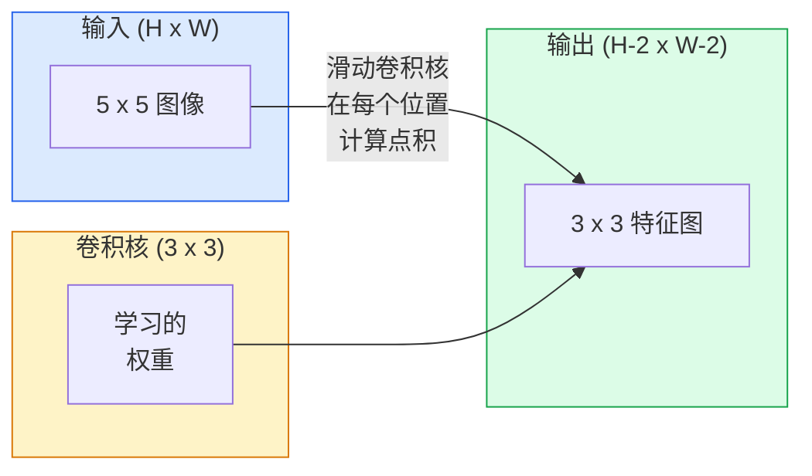

# 从零开始实现卷积

> 卷积是一个穿过图像滑动的小型密集层，在每个位置共享相同的权重。

**类型：** 构建
**语言：** Python
**前置条件：** 第三阶段（深度学习核心），第四阶段第 01 课（图像基础）
**时间：** 约 75 分钟

## 学习目标

- 仅使用 NumPy 从零开始实现 2D 卷积，包括嵌套循环版本和向量化的 `im2col` 版本
- 为输入大小、卷积核大小、填充和步幅的任意组合计算输出空间大小，并证明 `(H - K + 2P) / S + 1` 公式
- 手工设计卷积核（边缘、模糊、锐化、Sobel）并解释每种卷积核为什么会产生它所产生的那组激活
- 将卷积堆叠成特征提取器，并将堆叠深度与感受野大小联系起来

## 问题

在一个 224x224 RGB 图像上的全连接层需要每个神经元 224 * 224 * 3 = 150,528 个输入权重。只有 1,000 个单元的单隐藏层已经有 1.5 亿个参数——在你学到任何有用的东西之前。更糟的是，该层不知道左上角的狗和右下角的狗是相同的模式。它将每个像素位置视为独立的，这对图像来说是绝对错误的：将猫平移三个像素不应该迫使网络重新学习这个概念。

图像模型需要的两个属性是**平移等变性**（输入平移时输出也平移）和**参数共享**（相同的特征检测器到处运行）。密集层两者都不给你。卷积两者都免费给你。

卷积不是为深度学习发明的。它与驱动 JPEG 压缩、Photoshop 中的高斯模糊、工业视觉中的边缘检测以及有史以来每个音频滤波器的是同一个操作。CNN 从 2012 年到 2020 年主导 ImageNet 的原因是卷积对于邻近值相关且相同模式可以出现在任何地方的数据是正确的前置条件。

## 概念

### 一个卷积核，滑动

一个 2D 卷积取一个称为卷积核（或滤波器）的小权重矩阵，在输入上滑动，在每个位置计算逐元素乘积的和。该和成为一个输出像素。



那一个公式 — **共享权重、局部性、滑动窗口** — 就是整个思想。其他一切只是簿记。

### 输出大小公式

给定输入空间大小 `H`、卷积核大小 `K`、填充 `P`、步幅 `S`：

```
H_out = floor( (H - K + 2P) / S ) + 1
```

### 填充、步幅、多通道、im2col 技巧和感受野

（完整的概念解释涵盖填充（边界零值）、步幅（每次跳跃距离）、多输入通道（跨通道求和）、im2col 技巧（将滑动窗口排列为列使卷积成为大矩阵乘法）以及感受野（深度网络中输出激活依赖的输入补丁大小）——详见 `code/main.py`）

## 构建它

（完整实现包含 pad2d、带有嵌套循环和 im2col 的 conv2d、手工设计的卷积核（Sobel、模糊、锐化）以及验证——详见 `code/main.py`）

## 使用它

PyTorch 的 `nn.Conv2d` 用 autograd、CUDA 内核和 cuDNN 优化包装了相同的操作。形状语义完全相同。

```python
import torch
import torch.nn as nn

conv = nn.Conv2d(in_channels=3, out_channels=64, kernel_size=3, stride=1, padding=1)
print(conv)
print(f"weight shape: {tuple(conv.weight.shape)}   # (C_out, C_in, K, K)")
print(f"bias shape:   {tuple(conv.bias.shape)}")
print(f"param count:  {sum(p.numel() for p in conv.parameters())}")

x = torch.randn(8, 3, 224, 224)
y = conv(x)
print(f"\ninput  shape: {tuple(x.shape)}")
print(f"output shape: {tuple(y.shape)}")
```

## 交付物

本课产出：

- `outputs/prompt-cnn-architect.md`——一个提示词，给定输入大小、参数预算和目标感受野，设计一个在每一步具有正确 K/S/P 的 `Conv2d` 层堆叠。
- `outputs/skill-conv-shape-calculator.md`——一个技能，逐层遍历网络规范，并返回每个块的输出形状、感受野和参数数量。

## 练习

1. **（简单）** 给定一个 128x128 灰度输入和堆叠 `[Conv3x3(s=1,p=1), Conv3x3(s=2,p=1), Conv3x3(s=1,p=1), Conv3x3(s=2,p=1)]`，手动计算每个层的输出空间大小和感受野。使用虚拟卷积的 PyTorch `nn.Sequential` 验证。
2. **（中等）** 扩展 `conv2d_naive` 和 `conv2d_im2col` 以接受 `groups` 参数。展示 `groups=C_in=C_out` 重现了深度卷积，并且其参数计数是 `C * K * K` 而不是 `C * C * K * K`。
3. **（困难）** 手工实现 `conv2d_im2col` 的反向传播：给定输出的梯度，计算 `x` 和 `w` 的梯度。使用 `torch.autograd.grad` 在相同输入和权重上验证。技巧：im2col 的梯度是 `col2im`，并且必须累积重叠窗口。

## 关键术语

| 术语 | 人们的说法 | 实际含义 |
|------|-----------|----------|
| 卷积 | "滑动滤波器" | 一个在每个空间位置用共享权重应用的可学习的点积；数学上是互相关，但每个人都称之为卷积 |
| 卷积核 / 滤波器 | "特征检测器" | 形状为 (C_in, K, K) 的小权重张量，其与输入窗口的点积产生一个输出像素 |
| 步幅 | "跳多远" | 连续卷积核放置之间的步长；步幅 2 将每个空间维度减半 |
| 填充 | "边缘上的零" | 在输入周围添加额外值，使卷积核可以中心对齐边界像素；`same` 填充保持输出大小等于输入大小 |
| 感受野 | "神经元看到多少" | 给定输出激活依赖的原始输入补丁，随深度和步幅增长 |
| im2col | "GEMM 技巧" | 将每个感受窗口重新排列为列，使卷积成为一个大型矩阵乘法——每个快速卷积内核的核心 |
| 深度卷积 | "每个通道一个卷积核" | 具有 `groups == C_in` 的卷积，仅从其匹配的输入通道计算每个输出通道；MobileNet 和 ConvNeXt 的骨干 |
| 平移等变性 | "移入，移出" | 将输入平移 k 个像素则将输出平移 k 个像素的属性；通过共享权重免费获得 |

## 延伸阅读

- [A guide to convolution arithmetic for deep learning (Dumoulin & Visin, 2016)](https://arxiv.org/abs/1603.07285) — 每个课程都默默复制的填充/步幅/扩张的权威图表
- [CS231n: Convolutional Neural Networks for Visual Recognition](https://cs231n.github.io/convolutional-networks/) — 经典的讲义笔记，包括原始的 im2col 解释
- [The Annotated ConvNet (fast.ai)](https://nbviewer.org/github/fastai/fastbook/blob/master/13_convolutions.ipynb) — 一个从手工卷积到训练数字分类器的 notebook
- [Receptive Field Arithmetic for CNNs (Dang Ha The Hien)](https://distill.pub/2019/computing-receptive-fields/) — 感受野计算的论文级交互解释器
