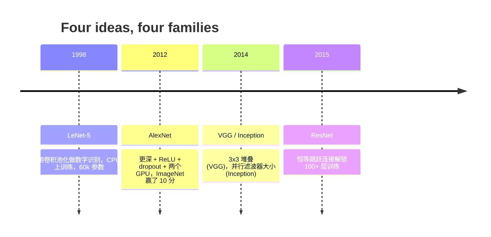

# CNN——从 LeNet 到 ResNet

> 过去三十年的每一个主要 CNN 都是相同的卷积-非线性-下采样配方，外加一个新想法。按顺序学习这些想法。

**类型：** 学习 + 构建
**语言：** Python
**前置条件：** 第三阶段第 11 课（PyTorch），第四阶段第 01 课（图像基础），第四阶段第 02 课（从零开始实现卷积）
**时间：** 约 75 分钟

## 学习目标

- 追溯架构谱系 LeNet-5 -> AlexNet -> VGG -> Inception -> ResNet，并陈述每个家族贡献的单一新思想
- 在 PyTorch 中实现 LeNet-5、VGG 风格块和 ResNet BasicBlock，每个不超过 40 行
- 解释为什么残差连接将一个 1,000 层网络从未训练变为最先进
- 阅读现代骨干（ResNet-18、ResNet-50）并在查看源代码之前预测其输出形状、感受野和参数数量

## 问题

2011 年，最佳 ImageNet 分类器 top-5 准确率约 74%。2012 年 AlexNet 达到 85%。2015 年 ResNet 达到 96%。没有新数据。没有新的 GPU 代。收益来自架构思想。一个工作的视觉工程师必须知道哪个想法来自哪篇论文，因为你在 2026 年部署的每一个生产骨干都是这些相同片段的重新组合——并且因为这些思想不断转移：分组卷积从 CNN 走向了 transformers，残差连接从 ResNet 走向了每个存在的 LLM，批量归一化存在于扩散模型中。

按顺序研究这些网络还让你对一个常见错误免疫：当 LeNet 大小的网络就能解决问题时，伸手去拿最大的可用模型。MNIST 不需要 ResNet。了解每个家族的缩放曲线告诉你该坐在这条曲线上的哪个位置。

## 概念

### 四个改变视觉的想法



在经典视觉中，没有其他东西像这四次飞跃那样重要。

### LeNet-5 (1998)

Yann LeCun 的数字识别器。60,000 个参数。两个 conv-pool 块，两个全连接层，tanh 激活。它定义了每个 CNN 继承的模板：交替卷积和下采样，馈入一个小分类头。

现代世界称为 CNN 的一切——带交替卷积和下采样，馈入一个小型分类头——都是 LeNet 加更多层、更大通道和更好的激活函数。

### AlexNet (2012)

三个一起打破 ImageNet 的变化：

1. **ReLU** 代替 tanh。梯度停止消失。训练速度加速六倍。
2. **Dropout** 在全连接头中。正则化变成一个层，而不是技巧。
3. **深度和宽度**。五个卷积层，三个密集层，60M 参数，在两个 GPU 上训练，模型在两 GPU 间分割。

### VGG (2014)

VGG 问道：如果你只用 3x3 卷积并且做深会发生什么？两个 3x3 卷积看到与一个 5x5 卷积相同的 5x5 输入区域，但参数更少（2*9*C^2 = 18C^2 vs 25*C^2），中间还有一个额外的 ReLU。VGG 将这一观察变成整个架构。简单性——一个块类型，重复——使它成为之后一切事物的参考点。代价：138M 参数，训练慢，推理昂贵。

### Inception (2014, 同年)、退化问题、ResNet (2015)

Inception 用并行卷积核大小。ResNet 用残差连接解决了退化问题——过去约 20 层后，更深的普通网络比更浅的网络表现更差。残差连接 `y = F(x) + x` 让网络学习恒等函数，使任意深度可训练。

（完整的构建部分包含 LeNet-5、VGGBlock/MiniVGG、BasicBlock/TinyResNet 的实现——详见 `code/main.py`）

## 使用它

`torchvision.models` 为你提供了上述所有的预训练版本。

```python
from torchvision.models import resnet18, ResNet18_Weights, vgg16, VGG16_Weights

r18 = resnet18(weights=ResNet18_Weights.IMAGENET1K_V1)
r18.eval()

print(f"ResNet-18 params: {sum(p.numel() for p in r18.parameters()):,}")

v16 = vgg16(weights=VGG16_Weights.IMAGENET1K_V1)
v16.eval()
print(f"VGG-16   params: {sum(p.numel() for p in v16.parameters()):,}")
```

ResNet-18 有 11.7M 参数。VGG-16 有 138M。相似的 ImageNet top-1 准确率（69.8% vs 71.6%）。残差连接为你赢得了 12 倍参数效率的胜利。这就是为什么 ResNet 变体从 2016 年主导直到 2021 年 ViT 出现——并且仍然主导计算受限的真实世界部署。

## 交付物

本课产出：
- `outputs/prompt-backbone-selector.md`——一个选择正确 CNN 家族（LeNet/VGG/ResNet/MobileNet/ConvNeXt）的提示词
- `outputs/skill-residual-block-reviewer.md`——一个读取 PyTorch 模块并标记跳跃连接错误的技能

## 关键术语

| 术语 | 人们的说法 | 实际含义 |
|------|-----------|----------|
| 骨干 | "模型" | 产生馈入任务头的特征图的卷积块堆叠 |
| 残差连接 | "跳跃连接" | `y = F(x) + x`；让优化器通过将 F 设为零来学习恒等，使任意深度可训练 |
| BasicBlock | "两个 3x3 卷积加跳跃" | ResNet-18/34 构建块 |
| Bottleneck | "1x1 降维，3x3，1x1 升维" | ResNet-50/101/152 块；在高通道数时便宜 |
| 退化问题 | "更深更差" | 超过约 20 个普通卷积层后，训练和测试误差都增加 |
| Stem | "第一层" | 将 3 通道输入转换为基础特征宽度的初始卷积 |
| Head | "分类器" | 最终骨干块之后的层 |
| 迁移学习 | "预训练权重" | 加载在 ImageNet 上训练的骨干，仅在你的任务上微调头部 |

## 延伸阅读

- [Deep Residual Learning for Image Recognition (He et al., 2015)](https://arxiv.org/abs/1512.03385) — ResNet 论文
- [Very Deep Convolutional Networks (Simonyan & Zisserman, 2014)](https://arxiv.org/abs/1409.1556) — VGG 论文
- [ImageNet Classification with Deep CNNs (Krizhevsky et al., 2012)](https://papers.nips.cc/paper_files/paper/2012/hash/c399862d3b9d6b76c8436e924a68c45b-Abstract.html) — AlexNet
- [Going Deeper with Convolutions (Szegedy et al., 2014)](https://arxiv.org/abs/1409.4842) — Inception v1
