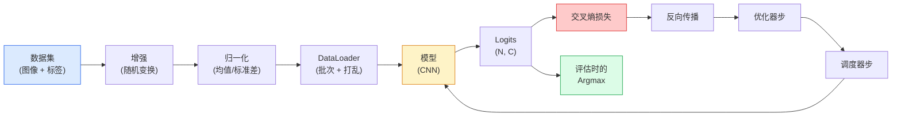

# 图像分类

> 分类器是一个从像素到类别的概率分布的函数。其他一切都是管道。

**类型：** 构建
**语言：** Python
**前置条件：** 第二阶段第 09 课（模型评估），第三阶段第 10 课（Mini 框架），第四阶段第 03 课（CNN）
**时间：** 约 75 分钟

## 学习目标

- 在 CIFAR-10 上构建端到端的图像分类管道：数据集、增强、模型、训练循环、评估
- 解释每个组件（dataloader、损失、优化器、调度器、增强）的作用，并预测破坏其中任何一个在损失曲线上的表现
- 从零开始实现 mixup、cutout 和标签平滑，并证明何时值得添加每种方法
- 阅读混淆矩阵和每类精确率/召回率表，以诊断超出总体准确率的数据集和模型故障

## 问题

每个部署的视觉任务在某种程度上都归结为图像分类。检测分类区域。分割分类像素。检索按与类别质心的相似度排序。正确进行分类——数据集循环、增强策略、损失、评估——是转移给本阶段其他每个任务的技能。

大多数分类 bug 不在模型中。它们存在于管道中：破损的归一化、未打乱的训练集、扭曲标签的增强、被训练数据污染的验证分割、在第 30 个 epoch 后无声发散的学习率。一个在正确设置下能在 CIFAR-10 上达到 93% 的 CNN，在破损的设置下通常得 70-75%，而损失曲线全程看起来都很合理。

本课手动连接整个管道，使每个部分都可检查。你不会使用任何来自 `torchvision.datasets` 的能隐藏 bug 的东西。

## 概念

### 分类管道



这个循环中的每一行都是 bug 可以存在的地方。交叉熵接收原始 logits，不是 softmax 输出，所以在损失前的任何 `model(x).softmax()` 都会无声地计算错误的梯度。

### 交叉熵、logits 和 softmax

一个分类器为每张图像产生 `C` 个称为 logits 的数字。应用 softmax 将它们转换为概率分布。交叉熵衡量正确类别的负对数概率。PyTorch 的 `nn.CrossEntropyLoss` 在一个操作中融合 softmax + NLL，并直接接收原始 logits。

### 为什么增强有效

CNN 对平移有归纳偏置（来自权重共享），但没有对裁剪、翻转、颜色抖动或遮挡的内置不变性。教会它这些不变性的唯一方法是展示给它能锻炼这些不变性的像素。训练期间的每个随机变换都是在说："这两张图像有相同的标签；学习忽略差异的特征。"

规则：增强必须保留标签。在数字上的 Cutout 和旋转可能使 "6" 变成 "9"；对于该数据集，你使用更小的旋转范围并选择尊重数字特定不变性的增强。

（完整的构建部分包含合成数据集、标准化/增强变换、mixup、训练循环和混淆矩阵分析——详见 `code/main.py`）

## 使用它

`torchvision` 将以上所有内容包装为惯用组件。对于真实 CIFAR-10，完整管道是四行代码加一个训练循环。

```python
from torchvision.datasets import CIFAR10
from torchvision.transforms import Compose, RandomCrop, RandomHorizontalFlip, ToTensor, Normalize

mean = (0.4914, 0.4822, 0.4465)
std = (0.2470, 0.2435, 0.2616)
train_tf = Compose([
    RandomCrop(32, padding=4, padding_mode="reflect"),
    RandomHorizontalFlip(),
    ToTensor(),
    Normalize(mean, std),
])
eval_tf = Compose([ToTensor(), Normalize(mean, std)])

train_ds = CIFAR10(root="./data", train=True,  download=True, transform=train_tf)
val_ds   = CIFAR10(root="./data", train=False, download=True, transform=eval_tf)
```

需要注意两件事：均值/标准差是**特定于数据集的**——在 CIFAR-10 训练集上计算，而不是 ImageNet——以及反射填充是社区默认的裁剪策略。在这里复制粘贴 ImageNet 统计是一个约 1% 的准确率泄漏，直到有人分析模型才会被发现。

## 交付物

本课产出：
- `outputs/prompt-classifier-pipeline-auditor.md`——一个审计训练脚本上述五个不变量的提示词
- `outputs/skill-classification-diagnostics.md`——一个技能，给定混淆矩阵和类别名称列表，总结每类故障并建议最有影响力的单一修复

## 练习

1. **（简单）** 在合成数据集上用有和没有 mixup 训练同一模型五个 epoch。绘制两者的训练和验证损失。解释为什么带 mixup 的训练损失更高，但验证准确率相似或更好。
2. **（中等）** 实现 Cutout——在每个训练图像中将随机 8x8 方块归零——并运行消融实验：无增强、hflip+crop、hflip+crop+cutout、hflip+crop+mixup。报告每种配置的验证准确率。
3. **（困难）** 构建 CIFAR-100 管道（100 类，相同输入大小）并复现 ResNet-34 训练运行，达到发布准确率的 1% 以内。额外任务：扫描三个学习率和两个权重衰减，记录到本地 CSV，生成最终混淆矩阵。

## 关键术语

| 术语 | 人们的说法 | 实际含义 |
|------|-----------|----------|
| Logits | "原始输出" | 每张图像 C 个数字的 softmax 前向量；交叉熵期望这些，不是 softmaxed 值 |
| 交叉熵 | "损失" | 正确类别的负对数概率；在一个稳定操作中结合 log-softmax 和 NLL |
| DataLoader | "批量器" | 用打乱、分批和（可选）多工作器加载包装数据集 |
| 增强 | "随机变换" | 训练时任何保留标签的像素级变换；教会 CNN 没有原生不变性的东西 |
| Mixup / Cutmix | "混合两个图像" | 混合输入和标签，使分类器学习平滑插值而不是硬边界 |
| 标签平滑 | "更软的目标" | 将 one-hot 替换为 (1-eps, eps/(C-1), ...)；改善校准并略微提高准确率 |
| Top-k 准确率 | "Top-5" | 正确类别在 k 个最高概率预测中；用于有真实模糊类别的数据集 |
| 混淆矩阵 | "错误在哪里" | C x C 表，其中条目 (i, j) 统计真实类别 i 预测为 j 的图像数量 |

## 延伸阅读

- [CS231n: Training Neural Networks](https://cs231n.github.io/neural-networks-3/) — 仍然是最清晰的训练管道导览
- [Bag of Tricks for Image Classification (He et al., 2019)](https://arxiv.org/abs/1812.01187) — 每个小技巧共同使 ResNet 在 ImageNet 的准确率提高 3-4%
- [mixup: Beyond Empirical Risk Minimization (Zhang et al., 2017)](https://arxiv.org/abs/1710.09412) — 原始 mixup 论文
- [Why temperature scaling matters (Guo et al., 2017)](https://arxiv.org/abs/1706.04599) — 证明现代网络未校准并用一个标量参数修复的论文
