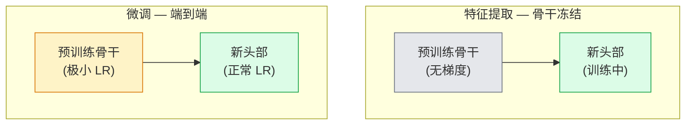

# 迁移学习与微调

> 别人花了百万 GPU 小时教会网络边缘、纹理和物体部件长什么样。你应该在训练自己的之前借用这些特征。

**类型：** 构建
**语言：** Python
**前置条件：** 第四阶段第 03 课（CNN），第四阶段第 04 课（图像分类）
**时间：** 约 75 分钟

## 学习目标

- 区分特征提取和微调，并根据数据集大小、领域距离和计算预算选择正确的方法
- 加载预训练骨干，替换分类头，在 20 行内仅训练头部达到可工作的基线
- 使用判别性学习率逐步解冻层，使早期通用特征获得比后期任务特定特征更小的更新
- 诊断三种常见故障：解冻块上 LR 过高导致的特征漂移、小数据集上 BN 统计崩溃和灾难性遗忘

## 问题

在 ImageNet 上训练 ResNet-50 大约需要 2,000 GPU 小时。很少有团队为他们部署的每个任务都有这种预算。几乎每个团队实际部署的是一个预训练骨干加上一个在几百或几千张任务特定图像上训练的新头部。

这不是捷径。任何 ImageNet 训练的 CNN 的第一个卷积块学习边缘和类似 Gabor 的滤波器。接下来的几个块学习纹理和简单图案。中间块学习物体部件。最终块学习开始像 1,000 个 ImageNet 类别的组合。该层次结构的前 90% 几乎不变地转移到医学影像、工业检测、卫星数据和所有其他视觉任务——因为自然界只有有限的边缘和纹理词汇。最后 10% 是你实际训练的部分。

正确进行迁移有三个陷阱在等着你：用过高的学习率破坏预训练特征、冻结太多导致模型信息不足、以及让 BatchNorm 的运行统计向一个网络其余部分从未学习过的小数据集漂移。本课有目的地逐一讲解。

## 概念

### 特征提取 vs 微调

两种模式，根据你对预训练特征的信任度和数据量来选择。

经验法则：

| 数据集大小 | 领域距离 | 配方 |
|--------------|-----------------|--------|
| < 1k 图像 | 接近 ImageNet | 冻结骨干，仅训练头部 |
| 1k-10k | 接近 | 冻结前 2-3 阶段，微调其余 |
| 10k-100k | 任意 | 使用判别性 LR 端到端微调 |
| 100k+ | 远 | 微调一切；如果领域足够远，考虑从头训练 |

"接近 ImageNet" 大致意味着带有类物体内容的自然 RGB 照片。医疗 CT 扫描、卫星高空图像和显微镜是远领域——特征仍然有帮助，但你需要让更多层适应。

### 判别性学习率、BatchNorm 问题和常见故障模式

（完整的概念部分涵盖特征提取为何有效（ImageNet 特征泛化到大多数视觉领域）、判别性学习率（早期层用 base_lr/100，后期层用 base_lr）以及 BatchNorm 陷阱——详见 `docs/en.md` 概念部分）

（完整的构建部分包含加载预训练模型、替换头部、冻结/解冻策略和判别性学习率——详见 `code/main.py`）

## 交付物

本课产出：
- 可复用的迁移学习提示词和管道配置

## 练习

1. 加载预训练 ResNet-18，替换头部为 10 类分类器，仅在 CIFAR-10 上训练头部 5 个 epoch。然后解冻骨干的后半部分并微调另外 5 个 epoch。比较两种策略的测试准确率。
2. 使用判别性学习率：stages 0-4 分别使用 lr、lr/3、lr/10、lr/100。与所有层使用相同学习率比较最终测试准确率。
3. 使用与 ImageNet 分布不同的数据集（如医学图像或卫星图像）。比较仅特征提取、微调和从头训练。哪一层是特征从"通用"变为"任务特定"的转折点？

## 关键术语

| 术语 | 人们的说法 | 实际含义 |
|------|-----------|----------|
| 迁移学习 | "免费预训练" | 将在一个数据集上训练的骨干权重应用于不同任务 |
| 特征提取 | "冻结骨干" | 在所有预训练层上设置 .requires_grad=False，仅训练新头部 |
| 微调 | "端到端训练" | 更新骨干和新头部的权重，通常使用更小的学习率 |
| 判别性 LR | "不同层用不同 LR" | 为不同组分配不同学习率——早期层更低，后期层更高 |
| 灾难性遗忘 | "忘记预训练" | 当 LR 过高时，骨干失去泛化特征，性能下降到随机水平以下 |
| BatchNorm 漂移 | "统计错位" | 当数据集太小或像素分布与 ImageNet 太远时，运行统计变得不准确 |

## 延伸阅读

- [A Comprehensive Guide to Fine-Tuning (Hugging Face)](https://huggingface.co/docs/transformers/training) — 生产微调的实际参考
- Yosinski et al., "How transferable are features in deep neural networks?" (2014) — 关于哪些层迁移和为什么迁移的基础性论文
- Kornblith et al., "Do Better ImageNet Models Transfer Better?" (2019) — 证明更好的 ImageNet 准确率与更好的迁移性能相关
