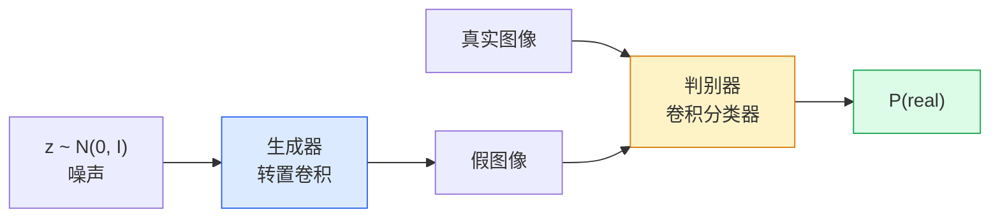
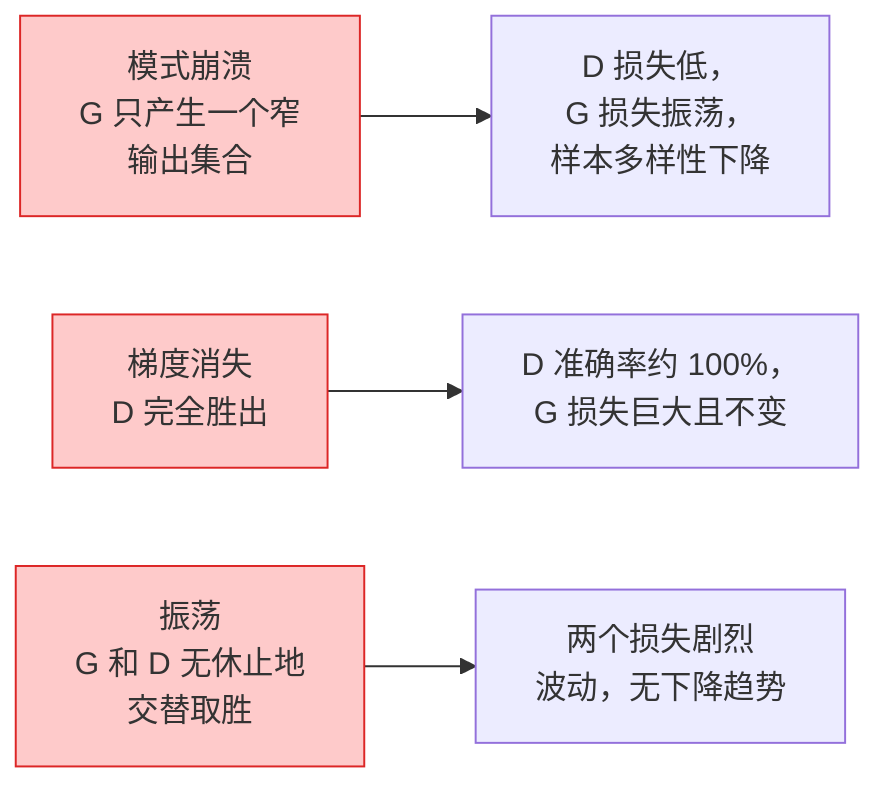

# 图像生成 — GANs

> GAN 是两个神经网络在一个固定博弈中的对抗。一个负责作画，一个负责批评。它们一起进步，直到画作骗过批评者。

**类型：** Build
**语言：** Python
**先修要求：** Phase 4 Lesson 03 (CNNs), Phase 3 Lesson 06 (Optimizers), Phase 3 Lesson 07 (Regularization)
**时间：** ~75 分钟

## 学习目标

- 解释生成器与判别器之间的极小极大博弈，以及为什么均衡点对应于 p_model = p_data
- 用 PyTorch 实现一个 DCGAN，在 60 行以内生成连贯的 32x32 合成图像
- 使用三个标准技巧稳定 GAN 训练：非饱和损失、谱归一化、TTUR（双时间尺度更新规则）
- 读取能区分健康收敛与模式崩溃、振荡和判别器完全胜出的训练曲线

## 问题

分类任务教会网络将图像映射到标签。生成任务则反其道而行之：从同一分布中采样看起来像出自该分布的新图像。没有"正确"的输出可以求差；只有一个你想要模仿的分布。

标准损失函数（MSE、交叉熵）无法衡量"这个样本是否来自真实分布"。最小化逐像素误差会产生模糊的平均值，而不是逼真的样本。突破在于让损失函数被学习：训练第二个网络，其任务是区分真假，然后用它的判断来推动生成器。

GANs（Goodfellow 等，2014）定义了这个框架。到 2018 年，StyleGAN 已经能生成与照片难以区分的 1024x1024 人脸。扩散模型后来在质量和可控性上占据了王座，但使扩散模型实用的每一个技巧——归一化选择、潜在空间、特征损失——首先是在 GAN 上被理解的。

## 概念

### 两个网络



**生成器** G 接收噪声向量 `z` 并输出图像。**判别器** D 接收图像并输出一个标量：图像为真的概率。

### 博弈

G 希望 D 出错。D 希望自己正确。形式化地：

```
min_G max_D  E_x[log D(x)] + E_z[log(1 - D(G(z)))]
```

从右往左读：D 在最大化对真实图像（`log D(real)`）和假图像（`log (1 - D(fake))`）的准确率。G 在最小化 D 对假图像的准确率——它希望 `D(G(z))` 尽可能高。

Goodfellow 证明了这个极小极大博弈存在全局均衡点，此时 `p_G = p_data`，D 处处输出 0.5，生成分布与真实分布之间的 Jensen-Shannon 散度为零。难点在于达到那里。

### 非饱和损失

上述形式在数值上不稳定。训练早期，`D(G(z))` 对每个假图像都接近零，因此 `log(1 - D(G(z)))` 对 G 的梯度是消失的。修正方法：翻转 G 的损失。

```
L_D = -E_x[log D(x)] - E_z[log(1 - D(G(z)))]
L_G = -E_z[log D(G(z))]                          # 非饱和
```

现在当 `D(G(z))` 接近零时，G 的损失很大，其梯度是有信息的。每个现代 GAN 都用这个变体训练。

### DCGAN 架构规则

Radford, Metz, Chintala（2015）将多年的失败实验提炼为五条使 GAN 训练稳定的规则：

1. 用步长卷积替换池化（两个网络都这样做）。
2. 在生成器和判别器中都使用 Batch Norm，除了 G 的输出层和 D 的输入层。
3. 在较深架构中移除全连接层。
4. G 在所有层（除输出层外）使用 ReLU，输出层用 tanh 将输出限制在 [-1, 1]。
5. D 在所有层使用 LeakyReLU（negative_slope=0.2）。

每个现代基于卷积的 GAN（StyleGAN、BigGAN、GigaGAN）仍然从这些规则出发，然后逐个替换组件。

### 失败模式及其特征



- **模式崩溃**：G 找到一张能骗过 D 的图像，然后只生成那张图。修复方法：添加小批量判别、谱归一化或标签条件。
- **判别器胜出**：D 变得太强太快，G 的梯度消失。修复方法：减小 D，降低 D 学习率，或对真实标签使用标签平滑。
- **振荡**：两个网络交替取胜，从未接近均衡。修复方法：TTUR（D 学习速度快于 G，通常快 2-4 倍），或切换到 Wasserstein 损失。

### 评估

GAN 没有真值，那你怎么知道它们在工作？

- **样本检查**——每个 epoch 结束时只看 64 个样本。不可省略。
- **FID（Fréchet Inception Distance）**——真实和生成集合的 Inception-v3 特征分布之间的距离。越低越好。社区标准。
- **Inception Score**——更旧、更脆弱；优先使用 FID。
- **生成模型的 Precision/Recall**——分别衡量质量（precision）和覆盖度（recall）。比单独的 FID 更有信息量。

对于小型合成数据运行，样本检查就足够了。

## Build It

### 步骤 1：生成器

一个小型 DCGAN 生成器，接收 64 维噪声并生成 32x32 图像。

```python
import torch
import torch.nn as nn

class Generator(nn.Module):
    def __init__(self, z_dim=64, img_channels=3, feat=64):
        super().__init__()
        self.net = nn.Sequential(
            nn.ConvTranspose2d(z_dim, feat * 4, kernel_size=4, stride=1, padding=0, bias=False),
            nn.BatchNorm2d(feat * 4),
            nn.ReLU(inplace=True),
            nn.ConvTranspose2d(feat * 4, feat * 2, kernel_size=4, stride=2, padding=1, bias=False),
            nn.BatchNorm2d(feat * 2),
            nn.ReLU(inplace=True),
            nn.ConvTranspose2d(feat * 2, feat, kernel_size=4, stride=2, padding=1, bias=False),
            nn.BatchNorm2d(feat),
            nn.ReLU(inplace=True),
            nn.ConvTranspose2d(feat, img_channels, kernel_size=4, stride=2, padding=1, bias=False),
            nn.Tanh(),
        )

    def forward(self, z):
        return self.net(z.view(z.size(0), -1, 1, 1))
```

四个转置卷积，每个 `kernel_size=4, stride=2, padding=1`，干净地将空间尺寸加倍。通过 tanh 将输出激活值限制在 [-1, 1]。

### 步骤 2：判别器

生成器的镜像。LeakyReLU，步长卷积，最后输出一个标量 logit。

```python
class Discriminator(nn.Module):
    def __init__(self, img_channels=3, feat=64):
        super().__init__()
        self.net = nn.Sequential(
            nn.Conv2d(img_channels, feat, kernel_size=4, stride=2, padding=1),
            nn.LeakyReLU(0.2, inplace=True),
            nn.Conv2d(feat, feat * 2, kernel_size=4, stride=2, padding=1, bias=False),
            nn.BatchNorm2d(feat * 2),
            nn.LeakyReLU(0.2, inplace=True),
            nn.Conv2d(feat * 2, feat * 4, kernel_size=4, stride=2, padding=1, bias=False),
            nn.BatchNorm2d(feat * 4),
            nn.LeakyReLU(0.2, inplace=True),
            nn.Conv2d(feat * 4, 1, kernel_size=4, stride=1, padding=0),
        )

    def forward(self, x):
        return self.net(x).view(-1)
```

最后一个卷积将 `4x4` 特征图缩减到 `1x1`。输出是每个图像一个标量；仅在损失计算时应用 sigmoid。

### 步骤 3：训练步骤

交替更新：每个 batch 先更新 D 一次，再更新 G 一次。

```python
import torch.nn.functional as F

def train_step(G, D, real, z, opt_g, opt_d, device):
    real = real.to(device)
    bs = real.size(0)

    # D 步骤
    opt_d.zero_grad()
    d_real = D(real)
    d_fake = D(G(z).detach())
    loss_d = (F.binary_cross_entropy_with_logits(d_real, torch.ones_like(d_real))
              + F.binary_cross_entropy_with_logits(d_fake, torch.zeros_like(d_fake)))
    loss_d.backward()
    opt_d.step()

    # G 步骤
    opt_g.zero_grad()
    d_fake = D(G(z))
    loss_g = F.binary_cross_entropy_with_logits(d_fake, torch.ones_like(d_fake))
    loss_g.backward()
    opt_g.step()

    return loss_d.item(), loss_g.item()
```

D 步骤中的 `G(z).detach()` 至关重要：我们不希望在更新 D 时让梯度流入 G。忘记这一点是经典的初学者错误。

### 步骤 4：在合成形状上完成训练循环

```python
from torch.utils.data import DataLoader, TensorDataset
import numpy as np

def synthetic_images(num=2000, size=32, seed=0):
    rng = np.random.default_rng(seed)
    imgs = np.zeros((num, 3, size, size), dtype=np.float32) - 1.0
    for i in range(num):
        r = rng.uniform(6, 12)
        cx, cy = rng.uniform(r, size - r, size=2)
        yy, xx = np.meshgrid(np.arange(size), np.arange(size), indexing="ij")
        mask = (xx - cx) ** 2 + (yy - cy) ** 2 < r ** 2
        color = rng.uniform(-0.5, 1.0, size=3)
        for c in range(3):
            imgs[i, c][mask] = color[c]
    return torch.from_numpy(imgs)

device = "cuda" if torch.cuda.is_available() else "cpu"
data = synthetic_images()
loader = DataLoader(TensorDataset(data), batch_size=64, shuffle=True)

G = Generator(z_dim=64, img_channels=3, feat=32).to(device)
D = Discriminator(img_channels=3, feat=32).to(device)
opt_g = torch.optim.Adam(G.parameters(), lr=2e-4, betas=(0.5, 0.999))
opt_d = torch.optim.Adam(D.parameters(), lr=2e-4, betas=(0.5, 0.999))

for epoch in range(10):
    for (batch,) in loader:
        z = torch.randn(batch.size(0), 64, device=device)
        ld, lg = train_step(G, D, batch, z, opt_g, opt_d, device)
    print(f"epoch {epoch}  D {ld:.3f}  G {lg:.3f}")
```

`Adam(lr=2e-4, betas=(0.5, 0.999))` 是 DCGAN 的默认设置——较低 beta1 可以防止动量项过度稳定对抗博弈。

### 步骤 5：采样

```python
@torch.no_grad()
def sample(G, n=16, z_dim=64, device="cpu"):
    G.eval()
    z = torch.randn(n, z_dim, device=device)
    imgs = G(z)
    imgs = (imgs + 1) / 2
    return imgs.clamp(0, 1)
```

采样前务必切换到 eval 模式。对 DCGAN 来说这很重要，因为此时使用 batch norm 的运行统计量而非批次的统计量。

### 步骤 6：谱归一化

作为判别器中 BN 的即插即用替代方案，保证网络是 1-Lipschitz 的。修复大多数"D 太强"的失败。

```python
from torch.nn.utils import spectral_norm

def build_sn_discriminator(img_channels=3, feat=64):
    return nn.Sequential(
        spectral_norm(nn.Conv2d(img_channels, feat, 4, 2, 1)),
        nn.LeakyReLU(0.2, inplace=True),
        spectral_norm(nn.Conv2d(feat, feat * 2, 4, 2, 1)),
        nn.LeakyReLU(0.2, inplace=True),
        spectral_norm(nn.Conv2d(feat * 2, feat * 4, 4, 2, 1)),
        nn.LeakyReLU(0.2, inplace=True),
        spectral_norm(nn.Conv2d(feat * 4, 1, 4, 1, 0)),
    )
```

用 `build_sn_discriminator()` 替换 `Discriminator`，你通常不需要 TTUR 技巧。谱归一化是你能应用的最简单的单个鲁棒性升级。

## Use It

对于严肃的生成任务，使用预训练权重或切换到扩散模型。两个标准库：

- `torch_fidelity` 为你的生成器计算 FID / IS，无需编写自定义评估代码。
- `pytorch-gan-zoo`（旧版）和 `StudioGAN` 提供了经过测试的 DCGAN、WGAN-GP、SN-GAN、StyleGAN 和 BigGAN 实现。

到 2026 年，GAN 仍然是以下场景的最佳选择：实时图像生成（延迟 <10 ms）、风格迁移、具有精确控制的图像到图像翻译（Pix2Pix、CycleGAN）。扩散模型在照片真实感和文本条件方面胜出。

## Ship It

本课产出：

- `outputs/prompt-gan-training-triage.md`——一个读取训练曲线描述并选择失败模式（模式崩溃、D 胜出、振荡）及推荐单一修复方案的 prompt。
- `outputs/skill-dcgan-scaffold.md`——一个根据 `z_dim`、目标 `image_size` 和 `num_channels` 编写 DCGAN 脚手架（包括训练循环和样本保存器）的 skill。

## 练习

1. **（简单）** 在合成圆形数据集上训练上述 DCGAN，并在每个 epoch 结束时保存 16 个样本的网格。生成的圆形在哪一个 epoch 开始变得明显呈圆形？
2. **（中等）** 用谱归一化替换判别器的 batch norm。并排训练两个版本。哪个收敛更快？哪个在三个种子下的方差更低？
3. **（困难）** 实现条件 DCGAN：将类别标签输入到 G 和 D 中（在 G 中将 one-hot 拼接到噪声，在 D 中拼接一个类别嵌入通道）。在 Lesson 7 的合成"圆 vs 方"数据集上训练，并通过指定标签采样来展示类别条件是否有效。

## 关键术语

| 术语 | 人们怎么说 | 实际含义 |
|------|----------------|----------------------|
| 生成器 (G) | "画画的网络" | 将噪声映射到图像；被训练来欺骗判别器 |
| 判别器 (D) | "评论家" | 二分类器；被训练来区分真实和生成图像 |
| Minimax | "博弈" | 对 G 取 min、对 D 取 max 的对抗损失；均衡点是 p_G = p_data |
| 非饱和损失 | "数值上更合理的版本" | G 的损失是 -log(D(G(z))) 而不是 log(1 - D(G(z)))，避免训练早期的梯度消失 |
| 模式崩溃 | "生成器只做一个东西" | G 只产生数据分布的一个小子集；通过 SN、小批量判别或更大的 batch 修复 |
| TTUR | "两个学习率" | D 学得比 G 快，通常是 2-4 倍；稳定训练 |
| 谱归一化 | "1-Lipschitz 层" | 一种限制每层 Lipschitz 常数的权重归一化；防止 D 变得任意陡峭 |
| FID | "Fréchet Inception Distance" | 真实和生成集合的 Inception-v3 特征分布之间的距离；标准评估指标 |

## 延伸阅读

- [Generative Adversarial Networks (Goodfellow et al., 2014)](https://arxiv.org/abs/1406.2661)——开启一切的论文
- [DCGAN (Radford, Metz, Chintala, 2015)](https://arxiv.org/abs/1511.06434)——使 GAN 可训练的架构规则
- [Spectral Normalization for GANs (Miyato et al., 2018)](https://arxiv.org/abs/1802.05957)——最有用的单个稳定化技巧
- [StyleGAN3 (Karras et al., 2021)](https://arxiv.org/abs/2106.12423)——SOTA GAN；读起来像是过去十年每个技巧的最热精选
