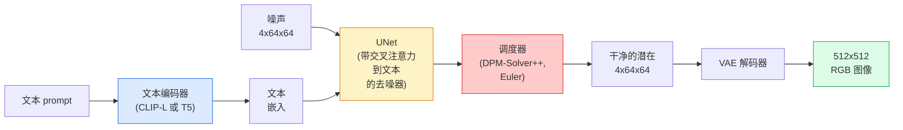

# Stable Diffusion — 架构与微调

> Stable Diffusion 是一个在预训练 VAE 的潜在空间中运行的 DDPM，通过交叉注意力以文本为条件，用快速确定性 ODE 求解器采样，并由无分类器引导操控。

**类型：** Learn + Use
**语言：** Python
**先修要求：** Phase 4 Lesson 10 (Diffusion), Phase 7 Lesson 02 (Self-Attention)
**时间：** ~75 分钟

## 学习目标

- 追踪 Stable Diffusion pipeline 的五个组件：VAE、文本编码器、U-Net、调度器、安全检查器——以及每个组件的实际职责
- 解释潜在扩散以及为什么在 4x64x64 潜在空间（而非 3x512x512 图像）中训练可以将计算量减少 48 倍而不损失质量
- 使用 `diffusers` 生成图像、执行图像到图像、修复和 ControlNet 引导生成
- 在小规模自定义数据集上用 LoRA 微调 Stable Diffusion，并在推理时加载 LoRA 适配器

## 问题

直接在 512x512 RGB 图像上训练 DDPM 很昂贵。每个训练步都通过一个处理 3x512x512 = 786,432 个输入值的 U-Net 进行反向传播，而采样需要经过同一个 U-Net 的 50 多次前向传播。在 Stable Diffusion 1.5（2022 年发布）的质量水平上，像素空间扩散大约需要 256 个 GPU 月的训练时间，并且在消费级 GPU 上每张图像需要 10-30 秒。

使得开源文本到图像变得实用的技巧是**潜在扩散**（Rombach 等，CVPR 2022）。训练一个 VAE，将 3x512x512 图像映射到 4x64x64 潜在张量再映射回去，然后在潜在空间中进行扩散。计算量减少 `(3*512*512)/(4*64*64) = 48 倍`。采样从数十秒降到同一 GPU 上的两秒以内。

几乎每个现代图像生成模型——SDXL、SD3、FLUX、HunyuanDiT、Wan-Video——都是潜在扩散模型，在自编码器、去噪器（U-Net 或 DiT）和文本条件方面有变体。学会 Stable Diffusion，你就学会了模板。

## 概念

### Pipeline



- **VAE**——冻结的自编码器。编码器将图像转为潜在表示（用于 img2img 和训练）。解码器将潜在表示转回图像。
- **文本编码器**——CLIP 文本编码器（SD 1.x/2.x）、CLIP-L + CLIP-G（SDXL）或 T5-XXL（SD3/FLUX）。产生一组 Token 嵌入。
- **U-Net**——去噪器。具有交叉注意力层，在每个分辨率级别从潜在表示关注文本嵌入。
- **调度器**——采样算法（DDIM、Euler、DPM-Solver++）。选择 sigma，将预测噪声混合回潜在表示。
- **安全检查器**——可选的 NSFW / 非法内容过滤器，在输出图像上运行。

### 无分类器引导（CFG）

纯文本条件学习对每个 prompt `c` 的 `epsilon_theta(x_t, t, c)`。CFG 训练同一个网络，其中有 10% 的时间 `c` 被丢弃（替换为空嵌入），得到一个既能预测条件噪声也能预测无条件噪声的单一模型。在推理时：

```
eps = eps_uncond + w * (eps_cond - eps_uncond)
```

`w` 是引导强度。`w=0` 是无条件，`w=1` 是纯条件，`w>1` 将输出推向"更受 prompt 约束"的方向，但以牺牲多样性为代价。SD 默认值是 `w=7.5`。

CFG 是文本到图像能在生产级质量上工作的原因。没有它，prompt 对输出的偏向很弱；有了它，prompt 占据主导。

### 潜在空间几何

VAE 的 4 通道潜在表示不仅仅是压缩图像。它是一个流形，其中算术运算大致对应于语义编辑（prompt 工程和插值都在这里运作），扩散 U-Net 在这里分配了它整个建模预算。解码一个随机的 4x64x64 潜在表示不会产生看起来随机的图像——它会产生垃圾，因为只有潜在空间的特定子流形才能解码为有效图像。

两个推论：

1. **Img2img** = 将图像编码到潜在空间，添加部分噪声，运行去噪器，解码。图像结构得以保留因为编码几乎是可逆的；内容根据 prompt 改变。
2. **修复（Inpainting）** = 与 img2img 相同，但去噪器只更新被遮罩区域；未遮罩区域保持编码后的潜在值不变。

### U-Net 架构

SD U-Net 是 Lesson 10 中 TinyUNet 的放大版本，增加了三项：

- **Transformer 块**位于每个空间分辨率，包含自注意力 + 对文本嵌入的交叉注意力。
- **时间嵌入**通过 MLP 作用于正弦编码。
- **跳跃连接**在编码器和解码器之间匹配分辨率。

SD 1.5 的总参数量：~860M。SDXL：~2.6B。FLUX：~12B。参数增长主要在注意力层。

### LoRA 微调

对 Stable Diffusion 进行全量微调需要 20+ GB 的显存并更新 860M 参数。LoRA（Low-Rank Adaptation）保持基模型冻结，将小的秩分解矩阵注入到注意力层中。一个 SD 的 LoRA 适配器通常为 10-50 MB，在单个消费级 GPU 上训练 10-60 分钟，并在推理时作为即插即用的修改加载。

```
原始：  W_q : (d_in, d_out)   冻结
LoRA：  W_q + alpha * (A @ B)  其中 A : (d_in, r), B : (r, d_out)

r 通常为 4-32。
```

LoRA 是几乎所有社区微调模型的发布方式。CivitAI 和 Hugging Face 托管了数百万个。

### 你会遇到的调度器

- **DDIM**——确定性，约 50 步，简单。
- **Euler ancestral**——随机，30-50 步，样本略微更具创意。
- **DPM-Solver++ 2M Karras**——确定性，20-30 步，生产默认。
- **LCM / TCD / Turbo**——一致性模型和蒸馏变体；1-4 步，以一定质量损失为代价。

在 `diffusers` 中切换调度器只需一行代码，有时无需任何重新训练就能修复采样问题。

## Build It

本课端到端地使用 `diffusers`，而不是从头重新构建 Stable Diffusion。你需要重建的组件（VAE、文本编码器、U-Net、调度器）是各自课程的主题；这里的目标是熟练使用生产 API。

### 步骤 1：文本到图像

```python
import torch
from diffusers import StableDiffusionPipeline

pipe = StableDiffusionPipeline.from_pretrained(
    "runwayml/stable-diffusion-v1-5",
    torch_dtype=torch.float16,
).to("cuda")

image = pipe(
    prompt="a dog riding a skateboard in tokyo, studio ghibli style",
    guidance_scale=7.5,
    num_inference_steps=25,
    generator=torch.Generator("cuda").manual_seed(42),
).images[0]
image.save("dog.png")
```

`float16` 将显存减半，无明显质量损失。用默认 DPM-Solver++ 的 `num_inference_steps=25` 与用 DDIM 的 `num_inference_steps=50` 效果相当。

### 步骤 2：交换调度器

```python
from diffusers import DPMSolverMultistepScheduler, EulerAncestralDiscreteScheduler

pipe.scheduler = DPMSolverMultistepScheduler.from_config(pipe.scheduler.config)
pipe.scheduler = EulerAncestralDiscreteScheduler.from_config(pipe.scheduler.config)
```

调度器状态与 U-Net 权重解耦。你可以在 DDPM 上训练，用任意调度器采样。

### 步骤 3：图像到图像

```python
from diffusers import StableDiffusionImg2ImgPipeline
from PIL import Image

img2img = StableDiffusionImg2ImgPipeline.from_pretrained(
    "runwayml/stable-diffusion-v1-5",
    torch_dtype=torch.float16,
).to("cuda")

init_image = Image.open("dog.png").convert("RGB").resize((512, 512))
out = img2img(
    prompt="a dog riding a skateboard, oil painting",
    image=init_image,
    strength=0.6,
    guidance_scale=7.5,
).images[0]
```

`strength` 是去噪前添加噪声的量（0.0 = 不变，1.0 = 完全重新生成）。风格迁移的标准范围是 0.5-0.7。

### 步骤 4：修复

```python
from diffusers import StableDiffusionInpaintPipeline

inpaint = StableDiffusionInpaintPipeline.from_pretrained(
    "runwayml/stable-diffusion-inpainting",
    torch_dtype=torch.float16,
).to("cuda")

image = Image.open("dog.png").convert("RGB").resize((512, 512))
mask = Image.open("dog_mask.png").convert("L").resize((512, 512))

out = inpaint(
    prompt="a cat",
    image=image,
    mask_image=mask,
    guidance_scale=7.5,
).images[0]
```

遮罩中的白色像素是要重新生成的区域。黑色像素被保留。

### 步骤 5：LoRA 加载

```python
pipe.load_lora_weights("sayakpaul/sd-lora-ghibli")
pipe.fuse_lora(lora_scale=0.8)

image = pipe(prompt="a village square in ghibli style").images[0]
```

`lora_scale` 控制强度；0.0 = 无效果，1.0 = 完全效果。`fuse_lora` 将适配器就地烘焙到权重中以提高速度，但会阻止切换。在加载不同适配器之前调用 `pipe.unfuse_lora()`。

### 步骤 6：LoRA 训练（概要）

真正的 LoRA 训练在 `peft` 或 `diffusers.training` 中。概览：

```python
# 伪代码
for step, batch in enumerate(dataloader):
    images, prompts = batch
    latents = vae.encode(images).latent_dist.sample() * 0.18215

    t = torch.randint(0, num_train_timesteps, (batch_size,))
    noise = torch.randn_like(latents)
    noisy_latents = scheduler.add_noise(latents, noise, t)

    text_emb = text_encoder(tokenizer(prompts))

    pred_noise = unet(noisy_latents, t, text_emb)  # LoRA 权重在此处注入

    loss = F.mse_loss(pred_noise, noise)
    loss.backward()
    optimizer.step()
```

只有 LoRA 矩阵接收梯度；基 U-Net、VAE 和文本编码器被冻结。batch size 为 1 并启用梯度检查点时，可装入 8 GB 显存。

## Use It

在生产环境中，你实际要做的决策：

- **模型系列**：SD 1.5 用于开源社区微调，SDXL 用于更高保真度，SD3 / FLUX 用于前沿效果和严格的许可要求。
- **调度器**：DPM-Solver++ 2M Karras 用于 20-30 步，LCM-LoRA 用于延迟低于 1 秒的场景。
- **精度**：`float16` 用于 4080/4090，`bfloat16` 用于 A100 及更新型号，`int8`（通过 `bitsandbytes` 或 `compel`）用于显存紧张时。
- **条件控制**：纯文本即可工作；如需更强的控制，在基 pipeline 之上添加 ControlNet（canny、depth、pose）。

对于批量生成，`AUTO1111` / `ComfyUI` 是社区工具；对于生产 API，使用 `diffusers` + `accelerate` 或者 `optimum-nvidia` 配合 TensorRT 编译。

## Ship It

本课产出：

- `outputs/prompt-sd-pipeline-planner.md`——一个根据延迟预算、保真度目标和许可约束选择 SD 1.5 / SDXL / SD3 / FLUX 以及调度器和精度的 prompt。
- `outputs/skill-lora-training-setup.md`——一个为自定义数据集（包括标题、rank、batch size 和学习率）编写完整 LoRA 训练配置的 skill。

## 练习

1. **（简单）** 用 `guidance_scale` 在 `[1, 3, 5, 7.5, 10, 15]` 中为同一 prompt 生成图像。描述图像如何变化。在哪个引导值处出现伪影？
2. **（中等）** 取任意真实照片，在 `strength` 为 `[0.2, 0.4, 0.6, 0.8, 1.0]` 下通过 `StableDiffusionImg2ImgPipeline` 处理。哪个 strength 在保留构图的同时改变了风格？为什么 1.0 完全忽略输入？
3. **（困难）** 在单个主题（宠物、Logo、角色）的 10-20 张图像上训练 LoRA，生成包含该主题的新场景。报告产生最佳身份保留而不对输入图像过拟合的 LoRA rank 和训练步数。

## 关键术语

| 术语 | 人们怎么说 | 实际含义 |
|------|----------------|----------------------|
| 潜在扩散 | "在潜在空间中扩散" | 在 VAE 潜在空间（4x64x64）而非像素空间（3x512x512）中运行整个 DDPM；节省 48 倍计算 |
| VAE 缩放因子 | "0.18215" | 将 VAE 的原始潜在值重缩放到大致单位方差的常数；每个 SD pipeline 中硬编码 |
| 无分类器引导 | "CFG" | 混合条件和无条件噪声预测；最有影响力的单推理旋钮 |
| 调度器 | "采样器" | 将噪声 + 模型预测转化为去噪潜在轨迹的算法 |
| LoRA | "低秩适配器" | 小秩分解矩阵，微调注意力层而不触及基权重 |
| 交叉注意力 | "文本-图像注意力" | 从潜在 Token 到文本 Token 的注意力；在每个 U-Net 级别注入 prompt 信息 |
| ControlNet | "结构条件控制" | 一个单独训练的适配器，通过额外输入（canny、depth、pose、segmentation）操控 SD |
| DPM-Solver++ | "默认调度器" | 二阶确定性 ODE 求解器；2026 年在低步数（20-30）下质量最佳 |

## 延伸阅读

- [High-Resolution Image Synthesis with Latent Diffusion (Rombach et al., 2022)](https://arxiv.org/abs/2112.10752)——Stable Diffusion 论文；包含支撑该设计的每一次消融实验
- [Classifier-Free Diffusion Guidance (Ho & Salimans, 2022)](https://arxiv.org/abs/2207.12598)——CFG 论文
- [LoRA: Low-Rank Adaptation of Large Language Models (Hu et al., 2021)](https://arxiv.org/abs/2106.09685)——LoRA 最初为 NLP 设计；几乎未做改动就能迁移到 SD
- [diffusers documentation](https://huggingface.co/docs/diffusers)——适用于每个 SD / SDXL / SD3 / FLUX pipeline 的参考文档
