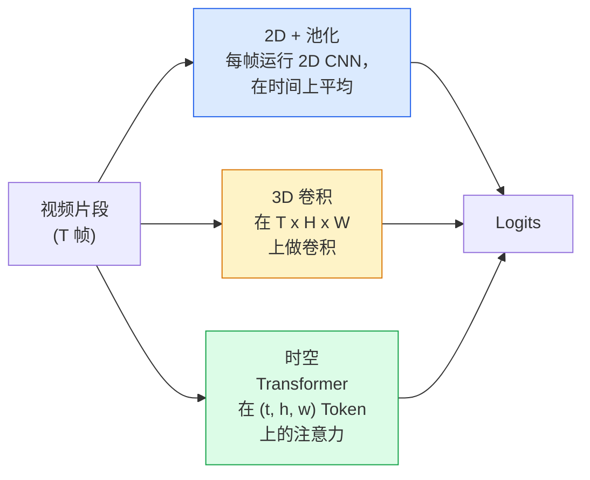

# 视频理解 — 时序建模

> 视频是一系列图像加上连接它们的物理规律。每个视频模型要么将时间视为一个额外轴（3D 卷积），要么视为一个要关注的时间序列（Transformer），要么视为一个先提取再池化的特征（2D+池化）。

**类型：** Learn + Build
**语言：** Python
**先修要求：** Phase 4 Lesson 03 (CNNs), Phase 4 Lesson 04 (Image Classification)
**时间：** ~45 分钟

## 学习目标

- 区分三种主要的视频建模方法（2D+池化、3D 卷积、时空 Transformer）并预测它们的计算成本和准确率权衡
- 在 PyTorch 中实现帧采样、时序池化和一个 2D+池化基线分类器
- 解释为什么 I3D 的"膨胀"后的 3D 卷积核能很好地从 ImageNet 权重迁移，以及分解后的 (2+1)D 卷积有何不同
- 阅读标准动作识别数据集和指标：Kinetics-400/600、UCF101、Something-Something V2；片段级别和视频级别的 top-1 准确率

## 问题

一段 30 fps 的 30 秒视频是 900 张图像。朴素地看，视频分类是图像分类运行 900 次之后加上某种聚合。当动作在几乎每一帧中可见（体育、烹饪、健身视频）时，这种方法有效；但当动作本身由运动定义时——"把某物从左推到右"在每一帧单独看都像两个静止物体——这种方法就会严重失败。

每个视频架构的核心问题是：时序结构什么时候被建模，如何建模？答案驱动着一切——计算成本、预训练策略、能否复用 ImageNet 权重、模型在哪些数据集上训练。

本课故意比静态图像课程更短。核心图像机制已经就位，视频理解主要关乎时序故事：采样、建模和聚合。

## 概念

### 三大架构家族



### 2D + 池化

取一个 2D CNN（ResNet、EfficientNet、ViT）。在每一帧采样上独立运行。对每帧的嵌入做平均（或最大池化、或注意力池化）。将池化向量送入分类器。

优点：
- ImageNet 预训练直接迁移。
- 实现最简单。
- 便宜：T 帧 * 单张图像推理成本。

缺点：
- 无法建模运动。动作 = 外观的聚合。
- 时序池化是顺序不变的；"开门"和"关门"看起来一样。

何时使用：以外观为主的任务、小视频数据集上的迁移学习、初始基线。

### 3D 卷积

用 3D (T, H, W) 卷积核替换 2D (H, W) 卷积核。网络同时在空间和时间上做卷积。早期家族：C3D、I3D、SlowFast。

I3D 技巧：取一个预训练的 2D ImageNet 模型，沿着一个新的时间轴复制每个 2D 卷积核来"膨胀"它。一个 3x3 的 2D 卷积变为 3x3x3 的 3D 卷积。这为 3D 模型提供了强大的预训练权重，而非从头训练。

优点：
- 直接建模运动。
- I3D 膨胀提供免费的迁移学习。

缺点：
- 比 2D 对应模型多 T/8 的 FLOPs（对于堆叠 3 次的时序核大小 3）。
- 时序核很小；长程运动需要金字塔或双流方法。

何时使用：运动本身就是信号的动作识别（Something-Something V2、运动较多的 Kinetics 类别）。

### 时空 Transformer

将视频 token 化为时空 patch 的网格，并在所有 token 之间做注意力。TimeSformer、ViViT、Video Swin、VideoMAE。

重要的注意力模式：
- **联合（Joint）**——对 (t, h, w) 的一个大注意力。复杂度是 `T*H*W` 的平方；昂贵。
- **分离（Divided）**——每个块两次注意力：一次在时间上，一次在空间上。接近线性缩放。
- **分解（Factorised）**——时间注意力与空间注意力在块之间交替。

优点：
- 在每个主要基准上达到 SOTA 准确率。
- 通过 patch 膨胀从图像 Transformer（ViT）迁移。
- 通过稀疏注意力支持长上下文视频。

缺点：
- 计算量大。
- 需要仔细选择注意力模式，否则运行时会爆炸。

何时使用：大数据集、高保真视频理解、多模态视频+文本任务。

### 帧采样

一个 10 秒片段在 30 fps 下是 300 帧；将所有 300 帧送入任何模型都是浪费。标准策略：

- **均匀采样**——在片段中均匀选取 T 帧。2D+池化的默认方法。
- **稠密采样**——随机选取连续的 T 帧窗口。3D 卷积常用，因为运动需要相邻帧。
- **多片段**——从同一视频采样多个 T 帧窗口，分别分类，在测试时平均预测。

T 通常是 8、16、32 或 64。T 越高 = 越多时序信号，同时计算量越大。

### 评估

两个级别：
- **片段级准确率**——模型看到一段 T 帧片段，报告 top-k。
- **视频级准确率**——每视频多个片段的片段级预测取平均；更高更稳定。

两个都要报告。片段 78% / 视频 82% 的模型严重依赖测试时平均；片段 80% / 视频 81% 的模型每个片段的鲁棒性更强。

### 你会遇到的数据集

- **Kinetics-400 / 600 / 700**——通用动作数据集。400k 片段；YouTube URL（很多现已失效）。
- **Something-Something V2**——由运动定义的动作（"将 X 从左移到右"）。2D+池化无法解决。
- **UCF-101**、**HMDB-51**——更旧、更小，仍然被报告。
- **AVA**——空间和时间上的动作*定位*；比分类更难。

## Build It

### 步骤 1：帧采样器

均匀采样和稠密采样器，作用于帧列表（或视频张量）。

```python
import numpy as np

def sample_uniform(num_frames_total, T):
    if num_frames_total <= T:
        return list(range(num_frames_total)) + [num_frames_total - 1] * (T - num_frames_total)
    step = num_frames_total / T
    return [int(i * step) for i in range(T)]


def sample_dense(num_frames_total, T, rng=None):
    rng = rng or np.random.default_rng()
    if num_frames_total <= T:
        return list(range(num_frames_total)) + [num_frames_total - 1] * (T - num_frames_total)
    start = int(rng.integers(0, num_frames_total - T + 1))
    return list(range(start, start + T))
```

两者都返回 T 个索引，用于切割视频张量。

### 步骤 2：一个 2D+池化基线

在每一帧上运行 2D ResNet-18，平均池化特征，分类。

```python
import torch
import torch.nn as nn
from torchvision.models import resnet18, ResNet18_Weights

class FramePool(nn.Module):
    def __init__(self, num_classes=400, pretrained=True):
        super().__init__()
        weights = ResNet18_Weights.IMAGENET1K_V1 if pretrained else None
        backbone = resnet18(weights=weights)
        self.features = nn.Sequential(*(list(backbone.children())[:-1]))  # 保留全局平均池化
        self.head = nn.Linear(512, num_classes)

    def forward(self, x):
        # x: (N, T, 3, H, W)
        N, T = x.shape[:2]
        x = x.view(N * T, *x.shape[2:])
        feats = self.features(x).view(N, T, -1)
        pooled = feats.mean(dim=1)
        return self.head(pooled)

model = FramePool(num_classes=10)
x = torch.randn(2, 8, 3, 224, 224)
print(f"output: {model(x).shape}")
print(f"params: {sum(p.numel() for p in model.parameters()):,}")
```

一千一百万参数，ImageNet 预训练，每帧运行，平均，分类。这个基线在外观为主的任务上通常离正确的 3D 模型只有 5-10 分的差距——有时甚至更好，因为它复用了更强的 ImageNet 骨干。

### 步骤 3：一个 I3D 风格的膨胀 3D 卷积

通过沿着新时间轴重复权重，将单个 2D 卷积转为 3D 卷积。

```python
def inflate_2d_to_3d(conv2d, time_kernel=3):
    out_c, in_c, kh, kw = conv2d.weight.shape
    weight_3d = conv2d.weight.data.unsqueeze(2)  # (out, in, 1, kh, kw)
    weight_3d = weight_3d.repeat(1, 1, time_kernel, 1, 1) / time_kernel
    conv3d = nn.Conv3d(in_c, out_c, kernel_size=(time_kernel, kh, kw),
                        padding=(time_kernel // 2, conv2d.padding[0], conv2d.padding[1]),
                        stride=(1, conv2d.stride[0], conv2d.stride[1]),
                        bias=False)
    conv3d.weight.data = weight_3d
    return conv3d

conv2d = nn.Conv2d(3, 64, kernel_size=3, padding=1, bias=False)
conv3d = inflate_2d_to_3d(conv2d, time_kernel=3)
print(f"2D 权重形状:  {tuple(conv2d.weight.shape)}")
print(f"3D 权重形状:  {tuple(conv3d.weight.shape)}")
x = torch.randn(1, 3, 8, 56, 56)
print(f"3D 输出形状:  {tuple(conv3d(x).shape)}")
```

除以 `time_kernel` 保持激活值幅度大致不变——这对于第一次前向传播时不破坏 batch-norm 统计量很重要。

### 步骤 4：分解 (2+1)D 卷积

将一个 3D 卷积拆分为一个 2D（空间）和一个 1D（时间）卷积。相同的感受野，更少的参数，在某些基准上更好的准确率。

```python
class Conv2Plus1D(nn.Module):
    def __init__(self, in_c, out_c, kernel_size=3):
        super().__init__()
        mid_c = (in_c * out_c * kernel_size * kernel_size * kernel_size) \
                // (in_c * kernel_size * kernel_size + out_c * kernel_size)
        self.spatial = nn.Conv3d(in_c, mid_c, kernel_size=(1, kernel_size, kernel_size),
                                 padding=(0, kernel_size // 2, kernel_size // 2), bias=False)
        self.bn = nn.BatchNorm3d(mid_c)
        self.act = nn.ReLU(inplace=True)
        self.temporal = nn.Conv3d(mid_c, out_c, kernel_size=(kernel_size, 1, 1),
                                  padding=(kernel_size // 2, 0, 0), bias=False)

    def forward(self, x):
        return self.temporal(self.act(self.bn(self.spatial(x))))

c = Conv2Plus1D(3, 64)
x = torch.randn(1, 3, 8, 56, 56)
print(f"(2+1)D 输出: {tuple(c(x).shape)}")
```

一个完整的 R(2+1)D 网络就是将一个 ResNet-18 的每个 3x3 卷积替换为 `Conv2Plus1D`。

## Use It

两个库覆盖了生产视频工作：

- `torchvision.models.video`——R(2+1)D、MViT、Swin3D 搭载预训练的 Kinetics 权重。与图像模型相同的 API。
- `pytorchvideo`（Meta）——模型库、用于 Kinetics / SSv2 / AVA 的数据加载器、标准变换。

对于视觉-语言视频模型（视频字幕、视频问答），使用 `transformers`（`VideoMAE`、`VideoLLaMA`、`InternVideo`）。

## Ship It

本课产出：

- `outputs/prompt-video-architecture-picker.md`——一个根据外观 vs 运动、数据集大小和计算预算选择 2D+池化 / I3D / (2+1)D / Transformer 的 prompt。
- `outputs/skill-frame-sampler-auditor.md`——一个检查视频 pipeline 的采样器并标记常见错误的 skill：差一索引、当 `num_frames < T` 时不均匀采样、缺少保持宽高比的裁剪等。

## 练习

1. **（简单）** 计算 FramePool（T=8）与 I3D 风格的 3D ResNet（T=8）的 FLOPs（近似值）。说明为什么 2D+池化便宜 3-5 倍。
2. **（中等）** 生成一个合成视频数据集：随机球体沿随机方向移动，按运动方向标注（"左到右"、"右到左"、"对角线向上"）。在上面训练 FramePool。证明它达到接近随机的准确率，证明外观本身不足以完成运动任务。
3. **（困难）** 通过将 ResNet-18 中每个 Conv2d 替换为 `Conv2Plus1D` 来构建一个 R(2+1)D-18。从 ImageNet 预训练的 ResNet-18 膨胀第一个卷积的权重。在练习 2 的运动数据集上训练并击败 FramePool。

## 关键术语

| 术语 | 人们怎么说 | 实际含义 |
|------|----------------|----------------------|
| 2D + 池化 | "逐帧分类器" | 在每一帧采样上运行 2D CNN，跨时间平均池化特征，分类 |
| 3D 卷积 | "时空卷积核" | 在 (T, H, W) 上做卷积的卷积核；原生建模运动 |
| 膨胀 | "将 2D 权重提升到 3D" | 通过沿着新时间轴重复 2D 卷积权重初始化 3D 卷积权重，然后除以 kernel_T 以保持激活值规模 |
| (2+1)D | "分解卷积" | 将 3D 拆分为 2D 空间 + 1D 时间；更少参数，之间多一次非线性 |
| 分离注意力 | "先时间，再空间" | 每层做两次注意力的 Transformer 块：一次对同一帧的 Token，一次对同一位置的 Token |
| 片段 | "T 帧窗口" | 一个采样的 T 帧子序列；视频模型消费的单位 |
| 片段 vs 视频准确率 | "两种评估设置" | 片段 = 每个视频一个样本，视频 = 多个采样片段的平均 |
| Kinetics | "视频的 ImageNet" | 400-700 个动作类别，300k+ YouTube 片段，标准视频预训练语料 |

## 延伸阅读

- [I3D: Quo Vadis, Action Recognition (Carreira & Zisserman, 2017)](https://arxiv.org/abs/1705.07750)——引入膨胀和 Kinetics 数据集
- [R(2+1)D: A Closer Look at Spatiotemporal Convolutions (Tran et al., 2018)](https://arxiv.org/abs/1711.11248)——分解卷积，仍然是一个强基线
- [TimeSformer: Is Space-Time Attention All You Need? (Bertasius et al., 2021)](https://arxiv.org/abs/2102.05095)——第一个强大的视频 Transformer
- [VideoMAE (Tong et al., 2022)](https://arxiv.org/abs/2203.12602)——用于视频的掩码自编码器预训练；当前主流的预训练配方
