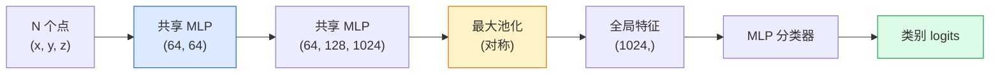

# 3D 视觉 — 点云与 NeRFs

> 3D 视觉有两种风格。点云是传感器的原始输出。NeRF 是学习得到的体积场。两者都回答了"空间中什么在哪儿"。

**类型：** Learn + Build
**语言：** Python
**先修要求：** Phase 4 Lesson 03 (CNNs), Phase 1 Lesson 12 (Tensor Operations)
**时间：** ~45 分钟

## 学习目标

- 区分显式（点云、网格、体素）和隐式（有符号距离场、NeRF）3D 表示以及各自的使用场景
- 理解 PointNet 的对称函数技巧，使神经网络对无序点集具有排列不变性
- 追踪 NeRF 的前向传播：光线投射、体积渲染、位置编码、MLP 密度+颜色头
- 使用 `nerfstudio` 或 `instant-ngp` 从小规模位姿图像集合进行预训练 3D 重建

## 问题

相机产生 2D 图像。LIDAR 产生一组没有顺序的 3D 点。运动恢复结构 pipeline 产生稀疏的 3D 关键点云。NeRF 从少量已知位姿的图像重建整个 3D 场景。所有这些都是"视觉"，但都不像 CNN 所期望的稠密张量。

3D 视觉很重要，因为几乎所有高价值的机器人任务都在 3D 中运行：抓取、避障、导航、AR 遮挡、3D 内容采集。只懂 2D 图像的视觉工程师被锁在该领域增长最快的部分之外（AR/VR 内容、机器人、自动驾驶技术栈、用于房地产或建筑的基于 NeRF 的 3D 重建）。

两种表示因不同原因占据主导地位。点云是传感器免费提供给你的。NeRF 及其后继者（3D Gaussian Splatting、神经 SDF）是当你让神经网络学习一个场景时所得到的结果。

## 概念

### 点云

点云是 R^3 中 N 个点的无序集合，每个点可选择性带有特征（颜色、强度、法线）。

```
cloud = [
  (x1, y1, z1, r1, g1, b1),
  (x2, y2, z2, r2, g2, b2),
  ...
  (xN, yN, zN, rN, gN, bN),
]
```

没有网格，没有连通性。两个属性使这对神经网络很困难：

- **排列不变性**——输出不能依赖于点的顺序。
- **可变的 N**——单个模型必须处理不同大小的点云。

PointNet（Qi 等，2017）用一个想法解决了这两个问题：对每个点应用共享 MLP，然后用对称函数（最大池化）聚合。结果是一个不依赖于顺序的固定大小向量。

```
f(P) = max_{p in P} MLP(p)
```

这是 PointNet 的整个核心。更深的变体（PointNet++、Point Transformer）增加了层次化采样和局部聚合，但对称函数技巧不变。

### PointNet 架构



"共享 MLP"意味着同一个 MLP 在每个点上独立运行。为提高效率，实现为点在维度上的 1x1 卷积。

### 神经辐射场 (NeRFs)

NeRF（Mildenhall 等，2020）将问题"我们能从 N 张照片重建一个 3D 场景吗？"的回答变成了一个神经网络——这个网络就是场景。网络将 `(x, y, z, viewing_direction)` 映射到 `(density, colour)`。渲染一个新视角就是在这网络上做一个光线投射循环。

```
NeRF MLP:  (x, y, z, theta, phi) -> (sigma, r, g, b)

渲染新视角的一个像素 (u, v)：
  1. 从相机穿过像素 (u, v) 投射一条光线
  2. 在光线上距离 t_1, t_2, ..., t_N 处采样
  3. 在每个点查询 MLP
  4. 按 (1 - exp(-sigma * dt)) 权重合成颜色
  5. 总和即为渲染的像素颜色
```

损失将渲染像素与训练照片中的真值像素进行比较。通过渲染步骤反向传播更新 MLP。没有 3D 真值，没有显式几何——场景存储在 MLP 权重中。

### NeRF 中的位置编码

一个纯粹对 `(x, y, z)` 的 MLP 无法表示高频细节，因为 MLP 在频谱上偏向低频。NeRF 通过在 MLP 之前将每个坐标编码为傅里叶特征向量来解决这个问题：

```
gamma(p) = (sin(2^0 pi p), cos(2^0 pi p), sin(2^1 pi p), cos(2^1 pi p), ...)
```

最多 L=10 个频率级别。这是 Transformer 用于位置编码的同一技巧，并再次出现在扩散时间条件中（Lesson 10）。没有它，NeRF 看起来很模糊。

### 体积渲染

```
C(r) = sum_i T_i * (1 - exp(-sigma_i * delta_i)) * c_i

T_i  = exp(- sum_{j<i} sigma_j * delta_j)
delta_i = t_{i+1} - t_i
```

`T_i` 是透射率——有多少光能到达点 i。`(1 - exp(-sigma_i * delta_i))` 是点 i 的不透明度。`c_i` 是颜色。最终像素是沿光线的加权和。

### 什么取代了 NeRF

纯 NeRF 训练慢（数小时），渲染也慢（每张图像数秒）。此后的发展谱系：

- **Instant-NGP**（2022）——哈希网格编码替代 MLP 的位置输入；训练只需数秒。
- **Mip-NeRF 360**——处理无界场景和反锯齿。
- **3D Gaussian Splatting**（2023）——用数百万个 3D 高斯替代体积场；训练只需数分钟，实时渲染。当前生产默认。

到 2026 年，几乎所有真实的 NeRF 产品实际上都是 3D Gaussian Splatting。但思维模型仍然是 NeRF。

### 数据集和基准

- **ShapeNet**——将 3D CAD 模型作为点云进行分类和分割。
- **ScanNet**——真实室内扫描用于分割。
- **KITTI**——用于自动驾驶的室外 LIDAR 点云。
- **NeRF Synthetic** / **Blended MVS**——用于视角合成的位姿图像数据集。
- **Mip-NeRF 360** 数据集——无界真实场景。

## Build It

### 步骤 1：PointNet 分类器

```python
import torch
import torch.nn as nn

class PointNet(nn.Module):
    def __init__(self, num_classes=10):
        super().__init__()
        self.mlp1 = nn.Sequential(
            nn.Conv1d(3, 64, 1),    nn.BatchNorm1d(64),   nn.ReLU(inplace=True),
            nn.Conv1d(64, 64, 1),   nn.BatchNorm1d(64),   nn.ReLU(inplace=True),
        )
        self.mlp2 = nn.Sequential(
            nn.Conv1d(64, 128, 1),  nn.BatchNorm1d(128),  nn.ReLU(inplace=True),
            nn.Conv1d(128, 1024, 1), nn.BatchNorm1d(1024), nn.ReLU(inplace=True),
        )
        self.head = nn.Sequential(
            nn.Linear(1024, 512),   nn.BatchNorm1d(512),  nn.ReLU(inplace=True),
            nn.Dropout(0.3),
            nn.Linear(512, 256),    nn.BatchNorm1d(256),  nn.ReLU(inplace=True),
            nn.Dropout(0.3),
            nn.Linear(256, num_classes),
        )

    def forward(self, x):
        # x: (N, 3, num_points)——为 Conv1d 转置
        x = self.mlp1(x)
        x = self.mlp2(x)
        x = torch.max(x, dim=-1)[0]       # (N, 1024)
        return self.head(x)

pts = torch.randn(4, 3, 1024)
net = PointNet(num_classes=10)
print(f"output: {net(pts).shape}")
print(f"params: {sum(p.numel() for p in net.parameters()):,}")
```

约 1.6M 参数。每个点云处理 1,024 个点。

### 步骤 2：位置编码

```python
def positional_encoding(x, L=10):
    """
    x: (..., D) -> (..., D * 2 * L)
    """
    freqs = 2.0 ** torch.arange(L, dtype=x.dtype, device=x.device)
    args = x.unsqueeze(-1) * freqs * 3.141592653589793
    sinc = torch.cat([args.sin(), args.cos()], dim=-1)
    return sinc.reshape(*x.shape[:-1], -1)

x = torch.randn(5, 3)
y = positional_encoding(x, L=10)
print(f"输入:  {x.shape}")
print(f"编码后: {y.shape}     # (5, 60)")
```

乘以 `2^l * pi` 给出逐渐增高的频率。

### 步骤 3：Tiny NeRF MLP

```python
class TinyNeRF(nn.Module):
    def __init__(self, L_pos=10, L_dir=4, hidden=128):
        super().__init__()
        self.L_pos = L_pos
        self.L_dir = L_dir
        pos_dim = 3 * 2 * L_pos
        dir_dim = 3 * 2 * L_dir
        self.trunk = nn.Sequential(
            nn.Linear(pos_dim, hidden), nn.ReLU(inplace=True),
            nn.Linear(hidden, hidden),  nn.ReLU(inplace=True),
            nn.Linear(hidden, hidden),  nn.ReLU(inplace=True),
            nn.Linear(hidden, hidden),  nn.ReLU(inplace=True),
        )
        self.sigma = nn.Linear(hidden, 1)
        self.color = nn.Sequential(
            nn.Linear(hidden + dir_dim, hidden // 2), nn.ReLU(inplace=True),
            nn.Linear(hidden // 2, 3), nn.Sigmoid(),
        )

    def forward(self, x, d):
        x_enc = positional_encoding(x, self.L_pos)
        d_enc = positional_encoding(d, self.L_dir)
        h = self.trunk(x_enc)
        sigma = torch.relu(self.sigma(h)).squeeze(-1)
        rgb = self.color(torch.cat([h, d_enc], dim=-1))
        return sigma, rgb

nerf = TinyNeRF()
x = torch.randn(128, 3)
d = torch.randn(128, 3)
s, c = nerf(x, d)
print(f"sigma: {s.shape}   rgb: {c.shape}")
```

相比于原始 NeRF（有 2 个深度为 8 的 MLP 主干）来说很小。足够展示架构了。

### 步骤 4：沿光线的体积渲染

```python
def volumetric_render(sigma, rgb, t_vals):
    """
    sigma: (..., N_samples)
    rgb:   (..., N_samples, 3)
    t_vals: (N_samples,) 沿光线的距离
    """
    delta = torch.cat([t_vals[1:] - t_vals[:-1], torch.full_like(t_vals[:1], 1e10)])
    alpha = 1.0 - torch.exp(-sigma * delta)
    trans = torch.cumprod(torch.cat([torch.ones_like(alpha[..., :1]), 1.0 - alpha + 1e-10], dim=-1), dim=-1)[..., :-1]
    weights = alpha * trans
    rendered = (weights.unsqueeze(-1) * rgb).sum(dim=-2)
    depth = (weights * t_vals).sum(dim=-1)
    return rendered, depth, weights


N = 64
t_vals = torch.linspace(2.0, 6.0, N)
sigma = torch.rand(N) * 0.5
rgb = torch.rand(N, 3)
rendered, depth, weights = volumetric_render(sigma, rgb, t_vals)
print(f"渲染颜色: {rendered.tolist()}")
print(f"深度:      {depth.item():.2f}")
```

一条光线，64 个采样点，合成为单个 RGB 像素和一个深度。

## Use It

对于实际工作：

- `nerfstudio`（Tancik 等）——NeRF / Instant-NGP / Gaussian Splatting 的当前参考库。命令行加 Web 查看器。
- `pytorch3d`（Meta）——可微分渲染、点云工具、网格操作。
- `open3d`——点云处理、配准、可视化。

对于部署，3D Gaussian Splatting 已基本取代了纯 NeRF，因为它渲染速度快 100 倍。重建质量相当。

## Ship It

本课产出：

- `outputs/prompt-3d-task-router.md`——一个根据任务和输入数据路由到正确 3D 表示（点云、网格、体素、NeRF、Gaussian Splat）的 prompt。
- `outputs/skill-point-cloud-loader.md`——一个为 .ply / .pcd / .xyz 文件编写 PyTorch `Dataset`，具有正确归一化、居中和点采样的 skill。

## 练习

1. **（简单）** 证明 PointNet 是排列不变的：将同一点云运行两次，一次将点打乱。验证输出相同，误差在浮点噪声范围内。
2. **（中等）** 实现一个最小光线生成函数，给定相机内参和位姿，生成 H x W 图像每个像素的光线原点和方向。
3. **（困难）** 在彩色立方体的渲染视图合成数据集上训练 TinyNeRF（通过可微分渲染或简单光线追踪器生成）。报告 epoch 1、10 和 100 的渲染损失。模型在哪个 epoch 产生可识别的视图？

## 关键术语

| 术语 | 人们怎么说 | 实际含义 |
|------|----------------|----------------------|
| 点云 | "来自 LIDAR 的 3D 点" | 每点带有可选特征的无序 (x, y, z) 集合 |
| PointNet | "点云上第一个神经网络" | 每个点共享 MLP + 对称（最大）池化；构造上排列不变 |
| NeRF | "MLP 就是场景" | 将 (x, y, z, dir) 映射到 (density, colour) 的网络；通过光线投射渲染 |
| 位置编码 | "傅里叶特征" | 将每个坐标编码到多个频率的 sin/cos 以克服 MLP 低频偏差 |
| 体积渲染 | "光线积分" | 使用透射率和 alpha 将沿光线的采样点合成为单个像素 |
| Instant-NGP | "哈希网格 NeRF" | 用多分辨率哈希网格替代 NeRF 的坐标 MLP；快 100-1000 倍 |
| 3D Gaussian Splatting | "数百万个高斯" | 场景 = 3D 高斯集合；实时渲染，训练只需数分钟 |
| SDF | "有符号距离场" | 返回到最近表面有符号距离的函数；另一种隐式表示 |

## 延伸阅读

- [PointNet (Qi et al., 2017)](https://arxiv.org/abs/1612.00593)——排列不变分类器
- [NeRF (Mildenhall et al., 2020)](https://arxiv.org/abs/2003.08934)——使从照片进行 3D 重建成为神经网络问题的论文
- [Instant-NGP (Müller et al., 2022)](https://arxiv.org/abs/2201.05989)——哈希网格，1000 倍加速
- [3D Gaussian Splatting (Kerbl et al., 2023)](https://arxiv.org/abs/2308.04079)——在生产中取代 NeRF 的架构
