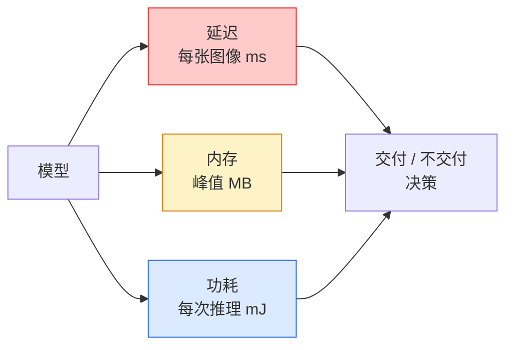

# 实时视觉 — 边缘部署

> 边缘推理是一门让 90 准确率的模型在有 2 GB 内存的设备上以 30 fps 运行的学科。每一个精度百分点都用来换取延迟毫秒数。

**类型：** Learn + Build
**语言：** Python
**先修要求：** Phase 4 Lesson 04 (Image Classification), Phase 10 Lesson 11 (Quantization)
**时间：** ~75 分钟

## 学习目标

- 测量任意 PyTorch 模型的推理延迟、峰值内存和吞吐量，并阅读 FLOPs / 参数 / 延迟之间的权衡
- 使用 PyTorch 的训练后量化将视觉模型量化为 INT8，验证精度损失 < 1%
- 导出到 ONNX 并用 ONNX Runtime 或 TensorRT 编译；列出三种最常见的导出失败及其修复方法
- 解释何时为边缘约束选择 MobileNetV3、EfficientNet-Lite、ConvNeXt-Tiny 或 MobileViT

## 问题

训练时的视觉模型是一个浮点怪兽。100M 参数，每次前向传播 10 GFLOPs，2 GB 显存。这些都不能装入手机、车载信息娱乐单元、工业相机或无人机。交付一个视觉系统意味着将相同的预测装入一个小 100 倍的预算。

三个旋钮完成大部分工作：模型选择（具有相同配方的更小架构）、量化（INT8 而非 FP32）和推理运行时（ONNX Runtime、TensorRT、Core ML、TFLite）。做对它们就是在一个工作站上能运行的演示和一个在 30 美元相机模块上交付的产品之间的区别。

本课首先建立测量纪律（你不能优化你无法测量的东西），然后演练三个旋钮。目标不是学习每个边缘运行时，而是知道存在什么杠杆以及如何验证每个杠杆确实做到了你认为的事。

## 概念

### 三个预算



- **延迟**: p50、p95、p99。只取 p50 平均会隐藏对实时系统很重要的尾部行为。
- **峰值内存**: 设备所见的最大值，而非稳态平均值。很重要，因为在嵌入式目标上 OOM 是致命的。
- **功耗 / 能量**: 电池供电设备每次推理的毫焦耳。通常由 CPU/GPU 利用率 * 时间代理。

一个 (模型, 延迟, 内存, 准确率) 表格就是边缘决策的依据。每个单元格都在目标设备上测量，而非工作站。

### 测量纪律

每个边缘分析应遵循三条规则：

1. 测量前用 5-10 次虚拟前向传播**预热**模型。冷缓存和 JIT 编译会产生不具有代表性的首批数值。
2. 在计时块前后用 `torch.cuda.synchronize()` **同步** GPU 工作负载。没有它，你测量的是内核调度，而非内核执行。
3. **固定输入尺寸**为生产分辨率。224x224 上的延迟不是 512x512 上的延迟。

### FLOPs 作为代理

FLOPs（每次推理的浮点操作数）是延迟的廉价、设备无关的代理。对架构比较有用，对绝对墙上时间有误导性。一个 FLOPs 多 10% 的模型在实践中可能快 2 倍，因为它使用了对硬件友好的操作（深度可分离卷积编译得好，大 7x7 卷积则不然）。

规则：用 FLOPs 进行架构搜索，用设备上的延迟做部署决策。

### 量化一句话

用 INT8 替换 FP32 权重和激活值。模型大小下降 4 倍，内存带宽下降 4 倍，在具有 INT8 内核的硬件（每个现代移动 SoC、每个有 Tensor Core 的 NVIDIA GPU）上计算下降 2-4 倍。视觉任务的精度损失通常为 0.1-1 个百分点，使用训练后静态量化。

类型：

- **动态** — 将权重量化为 INT8，激活值以 FP 计算。容易，速度提升小。
- **静态（训练后）** — 量化权重 + 在小校准集上校准激活值范围。比动态快得多。
- **量化感知训练（QAT）** — 在训练时模拟量化，使模型围绕它学习。最佳精度，需要标注数据。

对于视觉任务，训练后静态量化用 5% 的努力获得 95% 的收益。仅在 PTQ 精度损失不可接受时使用 QAT。

### 剪枝与蒸馏

- **剪枝** — 移除不重要的权重（基于幅度）或通道（结构化）。在过参数化的模型上效果好；在本来就紧凑的架构上用处不大。
- **蒸馏** — 训练一个小学生模型去模仿大教师模型的 logits。通常恢复因缩小模型而损失的大部分准确率。生产边缘模型的标准做法。

### 推理运行时

- **PyTorch eager** — 慢，不用于部署。仅用于开发。
- **TorchScript** — 旧版。已被 `torch.compile` 和 ONNX 导出取代。
- **ONNX Runtime** — 中性运行时。CPU、CUDA、CoreML、TensorRT、OpenVINO 都有 ONNX provider。从这里开始。
- **TensorRT** — NVIDIA 编译器。在 NVIDIA GPU（工作站和 Jetson）上延迟最佳。与 ONNX Runtime 集成或独立使用。
- **Core ML** — Apple 的 iOS/macOS 运行时。需要 `.mlmodel` 或 `.mlpackage`。
- **TFLite** — Google 的 Android/ARM 运行时。需要 `.tflite`。
- **OpenVINO** — Intel 的 CPU/VPU 运行时。需要 `.xml` + `.bin`。

实践：导出 PyTorch -> ONNX -> 为目标选择运行时。ONNX 是通用语言。

### 边缘架构选择器

| 预算 | 模型 | 原因 |
|--------|-------|-----|
| < 3M 参数 | MobileNetV3-Small | 到处可编译，好的基线 |
| 3-10M | EfficientNet-Lite-B0 | TFLite 上每参数最佳准确率 |
| 10-20M | ConvNeXt-Tiny | 每参数最佳准确率，CPU 友好 |
| 20-30M | MobileViT-S 或 EfficientViT | 具有 ImageNet 准确率的 Transformer |
| 30-80M | Swin-V2-Tiny | 如果技术栈支持窗口注意力 |

将它们全部量化到 INT8，除非你有特定理由不这样做。

## Build It

### 步骤 1：正确测量延迟

```python
import time
import torch

def measure_latency(model, input_shape, device="cpu", warmup=10, iters=50):
    model = model.to(device).eval()
    x = torch.randn(input_shape, device=device)
    with torch.no_grad():
        for _ in range(warmup):
            model(x)
        if device == "cuda":
            torch.cuda.synchronize()
        times = []
        for _ in range(iters):
            if device == "cuda":
                torch.cuda.synchronize()
            t0 = time.perf_counter()
            model(x)
            if device == "cuda":
                torch.cuda.synchronize()
            times.append((time.perf_counter() - t0) * 1000)
    times.sort()
    return {
        "p50_ms": times[len(times) // 2],
        "p95_ms": times[int(len(times) * 0.95)],
        "p99_ms": times[int(len(times) * 0.99)],
        "mean_ms": sum(times) / len(times),
    }
```

预热、同步、使用 `time.perf_counter()`。报告百分位数，不仅仅是均值。

### 步驟 2：参数和 FLOP 计数

```python
def parameter_count(model):
    return sum(p.numel() for p in model.parameters())

def flops_estimate(model, input_shape):
    """
    粗略的仅卷积/线性模型的 FLOP 计数。生产使用 `fvcore` 或 `ptflops`。
    """
    total = 0
    def conv_hook(m, inp, out):
        nonlocal total
        c_out, c_in, kh, kw = m.weight.shape
        h, w = out.shape[-2:]
        total += 2 * c_in * c_out * kh * kw * h * w
    def linear_hook(m, inp, out):
        nonlocal total
        total += 2 * m.in_features * m.out_features
    hooks = []
    for m in model.modules():
        if isinstance(m, torch.nn.Conv2d):
            hooks.append(m.register_forward_hook(conv_hook))
        elif isinstance(m, torch.nn.Linear):
            hooks.append(m.register_forward_hook(linear_hook))
    model.eval()
    with torch.no_grad():
        model(torch.randn(input_shape))
    for h in hooks:
        h.remove()
    return total
```

真实项目使用 `fvcore.nn.FlopCountAnalysis` 或 `ptflops`；它们正确处理每种模块类型。

### 步骤 3：训练后静态量化

```python
def quantise_ptq(model, calibration_loader, backend="x86"):
    import torch.ao.quantization as tq
    model = model.eval().cpu()
    model.qconfig = tq.get_default_qconfig(backend)
    tq.prepare(model, inplace=True)
    with torch.no_grad():
        for x, _ in calibration_loader:
            model(x)
    tq.convert(model, inplace=True)
    return model
```

三步：配置、准备（插入观察器）、用真实数据校准、转换（融合 + 量化）。需要模型被融合（`Conv -> BN -> ReLU` -> `ConvBnReLU`），`torch.ao.quantization.fuse_modules` 处理这个。

### 步骤 4：导出到 ONNX

```python
def export_onnx(model, sample_input, path="model.onnx"):
    model = model.eval()
    torch.onnx.export(
        model,
        sample_input,
        path,
        input_names=["input"],
        output_names=["output"],
        dynamic_axes={"input": {0: "batch"}, "output": {0: "batch"}},
        opset_version=17,
    )
    return path
```

`opset_version=17` 是 2026 年的安全默认。`dynamic_axes` 让你用任意 batch size 运行 ONNX 模型。

### 步骤 5：基准和对比例制

```python
import torch.nn as nn
from torchvision.models import mobilenet_v3_small

def compare_regimes():
    model = mobilenet_v3_small(weights=None, num_classes=10)
    params = parameter_count(model)
    flops = flops_estimate(model, (1, 3, 224, 224))
    lat_fp32 = measure_latency(model, (1, 3, 224, 224), device="cpu")
    print(f"FP32 MobileNetV3-Small: {params:,} params  {flops/1e9:.2f} GFLOPs  "
          f"p50={lat_fp32['p50_ms']:.2f}ms  p95={lat_fp32['p95_ms']:.2f}ms")
```

对 `resnet50`、`efficientnet_v2_s` 和 `convnext_tiny` 运行同样的函数，你就得到了部署决策所需的比较表。

## Use It

生产技术栈汇聚到三条路径之一：

- **Web / serverless**: PyTorch -> ONNX -> ONNX Runtime（CPU 或 CUDA provider）。最简单，对大多数够用。
- **NVIDIA 边缘（Jetson, GPU 服务器）**: PyTorch -> ONNX -> TensorRT。最佳延迟，最大工程投入。
- **移动端**: PyTorch -> ONNX -> Core ML（iOS）或 TFLite（Android）。导出前量化。

对于测量，`torch-tb-profiler`、`nvprof` / `nsys` 和 macOS 上的 Instruments 提供逐层分解。`benchmark_app`（OpenVINO）和 `trtexec`（TensorRT）提供独立的 CLI 数值。

## Ship It

本课产出：

- `outputs/prompt-edge-deployment-planner.md`——一个根据目标设备和延迟 SLA 选择骨干、量化策略和运行时的 prompt。
- `outputs/skill-latency-profiler.md`——一个编写完整延迟基准测试脚本的 skill，包括预热、同步、百分位数和内存跟踪。

## 练习

1. **（简单）** 在 CPU 上以 224x224 测量 `resnet18`、`mobilenet_v3_small`、`efficientnet_v2_s` 和 `convnext_tiny` 的 p50 延迟。报告该表并识别哪个架构具有最佳每毫秒准确率。
2. **（中等）** 对 `mobilenet_v3_small` 应用训练后静态量化。在 CIFAR-10 或类似的留出子集上报告 FP32 与 INT8 的延迟和精度损失。
3. **（困难）** 将 `convnext_tiny` 导出到 ONNX，用 `onnxruntime` 的 `CPUExecutionProvider` 运行，并与 PyTorch eager 基线比较延迟。识别 ONNX Runtime 更快的第一个层并解释原因。

## 关键术语

| 术语 | 人们怎么说 | 实际含义 |
|------|----------------|----------------------|
| 延迟 | "有多快" | 从输入到输出的时间；p50/p95/p99 百分位数，而非均值 |
| FLOPs | "模型大小" | 每次前向传播的浮点操作数；计算成本的粗略代理 |
| INT8 量化 | "8 位" | 用 8 位整数替换 FP32 权重/激活值；小约 4 倍，快 2-4 倍 |
| PTQ | "训练后量化" | 无需重新训练即量化已训练模型；容易，通常足够 |
| QAT | "量化感知训练" | 训练时模拟量化；最佳精度，需要标注数据 |
| ONNX | "中性格式" | 被每个主流推理运行时支持的模型交换格式 |
| TensorRT | "NVIDIA 编译器" | 将 ONNX 编译为 NVIDIA GPU 的优化引擎 |
| 蒸馏 | "教师 -> 学生" | 训练小模型模仿大模型的 logits；恢复大部分损失的准确率 |

## 延伸阅读

- [EfficientNet (Tan & Le, 2019)](https://arxiv.org/abs/1905.11946)——高效架构的复合缩放
- [MobileNetV3 (Howard et al., 2019)](https://arxiv.org/abs/1905.02244)——以移动端为先的架构，配备 h-swish 和 squeeze-excite
- [A Practical Guide to TensorRT Optimization (NVIDIA)](https://developer.nvidia.com/blog/accelerating-model-inference-with-tensorrt-tips-and-best-practices-for-pytorch-users/)——如何实际获得论文中的吞吐量数字
- [ONNX Runtime docs](https://onnxruntime.ai/docs/)——量化、图优化、provider 选择
