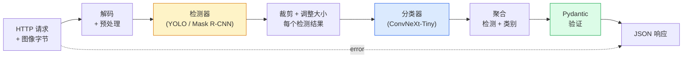

# 构建完整视觉 Pipeline — Capstone

> 一个生产视觉系统是由模型和规则通过数据合约串联而成的链条。组件已经在本 Phase 中——Capstone 将它们端到端地连接起来。

**类型：** Build
**语言：** Python
**先修要求：** Phase 4 Lessons 01-15
**时间：** ~120 分钟

## 学习目标

- 设计一个生产视觉 pipeline，检测物体、分类它们并发出结构化 JSON——每个失败路径都得到处理
- 将检测器（Mask R-CNN 或 YOLO）、分类器（ConvNeXt-Tiny）和数据合约（Pydantic）接入一个服务
- 性能基准测试端到端 pipeline 并识别第一个瓶颈（通常是预处理，然后是检测器）
- 交付一个最小 FastAPI 服务，接受图像上传，运行 pipeline，返回带有分类的检测结果

## 问题

单个视觉模型是有用的；视觉产品是它们的链条。零售货架审计是一个检测器加一个产品分类器加一个价格 OCR pipeline。自动驾驶是一个 2D 检测器加一个 3D 检测器加一个分割器加一个跟踪器加一个规划器。医疗预筛是一个分割器加一个区域分类器加一个临床医生 UI。

将这些链条连接在一起是将 ML 原型与产品区分开来的部分。模型之间的每个接口都是新的错误来源。每个坐标变换，每个归一化，每个掩码调整大小都是潜在的静默失败。pipeline 的强度取决于其最弱的接口。

本 Capstone 设立最小可行 pipeline：检测 + 分类 + 结构化输出 + 一个服务层。Phase 4 中的其他一切都可以插入这个骨架：将 Mask R-CNN 替换为 YOLOv8，添加一个 OCR 头，添加一个分割分支，添加一个跟踪器。架构是稳定的；组件是可插拔的。

## 概念

### Pipeline



七个阶段。两个模型阶段是昂贵的；其他五个阶段才是错误所在。

### 使用 Pydantic 的数据合约

每个模型边界变成一个类型化对象。这将静默失败变成响亮的失败。

```
Detection(
    box: tuple[float, float, float, float],   # (x1, y1, x2, y2), 绝对像素
    score: float,                              # [0, 1]
    class_id: int,                             # 来自检测器的标签映射
    mask: Optional[list[list[int]]],           # RLE 编码，如果存在
)

PipelineResult(
    image_id: str,
    detections: list[Detection],
    classifications: list[Classification],
    inference_ms: float,
)
```

当检测器返回 `(cx, cy, w, h)` 格式而非 `(x1, y1, x2, y2)` 的框时，Pydantic 的验证在边界处失败，你立即发现，而不是调试一个静默返回空区域的下游裁剪。

### 延迟分布

三个真理在几乎所有视觉 pipeline 中成立：

1. **预处理通常是最大的单一块。** 解码 JPEG、转换颜色空间、调整大小——这些都是 CPU 密集的，容易被遗忘。
2. **检测器主导 GPU 时间。** 70-90% 的 GPU 时间在检测器前向传播中。
3. **后处理（NMS、RLE 编码/解码）在 GPU 上便宜，在 CPU 上昂贵。** 始终用实际目标进行分析。

知道分布是将优化变成优先级列表的关键。

### 失败模式

- **空检测** — 返回空列表，不要崩溃。记录日志。
- **越界框** — 裁剪前钳制到图像大小。
- **微小裁剪** — 跳过小于分类器最小输入的框的分类。
- **损坏的上传** — 400 响应带上特定错误码，而非 500。
- **模型加载失败** — 在服务启动时失败，而非在第一次请求时。

一个生产 pipeline 处理以上每一个，而不写泛化的 `try/except` 来隐藏失败。每个失败获得一个命名代码和一个响应。

### 批处理

一个生产服务服务多个客户端。跨请求批处理检测和分类可以倍增吞吐量。权衡：等待 batch 填满带来的额外延迟。典型设置：收集请求最多 20ms，批处理，处理，分发响应。`torchserve` 和 `triton` 原生支持；负载可预测的小服务自己实现微型批量处理器。

## Build It

### 步骤 1：数据合约

```python
from pydantic import BaseModel, Field
from typing import List, Optional, Tuple

class Detection(BaseModel):
    box: Tuple[float, float, float, float]
    score: float = Field(ge=0, le=1)
    class_id: int = Field(ge=0)
    mask_rle: Optional[str] = None


class Classification(BaseModel):
    detection_index: int
    class_id: int
    class_name: str
    score: float = Field(ge=0, le=1)


class PipelineResult(BaseModel):
    image_id: str
    detections: List[Detection]
    classifications: List[Classification]
    inference_ms: float
```

五秒钟的代码能节省任何严肃 pipeline 上一小时的调试时间。

### 步骤 2：一个最小的 Pipeline 类

```python
import time
import numpy as np
import torch
from PIL import Image

class VisionPipeline:
    def __init__(self, detector, classifier, class_names,
                 device="cpu", min_crop=32):
        self.detector = detector.to(device).eval()
        self.classifier = classifier.to(device).eval()
        self.class_names = class_names
        self.device = device
        self.min_crop = min_crop

    def preprocess(self, image):
        """
        image: PIL.Image 或 np.ndarray (H, W, 3) uint8
        返回: 设备上的 CHW float 张量
        """
        if isinstance(image, Image.Image):
            image = np.asarray(image.convert("RGB"))
        tensor = torch.from_numpy(image).permute(2, 0, 1).float() / 255.0
        return tensor.to(self.device)

    @torch.no_grad()
    def detect(self, image_tensor):
        return self.detector([image_tensor])[0]

    @torch.no_grad()
    def classify(self, crops):
        if len(crops) == 0:
            return []
        batch = torch.stack(crops).to(self.device)
        logits = self.classifier(batch)
        probs = logits.softmax(-1)
        scores, cls = probs.max(-1)
        return list(zip(cls.tolist(), scores.tolist()))

    def run(self, image, image_id="anonymous"):
        t0 = time.perf_counter()
        tensor = self.preprocess(image)
        det = self.detect(tensor)

        crops = []
        detections = []
        valid_indices = []
        for i, (box, score, cls) in enumerate(zip(det["boxes"], det["scores"], det["labels"])):
            x1, y1, x2, y2 = [max(0, int(b)) for b in box.tolist()]
            x2 = min(x2, tensor.shape[-1])
            y2 = min(y2, tensor.shape[-2])
            detections.append(Detection(
                box=(x1, y1, x2, y2),
                score=float(score),
                class_id=int(cls),
            ))
            if (x2 - x1) < self.min_crop or (y2 - y1) < self.min_crop:
                continue
            crop = tensor[:, y1:y2, x1:x2]
            crop = torch.nn.functional.interpolate(
                crop.unsqueeze(0),
                size=(224, 224),
                mode="bilinear",
                align_corners=False,
            )[0]
            crops.append(crop)
            valid_indices.append(i)

        class_preds = self.classify(crops)

        classifications = []
        for valid_idx, (cls_id, cls_score) in zip(valid_indices, class_preds):
            classifications.append(Classification(
                detection_index=valid_idx,
                class_id=int(cls_id),
                class_name=self.class_names[cls_id],
                score=float(cls_score),
            ))

        return PipelineResult(
            image_id=image_id,
            detections=detections,
            classifications=classifications,
            inference_ms=(time.perf_counter() - t0) * 1000,
        )
```

每个接口都是类型化的。每个失败路径都有特定的处理决策。

### 步骤 3：连接检测器和分类器

```python
from torchvision.models.detection import maskrcnn_resnet50_fpn_v2
from torchvision.models import convnext_tiny

# 使用 ImageNet 预训练权重进行逼真的 pipeline，无需训练
detector = maskrcnn_resnet50_fpn_v2(weights="DEFAULT")
classifier = convnext_tiny(weights="DEFAULT")
class_names = [f"imagenet_class_{i}" for i in range(1000)]

pipe = VisionPipeline(detector, classifier, class_names)

# 用合成图像进行冒烟测试
test_image = (np.random.rand(400, 600, 3) * 255).astype(np.uint8)
result = pipe.run(test_image, image_id="demo")
print(result.model_dump_json(indent=2)[:500])
```

### 步骤 4：FastAPI 服务

```python
from fastapi import FastAPI, UploadFile, HTTPException
from io import BytesIO

app = FastAPI()
pipe = None  # 启动时初始化

@app.on_event("startup")
def load():
    global pipe
    detector = maskrcnn_resnet50_fpn_v2(weights="DEFAULT").eval()
    classifier = convnext_tiny(weights="DEFAULT").eval()
    pipe = VisionPipeline(detector, classifier, class_names=[f"c{i}" for i in range(1000)])

@app.post("/detect")
async def detect_endpoint(file: UploadFile):
    if file.content_type not in {"image/jpeg", "image/png", "image/webp"}:
        raise HTTPException(status_code=400, detail="不支持的图像类型")
    data = await file.read()
    try:
        img = Image.open(BytesIO(data)).convert("RGB")
    except Exception:
        raise HTTPException(status_code=400, detail="无法解码图像")
    result = pipe.run(img, image_id=file.filename or "upload")
    return result.model_dump()
```

用 `uvicorn main:app --host 0.0.0.0 --port 8000` 运行。用 `curl -F 'file=@dog.jpg' http://localhost:8000/detect` 测试。

### 步骤 5：性能基准测试 pipeline

```python
import time

def benchmark(pipe, num_runs=20, image_size=(400, 600)):
    img = (np.random.rand(*image_size, 3) * 255).astype(np.uint8)
    pipe.run(img)  # 预热

    stages = {"preprocess": [], "detect": [], "classify": [], "total": []}
    for _ in range(num_runs):
        t0 = time.perf_counter()
        tensor = pipe.preprocess(img)
        t1 = time.perf_counter()
        det = pipe.detect(tensor)
        t2 = time.perf_counter()
        crops = []
        for box in det["boxes"]:
            x1, y1, x2, y2 = [max(0, int(b)) for b in box.tolist()]
            x2 = min(x2, tensor.shape[-1])
            y2 = min(y2, tensor.shape[-2])
            if (x2 - x1) >= pipe.min_crop and (y2 - y1) >= pipe.min_crop:
                crop = tensor[:, y1:y2, x1:x2]
                crop = torch.nn.functional.interpolate(
                    crop.unsqueeze(0), size=(224, 224), mode="bilinear", align_corners=False
                )[0]
                crops.append(crop)
        pipe.classify(crops)
        t3 = time.perf_counter()
        stages["preprocess"].append((t1 - t0) * 1000)
        stages["detect"].append((t2 - t1) * 1000)
        stages["classify"].append((t3 - t2) * 1000)
        stages["total"].append((t3 - t0) * 1000)

    for stage, times in stages.items():
        times.sort()
        print(f"{stage:12s}  p50={times[len(times)//2]:7.1f} ms  p95={times[int(len(times)*0.95)]:7.1f} ms")
```

CPU 上的典型输出：预处理 ~3 ms，检测 300-500 ms，分类 20-40 ms，总计 350-550 ms。在 GPU 上，检测为 20-40 ms，预处理和分类相对而言开始更重要。

## Use It

生产模板收敛到相同结构，加上：

- **模型版本控制** — 始终在响应中记录模型名称和权重哈希。
- **每个请求的 Trace ID** — 记录每个请求的每个阶段时序，以便将慢响应与阶段关联。
- **回退路径** — 如果分类器超时，返回不带分类的检测结果，而不是使整个请求失败。
- **安全检查过滤器** — NSFW / PII 过滤器在分类后、响应离开服务之前运行。
- **批量端点** — 一个 `/detect_batch` 接受图像 URL 列表用于批量处理。

对于生产服务，`torchserve`、`Triton Inference Server` 和 `BentoML` 开箱即用处理批处理、版本控制、指标和健康检查。直接运行 `FastAPI` 对原型和小规模产品没问题。

## Ship It

本课产出：

- `outputs/prompt-vision-service-shape-reviewer.md`——一个审查视觉服务代码的合约/响应形状违规并指出第一个破坏性错误的 prompt。
- `outputs/skill-pipeline-budget-planner.md`——一个给定目标延迟和吞吐量，为每个 pipeline 阶段分配时间预算并标记哪个阶段将首先超出预算的 skill。

## 练习

1. **（简单）** 在任意开放数据集的 10 张图像上运行 pipeline。报告每个阶段的平均时间和每张图像检测数量的分布。
2. **（中等）** 向 `Detection` 添加掩码输出字段并以 RLE 编码。验证即使是 10 个对象的图像，JSON 也保持在 1MB 以下。
3. **（困难）** 在分类器前添加一个微型批量处理器：收集裁剪画面最多 10 ms，一次性在一个 GPU 调用中分类所有，返回每个请求的结果。测量在每秒 5 个并发请求下的吞吐量增益和添加的延迟。

## 关键术语

| 术语 | 人们怎么说 | 实际含义 |
|------|----------------|----------------------|
| Pipeline | "系统" | 预处理、推理和后处理步骤的有序链条，每对之间有类型化接口 |
| 数据合约 | "Schema" | 每个阶段输入和输出遵循的 Pydantic / dataclass 定义；在边界处捕获集成错误 |
| 预处理 | "模型之前" | 解码、颜色转换、调整大小、归一化；通常是最大的 CPU 时间槽 |
| 后处理 | "模型之后" | NMS、掩码调整大小、阈值、RLE 编码；在 GPU 上便宜，在 CPU 上昂贵 |
| 微型批量处理器 | "收集然后前向传播" | 等待固定窗口多个请求、运行一次批量前向传播的聚合器 |
| Trace ID | "请求 ID" | 在每个阶段记录的每个请求标识符，以便端到端追踪慢请求 |
| 失败代码 | "命名错误" | 每个失败类别的特定错误码，而非泛化的 500；使客户端重试逻辑成为可能 |
| 健康检查 | "就绪探测" | 报告服务是否可以应答的廉价端点；负载均衡器依赖它 |

## 延伸阅读

- [Full Stack Deep Learning — Deploying Models](https://fullstackdeeplearning.com/course/2022/lecture-5-deployment/)——生产 ML 部署的经典概述
- [BentoML docs](https://docs.bentoml.com)——具有批处理、版本控制和指标的 serving 框架
- [torchserve docs](https://pytorch.org/serve/)——PyTorch 的官方 serving 库
- [NVIDIA Triton Inference Server](https://developer.nvidia.com/triton-inference-server)——具有批处理和多模型支持的高吞吐量 serving
