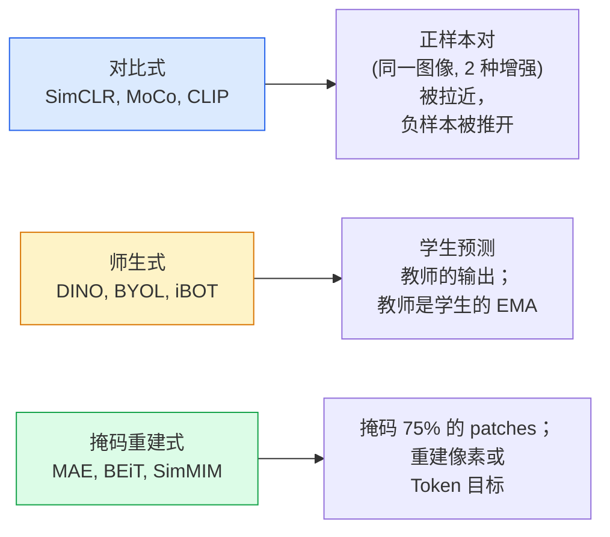

# 自监督视觉 — SimCLR, DINO, MAE

> 标签是监督式视觉的瓶颈。自监督预训练将其移除：从 1 亿张无标签图像中学习视觉特征，在 1 万张有标签图像上微调。

**类型：** Learn + Build
**语言：** Python
**先修要求：** Phase 4 Lesson 04 (Image Classification), Phase 4 Lesson 14 (ViT)
**时间：** ~75 分钟

## 学习目标

- 追踪三大自监督家族——对比式（SimCLR）、师生式（DINO）、掩码重建式（MAE）——并陈述每个优化的是什么
- 从头实现 InfoNCE 损失并解释为什么 512 的 batch 有效但 32 的 batch 失败
- 解释为什么 MAE 的 75% 掩码比例不是任意的，以及它与 BERT 对文本的 15% 有何不同
- 使用 DINOv2 或 MAE ImageNet 检查点进行线性探测和零样本检索

## 问题

监督式 ImageNet 有 130 万张标注图像，估计花费 1000 万美元进行标注。医疗和工业数据集更小，标注成本更高。每个视觉团队都在问：我们能否在廉价的无标签数据上预训练——YouTube 帧、网络爬取、网络摄像头画面、卫星扫描——然后在小的标注集上微调？

自监督学习是答案。一个在 LAION 或 JFT 上训练的现代自监督 ViT 在微调时达到或超过监督式 ImageNet 准确率。它还在下游任务（检测、分割、深度）上比监督预训练有更好的迁移效果。DINOv2（Meta, 2023）和 MAE（Meta, 2022）是当前可迁移视觉特征的生产默认方案。

概念上的转变是，前置任务——模型被训练去做的事——不必是下游任务。重要的是它迫使模型学习有用的特征。预测灰度图像的颜色、旋转图像并让模型分类旋转角度、掩码 patches 并重建它们——这些都有效。三种能够扩展的方法是对比学习、师生蒸馏和掩码重建。

## 概念

### 三大系列



### 对比学习（SimCLR）

取一张图像，应用两种随机增强，得到两个视图。将两者送入相同的编码器加一个投影头。最小化一个损失，该损失表示"这两个嵌入应该接近"并且"这个嵌入应该远离 batch 中其他所有图像的嵌入。"

```
批次中 2N 个视图中正样本对 (z_i, z_j) 的损失：

   L_ij = -log( exp(sim(z_i, z_j) / tau) / sum_k in batch \ {i} exp(sim(z_i, z_k) / tau) )

sim = 余弦相似度
tau = 温度（标准为 0.1）
```

这就是 InfoNCE 损失。它需要每个正样本有大量负样本，所以 batch size 很重要——SimCLR 需要 512-8192。MoCo 引入了一个动量队列来将负样本数量与 batch size 解耦。

### 师生式（DINO）

两个具有相同架构的网络：学生和教师。教师是学生权重的指数移动平均（EMA）。两者都看到图像的增强视图。学生的输出被训练去匹配教师的——没有显式的负样本。

```
loss = CE( student_output(view_1),  teacher_output(view_2) )
     + CE( student_output(view_2),  teacher_output(view_1) )

teacher_weights = m * teacher_weights + (1 - m) * student_weights   (m ≈ 0.996)
```

为什么它不会崩溃到"预测一个常数"：教师的输出被居中（减去每维均值）和锐化（除以小温度）。居中防止一个维度主导；锐化防止输出崩溃到均匀分布。

DINO 就是 DINOv2 扩大规模的基础，在 1.42 亿张精选图像上训练。产生的特征是当前零样本视觉检索和稠密预测的 SOTA。

### 掩码重建（MAE）

掩码 ViT 输入的 75% patches。只将可见的 25% 通过编码器。一个小解码器接收编码器的输出加上掩码位置的掩码 Token，并被训练去重建被掩码 patches 的像素。

```
编码器：  可见的 25% patches -> 特征
解码器：  特征 + 掩码位置的掩码 Token -> 重建像素
损失：    仅在掩码 patches 上重建像素与原始像素之间的 MSE
```

使 MAE 有效的关键设计选择：

- **75% 掩码比例**——高。迫使编码器学习语义特征；重建 25% 将几乎是平凡的（相邻像素高度相关，CNN 可以轻松搞定）。
- **不对称编码器/解码器**——大的 ViT 编码器只看到可见 patches；一个小解码器（8 层，512 维）处理重建。比朴素的 BEiT 预训练快 3 倍。
- **像素空间重建目标**——比 BEiT 的 Token 化目标更简单，在 ViT 上效果更好。

预训练后，丢弃解码器。编码器是特征提取器。

### 为什么是 75% 而不是 15%

BERT 掩码 15% 的 Token。MAE 掩码 75%。区别在于信息密度。

- 自然语言每个 Token 具有高熵。预测 15% 的 Token 仍然困难，因为每个掩码位置有许多可能的补全。
- 图像 patches 具有低熵——一个未被掩码的邻域通常几乎完全可以确定掩码 patch 的像素。为了使预测需要语义理解，你必须激进地掩码。

75% 足够高，简单的空间外推无法解决任务；编码器必须表示图像内容。

### 线性探测评估

自监督预训练后，标准评估是**线性探测**：冻结编码器，在 ImageNet 标签上训练一个单层线性分类器。报告 top-1 准确率。

- SimCLR ResNet-50: ~71%（2020）
- DINO ViT-S/16: ~77%（2021）
- MAE ViT-L/16: ~76%（2022）
- DINOv2 ViT-g/14: ~86%（2023）

线性探测是特征质量的纯度量；微调通常增加 2-5 分，但也混入了分类头重新训练的影响。

## Build It

### 步骤 1：双视图增强 pipeline

```python
import torch
import torchvision.transforms as T

two_view_train = lambda: T.Compose([
    T.RandomResizedCrop(96, scale=(0.2, 1.0)),
    T.RandomHorizontalFlip(),
    T.ColorJitter(0.4, 0.4, 0.4, 0.1),
    T.RandomGrayscale(p=0.2),
    T.ToTensor(),
])


class TwoViewDataset(torch.utils.data.Dataset):
    def __init__(self, base):
        self.base = base
        self.aug = two_view_train()

    def __len__(self):
        return len(self.base)

    def __getitem__(self, i):
        img, _ = self.base[i]
        v1 = self.aug(img)
        v2 = self.aug(img)
        return v1, v2
```

每个 `__getitem__` 返回同一张图像的两个增强视图；不需要标签。

### 步骤 2：InfoNCE 损失

```python
import torch.nn.functional as F

def info_nce(z1, z2, tau=0.1):
    """
    z1, z2: (N, D) 配对视图的 L2 归一化嵌入
    """
    N, D = z1.shape
    z = torch.cat([z1, z2], dim=0)  # (2N, D)
    sim = z @ z.T / tau              # (2N, 2N)

    mask = torch.eye(2 * N, dtype=torch.bool, device=z.device)
    sim = sim.masked_fill(mask, float("-inf"))

    targets = torch.cat([torch.arange(N, 2 * N), torch.arange(0, N)]).to(z.device)
    return F.cross_entropy(sim, targets)
```

调用前 L2 归一化嵌入。`tau=0.1` 是 SimCLR 默认值；更低使损失更锐利，需要更多负样本。

### 步骤 3：InfoNCE 健全检查

```python
z1 = F.normalize(torch.randn(16, 32), dim=-1)
z2 = z1.clone()
loss_same = info_nce(z1, z2, tau=0.1).item()
z2_random = F.normalize(torch.randn(16, 32), dim=-1)
loss_random = info_nce(z1, z2_random, tau=0.1).item()
print(f"相同配对的 InfoNCE:     {loss_same:.3f}")
print(f"随机配对的 InfoNCE:     {loss_random:.3f}")
```

相同配对应给出低损失（对于大 batch 和冷温度接近 0）。随机配对应为 log(2N-1) = ~log(31) = ~3.4，当 16 对 batch 时。

### 步骤 4：MAE 风格的掩码

```python
def random_mask_indices(num_patches, mask_ratio=0.75, seed=0):
    g = torch.Generator().manual_seed(seed)
    n_keep = int(num_patches * (1 - mask_ratio))
    perm = torch.randperm(num_patches, generator=g)
    visible = perm[:n_keep]
    masked = perm[n_keep:]
    return visible.sort().values, masked.sort().values


num_patches = 196
visible, masked = random_mask_indices(num_patches, mask_ratio=0.75)
print(f"可见: {len(visible)} / {num_patches}")
print(f"掩码: {len(masked)} / {num_patches}")
```

简单、快速，对给定种子确定。真实 MAE 实现会批处理并保持每个样本的掩码。

## Use It

DINOv2 是 2026 年的生产标准：

```python
import torch
from transformers import AutoImageProcessor, AutoModel

processor = AutoImageProcessor.from_pretrained("facebook/dinov2-base")
model = AutoModel.from_pretrained("facebook/dinov2-base")
model.eval()

# 用于零样本检索的每图像嵌入
with torch.no_grad():
    inputs = processor(images=[pil_image], return_tensors="pt")
    outputs = model(**inputs)
    embedding = outputs.last_hidden_state[:, 0]  # CLS Token
```

产生的 768 维嵌入是现代图像检索、稠密对应和零样本迁移 pipeline 的骨干。在下游任务上微调很少需要一个以上的线性分类头。

对于图像-文本嵌入，SigLIP 或 OpenCLIP 是等价选择；对于 MAE 风格的微调，`timm` 仓库提供了每个 MAE 检查点。

## Ship It

本课产出：

- `outputs/prompt-ssl-pretraining-picker.md`——一个根据数据集大小、计算量和下游任务选择 SimCLR / MAE / DINOv2 的 prompt。
- `outputs/skill-linear-probe-runner.md`——一个为任意冻结编码器 + 标注数据集编写线性探测评估的 skill。

## 练习

1. **（简单）** 验证：对于对齐良好的嵌入，InfoNCE 损失随温度降低而下降；对于随机嵌入，损失随温度降低而上升。产生 `tau in [0.05, 0.1, 0.2, 0.5]` vs 损失的图。
2. **（中等）** 实现一个 DINO 风格的居中缓冲区。证明没有居中，学生会在几个 epoch 内崩溃到常数向量。
3. **（困难）** 使用 Lesson 10 的 TinyUNet 作为骨干在 CIFAR-100 上训练 MAE。报告 10、50 和 200 个 epoch 的线性探测准确率。证明 MAE 预训练的线性探测在相同的 1,000 张图像子集上优于从头开始的监督线性探测。

## 关键术语

| 术语 | 人们怎么说 | 实际含义 |
|------|----------------|----------------------|
| 自监督 | "无标签" | 一个从无标签数据中产生有用表示的前置任务 |
| 前置任务 | "假任务" | SSL 期间使用的目标（重建 patches、匹配视图）；预训练后丢弃 |
| 线性探测 | "冻结编码器 + 线性分类头" | 标准 SSL 评估：仅在冻结特征上训练线性分类器 |
| InfoNCE | "对比损失" | 余弦相似度上的 softmax；正样本对是目标类别，其余为负样本 |
| EMA 教师 | "移动平均教师" | 教师权重是学生权重的指数移动平均；BYOL、MoCo、DINO 使用 |
| 掩码比例 | "% patches 隐藏" | MAE 期间被掩码的 patches 比例；视觉 75%，文本 15% |
| 表示崩溃 | "常数输出" | SSL 失败，编码器对所有输入输出常数向量；通过居中、锐化或负样本来防止 |
| DINOv2 | "生产 SSL 骨干" | Meta 2023 自监督 ViT；2026 年最强通用图像特征 |

## 延伸阅读

- [SimCLR (Chen et al., 2020)](https://arxiv.org/abs/2002.05709)——对比学习参考
- [DINO (Caron et al., 2021)](https://arxiv.org/abs/2104.14294)——带动量、居中、锐化的师生式方法
- [MAE (He et al., 2022)](https://arxiv.org/abs/2111.06377)——用于 ViT 的掩码自编码器预训练
- [DINOv2 (Oquab et al., 2023)](https://arxiv.org/abs/2304.07193)——将自监督 ViT 扩展到生产特征
