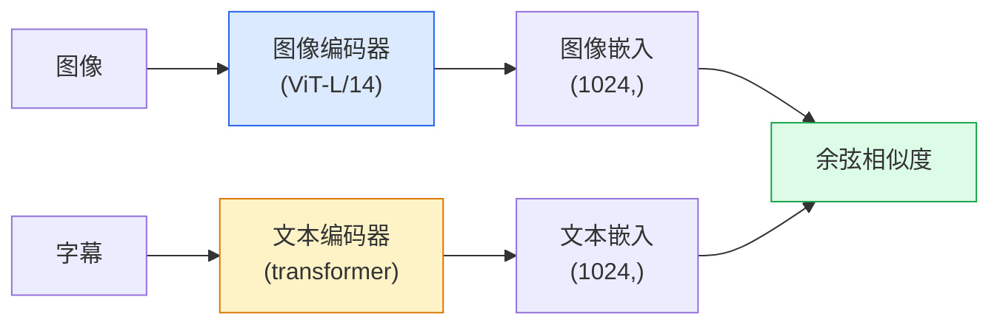

# 开放词汇视觉 — CLIP

> 同时训练一个图像编码器和一个文本编码器，使得匹配的（图像，字幕）对落在共享空间中的同一点。这就是全部技巧。

**类型：** Build + Use
**语言：** Python
**先修要求：** Phase 4 Lesson 14 (ViT), Phase 4 Lesson 17 (Self-Supervised)
**时间：** ~45 分钟

## 学习目标

- 解释 CLIP 的双塔架构和对比训练目标
- 使用预训练 CLIP（或 SigLIP）进行零样本分类，无需任何任务特定训练
- 从头实现零样本分类：编码类别 prompt，计算余弦相似度，取 argmax
- 区分 CLIP、SigLIP、OpenCLIP 和 LLaVA/LLaMA-vision 模型——2026 年各自用于什么

## 问题

传统分类器是封闭词汇的：一个 1000 类 ImageNet 模型只能预测 1000 个标签。每个新类别需要标注数据和重新训练的分类头。

CLIP（Radford 等，OpenAI 2021）证明了在从网络抓取的 4 亿个（图像，字幕）对上训练，产生了一个可以在推理时将任何类别集合进行分类的模型，类别纯粹用自然语言描述。你通过写一句话来给它一个新类别。

这个能力——零样本迁移——是为什么每个现代视觉系统都以 CLIP 家族检查点为起点的原因。检测（Grounding DINO、OWL-ViT）、分割（CLIPSeg、SAM）、检索、内容审核、VLM 和文本到图像生成都建立在 CLIP 风格的联合嵌入之上。

## 概念

### 双塔



两个编码器都以到相同嵌入维度（CLIP-B/32 为 512，CLIP-L/14 为 1024）的线性投影结束。进行 L2 归一化并计算余弦相似度。

### 目标

给定一个 N 对（图像，字幕）的 batch，构建 NxN 相似度矩阵。训练两个编码器使对角线（匹配对）具有高相似度，非对角线（不匹配）具有低相似度。

```
sim_matrix = image_embeddings @ text_embeddings.T / tau

loss_i2t = cross_entropy(sim_matrix,       targets=arange(N))
loss_t2i = cross_entropy(sim_matrix.T,     targets=arange(N))
loss = (loss_i2t + loss_t2i) / 2
```

对称是因为图像到文本和文本到图像的检索都应有效。`tau`（温度）通常被学习为一个标量参数，初始化为 0.07。

### SigLIP：更好的损失

SigLIP（Zhai 等，2023）用逐对 sigmoid 替换了 softmax：

```
loss = mean over pairs of log(1 + exp(-y_ij * sim_ij))
y_ij = +1 如果匹配，否则 -1
```

逐对损失消除了 CLIP 所需的 batch 级别归一化。SigLIP 在小 batch size 下训练更好，在等量数据上匹敌或超过 CLIP。

### 零样本分类

给定一个训练好的 CLIP：

1. 为每个类别组合一个 prompt："a photo of a {class}"。
2. 用文本编码器编码所有类别 prompt -> `T` 形状 (C, d)。
3. 编码测试图像 -> `I` 形状 (1, d)。
4. 相似度 = `I @ T.T` 形状 (1, C)。
5. Argmax -> 预测类别。

Prompt 工程很重要。OpenAI 发布了 80 个 ImageNet prompt 模板（"a photo of a {}"、"a blurry photo of a {}"、"a sketch of a {}"……）。平均每个类别所有模板的嵌入可额外获得 1-3% 的 top-1 准确率。

### 2026 年 CLIP 风格模型的使用场景

- **零样本分类**——直接使用。
- **图像检索**——一次编码所有图像，在推理时用嵌入查询。
- **文本条件检测**——Grounding DINO、OWL-ViT 在检测器周围包装一个 CLIP 文本塔。
- **文本条件分割**——CLIPSeg；SAM 通过 CLIP 使用文本 prompt 输入。
- **VLM**——LLaVA、Qwen-VL、InternVL 将 CLIP 家族视觉编码器接入 LLM。
- **文本到图像生成**——Stable Diffusion、DALL-E 3 以 CLIP 文本嵌入为条件。

一旦你有了一个共享嵌入空间，每个视觉+语言任务就变成了距离计算。

## Build It

### 步骤 1：一个微型双塔模型

真实 CLIP 是 ViT + Transformer。在本课中，双塔是在预提取特征上的小型 MLP，这样在 CPU 上可以看到训练信号。

```python
import torch
import torch.nn as nn
import torch.nn.functional as F


class TwoTower(nn.Module):
    def __init__(self, img_in=128, txt_in=64, emb=64):
        super().__init__()
        self.image_proj = nn.Sequential(nn.Linear(img_in, 128), nn.ReLU(), nn.Linear(128, emb))
        self.text_proj = nn.Sequential(nn.Linear(txt_in, 128), nn.ReLU(), nn.Linear(128, emb))
        self.logit_scale = nn.Parameter(torch.ones([]) * 2.6592)  # ln(1/0.07)

    def forward(self, img_feats, txt_feats):
        i = F.normalize(self.image_proj(img_feats), dim=-1)
        t = F.normalize(self.text_proj(txt_feats), dim=-1)
        return i, t, self.logit_scale.exp()
```

两个投影，共享维度输出，可学习温度。与真实 CLIP API 形状相同。

### 步骤 2：对比损失

```python
def clip_loss(image_emb, text_emb, logit_scale):
    N = image_emb.size(0)
    sim = logit_scale * image_emb @ text_emb.T
    targets = torch.arange(N, device=sim.device)
    l_i = F.cross_entropy(sim, targets)
    l_t = F.cross_entropy(sim.T, targets)
    return (l_i + l_t) / 2
```

对称。更高的 logit_scale = 更锐利的 softmax = 更有信心但有不确定性风险。

### 步骤 3：零样本分类器

```python
@torch.no_grad()
def zero_shot_classify(model, image_feats, class_text_feats, class_names):
    """
    image_feats:      (N, img_in)
    class_text_feats: (C, txt_in)   每个类别一个平均嵌入
    """
    i = F.normalize(model.image_proj(image_feats), dim=-1)
    t = F.normalize(model.text_proj(class_text_feats), dim=-1)
    sim = i @ t.T
    pred = sim.argmax(dim=-1)
    return [class_names[p] for p in pred.tolist()]
```

每步一行。这是与生产 CLIP 检查点一起使用的精确零样本过程。

### 步骤 4：健全检查

```python
torch.manual_seed(0)
model = TwoTower()

img = torch.randn(8, 128)
txt = torch.randn(8, 64)
i, t, scale = model(img, txt)
loss = clip_loss(i, t, scale)
print(f"batch size: {i.size(0)}   损失: {loss.item():.3f}")
```

对于随机初始化的模型，损失应接近 `log(N) = log(8) = 2.08`——尚未学习任何结构时的对称交叉熵目标。

## Use It

OpenCLIP 是 2026 年的社区默认：

```python
import open_clip
import torch
from PIL import Image

model, _, preprocess = open_clip.create_model_and_transforms("ViT-B-32", pretrained="laion2b_s34b_b79k")
tokenizer = open_clip.get_tokenizer("ViT-B-32")

image = preprocess(Image.open("dog.jpg")).unsqueeze(0)
text = tokenizer(["a photo of a dog", "a photo of a cat", "a photo of a car"])

with torch.no_grad():
    image_features = model.encode_image(image)
    text_features = model.encode_text(text)
    image_features = image_features / image_features.norm(dim=-1, keepdim=True)
    text_features = text_features / text_features.norm(dim=-1, keepdim=True)
    probs = (100.0 * image_features @ text_features.T).softmax(dim=-1)

print(probs)
```

SigLIP 更新，在小规模上训练更好，新工作首选：`google/siglip-base-patch16-224`。Hugging Face 提供两者。

## Ship It

本课产出：

- `outputs/prompt-zero-shot-class-picker.md`——一个给定类别列表和领域，为零样本 CLIP 设计类别模板的 prompt。
- `outputs/skill-image-text-retriever.md`——一个用任意 CLIP 检查点构建图像嵌入索引，支持通过文本查询和通过图像查询的 skill。

## 练习

1. **（简单）** 使用预训练 OpenCLIP ViT-B/32 在 CIFAR-10 上用 80 模板 prompt 集做零样本分类。报告 top-1 准确率；应在 85-90% 左右。
2. **（中等）** 在同一 CIFAR-10 任务上比较单模板（"a photo of a {}"）vs 80 模板平均嵌入。量化差距并解释为什么模板有帮助。
3. **（困难）** 构建一个零样本图像检索索引：用 CLIP 嵌入 1,000 张图像，构建 FAISS 索引，用自然语言描述查询。为你手写的 20 个保留查询报告检索 recall@5。

## 关键术语

| 术语 | 人们怎么说 | 实际含义 |
|------|----------------|----------------------|
| 双塔 | "双编码器" | 分离的图像和文本编码器以共享维度投影头结束 |
| 零样本 | "无任务特定训练" | 在推理时仅由文本描述的类别中分类；未接触任何标签 |
| 温度 / logit_scale | "tau" | 在 softmax 之前缩放相似度矩阵的可学习标量 |
| Prompt 模板 | "a photo of a {}" | 围绕类别的自然语言包装；平均多个模板可提升零样本准确率 |
| CLIP | "图像+文本模型" | 2021 年 OpenAI 模型；2026 年领域的词汇 |
| SigLIP | "Sigmoid CLIP" | 用逐对 sigmoid 替换 softmax；在小 batch 下更好训练 |
| OpenCLIP | "开源复现" | 在 LAION 上社区训练的 CLIP 变体；开源 pipeline 的生产默认 |
| VLM | "视觉-语言模型" | 一个 CLIP 家族编码器加一个 LLM，训练为回答关于图像的问题 |

## 延伸阅读

- [CLIP: Learning Transferable Visual Models from Natural Language Supervision (Radford et al., 2021)](https://arxiv.org/abs/2103.00020)
- [SigLIP: Sigmoid Loss for Language-Image Pre-Training (Zhai et al., 2023)](https://arxiv.org/abs/2303.15343)
- [OpenCLIP](https://github.com/mlfoundations/open_clip)——社区代码库
- [DINOv2 vs CLIP vs MAE: a features comparison](https://huggingface.co/blog/dinov2)——并排使用案例的 HF 指南
