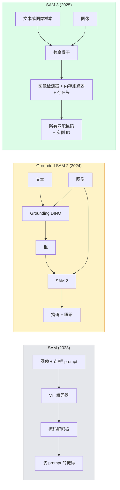

# SAM 3 与开放词汇分割

> 给模型一个文本 prompt 和一张图像，它为每个匹配的对象返回掩码。SAM 3 使其成为单次前向传播。

**类型：** Use + Build
**语言：** Python
**先修要求：** Phase 4 Lesson 07 (U-Net), Phase 4 Lesson 08 (Mask R-CNN), Phase 4 Lesson 18 (CLIP)
**时间：** ~60 分钟

## 学习目标

- 区分 SAM（仅视觉 prompt）、Grounded SAM / SAM 2（检测器 + SAM）和 SAM 3（通过 Promptable Concept Segmentation 原生文本 prompt）
- 解释 SAM 3 架构：共享骨干 + 图像检测器 + 基于内存的视频跟踪器 + 存在头 + 解耦检测器-跟踪器设计
- 使用 Hugging Face `transformers` 的 SAM 3 集成进行文本提示检测、分割和视频跟踪
- 基于延迟、概念复杂度和部署目标在 SAM 3、Grounded SAM 2、YOLO-World 和 SAM-MI 之间选择

## 问题

2023 年的 SAM 是仅视觉 prompt 模型：你点击一个点或画一个框，它返回一个掩码。对于"给我这张照片中所有的橙子"，你需要一个检测器（Grounding DINO）来产生框，然后 SAM 来分割每个。Grounded SAM 将其变成了一个 pipeline，但它是两个冻结模型的级联，不可避免地累积错误。

SAM 3（Meta, 2025 年 11 月, ICLR 2026）折叠了级联。它接受一个简短的名词短语或图像样本作为 prompt，并在单次前向传播中返回所有匹配的掩码和实例 ID。这就是 **Promptable Concept Segmentation (PCS)**。结合 2026 年 3 月的 Object Multiplex 更新（SAM 3.1），它能高效地在视频中跟踪同一概念的多个实例。

本课关乎这代表的结构性转变。2D 分割、检测和文本-图像 grounding 已合并为一个模型。生产问题不再是"我将哪个 pipeline 链在一起"，而是"哪个可提示模型端到端处理我的用例。"

## 概念

### 三代



### Promptable Concept Segmentation

一个"概念 prompt"是简短的名词短语（`"yellow school bus"`、`"striped red umbrella"`、`"hand holding a mug"`）或图像样本。模型为图像中匹配该概念的每个实例返回分割掩码，加上每个匹配的唯一实例 ID。

这与经典的视觉 prompt SAM 在三个方面不同：

1. 不需要逐实例 prompt——一个文本 prompt 返回所有匹配。
2. 开放词汇——概念可以是任何能用自然语言描述的东西。
3. 一次返回多个实例而不是每个 prompt 一个掩码。

### 关键架构组件

- **共享骨干**——单个 ViT 处理图像。检测器头和基于内存的跟踪器都从中读取。
- **存在头**——预测概念是否存在于图像中。将"这个在这儿吗？"与"它在哪儿？"解耦。减少在不存在概念上的误报。
- **解耦检测器-跟踪器**——图像级检测和视频级跟踪有独立的头，以免相互干扰。
- **内存库**——跨帧存储逐实例特征用于视频跟踪（SAM 2 使用的相同机制）。

### 大规模训练

SAM 3 在由数据引擎通过 AI + 人工审核迭代标注和纠正生成的**400 万个唯一概念**上训练。新的 **SA-CO 基准**包含 270K 个唯一概念，比先前基准大 50 倍。SAM 3 在 SA-CO 上达到人类性能的 75-80%，并在图像 + 视频 PCS 上相比现有系统翻倍。

### SAM 3.1 Object Multiplex

2026 年 3 月更新：**Object Multiplex** 引入了共享内存机制，用于一次联合跟踪同一概念的多个实例。此前，跟踪 N 个实例意味着 N 个独立的内存库。Multiplex 将其折叠为带逐实例查询的单个共享内存。结果：多对象跟踪显著更快而不牺牲准确率。

### 2026 年 Grounded SAM 仍然重要的地方

- 当你需要交换特定的开放词汇检测器时（DINO-X、Florence-2）。
- 当 SAM 3 的许可（HF 上的门控访问）是障碍时。
- 当你需要比 SAM 3 暴露的更多的检测器阈值控制时。
- 用于检测器组件的研究 / 消融工作。

模块化 pipeline 仍有其位置。对于大多数生产工作，SAM 3 是更简单的答案。

### YOLO-World vs SAM 3

- **YOLO-World**——仅开放词汇检测（无掩码）。实时。适合需要高 fps 框的场景。
- **SAM 3**——完整分割 + 跟踪。更慢但输出更丰富。

生产分工：YOLO-World 用于仅快速检测的 pipeline（机器人导航、快速仪表盘），SAM 3 用于任何需要掩码或跟踪的场景。

### SAM-MI 效率

SAM-MI（2025-2026）解决了 SAM 的解码器瓶颈。关键思想：

- **稀疏点 prompt**——使用少量精心选择的点而非稠密 prompt；减少解码器调用 96%。
- **浅层掩码聚合**——将粗糙的掩码预测合并为一个更锐利的掩码。
- **解耦掩码注入**——解码器接收预计算的掩码特征而非重新运行。

结果：在开放词汇基准上比 Grounded-SAM 快约 1.6 倍。

### 三个模型的输出格式

三者都返回相同的一般结构（框 + 标签 + 分数 + 掩码 + ID），这很有帮助——你的下游 pipeline 不必根据运行了哪个模型而分支。

## Build It

### 步骤 1：Prompt 构建

构建一个将用户句子转换为 SAM 3 概念 prompt 列表的辅助函数。这是"用户输入了什么"与"模型消费了什么"相遇的边界。

```python
def split_concepts(sentence):
    """
    多概念 prompt 的启发式分割器。
    返回简短名词短语列表。
    """
    for sep in [",", ";", "and", "or", "&"]:
        if sep in sentence:
            parts = [p.strip() for p in sentence.replace("and ", ",").split(",")]
            return [p for p in parts if p]
    return [sentence.strip()]

print(split_concepts("cats, dogs and balloons"))
```

SAM 3 每次前向传播接受一个概念；对于多概念查询，循环或批处理它们。

### 步骤 2：后处理辅助函数

将 SAM 3 的原始输出转换为符合我们 Phase 4 Lesson 16 pipeline 合约的干净检测列表。

```python
from dataclasses import dataclass
from typing import List

@dataclass
class ConceptDetection:
    concept: str
    instance_id: int
    box: tuple          # (x1, y1, x2, y2)
    score: float
    mask_rle: str       # run-length encoded


def rle_encode(binary_mask):
    flat = binary_mask.flatten().astype("uint8")
    runs = []
    prev, count = flat[0], 0
    for v in flat:
        if v == prev:
            count += 1
        else:
            runs.append((int(prev), count))
            prev, count = v, 1
    runs.append((int(prev), count))
    return ";".join(f"{v}x{c}" for v, c in runs)
```

RLE 即使是许多高分辨率掩码也能保持响应负载小。相同格式适用于 SAM 2、SAM 3、Grounded SAM 2。

### 步骤 3：统一开放词汇分割接口

将任何后端（SAM 3、Grounded SAM 2、YOLO-World + SAM 2）包装在单个方法后面。你的下游代码在后端更改时不会改变。

```python
from abc import ABC, abstractmethod
import numpy as np

class OpenVocabSeg(ABC):
    @abstractmethod
    def detect(self, image: np.ndarray, concept: str) -> List[ConceptDetection]:
        ...


class StubOpenVocabSeg(OpenVocabSeg):
    """
    当未加载真实模型时用于 pipeline 测试的确定性桩。
    """
    def detect(self, image, concept):
        h, w = image.shape[:2]
        return [
            ConceptDetection(
                concept=concept,
                instance_id=0,
                box=(w * 0.2, h * 0.3, w * 0.5, h * 0.8),
                score=0.89,
                mask_rle="0x100;1x50;0x200",
            ),
            ConceptDetection(
                concept=concept,
                instance_id=1,
                box=(w * 0.55, h * 0.25, w * 0.85, h * 0.75),
                score=0.74,
                mask_rle="0x80;1x40;0x220",
            ),
        ]
```

真实的 `SAM3OpenVocabSeg` 子类将包装 `transformers.Sam3Model` 和 `Sam3Processor`。

### 步骤 4：Hugging Face SAM 3 用法（参考）

对于实际模型，`transformers` 集成：

```python
from transformers import Sam3Processor, Sam3Model
import torch

processor = Sam3Processor.from_pretrained("facebook/sam3")
model = Sam3Model.from_pretrained("facebook/sam3").eval()

inputs = processor(images=pil_image, return_tensors="pt")
inputs = processor.set_text_prompt(inputs, "yellow school bus")

with torch.no_grad():
    outputs = model(**inputs)

masks = processor.post_process_masks(
    outputs.masks, inputs.original_sizes, inputs.reshaped_input_sizes
)
boxes = outputs.boxes
scores = outputs.scores
```

一个 prompt，所有匹配在单次调用中返回。

### 步骤 5：测量 Grounded SAM 2 免费给你了什么

一个诚实的基准：当你在真实 pipeline 中用 SAM 3 替换 Grounded SAM 2 时会发生什么？

- 延迟：SAM 3 节省一次前向传播（无单独检测器）但模型本身更重；通常净中性或略微加速。
- 准确率：SAM 3 在稀有或组合概念（"striped red umbrella"）上显著更好。在常见单词概念上相似。
- 灵活性：Grounded SAM 2 让你交换检测器（DINO-X、Florence-2、Grounding DINO 1.5）；SAM 3 是整体的。

结论：SAM 3 是 2026 年开放词汇分割的默认选择。当你需要检测器灵活性或不同的许可条款时，Grounded SAM 2 仍然是正确答案。

## Use It

生产部署模式：

- **实时标注**——SAM 3 + CVAT 的标签即文本 prompt 功能。标注员选择标签名；SAM 3 预标注每个匹配实例。审核并纠正。
- **视频分析**——SAM 3.1 Object Multiplex 用于多对象跟踪；将帧送入基于内存的跟踪器。
- **机器人**——SAM 3 用于开放词汇操作（"pick up the red cup"）；作为规划原语运行。
- **医学影像**——SAM 3 在医学概念上微调；需要在 HF 上申请访问。

Ultralytics 在其 Python 包中包装了 SAM 3：

```python
from ultralytics import SAM

model = SAM("sam3.pt")
results = model(image_path, prompts="yellow school bus")
```

与 YOLO 和 SAM 2 相同的接口。

## Ship It

本课产出：

- `outputs/prompt-open-vocab-stack-picker.md`——一个根据延迟、概念复杂度和许可选择 SAM 3 / Grounded SAM 2 / YOLO-World / SAM-MI 的 prompt。
- `outputs/skill-concept-prompt-designer.md`——一个将用户话术转换为格式良好的 SAM 3 概念 prompt（分割、消歧、回退）的 skill。

## 练习

1. **（简单）** 在 10 张图像上运行 SAM 3，使用你选择的概念 prompt。与 SAM 2 + Grounding DINO 1.5 比较相同图像。报告每个模型漏掉了哪些概念。
2. **（中等）** 在 SAM 3 之上构建一个"点击包含 / 点击排除"的 UI：文本 prompt 返回候选实例；用户点击保留哪些算作正例。以 JSON 输出最终概念集。
3. **（困难）** 在自定义概念集（例如 5 种电子元器件）上使用每个 20 张标注图像微调 SAM 3。与零样本 SAM 3 比较相同测试集；测量掩码 IoU 提升。

## 关键术语

| 术语 | 人们怎么说 | 实际含义 |
|------|----------------|----------------------|
| 开放词汇分割 | "按文本分割" | 为用自然语言描述的对象而非固定标签集产生掩码 |
| PCS | "Promptable Concept Segmentation" | SAM 3 的核心任务——给定一个名词短语或图像样本，分割所有匹配实例 |
| 概念 prompt | "文本输入" | 简短名词短语或图像样本；不是完整句子 |
| 存在头 | "它在吗？" | SAM 3 模块，在定位之前判断概念是否存在于图像中 |
| SA-CO | "SAM 3 基准" | 270K 概念开放词汇分割基准；比先前开放词汇基准大 50 倍 |
| Object Multiplex | "SAM 3.1 更新" | 共享内存多对象跟踪；多个实例的快速联合跟踪 |
| Grounded SAM 2 | "模块化 pipeline" | 检测器 + SAM 2 级联；当检测器交换很重要时仍相关 |
| SAM-MI | "高效 SAM 变体" | 掩码注入使 Grounded-SAM 速度提升 1.6 倍 |

## 延伸阅读

- [SAM 3: Segment Anything with Concepts (arXiv 2511.16719)](https://arxiv.org/abs/2511.16719)
- [SAM 3.1 Object Multiplex (Meta AI, March 2026)](https://ai.meta.com/blog/segment-anything-model-3/)
- [Hugging Face 上的 SAM 3 模型页面](https://huggingface.co/facebook/sam3)
- [Grounded SAM 2 tutorial (PyImageSearch)](https://pyimagesearch.com/2026/01/19/grounded-sam-2-from-open-set-detection-to-segmentation-and-tracking/)
- [Ultralytics SAM 3 文档](https://docs.ultralytics.com/models/sam-3/)
- [SAM3-I: Instruction-aware SAM (arXiv 2512.04585)](https://arxiv.org/abs/2512.04585)
