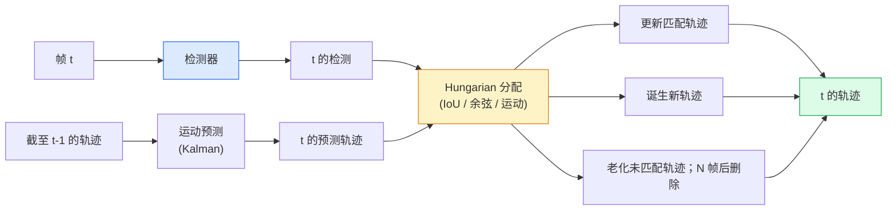

# 多对象跟踪与视频内存

> 跟踪是检测加关联。逐帧检测。将这一帧的检测与上一帧的轨迹按 ID 匹配。

**类型：** Build
**语言：** Python
**先修要求：** Phase 4 Lesson 06 (YOLO Detection), Phase 4 Lesson 08 (Mask R-CNN), Phase 4 Lesson 24 (SAM 3)
**时间：** ~60 分钟

## 学习目标

- 区分 tracking-by-detection 和基于查询的跟踪，并命名算法家族（SORT、DeepSORT、ByteTrack、BoT-SORT、SAM 2 内存跟踪器、SAM 3.1 Object Multiplex）
- 从零实现 IoU + Hungarian 分配用于经典 tracking-by-detection
- 解释 SAM 2 的内存库以及为什么它比基于 IoU 的关联更好地处理遮挡
- 阅读三个跟踪指标（MOTA、IDF1、HOTA）并为给定用例选择哪一个重要

## 问题

检测器告诉你单帧中物体在哪里。跟踪器告诉你第 `t` 帧的哪个检测与第 `t-1` 帧的检测是同一个物体。没有它，你无法计数过线的物体，跟踪球通过遮挡，或知道"4 号车在车道上已经 8 秒了。"

跟踪对每个面向视频的产品都至关重要：体育分析、监控、自动驾驶、医学视频分析、野生动物监测、品牌计数。核心构建模块是共享的：逐帧检测器、运动模型（Kalman 滤波器或更丰富的替代）、关联步骤（在 IoU / 余弦 / 已学习特征上的 Hungarian 算法）和轨迹生命周期（诞生、更新、死亡）。

2026 年带来了两种新模式：**SAM 2 基于内存的跟踪**（特征内存而非运动模型关联）和 **SAM 3.1 Object Multiplex**（同一概念的多个实例的共享内存）。本课首先讲解经典技术栈，然后是基于内存的方法。

## 概念

### Tracking-by-Detection



2026 年你将遇到的每个跟踪器都是这个循环的变体。区别：

- **SORT**（2016）：Kalman 滤波器 + IoU Hungarian。简单、快速、无外观模型。
- **DeepSORT**（2017）：SORT + 每个轨迹的基于 CNN 的外观特征（ReID 嵌入）。更好地处理交叉。
- **ByteTrack**（2021）：将低置信度检测作为第二阶段关联；无需外观特征但在 MOT17 上表现顶级。
- **BoT-SORT**（2022）：Byte + 相机运动补偿 + ReID。
- **StrongSORT / OC-SORT**——带有更好运动和外观的 ByteTrack 后代。

### Kalman 滤波器一句话

Kalman 滤波器维护逐轨迹状态 `(x, y, w, h, dx, dy, dw, dh)` 以及协方差。在每一帧，用常速模型**预测**状态，然后用匹配的检测**更新**。当预测不确定性高时更新更信任检测。这给出平滑的轨迹，并能在短时间遮挡（1-5 帧）中继续跟踪轨迹。

每个经典跟踪器都在运动预测步骤中使用 Kalman 滤波器。

### Hungarian 算法

给定 `M x N` 代价矩阵（轨迹 x 检测），找到最小化总代价的一对一分配。代价通常是 `1 - IoU(track_bbox, detection_bbox)` 或外观特征的负余弦相似度。运行时为 O((M+N)^3)；对于 M, N 约 1000 以内，通过 `scipy.optimize.linear_sum_assignment` 在 Python 中足够快。

### ByteTrack 的关键思想

标准跟踪器丢弃低置信度检测（< 0.5）。ByteTrack 将它们保留为**第二阶段候选**：在将轨迹匹配到高置信度检测后，未匹配的轨迹尝试用略微宽松的 IoU 阈值匹配低置信度检测。恢复短时间遮挡、人群附近的 ID 切换。

### SAM 2 基于内存的跟踪

SAM 2 通过维护逐实例时空特征的**内存库**来处理视频。给定一帧上的 prompt（点击、框、文本），它将实例编码到内存中。在后续帧上，内存与新帧的特征进行交叉注意力，解码器为新帧中的相同实例生成掩码。

没有 Kalman 滤波器，没有 Hungarian 分配。关联隐含在内存-注意力操作中。

优点：
- 对大型遮挡具有鲁棒性（内存跨多帧携带实例身份）。
- 与 SAM 3 文本 prompt 结合时支持开放词汇。
- 无需独立运动模型即可工作。

缺点：
- 对于多对象跟踪比 ByteTrack 慢。
- 内存库增长；限制上下文窗口。

### SAM 3.1 Object Multiplex

先前的 SAM 2 / SAM 3 跟踪每个实例维护独立的内存库。对于 50 个对象，50 个内存库。Object Multiplex（2026 年 3 月）将它们折叠为一个具有**逐实例查询 Token**的共享内存。代价随实例数量亚线性缩放。

Multiplex 是 2026 年人群跟踪的新默认：音乐会人群、仓库工人、交通路口。

### 三个要知道的指标

- **MOTA（多对象跟踪准确率）**——1 - (FN + FP + ID 切换) / GT。按错误类型加权；将检测和关联失败混为一谈的单一指标。
- **IDF1（ID F1）**——ID 精确率和召回率的调和平均。特别关注每个真值轨迹如何随时间保持其 ID。对 ID 切换敏感的任务优于 MOTA。
- **HOTA（高阶跟踪准确率）**——分解为检测准确率（DetA）和关联准确率（AssA）。2020 年以来的社区标准；最全面。

对于监控（谁是谁）：IDF1 是你报告的指标。对于体育分析（计数传球）：HOTA。对于一般学术比较：HOTA。

## Build It

### 步骤 1：基于 IoU 的代价矩阵

```python
import numpy as np


def bbox_iou(a, b):
    """
    a, b: (N, 4) 数组，格式 [x1, y1, x2, y2]。
    返回 (N_a, N_b) IoU 矩阵。
    """
    ax1, ay1, ax2, ay2 = a[:, 0], a[:, 1], a[:, 2], a[:, 3]
    bx1, by1, bx2, by2 = b[:, 0], b[:, 1], b[:, 2], b[:, 3]
    inter_x1 = np.maximum(ax1[:, None], bx1[None, :])
    inter_y1 = np.maximum(ay1[:, None], by1[None, :])
    inter_x2 = np.minimum(ax2[:, None], bx2[None, :])
    inter_y2 = np.minimum(ay2[:, None], by2[None, :])
    inter = np.clip(inter_x2 - inter_x1, 0, None) * np.clip(inter_y2 - inter_y1, 0, None)
    area_a = (ax2 - ax1) * (ay2 - ay1)
    area_b = (bx2 - bx1) * (by2 - by1)
    union = area_a[:, None] + area_b[None, :] - inter
    return inter / np.clip(union, 1e-8, None)
```

### 步骤 2：最小 SORT 风格跟踪器

简化起见省略固定常速 Kalman——我们在此处仅使用简单的 IoU 关联；生产中 Kalman 预测至关重要。`sort` Python 包提供完整版本。

```python
from scipy.optimize import linear_sum_assignment


class Track:
    def __init__(self, tid, bbox, frame):
        self.id = tid
        self.bbox = bbox
        self.last_frame = frame
        self.hits = 1

    def update(self, bbox, frame):
        self.bbox = bbox
        self.last_frame = frame
        self.hits += 1


class SimpleTracker:
    def __init__(self, iou_threshold=0.3, max_age=5):
        self.tracks = []
        self.next_id = 1
        self.iou_threshold = iou_threshold
        self.max_age = max_age

    def step(self, detections, frame):
        if not self.tracks:
            for d in detections:
                self.tracks.append(Track(self.next_id, d, frame))
                self.next_id += 1
            return [(t.id, t.bbox) for t in self.tracks]

        track_boxes = np.array([t.bbox for t in self.tracks])
        det_boxes = np.array(detections) if len(detections) else np.empty((0, 4))

        iou = bbox_iou(track_boxes, det_boxes) if len(det_boxes) else np.zeros((len(track_boxes), 0))
        cost = 1 - iou
        cost[iou < self.iou_threshold] = 1e6

        matched_track = set()
        matched_det = set()
        if cost.size > 0:
            row, col = linear_sum_assignment(cost)
            for r, c in zip(row, col):
                if cost[r, c] < 1.0:
                    self.tracks[r].update(det_boxes[c], frame)
                    matched_track.add(r); matched_det.add(c)

        for i, d in enumerate(det_boxes):
            if i not in matched_det:
                self.tracks.append(Track(self.next_id, d, frame))
                self.next_id += 1

        self.tracks = [t for t in self.tracks if frame - t.last_frame <= self.max_age]
        return [(t.id, t.bbox) for t in self.tracks]
```

60 行。接收逐帧检测，返回逐帧轨迹 ID。真实系统添加 Kalman 预测、ByteTrack 的第二阶段重新匹配和外观特征。

### 步骤 3：合成轨迹测试

```python
def synthetic_frames(num_frames=20, num_objects=3, H=240, W=320, seed=0):
    rng = np.random.default_rng(seed)
    starts = rng.uniform(20, 200, size=(num_objects, 2))
    velocities = rng.uniform(-5, 5, size=(num_objects, 2))
    frames = []
    for f in range(num_frames):
        dets = []
        for i in range(num_objects):
            cx, cy = starts[i] + f * velocities[i]
            dets.append([cx - 10, cy - 10, cx + 10, cy + 10])
        frames.append(dets)
    return frames


tracker = SimpleTracker()
for f, dets in enumerate(synthetic_frames()):
    tracks = tracker.step(dets, f)
```

三个沿直线移动的物体在全部 20 帧中应保持其 ID。

### 步骤 4：ID 切换指标

```python
def count_id_switches(tracks_per_frame, gt_per_frame):
    """
    tracks_per_frame:  list of list of (track_id, bbox)
    gt_per_frame:      list of list of (gt_id, bbox)
    返回 ID 切换的数量。
    """
    prev_assignment = {}
    switches = 0
    for tracks, gts in zip(tracks_per_frame, gt_per_frame):
        if not tracks or not gts:
            continue
        t_boxes = np.array([b for _, b in tracks])
        g_boxes = np.array([b for _, b in gts])
        iou = bbox_iou(g_boxes, t_boxes)
        for g_idx, (gt_id, _) in enumerate(gts):
            j = iou[g_idx].argmax()
            if iou[g_idx, j] > 0.5:
                t_id = tracks[j][0]
                if gt_id in prev_assignment and prev_assignment[gt_id] != t_id:
                    switches += 1
                prev_assignment[gt_id] = t_id
    return switches
```

这是简化的 IDF1 邻近指标：计数真值对象改变其分配的预测轨迹 ID 的次数。真正的 MOTA / IDF1 / HOTA 工具在 `py-motmetrics` 和 `TrackEval` 中。

## Use It

2026 年生产跟踪器：

- `ultralytics`——YOLOv8 + ByteTrack / BoT-SORT 内置。`results = model.track(source, tracker="bytetrack.yaml")`。默认选择。
- `supervision`（Roboflow）——ByteTrack 包装器加上标注工具。
- SAM 2 / SAM 3.1——通过 `processor.track()` 的内存跟踪。
- 自定义技术栈：检测器（YOLOv8 / RT-DETR）+ `sort-tracker` / `OC-SORT` / `StrongSORT`。

选择：

- 行人 / 汽车 / 框在 30+ fps：**ByteTrack with ultralytics**。
- 人群中一个类的多个实例：**SAM 3.1 Object Multiplex**。
- 具有可识别外观的严重遮挡：**DeepSORT / StrongSORT**（ReID 特征）。
- 体育 / 复杂交互：**BoT-SORT** 或已学习的跟踪器（MOTRv3）。

## Ship It

本课产出：

- `outputs/prompt-tracker-picker.md`——根据场景类型、遮挡模式和延迟预算选择 SORT / ByteTrack / BoT-SORT / SAM 2 / SAM 3.1。
- `outputs/skill-mot-evaluator.md`——编写一个针对真值轨迹的 MOTA / IDF1 / HOTA 的完整评估框架。

## 练习

1. **（简单）** 对 3、10 和 30 个对象运行上述合成跟踪器。报告每种情况下的 ID 切换计数。找出简单的仅 IoU 关联开始失败的地方。
2. **（中等）** 在关联前添加常速 Kalman 预测步骤。展示短时间（2-3 帧）遮挡不再引起 ID 切换。
3. **（困难）** 集成 SAM 2 的基于内存的跟踪器（通过 `transformers`）作为替代跟踪器后端。在人群的 30 秒剪辑上同时运行 SimpleTracker 和 SAM 2，比较 ID 切换计数，手动标注 5 个显著人物的真值 ID。

## 关键术语

| 术语 | 人们怎么说 | 实际含义 |
|------|----------------|----------------------|
| Tracking-by-detection | "先检测再关联" | 逐帧检测器 + 基于 IoU / 外观的 Hungarian 分配 |
| Kalman 滤波器 | "运动预测" | 对平滑轨迹预测和遮挡处理的线性动力学 + 协方差 |
| Hungarian 算法 | "最优分配" | 解决最小代价二分匹配问题；`scipy.optimize.linear_sum_assignment` |
| ByteTrack | "低置信度第二遍" | 将未匹配轨迹重新匹配到低置信度检测以恢复短时间遮挡 |
| DeepSORT | "SORT + 外观" | 添加跨帧匹配的 ReID 特征；更好的 ID 保持 |
| 内存库 | "SAM 2 技巧" | 跨帧存储的逐实例时空特征；交叉注意力替代显式关联 |
| Object Multiplex | "SAM 3.1 共享内存" | 带逐实例查询的单个共享内存，用于快速多对象跟踪 |
| HOTA | "现代跟踪指标" | 分解为检测和关联准确率；社区标准 |

## 延伸阅读

- [SORT (Bewley et al., 2016)](https://arxiv.org/abs/1602.00763)——最小 tracking-by-detection 论文
- [DeepSORT (Wojke et al., 2017)](https://arxiv.org/abs/1703.07402)——添加外观特征
- [ByteTrack (Zhang et al., 2022)](https://arxiv.org/abs/2110.06864)——低置信度第二遍
- [BoT-SORT (Aharon et al., 2022)](https://arxiv.org/abs/2206.14651)——相机运动补偿
- [HOTA (Luiten et al., 2020)](https://arxiv.org/abs/2009.07736)——分解跟踪指标
- [SAM 2 视频分割 (Meta, 2024)](https://ai.meta.com/sam2/)——基于内存的跟踪器
- [SAM 3.1 Object Multiplex (Meta, March 2026)](https://ai.meta.com/blog/segment-anything-model-3/)
