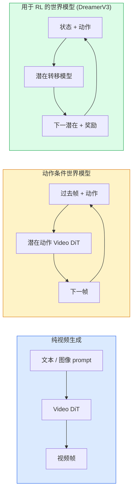

# 世界模型与视频扩散

> 一个预测场景接下来几秒的视频模型就是一个世界模拟器。用动作条件该预测，你就得到了一个可学习的游戏引擎。

**类型：** Learn + Build
**语言：** Python
**先修要求：** Phase 4 Lesson 10 (Diffusion), Phase 4 Lesson 12 (Video Understanding), Phase 4 Lesson 23 (DiT + Rectified Flow)
**时间：** ~75 分钟

## 学习目标

- 解释纯视频生成模型（Sora 2）和动作条件世界模型（Genie 3、DreamerV3）之间的区别
- 描述视频 DiT：时空 patches、3D 位置编码、跨 (T, H, W) Token 的联合注意力
- 追踪世界模型如何接入机器人：VLM 规划 → 视频模型模拟 → 逆向动力学输出动作
- 为给定用例（创意视频、交互式模拟、自动驾驶合成）在 Sora 2、Genie 3、Runway GWM-1 Worlds、Wan-Video 和 HunyuanVideo 之间选择

## 问题

视频生成和世界建模在 2026 年融合了。一个能生成连贯一分钟视频的模型在某种意义上已经学会了世界如何运动：对象持久性、重力、因果、风格。如果你用动作条件该预测（向左走、打开门），视频模型就变成了一个可学习的模拟器，可以替代游戏引擎、驾驶模拟器或机器人环境。

利害关系是具体的。Genie 3 从单张图像生成可玩的环境。Runway GWM-1 Worlds 合成无限可探索的场景。Sora 2 产生带有同步音频和建模物理的一分钟长视频。NVIDIA Cosmos-Drive、Wayve Gaia-2 和 Tesla DrivingWorld 生成逼真的驾驶视频用于自动驾驶车辆的训练数据。世界模型范式正在悄然接管机器人学的 sim-to-real。

本课是 Phase 4 的"大图景"课程。它将图像生成、视频理解和 agent 推理连接成主导研究方向正在推进的架构模式。

## 概念

### 三大世界建模家族



- **Sora 2** 是以 prompt 为条件的纯视频生成。没有动作接口。你不能在生成过程中"操控"它。
- **Genie 3**、**GWM-1 Worlds**、**Mirage / Magica** 是动作条件世界模型。从观察到的视频推断潜在动作，然后用动作条件未来帧预测。交互式——你按下键或移动相机，场景就响应。
- **DreamerV3** 和经典的 RL 世界模型家族在潜在空间中预测，具有显式动作条件，基于奖励信号训练。视觉少；对样本高效 RL 更有用。

### Video DiT 架构

```
视频潜在:                (C, T, H, W)
Patchify（空间）:        每帧 P_h x P_w patches 的网格
Patchify（时间）:        将 P_t 帧分组为一个时间 patch
产生的 Token:            (T / P_t) * (H / P_h) * (W / P_w) 个 Token
```

位置编码是 3D 的：每个 (t, h, w) 坐标的旋转或可学习嵌入。注意力可以是：

- **完全联合**——所有 Token 关注所有 Token。N 个 Token 时 O(N^2)。长视频禁止使用。
- **分离**——交替时间注意力（相同空间位置，跨时间：`(H*W) * T^2`）和空间注意力（相同时间步，跨空间：`T * (H*W)^2`）。TimeSformer 和大多数视频 DiT 使用。
- **窗口**——(t, h, w) 中的局部窗口。Video Swin 使用。

每个 2026 年视频扩散模型使用这三种模式之一，加上 AdaLN 条件（Lesson 23）和 Rectified Flow。

### 动作条件：潜在动作模型

Genie 通过判别性地预测一对连续帧之间的动作，逐帧学习了一个**潜在动作**。模型的解码器然后用推断的潜在动作作为条件——而非显式键盘按键。在推理时，用户可以指定一个潜在动作（或从新的先验采样一个），模型生成与该动作一致的下一帧。

Sora 完全跳过了动作接口。它的解码器从过去的时空 Token 预测下一个时空 Token。Prompt 条件启动；没有任何东西在生成过程中操控它。

### 物理合理性

Sora 2 的 2026 年发布明确宣传了**物理合理性**：重量、平衡、对象持久性、因果。由团队通过人工评分的合理性分数测量；模型在掉落物体、角色碰撞和故意的失败（错过跳跃）方面比 Sora 1 有明显改善。

合理性仍然是主要的失败模式。2024-2025 年人们吃意面或从玻璃杯喝水的视频揭示了模型缺乏持久对象表示。2026 年模型（Sora 2、Runway Gen-5、HunyuanVideo）减少但未消除这些问题。

### 自动驾驶世界模型

驾驶世界模型以轨迹、边界框或导航地图为条件生成逼真的道路场景。用途：

- **Cosmos-Drive-Dreams**（NVIDIA）——为 RL 训练生成数分钟的驾驶视频。
- **Gaia-2**（Wayve）——以轨迹为条件的场景合成用于策略评估。
- **DrivingWorld**（Tesla）——模拟变化的天气、时间、交通状况。
- **Vista**（ByteDance）——反应式驾驶场景合成。

它们替代了边缘情况的昂贵真实世界数据收集——夜间行人乱穿马路、结冰路口、罕见车辆类型——这些否则需要数百万英里的驾驶里程。

### 机器人技术栈：VLM + 视频模型 + 逆向动力学

新兴的三组件机器人循环：

1. **VLM** 解析目标（"拿起红色的杯子"），规划高级动作序列。
2. **视频生成模型** 模拟执行每个动作会是什么样子——预测 N 帧后的观察。
3. **逆向动力学模型** 提取会产生那些观察的具体电机指令。

这替代了奖励塑造和样本量大的 RL。世界模型进行想象；逆向动力学闭合了驱动回路。Genie Envisioner 是一个实例化；许多研究组正汇聚到这个结构上。

### 评估

- **视觉质量**——FVD（Fréchet Video Distance）、用户研究。
- **Prompt 对齐**——每帧 CLIPScore、VQA 风格评估。
- **物理合理性**——在基准套件上人工评分（Sora 2 的内部基准、VBench）。
- **可控性**（用于交互式世界模型）——动作 → 观察一致性；你能回到之前的状态吗？

### 2026 年模型景观

| 模型 | 用途 | 参数 | 输出 | 许可 |
|-------|-----|------------|--------|---------|
| Sora 2 | 文本到视频，音频 | — | 1-min 1080p + 音频 | API only |
| Runway Gen-5 | 文本/图像到视频 | — | 10s 片段 | API |
| Runway GWM-1 Worlds | 交互式世界 | — | 无限 3D rollout | API |
| Genie 3 | 从图像生成交互式世界 | 11B+ | 可玩帧 | research preview |
| Wan-Video 2.1 | 开源文本到视频 | 14B | 高质量片段 | non-commercial |
| HunyuanVideo | 开源文本到视频 | 13B | 10s 片段 | permissive |
| Cosmos / Cosmos-Drive | 自动驾驶模拟 | 7-14B | 驾驶场景 | NVIDIA open |
| Magica / Mirage 2 | AI 原生游戏引擎 | — | 可修改世界 | product |

## Build It

### 步骤 1：视频 3D patchify

```python
import torch
import torch.nn as nn


class VideoPatch3D(nn.Module):
    def __init__(self, in_channels=4, dim=64, patch_t=2, patch_h=2, patch_w=2):
        super().__init__()
        self.proj = nn.Conv3d(
            in_channels, dim,
            kernel_size=(patch_t, patch_h, patch_w),
            stride=(patch_t, patch_h, patch_w),
        )
        self.patch_t = patch_t
        self.patch_h = patch_h
        self.patch_w = patch_w

    def forward(self, x):
        # x: (N, C, T, H, W)
        x = self.proj(x)
        n, c, t, h, w = x.shape
        tokens = x.reshape(n, c, t * h * w).transpose(1, 2)
        return tokens, (t, h, w)
```

步长等于核的 3D 卷积作为时空 patchifier。`(T, H, W) -> (T/2, H/2, W/2)` Token 网格。

### 步骤 2：3D 旋转位置编码

RoPE 沿 `t`、`h`、`w` 轴分别应用：

```python
def rope_3d(tokens, t_dim, h_dim, w_dim, grid):
    """
    tokens: (N, T*H*W, D)
    grid: (T, H, W) sizes
    t_dim + h_dim + w_dim == D
    """
    T, H, W = grid
    n, seq, d = tokens.shape
    if t_dim + h_dim + w_dim != d:
        raise ValueError(f"t_dim+h_dim+w_dim ({t_dim}+{h_dim}+{w_dim}) 必须等于 D={d}")
    assert seq == T * H * W
    t_idx = torch.arange(T, device=tokens.device).repeat_interleave(H * W)
    h_idx = torch.arange(H, device=tokens.device).repeat_interleave(W).repeat(T)
    w_idx = torch.arange(W, device=tokens.device).repeat(T * H)
    # 简化：仅按频率缩放通道。真正的 RoPE 以旋转对方式。
    freqs_t = torch.exp(-torch.log(torch.tensor(10000.0)) * torch.arange(t_dim // 2, device=tokens.device) / (t_dim // 2))
    freqs_h = torch.exp(-torch.log(torch.tensor(10000.0)) * torch.arange(h_dim // 2, device=tokens.device) / (h_dim // 2))
    freqs_w = torch.exp(-torch.log(torch.tensor(10000.0)) * torch.arange(w_dim // 2, device=tokens.device) / (w_dim // 2))
    emb_t = torch.cat([torch.sin(t_idx[:, None] * freqs_t), torch.cos(t_idx[:, None] * freqs_t)], dim=-1)
    emb_h = torch.cat([torch.sin(h_idx[:, None] * freqs_h), torch.cos(h_idx[:, None] * freqs_h)], dim=-1)
    emb_w = torch.cat([torch.sin(w_idx[:, None] * freqs_w), torch.cos(w_idx[:, None] * freqs_w)], dim=-1)
    return tokens + torch.cat([emb_t, emb_h, emb_w], dim=-1)
```

简化加法形式。真正的 RoPE 以频率旋转成对通道；位置信息相同。

### 步骤 3：分离注意力块

```python
class DividedAttentionBlock(nn.Module):
    def __init__(self, dim=64, heads=2):
        super().__init__()
        self.time_attn = nn.MultiheadAttention(dim, heads, batch_first=True)
        self.space_attn = nn.MultiheadAttention(dim, heads, batch_first=True)
        self.ln1 = nn.LayerNorm(dim)
        self.ln2 = nn.LayerNorm(dim)
        self.ln3 = nn.LayerNorm(dim)
        self.mlp = nn.Sequential(nn.Linear(dim, 4 * dim), nn.GELU(), nn.Linear(4 * dim, dim))

    def forward(self, x, grid):
        T, H, W = grid
        n, seq, d = x.shape
        # 时间注意力：相同 (h, w)，跨 t
        xt = x.view(n, T, H * W, d).permute(0, 2, 1, 3).reshape(n * H * W, T, d)
        a, _ = self.time_attn(self.ln1(xt), self.ln1(xt), self.ln1(xt), need_weights=False)
        xt = (xt + a).reshape(n, H * W, T, d).permute(0, 2, 1, 3).reshape(n, seq, d)
        # 空间注意力：相同 t，跨 (h, w)
        xs = xt.view(n, T, H * W, d).reshape(n * T, H * W, d)
        a, _ = self.space_attn(self.ln2(xs), self.ln2(xs), self.ln2(xs), need_weights=False)
        xs = (xs + a).reshape(n, T, H * W, d).reshape(n, seq, d)
        xs = xs + self.mlp(self.ln3(xs))
        return xs
```

时间注意力在每个空间位置内跨时间关注；空间注意力在每帧内跨位置关注。两个 O(T^2 + (HW)^2) 操作而非一个 O((THW)^2)。这是 TimeSformer 和每个现代视频 DiT 的核心。

### 步骤 4：组成微型视频 DiT

```python
class TinyVideoDiT(nn.Module):
    def __init__(self, in_channels=4, dim=64, depth=2, heads=2):
        super().__init__()
        self.patch = VideoPatch3D(in_channels=in_channels, dim=dim, patch_t=2, patch_h=2, patch_w=2)
        self.blocks = nn.ModuleList([DividedAttentionBlock(dim, heads) for _ in range(depth)])
        self.out = nn.Linear(dim, in_channels * 2 * 2 * 2)

    def forward(self, x):
        tokens, grid = self.patch(x)
        for blk in self.blocks:
            tokens = blk(tokens, grid)
        return self.out(tokens), grid
```

不是可工作的视频生成器；一个展示每个组件形状正确的结构演示。

### 步骤 5：检查形状

```python
vid = torch.randn(1, 4, 8, 16, 16)  # (N, C, T, H, W)
model = TinyVideoDiT()
out, grid = model(vid)
print(f"输入  {tuple(vid.shape)}")
print(f"Token 网格 {grid}")
print(f"输出 {tuple(out.shape)}")
```

期望 `grid = (4, 8, 8)` 且 patching 后 `out = (1, 256, 32)`；然后头将每个 Token 投影到时空 patches，准备 unpatchify 回视频。

## Use It

2026 年生产访问模式：

- **Sora 2 API**（OpenAI）——文本到视频，同步音频。高价。
- **Runway Gen-5 / GWM-1**（Runway）——图像到视频，交互式世界。
- **Wan-Video 2.1 / HunyuanVideo**——开源自托管。
- **Cosmos / Cosmos-Drive**（NVIDIA）——驾驶模拟开源权重。
- **Genie 3**——研究预览，申请访问。

构建交互式世界模型演示：从 Wan-Video 开始追求质量，在之上添加潜在动作适配器以实现交互性。对于自动驾驶模拟：Cosmos-Drive 是 2026 年开源参考。

对于机器人学，野外技术栈：

1. 语言目标 -> VLM（Qwen3-VL）-> 高级计划。
2. 计划 -> 潜在动作视频模型 -> 想象的 rollout。
3. Rollout -> 逆向动力学模型 -> 低级动作。
4. 动作执行 -> 观察反馈到步骤 1。

## Ship It

本课产出：

- `outputs/prompt-video-model-picker.md`——根据任务、许可和延迟在 Sora 2 / Runway / Wan / HunyuanVideo / Cosmos 之间选择。
- `outputs/skill-physical-plausibility-checks.md`——一个定义自动化检查的 skill（对象持久性、重力、连续性），在 shipping 前在任何生成视频上运行。

## 练习

1. **（简单）** 计算在 patch-t=2, patch-h=8, patch-w=8 下，一个 5 秒 360p 视频的 Token 数量。推理在此规模下的注意力内存。
2. **（中等）** 将上述分离注意力块替换为完全联合注意力块并测量形状和参数数量。解释为什么分离注意力对于真实视频模型是必要的。
3. **（困难）** 构建一个最小 latent-action 视频模型：取一个 (frame_t, action_t, frame_{t+1}) 三元组的数据集（任何简单 2D 游戏），训练一个以动作嵌入为条件的微型视频 DiT，展示不同动作产生不同的下一帧。

## 关键术语

| 术语 | 人们怎么说 | 实际含义 |
|------|----------------|----------------------|
| 世界模型 | "已学习的模拟器" | 给定状态和动作预测未来观察的模型 |
| Video DiT | "时空 Transformer" | 带 3D patchification 和分离注意力的扩散 Transformer |
| 潜在动作 | "推断的控制" | 从帧对推断的离散或连续动作潜在变量；用于条件下一帧生成 |
| 分离注意力 | "先时间后空间" | 每块两次注意力操作——跨时间再跨空间——保持 O(N^2) 可管理 |
| 对象持久性 | "事物保持真实" | 视频模型必须学习的场景属性；食品、玻璃器皿上的经典失败模式 |
| FVD | "Fréchet Video Distance" | FID 的视频等价物；主要视觉质量指标 |
| 逆向动力学模型 | "观察到动作" | 给定（状态，下一状态），输出连接它们的动作；闭合机器人循环 |
| Cosmos-Drive | "NVIDIA 驾驶模拟" | 用于 RL 和评估的开源权重自动驾驶世界模型 |

## 延伸阅读

- [Sora 技术报告 (OpenAI)](https://openai.com/index/video-generation-models-as-world-simulators/)
- [Genie: Generative Interactive Environments (Bruce et al., 2024)](https://arxiv.org/abs/2402.15391)——潜在动作世界模型
- [TimeSformer (Bertasius et al., 2021)](https://arxiv.org/abs/2102.05095)——用于视频 Transformer 的分离注意力
- [DreamerV3 (Hafner et al., 2023)](https://arxiv.org/abs/2301.04104)——用于 RL 的世界模型
- [Cosmos-Drive-Dreams (NVIDIA, 2025)](https://research.nvidia.com/labs/toronto-ai/cosmos-drive-dreams/)——驾驶世界模型
- [Top 10 Video Generation Models 2026 (DataCamp)](https://www.datacamp.com/blog/top-video-generation-models)
- [From Video Generation to World Model — survey repo](https://github.com/ziqihuangg/Awesome-From-Video-Generation-to-World-Model/)
