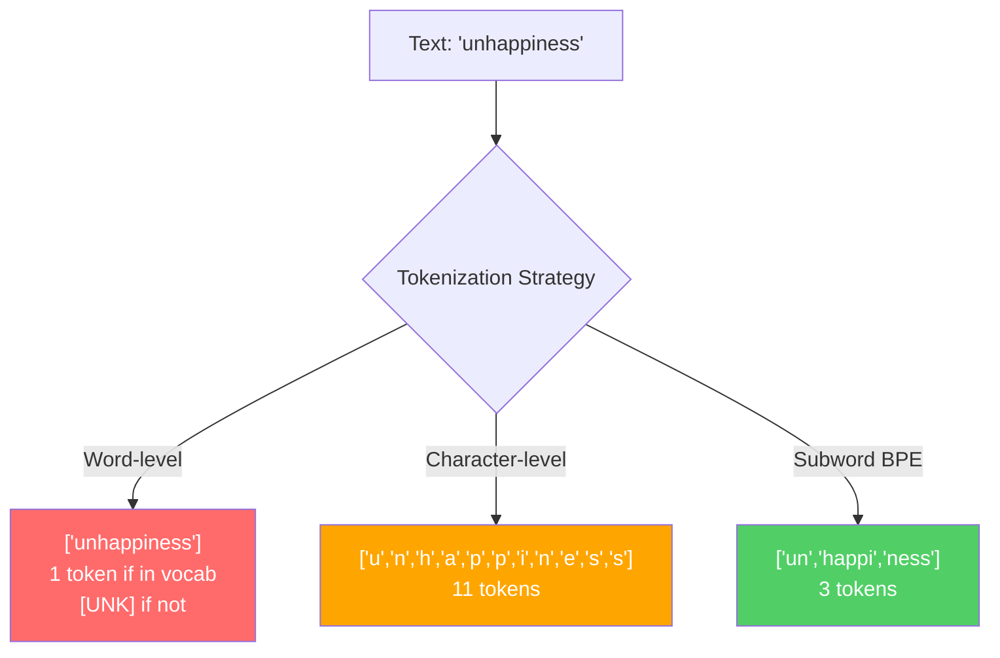
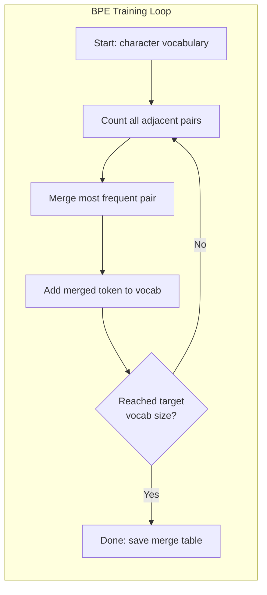
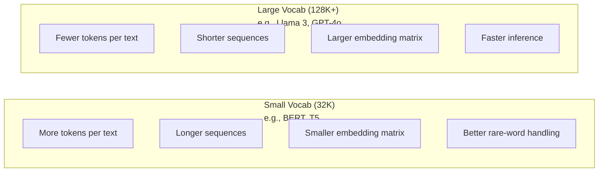

# 分词器：BPE、WordPiece、SentencePiece

> 你的 LLM 并不阅读英语。它阅读整数。分词器决定了这些整数是承载意义还是浪费空间。

**类型：** 构建
**语言：** Python
**前置课程：** Phase 05（NLP 基础）
**时间：** ~90 分钟

## 学习目标

- 从零实现 BPE、WordPiece 和 Unigram 分词算法，并比较它们的合并策略
- 解释词汇量大小如何影响模型效率：太小会产生长序列，太大会浪费嵌入参数
- 分析不同语言和代码中的分词伪影，识别特定分词器在何处会失效
- 使用 tiktoken 和 sentencepiece 库对文本进行分词，并检查生成的 token ID

## 问题

你的 LLM 并不阅读英语。它不阅读任何语言。它阅读数字。

"Hello, world!" 和 [15496, 11, 995, 0] 之间的桥梁就是分词器。每一个单词、每一个空格、每一个标点符号都必须转换为整数，模型才能处理。这种转换不是中性的——它将假设烘焙到模型中，之后无法撤销。

搞错了这一步，你的模型就会浪费容量用多个 token 来编码常见单词。"unfortunately" 变成了四个 token 而不是一个。对于多音节单词较多的文本，你的 128K 上下文窗口会缩小 75%。搞对了，同样的上下文窗口能容纳两倍的语义信息。"这个模型处理代码很好"和"这个模型对 Python 无能为力"之间的差异，往往在于分词器是如何训练的。

你对 GPT-4 或 Claude 的每次 API 调用都是按 token 计价的。模型生成的每个 token 都会消耗计算资源。表示输出所需的 token 越少，端到端推理就越快。分词不是预处理，它是架构的一部分。

## 概念

### 三种失败的尝试（以及一种成功的方案）

有三种显而易见的方法可以将文本转换为数字。其中两种在规模上无法使用。

**词级分词** 按空格和标点符号分割文本。"The cat sat" 变成 ["The", "cat", "sat"]。简单。但 "tokenization" 呢？"GPT-4o" 呢？或者像 "Geschwindigkeitsbegrenzung" 这样的德语复合词呢？词级分词需要庞大的词汇表来覆盖每种语言中的每个单词。漏掉一个单词，你就会看到可怕的 `[UNK]` token——模型在说"我不知道这是什么"。仅英语就有一百多万种词形。再加上代码、URL、科学计数法和 100 种其他语言，你需要一个无限大的词汇表。

**字符级分词** 走向了另一个极端。"hello" 变成 ["h", "e", "l", "l", "o"]。词汇表很小（几百个字符）。永远不会出现未知 token。但序列变得极长。一个 10 个词级 token 的句子会变成 50 个字符级 token。模型必须学会 "t"、"h"、"e" 合在一起是 "the"——把注意力容量浪费在人类三岁就学会的事情上。

**子词分词** 找到了最佳平衡。常见单词保持完整："the" 是一个 token。罕见单词分解成有意义的片段："unhappiness" 变成 ["un", "happi", "ness"]。词汇表保持在可控范围（30K 到 128K 个 token）。序列保持简短。未知 token 基本消失，因为任何单词都可以由子词片段构建。

每个现代 LLM 都使用子词分词。GPT-2、GPT-4、BERT、Llama 3、Claude——无一例外。问题在于使用哪种算法。



### BPE：字节对编码

BPE 是一种被重新用于分词的贪心压缩算法。其思想简单到可以写在一张索引卡上。

从单个字符开始。统计训练语料中每个相邻的 token 对。将出现频率最高的 token 对合并成一个新 token。重复此过程，直到达到目标词汇表大小。

```figure
tokenizer-bpe
```

以下是在一个包含 "lower"、"lowest" 和 "newest" 三个词的小型语料上运行 BPE 的过程：

```
Corpus (with word frequencies):
  "lower"  x5
  "lowest" x2
  "newest" x6

Step 0 -- Start with characters:
  l o w e r       (x5)
  l o w e s t     (x2)
  n e w e s t     (x6)

Step 1 -- Count adjacent pairs:
  (e,s): 8    (s,t): 8    (l,o): 7    (o,w): 7
  (w,e): 13   (e,r): 5    (n,e): 6    ...

Step 2 -- Merge most frequent pair (w,e) -> "we":
  l o we r        (x5)
  l o we s t      (x2)
  n e we s t      (x6)

Step 3 -- Recount and merge (e,s) -> "es":
  l o we r        (x5)
  l o we s t      (x2)    <- 'es' only forms from 'e'+'s', not 'we'+'s'
  n e we s t      (x6)    <- wait, the 'e' before 'we' and 's' after 'we'

Actually tracking this precisely:
  After "we" merge, remaining pairs:
  (l,o): 7   (o,we): 7   (we,r): 5   (we,s): 8
  (s,t): 8   (n,e): 6    (e,we): 6

Step 3 -- Merge (we,s) -> "wes" or (s,t) -> "st" (tied at 8, pick first):
  Merge (we,s) -> "wes":
  l o we r        (x5)
  l o wes t       (x2)
  n e wes t       (x6)

Step 4 -- Merge (wes,t) -> "west":
  l o we r        (x5)
  l o west        (x2)
  n e west        (x6)

...continue until target vocab size reached.
```

合并表就是分词器。要对新文本编码，按照学习到的顺序应用合并规则。训练语料决定了存在哪些合并规则，而这一选择永久地塑造了模型所看到的内容。



### 字节级 BPE（GPT-2、GPT-3、GPT-4）

标准 BPE 在 Unicode 字符上操作。字节级 BPE 在原始字节（0-255）上操作。这给你一个恰好 256 的基础词汇表，可以处理任何语言或编码，并且永远不会产生未知 token。

GPT-2 引入了这种方法。基础词汇表覆盖了每一个可能的字节。BPE 合并在此基础上构建。OpenAI 的 tiktoken 库使用以下词汇表大小实现了字节级 BPE：

- GPT-2：50,257 个 token
- GPT-3.5/GPT-4：约 100,256 个 token（cl100k_base 编码）
- GPT-4o：200,019 个 token（o200k_base 编码）

### WordPiece（BERT）

WordPiece 看起来与 BPE 类似，但选择合并的方式不同。它不是基于原始频率，而是最大化训练数据的似然：

```
BPE merge criterion:      count(A, B)
WordPiece merge criterion: count(AB) / (count(A) * count(B))
```

BPE 问："哪对 token 出现得最频繁？"WordPiece 问："哪对 token 在一起出现的频率超出了偶然预期？"这种微妙的差异产生了不同的词汇表。WordPiece 倾向于合并那些共现令人惊讶的 token 对，而不仅仅是频繁出现的 token 对。

WordPiece 还使用 "##" 前缀来表示连续子词：

```
"unhappiness" -> ["un", "##happi", "##ness"]
"embedding"   -> ["em", "##bed", "##ding"]
```

"##" 前缀告诉你这个片段是前一个 token 的延续。BERT 使用 WordPiece，词汇表大小为 30,522 个 token。每个 BERT 变体——DistilBERT、RoBERTa 的分词器实际上是 BPE，但 BERT 本身使用的是 WordPiece。

### SentencePiece（Llama、T5）

SentencePiece 将输入视为原始的 Unicode 字符流，包括空格。没有预分词步骤。没有关于单词边界的语言特定规则。这使得它真正与语言无关——它适用于中文、日文、泰文以及其他不用空格分隔单词的语言。

SentencePiece 支持两种算法：
- **BPE 模式**：与标准 BPE 相同的合并逻辑，应用于原始字符序列
- **Unigram 模式**：从一个大词汇表开始，迭代地移除对整体似然影响最小的 token。与 BPE 相反——是剪枝而不是合并。

Llama 2 使用 SentencePiece BPE，词汇表大小为 32,000 个 token。T5 使用 SentencePiece Unigram，词汇表大小为 32,000 个 token。注意：Llama 3 切换到了基于 tiktoken 的字节级 BPE 分词器，词汇表大小为 128,256 个 token。

### 词汇表大小的权衡

这是一个有可衡量后果的真正工程决策。



具体数字。对于 128K 词汇表和 4096 维嵌入，仅嵌入矩阵就是 128,000 x 4,096 = 5.24 亿个参数。对于 32K 词汇表，它是 1.31 亿个参数。仅分词器的选择就产生了 4 亿个参数的差异。

但更大的词汇表更激进地压缩文本。用 32K 词汇表需要 100 个 token 的同一段英语段落，用 128K 词汇表可能只需要 70 个 token。这意味着生成过程中的前向传递减少了 30%。对于服务百万级请求的模型来说，这直接减少了计算成本。

趋势很明确：词汇表大小正在增长。GPT-2 使用了 50,257。GPT-4 使用了约 100K。Llama 3 使用了 128K。GPT-4o 使用了 200K。

| 模型 | 词汇表大小 | 分词器类型 | 每个英语单词的平均 Token 数 |
|-------|-----------|----------------|---------------------------|
| BERT | 30,522 | WordPiece | ~1.4 |
| GPT-2 | 50,257 | 字节级 BPE | ~1.3 |
| Llama 2 | 32,000 | SentencePiece BPE | ~1.4 |
| GPT-4 | ~100,256 | 字节级 BPE | ~1.2 |
| Llama 3 | 128,256 | 字节级 BPE（tiktoken） | ~1.1 |
| GPT-4o | 200,019 | 字节级 BPE | ~1.0 |

### 多语言税

主要基于英语训练的分词器对其他语言非常残酷。GPT-2 分词器中，韩语文本平均每个词 2-3 个 token。中文可能更糟。这意味着韩语用户的有效上下文窗口只有英语用户的一半——支付同样的价格，却得到更少的信息密度。

这就是为什么 Llama 3 将其词汇表从 32K 扩大到 128K 的四倍。更多专用于非英语文字的 token 意味着跨语言的压缩更加公平。

```figure
tokenizer-tradeoff
```

## 构建它

### 第 1 步：字符级分词器

从基础开始。字符级分词器将每个字符映射到其 Unicode 码点。无需训练。没有未知 token。只是一个直接的映射。

```python
class CharTokenizer:
    def encode(self, text):
        return [ord(c) for c in text]

    def decode(self, tokens):
        return "".join(chr(t) for t in tokens)
```

"hello" 变成 [104, 101, 108, 108, 111]。每个字符都是自己的 token。这是我们要改进的基准。

### 第 2 步：从零开始实现 BPE 分词器

真正的实现。我们在原始字节上进行训练（像 GPT-2 一样），统计 token 对，合并出现最频繁的，并按顺序记录每次合并。合并表就是分词器。

```python
from collections import Counter

class BPETokenizer:
    def __init__(self):
        self.merges = {}
        self.vocab = {}

    def _get_pairs(self, tokens):
        pairs = Counter()
        for i in range(len(tokens) - 1):
            pairs[(tokens[i], tokens[i + 1])] += 1
        return pairs

    def _merge_pair(self, tokens, pair, new_token):
        merged = []
        i = 0
        while i < len(tokens):
            if i < len(tokens) - 1 and tokens[i] == pair[0] and tokens[i + 1] == pair[1]:
                merged.append(new_token)
                i += 2
            else:
                merged.append(tokens[i])
                i += 1
        return merged

    def train(self, text, num_merges):
        tokens = list(text.encode("utf-8"))
        self.vocab = {i: bytes([i]) for i in range(256)}

        for i in range(num_merges):
            pairs = self._get_pairs(tokens)
            if not pairs:
                break
            best_pair = max(pairs, key=pairs.get)
            new_token = 256 + i
            tokens = self._merge_pair(tokens, best_pair, new_token)
            self.merges[best_pair] = new_token
            self.vocab[new_token] = self.vocab[best_pair[0]] + self.vocab[best_pair[1]]

        return self

    def encode(self, text):
        tokens = list(text.encode("utf-8"))
        for pair, new_token in self.merges.items():
            tokens = self._merge_pair(tokens, pair, new_token)
        return tokens

    def decode(self, tokens):
        byte_sequence = b"".join(self.vocab[t] for t in tokens)
        return byte_sequence.decode("utf-8", errors="replace")
```

训练循环是 BPE 的核心：统计 token 对，合并胜出者，重复。每次合并都会减少 token 总数。经过 `num_merges` 轮后，词汇表从 256（基础字节）增长到 256 + num_merges。

编码按照学习到的确切顺序应用合并规则。这很重要。如果合并 1 创建了 "th"，合并 5 创建了 "the"，编码必须先应用合并 1，这样合并 5 才能从 "th" + "e" 形成 "the"。

解码是逆过程：在词汇表中查找每个 token ID，连接字节序列，解码为 UTF-8。

### 第 3 步：编码和解码往返

```python
corpus = (
    "The cat sat on the mat. The cat ate the rat. "
    "The dog sat on the log. The dog ate the frog. "
    "Natural language processing is the study of how computers "
    "understand and generate human language. "
    "Tokenization is the first step in any NLP pipeline."
)

tokenizer = BPETokenizer()
tokenizer.train(corpus, num_merges=40)

test_sentences = [
    "The cat sat on the mat.",
    "Natural language processing",
    "tokenization pipeline",
    "unhappiness",
]

for sentence in test_sentences:
    encoded = tokenizer.encode(sentence)
    decoded = tokenizer.decode(encoded)
    raw_bytes = len(sentence.encode("utf-8"))
    ratio = len(encoded) / raw_bytes
    print(f"'{sentence}'")
    print(f"  Tokens: {len(encoded)} (from {raw_bytes} bytes) -- ratio: {ratio:.2f}")
    print(f"  Roundtrip: {'PASS' if decoded == sentence else 'FAIL'}")
```

压缩比告诉您分词器的效果。0.50 的比率意味着分词器将文本压缩到了原始字节数一半的 token 数。越低越好。在训练语料上，这个比率会很好。在分布外的文本上，比如 "unhappiness"（它没有出现在语料中），比率会更差——分词器对未见过的模式会回退到字符级编码。

### 第 4 步：与 tiktoken 比较

```python
import tiktoken

enc = tiktoken.get_encoding("cl100k_base")

texts = [
    "The cat sat on the mat.",
    "unhappiness",
    "Hello, world!",
    "def fibonacci(n): return n if n < 2 else fibonacci(n-1) + fibonacci(n-2)",
    "Geschwindigkeitsbegrenzung",
]

for text in texts:
    our_tokens = tokenizer.encode(text)
    tiktoken_tokens = enc.encode(text)
    tiktoken_pieces = [enc.decode([t]) for t in tiktoken_tokens]
    print(f"'{text}'")
    print(f"  Our BPE:   {len(our_tokens)} tokens")
    print(f"  tiktoken:  {len(tiktoken_tokens)} tokens -> {tiktoken_pieces}")
```

tiktoken 使用完全相同的算法，但是是在数百 GB 的文本上训练了 100,000 次合并。算法是相同的。区别在于训练数据和合并次数。你的分词器在一个段落上用 40 次合并训练，无法与 tiktoken 在海量语料上的 100K 次合并竞争。但机制是相同的。

### 第 5 步：词汇表分析

```python
def analyze_vocabulary(tokenizer, test_texts):
    total_tokens = 0
    total_chars = 0
    token_usage = Counter()

    for text in test_texts:
        encoded = tokenizer.encode(text)
        total_tokens += len(encoded)
        total_chars += len(text)
        for t in encoded:
            token_usage[t] += 1

    print(f"Vocabulary size: {len(tokenizer.vocab)}")
    print(f"Total tokens across all texts: {total_tokens}")
    print(f"Total characters: {total_chars}")
    print(f"Avg tokens per character: {total_tokens / total_chars:.2f}")

    print(f"\nMost used tokens:")
    for token_id, count in token_usage.most_common(10):
        token_bytes = tokenizer.vocab[token_id]
        display = token_bytes.decode("utf-8", errors="replace")
        print(f"  Token {token_id:4d}: '{display}' (used {count} times)")

    unused = [t for t in tokenizer.vocab if t not in token_usage]
    print(f"\nUnused tokens: {len(unused)} out of {len(tokenizer.vocab)}")
```

这揭示了词汇表中的 Zipf 分布。少数 token 占据了主导地位（空格、"the"、"e"）。大多数 token 很少使用。生产级分词器针对这种分布进行了优化——常见模式获得较短的 token ID，罕见模式获得较长的表示。

## 使用它

你的从零构建的 BPE 可以正常工作。现在看看生产工具是什么样的。

### tiktoken（OpenAI）

```python
import tiktoken

enc = tiktoken.get_encoding("cl100k_base")

text = "Tokenizers convert text to integers"
tokens = enc.encode(text)
print(f"Tokens: {tokens}")
print(f"Pieces: {[enc.decode([t]) for t in tokens]}")
print(f"Roundtrip: {enc.decode(tokens)}")
```

tiktoken 用 Rust 编写，带有 Python 绑定。它每秒可以编码数百万个 token。相同的 BPE 算法，工业强度的实现。

### Hugging Face tokenizers

```python
from tokenizers import Tokenizer
from tokenizers.models import BPE
from tokenizers.trainers import BpeTrainer
from tokenizers.pre_tokenizers import ByteLevel

tokenizer = Tokenizer(BPE())
tokenizer.pre_tokenizer = ByteLevel()

trainer = BpeTrainer(vocab_size=1000, special_tokens=["<pad>", "<eos>", "<unk>"])
tokenizer.train(["corpus.txt"], trainer)

output = tokenizer.encode("The cat sat on the mat.")
print(f"Tokens: {output.tokens}")
print(f"IDs: {output.ids}")
```

Hugging Face 的 tokenizers 库底层也是 Rust。它能在几秒内在 GB 级别的语料上训练 BPE。这是你在训练自己的模型时使用的工具。

### 加载 Llama 的分词器

```python
from transformers import AutoTokenizer

tokenizer = AutoTokenizer.from_pretrained("meta-llama/Llama-3.1-8B")

text = "Tokenizers are the unsung heroes of LLMs"
tokens = tokenizer.encode(text)
print(f"Token IDs: {tokens}")
print(f"Tokens: {tokenizer.convert_ids_to_tokens(tokens)}")
print(f"Vocab size: {tokenizer.vocab_size}")

multilingual = ["Hello world", "Hola mundo", "Bonjour le monde"]
for text in multilingual:
    ids = tokenizer.encode(text)
    print(f"'{text}' -> {len(ids)} tokens")
```

Llama 3 的 128K 词汇表比 GPT-2 的 50K 词汇表能显著更好地压缩非英语文本。你可以自己验证——用多种语言编码同一个句子，然后统计 token 数。

## 交付成果

本课程产出 `outputs/prompt-tokenizer-analyzer.md`——一个可重复使用的提示词，用于分析任何文本和模型组合的分词效率。输入一个文本样本，它会告诉你哪个模型的分词器处理得最好。

## 练习

1. 修改 BPE 分词器，在每次合并步骤时打印词汇表。观察 "t" + "h" 如何变成 "th"，然后 "th" + "e" 如何变成 "the"。追踪常见英语单词是如何逐步组装起来的。

2. 向 BPE 分词器添加特殊 token（`<pad>`、`<eos>`、`<unk>`）。将它们分配为 ID 0、1、2，并相应地将所有其他 token 后移。实现在运行 BPE 之前按空格分割的预分词步骤。

3. 实现 WordPiece 的合并标准（似然比而非频率）。在相同的语料上用相同次数的合并训练 BPE 和 WordPiece。比较生成的词汇表——哪一种产生了更多语言上有意义的子词？

4. 构建一个多语言分词器效率基准测试。选取英语、西班牙语、中文、韩语和阿拉伯语的各 10 个句子。用 tiktoken（cl100k_base）对每种语言进行分词，测量每个字符的平均 token 数。量化每种语言的"多语言税"。

5. 在更大的语料（下载一篇维基百科文章）上训练你的 BPE 分词器。调整合并次数，使得在同一文本上的压缩比与 tiktoken 相差在 10% 以内。这迫使你理解语料大小、合并次数和压缩质量之间的关系。

## 关键术语

| 术语 | 人们怎么说 | 真正的含义是什么 |
|------|----------------|----------------------|
| Token | "一个词" | 模型词汇表中的一个单元——可以是字符、子词、单词或多词块 |
| BPE | "某种压缩算法" | 字节对编码——迭代合并出现最频繁的相邻 token 对，直到达到目标词汇表大小 |
| WordPiece | "BERT 的分词器" | 类似 BPE，但合并时最大化似然比 count(AB)/(count(A)*count(B))，而非原始频率 |
| SentencePiece | "一个分词器库" | 一种与语言无关的分词器，在原始 Unicode 上操作，无需预分词，支持 BPE 和 Unigram 算法 |
| 词汇表大小 | "它知道多少个词" | 唯一 token 的总数：GPT-2 是 50,257，BERT 是 30,522，Llama 3 是 128,256 |
| 繁殖率 | "不是分词器的术语" | 平均每个单词的 token 数——衡量跨语言的分词器效率（1.0 是完美的，3.0 意味着模型工作难度是三倍） |
| 字节级 BPE | "GPT 的分词器" | 在原始字节（0-255）上操作的 BPE，而非 Unicode 字符，保证对任何输入都不会有未知 token |
| 合并表 | "分词器文件" | 训练期间学习到的 token 对合并的有序列表——这就是分词器，顺序很重要 |
| 预分词 | "按空格分割" | 在子词分词之前应用的规则：空格分割、数字分离、标点处理 |
| 压缩比 | "分词器有多高效" | 生成的 token 数除以输入字节数——越低意味着压缩越好、推理越快 |

## 延伸阅读

- [Sennrich et al., 2016 -- "Neural Machine Translation of Rare Words with Subword Units"](https://arxiv.org/abs/1508.07909)——将 1994 年的压缩算法转变为现代分词基础的论文，引入了用于 NLP 的 BPE
- [Kudo & Richardson, 2018 -- "SentencePiece: A simple and language independent subword tokenizer"](https://arxiv.org/abs/1808.06226)——与语言无关的分词方案，使多语言模型变得实用
- [OpenAI tiktoken 仓库](https://github.com/openai/tiktoken)——生产级 BPE 实现，Rust 编写带 Python 绑定，被 GPT-3.5/4/4o 使用
- [Hugging Face Tokenizers 文档](https://huggingface.co/docs/tokenizers)——具有 Rust 性能的生产级分词器训练工具
