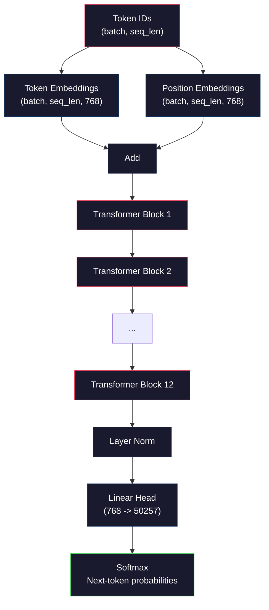
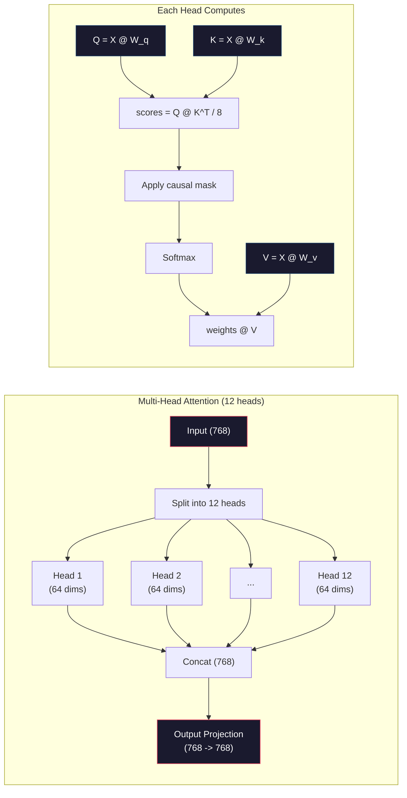
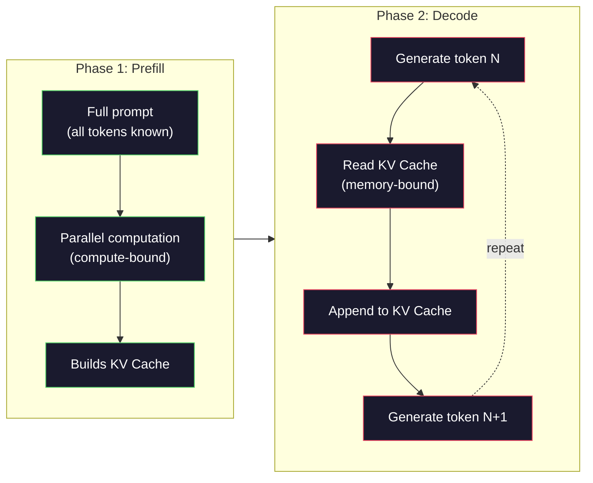

# 预训练一个 Mini GPT（1.24 亿参数）

> GPT-2 Small 拥有 1.24 亿个参数。即 12 层 Transformer、12 个注意力头和 768 维嵌入。你可以在单个 GPU 上几个小时内从零开始训练它。大多数人从未这样做过——他们使用预训练的检查点。但如果你不亲自训练一个，你就并不真正理解你正在构建产品的模型内部发生了什么。

**类型：** 构建
**语言：** Python（使用 numpy）
**前置课程：** Phase 10, 第 01-03 课（分词器、构建分词器、数据流水线）
**时间：** ~120 分钟

## 学习目标

- 从零实现完整的 GPT-2 架构（1.24 亿参数）：token 嵌入、位置嵌入、transformer 块和语言模型头
- 在使用下一个 token 预测和交叉熵损失的文本语料上训练一个 GPT 模型
- 使用温度采样和 top-k/top-p 过滤实现自回归文本生成
- 监控训练损失曲线并验证模型学习了连贯的语言模式

## 问题

你知道 transformer 是什么。你看过图示。你可以背诵"attention is all you need"，并在白板上画出标着"Multi-Head Attention"的方框。

这些都不意味着你理解模型生成文本时发生了什么。

GPT-2 Small（带权重绑定）有 124,438,272 个参数。每一个参数都是通过运行训练循环设置的：前向传播、计算损失、反向传播、更新权重。十二个 transformer 块。每个块十二个注意力头。一个 768 维的嵌入空间。一个 50,257 个 token 的词汇表。每次模型生成一个 token，全部 1.24 亿个参数都参与到一个单一的矩阵乘法链中，该链接受一个 token ID 序列，并生成下一个 token 上的概率分布。

如果你从未亲自构建过这个，你就是在使用一个黑箱。你可以使用 API。你可以微调。但当出现问题时——当模型产生幻觉、当它重复自己、当它拒绝遵循指令——你对*为什么*没有任何心智模型。

本课从零开始构建 GPT-2 Small。不是在 PyTorch 中。在 numpy 中。每个矩阵乘法都是可见的。每个梯度都由你的代码计算。你将确切地看到 1.24 亿个数字如何共谋预测下一个词。

## 概念

### GPT 架构

GPT 是一个自回归语言模型。"自回归"意味着它一次生成一个 token，每个 token 都以所有先前的 token 为条件。架构是一堆 transformer 解码器块。

这是从 token ID 到下一个 token 概率的完整计算图：

1. Token ID 进入。形状：(batch_size, seq_len)。
2. Token 嵌入查找。每个 ID 映射到一个 768 维向量。形状：(batch_size, seq_len, 768)。
3. 位置嵌入查找。每个位置（0, 1, 2, ...）映射到一个 768 维向量。相同形状。
4. Token 嵌入 + 位置嵌入相加。
5. 通过 12 个 transformer 块。
6. 最终的层归一化。
7. 线性投影到词汇表大小。形状：(batch_size, seq_len, vocab_size)。
8. Softmax 获得概率。

这就是整个模型。没有卷积。没有循环。只有嵌入、注意力、前馈网络和层归一化，堆叠 12 次。



### Transformer 块

每个 12 个块都遵循相同的模式。前归一化架构（GPT-2 使用前归一化，而非原始 transformer 中的后归一化）：

1. 层归一化
2. 多头自注意力
3. 残差连接（将输入加回）
4. 层归一化
5. 前馈网络（MLP）
6. 残差连接（将输入加回）

残差连接至关重要。没有它们，在反向传播期间，梯度在到达第 1 块之前就会消失。有了它们，梯度可以通过"跳跃"路径直接从损失流向任何层。这就是为什么你可以堆叠 12、32，甚至 96 个块（传闻 GPT-4 使用了 120 个）。

### 注意力：核心机制

自注意力让每个 token 查看每个先前的 token，并决定对每个 token 的关注程度。这是数学。

对于每个 token 位置，从输入计算三个向量：
- **Query（Q）：** "我在寻找什么？"
- **Key（K）：** "我包含什么？"
- **Value（V）：** "我携带什么信息？"

```
Q = input @ W_q    (768 -> 768)
K = input @ W_k    (768 -> 768)
V = input @ W_v    (768 -> 768)

attention_scores = Q @ K^T / sqrt(d_k)
attention_scores = mask(attention_scores)   # 因果掩码：未来位置设为 -inf
attention_weights = softmax(attention_scores)
output = attention_weights @ V
```

因果掩码使 GPT 成为自回归模型。位置 5 可以关注位置 0-5，但不能关注 6、7、8 等。这防止了模型在训练期间通过查看未来 token 来"作弊"。

**多头注意力** 将 768 维空间分割为 12 个头，每个头 64 维。每个头学习不同的注意力模式。一个头可能跟踪句法关系（主谓一致）。另一个可能跟踪语义相似性（同义词）。另一个可能跟踪位置接近性（附近单词）。所有 12 个头的输出被连接并投影回 768 维。



除以 sqrt(d_k) -- sqrt(64) = 8 -- 是缩放。没有它，点积对于高维向量会变得很大，将 softmax 推到梯度几乎为零的区域。这是原始 "Attention Is All You Need" 论文中的关键洞见之一。

### KV 缓存：推理为何快速

在训练期间，你一次处理整个序列。在推理期间，你一次生成一个 token。没有优化的情况下，生成 token N 需要为所有 N-1 个先前的 token 重新计算注意力。这每个生成的 token 是 O(N^2)，对于长度为 N 的序列总计是 O(N^3)。

KV 缓存解决了这个问题。在计算每个 token 的 K 和 V 后，存储它们。当生成 token N+1 时，你只需要为新 token 计算 Q，然后查找所有先前 token 的缓存 K 和 V。这将 K 和 V 计算的每个 token 成本从 O(N) 降低到 O(1)。注意力分数的计算仍然是 O(N)，因为你关注所有先前的位置，但你避免了输入上的冗余矩阵乘法。

对于具有 12 层和 12 个头的 GPT-2，KV 缓存每个 token 存储 2 (K + V) x 12 层 x 12 头 x 64 维 = 18,432 个值。对于一个 1024 token 的序列，在 FP32 中大约是 75MB。对于具有 128 层的 Llama 3 405B，单个序列的 KV 缓存可能超过 10GB。这就是长上下文推理为何受内存限制的原因。

### Prefill vs Decode：推理的两个阶段

当你向 LLM 发送提示词时，推理发生在两个不同的阶段。

**Prefill** 并行处理你的整个提示词。所有 token 已知，因此模型可以同时为所有位置计算注意力。这个阶段是计算受限的——GPU 以全吞吐量进行矩阵乘法。对于一个 1000 token 的提示词在 A100 上，prefill 大约需要 20-50ms。

**Decode** 一次一个地生成 token。每个新 token 依赖于所有先前的 token。这个阶段是内存受限的——瓶颈是从 GPU 内存中读取模型权重和 KV 缓存，而不是矩阵计算本身。GPU 的计算核心大部分时间空闲，等待内存读取。对于 GPT-2，每个解码步骤花费的时间大致相同，无论矩阵乘法需要多少 FLOPs，因为内存带宽是约束。

这种区别对生产系统很重要。Prefill 吞吐量随 GPU 计算能力缩放（更多 FLOPS = 更快的 prefill）。Decode 吞吐量随内存带宽缩放（更快的内存 = 更快的解码）。这就是为什么 NVIDIA 的 H100 专注于在 A100 之上改进内存带宽——它直接加快了 token 生成速度。



### 训练循环

训练 LLM 是做下一个 token 预测。给定 tokens [0, 1, 2, ..., N-1]，预测 tokens [1, 2, 3, ..., N]。损失函数是模型预测的概率分布与实际下一个 token 之间的交叉熵。

一个训练步骤：

1. **前向传播**：将批次在所有 12 个块上运行。获得每个位置的 logits（softmax 之前的分数）。
2. **计算损失**：logits 与目标 token（输入向后移动一个位置）之间的交叉熵。
3. **反向传播**：使用反向传播为全部 1.24 亿个参数计算梯度。
4. **优化器步骤**：更新权重。GPT-2 使用带有学习率预热和余弦衰减的 Adam。

学习率调度比你预期的更重要。GPT-2 在最初的 2,000 步内从 0 预热到峰值学习率，然后按照余弦曲线衰减。以高学习率开始会导致模型发散。在后期训练中保持恒定的高速率会导致振荡。预热后衰减的模式被每个主要的 LLM 使用。

### GPT-2 Small：数字

| 组件 | 形状 | 参数数量 |
|-----------|-------|------------|
| Token 嵌入 | (50257, 768) | 38,597,376 |
| 位置嵌入 | (1024, 768) | 786,432 |
| 每个块注意力 (W_q, W_k, W_v, W_out) | 4 x (768, 768) | 2,359,296 |
| 每个块 FFN (up + down) | (768, 3072) + (3072, 768) | 4,718,592 |
| 每个块 LayerNorms (2x) | 2 x 768 x 2 | 3,072 |
| 最终 LayerNorm | 768 x 2 | 1,536 |
| **每个块总计** | | **7,080,960** |
| **总计（12 块）** | | **85,054,464 + 39,383,808 = 124,438,272** |

输出投影（logits 头）与 token 嵌入矩阵共享权重。这称为权重绑定——它将参数数量减少了 38M，并通过迫使模型使用相同的表示空间进行输入和输出，提高了性能。

## 构建它

### 第 1 步：嵌入层

Token 嵌入将 50,257 个可能的 token 中的每一个映射到一个 768 维向量。位置嵌入添加关于每个 token 在序列中位置的信息。二者相加。

```python
import numpy as np

class Embedding:
    def __init__(self, vocab_size, embed_dim, max_seq_len):
        self.token_embed = np.random.randn(vocab_size, embed_dim) * 0.02
        self.pos_embed = np.random.randn(max_seq_len, embed_dim) * 0.02

    def forward(self, token_ids):
        seq_len = token_ids.shape[-1]
        tok_emb = self.token_embed[token_ids]
        pos_emb = self.pos_embed[:seq_len]
        return tok_emb + pos_emb
```

初始化的 0.02 标准差来自 GPT-2 论文。太大会导致初始前向传播产生极端值，破坏训练的稳定性。太小则初始输出对所有输入几乎相同，使早期梯度信号没有用处。

### 第 2 步：带因果掩码的自注意力

首先是单头注意力。因果掩码在 softmax 之前将未来位置设为负无穷，确保每个位置只能关注自身和更早的位置。

```python
def attention(Q, K, V, mask=None):
    d_k = Q.shape[-1]
    scores = Q @ K.transpose(0, -1, -2 if Q.ndim == 4 else 1) / np.sqrt(d_k)
    if mask is not None:
        scores = scores + mask
    weights = np.exp(scores - scores.max(axis=-1, keepdims=True))
    weights = weights / weights.sum(axis=-1, keepdims=True)
    return weights @ V
```

softmax 实现在指数化之前减去最大值。没有这一步，exp(大数) 会溢出到无穷。这是一个数值稳定性技巧，不改变输出，因为对于任何常数 c，softmax(x - c) = softmax(x)。

### 第 3 步：多头注意力

将 768 维输入分割为 12 个头，每个头 64 维。每个头独立计算注意力。连接结果并投影回 768 维。

```python
class MultiHeadAttention:
    def __init__(self, embed_dim, num_heads):
        self.num_heads = num_heads
        self.head_dim = embed_dim // num_heads
        self.W_q = np.random.randn(embed_dim, embed_dim) * 0.02
        self.W_k = np.random.randn(embed_dim, embed_dim) * 0.02
        self.W_v = np.random.randn(embed_dim, embed_dim) * 0.02
        self.W_out = np.random.randn(embed_dim, embed_dim) * 0.02

    def forward(self, x, mask=None):
        batch, seq_len, d = x.shape
        Q = (x @ self.W_q).reshape(batch, seq_len, self.num_heads, self.head_dim).transpose(0, 2, 1, 3)
        K = (x @ self.W_k).reshape(batch, seq_len, self.num_heads, self.head_dim).transpose(0, 2, 1, 3)
        V = (x @ self.W_v).reshape(batch, seq_len, self.num_heads, self.head_dim).transpose(0, 2, 1, 3)

        scores = Q @ K.transpose(0, 1, 3, 2) / np.sqrt(self.head_dim)
        if mask is not None:
            scores = scores + mask
        weights = np.exp(scores - scores.max(axis=-1, keepdims=True))
        weights = weights / weights.sum(axis=-1, keepdims=True)
        attn_out = weights @ V

        attn_out = attn_out.transpose(0, 2, 1, 3).reshape(batch, seq_len, d)
        return attn_out @ self.W_out
```

reshape-transpose-reshape 舞蹈是多头注意力中最令人困惑的部分。以下发生的是：(batch, seq_len, 768) 张量变成 (batch, seq_len, 12, 64)，然后变成 (batch, 12, seq_len, 64)。现在 12 个头中的每一个都有自己在上面运行注意力的 (seq_len, 64) 矩阵。注意力之后，我们反转过程：(batch, 12, seq_len, 64) 变成 (batch, seq_len, 12, 64) 变成 (batch, seq_len, 768)。

### 第 4 步：Transformer 块

一个完整的 transformer 块：层归一化、带残差的多头注意力、层归一化、带残差的前馈网络。

```python
class LayerNorm:
    def __init__(self, dim, eps=1e-5):
        self.gamma = np.ones(dim)
        self.beta = np.zeros(dim)
        self.eps = eps

    def forward(self, x):
        mean = x.mean(axis=-1, keepdims=True)
        var = x.var(axis=-1, keepdims=True)
        return self.gamma * (x - mean) / np.sqrt(var + self.eps) + self.beta


class FeedForward:
    def __init__(self, embed_dim, ff_dim):
        self.W1 = np.random.randn(embed_dim, ff_dim) * 0.02
        self.b1 = np.zeros(ff_dim)
        self.W2 = np.random.randn(ff_dim, embed_dim) * 0.02
        self.b2 = np.zeros(embed_dim)

    def forward(self, x):
        h = x @ self.W1 + self.b1
        h = np.maximum(0, h)  # GELU 近似：为简单起见用 ReLU
        return h @ self.W2 + self.b2


class TransformerBlock:
    def __init__(self, embed_dim, num_heads, ff_dim):
        self.ln1 = LayerNorm(embed_dim)
        self.attn = MultiHeadAttention(embed_dim, num_heads)
        self.ln2 = LayerNorm(embed_dim)
        self.ffn = FeedForward(embed_dim, ff_dim)

    def forward(self, x, mask=None):
        x = x + self.attn.forward(self.ln1.forward(x), mask)
        x = x + self.ffn.forward(self.ln2.forward(x))
        return x
```

前馈网络将 768 维输入扩展到 3,072 维（4 倍），应用非线性，然后投影回 768。这种扩展-收缩模式为模型在每个位置上提供了一个更"宽"的内部表示空间。GPT-2 使用 GELU 激活函数，但我们这里为简单起见使用 ReLU——对于理解架构，差异很小。

### 第 5 步：完整的 GPT 模型

堆叠 12 个 transformer 块。在前后添加嵌入层和输出投影。

```python
class MiniGPT:
    def __init__(self, vocab_size=50257, embed_dim=768, num_heads=12,
                 num_layers=12, max_seq_len=1024, ff_dim=3072):
        self.embedding = Embedding(vocab_size, embed_dim, max_seq_len)
        self.blocks = [
            TransformerBlock(embed_dim, num_heads, ff_dim)
            for _ in range(num_layers)
        ]
        self.ln_f = LayerNorm(embed_dim)
        self.vocab_size = vocab_size
        self.embed_dim = embed_dim

    def forward(self, token_ids):
        seq_len = token_ids.shape[-1]
        mask = np.triu(np.full((seq_len, seq_len), -1e9), k=1)

        x = self.embedding.forward(token_ids)
        for block in self.blocks:
            x = block.forward(x, mask)
        x = self.ln_f.forward(x)

        logits = x @ self.embedding.token_embed.T
        return logits

    def count_parameters(self):
        total = 0
        total += self.embedding.token_embed.size
        total += self.embedding.pos_embed.size
        for block in self.blocks:
            total += block.attn.W_q.size + block.attn.W_k.size
            total += block.attn.W_v.size + block.attn.W_out.size
            total += block.ffn.W1.size + block.ffn.b1.size
            total += block.ffn.W2.size + block.ffn.b2.size
            total += block.ln1.gamma.size + block.ln1.beta.size
            total += block.ln2.gamma.size + block.ln2.beta.size
        total += self.ln_f.gamma.size + self.ln_f.beta.size
        return total
```

注意权重绑定：`logits = x @ self.embedding.token_embed.T`。输出投影重用了 token 嵌入矩阵（转置）。这不仅仅是一个节省参数的技巧。它意味着模型使用相同的向量空间来理解 token（嵌入）和预测 token（输出）。

### 第 6 步：训练循环

对于在 1.24 亿参数上的真实训练运行，你需要在纯 numpy 中运行可处理的小模型。我们使用一个小模型（4 层、4 头、128 维）使其可处理。

```python
def cross_entropy_loss(logits, targets):
    batch, seq_len, vocab_size = logits.shape
    logits_flat = logits.reshape(-1, vocab_size)
    targets_flat = targets.reshape(-1)

    max_logits = logits_flat.max(axis=-1, keepdims=True)
    log_softmax = logits_flat - max_logits - np.log(
        np.exp(logits_flat - max_logits).sum(axis=-1, keepdims=True)
    )

    loss = -log_softmax[np.arange(len(targets_flat)), targets_flat].mean()
    return loss


def train_mini_gpt(text, vocab_size=256, embed_dim=128, num_heads=4,
                   num_layers=4, seq_len=64, num_steps=200, lr=3e-4):
    tokens = np.array(list(text.encode("utf-8")[:2048]))
    model = MiniGPT(
        vocab_size=vocab_size, embed_dim=embed_dim, num_heads=num_heads,
        num_layers=num_layers, max_seq_len=seq_len, ff_dim=embed_dim * 4
    )

    print(f"Model parameters: {model.count_parameters():,}")
    print(f"Training tokens: {len(tokens):,}")
    print(f"Config: {num_layers} layers, {num_heads} heads, {embed_dim} dims")
    print()

    for step in range(num_steps):
        start_idx = np.random.randint(0, max(1, len(tokens) - seq_len - 1))
        batch_tokens = tokens[start_idx:start_idx + seq_len + 1]

        input_ids = batch_tokens[:-1].reshape(1, -1)
        target_ids = batch_tokens[1:].reshape(1, -1)

        logits = model.forward(input_ids)
        loss = cross_entropy_loss(logits, target_ids)

        if step % 20 == 0:
            print(f"Step {step:4d} | Loss: {loss:.4f}")

    return model
```

损失起始接近 ln(vocab_size)——对于一个 256 token 的字节级词汇表，即 ln(256) = 5.55。一个随机模型为每个 token 分配相等的概率。随着训练的进行，损失下降，因为模型学会了预测常见模式："t" 之后的 "th"，句号之后的空格等。

在生产中，你会使用 Adam 优化器，配合梯度累积、学习率预热和梯度裁剪。前向传播-损失-反向传播-更新的循环是相同的。优化器更加复杂。

### 第 7 步：文本生成

生成使用训练好的模型一次预测一个 token。每个预测从输出分布中采样（或贪婪地取 argmax）。

```python
def generate(model, prompt_tokens, max_new_tokens=100, temperature=0.8):
    tokens = list(prompt_tokens)
    seq_len = model.embedding.pos_embed.shape[0]

    for _ in range(max_new_tokens):
        context = np.array(tokens[-seq_len:]).reshape(1, -1)
        logits = model.forward(context)
        next_logits = logits[0, -1, :]

        next_logits = next_logits / temperature
        probs = np.exp(next_logits - next_logits.max())
        probs = probs / probs.sum()

        next_token = np.random.choice(len(probs), p=probs)
        tokens.append(next_token)

    return tokens
```

温度控制随机性。温度为 1.0 使用原始分布。温度为 0.5 使其更尖锐（更确定性——模型更频繁地选择其最高选项）。温度为 1.5 使其更平坦（更随机——低概率 token 获得更大机会）。温度为 0.0 是贪婪解码（总是选择最高概率的 token）。

`tokens[-seq_len:]` 窗口是必需的，因为模型有最大上下文长度（GPT-2 是 1024）。一旦超过，你必须丢弃最旧的 token。这是大家常说的"上下文窗口"。

```figure
sampling-decoder
```

## 使用它

### 完整的训练和生成演示

```python
corpus = """The transformer architecture has revolutionized natural language processing.
Attention mechanisms allow the model to focus on relevant parts of the input.
Self-attention computes relationships between all pairs of positions in a sequence.
Multi-head attention splits the representation into multiple subspaces.
Each attention head can learn different types of relationships.
The feedforward network provides nonlinear transformations at each position.
Residual connections enable gradient flow through deep networks.
Layer normalization stabilizes training by normalizing activations.
Position embeddings give the model information about token ordering.
The causal mask ensures autoregressive generation during training.
Pre-training on large text corpora teaches the model general language understanding.
Fine-tuning adapts the pre-trained model to specific downstream tasks."""

model = train_mini_gpt(corpus, num_steps=200)

prompt = list("The transformer".encode("utf-8"))
output_tokens = generate(model, prompt, max_new_tokens=100, temperature=0.8)
generated_text = bytes(output_tokens).decode("utf-8", errors="replace")
print(f"\nGenerated: {generated_text}")
```

在小语料上用小模型，生成的文本充其量是半连贯的。它将从训练文本中学习到一些字节级模式，但无法像 GPT-2 那样用 40GB 的训练数据和完整的 1.24 亿参数架构进行泛化。重点不在于输出质量。重点在于你可以追踪每一步：嵌入查找、注意力计算、前馈变换、logit 投影、softmax 和采样。每个操作都是可见的。

## 交付成果

本课程产出 `outputs/prompt-gpt-architecture-analyzer.md`——一个分析任何 GPT 风格模型中架构选择的提示词。输入一个模型卡或技术报告，它会分解参数分配、注意力设计和缩放决策。

## 练习

1. 修改模型使用 24 层和 16 个头，而不是 12/12。计算参数数量。加倍深度与加倍宽度（嵌入维度）相比如何？

2. 实现 GELU 激活函数（GELU(x) = x * 0.5 * (1 + erf(x / sqrt(2)))）并在前馈网络中替换 ReLU。用每种激活函数运行训练 500 步，比较最终损失。

3. 在生成函数中添加 KV 缓存。在第一次前向传播后为每一层存储 K 和 V 张量，并为后续 token 重用它们。测量加速：在有和没有缓存的情况下生成 200 个 token，比较墙钟时间。

4. 实现 top-k 采样（仅考虑 k 个最高概率的 token）和 top-p 采样（核心采样：考虑累积概率超过 p 的最小 token 集合）。在温度 0.8 下比较 top-k=50 vs top-p=0.95 的输出质量。

5. 构建一个训练损失曲线绘图器。训练模型 1000 步，绘制损失 vs 步数。识别三个阶段：快速初始下降（学习常见字节）、较慢的中期阶段（学习字节模式）和平台期（在小语料上过拟合）。无论你是在训练 128 维模型还是 GPT-4，这条曲线的形状是相同的。

## 关键术语

| 术语 | 人们怎么说 | 真正的含义是什么 |
|------|----------------|----------------------|
| 自回归 | "它一次生成一个词" | 每个输出 token 以所有先前的 token 为条件——模型预测 P(token_n \| token_0, ..., token_{n-1}) |
| 因果掩码 | "它不能看到未来" | 一个上三角矩阵的 -infinity 值，防止在训练期间关注未来的位置 |
| 多头注意力 | "多种注意力模式" | 将 Q、K、V 分割成并行头（例如，GPT-2 是 12 头，每头 64 维），以便每个头可以学习不同类型的关系 |
| KV 缓存 | "为速度缓存" | 存储先前 token 计算出的 Key 和 Value 张量，以避免自回归生成期间的冗余计算 |
| Prefill | "处理提示词" | 第一个推理阶段，所有提示词 token 并行处理——受 GPU FLOPS 计算限制 |
| Decode | "生成 token" | 第二个推理阶段，token 一次生成一个——受 GPU 带宽内存限制 |
| 权重绑定 | "共享嵌入" | 在输入 token 嵌入和输出投影头中使用相同的矩阵——在 GPT-2 中节省 38M 参数 |
| 残差连接 | "跳跃连接" | 将输入直接加到一个子层的输出上 (x + sublayer(x))——使得深度网络中的梯度能够流动 |
| 层归一化 | "归一化激活值" | 跨特征维度归一化到均值 0 和方差 1，带有可学习的缩放和偏置参数 |
| 交叉熵损失 | "预测有多错误" | -log（分配给正确下一个 token 的概率），在所有位置上取平均——标准的 LLM 训练目标 |

## 延伸阅读

- [Radford et al., 2019 -- "Language Models are Unsupervised Multitask Learners" (GPT-2)](https://cdn.openai.com/better-language-models/language_models_are_unsupervised_multitask_learners.pdf)——引入 124M 到 1.5B 参数系列的 GPT-2 论文
- [Vaswani et al., 2017 -- "Attention Is All You Need"](https://arxiv.org/abs/1706.03762)——原始 transformer 论文，包含缩放点积注意力和多头注意力
- [Llama 3 技术报告](https://arxiv.org/abs/2407.21783)——Meta 如何使用 16K GPU 将 GPT 架构扩展到 405B 参数
- [Pope et al., 2022 -- "Efficiently Scaling Transformer Inference"](https://arxiv.org/abs/2211.05102)——对 prefill vs decode 和 KV 缓存分析进行形式化的论文
