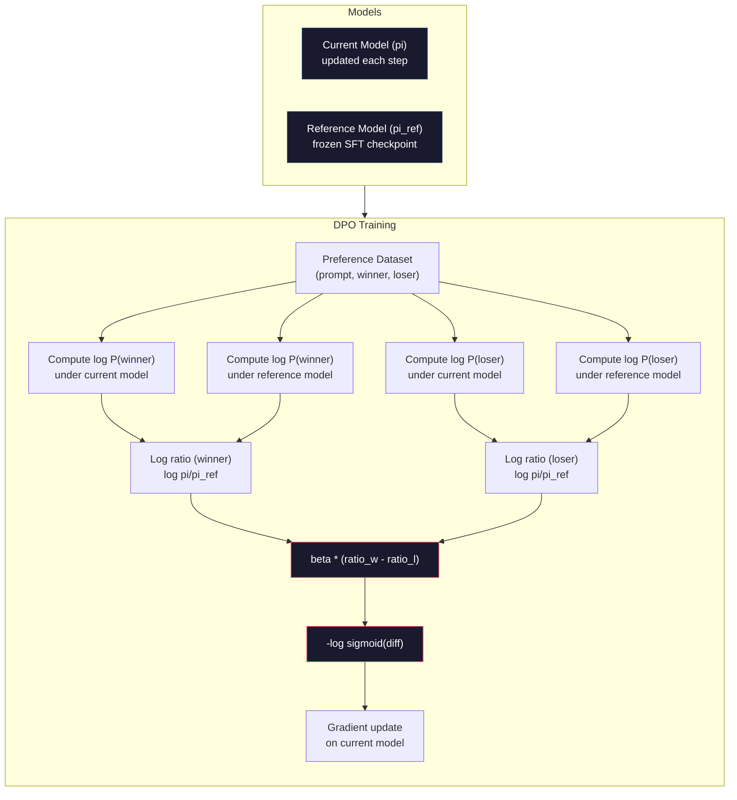

# DPO：直接偏好优化

> RLHF 是有效的。但它也需要训练三个模型（SFT、奖励模型、策略），管理 PPO 的不稳定性，并调整 KL 惩罚系数。DPO 提出：如果你可以跳过所有这些呢？DPO 直接在偏好对上优化语言模型。不需要奖励模型。不需要 PPO。一个训练循环。同样的结果。

**类型：** 构建
**语言：** Python（使用 numpy）
**前置课程：** Phase 10, 第 07 课（RLHF）
**时间：** ~90 分钟

## 学习目标

- 实现 DPO 训练，在没有单独奖励模型的情况下直接在偏好对上优化语言模型
- 推导 DPO 损失函数并解释它如何通过策略的对数概率隐式地表示一个奖励模型
- 在训练稳定性、计算成本和所需模型数量方面比较 DPO 与 RLHF
- 调节 beta 参数以控制训练后的策略与参考模型的偏离程度

## 问题

你在第 07 课中构建了一个 RLHF 流水线。三个阶段。三个模型。SFT 模型、奖励模型和使用 PPO 优化的策略模型。仅奖励模型就需要数千个人类偏好对和一个单独的训练循环。PPO 需要对 KL 系数、学习率、裁剪比率和 epoch 数进行仔细调整。

在实践中，PPO 训练出了名的不稳定。微小的超参数变化会导致训练发散。奖励模型是人类偏好的不完美代理，策略会找到利用其弱点的方法。KL 惩罚有帮助，但需要自己的调整——太低会导致奖励黑客，太高则模型几乎不学习。

这种复杂性就是为什么在 InstructGPT 发布后，大多数开源模型多年来都难以进行 RLHF。三阶段流水线是脆弱的。每个阶段都有自己的失败模式，错误会累积。

2023 年 5 月，Stanford 的 Rafael Rafailov、Archit Sharma 及其同事发表了"Direct Preference Optimization: Your Language Model is Secretly a Reward Model"。关键洞见：你不需要一个单独的奖励模型。最优奖励函数在数学上由语言模型自己的 token 概率决定。你可以完全跳过奖励模型，直接在偏好对上优化语言模型。

DPO 将 RLHF 简化为单个监督学习步骤。一个模型。一个损失函数。一个训练循环。不需要强化学习。Zephyr-7B，首批大规模使用 DPO 的模型之一，在多个基准上匹配或超越了使用完整 RLHF 训练的模型。Meta 在 Llama 3 的对齐流程中使用了 DPO。Anthropic 在其对齐研究中引用了 DPO 风格的方法。

## 概念

### 关键洞见

RLHF 优化以下目标：

```
maximize: E[R(x, y)] - beta * KL(pi || pi_ref)
```

其中 R 是奖励模型，pi 是策略，pi_ref 是参考模型，beta 是 KL 系数。

DPO 论文证明了这个目标有一个闭式最优解。对于任何奖励函数 R，最优策略是：

```
pi*(y | x) = pi_ref(y | x) * exp(R(x, y) / beta) / Z(x)
```

其中 Z(x) 是一个归一化常数。重新排列：

```
R(x, y) = beta * log(pi*(y | x) / pi_ref(y | x)) + beta * log Z(x)
```

这就是突破。奖励完全用策略模型的概率和参考模型的概率来表示。你不需要训练一个单独的奖励模型。奖励*隐式*存在于概率比率中。

将其代入 Bradley-Terry 偏好模型：

```
P(y_w > y_l | x) = sigmoid(R(x, y_w) - R(x, y_l))
                  = sigmoid(beta * (log pi(y_w|x)/pi_ref(y_w|x) - log pi(y_l|x)/pi_ref(y_l|x)))
```

Z(x) 项被抵消，因为两个响应以相同的提示词 x 为条件。剩下的仅仅是策略模型的对数概率和参考模型在首选和被拒绝响应上的对数概率的函数。

### DPO 损失

```
L_DPO = -log(sigmoid(beta * (log pi(y_w|x)/pi_ref(y_w|x) - log pi(y_l|x)/pi_ref(y_l|x))))
```

让我们拆开每一部分：

- **y_w** = 首选（胜出）响应
- **y_l** = 被拒绝（失败）响应
- **x** = 提示词
- **pi** = 当前模型（正在训练）
- **pi_ref** = 参考模型（冻结的 SFT 检查点）
- **beta** = 控制偏离参考模型程度的温度参数（通常为 0.1 到 0.5）

比率 `log pi(y|x) / pi_ref(y|x)` 是对数概率比率。当这个比率为正时，当前模型对响应 y 分配的概率高于参考模型。当为负时，当前模型分配的概率更低。

DPO 损失推动模型增加首选响应的对数概率比率，并降低被拒绝响应的比率。beta 参数控制模型可以偏离参考模型的激进程度——小的 beta 意味着允许大的偏离，大的 beta 保持模型接近参考模型。



### 为什么 DPO 更简单

| 方面 | RLHF (PPO) | DPO |
|--------|-----------|-----|
| 需要训练的模型 | 3（SFT + 奖励 + 策略） | 1（仅策略） |
| 训练循环 | 3（SFT、RM 训练、PPO） | 2（SFT、DPO） |
| 超参数 | lr、KL 系数、裁剪比率、RM lr、3x epoch | lr、beta、epochs |
| 奖励模型 | 必需（单独训练） | 隐式存在于模型概率中 |
| RL 算法 | PPO（复杂、不稳定） | 监督学习（稳定） |
| GPU 内存 | PPO 期间内存中有 3-4 个模型 | 2 个模型（当前 + 参考） |
| 训练稳定性 | 对超参数敏感 | 鲁棒，类似于 SFT |

DPO 在训练期间需要两个模型在内存中——当前模型和冻结的参考模型。RLHF 需要三到四个：策略、参考、奖励模型，以及可选的值函数基线。对于一个 70B 模型，每个副本在 FP16 中占用 140GB。消除奖励模型带来的内存节省是显著的。

### DPO 何时胜过 RLHF

**小型数据集。** 有 5,000-20,000 个偏好对时，DPO 通常匹配或超越 RLHF。RLHF 中的奖励模型需要足够的数据来泛化——在有限数据下，它会过拟合并产生不可靠的奖励信号。DPO 根本不需要奖励模型，从而绕过了这个问题。

**有限的计算资源。** DPO 需要大约完整 RLHF 三分之一的计算量（一个训练循环而不是三个）。对于没有大型 GPU 集群的团队来说，这是实际的选择。

**快速迭代。** 想尝试 10 个不同的偏好数据集来看哪个产生最好的模型？DPO 让你在几个小时内运行每个实验。RLHF 需要为每个数据集重新训练奖励模型。

### RLHF 何时胜过 DPO

**大规模训练。** 在 GPT-4 或 Claude 的规模上，RLHF 的独立奖励模型可以捕捉更微妙的偏好信号。奖励模型作为一个学习到的损失函数，适应复杂的质量标准。

**复杂的奖励信号。** 当"更好"涉及多个维度（有用性、无害性、诚实性）时，奖励模型可以学习这种多目标权衡。DPO 将每个偏好对视为一个二元信号——一个好，一个差——而不建模原因。

**迭代对齐。** RLHF 流水线可以使用当前策略生成新的响应，让人类评分，并在在线循环中重新训练奖励模型。DPO 在固定的偏好对数据集上工作。Constitutional AI（Anthropic 的方法）广泛使用了 RLHF 的这种迭代特性。

### 超越 DPO：KTO、ORPO、SimPO

DPO 激发了一系列简化的对齐方法。

**KTO（Kahneman-Tversky Optimization，2024）：** 你甚至不需要配对。KTO 可以使用不配对的反馈——只需将每个响应标记为"好"或"坏"，无需与替代项比较。这大幅简化了数据收集。不是向标注者展示两个响应并问"哪个更好？"，你展示一个响应并问"这好吗？"损失函数应用了前景理论中的损失厌恶：坏响应受到的惩罚大于好响应受到的奖励。

**ORPO（Odds Ratio Preference Optimization，2024）：** 将 SFT 和对齐结合在单次训练步骤中。不是先做 SFT 再做 DPO，ORPO 修改 SFT 损失以包含偏好信号。损失有两项：在首选响应上的标准下一个 token 预测损失，加上一个比值比项，增加了首选和被拒绝响应概率之间的差距。一个训练循环而不是两个。

**SimPO（Simple Preference Optimization，2024）：** 完全消除了参考模型。不是计算与冻结参考模型的对数概率比率，SimPO 使用响应的平均对数概率（按长度归一化）作为隐式奖励。这节省了内存（不需要参考模型）并简化了训练。长度归一化阻止模型偏爱较短的响应。

| 方法 | 年份 | 内存中的模型 | 需要配对？ | 需要参考？ | 训练循环 |
|--------|------|-----------------|-------------|-----------------|----------------|
| RLHF | 2022 | 3-4 | 是（用于 RM） | 是 | 3 |
| DPO | 2023 | 2 | 是 | 是 | 2 |
| KTO | 2024 | 2 | 否（不必配对） | 是 | 2 |
| ORPO | 2024 | 1 | 是 | 否 | 1 |
| SimPO | 2024 | 1 | 是 | 否 | 1 |

趋势很明显：每种方法都消除了一个额外的复杂因素。RLHF 需要一个奖励模型和 PPO。DPO 消除了两者。KTO 消除了配对数据的需要。ORPO 消除了单独的 SFT 阶段。SimPO 消除了参考模型。对齐税——从基础模型到对齐模型的计算和复杂性成本——在持续下降。

### 真实的 DPO 部署

**Zephyr-7B（HuggingFace，2023 年 10 月）：** Mistral 7B 基础模型，在 UltraChat（200K 示例）上进行 SFT，然后在 UltraFeedback（60K 偏好对）上进行 DPO。在 MT-Bench 上得分 6.47——当时最高的 7B 模型。作为对比，Llama 2 Chat 70B 得分 6.86，意味着 Zephyr 仅使用 DPO 对齐就达到了一个 10 倍大小模型 6% 以内的水平。

**Llama 3（Meta，2024 年 4 月）：** 在初始 RLHF 阶段之后使用 DPO。这种组合表明 DPO 和 RLHF 可以互补——RLHF 用于广泛对齐，DPO 用于有针对性的精炼。

**Neural Magic / nm-chat（2024）：** 在多个开源模型上应用 DPO，在对齐基准上持续显示比仅 SFT 基线高 5-15% 的提升。

```figure
dpo-loss
```

## 构建它

### 第 1 步：偏好数据集

与 RLHF 格式相同——（提示词，首选，被拒绝）三元组。DPO 直接消费这些数据，无需中间的奖励模型。

```python
import numpy as np
import sys
import os
sys.path.insert(0, os.path.join(os.path.dirname(__file__), "..", "..", "04-pre-training-mini-gpt", "code"))
from main import MiniGPT, LayerNorm, Embedding, TransformerBlock

PREFERENCE_DATA = [
    {
        "prompt": "What is the capital of France?",
        "preferred": "The capital of France is Paris.",
        "rejected": "France is a country in Europe. It has many cities. The capital is Paris. Paris is known for the Eiffel Tower.",
    },
    ...  # 与其他课程中相同的 6 个偏好对
]
```

### 第 2 步：序列对数概率

DPO 损失需要计算给定提示词的响应的总对数概率。这意味着在完整的（提示词 + 响应）序列上运行模型，并求和每个响应 token 的对数概率。

```python
def tokenize_sequence(text, vocab_size=256):
    return [min(t, vocab_size - 1) for t in list(text.encode("utf-8"))]


def compute_sequence_log_prob(model, prompt_tokens, response_tokens, max_seq_len=128):
    full_sequence = prompt_tokens + response_tokens
    if len(full_sequence) > max_seq_len:
        full_sequence = full_sequence[:max_seq_len]

    if len(full_sequence) < 2:
        return 0.0

    input_ids = np.array(full_sequence[:-1]).reshape(1, -1)
    target_ids = np.array(full_sequence[1:])

    logits = model.forward(input_ids)
    logits = logits[0]

    max_logits = logits.max(axis=-1, keepdims=True)
    log_probs = logits - max_logits - np.log(
        np.exp(logits - max_logits).sum(axis=-1, keepdims=True)
    )

    prompt_len = len(prompt_tokens)
    response_start = max(0, prompt_len - 1)
    response_end = len(target_ids)

    if response_start >= response_end:
        return 0.0

    response_log_probs = log_probs[response_start:response_end, :]
    response_targets = target_ids[response_start:response_end]

    total_log_prob = 0.0
    for i, target in enumerate(response_targets):
        total_log_prob += response_log_probs[i, target]

    return total_log_prob
```

这个函数是 DPO 的主力。对于每个偏好对，它运行四次：模型在首选响应上，模型在被拒绝响应上，参考模型在首选响应上，参考模型在被拒绝响应上。每个训练示例需要 4 次前向传播，而 RLHF 是：生成 + 奖励评分 + 价值估计 + PPO 更新。更简单、更快、更稳定。

### 第 3 步：DPO 损失

论文的核心用代码表达。一个函数。一个损失。没有奖励模型。

```python
def sigmoid(x):
    return np.where(
        x >= 0,
        1.0 / (1.0 + np.exp(-x)),
        np.exp(x) / (1.0 + np.exp(x))
    )


def dpo_loss(policy_logprob_preferred, policy_logprob_rejected,
             ref_logprob_preferred, ref_logprob_rejected, beta=0.1):
    preferred_ratio = policy_logprob_preferred - ref_logprob_preferred
    rejected_ratio = policy_logprob_rejected - ref_logprob_rejected

    logit = beta * (preferred_ratio - rejected_ratio)

    loss = -np.log(sigmoid(logit) + 1e-8)

    preferred_reward = beta * preferred_ratio
    rejected_reward = beta * rejected_ratio

    return loss, {
        "preferred_ratio": float(preferred_ratio),
        "rejected_ratio": float(rejected_ratio),
        "logit": float(logit),
        "implicit_preferred_reward": float(preferred_reward),
        "implicit_rejected_reward": float(rejected_reward),
        "reward_margin": float(preferred_reward - rejected_reward),
    }
```

`preferred_ratio` 和 `rejected_ratio` 是 DPO 推导中的对数概率比率。当当前模型对首选响应分配更高的概率（相对于参考模型）并对被拒绝响应分配更低的概率时，logit 为正，损失为低。训练信号恰好将模型推向这个方向。

`implicit_preferred_reward` 和 `implicit_rejected_reward` 是 DPO 损失隐式分配的奖励。你可以提取它们来验证训练是否有效——首选和被拒绝奖励之间的差距应该在训练过程中增加。

### 第 4 步：DPO 训练循环

一个标准的监督训练循环。没有 PPO。没有奖励模型。只有前向传播和梯度更新。

```python
def copy_model_weights(source, target):
    # ... 复制所有权重 ...

def dpo_train(policy_model, reference_model, preference_data,
              num_epochs=5, lr=5e-6, beta=0.1, max_seq_len=128):
    print(f"DPO Training: {len(preference_data)} pairs, {num_epochs} epochs, "
          f"lr={lr}, beta={beta}")
    print()

    losses = []
    margins = []

    for epoch in range(num_epochs):
        epoch_loss = 0.0
        epoch_margin = 0.0
        num_examples = 0

        indices = np.random.permutation(len(preference_data))

        for idx in indices:
            pair = preference_data[idx]

            prompt_tokens = tokenize_sequence(pair["prompt"])
            preferred_tokens = tokenize_sequence(pair["preferred"])
            rejected_tokens = tokenize_sequence(pair["rejected"])

            pi_logprob_w = compute_sequence_log_prob(
                policy_model, prompt_tokens, preferred_tokens, max_seq_len
            )
            pi_logprob_l = compute_sequence_log_prob(
                policy_model, prompt_tokens, rejected_tokens, max_seq_len
            )
            ref_logprob_w = compute_sequence_log_prob(
                reference_model, prompt_tokens, preferred_tokens, max_seq_len
            )
            ref_logprob_l = compute_sequence_log_prob(
                reference_model, prompt_tokens, rejected_tokens, max_seq_len
            )

            loss, metrics = dpo_loss(
                pi_logprob_w, pi_logprob_l,
                ref_logprob_w, ref_logprob_l, beta
            )

            # 简化的梯度更新
            update_direction = 1.0 if metrics["logit"] < 0 else -0.1
            for block in policy_model.blocks:
                block.ffn.W1 += lr * update_direction * np.random.randn(*block.ffn.W1.shape) * 0.01
                block.ffn.W2 += lr * update_direction * np.random.randn(*block.ffn.W2.shape) * 0.01

            epoch_loss += loss
            epoch_margin += metrics["reward_margin"]
            num_examples += 1
            losses.append(float(loss))
            margins.append(metrics["reward_margin"])

        avg_loss = epoch_loss / max(num_examples, 1)
        avg_margin = epoch_margin / max(num_examples, 1)
        print(f"  Epoch {epoch + 1}/{num_epochs} | Loss: {avg_loss:.4f} | "
              f"Avg Margin: {avg_margin:.4f}")

    return policy_model, losses, margins
```

与 RLHF 相比，训练循环简单得令人耳目一新。对于每个偏好对：计算四个对数概率（两个模型，两个响应），代入 DPO 损失，计算梯度，更新策略。没有生成步骤。没有奖励模型推理。没有优势估计。没有裁剪。

### 第 5 步：比较 DPO vs RLHF

衡量隐式奖励差距和对数概率变化，将 DPO 与第 07 课的 RLHF 模型进行比较。

```python
def evaluate_preference_accuracy(model, reference_model, preference_data, beta=0.1, max_seq_len=128):
    correct = 0
    total = 0

    for pair in preference_data:
        prompt_tokens = tokenize_sequence(pair["prompt"])
        preferred_tokens = tokenize_sequence(pair["preferred"])
        rejected_tokens = tokenize_sequence(pair["rejected"])

        pi_w = compute_sequence_log_prob(model, prompt_tokens, preferred_tokens, max_seq_len)
        pi_l = compute_sequence_log_prob(model, prompt_tokens, rejected_tokens, max_seq_len)
        ref_w = compute_sequence_log_prob(reference_model, prompt_tokens, preferred_tokens, max_seq_len)
        ref_l = compute_sequence_log_prob(reference_model, prompt_tokens, rejected_tokens, max_seq_len)

        preferred_reward = beta * (pi_w - ref_w)
        rejected_reward = beta * (pi_l - ref_l)

        if preferred_reward > rejected_reward:
            correct += 1
        total += 1

    return correct / max(total, 1)


def analyze_implicit_rewards(model, reference_model, preference_data, beta=0.1, max_seq_len=128):
    # 分析隐式奖励，打印每个偏好对的奖励和差距
    ...
```

### 第 6 步：Beta 敏感性分析

beta 参数是 DPO 中等效于 RLHF 中 KL 系数的参数。它控制模型可以偏离参考模型的程度。这个实验展示了它的效果。

```python
def beta_sensitivity_analysis(sft_model, preference_data, betas, max_seq_len=128):
    # 使用不同的 beta 值运行 DPO 训练并比较结果
    ...
```

小 beta（0.01）让模型自由偏离参考模型——学习快但有退化解的风险。大 beta（1.0）保持模型接近参考模型——稳定但学习慢。大多数应用的最佳点是 0.1 到 0.3。

## 使用它

完整的 DPO 流水线演示展示了所有步骤。偏好准确率指标显示 DPO 训练前 vs 训练后的改进。训练动态显示损失曲线和奖励差距曲线。Beta 敏感性分析比较了不同 beta 值。

## 交付成果

本课程产出 `outputs/prompt-alignment-method-selector.md`——一个帮助你为你的用例选择正确对齐方法（SFT、RLHF、DPO、KTO、ORPO、SimPO）的提示词。根据你的数据可用性、计算预算和对齐目标，它会推荐一种方法和训练计划。

## 练习

1. 实现 KTO（Kahneman-Tversky Optimization）。KTO 不需要配对——只需将每个响应标记为"好"或"坏"。好响应的损失是 `-log(sigmoid(beta * log_ratio))`，坏响应的损失是 `-log(1 - sigmoid(beta * log_ratio))`，在坏响应损失上有损失厌恶乘数（通常为 1.5 倍）。在相同的数据上训练（分别将首选视为"好"，被拒绝视为"坏"），并比较准确率与 DPO。

2. 实现长度归一化的 DPO。不使用原始对数概率，而是除以响应 token 的数量：`normalized_logprob = total_logprob / num_tokens`。这阻止模型偏爱较短的响应（较短响应有较高的总对数概率）。比较有无归一化的隐式奖励差距。

3. 构建 ORPO 风格的组合损失。向 DPO 损失添加在首选响应上的标准下一个 token 预测损失：`L = L_sft(preferred) + alpha * L_dpo`。尝试 alpha=0.1、0.5 和 1.0。组合损失应该产生一个既能遵循指令（来自 SFT 项）又能偏好更好响应（来自 DPO 项）的模型，消除了对单独 SFT 阶段的需求。

4. 实现迭代 DPO。运行 DPO 3 个 epoch，然后从训练后的模型生成新的响应，将它们与原始首选响应配对作为新的偏好对，再次运行 DPO。两轮这种"自我博弈"过程。比较第 1 轮和第 2 轮后的偏好准确率，看迭代精炼是否有帮助。

5. 比较不同参考模型的 DPO。不使用 SFT 检查点作为参考，尝试：(a) 基础模型（SFT 前），(b) DPO epoch 1 的检查点，(c) 策略模型的指数移动平均。报告哪种参考产生最高的偏好准确率和最稳定的训练曲线。

## 关键术语

| 术语 | 人们怎么说 | 真正的含义是什么 |
|------|----------------|----------------------|
| DPO | "没有 RL 的 RLHF" | 直接偏好优化：一种监督学习算法，直接在偏好对上优化语言模型，绕过奖励模型和 PPO |
| 隐式奖励 | "奖励在模型中" | 奖励函数由策略模型和参考模型之间的对数概率比率决定——不需要单独的奖励模型 |
| Beta（DPO） | "温度" | 控制策略可以偏离参考模型多远——小 beta 允许大的偏离，大 beta 保持模型接近 |
| 对数概率比率 | "模型改变了多少" | log pi(y\|x) - log pi_ref(y\|x)——正值意味着当前模型比参考模型分配更高的概率 |
| 参考模型 | "冻结的检查点" | SFT 模型的副本，其权重永不改变——用作计算概率比率的锚点 |
| KTO | "无需配对的 DPO" | Kahneman-Tversky 优化：使用不配对的"好"或"坏"标签，而不需要偏好对 |
| ORPO | "一步对齐" | 比值比偏好优化：通过向 SFT 损失添加偏好项，将 SFT 和对齐组合在单个训练循环中 |
| SimPO | "不需要参考" | 简单偏好优化：通过使用长度归一化的平均对数概率作为隐式奖励，消除了参考模型 |
| 对齐税 | "使模型安全的成本" | 从基础模型到对齐模型所需的额外计算、数据和复杂性——DPO 大幅降低了这一点 |

## 延伸阅读

- [Rafailov et al., 2023 -- "Direct Preference Optimization: Your Language Model is Secretly a Reward Model"](https://arxiv.org/abs/2305.18290)——将对齐从 RLHF 简化为监督学习的 DPO 论文
- [Tunstall et al., 2023 -- "Zephyr: Direct Distillation of LM Alignment"](https://arxiv.org/abs/2310.16944)——Zephyr-7B，展示了在 UltraFeedback 上的 DPO 在基准上匹配 RLHF
- [Ethayarajh et al., 2024 -- "KTO: Model Alignment as Prospect Theoretic Optimization"](https://arxiv.org/abs/2402.01306)——消除了对配对偏好的需求
- [Hong et al., 2024 -- "ORPO: Monolithic Preference Optimization without Reference Model"](https://arxiv.org/abs/2403.07691)——将 SFT 和对齐一步完成
- [Meng et al., 2024 -- "SimPO: Simple Preference Optimization with a Reference-Free Reward"](https://arxiv.org/abs/2405.14734)——完全消除了参考模型
- [Llama 3 技术报告](https://arxiv.org/abs/2407.21783)——Meta 结合 RLHF 和 DPO 的对齐流水线
