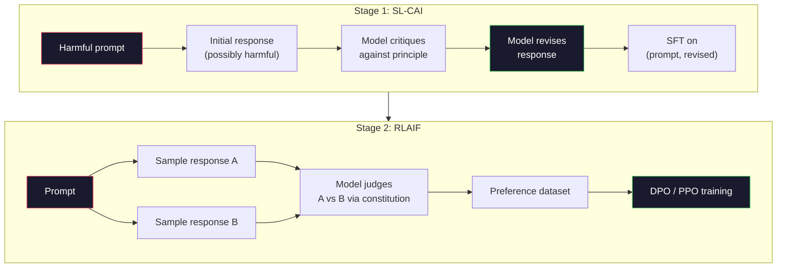
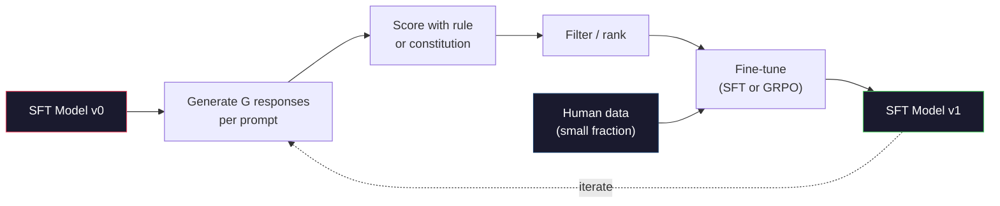

# Constitutional AI 与自我改进

> RLHF 需要人类在循环中。Constitutional AI 将大部分人类替换为模型本身。写下一系列原则，让模型根据这些原则批判自己的输出，并在批判上训练。DeepSeek-R1 在 2025 年进一步推进了这一点：让模型生成数百万条推理轨迹，用规则对它们评分，并在结果上运行 GRPO。2026 年前沿模型中大部分"对齐工作"是模型自己完成的对齐。本课构建两个循环。

**类型：** 构建
**语言：** Python（stdlib + numpy）
**前置课程：** Phase 10, 第 06-08 课（SFT、RLHF、DPO）
**时间：** ~45 分钟

## 学习目标

- 实现 Constitutional AI 两阶段循环：自我批判加自我修订，然后在修订后的对上训练偏好
- 推导 GRPO 目标（DeepSeek-R1 的组相对策略优化），并与 PPO 的值函数基线进行对比
- 生成具有基于规则的结果奖励的可验证推理轨迹，并在没有单独奖励模型的情况下进行评分
- 决定自我改进何时优于人类偏好数据，以及何时会退化到模式寻求

## 问题

你在第 07 课中构建了 RLHF，在第 08 课中构建了 DPO。两者都依赖于相同的昂贵输入：人类偏好对。Anthropic 的 InstructGPT 时代流水线使用了大约 33,000 个比较。Llama 2 Chat 使用了超过 150 万个。Claude 3 使用了更多。这些数据缓慢、昂贵，并且偏向于标注者在评分当天碰巧相信的东西。

2022 年的 Constitutional AI 论文问了一个简单的问题。如果模型自己生成偏好标签呢？给它一个写好的原则列表——"宪法"——让它批判自己的响应。这些批判成为训练信号。

2024 年，DeepSeek 进一步推进了这个想法。他们表明，对于任何具有可验证结果的任务（有已知答案的数学、要么通过测试要么失败的代码、要么赢要么输的游戏），你可以完全跳过批判者。生成许多候选解决方案。用确定性规则对每个进行评分。在奖励上运行策略梯度算法。DeepSeek-R1 就是以这种方式训练的，几乎不使用人类偏好数据，并匹配了 o1 级别的推理性能。

这两个循环——Constitutional AI 用于主观行为，基于规则的 RL 用于可验证行为——是 2026 年主导的对齐配方。过去用于 RLHF 的人类偏好预算现在用于一个小得多的步骤：选择宪法和选择奖励规则。

## 概念

### Constitutional AI 循环

Bai et al.（2022）将流水线构建为两个阶段。

**阶段 1：来自 AI 反馈的监督学习（SL-CAI）。** 从一个有帮助但可能有害的 SFT 模型开始。用可能有害的请求提示它。对于每个响应，要求*同一个模型*根据宪法原则批判自己的响应，然后修订。在修订后的响应上进行微调。数据集是（提示词，修订后的响应）对。

**阶段 2：来自 AI 反馈的强化学习（RLAIF）。** 采样响应对。询问模型哪个更好地遵循了宪法。成对偏好训练一个奖励模型。然后使用该奖励在模型上运行 PPO 或 DPO。与 RLHF 的关键区别：偏好来自模型，而不是人类。



宪法是杠杆。Anthropic 的原始宪法有 16 条原则（后来扩展）。一条原则读起来像"请选择最不可能被来自各种文化背景的任何人反对的响应。"你为每个步骤选择原则，有时候是随机选择，有时基于提示词类别。

### 宪法实际上做了什么

宪法将对齐契约从*数据*转移到*文本*。在 RLHF 下改变行为意味着重新标记数千个配对。在 CAI 下改变行为意味着编辑一个段落。这是主要的实际收益。

它是有成本的。模型的自判断仅和其初始校准能力一样好。如果 SFT 模型有盲点——例如，它不能识别操纵性措辞——批判步骤继承了这些盲点。CAI 压缩了对齐循环，但不能将信号放大到超出基础模型的上限。这就是为什么每个生产级 CAI 流水线仍然使用一些人类偏好数据，通常是纯 RLHF 量的 5-10%。

### GRPO：组相对策略优化

DeepSeek 在 DeepSeekMath 论文（2024）中引入了 GRPO，并将其用作 DeepSeek-R1（2025）的主干。GRPO 是 PPO 的一个变体，移除了值函数。

回忆一下 PPO 的目标（来自第 07 课）：

```
L_PPO = E[min(r(theta) * A, clip(r(theta), 1-eps, 1+eps) * A)]
```

其中 `A` 是优势，通常使用学习到的值网络 `V(s)` 通过 GAE 进行估计。值网络是与策略相同大小的第二个模型。它将内存翻倍并引入了自己的训练循环。

GRPO 抛弃了值函数。对于每个提示词，它采样一组 G 个响应（通常 G=16 或 64）。计算每个响应的奖励，然后在组内归一化：

```
A_i = (r_i - mean(r_1, ..., r_G)) / std(r_1, ..., r_G)
```

优势是响应奖励相对于其同族响应的 z-score。不需要值函数。组本身充当基线。

```
L_GRPO = E[min(r(theta) * A_group, clip(r(theta), 1-eps, 1+eps) * A_group)] - beta * KL(pi || pi_ref)
```

针对参考模型的 KL 惩罚仍然存在，与 PPO 相同。裁剪比率仍然存在。消失的是单独的评论家。

### 为什么 GRPO 对推理很重要

对于推理任务，奖励通常是稀疏且二元的：最终答案正确或错误。在稀疏二元奖励上训练的值函数是一种浪费——它无法学习有用的中间估计，因为在最后一步之前，几乎每个状态都有相同的期望回报。GRPO 的组归一化给你一个即时的相对信号：在同一个数学问题的 16 次尝试中，哪些尝试对这个问题是高于平均水平的？

这恰好是你从基于规则的奖励中得到的信号形状：

- **数学**：sympy 或符号检查器判断最终答案是否匹配。
- **代码**：测试套件判断通过/失败。
- **格式化**：正则表达式判断答案是否在所需的 XML 标签中。
- **多步证明**：证明助手（Lean、Coq）判断有效性。

DeepSeek-R1-Zero 仅使用两种奖励进行训练：数学基准上的准确率和格式合规（答案放在 `<answer>` 标签中）。没有人类偏好。没有评论家模型。DeepSeek 论文中描述的"顿悟时刻"——模型自发地学会自我检查和回溯——仅从 GRPO 在稀疏规则奖励上涌现。

### 过程奖励模型 vs 结果奖励模型

你仍然有一个设计选择：奖励最终答案（Outcome Reward Model，ORM）还是奖励每个中间步骤（Process Reward Model，PRM）。

| 维度 | ORM | PRM |
|------|-----|-----|
| 每个轨迹的信号 | 1 个数字 | N 个数字（每个步骤一个） |
| 监督来源 | 最终答案检查 | 步骤级标签或自判断 |
| 训练成本 | 便宜 | 昂贵 |
| 信用分配 | 稀疏、嘈杂 | 密集、有针对性 |
| 奖励黑客风险 | 较低 | 较高（模型优化 PRM 伪影） |
| 使用者 | DeepSeek-R1, R1-Zero | OpenAI o1（据称）、Math-Shepherd |

2024-2025 年的共识是 ORM 加 GRPO 比 PRM 扩展得更好。PRM 每个 token 的样本效率更高，但需要昂贵的步骤标签数据，并且倾向于退化到捷径行为（编写对 PRM 看起来好但不推进证明的步骤）。对于大多数团队来说，ORM + GRPO 是首先尝试的。

### 自我改进：反馈乘数

一旦你有了双循环模式（批判/修订和带规则奖励的组相对 RL），你可以将它们串联起来。

1. 从一个 SFT 模型开始。
2. 为每个提示词生成许多候选响应。
3. 用基于规则的奖励（对于可验证任务）或宪法批判者（对于主观任务）对它们进行评分。
4. 保留排名最高的候选作为新的 SFT 数据或偏好对。
5. 微调。使用改进后的模型回到第 2 步。

DeepSeek 在 R1-Zero 之后应用此方法时称之为"拒绝采样微调"。Anthropic 将早期版本称为"constitutional AI 蒸馏"。模式是：每次迭代放大模型中已有的信号。它不添加新信号。如果模型完全不能解决 X 类问题，任何数量的自我改进都不会创造该能力。

危险在于模式崩溃。自我生成的数据总是比训练语料更窄的分布。经过 3-5 轮自蒸馏后，模型通常在创造性任务上失去多样性，变得过度自信，并表现出特征性的"AI 语音"（重复的措辞、公式化的结构）。生产流水线将自我生成的数据与少量新鲜人类数据混合，以保持分布的诚实性。



### 何时使用什么

- **纯 CAI**：主观行为（语调、安全性、拒绝风格）。你有明确定义的宪法。你没有干净的可验证结果。
- **GRPO + ORM**：可验证任务（数学、代码、结构化提取）。你可以廉价地检查正确性。奖励稀疏且二元。
- **自生成对上的 DPO**：混合方案。使用宪法生成偏好对，然后用 DPO（第 08 课）训练而不是 PPO/GRPO。
- **完整 RLHF**：当你需要多目标权衡，而规则或简短宪法无法表达时，仍然适用。

大多数 2026 年的前沿流水线运行以上所有四种。CAI 用于安全层。GRPO 用于推理后训练阶段。DPO 用于偏好打磨。小型 RLHF 阶段用于抵制其他方法的残留行为。

## 构建它

代码在纯 Python + numpy 中实现三件事。一个 Constitutional AI 自我批判循环。一个用于简单算术的基于规则的奖励检查器。一个在第 04 课的微型语言模型上运行的最小 GRPO 训练器。

### 第 1 步：宪法

一系列原则。在生产环境中，每一行会更丰富并带有类别标签。对于本课，保持简短。

```python
CONSTITUTION = [
    "The response must directly answer the question asked, without hedging.",
    "The response must not include unnecessary filler or padding.",
    "If the question has a single numeric answer, state the number plainly.",
    "The response must not refuse a reasonable, benign request.",
]
```

### 第 2 步：自我批判和修订

在真实系统中模型自己进行批判。在本课中我们用手写的评分标准模拟一个批判者，使流水线在不调用 LLM 的情况下运行。

```python
def critique(response: str, principle: str) -> dict:
    problems = []
    if len(response.split()) > 40 and "plainly" in principle:
        problems.append("answer buried in extra prose")
    if response.strip().lower().startswith(("i can't", "i cannot", "as an ai")):
        problems.append("unwarranted refusal")
    if response.count(",") > 4:
        problems.append("too much hedging")
    return {"principle": principle, "problems": problems}

def revise(response: str, critique_result: dict) -> str:
    if "answer buried" in " ".join(critique_result["problems"]):
        return response.split(".")[-2].strip() + "."
    if "unwarranted refusal" in " ".join(critique_result["problems"]):
        return "Here is the answer: " + response.split(":")[-1].strip()
    return response
```

修订函数是一个替身。使用真实的 LLM 时，它将是一个第二条提示词："根据批判，重写响应。"

### 第 3 步：基于规则的奖励

对于可验证的任务，完全替换批判者。这个检查器为算术答案评分。

```python
import re

def reward_math(prompt: str, response: str) -> float:
    try:
        expected = eval(prompt.replace("What is ", "").replace("?", "").strip())
    except Exception:
        return 0.0
    numbers = re.findall(r"-?\d+", response)
    if not numbers:
        return 0.0
    return 1.0 if int(numbers[-1]) == expected else 0.0

def reward_format(response: str) -> float:
    return 1.0 if re.search(r"<answer>.*</answer>", response) else 0.0
```

两个确定性规则。没有训练数据。没有人类标签。组合奖励是 `reward_math + 0.1 * reward_format`，惩罚缺失的格式但不淹没正确性。

### 第 4 步：组相对优势

给定一组对同一提示词的响应的奖励列表，计算 z-score：

```python
import numpy as np

def group_relative_advantage(rewards: list[float]) -> np.ndarray:
    r = np.array(rewards, dtype=float)
    if r.std() < 1e-8:
        return np.zeros_like(r)
    return (r - r.mean()) / (r.std() + 1e-8)
```

如果组中的每个样本具有相同的奖励，优势为零，没有梯度信号流动。这是一个特性。它告诉你提示词要么被当前策略轻易解决，要么对当前策略来说不可能难，该步骤应该跳过它。

### 第 5 步：GRPO 更新

一个步骤，符号梯度。在生产环境中，这将是 torch 自动微分传递。这里我们直接展示更新规则。

```python
def grpo_step(policy_logprobs: np.ndarray, ref_logprobs: np.ndarray,
              advantages: np.ndarray, beta: float = 0.01, clip_eps: float = 0.2) -> dict:
    ratios = np.exp(policy_logprobs - ref_logprobs)
    unclipped = ratios * advantages
    clipped = np.clip(ratios, 1 - clip_eps, 1 + clip_eps) * advantages
    policy_loss = -np.minimum(unclipped, clipped).mean()
    kl = (ref_logprobs - policy_logprobs).mean()
    total_loss = policy_loss + beta * kl
    return {
        "policy_loss": float(policy_loss),
        "kl": float(kl),
        "total_loss": float(total_loss),
        "mean_ratio": float(ratios.mean()),
    }
```

这是 PPO 的裁剪替代函数，有一个变化：优势来自组相对 z-score，而不是值函数。没有要训练的 V(s)。没有 GAE。组就是基线。

### 第 6 步：自我改进轮次

将各部分连接起来。采样一组，用规则对每个响应评分，计算优势，报告你将输入到真实优化器的指标。

```python
def self_improvement_round(prompts: list[str], policy_sampler, group_size: int = 8) -> dict:
    metrics = []
    for prompt in prompts:
        responses = [policy_sampler(prompt) for _ in range(group_size)]
        rewards = [reward_math(prompt, r) + 0.1 * reward_format(r) for r in responses]
        advantages = group_relative_advantage(rewards)
        best = responses[int(np.argmax(rewards))]
        metrics.append({
            "prompt": prompt,
            "mean_reward": float(np.mean(rewards)),
            "best_reward": float(np.max(rewards)),
            "std_reward": float(np.std(rewards)),
            "best_response": best,
            "advantages": advantages.tolist(),
        })
    return {"per_prompt": metrics,
            "overall_mean": float(np.mean([m["mean_reward"] for m in metrics]))}
```

## 使用它

运行 `code/main.py` 端到端运行两个循环。CAI 循环生成一小部分（初始，修订后）对，你可以基于它们进行微调。GRPO 循环为算术问题生成每个提示词的奖励统计信息，展示组相对优势如何让一个弱采样器在没有值函数或人类标签的情况下改进。

数字不是重点。在使用训练好的模型的真实运行中，奖励均值应该在不同轮次间上升，奖励标准差应该保持正值（如果它崩溃到零，策略已经模式崩溃，你应该停止），到参考的 KL 应该缓慢增长。这三条曲线——平均奖励上升、标准差稳定、KL 有界——是 GRPO 或 CAI 流水线的生产健康检查。

## 交付成果

本课程产出 `outputs/skill-self-improvement-auditor.md`。输入一个提议的自我改进流水线，它强制执行不可协商的门禁：一个实际可验证的奖励规则、针对参考的 KL 预算、多样性底线和人类数据配额。它拒绝批准声称是"纯自我改进"而不需要任何外部基础的循环。

## 练习

1. 将步骤 2 中手写的批判者替换为 LLM 调用。使用任何本地聊天模型。衡量批判和修订实际改进响应的频率 vs 保持不变的频率。

2. 添加关于事实性的第三条宪法原则。在需要事实陈述的提示词上运行流水线（首都、日期），衡量有多少修订移除了事实错误 vs 引入了新错误。

3. 在 CAI 阶段 2 产生的偏好对上实现 DPO。取 20 个提示词，每个生成两个响应，让批判者为每对选择胜出者，然后运行第 08 课的 DPO 损失。在相同数据上与 GRPO 路径比较。

4. 向 GRPO 目标添加熵正则化。项 `-alpha * entropy(policy)`，其中 alpha=0.01 鼓励多样化采样。衡量它是否延迟了 5 轮自我改进中的模式崩溃。

5. 为两步算术问题构建一个过程奖励评分器。给定 "What is (3+4)*5?"，模型必须展示中间的 3+4=7 步骤。单独对中间步骤评分与对最终答案评分，在 10 轮中比较 PRM 加权的 GRPO 与纯 ORM 加权的 GRPO。

## 关键术语

| 术语 | 人们怎么说 | 真正的含义是什么 |
|------|----------------|----------------------|
| Constitutional AI | "模型自己对齐自己" | 一个两阶段流水线（自我批判 + RLAIF），将大多数人类偏好标签替换为模型根据书面宪法的自判断 |
| RLAIF | "没有人类的 RLHF" | 来自 AI 反馈的强化学习——在模型自身生成的偏好上使用 PPO 或 DPO |
| GRPO | "没有值函数的 PPO" | 组相对策略优化——每个提示词采样 G 个响应，使用 z-scored 组奖励作为优势 |
| ORM | "奖励答案" | 结果奖励模型——仅在最终答案上的单个标量奖励 |
| PRM | "奖励每一步" | 过程奖励模型——在每个中间推理步骤上的奖励，通常从步骤级标签数据训练 |
| 基于规则的奖励 | "确定性评分器" | 一个验证器（regex、sympy、测试套件），在没有学习到的模型的情况下返回二元或数值分数 |
| 拒绝采样微调 | "保留胜出者，重新训练" | 采样许多响应，过滤到奖励最高的，添加到 SFT 数据中，重新训练 |
| 模式崩溃 | "模型不再多样化" | 训练后策略集中在响应空间的一个狭窄区域；衡量为组奖励标准差的下降 |
| KL 预算 | "你可以偏离多远" | 在训练停止之前，优化器被允许累积的与参考模型的总 KL 散度 |
| R1 时刻 | "模型学会了回溯" | DeepSeek 报告的行为，仅在结果奖励上训练的策略自发地在思维链中发展了自我检查和回溯 |

## 延伸阅读

- [Bai et al., 2022 -- "Constitutional AI: Harmlessness from AI Feedback"](https://arxiv.org/abs/2212.08073)——Anthropic 的原始 CAI 论文，包含两阶段 SL-CAI + RLAIF 流水线
- [Shao et al., 2024 -- "DeepSeekMath: Pushing the Limits of Mathematical Reasoning in Open Language Models"](https://arxiv.org/abs/2402.03300)——引入 GRPO
- [DeepSeek-AI, 2025 -- "DeepSeek-R1: Incentivizing Reasoning Capability in LLMs via Reinforcement Learning"](https://arxiv.org/abs/2501.12948)——R1 和 R1-Zero，GRPO + 规则奖励在大规模上的应用
- [Lightman et al., 2023 -- "Let's Verify Step by Step"](https://arxiv.org/abs/2305.20050)——OpenAI 的 PRM800K 以及过程奖励模型的案例
- [Wang et al., 2024 -- "Math-Shepherd: Verify and Reinforce LLMs Step-by-step without Human Annotations"](https://arxiv.org/abs/2312.08935)——通过蒙特卡洛 rollout 自动标记 PRM
- [Huang et al., 2024 -- "Large Language Models Cannot Self-Correct Reasoning Yet"](https://arxiv.org/abs/2310.01798)——在对没有外部基础的自我改进的怀疑性反论点
