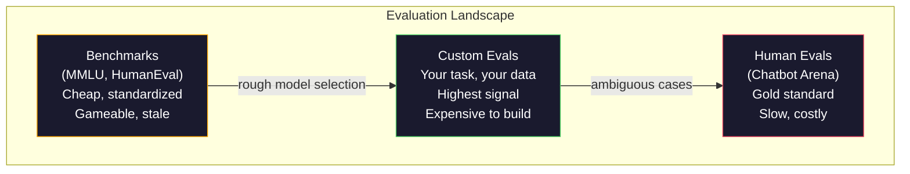
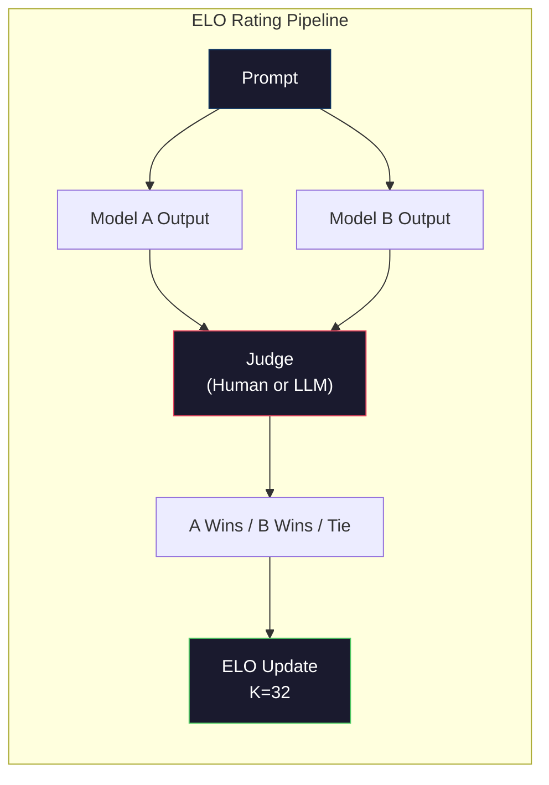

# 评估：基准测试、Evals、LM Harness

> 古德哈特定律：当一个度量成为目标时，它就不再是一个好的度量。每个前沿实验室都在博弈基准测试。MMLU 分数上升了，而模型仍然不能可靠地计数 "strawberry" 中的 R。唯一重要的评估是你的评估——在你的任务上，用你的数据。

**类型：** 构建
**语言：** Python
**前置课程：** Phase 10, 第 01-05 课（从零开始的 LLM）
**时间：** ~90 分钟

## 学习目标

- 构建一个自定义评估框架，对语言模型运行多项选择和开放式基准测试
- 解释为什么标准基准测试（MMLU、HumanEval）会饱和并且无法区分前沿模型
- 实现任务特定的评估，使用适当的度量：精确匹配、F1、BLEU 和 LLM 作为法官的评分
- 设计一个针对你特定用例的自定义评估套件，而不是仅仅依赖公共排行榜

## 问题

MMLU 于 2020 年发布，包含 57 个学科的 15,908 个问题。在三年内，前沿模型饱和了它。GPT-4 得分 86.4%。Claude 3 Opus 得分 86.8%。Llama 3 405B 得分 88.6%。排行榜压缩到 3 分的范围内，其中差异是统计噪声，而不是真实的能力差距。

与此同时，这些相同的模型在 10 岁儿童不假思索就能处理的任务上失败。Claude 3.5 Sonnet 在 MMLU 上得分 88.7%，最初不能计数 "strawberry" 中的字母——这是一项零世界知识和零推理的任务，只需要字符级迭代。HumanEval 用 164 个问题测试代码生成。模型在上面得分 90%+，但仍然生成在任何初级开发者都会捕捉到的边缘情况下崩溃的代码。

基准测试性能与真实世界可靠性之间的差距是 LLM 评估的核心问题。基准测试告诉你模型在基准测试上的表现。它们几乎不告诉你模型在你的特定任务、你的特定数据、你的特定失败模式下将如何表现。如果你正在构建客户支持机器人，MMLU 是不相关的。如果你正在构建代码助手，HumanEval 只覆盖函数级生成——它对调试、重构或跨文件解释代码没有任何说明。

你需要自定义评估。不是因为基准测试无用——它们对于粗略的模型选择是有用的——而是因为最终评估必须精确匹配你的部署条件。

## 概念

### 评估格局

评 估 有 三 类 ， 每 类 具 有 不 同 的 成 本 和 信 号 质 量。

**基准测试** 是标准化的测试套件。MMLU、HumanEval、SWE-bench、MATH、ARC、HellaSwag。你运行模型对基准测试并得到一个分数。优势：每个人都使用相同的测试，所以你可以比较模型。缺点：模型和训练数据越来越多地污染这些基准测试。实验室在包含基准问题数据上进行训练。分数上升。能力可能没有。

**自定义评估** 是你为特定用例构建的测试套件。你定义输入、预期输出和评分函数。法律文档摘要器在法律文档上评估。SQL 生成器根据你的数据库模式评估。这些创建成本高，但它们是唯一能预测生产性能的评估。

**人类评估** 使用付费标注者根据有用性、正确性、流畅性和安全性等标准评判模型输出。对于自动评分失败的任务来说，这是黄金标准。Chatbot Arena 已收集了超过 200 万个人类偏好投票，覆盖 100+ 个模型。缺点：成本（每次评判 $0.10-$2.00）和速度（数小时到数天）。



### 为什么基准测试会失灵

三种机制导致基准测试分数停止反映真实能力。

**数据污染。** 训练语料通过爬取互联网获得。基准测试问题存在于互联网上。模型在训练期间看到答案。这不是传统意义上的作弊——实验室并非有意包含基准测试数据。但网络规模的爬取使得几乎不可能排除。

**应试教学。** 实验室优化训练混合以追求基准测试性能。如果 5% 的训练混合是 MMLU 风格的多项选择，模型学会格式和答案分布。MMLU 是 4 选多项选择。模型学会答案分布在 A/B/C/D 上大致均匀，即使模型不知道答案时也有帮助。

**饱和。** 当每个前沿模型在基准测试上得分 85-90% 时，基准测试不再有区分度。剩下的 10-15% 问题可能是模糊的、标签错误或需要晦涩的领域知识。从 MMLU 的 87% 提升到 89% 可能意味着模型多记住了两个冷僻问题，而不是变得更好。

### 困惑度：快速健康检查

困惑度衡量模型对 token 序列的惊讶程度。形式上，它是指数化的平均负对数似然：

```
PPL = exp(-1/N * sum(log P(token_i | context)))
```

困惑度为 10 意味着模型平均而言，在每个 token 位置上与在 10 个选项中均匀选择一样不确定。越低越好。GPT-2 在 WikiText-103 上得到约 30 的困惑度。GPT-3 得到约 20。Llama 3 8B 得到约 7。

困惑度对于在同一测试集上比较模型是有用的，但它有盲点。一个模型可以通过擅长预测常见模式而获得低困惑度，但在罕见但重要的模式上很差。它也不能说明任何关于指令遵循、推理或事实准确性的问题。将其用作健全性检查，而不是最终裁决。

### LLM 作为法官

使用强模型来评估弱模型的输出。想法很简单：要求 GPT-4o 或 Claude Sonnet 对响应的正确性、有用性和安全性进行 1-5 分的评分。这使用 GPT-4o-mini 每次评判花费约 $0.01，并与人类判断有惊人的相关性——在大多数任务上约 80% 的一致性。

评分提示词比模型更重要。模糊的提示词（"Rate this response"）产生嘈杂的分数。带有评分标准的结构化提示词（"如果答案在事实上正确并引用了来源则评 5 分，正确但未引用来源则评 4 分，部分正确则评 3 分……"）产生一致、可重复的分数。

失败模式：法官模型表现出位置偏差（在成对比较中更偏好第一个响应）、冗长偏差（更偏好更长的响应）和自我偏好（GPT-4 对 GPT-4 输出的评分高于对等效的 Claude 输出的评分）。缓解措施：随机化顺序、对长度进行归一化、使用与被评估模型不同的法官。

### 来自成对比较的 ELO 评分

Chatbot Arena 的方法。显示来自不同模型的同一提示词的两个响应。一个人（或 LLM 法官）选择更好的一个。从数千个这样的比较中，计算每个模型的 ELO 评分——与国际象棋中使用的系统相同。

ELO 优势：相对排名比绝对评分更可靠，优雅地处理平局，并且比独立对每个输出评分需要的比较更少即收敛。截至 2026 年初，Chatbot Arena 排名显示 GPT-4o、Claude 3.5 Sonnet 和 Gemini 1.5 Pro 在顶部之间相差在 20 ELO 点以内。



### 评估框架

**lm-evaluation-harness**（EleutherAI）：标准的开源评估框架。支持 200+ 基准测试。用一个命令即可在任何 Hugging Face 模型上运行 MMLU、HellaSwag、ARC 等。被 Open LLM Leaderboard 使用。

**RAGAS**：专门用于 RAG 流水线的评估框架。衡量忠实度（答案是否匹配检索到的上下文？）、相关性（检索到的上下文是否与问题相关？）和答案正确性。

**promptfoo**：用于提示词工程的配置驱动评估。在 YAML 中定义测试用例，对多个模型运行，获取通过/失败报告。对于回归测试提示词很有用——确保提示词更改不破坏现有测试用例。

### 构建自定义评估

生产中唯一重要的评估。过程：

1. **定义任务。** 模型到底应该做什么？要精确。"回答问题"太模糊了。"给定客户投诉邮件，提取产品名称、问题类别和情感"是一个你可以评估的任务。

2. **创建测试用例。** 原型评估至少 50 个，生产至少 200+。每个测试用例是一个（输入，预期输出）对。包括边缘情况：空输入、对抗性输入、模糊输入、其他语言的输入。

3. **定义评分。** 结构化输出的精确匹配。文本相似度的 BLEU/ROUGE。开放式质量的 LLM 作为法官。提取任务的 F1。用权重组合多个指标。

4. **自动化。** 每次评估用一个命令运行。没有手动步骤。以支持随时间比较的格式存储结果。

5. **随时间跟踪。** 评估分数在孤立状态中是无意义的。你需要趋势线。最近的提示词更改后分数提升了吗？切换模型后它倒退了吗？将你的评估与你的提示词一起版本化。

| 评估类型 | 每次评判的成本 | 与人类的一致性 | 最适合 |
|-----------|------------------|----------------------|----------|
| 精确匹配 | ~$0 | 100%（当适用时） | 结构化输出、分类 |
| BLEU/ROUGE | ~$0 | ~60% | 翻译、摘要 |
| LLM 作为法官 | ~$0.01 | ~80% | 开放式生成 |
| 人类评估 | $0.10-$2.00 | N/A（即是真实基准） | 模糊、高风险的任各 |

```figure
perplexity-loss
```

## 构建它

### 第 1 步：最小评估框架

定义核心抽象。一个评估案例有一个输入、一个预期输出和一个可选的元数据字典。一个评分器接受一个预测和一个参考，并返回一个 0 到 1 之间的分数。

```python
import json
from collections import Counter

class EvalCase:
    def __init__(self, input_text, expected, metadata=None):
        self.input_text = input_text
        self.expected = expected
        self.metadata = metadata or {}

class EvalSuite:
    def __init__(self, name, cases, scorers):
        self.name = name
        self.cases = cases
        self.scorers = scorers

    def run(self, model_fn):
        results = []
        for case in self.cases:
            prediction = model_fn(case.input_text)
            scores = {}
            for scorer_name, scorer_fn in self.scorers.items():
                scores[scorer_name] = scorer_fn(prediction, case.expected)
            results.append({
                "input": case.input_text,
                "expected": case.expected,
                "prediction": prediction,
                "scores": scores,
            })
        return results
```

### 第 2 步：评分函数

构建精确匹配、token F1 和模拟的 LLM 作为法官评分器。

```python
def exact_match(prediction, expected):
    return 1.0 if prediction.strip().lower() == expected.strip().lower() else 0.0

def token_f1(prediction, expected):
    pred_tokens = set(prediction.lower().split())
    exp_tokens = set(expected.lower().split())
    if not pred_tokens or not exp_tokens:
        return 0.0
    common = pred_tokens & exp_tokens
    precision = len(common) / len(pred_tokens)
    recall = len(common) / len(exp_tokens)
    if precision + recall == 0:
        return 0.0
    return 2 * (precision * recall) / (precision + recall)

def llm_judge_simulated(prediction, expected):
    pred_words = set(prediction.lower().split())
    exp_words = set(expected.lower().split())
    if not exp_words:
        return 0.0
    overlap = len(pred_words & exp_words) / len(exp_words)
    length_penalty = min(1.0, len(prediction) / max(len(expected), 1))
    return round(overlap * 0.7 + length_penalty * 0.3, 3)
```

### 第 3 步：ELO 评分系统

使用 ELO 更新实现成对比较。这正是 Chatbot Arena 用于对模型进行排名的系统。

```python
class ELOTracker:
    def __init__(self, k=32, initial_rating=1500):
        self.ratings = {}
        self.k = k
        self.initial_rating = initial_rating
        self.history = []

    def _ensure_player(self, name):
        if name not in self.ratings:
            self.ratings[name] = self.initial_rating

    def expected_score(self, rating_a, rating_b):
        return 1 / (1 + 10 ** ((rating_b - rating_a) / 400))

    def record_match(self, player_a, player_b, outcome):
        self._ensure_player(player_a)
        self._ensure_player(player_b)

        ea = self.expected_score(self.ratings[player_a], self.ratings[player_b])
        eb = 1 - ea

        if outcome == "a":
            sa, sb = 1.0, 0.0
        elif outcome == "b":
            sa, sb = 0.0, 1.0
        else:
            sa, sb = 0.5, 0.5

        self.ratings[player_a] += self.k * (sa - ea)
        self.ratings[player_b] += self.k * (sb - eb)

        self.history.append({...})

    def leaderboard(self):
        return sorted(self.ratings.items(), key=lambda x: -x[1])
```

### 第 4-8 步

评估流水线还包括：困惑度计算（使用 token 概率）、跨评估运行的结果聚合（均值、中位数、在阈值下的通过率）、完整流水线运行（连接一切）、ELO 锦标赛（跨多轮的模型间成对比较）和不同质量级别的困惑度比较。

## 使用它

### lm-evaluation-harness（EleutherAI）

在任何模型上运行基准测试的标准工具。

```python
# pip install lm-eval
# 命令行:
# lm_eval --model hf --model_args pretrained=meta-llama/Llama-3.1-8B --tasks mmlu --batch_size 8

# Python API:
# import lm_eval
# results = lm_eval.simple_evaluate(
#     model="hf",
#     model_args="pretrained=meta-llama/Llama-3.1-8B",
#     tasks=["mmlu", "hellaswag", "arc_easy"],
#     batch_size=8,
# )
```

### promptfoo

用于提示词工程的配置驱动评估。在 YAML 中定义测试，并对多个提供商运行。

```yaml
# promptfoo.yaml
providers:
  - openai:gpt-4o-mini
  - anthropic:claude-3-haiku

prompts:
  - "Answer in one word: {{question}}"

tests:
  - vars:
      question: "What is the capital of France?"
    assert:
      - type: contains
        value: "Paris"
```

### RAGAS 用于 RAG 评估

RAGAS 衡量通用评估遗漏的内容：模型的答案是否基于检索到的上下文，而不仅仅是答案在抽象意义上是否"正确"。

## 交付成果

本课程产出 `outputs/prompt-eval-designer.md`（为任何任务设计自定义评估套件的可重用提示词）和 `outputs/skill-llm-evaluation.md`（基于任务类型、预算和延迟要求选择正确评估策略的决策框架）。

## 练习

1. 添加一个"一致性"评分器，将相同输入通过模型运行 5 次，并衡量输出匹配的频率。确定性输入上的不一致答案揭示了脆弱的提示词或高温设置。

2. 扩展 ELO 跟踪器以支持多个裁判函数并加权它们。比较当你对精确匹配赋予高权重 vs 对 F1 赋予高权重时排行榜的变化。

3. 为特定任务构建评估套件：将邮件分类到 5 个类别。创建 100 个测试用例，包括边缘情况。衡量不同"模型"的表现。

4. 实现污染检测：给定一组评估问题和一个训练语料，检查训练数据中出现评估问题的百分比。这是研究人员审计基准测试有效性的方式。

5. 构建"模型差异"工具。给定两个模型版本的评估结果，突出显示哪些特定测试用例改进、退步和保持不变。

## 关键术语

| 术语 | 人们怎么说 | 真正的含义是什么 |
|------|----------------|----------------------|
| MMLU | "基准测试" | 大规模多任务语言理解——57 个学科的 15,908 个多项选择问题，到 2025 年在 88% 以上饱和 |
| HumanEval | "代码评估" | 来自 OpenAI 的 164 个 Python 函数完成问题，仅测试独立的函数生成 |
| SWE-bench | "真正的编码评估" | 来自 12 个 Python 仓库的 2,294 个 GitHub issue，衡量包括测试生成在内的端到端 Bug 修复 |
| 困惑度 | "模型有多困惑" | exp(-avg(log P(token_i given context)))——越低意味着模型对实际 token 分配的概率越高 |
| ELO 评分 | "模型的国际象棋排名" | 从成对输赢记录计算的相对技能评分，被 Chatbot Arena 用于排名 100+ 模型 |
| LLM 作为法官 | "用 AI 给 AI 评分" | 一个强模型根据评分标准对弱模型的输出进行评分，与人类法官约 80% 一致，每次评判约 $0.01 |
| 数据污染 | "模型看到的测试" | 训练数据包括基准测试问题，虚增分数而没有提高真实能力 |
| 评估套件 | "一堆测试" | 一个版本化的（输入、预期输出、评分器）三元组集合，衡量特定能力 |
| 通过率 | "正确的百分比" | 得分超过阈值的评估案例比例——比平均分更有操作性，因为它衡量可靠性 |
| Chatbot Arena | "模型排名网站" | LMSYS 平台拥有 2M+ 人类偏好投票，通过 ELO 评分产生最受信任的 LLM 排行榜 |

## 延伸阅读

- [Hendrycks et al., 2021 -- "Measuring Massive Multitask Language Understanding"](https://arxiv.org/abs/2009.03300)——MMLU 论文，尽管其饱和仍是引用最多的 LLM 基准测试
- [Chen et al., 2021 -- "Evaluating Large Language Models Trained on Code"](https://arxiv.org/abs/2107.03374)——来自 OpenAI 的 HumanEval 论文，建立了代码生成评估方法论
- [Zheng et al., 2023 -- "Judging LLM-as-a-Judge"](https://arxiv.org/abs/2306.05685)——系统性分析使用 LLM 评估 LLM，包括位置偏差和冗长偏差发现
- [LMSYS Chatbot Arena](https://chat.lmsys.org/)——众包模型比较平台，拥有 2M+ 投票，最受信任的真实世界 LLM 排名
