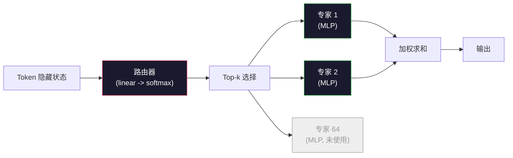

# 开放模型：架构详解

> 你在第 04 课从零搭建了一个 GPT-2 Small。2026 年的前沿开放模型属于同一家族，但有五六个具体的变化。用 RMSNorm 替代 LayerNorm，用 SwiGLU 替代 GELU，用 RoPE 替代学习式位置编码，用 GQA 或 MLA 替代全 MHA，以及超大规模的混合专家模型。你已经掌握的数学知识覆盖了其中 95% 的内容。本课将 Llama 3、DeepSeek-V3、Mixtral、Qwen 和 Gemma 并排解读，指出每种架构在哪一行产生了分歧。

**Type:** Learn
**Languages:** Python (stdlib)
**Prerequisites:** Phase 10, Lessons 04, 05, 12 (Pre-training, Scaling, Inference)
**Time:** ~45 minutes

## 学习目标

- 阅读 Llama 3、Mistral、Mixtral、Gemma 2、Qwen 2.5 和 DeepSeek-V3 的 config.json，并解释每一个字段
- 指出每个模型相对于 GPT-2 Small 的具体架构变化，并从第一性原理为其辩护
- 仅凭配置即可计算任何开放模型的参数量、KV 缓存大小和激活内存
- 在给定延迟、内存和能力约束的情况下，为部署目标选择合适的开放模型

## 问题

在第 04 课中，你写了 350 行 numpy 代码，得到了一个 GPT-2 形状的模型。Llama 3 405B 有一份 200 页的技术报告。你的直觉是这些模型是完全不同的东西。它们并不是。那 200 页描述的是同一个对象，只是加了五六项动机明确的修改，外加一千个关于扩展的实现细节。骨架——嵌入、transformer 块、注意力、MLP、归一化、头部——没有改变。

本课是一个 diff。对于每个主要开放模型系列，我们精确列出相对于 GPT-2 发生了什么变化、为什么以及代价是什么。完成之后，你就能阅读一份新的模型卡，并在脑海中将其翻译回 GPT-2 基线。

实际收益是：当 Meta 发布 Llama 5 或 DeepSeek 发布 V4 时，你不需要一个新的思维模型。你只需查看配置，看看哪些众所周知的"旋钮"被调整了，就能知道下游的影响是什么。2026 年的架构是一个有限的工具箱。每个新模型选择不同的子集。

## 概念

### 不变的核心

所有自回归开放模型共享以下内容：

- 词嵌入矩阵（vocab_size x hidden_dim）。
- N 个 decoder 块堆叠：norm、self-attention、residual、norm、MLP、residual。
- 最终 norm 和投影到 vocab_size 的线性头部（通常与嵌入权重绑定）。
- Causal mask，下一 token 交叉熵损失。

这就是形状。其余的是旋钮。

### 真正会动的六个旋钮

在每一个 2024-2026 年前沿开放模型中，相同的六个设计选择反复出现：

1. **归一化**：LayerNorm -> RMSNorm。
2. **位置编码**：学习式绝对位置 -> RoPE（外加变体：YaRN、NTK）。
3. **激活函数**：GELU -> SwiGLU（或 GeGLU）。
4. **注意力头共享**：MHA -> GQA -> MQA -> MLA。
5. **密集 vs 稀疏 MLP**：Dense -> Mixture-of-Experts。
6. **Pre-norm 位置**：Pre-norm 保留。Post-norm 已消失。

其他一切（学习率调度、数据混合、批次大小、上下文长度）存在于训练配置中，而非架构中。六个旋钮。

### 旋钮 1：RMSNorm

LayerNorm 减去均值，除以标准差，然后缩放和平移。RMSNorm 只保留缩放：

```
RMSNorm(x) = x / sqrt(mean(x^2) + eps) * gamma
```

没有减去均值，没有偏置。每个 token 少一次矩阵乘法。Zhang 和 Sennrich（2019）论证了它在机器翻译上与 LayerNorm 相当，同时快约 10%。每个现代开放模型都使用它。

代价：无。收益：少量吞吐量提升，更简洁的代码。

### 旋钮 2：RoPE

学习式位置嵌入在 GPT-2 中是一个 1024 槽的查找表。上下文第 1025 位超出了表的范围。模型无法推理超过其训练长度的内容。

旋转位置嵌入（RoPE，Su 等人 2021）通过在注意力点积之前将每个 Q 和 K 向量成对旋转来注入位置信息。旋转角度是位置的确定性函数，因此没有需要学习的东西，也没有会用完的东西。借助缩放技巧（NTK-aware 插值、YaRN），一个在 8k 上下文上训练的模型可以在推理时扩展到 128k，且精度损失不大。

```
q_rotated = rotate(q, angle(pos))
k_rotated = rotate(k, angle(pos))
score = q_rotated . k_rotated
```

每个 Llama、Mistral、Qwen、DeepSeek 和 Gemma 都使用 RoPE。Gemma 2 使用混合方案（大多数层用 RoPE，其他层用局部滑动窗口注意力）。

### 旋钮 3：SwiGLU

GPT-2 的 MLP 是 `x -> gelu(xW1 + b1) -> (...)W2 + b2`。SwiGLU（Shazeer 2020）将激活替换为门控乘积：

```
SwiGLU(x) = (xW1) * sigmoid(xW1) * xV
```

两个投影并行进行，由 Swish 激活门控。经验上每个参数的困惑度更强。Llama 2 采用了它，所有人都跟随了。MLP 的隐藏大小通常设置为使总参数量与原始密集 MLP 匹配：如果 GPT-2 使用 `ff_dim = 4 * hidden`，SwiGLU 则使用 `ff_dim = (2/3) * 4 * hidden = 8/3 * hidden`。

### 旋钮 4：注意力头共享

GPT-2 使用**多头注意力（MHA）**：每个头有自己的 Q、K、V 投影。

**多查询注意力（MQA，Shazeer 2019）**在所有头之间共享一个 K 和一个 V。将 KV 缓存减少 num_heads 倍，在典型模型上是 12 倍到 32 倍的缩减。在困难基准上精度略有下降。

**分组查询注意力（GQA，Ainslie 等人 2023）**是中间方案：G 组 Q 头共享一个 K 和一个 V。Llama 3 8B 使用 GQA，有 32 个 Q 头和 8 个 KV 头（G=8），因此 KV 缓存相比全 MHA 缩小 4 倍。

**多头潜在注意力（MLA，DeepSeek 2024）**将 K 和 V 压缩为共享的低秩潜在表示，然后按头向上投影。在保留每头表达能力的同时进一步减少 KV 缓存。DeepSeek-V2 和 V3 依赖于此来实现长上下文性能。

| 方案 | KV 头数 | KV 缓存 | 精度 |
|--------|----------|----------|----------|
| MHA    | num_heads | 完整 | 最佳 |
| GQA    | num_groups (G < num_heads) | num_heads / G 缩减 | 接近 MHA |
| MQA    | 1 | num_heads 倍缩减 | 小幅损失 |
| MLA    | 潜在表示，每头解压缩 | 比 MQA 更小 | 接近 MHA |

对于任何约 13B 参数以上的模型，GQA 或 MLA 实际上是不可或缺的。大规模全 MHA 是 KV 缓存的灾难。

### 旋钮 5：混合专家

密集 MLP 对每个 token 激活其所有参数。MoE MLP 每个块有 K 个专家和一个路由器，为每个 token 选择 top-k 专家（通常是 top-2）。只有那些专家的权重对该 token 进行前向传递。

```
router_logits = xW_r
indices, weights = top_k(router_logits, k=2)
output = sum_i weights[i] * expert[indices[i]](x)
```

吸引力在于：你可以有 64 个专家，每个 7B 大小（因此总参数量很大），而每个 token 只运行其中 2 个（因此每 token 计算量匹配一个密集 7B 模型）。Mixtral 8x7B 有 47B 总参数，但每个 token 只激活 13B。DeepSeek-V3 有 671B 总参数，但每个 token 只激活 37B。



优点：相同计算量，更多参数，更好的容量。缺点：专家内存仍然需要存在某个地方（因此推理需要比密集等效模型更多的 VRAM），路由器的负载均衡很难，在对齐阶段微调路由器本身就是一个研究领域。

### 旋钮 6：Pre-norm 保留

原始 transformer 在每个子层之后应用层归一化。自 GPT-2 以来的每个开放模型都将其放在每个子层*之前*。Pre-norm 在深层训练上严格更容易。没什么可争论的。

### 逐模型差异

以下是使所有这些具体化的表格。

| 模型 | 年份 | 总参数 | 激活参数 | Norm | 激活 | 位置 | 注意力 | MoE | 上下文 |
|-------|------|-------------|---------------|------|-----------|----------|-----------|-----|---------|
| GPT-2 Small | 2019 | 124M | 124M | LayerNorm | GELU | Learned | MHA (12 heads) | no | 1k |
| Llama 3 8B | 2024 | 8B | 8B | RMSNorm | SwiGLU | RoPE | GQA (32/8) | no | 128k |
| Llama 3 70B | 2024 | 70B | 70B | RMSNorm | SwiGLU | RoPE | GQA (64/8) | no | 128k |
| Llama 3 405B | 2024 | 405B | 405B | RMSNorm | SwiGLU | RoPE | GQA (128/16) | no | 128k |
| Mistral 7B | 2023 | 7.2B | 7.2B | RMSNorm | SwiGLU | RoPE | GQA | no | 32k |
| Mixtral 8x7B | 2023 | 47B | 13B | RMSNorm | SwiGLU | RoPE | GQA | yes (8 experts, top-2) | 32k |
| Gemma 2 9B | 2024 | 9B | 9B | RMSNorm (pre+post) | GeGLU | RoPE + sliding | GQA | no | 8k |
| Qwen 2.5 72B | 2024 | 72B | 72B | RMSNorm | SwiGLU | RoPE (YaRN) | GQA (64/8) | no | 128k |
| DeepSeek V2 236B | 2024 | 236B | 21B | RMSNorm | SwiGLU | RoPE | MLA | yes (160 experts, top-6) | 128k |
| DeepSeek V3 | 2024 | 671B | 37B | RMSNorm | SwiGLU | RoPE | MLA | yes (256 experts, top-8) | 128k |

逐列浏览。RMSNorm 是通用的。SwiGLU 或其 GeGLU 表亲是通用的。RoPE 是通用的。GQA 在 7B 以上是通用的，除非被 MLA 替代。MoE 是高端模型的差异化因素。

### 阅读 config.json

Llama 3 8B 配置：

```
{
  "hidden_size": 4096,
  "intermediate_size": 14336,
  "num_hidden_layers": 32,
  "num_attention_heads": 32,
  "num_key_value_heads": 8,
  "max_position_embeddings": 131072,
  "rope_theta": 500000.0,
  "rms_norm_eps": 1e-5,
  "vocab_size": 128256
}
```

每个字段都对应你已经实现过的内容。

- `hidden_size`：嵌入维度。
- `intermediate_size`：MLP 隐藏大小（3.5x hidden —— SwiGLU 数学）。
- `num_hidden_layers`：堆叠深度。
- `num_attention_heads`：Q 头数。
- `num_key_value_heads`：KV 头数（GQA）。
- `max_position_embeddings`：训练上下文长度。
- `rope_theta`：RoPE 基频。Meta 将其从默认的 10k 扩展到 500k，以支持长上下文外推。
- `rms_norm_eps`：数值稳定性。
- `vocab_size`：词表大小。

仅凭这些，你就可以计算总参数量、KV 缓存和峰值激活内存。参见 `code/main.py` 获取精确公式。

### 激活内存预算

在数十亿参数以上，激活主导了训练内存。预训练的经验法则（使用梯度检查点）：

```
activation_mem ~ batch_size * seq_len * hidden_size * num_layers * bytes_per_element
```

对于 Llama 3 8B，batch 1、seq 8192、BF16、32 层、hidden 4096：使用检查点时激活大约 8 GB，不使用检查点约 40 GB。这就是 flash-attention 和 ring-attention 很重要的原因——它们重写了注意力计算，使激活能够容纳在内存中。

### KV 缓存预算

在最大上下文推理时：

```
kv_cache = 2 * num_layers * num_kv_heads * head_dim * max_seq_len * bytes_per_element
```

Llama 3 8B 在 128k 上下文、BF16、head_dim = hidden / num_heads = 128 下：
`2 * 32 * 8 * 128 * 131072 * 2 = 17.2 GB` 每个序列。

8B 权重在 BF16 中是 16 GB。单个 128k 序列的 KV 缓存比权重还大。这就是推动 GQA、MLA 和 KV 缓存量化研究的内存压力。

### 每种模型何时胜出

- **单张 80GB GPU，无 MoE**：Llama 3 8B、Mistral 7B、Gemma 2 9B。易于部署，工具链广泛。
- **单节点（8x80GB），大容量**：Llama 3 70B、Qwen 2.5 72B。最高密集开放能力。
- **最大开放能力，接受 MoE 复杂性**：DeepSeek V3、Mixtral 8x22B。每个激活 FLOP 的最佳能力。
- **长上下文需求**：Llama 3（128k，RoPE 缩放），DeepSeek（MLA 优势）。
- **低延迟推理**：Gemma 2 9B（滑动窗口削减长上下文计算量）。

```figure
rmsnorm-vs-layernorm
```

## 构建它

本课的代码是一个计算器。给定任何 config.json，它会按组件打印参数量、最大上下文下的 KV 缓存、SwiGLU MLP 比率，以及关于架构的简短判断（dense / GQA / MLA / MoE）。

```python
config = {
    "hidden_size": 4096, "intermediate_size": 14336,
    "num_hidden_layers": 32, "num_attention_heads": 32,
    "num_key_value_heads": 8, "vocab_size": 128256,
    "max_position_embeddings": 131072,
}
```

脚本逐字段遍历架构，计算嵌入、注意力（含 GQA 缩减）、MLP（含 SwiGLU 扩展）、层归一化和头部的参数量。然后计算在给定上下文长度下的 KV 缓存并打印摘要。

参见 `code/main.py` 获取实现。

## 使用它

对脚本中内置的 Llama 3 8B、Mistral 7B、Mixtral 8x7B 和 DeepSeek V3 配置运行计算器。比较参数分解。注意 MoE 模型的总参数量远超密集模型，但激活参数量通常更小。注意 DeepSeek V3 的 KV 缓存比 Llama 3 405B 更小，尽管前者总参数更多——这就是 MLA 在起作用。

然后插入你本地任何模型的配置，阅读摘要，判断它是否适合你的 GPU。

## 产出

本课产出 `outputs/skill-open-model-picker.md`。给定一个部署目标（GPU 类型、VRAM、上下文长度、延迟预算）和一个任务概况（聊天、代码、推理、长上下文），它推荐一个开放模型、来自第 11 课的量化方案和来自第 12 课的推理栈，并明确阐述六个架构旋钮的依据。

## 练习

1. 从 HuggingFace 读取 Qwen 2.5 72B 的配置。从零计算总参数量。与 HF 报告的值比较，找出差异来源（头维度舍入、KV 共享因子等）。

2. DeepSeek V3 使用 256 个专家和 top-8 路由。计算激活专家与总专家的比率，并与 Mixtral 8x7B 的 8 个中 top-2 进行比较。从稀疏（25%）到更密集的稀疏（3%）的转变意味着每个 FLOP 的容量如何？

3. 计算 Llama 3 405B 在 128k 上下文下 FP8 和 BF16 的 KV 缓存。FP8 是 BF16 数值的一半。在单个 8xH100 节点上（每张 80GB = 总计 640GB，减去权重内存），可以并行推理多少个序列？

4. Gemma 2 交替使用全注意力和滑动窗口注意力层。当一半的层使用 4096 token 滑动窗口而非完整上下文时，写出 KV 缓存的数学公式。在 8k 总上下文下节省了多少内存？

5. 找一个在本课编写后发布的最前沿开放模型。识别它选择了六个旋钮中的哪些，以及是否引入了第七个旋钮。当新架构发布时，本课程会显得过时——目标是在不重建思维模型的情况下更新你的表格。

## 关键术语

| 术语 | 人们怎么说 | 实际含义 |
|------|----------------|----------------------|
| RMSNorm | "不含均值的 LayerNorm" | 仅按均方根归一化，带可学习的缩放——比 LayerNorm 更便宜且性能相当 |
| RoPE | "旋转位置编码" | 将每个 Q 和 K 向量在 2D 对中按取决于位置的角频率旋转——通过缩放技巧可外推到训练长度之外 |
| SwiGLU | "新的 MLP 激活" | 带 Swish 的门控线性单元：`(xW1) * sigmoid(xW1) * xV`——每个 2024+ 开放模型的标准 |
| GQA | "中间方案注意力" | 分组查询注意力：G 组 Q 头共享一个 K 和一个 V 头——缩小 KV 缓存而不引入 MQA 的精度损失 |
| MLA | "DeepSeek 的注意力" | 多头潜在注意力：将 K/V 压缩为共享的低秩潜在表示，按头解压缩——为大型模型实现最小的 KV 缓存 |
| MoE | "稀疏专家" | 混合专家：每个块 N 个 MLP，路由器为每个 token 选 top-k——总参数量极大，激活参数量较小 |
| Top-k 路由 | "每个 token 选 k 个专家" | 路由器为每个专家计算得分并激活最高的 k 个——典型 k 为 2（Mixtral）到 8（DeepSeek） |
| YaRN | "拉伸 RoPE" | Yet another RoPE extension——在推理时将旋转角度插值以将上下文从 8k 扩展到 128k+ |
| 滑动窗口注意力 | "不要关注所有内容" | 每个 token 只关注最近的 W 个 token——将注意力成本限制在 O(W) 每 token，用于 Gemma 2 和早期 Mistral |
| 激活参数 | "每个 token 实际运行的参数" | 对于 MoE 模型，每个 token 进行前向传递的参数量（远小于总参数量）——决定每 token FLOPs |

## 延伸阅读

- [Dubey et al., 2024 -- "The Llama 3 Herd of Models"](https://arxiv.org/abs/2407.21783) —— 密集 Llama 3 系列的架构和训练参考
- [DeepSeek-AI, 2024 -- "DeepSeek-V3 Technical Report"](https://arxiv.org/abs/2412.19437) —— MLA 加无辅助损失负载均衡加 671B MoE
- [Jiang et al., 2024 -- "Mixtral of Experts"](https://arxiv.org/abs/2401.04088) —— 经典的 MoE 开放模型论文
- [Su et al., 2021 -- "RoFormer: Enhanced Transformer with Rotary Position Embedding"](https://arxiv.org/abs/2104.09864) —— RoPE 论文
- [Shazeer, 2020 -- "GLU Variants Improve Transformer"](https://arxiv.org/abs/2002.05202) —— SwiGLU、GeGLU 及其变体
- [Ainslie et al., 2023 -- "GQA: Training Generalized Multi-Query Transformer Models"](https://arxiv.org/abs/2305.13245) —— GQA 论文
- [Gemma 2 Team, 2024 -- "Gemma 2: Improving Open Language Models at a Practical Size"](https://arxiv.org/abs/2408.00118) —— 混合全注意力+滑动注意力，pre+post-norm
- [Qwen Team, 2024 -- "Qwen 2.5 Technical Report"](https://arxiv.org/abs/2412.15115) —— YaRN 上下文扩展和长上下文训练配方
