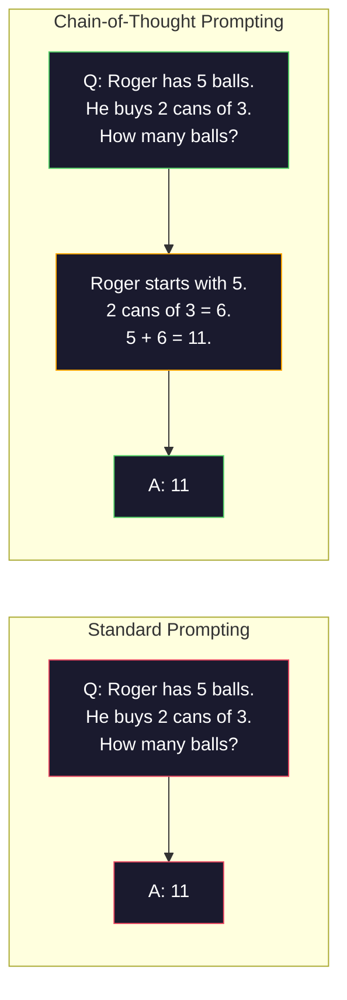
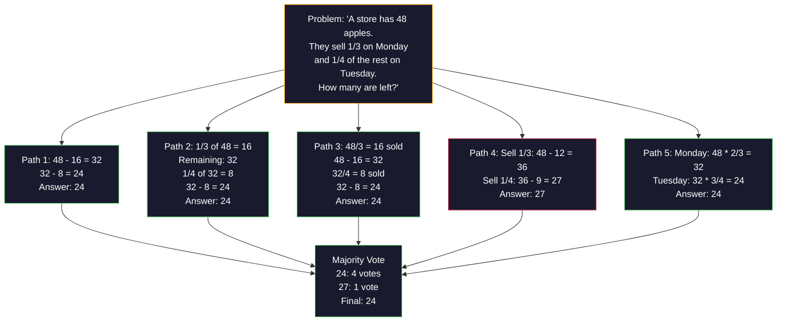
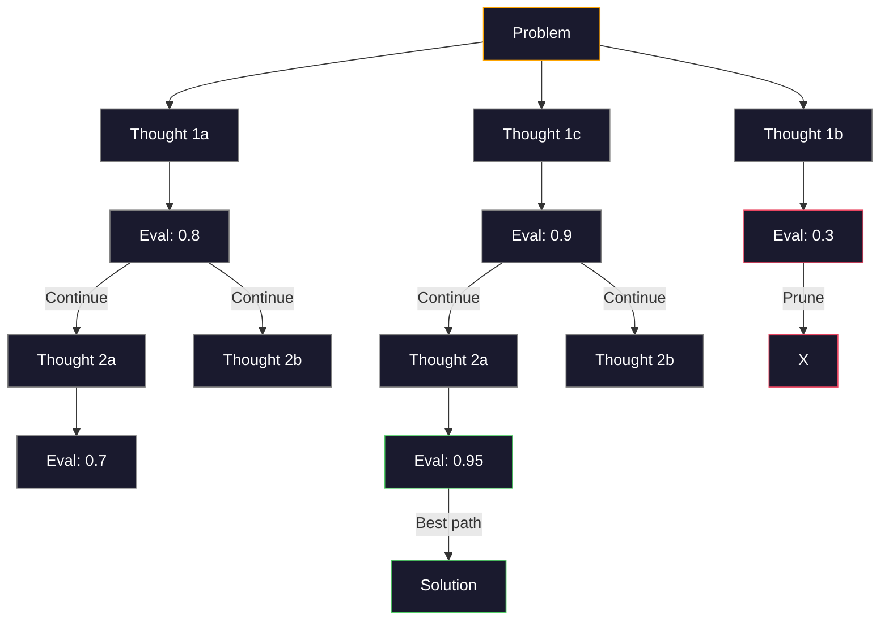

# Few-Shot, Chain-of-Thought, Tree-of-Thought（少样本、思维链、思维树）

> 告诉模型要做什么是提示（prompting）。教它如何思考是工程。同一模型、同一任务、同一数据上 78% 和 91% 准确率之间的差距，不是更好的模型，而是更好的推理策略。

**Type:** Build
**Languages:** Python
**Prerequisites:** Lesson 11.01 (Prompt Engineering)
**Time:** ~45 minutes

## Learning Objectives

- Implement few-shot prompting by selecting and formatting example demonstrations that maximize task accuracy
- Apply chain-of-thought (CoT) reasoning to improve accuracy on multi-step problems like math word problems
- Build a tree-of-thought prompt that explores multiple reasoning paths and selects the best one
- Measure the accuracy improvement from zero-shot vs few-shot vs CoT on a standard benchmark

## The Problem

你构建了一个数学辅导应用。你的提示词是："Solve this word problem." GPT-5 在 GSM8K（标准小学数学基准测试）上正确率为 94%。你以为这已经到顶了。并没有——思维链（chain-of-thought）仍然能增加 3-4 个百分点。

加入五个词——"Let's think step by step"——准确率跃升至 91%。加上几个已完成的示例，达到 95%。同一个模型、同样的温度、同样的 API 成本。唯一的区别是你给了模型一张草稿纸。

这不是取巧，而是推理的工作原理。人类不会在一次心理跳跃中解决多步骤问题，transformer 也是如此。当你强制模型生成中间 token 时，这些 token 会成为下一个 token 的上下文的一部分。每个推理步骤都为下一步提供信息。模型确实是通过计算逐步得出答案的。

但"think step by step"只是起点，而非终点。如果你采样五条推理路径并取多数投票呢？如果你让模型探索一个可能性树，评估和剪枝分支呢？如果你将推理与工具使用交错进行呢？这些不是假设，而是有实测改进的已发表技术，你将在本课中实现它们全部。

## The Concept

### Zero-Shot vs Few-Shot: When Examples Beat Instructions

零样本（zero-shot）提示只给模型任务，其他什么都不给。少样本（few-shot）提示先给它看示例。

Wei 等人（2022）在 8 个基准测试上测量了这一点。对于简单任务（如情感分类），零样本和少样本的差异在 2% 以内。对于复杂任务（如多步骤算术和符号推理），少样本将准确率提高了 10-25%。

直觉是：示例是压缩的指令。与其描述输出格式，不如直接展示它。与其解释推理过程，不如演示它。模型在匹配示例模式时，比解读抽象指令更可靠。


**少样本胜出的场景：** 对格式敏感的任务、分类、结构化提取、领域特定术语、任何需要模型匹配特定模式的任务。

**零样本胜出的场景：** 简单的事实性问题、示例会限制创造力的创造性任务、寻找好示例比编写好指令更困难的任务。

### Example Selection: Similar Beats Random

并非所有示例都一样好。选择与目标输入相似的示例，在分类任务上比随机选择高出 5-15%（Liu 等人，2022）。三个原则：

1. **语义相似性**：在嵌入空间中挑选最接近输入的示例
2. **标签多样性**：在示例中覆盖所有输出类别
3. **难度匹配**：匹配目标问题的复杂度

大多数任务的最佳示例数量是 3-5 个。低于 3 个，模型没有足够的信号来提取模式。超过 5 个，你会遇到收益递减，并且浪费上下文窗口 token。对于有许多标签的分类任务，每个标签使用一个示例。

### Chain-of-Thought: Giving Models Scratch Paper

思维链（Chain-of-Thought，CoT）提示由 Google Brain 的 Wei 等人（2022）提出。思路很简单：不只要模型给出答案，而是先让它展示推理步骤。



这为什么能在机制层面起作用？Transformer 生成的每个 token 都会成为下一个 token 的上下文。没有 CoT 时，模型必须在单次前向传播的隐藏状态中压缩所有推理。有了 CoT，模型将中间计算外部化为 token。每个推理 token 都扩展了有效计算深度。

**GSM8K 基准测试（小学数学，8500 道题）：**

| Model | Zero-Shot | Zero-Shot CoT | Few-Shot CoT |
|-------|-----------|---------------|--------------|
| GPT-4o | 78% | 91% | 95% |
| GPT-5 | 94% | 97% | 98% |
| o4-mini (reasoning) | 97% | — | — |
| Claude Opus 4.7 | 93% | 97% | 98% |
| Gemini 3 Pro | 92% | 96% | 98% |
| Llama 4 70B | 80% | 89% | 94% |
| DeepSeek-V3.1 | 89% | 94% | 96% |

**关于推理模型的说明。** 像 OpenAI 的 o-series（o3、o4-mini）和 DeepSeek-R1 这样的模型，在给出答案之前会在内部运行思维链。对推理模型添加 "Let's think step by step" 是多余的，有时甚至会产生反效果——它们已经这样做了。

两种 CoT 风格：

**零样本 CoT**：在提示词末尾附加 "Let's think step by step"。无需示例。Kojima 等人（2022）表明，这一句话就能在算术、常识和符号推理任务上提高准确率。

**少样本 CoT**：提供包含推理步骤的示例。比零样本 CoT 更有效，因为模型能看到你期望的确切推理格式。

**CoT 有害的场景**：简单的事实回忆（"What is the capital of France?"）、单步分类、速度优先于准确率的任务。CoT 每次查询会增加 50-200 token 的推理开销。对于高吞吐量、低复杂度的任务，这是浪费的成本。

### Self-Consistency: Sample Many, Vote Once

Wang 等人（2023）提出了自一致性（self-consistency）。其洞察是：单条 CoT 路径可能包含推理错误。但如果你采样 N 条独立的推理路径（temperature > 0），并对最终答案进行多数投票，错误会相互抵消。



在原始 PaLM 540B 实验中，自一致性将 GSM8K 准确率从 56.5%（单个 CoT）提高到 74.4%（N=40）。在 GPT-5 上改进很小（97% 到 98%），因为基础准确率已经饱和。该技术在基础 CoT 准确率在 60-85% 的模型上效果最好——这是单路径错误频繁但非系统性的最佳区间。对于推理模型（o-series、R1），自一致性被内置的内部采样所包含。

权衡：N 个样本意味着 N 倍的 API 成本和延迟。实际上，N=5 已能获得大部分收益。N=3 是有意义投票的最低限度。对于大多数任务，N > 10 收益递减。

### Tree-of-Thought: Branching Exploration

Yao 等人（2023）提出了思维树（Tree-of-Thought，ToT）。CoT 遵循一条线性推理路径，而 ToT 探索多条分支并在继续之前评估哪些最有前景。



ToT 有三个组成部分：

1. **思维生成（Thought generation）**：生成多个候选的下一步
2. **状态评估（State evaluation）**：对每个候选打分（可以使用 LLM 本身作为评估器）
3. **搜索算法（Search algorithm）**：在树上进行 BFS 或 DFS，剪掉低分分支

在 Game of 24 任务（用算术组合 4 个数字使之等于 24）中，GPT-4 用标准提示解出 7.3% 的问题，用 CoT 解出 4.0%（CoT 在这里实际上有害，因为搜索空间很广），用 ToT 解出 74%。

ToT 成本很高。树中的每个节点都需要一次 LLM 调用。一个分支因子为 3、深度为 3 的树最多需要 39 次 LLM 调用。仅用于搜索空间大但可评估的问题——规划、解谜、有约束的创造性问题解决。

### ReAct: Thinking + Doing

Yao 等人（2022）将推理轨迹与行动结合起来。模型在思考（生成推理）和行动（调用工具、搜索、计算）之间交替进行。

```mermaid
graph LR
    Q["Question:
What is the
population of the
country where
the Eiffel Tower
is located?"]
    T1["Thought: I need to
find which country
has the Eiffel Tower"]
    A1["Action: search
'Eiffel Tower location'"]
    O1["Observation:
Paris, France"]
    T2["Thought: Now I need
France's population"]
    A2["Action: search
'France population 2024'"]
    O2["Observation:
68.4 million"]
    T3["Thought: I have
the answer"]
    F["Answer:
68.4 million"]

    Q --> T1 --> A1 --> O1 --> T2 --> A2 --> O2 --> T3 --> F

    style Q fill:#1a1a2e,stroke:#ffa500,color:#fff
    style T1 fill:#1a1a2e,stroke:#51cf66,color:#fff
    style A1 fill:#1a1a2e,stroke:#e94560,color:#fff
    style O1 fill:#1a1a2e,stroke:#808080,color:#fff
    style T2 fill:#1a1a2e,stroke:#51cf66,color:#fff
    style A2 fill:#1a1a2e,stroke:#e94560,color:#fff
    style O2 fill:#1a1a2e,stroke:#808080,color:#fff
    style T3 fill:#1a1a2e,stroke:#51cf66,color:#fff
    style F fill:#1a1a2e,stroke:#51cf66,color:#fff
```



ReAct 在知识密集型任务上优于纯 CoT，因为它可以将推理基于真实数据。在 HotpotQA（多跳问答）上，使用 GPT-4 的 ReAct 取得了 35.1% 的精确匹配，而仅 CoT 为 29.4%。真正的力量在于推理错误可以被观察结果纠正——模型可以在执行过程中更新计划。

ReAct 是现代 AI 智能体的基础。每个智能体框架（LangChain、CrewAI、AutoGen）都实现了 Thought-Action-Observation 循环的某种变体。你将在第 14 阶段构建完整的智能体。本课涵盖的是提示模式。

### Structured Prompting: XML Tags, Delimiters, Headers

随着提示词变得复杂，结构可以防止模型混淆各个部分。三种方法：

**XML 标签**（在 Claude 上效果最好，各处通用）：
```
<context>
You are reviewing a pull request.
The codebase uses TypeScript and React.
</context>

<task>
Review the following diff for bugs, security issues, and style violations.
</task>

<diff>
{diff_content}
</diff>

<output_format>
List each issue with: file, line, severity (critical/warning/info), description.
</output_format>
```

**Markdown 标题**（通用）：
```
## Role
Senior security engineer at a fintech company.

## Task
Analyze this API endpoint for vulnerabilities.

## Input
{api_code}

## Rules
- Focus on OWASP Top 10
- Rate each finding: critical, high, medium, low
- Include remediation steps
```

**分隔符**（极简但有效）：
```
---INPUT---
{user_text}
---END INPUT---

---INSTRUCTIONS---
Summarize the above in 3 bullet points.
---END INSTRUCTIONS---
```

### Prompt Chaining: Sequential Decomposition

有些任务过于复杂，无法用单个提示词完成。提示链（prompt chaining）将它们分解为多个步骤，一个提示词的输出成为下一个的输入。


提示链优于单提示词的三个原因：

1. **每个步骤更简单**：模型处理一个专注的任务，而不是同时处理所有事情
2. **中间输出可检查**：你可以在步骤之间验证和纠正
3. **不同步骤可以使用不同模型**：提取使用便宜模型，推理使用昂贵模型

### Performance Comparison

| Technique | Best For | GSM8K Accuracy (GPT-5) | API Calls | Token Overhead | Complexity |
|-----------|----------|------------------------|-----------|----------------|------------|
| Zero-Shot | Simple tasks | 94% | 1 | None | Trivial |
| Few-Shot | Format matching | 96% | 1 | 200-500 tokens | Low |
| Zero-Shot CoT | Quick reasoning boost | 97% | 1 | 50-200 tokens | Trivial |
| Few-Shot CoT | Maximum single-call accuracy | 98% | 1 | 300-600 tokens | Low |
| Self-Consistency (N=5) | High-stakes reasoning | 98.5% | 5 | 5x token cost | Medium |
| Reasoning model (o4-mini) | Drop-in CoT replacement | 97% | 1 | hidden (2-10x internal) | Trivial |
| Tree-of-Thought | Search/planning problems | N/A (74% on Game of 24) | 10-40+ | 10-40x token cost | High |
| ReAct | Knowledge-grounded reasoning | N/A (35.1% on HotpotQA) | 3-10+ | Variable | High |
| Prompt Chaining | Complex multi-step tasks | 96% (pipeline) | 2-5 | 2-5x token cost | Medium |

正确的技术取决于三个因素：准确率要求、延迟预算和成本容忍度。对于大多数生产系统，少样本 CoT 加 3 样本自一致性回退覆盖了 90% 的用例。

## Build It

我们将构建一个数学问题求解器，将少样本提示、思维链推理和自一致性投票组合到一个流水线中。然后我们为难题添加思维树。

完整实现位于 `code/advanced_prompting.py`。以下是关键组件。

### Step 1: Few-Shot Example Store

第一个组件管理少样本示例，并为给定问题选择最相关的示例。

```python
GSM8K_EXAMPLES = [
    {
        "question": "Janet's ducks lay 16 eggs per day. She eats three for breakfast every morning and bakes muffins for her friends every day with four. She sells every egg at the farmers' market for $2. How much does she make every day at the farmers' market?",
        "reasoning": "Janet's ducks lay 16 eggs per day. She eats 3 and bakes 4, using 3 + 4 = 7 eggs. So she has 16 - 7 = 9 eggs left. She sells each for $2, so she makes 9 * 2 = $18 per day.",
        "answer": "18"
    },
    ...
]
```

每个示例有三个部分：问题、推理链和最终答案。推理链是将普通少样本示例转换为 CoT 少样本示例的关键。

### Step 2: Chain-of-Thought Prompt Builder

提示词构建器将系统消息、带有推理链的少样本示例和目标问题组装成一个提示词。

```python
def build_cot_prompt(question, examples, num_examples=3):
    system = (
        "You are a math problem solver. "
        "For each problem, show your step-by-step reasoning, "
        "then give the final numerical answer on the last line "
        "in the format: 'The answer is [number]'."
    )

    example_text = ""
    for ex in examples[:num_examples]:
        example_text += f"Q: {ex['question']}\n"
        example_text += f"A: {ex['reasoning']} The answer is {ex['answer']}.\n\n"

    user = f"{example_text}Q: {question}\nA:"
    return system, user
```

格式约束（"The answer is [number]"）至关重要。没有它，自一致性无法提取和比较不同样本的答案。

### Step 3: Self-Consistency Voting

采样 N 条推理路径，取多数答案。

```python
def self_consistency_solve(question, examples, client, model, n_samples=5):
    system, user = build_cot_prompt(question, examples)

    answers = []
    reasonings = []
    for _ in range(n_samples):
        response = client.chat.completions.create(
            model=model,
            messages=[
                {"role": "system", "content": system},
                {"role": "user", "content": user}
            ],
            temperature=0.7
        )
        text = response.choices[0].message.content
        reasonings.append(text)
        answer = extract_answer(text)
        if answer is not None:
            answers.append(answer)

    vote_counts = Counter(answers)
    best_answer = vote_counts.most_common(1)[0][0] if vote_counts else None
    confidence = vote_counts[best_answer] / len(answers) if best_answer else 0

    return best_answer, confidence, reasonings, vote_counts
```

Temperature=0.7 很重要。在 temperature=0.0 时，所有 N 个样本将完全相同，这违背了初衷。你需要足够的随机性来获得多样化的推理路径，但又不能太多以至于模型产生胡言乱语。

### Step 4: Tree-of-Thought Solver

对于线性推理失败的难题，ToT 探索多种方法并评估哪个方向最有前景。

```python
def tree_of_thought_solve(question, client, model, breadth=3, depth=3):
    thoughts = generate_initial_thoughts(question, client, model, breadth)
    scored = [(t, evaluate_thought(t, question, client, model)) for t in thoughts]
    scored.sort(key=lambda x: x[1], reverse=True)

    for current_depth in range(1, depth):
        next_thoughts = []
        for thought, score in scored[:2]:
            extensions = extend_thought(thought, question, client, model, breadth)
            for ext in extensions:
                ext_score = evaluate_thought(ext, question, client, model)
                next_thoughts.append((ext, ext_score))
        scored = sorted(next_thoughts, key=lambda x: x[1], reverse=True)

    best_thought = scored[0][0] if scored else ""
    return extract_answer(best_thought), best_thought
```

评估器本身就是一个 LLM 调用。你问模型："On a scale of 0.0 to 1.0, how promising is this reasoning path for solving the problem?" 这是 ToT 的关键洞察——模型评估自己的部分解决方案。

### Step 5: Full Pipeline

该流水线将所有技术与升级策略结合起来。

```python
def solve_with_escalation(question, examples, client, model):
    system, user = build_cot_prompt(question, examples)
    single_response = call_llm(client, model, system, user, temperature=0.0)
    single_answer = extract_answer(single_response)

    sc_answer, confidence, _, _ = self_consistency_solve(
        question, examples, client, model, n_samples=5
    )

    if confidence >= 0.8:
        return sc_answer, "self_consistency", confidence

    tot_answer, _ = tree_of_thought_solve(question, client, model)
    return tot_answer, "tree_of_thought", None
```

升级逻辑：先尝试便宜的（单个 CoT）。如果自一致性置信度低于 0.8（少于 5 个样本中的 4 个一致），升级到 ToT。这平衡了成本和准确率——大多数问题以低成本解决，难题获得更多计算。

## Use It

### With LangChain

LangChain 提供内置的提示词模板和输出解析支持，简化了少样本和 CoT 模式：

```python
from langchain_core.prompts import FewShotPromptTemplate, PromptTemplate
from langchain_openai import ChatOpenAI

example_prompt = PromptTemplate(
    input_variables=["question", "reasoning", "answer"],
    template="Q: {question}\nA: {reasoning} The answer is {answer}."
)

few_shot_prompt = FewShotPromptTemplate(
    examples=examples,
    example_prompt=example_prompt,
    suffix="Q: {input}\nA: Let's think step by step.",
    input_variables=["input"]
)

llm = ChatOpenAI(model="gpt-4o", temperature=0.7)
chain = few_shot_prompt | llm
result = chain.invoke({"input": "If a train travels 120 km in 2 hours..."})
```

LangChain 还有用于语义相似性选择的 `ExampleSelector` 类：

```python
from langchain_core.example_selectors import SemanticSimilarityExampleSelector
from langchain_openai import OpenAIEmbeddings

selector = SemanticSimilarityExampleSelector.from_examples(
    examples,
    OpenAIEmbeddings(),
    k=3
)
```

### With DSPy

DSPy 将提示策略视为可优化的模块。你不需要手工编写 CoT 提示词，而是定义一个签名让 DSPy 优化提示词：

```python
import dspy

dspy.configure(lm=dspy.LM("openai/gpt-4o", temperature=0.7))

class MathSolver(dspy.Module):
    def __init__(self):
        self.solve = dspy.ChainOfThought("question -> answer")

    def forward(self, question):
        return self.solve(question=question)

solver = MathSolver()
result = solver(question="Janet's ducks lay 16 eggs per day...")
```

DSPy 的 `ChainOfThought` 自动添加推理轨迹。`dspy.majority` 实现自一致性：

```python
result = dspy.majority(
    [solver(question=q) for _ in range(5)],
    field="answer"
)
```

### Comparison: From-Scratch vs Frameworks

| Feature | From-Scratch (this lesson) | LangChain | DSPy |
|---------|--------------------------|-----------|------|
| Control over prompt format | Full | Template-based | Automatic |
| Self-consistency | Manual voting | Manual | Built-in (`dspy.majority`) |
| Example selection | Custom logic | `ExampleSelector` | `dspy.BootstrapFewShot` |
| Tree-of-Thought | Custom tree search | Community chains | Not built-in |
| Prompt optimization | Manual iteration | Manual | Automatic compilation |
| Best for | Learning, custom pipelines | Standard workflows | Research, optimization |

## Ship It

本课生成两个产出物。

**1. 推理链提示词**（`outputs/prompt-reasoning-chain.md`）：一个可用于生产的提示词模板，用于带有自一致性的少样本 CoT。插入你的示例和问题领域即可。

**2. CoT 模式选择技能**（`outputs/skill-cot-patterns.md`）：一个基于任务类型、准确率要求和成本约束来选择正确推理技术的决策框架。

## Exercises

1. **衡量差距**：取 10 道 GSM8K 问题。分别用零样本、少样本、零样本 CoT 和少样本 CoT 求解。记录每种方法的准确率。在你的模型上，哪种技术提升最大？

2. **示例选择实验**：对相同的 10 道题，比较随机示例选择与手工挑选的相似示例。测量准确率差异。示例质量在哪个点变得比示例数量更重要？

3. **自一致性成本曲线**：在 20 道 GSM8K 问题上，以 N=1、3、5、7、10 运行自一致性。绘制准确率 vs 成本（总 token）。你的模型曲线的拐点在哪里？

4. **构建 ReAct 循环**：用计算器工具扩展流水线。当模型生成数学表达式时，用 Python 的 `eval()`（在沙箱中）执行并将结果反馈回去。测量工具驱动的推理是否优于纯 CoT。

5. **创意任务上的 ToT**：将思维树求解器适配到创意写作任务："Write a 6-word story that is both funny and sad." 使用 LLM 作为评估器。分支探索是否比单次生成产生更好的创意输出？

## Key Terms

| Term | What people say | What it actually means |
|------|----------------|----------------------|
| Few-shot prompting | "Give it some examples" | Including input-output demonstrations in the prompt to anchor the model's output format and behavior |
| Chain-of-Thought | "Make it think step by step" | Eliciting intermediate reasoning tokens that extend the model's effective computation before producing a final answer |
| Self-Consistency | "Run it multiple times" | Sampling N diverse reasoning paths at temperature > 0 and selecting the most common final answer by majority vote |
| Tree-of-Thought | "Let it explore options" | Structured search over reasoning branches where each partial solution is evaluated and only promising paths are expanded |
| ReAct | "Thinking + tool use" | Interleaving reasoning traces with external actions (search, compute, API calls) in a Thought-Action-Observation loop |
| Prompt chaining | "Break it into steps" | Decomposing a complex task into sequential prompts where each output feeds the next input |
| Zero-shot CoT | "Just add 'think step by step'" | Appending a reasoning trigger phrase to a prompt without any examples, relying on the model's latent reasoning capability |

## Further Reading

- [Chain-of-Thought Prompting Elicits Reasoning in Large Language Models](https://arxiv.org/abs/2201.11903) -- Wei et al. 2022. The original CoT paper from Google Brain. Read sections 2-3 for the core results.
- [Self-Consistency Improves Chain of Thought Reasoning in Language Models](https://arxiv.org/abs/2203.11171) -- Wang et al. 2023. The self-consistency paper. Table 1 has all the numbers you need.
- [Tree of Thoughts: Deliberate Problem Solving with Large Language Models](https://arxiv.org/abs/2305.10601) -- Yao et al. 2023. ToT paper. The Game of 24 results in section 4 are the highlight.
- [ReAct: Synergizing Reasoning and Acting in Language Models](https://arxiv.org/abs/2210.03629) -- Yao et al. 2022. The foundation of modern AI agents. Section 3 explains the Thought-Action-Observation loop.
- [Large Language Models are Zero-Shot Reasoners](https://arxiv.org/abs/2205.11916) -- Kojima et al. 2022. The "Let's think step by step" paper. Surprisingly effective for how simple it is.
- [DSPy: Compiling Declarative Language Model Calls into Self-Improving Pipelines](https://arxiv.org/abs/2310.03714) -- Khattab et al. 2023. Treats prompting as a compilation problem. Read if you want to move beyond manual prompt engineering.
- [OpenAI — Reasoning models guide](https://platform.openai.com/docs/guides/reasoning) -- vendor guidance on when chain-of-thought becomes an internal, priced-per-token "reasoning" mode versus a prompt-level trick.
- [Lightman et al., "Let's Verify Step by Step" (2023)](https://arxiv.org/abs/2305.20050) -- process reward models (PRM) that grade each step of a chain; the reasoning supervision signal that succeeds outcome-only rewards.
- [Snell et al., "Scaling LLM Test-Time Compute Optimally" (2024)](https://arxiv.org/abs/2408.03314) -- systematic study of CoT length, self-consistency sampling, and MCTS; where "think step by step" goes when accuracy matters more than latency.
